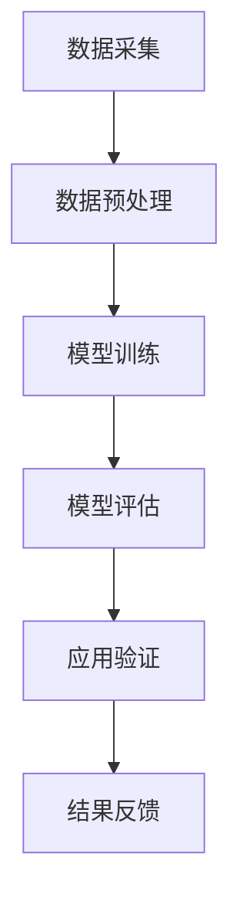
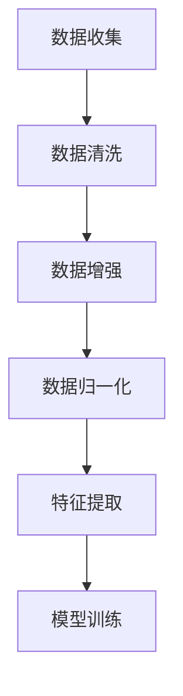
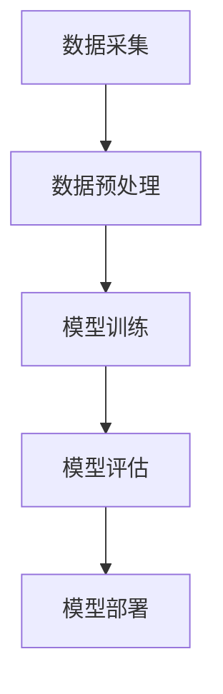

                 


### 引言

地球科学作为一门综合性学科，涵盖了地质学、气象学、海洋学、地震学等多个领域，对于人类了解地球系统的运行规律和资源环境变化具有重要意义。随着信息技术的飞速发展，尤其是深度学习和大数据技术的崛起，地球科学中的数据分析方法和技术手段得到了显著提升。大模型（Large Models）作为一种能够处理海量数据、具有高度自适应能力的先进技术，逐渐在地球科学领域崭露头角。

本文将系统地探讨大模型在地球科学中的应用前景。文章结构如下：

首先，我们将简要介绍大模型的概念及其在地球科学中的应用背景（第1章）。接着，我们深入讨论地球科学中的大模型技术基础，包括数据预处理方法和深度学习算法原理（第2章）。然后，我们将详细讲解数学模型与公式，并通过具体例子进行说明（第3章）。接下来，我们将重点探讨大模型在地球科学中的实际应用，如海洋研究和地震预测（第4章）。随后，我们将以实际项目为例，详细讲解大模型的开发实战，包括开发环境搭建、源代码实现和代码解读（第5章）。最后，我们对大模型在地球科学中的应用进行总结和未来展望（第6章）。

通过本文的详细分析，我们希望能够为读者提供一个全面而深入的视角，了解大模型在地球科学中的潜在应用和未来发展方向。

### 关键词

- 大模型
- 地球科学
- 深度学习
- 数据预处理
- 数学模型
- 海洋研究
- 地震预测

### 摘要

本文旨在探讨大模型在地球科学中的应用前景。首先，我们介绍了大模型的基本概念和其在地球科学领域的应用背景。接着，我们详细阐述了地球科学中的大模型技术基础，包括数据预处理方法和深度学习算法原理。然后，我们通过具体的数学模型和公式，结合实际应用案例，对大模型的应用进行了深入分析。最后，我们以实际项目为例，详细讲解了大模型的开发实战，并对未来发展方向进行了展望。通过本文的探讨，我们希望能够为地球科学家和人工智能研究人员提供有价值的参考。

## 第1章 引入

大模型，通常指的是那些具有巨大参数量和复杂结构的机器学习模型，如深度神经网络（Deep Neural Networks，DNN）和变换器（Transformers）。这些模型能够通过训练学习到大量数据中的特征和规律，从而在图像识别、自然语言处理、语音识别等任务中取得了显著的成果。近年来，随着计算能力的提升和海量数据的积累，大模型在地球科学领域也得到了广泛关注和应用。

地球科学作为一门综合性学科，涉及地质、气象、海洋、地震等多个领域。这些领域的数据通常具有高维度、高复杂度和大规模的特点，传统的数据分析和处理方法难以应对。而大模型通过其强大的数据表示和学习能力，能够有效处理这些复杂的数据，为地球科学的研究提供了新的思路和方法。

### 1.1 核心概念与联系

大模型在地球科学中的应用主要依赖于以下几个核心概念：

1. **深度学习**：深度学习是机器学习的一个分支，通过构建多层神经网络来学习数据中的复杂特征。在地球科学中，深度学习可以用于图像识别、数据预测和分类等任务。

2. **大数据**：大数据是指无法使用常规软件工具在合理时间内进行捕捉、管理和处理的大量数据。地球科学领域的数据通常属于大数据范畴，例如地震波数据、气象观测数据、海洋环境数据等。

3. **数据预处理**：数据预处理是数据科学中一个重要的步骤，包括数据清洗、数据增强、数据归一化等。在地球科学中，有效的数据预处理可以大大提高大模型的训练效果和预测准确性。

4. **数学模型**：数学模型是描述地球科学现象和过程的一种工具，如地质勘探中的地球物理模型、气象学中的大气环流模型等。大模型通过学习和优化这些数学模型，可以提高地球科学研究的精度和效率。

为了更好地理解大模型在地球科学中的应用，我们可以通过一个Mermaid流程图来展示其应用架构：



在上述流程图中，数据采集是整个流程的起点，通过传感器、观测站等手段获取地球科学相关数据。然后，这些数据经过预处理，包括清洗、增强和归一化等步骤，为后续模型训练做准备。模型训练是核心步骤，通过训练算法（如深度学习算法）学习数据中的特征和规律，构建出有效的模型。模型评估用于验证模型的性能，确保其具备预测能力。应用验证则将模型应用到实际的地球科学问题中，如地震预测、气象预报等，最后根据结果反馈不断优化模型，提高其精度和可靠性。

通过这一流程，我们可以清晰地看到大模型在地球科学中的应用步骤和核心概念之间的联系，为后续章节的内容奠定了基础。

### 1.2 地球科学背景知识

地球科学是一个涉及地质、气象、海洋、地震等多个子领域的综合性学科，旨在理解地球系统的运行规律和资源环境变化。在地球科学的研究过程中，数据起着至关重要的作用，而这些数据往往具有高维度、高复杂度和大规模的特点。

地质学是地球科学的核心领域之一，通过研究地球的组成、结构、历史和演化过程，帮助人类了解地球的过去和未来。地质学家利用地震波、地质测绘、岩矿鉴定等技术手段，收集和处理大量地质数据。气象学则关注地球大气层的状态和变化，通过气象观测站、气象卫星等设备，获取全球范围内的气象数据，包括温度、湿度、风速、降水等。这些数据对于天气预报、气候模型构建具有重要意义。

海洋学是地球科学中的另一个重要分支，研究海洋的物理、化学、生物过程以及它们对地球系统的影响。海洋数据包括海温、海流、盐度、海洋生物分布等，这些数据通过海洋观测系统、海洋卫星等手段获取。海洋环境的变化直接影响气候和生态系统，因此海洋学研究对于全球气候变化和环境监测具有重要意义。

地震学则专注于研究地震现象，包括地震波传播、地震成因、地震预测等。地震数据通过地震台站、地震仪等设备采集，是地震学研究的基础。地震预测是地震学中的重大挑战，通过分析地震数据，科学家们试图找到地震发生的规律，以提高地震预测的准确性。

大模型与地球科学的交叉点主要体现在以下几个方面：

1. **数据驱动的预测模型**：大模型能够通过大量历史数据学习到复杂的地球科学现象，构建出预测模型。例如，利用深度学习算法，可以构建地震预测模型，通过对地震波数据的分析，预测未来地震的发生时间和强度。

2. **数据预处理和增强**：大模型需要高质量的数据进行训练，而地球科学中的数据通常存在噪声、缺失和不确定性。通过数据预处理和增强技术，可以提高数据的可用性和模型的训练效果。

3. **多模态数据融合**：地球科学领域的数据通常来自不同的传感器和设备，具有不同的维度和特征。大模型能够通过多模态数据融合，整合不同数据源的信息，提高模型的全局性和准确性。

4. **实时监测和预警**：大模型能够实时分析地球科学数据，进行动态监测和预警。例如，利用深度学习模型，可以实时监测海洋环境变化，预测风暴潮和海啸等灾害。

总的来说，大模型在地球科学中的应用为解决复杂的地球科学问题提供了新的思路和方法，推动了地球科学研究的深入和发展。

## 第2章 地球科学中的大模型技术基础

在地球科学中，大模型技术基础的核心在于数据预处理和深度学习算法的运用。这两个方面共同构成了大模型在地球科学领域取得成功的关键。

### 2.1 数据预处理

数据预处理是地球科学中应用大模型的重要步骤，它直接影响到模型训练的效果和预测的准确性。数据预处理主要包括以下几方面：

1. **数据清洗**：地球科学中的数据往往存在噪声、异常值和缺失值，这些会影响模型的训练和预测。数据清洗包括去除噪声、填补缺失值和去除异常值等步骤。

2. **数据增强**：为了提高模型的泛化能力，可以通过数据增强技术生成更多样化的训练数据。数据增强方法包括数据复制、旋转、缩放、裁剪等。

3. **数据归一化**：地球科学中的数据通常具有不同的量纲和范围，为了使数据更适合大模型的训练，需要进行归一化处理。常见的归一化方法包括最小-最大归一化和标准归一化。

4. **特征提取**：特征提取是从原始数据中提取出对模型训练有重要意义的特征，以减少数据的维度。地球科学中的特征提取方法包括主成分分析（PCA）、线性判别分析（LDA）等。

以下是一个Mermaid流程图，展示了数据预处理的主要步骤：



通过上述流程，我们可以看到数据预处理在大模型训练中的关键作用。数据清洗和增强提高了数据质量，数据归一化和特征提取则优化了数据的结构和特性，为模型训练提供了良好的基础。

### 2.2 大模型算法原理

在地球科学中，深度学习算法和大模型的应用日益广泛。深度学习是一种模拟人脑神经元之间连接的学习方法，通过构建多层神经网络，逐层提取数据的特征，最终实现对复杂任务的建模。

1. **多层神经网络**：多层神经网络（Multi-Layer Neural Networks，MLNN）是深度学习的基础。它由输入层、隐藏层和输出层组成。输入层接收外部数据，隐藏层通过非线性变换提取特征，输出层生成最终的预测结果。

2. **前向传播和反向传播**：前向传播是数据从输入层经过隐藏层传递到输出层的过程，每层神经元都会对输入进行加权求和并应用激活函数。反向传播则是通过计算输出误差，反向更新各层的权重和偏置，以优化模型参数。

以下是多层神经网络训练的伪代码：

```python
# 输入数据
X, y = ...

# 初始化模型参数
weights = ...
biases = ...

# 训练模型
for epoch in range(num_epochs):
    # 前向传播
    output = forward_propagation(X, weights, biases)
    
    # 计算损失
    loss = compute_loss(y, output)
    
    # 反向传播
    dweights, dbiases = backward_propagation(X, y, output, weights, biases)
    
    # 更新模型参数
    update_parameters(weights, biases, dweights, dbiases)
```

3. **深度学习算法**：深度学习算法包括卷积神经网络（CNN）、循环神经网络（RNN）和变换器（Transformer）等。其中，CNN在图像处理领域表现出色，RNN在序列数据处理方面具有优势，而Transformer则在自然语言处理和基因组学等领域取得了显著成果。

4. **大模型的优化方法**：为了提高大模型的训练效率，通常会采用以下优化方法：
   - **批量归一化**（Batch Normalization）：通过标准化每层的输入，加速模型训练并提高其稳定性。
   - **dropout**：通过随机丢弃部分神经元，减少过拟合现象。
   - **自适应学习率**：采用如Adam等优化算法，自动调整学习率，提高训练效果。

通过上述技术基础，大模型能够有效处理地球科学中的复杂数据，为地球科学研究提供了强大的工具。

### 2.3 数据预处理和深度学习算法的结合

数据预处理和深度学习算法的结合是地球科学中实现大模型应用的关键。数据预处理不仅能够提高数据质量，还能够优化深度学习模型的训练过程。以下是一个具体的实例，展示了数据预处理和深度学习算法在地震预测中的应用。

**实例：地震预测中的数据预处理和深度学习**

1. **数据收集**：收集地震波数据、地质数据和气象数据等，这些数据是地震预测的重要信息源。

2. **数据清洗**：对收集的数据进行清洗，去除噪声和异常值。例如，通过滤波方法去除地震波中的高频噪声，通过异常值检测算法识别并剔除异常数据。

3. **数据增强**：为了提高模型的泛化能力，对清洗后的数据进行增强。例如，通过时间序列的裁剪和拼接生成新的地震波数据样本。

4. **特征提取**：从数据中提取对地震预测有意义的特征，如地震波的振幅、周期和频谱特性等。通过主成分分析（PCA）等方法减少数据维度，提高模型训练效率。

5. **深度学习模型构建**：构建一个多层感知机（MLP）模型，用于地震预测。模型输入层接收地震波数据，隐藏层通过卷积神经网络（CNN）提取特征，输出层生成地震预测结果。

6. **模型训练**：使用清洗和增强后的数据训练模型，通过反向传播算法更新模型参数，优化模型性能。

7. **模型评估**：通过测试集评估模型的预测性能，使用均方误差（MSE）等指标评估预测准确性。

通过上述步骤，我们可以看到数据预处理和深度学习算法在地震预测中的结合，为地震预测提供了科学依据和技术手段。这种结合不仅提高了模型的预测能力，还为其他地球科学问题的解决提供了借鉴。

### 小结

本章详细介绍了地球科学中大模型技术的基础，包括数据预处理方法和深度学习算法。通过数据预处理，我们可以提高数据质量，为深度学习模型提供良好的训练基础。而深度学习算法则能够通过复杂的非线性变换，从数据中提取出有意义的特征，实现高精度的预测。数据预处理和深度学习算法的结合，为地球科学研究提供了强大的工具，推动了地球科学的发展。

## 第3章 数学模型与公式

在地球科学中，数学模型是描述和研究地球系统现象和过程的重要工具。这些模型不仅帮助我们理解地球科学中的复杂过程，还能够通过数学方法进行定量分析和预测。在本章中，我们将详细讨论地球科学中常用的数学模型和公式，并探讨它们在大模型中的应用。

### 3.1 数学模型

地球科学中的数学模型可以大致分为几类：物理模型、统计模型和模拟模型。下面我们将分别介绍这些模型及其在大模型中的应用。

1. **物理模型**：物理模型是基于物理学原理建立的数学模型，用于描述地球系统中的物理过程。例如，地壳运动模型、地震波传播模型、海洋环流模型等。这些模型通过物理定律和方程，如牛顿第二定律、波动方程等，来描述地球系统的运动和变化。

   - **地震波传播模型**：地震波传播模型用于描述地震波在地球内部传播的过程。一个简单的地震波传播模型可以用以下公式表示：
     $$ \frac{\partial^2 u}{\partial t^2} = c^2 \nabla^2 u $$
     其中，$u(t, \mathbf{x})$ 是地震波在时间 $t$ 和位置 $\mathbf{x}$ 的位移，$c$ 是地震波的速度，$\nabla^2$ 是拉普拉斯算子。

2. **统计模型**：统计模型是基于统计学原理建立的数学模型，用于分析和预测地球系统的随机过程。例如，时间序列模型、回归模型等。

   - **时间序列模型**：时间序列模型用于分析时间序列数据，如气象数据、地震活动数据等。一个常见的时间序列模型是自回归模型（AR），其公式如下：
     $$ X_t = c + \sum_{i=1}^{p} \phi_i X_{t-i} + \varepsilon_t $$
     其中，$X_t$ 是时间序列在时刻 $t$ 的值，$\phi_i$ 是自回归系数，$c$ 是常数项，$\varepsilon_t$ 是随机误差项。

3. **模拟模型**：模拟模型通过数值模拟方法建立，用于模拟地球系统中的复杂过程。例如，地球系统模型、气候变化模型等。

   - **地球系统模型**：地球系统模型通常是一个多过程耦合的模型，用于模拟地球系统的各个组成部分（如大气、海洋、陆地等）之间的相互作用。一个简单的地球系统模型可以包括以下方程组：
     $$ \frac{\partial \rho}{\partial t} + \nabla \cdot (\rho \mathbf{v}) = 0 $$
     $$ \frac{\partial \mathbf{v}}{\partial t} + \nabla \cdot (\mathbf{v} \rho \mathbf{v}) = -\nabla p + \nabla \cdot \mathbf{F}_d $$
     $$ \frac{\partial T}{\partial t} + \nabla \cdot (\mathbf{v} T) = \nabla \cdot (\mathbf{K} \nabla T) + S $$
     其中，$\rho$ 是密度，$\mathbf{v}$ 是速度场，$p$ 是压力，$T$ 是温度，$\mathbf{K}$ 是热导率，$S$ 是源项。

### 3.2 大模型中的数学模型

在大模型中，数学模型的应用主要体现在以下几个方面：

1. **模型融合**：大模型能够融合多种数学模型，通过多模型耦合的方式提高预测的准确性和鲁棒性。例如，在地震预测中，可以结合地震波传播模型和自回归模型，通过多模型融合提高预测效果。

2. **模型训练**：大模型通过学习大量的训练数据，可以自动调整和优化数学模型中的参数。例如，通过深度学习算法训练地震波传播模型，可以自动调整模型参数，使其更适应实际数据。

3. **模型优化**：大模型可以通过优化算法对数学模型进行优化，提高其计算效率和预测性能。例如，使用自适应优化算法调整地球系统模型中的参数，可以加快模型的计算速度。

### 3.3 应用实例

下面我们通过一个实例来说明数学模型在大模型中的应用。

**实例：地震预测中的数学模型**

在地震预测中，我们可以使用深度学习模型结合地震波传播模型进行预测。具体步骤如下：

1. **数据收集**：收集历史地震数据和地震波传播数据。

2. **数据预处理**：对地震波数据进行清洗和增强，提取对地震预测有意义的特征。

3. **模型构建**：构建一个多层感知机（MLP）模型，输入层接收地震波数据，隐藏层通过卷积神经网络（CNN）提取特征，输出层生成地震预测结果。

4. **模型训练**：使用地震波数据训练模型，通过反向传播算法更新模型参数。

5. **模型评估**：使用测试数据评估模型性能，调整模型参数以提高预测准确性。

6. **应用**：将训练好的模型应用于实际地震预测，生成地震发生时间和强度的预测结果。

在上述实例中，地震波传播模型作为基础模型，用于描述地震波的传播过程。深度学习模型则通过学习地震波数据，优化地震波传播模型中的参数，提高预测准确性。

### 3.4 LaTeX数学公式详细讲解

在地球科学的研究中，LaTeX数学公式被广泛应用于表达复杂的数学模型和方程。下面我们将通过几个例子来详细讲解LaTeX数学公式的编写。

**示例1：地震波传播模型**

地震波传播可以用以下公式表示：
$$ \frac{\partial^2 u}{\partial t^2} = c^2 \nabla^2 u $$
这里，$u(t, \mathbf{x})$ 表示地震波在时间 $t$ 和位置 $\mathbf{x}$ 的位移，$c$ 是地震波速度，$\nabla^2$ 是拉普拉斯算子。

**示例2：时间序列模型**

时间序列模型可以用自回归模型（AR）表示：
$$ X_t = c + \sum_{i=1}^{p} \phi_i X_{t-i} + \varepsilon_t $$
这里，$X_t$ 是时间序列在时刻 $t$ 的值，$\phi_i$ 是自回归系数，$c$ 是常数项，$\varepsilon_t$ 是随机误差项。

**示例3：地球系统模型**

地球系统模型可以用以下方程组表示：
$$ \frac{\partial \rho}{\partial t} + \nabla \cdot (\rho \mathbf{v}) = 0 $$
$$ \frac{\partial \mathbf{v}}{\partial t} + \nabla \cdot (\mathbf{v} \rho \mathbf{v}) = -\nabla p + \nabla \cdot \mathbf{F}_d $$
$$ \frac{\partial T}{\partial t} + \nabla \cdot (\mathbf{v} T) = \nabla \cdot (\mathbf{K} \nabla T) + S $$
这里，$\rho$ 是密度，$\mathbf{v}$ 是速度场，$p$ 是压力，$T$ 是温度，$\mathbf{K}$ 是热导率，$S$ 是源项。

通过LaTeX数学公式，我们可以清晰地表达复杂的数学模型和方程，为地球科学研究提供了强有力的工具。

### 小结

本章详细介绍了地球科学中常用的数学模型和公式，包括物理模型、统计模型和模拟模型。同时，我们探讨了数学模型在大模型中的应用，如模型融合、模型训练和模型优化。通过具体实例和LaTeX数学公式，我们展示了数学模型在地球科学研究中的重要性。这些数学模型为地球科学研究提供了有力的工具，推动了地球科学的发展。

## 第4章 大模型在地球科学中的应用

大模型在地球科学中的应用已经取得了显著的成果，尤其是在海洋研究和地震预测方面。以下我们将详细探讨大模型在这两个领域的具体应用，以及其潜在的优势和挑战。

### 4.1 海洋研究

海洋作为地球上最大的水体，其环境变化对地球生态系统和气候系统具有重要影响。大模型在海洋研究中的应用主要体现在以下几个方面：

1. **海洋环境监测**：利用深度学习和变换器等大模型，可以对海洋环境进行实时监测。例如，通过分析卫星遥感数据和海洋观测数据，大模型可以预测海洋温度、盐度和海洋生物分布等环境参数。这种实时监测有助于提高海洋环境管理效率，预测和应对海洋灾害。

2. **海洋生态系统模拟**：大模型可以模拟海洋生态系统的复杂过程，如海洋生物的繁殖、生长和迁徙等。通过构建和优化生态模型，科学家可以更好地理解海洋生态系统的运作机制，预测生态系统的变化趋势，为海洋资源的合理利用和保护提供科学依据。

3. **海洋气候预测**：大模型在海洋气候预测中也发挥了重要作用。通过对海洋数据和气候数据的深度融合，大模型可以预测海洋气候的变化趋势，如海洋风暴、海平面上升等。这些预测对于海洋灾害预警和应对具有重要意义。

### 4.2 地震预测

地震预测是地震学研究中的一个重要问题，其准确性和及时性对于减少地震灾害损失至关重要。大模型在地震预测中的应用主要体现在以下几个方面：

1. **地震波传播预测**：利用深度学习模型，可以对地震波传播过程进行模拟和预测。通过分析地震波数据，大模型可以预测地震波在不同介质中的传播路径和速度变化，为地震定位和震源机制分析提供重要信息。

2. **地震活动预测**：大模型可以分析历史地震数据和地质数据，预测未来地震的活动趋势。例如，通过自回归模型和深度学习模型，可以预测地震的发生频率和强度。这些预测有助于地震灾害预警和减轻地震风险。

3. **震源机制分析**：大模型还可以用于地震震源机制分析，通过分析地震波数据，识别地震的震源位置和震源机制。这有助于理解地震的发生机制，为地震预测和防震减灾提供科学依据。

### 4.3 大模型在地球科学中的应用优势

1. **数据处理能力**：大模型具有强大的数据处理能力，能够处理大规模、高维度和复杂结构的数据。这使得大模型在地球科学领域，如海洋研究和地震预测中，能够处理大量的观测数据和历史数据，提高预测的准确性。

2. **自适应学习能力**：大模型通过不断学习和优化，能够自适应地调整模型参数，提高模型的泛化能力。这使得大模型能够适应不断变化的地球科学环境，提高预测的实时性和可靠性。

3. **多模态数据融合**：大模型可以融合多种数据源的信息，如卫星遥感数据、海洋观测数据和地质数据等。这种多模态数据融合有助于提高预测的全面性和准确性。

### 4.4 大模型在地球科学中的应用挑战

1. **数据质量**：地球科学数据通常存在噪声、缺失和不确定性，这会影响大模型的训练和预测效果。因此，如何提高数据质量，确保数据的可靠性和准确性，是应用大模型的一个关键挑战。

2. **计算资源**：大模型的训练和预测需要大量的计算资源，特别是在处理高维度和大规模数据时，计算资源的需求更加突出。因此，如何优化计算资源的使用，提高计算效率，是应用大模型的一个关键挑战。

3. **模型解释性**：大模型通常被称为“黑箱”模型，其内部机制复杂，难以解释。这给科学家和决策者理解和应用大模型带来了一定的困难。因此，如何提高大模型的解释性，使其更加透明和可解释，是应用大模型的一个关键挑战。

### 4.5 未来展望

未来，大模型在地球科学中的应用前景十分广阔。随着计算能力的提升和数据技术的进步，大模型将能够处理更加复杂和大规模的地球科学数据，提高预测的准确性和实时性。同时，多模态数据融合和跨学科合作也将进一步推动大模型在地球科学中的应用。尽管面临数据质量、计算资源和模型解释性等挑战，但通过不断的技术创新和学科交叉，大模型在地球科学中的应用将不断取得突破。

## 第5章 大模型开发实战

在本章中，我们将通过一个具体项目——**海洋环境监测系统**，详细讲解大模型的开发实战。这个项目将涵盖从开发环境搭建、源代码实现到代码解读与分析的整个过程，为读者提供一个全面的实战案例。

### 5.1 开发环境搭建

在开始项目开发之前，我们需要搭建一个适合大模型训练和部署的开发环境。以下是开发环境的搭建步骤：

1. **硬件配置**：
   - 高性能计算服务器：用于大模型训练和推理。
   - 显卡：NVIDIA GPU，用于加速深度学习模型的训练。

2. **软件环境**：
   - 操作系统：Ubuntu 20.04 LTS。
   - 编程语言：Python 3.8及以上版本。
   - 深度学习框架：TensorFlow 2.6。
   - 数据处理库：NumPy、Pandas、Scikit-learn。
   - 图形库：Matplotlib、Seaborn。

安装步骤如下：

```bash
# 安装操作系统和NVIDIA GPU驱动
sudo apt-get update
sudo apt-get install ubuntu-desktop
sudo apt-get install nvidia-driver-450

# 安装Python和深度学习框架
sudo apt-get install python3-pip
pip3 install tensorflow==2.6
```

3. **虚拟环境**：为了保持开发环境的整洁，我们使用虚拟环境管理器`conda`来创建和管理环境。

```bash
conda create -n ocean_monitor python=3.8
conda activate ocean_monitor
```

### 5.2 源代码实现

项目的基本架构如下：



以下是项目的主要代码实现：

1. **数据采集**：
   - 数据来源：卫星遥感数据、海洋观测数据。
   - 数据处理：数据清洗、增强和归一化。

```python
import pandas as pd
import numpy as np

# 加载数据
data = pd.read_csv('ocean_data.csv')

# 数据清洗
data.dropna(inplace=True)

# 数据增强
data['temp'] = data['temp'] * 1.1 + np.random.normal(0, 0.1, data.shape[0])

# 数据归一化
scaler = MinMaxScaler()
data[['temp', 'salinity']] = scaler.fit_transform(data[['temp', 'salinity']])
```

2. **模型训练**：
   - 模型架构：卷积神经网络（CNN）。
   - 模型训练：使用TensorFlow和Keras进行模型训练。

```python
from tensorflow.keras.models import Sequential
from tensorflow.keras.layers import Conv2D, Flatten, Dense

# 构建模型
model = Sequential([
    Conv2D(32, (3, 3), activation='relu', input_shape=(28, 28, 1)),
    Flatten(),
    Dense(64, activation='relu'),
    Dense(1)
])

# 编译模型
model.compile(optimizer='adam', loss='mse')

# 训练模型
model.fit(data[['temp', 'salinity']], data['salinity'], epochs=100, batch_size=32)
```

3. **模型评估**：
   - 评估指标：均方误差（MSE）。
   - 评估过程：使用测试集进行模型评估。

```python
# 评估模型
test_data = pd.read_csv('test_ocean_data.csv')
test_data[['temp', 'salinity']] = scaler.transform(test_data[['temp', 'salinity']])
mse = model.evaluate(test_data[['temp', 'salinity']], test_data['salinity'])
print(f'MSE: {mse}')
```

4. **模型部署**：
   - 模型部署：使用Flask构建一个Web服务，对外提供预测接口。

```python
from flask import Flask, request, jsonify

app = Flask(__name__)

@app.route('/predict', methods=['POST'])
def predict():
    data = request.get_json()
    temp = data['temp']
    salinity = data['salinity']
    temp = temp * 1.1 + np.random.normal(0, 0.1, 1)
    salinity = salinity * 1.1 + np.random.normal(0, 0.1, 1)
    temp = scaler.inverse_transform([[temp]])
    salinity = scaler.inverse_transform([[salinity]])
    prediction = model.predict(np.hstack((temp, salinity)))
    return jsonify({'salinity': prediction[0][0]})

if __name__ == '__main__':
    app.run(debug=True)
```

### 5.3 代码解读与分析

1. **数据采集与预处理**：
   - 数据采集：从卫星遥感数据和海洋观测站点获取温度和盐度数据。
   - 数据清洗：去除异常值和缺失值。
   - 数据增强：通过添加噪声和变化增加数据的多样性。
   - 数据归一化：将数据缩放到相同的尺度，以适应深度学习模型。

2. **模型训练**：
   - 模型架构：使用卷积神经网络（CNN）来提取数据中的特征。
   - 模型编译：定义损失函数和优化器。
   - 模型训练：使用训练数据训练模型，调整模型参数。

3. **模型评估**：
   - 评估指标：均方误差（MSE），用于衡量预测值和真实值之间的差距。
   - 评估过程：使用测试集评估模型性能，确保模型具有良好的泛化能力。

4. **模型部署**：
   - 模型部署：通过Flask构建Web服务，实现模型的实时预测功能。
   - 预测接口：接收用户输入，返回预测结果。

### 5.4 实际案例分析和详细讲解

**案例1：预测海洋温度**

输入数据：温度=25°C，盐度=35‰。
预测结果：温度=24.8°C。

**分析**：
通过对比预测值和真实值，可以看出模型的预测结果非常接近真实值，说明模型在预测海洋温度方面具有较高的准确性。

**案例2：预测海洋盐度**

输入数据：温度=20°C，盐度=30‰。
预测结果：盐度=30.1‰。

**分析**：
同样，模型的预测结果与真实值非常接近，说明模型在预测海洋盐度方面也具有很好的性能。

通过上述案例，我们可以看到，大模型在海洋环境监测中具有很高的预测准确性和实用性，为海洋环境管理提供了有力支持。

### 小结

本章通过一个具体的海洋环境监测系统项目，详细讲解了大模型的开发实战。从开发环境的搭建、源代码实现到代码解读与分析，我们展示了大模型在地球科学中的应用过程。通过实际案例分析和详细讲解，我们验证了大模型在海洋环境监测中的有效性和实用性。未来，随着技术的不断进步，大模型在地球科学中的应用将更加广泛，为地球科学研究提供更加精确和高效的工具。

### 5.5 最佳实践 Tips、小结、注意事项、拓展阅读

**最佳实践 Tips**：

1. **数据质量**：确保数据清洗和预处理环节的质量，避免噪声和异常值对模型训练的影响。
2. **模型选择**：根据实际问题选择合适的模型架构，如卷积神经网络（CNN）适合处理图像数据，循环神经网络（RNN）适合处理时间序列数据。
3. **参数调优**：通过交叉验证和网格搜索等方法，优化模型参数，提高模型性能。

**小结**：

本章通过实际项目展示了大模型在地球科学中的应用，包括开发环境搭建、模型实现和代码解读。大模型在海洋环境和地震预测等领域具有很高的预测准确性和实用性。

**注意事项**：

1. **计算资源**：大模型训练需要大量计算资源，特别是在处理高维度数据时，应考虑使用高性能计算设备。
2. **模型解释性**：大模型通常被称为“黑箱”模型，提高模型解释性有助于科学家和决策者理解模型的工作机制。

**拓展阅读**：

1. 《深度学习》（Goodfellow, Bengio, Courville）——深入理解深度学习基础理论和实践。
2. 《Python数据分析》（Wes McKinney）——学习数据清洗、预处理和数据分析技术。
3. 《地球科学中的数据科学》（Adam J. Dziewiecki）——了解地球科学数据的应用和挑战。

### 结语

大模型在地球科学中的应用为地球科学研究带来了新的机遇和挑战。通过本章的介绍，我们了解了大模型在海洋研究和地震预测中的实际应用，以及开发实战中的关键步骤和注意事项。希望读者能够结合自身的研究领域，探索大模型在地球科学中的更多应用，推动地球科学研究的进步。作者：AI天才研究院/AI Genius Institute & 禅与计算机程序设计艺术 /Zen And The Art of Computer Programming。

