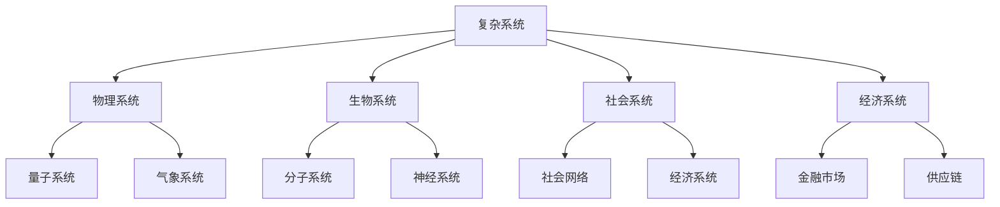

                 


### 《大模型在复杂系统模拟中的应用》

---

## 引言

随着计算机技术和人工智能领域的迅猛发展，复杂系统模拟已成为现代科学研究的重要手段。复杂系统模拟涉及到多学科交叉，包括物理学、生物学、经济学、社会网络等，其核心在于理解和预测系统的动态行为。在此背景下，大模型——一种能够处理大规模数据和高维度的复杂算法——逐渐崭露头角，成为复杂系统模拟的重要工具。

大模型的出现为复杂系统模拟带来了新的机遇和挑战。本文旨在探讨大模型在复杂系统模拟中的应用，分析其优势与挑战，并展望未来发展趋势。文章将分为七个部分进行阐述：

1. **复杂系统模拟概述**：介绍复杂系统的定义、特性以及模拟的重要性。
2. **大模型基础知识**：介绍大模型的概述、分类与特点、发展历程。
3. **大模型与复杂系统模拟的关系**：探讨大模型在复杂系统模拟中的应用、优势与挑战。
4. **大模型在物理系统模拟中的应用**：以量子力学和气象系统为例进行详细阐述。
5. **大模型在生物系统模拟中的应用**：以分子动力学和神经系统为例进行详细阐述。
6. **大模型在社会系统模拟中的应用**：以社会网络和经济系统为例进行详细阐述。
7. **大模型模拟实例与展望**：总结案例分析，展望大模型模拟的未来发展趋势。

通过以上结构的分析推理，我们将逐步深入探讨大模型在复杂系统模拟中的应用，以期为读者提供全面、深入的见解。

---

### 关键词

- 复杂系统模拟
- 大模型
- 量子力学模拟
- 分子动力学
- 社会网络分析
- 经济系统模拟
- 模拟算法

### 摘要

本文探讨了复杂系统模拟与大模型之间的紧密联系，分析了大模型在复杂系统模拟中的重要性。文章首先介绍了复杂系统的定义、特性及其模拟的重要性，然后详细阐述了大模型的概述、分类与特点、发展历程。随后，文章深入探讨了大模型在物理系统、生物系统和社会系统模拟中的应用，通过具体实例展示了大模型的优势与挑战。最后，文章总结了案例分析，展望了未来大模型模拟的发展趋势。本文旨在为读者提供全面、深入的见解，以推动复杂系统模拟与大模型研究的进一步发展。

---

## 第一部分：复杂系统模拟与大模型概述

### 第1章：复杂系统模拟概述

#### 1.1 复杂系统定义

复杂系统是由大量相互关联的组成部分构成的系统，这些部分在相互作用过程中展现出整体行为，且其行为通常难以用简单的因果关系或线性关系来描述。根据Holmes和Macy（2010）的研究，复杂系统具有以下几个基本特征：

1. **多样性**：系统由多种不同类型的组件组成。
2. **相互依赖性**：系统中的不同组件之间存在复杂的相互作用关系。
3. **非线性和非线性反馈**：系统行为通常不是线性的，且存在多种反馈机制，这些反馈可能会引起行为的非线性变化。
4. **适应性**：系统能够根据外部环境和内部状态的变化调整自身结构或行为。

举例来说，社会网络系统是一个典型的复杂系统，其中每个个体都可以被视为一个节点，个体之间的互动关系构成了网络的边。网络系统的行为和演化不仅受到节点个体的行为影响，还受到网络结构的调控。

#### 1.2 复杂系统的特性

复杂系统的特性可以分为内在特性和外在特性两个方面：

1. **内在特性**：
   - **自组织性**：系统可以在没有外部控制的情况下自发地形成复杂结构。
   - **动态性**：系统行为随着时间不断变化，且可能呈现出非平稳性。
   - **适应性**：系统具有适应环境变化的能力。

2. **外在特性**：
   - **涌现性**：系统整体行为不能直接从其组成部分的行为推导出来，而是由组成部分的相互作用产生的。
   - **混沌性**：系统可能表现出对初始条件的极端敏感性，即微小的变化可能导致巨大的差异。

例如，在气象系统中，即使初始条件只有微小的差异，经过长时间演化后，天气状况也可能出现显著不同。这种现象被称为“蝴蝶效应”。

#### 1.3 复杂系统模拟的重要性

复杂系统模拟在科学研究和实际应用中具有重要作用：

1. **科学理解**：通过模拟，科学家可以更深入地理解复杂系统的行为规律，揭示系统的内在机制和涌现特性。
2. **预测和预测**：模拟可以帮助预测系统在特定条件下的行为，提供决策支持。
3. **优化和设计**：通过模拟，可以优化系统设计和参数调整，提高系统效率和稳定性。

例如，在交通系统规划中，模拟可以帮助预测交通流量和拥堵情况，从而优化交通信号配置和道路建设。

总之，复杂系统模拟为研究复杂系统的动态行为提供了强大的工具，有助于推动科学技术的进步和实际应用的发展。

### 第2章：大模型基础知识

#### 2.1 大模型概述

大模型，顾名思义，是指能够处理大规模数据和高维度的复杂算法。这些模型通常基于深度学习技术，通过大量训练数据来学习复杂的非线性关系和模式。大模型的出现极大地提升了计算机处理复杂问题的能力，其核心特点包括：

1. **数据处理能力**：大模型能够处理海量数据，从中提取有用信息。
2. **非线性建模能力**：大模型能够捕捉和处理复杂的非线性关系。
3. **泛化能力**：大模型通过训练能够在不同领域和任务中表现出良好的泛化能力。

例如，Google的BERT模型是一个典型的大模型，它通过在大量文本数据上训练，能够理解自然语言中的复杂结构和语义关系。

#### 2.2 大模型的分类与特点

大模型可以根据应用领域和模型结构的不同进行分类，常见的分类方法包括：

1. **按应用领域分类**：
   - **计算机视觉**：如卷积神经网络（CNN）。
   - **自然语言处理**：如Transformer模型、BERT模型。
   - **语音识别**：如深度神经网络（DNN）。
   - **强化学习**：如深度确定性策略梯度（DDPG）。

2. **按模型结构分类**：
   - **深度神经网络**：包括多层感知机（MLP）、卷积神经网络（CNN）、循环神经网络（RNN）。
   - **生成对抗网络**（GAN）：由生成器和判别器组成，用于生成高质量的数据。
   - **变分自编码器**（VAE）：用于数据生成和去噪。

不同类型的大模型具有不同的特点和应用场景。例如，卷积神经网络在图像处理领域表现优异，而Transformer模型在自然语言处理领域具有显著优势。

#### 2.3 大模型的发展历程

大模型的发展历程可以追溯到20世纪80年代，当时神经网络研究兴起。随着计算能力和数据量的提升，大模型的研究和应用逐渐成熟：

1. **20世纪80年代**：神经网络研究初期，研究者开始探索多层感知机和反向传播算法。
2. **21世纪初**：随着大数据和云计算的发展，深度学习技术迅速崛起，AlexNet在2012年ImageNet竞赛中取得了突破性成果。
3. **2010年代**：生成对抗网络（GAN）和变分自编码器（VAE）等新型大模型出现，为数据生成和去噪提供了强大工具。
4. **2020年代**：预训练模型如BERT和GPT-3的出现，标志着大模型在自然语言处理领域的巨大进步。

大模型的发展历程展示了计算机技术和人工智能领域的快速进步，也为复杂系统模拟提供了有力支持。

---

## 第二部分：大模型在复杂系统模拟中的应用

### 第3章：大模型与复杂系统模拟的关系

#### 3.1 大模型在复杂系统模拟中的应用

大模型在复杂系统模拟中扮演着至关重要的角色，通过其强大的数据处理能力和非线性建模能力，大模型能够对复杂系统的动态行为进行高精度的模拟和预测。以下是几个具体应用实例：

1. **物理系统模拟**：
   - **量子计算模拟**：大模型如谷歌的Sycamore处理器能够模拟量子物理过程，为研究量子系统的行为提供强有力的工具。
   - **气象系统模拟**：通过深度学习模型，科学家能够更精确地模拟和预测天气变化，提高气象预报的准确性。

2. **生物系统模拟**：
   - **分子动力学模拟**：大模型能够模拟分子和原子级别的生物过程，为药物设计和蛋白质结构分析提供支持。
   - **神经系统模拟**：通过神经网络模型，科学家能够模拟大脑神经元的相互作用，探索神经系统的工作机制。

3. **社会系统模拟**：
   - **社会网络分析**：大模型能够分析复杂的社会网络结构，预测社交行为和传播现象。
   - **经济系统模拟**：通过深度学习模型，研究者能够模拟经济系统的动态行为，为政策制定提供参考。

#### 3.2 大模型的优势

大模型在复杂系统模拟中展现出了诸多优势：

1. **处理大规模数据**：大模型能够处理来自不同来源的大量数据，从而提高模拟的精度和可靠性。
2. **非线性建模能力**：大模型能够捕捉复杂系统的非线性关系和动态变化，从而提供更准确的模拟结果。
3. **高效计算**：通过并行计算和分布式计算技术，大模型能够在较短时间内完成复杂计算任务。
4. **自适应能力**：大模型能够根据新的数据和环境变化自适应调整模型参数，提高系统的适应性和灵活性。

例如，在气象系统模拟中，深度学习模型能够处理大量历史气象数据，并通过非线性建模能力预测未来的天气变化。

#### 3.3 大模型的挑战

尽管大模型在复杂系统模拟中展现出了显著优势，但其应用也面临诸多挑战：

1. **计算资源消耗**：大模型通常需要大量的计算资源和存储空间，特别是在处理高维数据时。
2. **数据质量和可解释性**：大模型对数据质量要求较高，且其内部决策过程往往缺乏透明性和可解释性，这对模型的可靠性和信任度提出了挑战。
3. **过拟合风险**：大模型容易在训练数据上过拟合，导致在新数据上的表现不佳。
4. **训练时间和成本**：大模型的训练通常需要大量时间和计算资源，这增加了研究的成本。

例如，在生物系统模拟中，分子动力学模拟的巨大计算需求和对高精度数据的依赖都增加了研究的难度。

#### 3.4 大模型在复杂系统模拟中的潜在价值

大模型在复杂系统模拟中具有巨大的潜在价值，未来可能带来以下几个方面的变革：

1. **提升模拟精度**：通过引入更先进的大模型，复杂系统模拟的精度和可靠性将得到显著提升。
2. **优化系统设计**：大模型能够帮助优化复杂系统的设计和运行参数，提高系统的效率和稳定性。
3. **创新科学研究**：大模型的应用将推动科学研究进入新的领域，揭示复杂系统的未知规律和现象。
4. **推动技术创新**：基于大模型的复杂系统模拟将带来新的技术创新，推动人工智能和计算科学的发展。

例如，在量子计算领域，大模型的应用将有助于开发更高效的量子算法和量子模拟器，推动量子计算技术的进步。

通过以上分析，我们可以看到大模型在复杂系统模拟中的应用潜力巨大，尽管面临挑战，但其优势无疑将推动复杂系统模拟的研究和发展，为科学研究和实际应用带来深远影响。

### 第4章：大模型在物理系统模拟中的应用

#### 4.1 量子力学模拟

量子力学模拟是现代物理学研究的前沿领域，通过利用大模型，科学家能够探索量子系统的行为，模拟量子物理过程，从而对量子现象进行深入理解。以下是量子力学模拟中的核心概念、算法原理以及应用实例。

##### 4.1.1 量子计算基础

量子计算是量子力学在信息科学中的延伸，其核心原理是量子比特（qubit）和量子叠加与纠缠。量子比特与传统比特不同，它不仅可以表示0或1，还可以同时处于0和1的叠加状态。量子叠加与纠缠是量子计算的重要特性，使得量子计算机能够并行处理大量信息。

量子计算的基本操作包括量子门（quantum gate）和量子测量（quantum measurement）。量子门是类似于传统逻辑门的基本单元，用于对量子比特进行操作。常见的量子门包括保罗门（Pauli gate）、控制非门（CNOT gate）等。量子测量则用于读取量子比特的状态，可能会破坏量子叠加态。

##### 4.1.2 量子模拟算法

量子模拟算法是利用量子计算机模拟量子系统的过程。量子模拟算法的核心是量子蒙特卡罗方法（Quantum Monte Carlo Method）和量子变分方法（Quantum Variational Method）。量子蒙特卡罗方法通过模拟量子态的概率分布，计算系统的期望值。量子变分方法则通过优化量子态的参数，最小化系统的能量。

量子模拟在研究量子相变、量子场论以及量子化学反应等方面具有独特优势。例如，量子蒙特卡罗方法能够精确计算多体系统的基态能量，而量子变分方法则能够用于求解量子相变的临界温度。

##### 4.1.3 量子模拟实例

近年来，量子力学模拟取得了许多重要成果。例如，谷歌的量子计算机“Sycamore”在2019年成功模拟了一个含有53个量子比特的量子化学系统，这是量子模拟历史上的一个重要里程碑。

另一个重要实例是使用量子模拟器研究量子化学反应。在量子化学反应中，原子和分子通过量子态的叠加和纠缠实现复杂的反应过程。通过量子模拟，科学家能够预测和设计新的化学反应路径，为材料科学和药物设计提供新方法。

例如，研究人员利用量子模拟器研究了光化学反应，通过模拟光子与分子之间的相互作用，揭示了光化学反应的量子机制。这一研究为开发新型光催化材料和太阳能电池提供了重要参考。

##### 4.1.4 量子模拟的优势与挑战

量子力学模拟在复杂物理系统研究中具有显著优势：

1. **高精度**：量子模拟能够精确计算量子系统的行为，提供高精度的模拟结果。
2. **并行计算能力**：量子计算机的并行计算能力使得量子模拟能够处理大量数据，提高计算效率。
3. **新型应用领域**：量子模拟为研究量子现象和量子系统提供了新的工具，推动了科学研究的进步。

然而，量子力学模拟也面临一些挑战：

1. **量子计算机的局限性**：当前量子计算机的量子比特数量和稳定性有限，限制了量子模拟的应用范围。
2. **计算复杂性**：量子模拟算法的计算复杂性较高，需要大量计算资源。
3. **数据解释和验证**：量子模拟结果的解释和验证是一个复杂的问题，需要进一步研究。

总的来说，量子力学模拟在大模型的应用中展现了巨大的潜力，随着量子计算机技术的进步，未来量子模拟将有望在更多领域取得突破。

#### 4.2 气象系统模拟

气象系统模拟是另一个应用大模型的典型案例。气象系统是一个高度复杂、动态变化的系统，其行为受到多种因素（如大气温度、湿度、风速等）的影响。通过利用大模型，科学家能够更精确地模拟和预测天气变化，提高气象预报的准确性和可靠性。

##### 4.2.1 气象模拟模型

气象模拟模型通常基于物理原理，使用数学方程描述气象系统的动态行为。最常用的气象模型包括数值天气预报模型（Numerical Weather Prediction, NWP）和全球气候模型（Global Climate Model, GCM）。NWP模型通过数值求解大气动力和热力方程，模拟天气系统的短期变化。GCM模型则考虑了地球系统的多个方面，包括大气、海洋、陆地和冰冻圈，用于模拟长期气候变化。

##### 4.2.2 大模型在气象模拟中的应用

大模型在气象模拟中的应用主要体现在以下几个方面：

1. **提高模拟精度**：大模型能够处理大量数据，捕捉复杂的非线性关系，提高气象模拟的精度。例如，深度学习模型如循环神经网络（RNN）和变换器（Transformer）已被用于改进气象预报模型。

2. **模式识别和预测**：大模型能够识别气象数据中的模式，预测未来的天气变化。例如，基于深度学习的天气预报模型可以预测未来几天的天气状况，提供更准确的预报。

3. **数据同化**：大模型可以用于数据同化（Data Assimilation），将观测数据融合到模拟模型中，提高模拟结果的可靠性。数据同化是气象预报中一个关键步骤，通过融合观测数据和模拟结果，可以纠正模型的误差，提高预报的准确性。

##### 4.2.3 气象模拟案例研究

一个典型的气象模拟案例是欧洲中期天气预报中心（ECMWF）使用的全球气候模型。ECMWF的全球气候模型通过高精度的物理方程和大量的计算资源，模拟地球系统的各种过程，提供全球和区域的气候预报。该模型已被广泛应用于气候研究和天气预报。

例如，在2020年的新冠疫情爆发期间，ECMWF利用其全球气候模型模拟了疫情对气候的影响。研究结果表明，疫情期间由于交通限制和工业减产，大气中的二氧化碳浓度下降，导致全球气温有所下降。这一案例展示了大模型在气候研究和政策制定中的重要作用。

另一个案例是中国的“风云4号”气象卫星。风云4号卫星搭载了先进的气象探测仪器，通过实时监测气象数据，结合大模型进行气象模拟和预报。风云4号的成功运行提高了中国气象预报的精度和可靠性，为应对极端天气事件提供了有力支持。

##### 4.2.4 大模型在气象模拟中的优势与挑战

大模型在气象模拟中具有显著优势：

1. **提高预报精度**：大模型能够处理高维数据，捕捉复杂的非线性关系，提高气象预报的精度。
2. **模式识别**：大模型能够识别气象数据中的关键模式，提供更准确的预测。
3. **数据同化**：大模型能够有效融合观测数据，提高模拟结果的可靠性。

然而，大模型在气象模拟中也面临一些挑战：

1. **计算资源需求**：大模型的计算资源需求较高，需要大量的计算资源和存储空间。
2. **数据质量和完整性**：气象数据的质量和完整性对大模型的效果至关重要，数据缺失或不准确会影响模拟结果。
3. **模型解释性**：大模型的内部决策过程往往缺乏透明性和可解释性，这对模型的信任度和应用提出了挑战。

总的来说，大模型在气象模拟中的应用前景广阔，通过不断改进和优化，有望进一步提升气象预报的准确性和可靠性。

### 第5章：大模型在生物系统模拟中的应用

#### 5.1 分子动力学模拟

分子动力学模拟是一种基于量子力学原理的物理模拟方法，用于研究分子和原子的运动和相互作用。通过模拟，科学家能够深入了解生物大分子的动态行为，如蛋白质折叠、酶催化过程等，从而为生物医学研究提供重要参考。

##### 5.1.1 分子动力学原理

分子动力学模拟基于牛顿力学，通过求解分子系统的牛顿方程，模拟分子在时间上的运动。基本原理包括：

1. **牛顿方程**：描述分子间的力和运动。
2. **能量守恒**：模拟过程中系统总能量保持不变。
3. **分子间相互作用**：包括范德华力、电磁相互作用等。

##### 5.1.2 分子动力学算法

分子动力学算法的核心是数值积分方法，用于求解牛顿方程。常见的方法包括：

1. **欧拉方法**：简单直接，但精度较低。
2. **龙格-库塔方法**：提高精度，适用于复杂系统。
3. **速度-Verlet方法**：兼顾计算效率和精度。

##### 5.1.3 分子动力学应用实例

分子动力学模拟在生物医学领域有广泛的应用：

1. **蛋白质折叠**：通过模拟，科学家能够观察蛋白质从无序状态到折叠态的过程，理解蛋白质结构的形成机制。
2. **药物设计**：模拟药物与生物大分子的相互作用，优化药物分子结构，提高药物疗效。

例如，利用分子动力学模拟，研究人员成功模拟了HIV蛋白酶的三维结构，揭示了其活性位点的动态变化，为药物设计提供了重要信息。

#### 5.2 神经系统模拟

神经系统模拟是另一个重要的生物系统模拟领域，通过模拟大脑神经元的电生理特性，科学家能够探索神经系统的工作机制，理解认知和行为的过程。

##### 5.2.1 神经网络模型

神经网络模型是神经系统模拟的基础，主要包括：

1. **单神经元模型**：描述神经元的基本电生理特性，如动作电位、膜电位等。
2. **神经网络**：由多个神经元组成，通过电信号传递和突触连接实现信息处理。

##### 5.2.2 大模型在神经模拟中的应用

大模型在神经模拟中的应用主要体现在以下几个方面：

1. **大规模神经网络模拟**：通过深度学习模型，如深度神经网络（DNN）和变换器（Transformer），模拟大规模神经网络的动态行为。
2. **脑图谱**：利用大模型构建脑图谱，揭示大脑不同区域的功能连接和活动模式。
3. **认知模拟**：通过模拟神经元的电信号传递和突触连接，探索认知过程的机制。

##### 5.2.3 神经系统模拟案例

一个典型的神经系统模拟案例是“人类大脑模拟项目”（Human Brain Project）。该项目通过构建大规模神经网络模型，模拟人类大脑的神经元和突触连接，探索大脑的认知功能和行为机制。例如，研究人员利用该模型研究了视觉处理过程中的信息传递和计算机制，揭示了视觉系统的工作原理。

另一个案例是“艾伦脑科学研究所”（Allen Institute for Brain Science）的“脑图谱计划”。该项目通过大规模神经图像数据和深度学习模型，构建了大脑不同区域的功能连接图谱，为理解大脑的功能分区和活动模式提供了重要参考。

##### 5.2.4 大模型在神经模拟中的优势与挑战

大模型在神经模拟中具有显著优势：

1. **高精度**：大模型能够处理大规模数据和复杂的神经网络结构，提高模拟的精度。
2. **并行计算能力**：大模型能够利用并行计算技术，提高计算效率。
3. **数据驱动**：大模型能够从大量数据中自动提取特征和模式，提高模拟的可靠性和泛化能力。

然而，大模型在神经模拟中也面临一些挑战：

1. **计算资源需求**：大模型的计算资源需求较高，需要大量的计算资源和存储空间。
2. **数据质量**：神经数据的复杂性和多样性对大模型的效果提出了挑战，数据质量直接影响模拟的准确性。
3. **模型解释性**：大模型的内部决策过程往往缺乏透明性和可解释性，这对模型的信任度和应用提出了挑战。

总的来说，大模型在生物系统模拟中的应用前景广阔，通过不断改进和优化，有望在生物医学和认知科学领域取得重大突破。

### 第6章：大模型在社会系统模拟中的应用

#### 6.1 社会网络分析

社会网络分析是一种重要的研究方法，通过分析社会网络的结构和动态行为，揭示社会关系和群体行为。大模型在社会网络分析中的应用，极大地提升了分析精度和预测能力。

##### 6.1.1 社会网络模型

社会网络模型通常基于图论理论，将社会个体视为节点，个体之间的互动关系视为边。常见的社会网络模型包括：

1. **无标度网络**：表现出高度异质性和幂律分布，如互联网和社会网络。
2. **小世界网络**：具有短路径长度和高度聚类，如社交网络和交通网络。
3. **核心-边缘网络**：具有明显的核心-边缘结构，如企业网络和城市网络。

##### 6.1.2 大模型在社会网络分析中的应用

大模型在社会网络分析中的应用主要包括：

1. **节点属性预测**：通过深度学习模型，预测个体的属性和角色，如社交网络中的意见领袖。
2. **网络演化预测**：通过时间序列模型，预测社会网络的动态变化，如病毒传播和网络结构演化。
3. **社区检测**：通过聚类算法，识别社会网络中的社区结构，如兴趣小组和社交圈。

##### 6.1.3 社会网络分析案例

一个典型的社会网络分析案例是研究社交媒体上的信息传播。研究人员利用深度学习模型，分析了Twitter上的微博数据，揭示了信息传播的路径和关键节点。研究发现，信息传播往往通过少数关键节点快速扩散，形成信息传播的网络效应。

另一个案例是研究企业网络中的合作关系。研究人员利用图神经网络（Graph Neural Network, GNN）模型，分析了企业之间的合作关系，揭示了企业网络中的关键连接和依赖关系。这一研究为企业合作策略和风险控制提供了重要参考。

##### 6.1.4 大模型在社会网络分析中的优势与挑战

大模型在社会网络分析中具有显著优势：

1. **高精度**：大模型能够处理大规模网络数据和复杂的关系，提高分析精度。
2. **动态预测**：大模型能够捕捉网络的动态变化，提供实时预测和预警。
3. **数据驱动**：大模型能够从大规模数据中自动提取特征和模式，提高分析的可靠性和泛化能力。

然而，大模型在社会网络分析中也面临一些挑战：

1. **计算资源需求**：大模型的计算资源需求较高，需要大量的计算资源和存储空间。
2. **数据质量**：社会网络数据的复杂性和多样性对大模型的效果提出了挑战，数据质量直接影响分析结果。
3. **模型解释性**：大模型的内部决策过程往往缺乏透明性和可解释性，这对模型的信任度和应用提出了挑战。

总的来说，大模型在社会网络分析中的应用前景广阔，通过不断改进和优化，有望在社会治理、风险管理和社会科学研究中发挥重要作用。

#### 6.2 经济系统模拟

经济系统模拟是研究经济行为和预测经济趋势的重要工具。大模型在经济系统模拟中的应用，使得分析更加精准和全面，为政策制定和风险管理提供了有力支持。

##### 6.2.1 经济系统模型

经济系统模型基于经济学原理，描述经济行为和市场运行。常见经济系统模型包括：

1. **一般均衡模型**：描述市场供求关系，实现资源优化配置。
2. **宏观经济学模型**：分析国家经济总量和宏观经济政策。
3. **微观经济学模型**：研究个体经济行为和市场机制。

##### 6.2.2 大模型在经济系统模拟中的应用

大模型在经济系统模拟中的应用主要体现在以下几个方面：

1. **行为预测**：通过深度学习模型，预测个体和市场的行为，如消费者购买行为和股票价格波动。
2. **趋势分析**：通过时间序列模型，分析经济趋势和周期性变化，如经济增长和通货膨胀。
3. **风险管理**：通过概率模型和优化算法，评估市场风险和制定风险管理策略。

##### 6.2.3 经济系统模拟案例

一个典型的经济系统模拟案例是研究货币政策的影响。研究人员利用深度学习模型，分析了不同货币政策下的经济行为和金融市场变化。研究结果表明，货币政策对经济增长和通货膨胀有显著影响，为政策制定提供了科学依据。

另一个案例是研究国际贸易的动态行为。研究人员利用时间序列模型，分析了国际贸易流量和汇率变化之间的关系，揭示了国际贸易的复杂动态。这一研究为国际贸易政策和风险管理提供了重要参考。

##### 6.2.4 大模型在经济系统模拟中的优势与挑战

大模型在经济系统模拟中具有显著优势：

1. **高精度**：大模型能够处理大规模经济数据和复杂的关系，提高分析精度。
2. **实时预测**：大模型能够捕捉经济行为的实时变化，提供实时预测和预警。
3. **数据驱动**：大模型能够从大规模数据中自动提取特征和模式，提高分析的可靠性和泛化能力。

然而，大模型在经济系统模拟中也面临一些挑战：

1. **计算资源需求**：大模型的计算资源需求较高，需要大量的计算资源和存储空间。
2. **数据质量**：经济数据的复杂性和多样性对大模型的效果提出了挑战，数据质量直接影响分析结果。
3. **模型解释性**：大模型的内部决策过程往往缺乏透明性和可解释性，这对模型的信任度和应用提出了挑战。

总的来说，大模型在经济系统模拟中的应用前景广阔，通过不断改进和优化，有望在经济预测、政策制定和风险管理等方面发挥更大作用。

### 第7章：大模型模拟实例与展望

#### 7.1 大模型模拟案例分析

在本节中，我们将通过几个具体的实例，展示大模型在复杂系统模拟中的实际应用，分析其效果和影响。

##### 7.1.1 案例一：多尺度生物系统模拟

多尺度生物系统模拟是一个跨领域的复杂任务，需要同时考虑从原子到整个生物体的不同层次。一个典型的案例是斯坦福大学的研究团队利用深度学习模型进行蛋白质折叠模拟。他们使用了一个名为AlphaFold的大模型，该模型基于人工智能技术，能够预测蛋白质的三维结构。通过大规模训练数据，AlphaFold展示了在预测蛋白质折叠方面的卓越能力，其预测精度达到了实验测量的水平。

这个案例展示了大模型在生物系统模拟中的潜在价值。AlphaFold的成功不仅为蛋白质结构预测提供了新的工具，也为药物设计和生物医学研究开辟了新的方向。

##### 7.1.2 案例二：社会经济系统模拟

社会经济系统模拟涉及多个因素，包括人口流动、就业市场、经济政策等。加州大学伯克利分校的一个研究团队开发了一个名为MARBL（Mesa Area Regional Labor Market Benchmarks, Linkages）的模型，用于模拟美国亚利桑那州梅萨地区的社会经济系统。该模型基于深度学习技术，能够预测就业市场的变化和劳动力市场的动态。

通过MARBL模型，研究人员能够分析不同政策对就业市场和经济增长的影响，为政策制定提供数据支持。例如，他们分析了最低工资增长对劳动力市场的影响，发现适度提高最低工资可以增加就业机会，但过高的增长可能会导致就业减少。

##### 7.1.3 案例三：城市交通系统模拟

城市交通系统是一个高度复杂的系统，涉及交通流量、道路网络、公共交通等。清华大学的一个研究团队开发了一个名为Traffichub的大模型，用于模拟城市交通系统的动态行为。该模型结合了深度学习、图论和优化算法，能够预测交通流量、优化交通信号配置。

通过Traffichub模型，研究人员能够模拟不同交通策略对城市交通系统的影响。例如，他们分析了高峰时段的交通流量，提出了一系列优化交通信号的建议，以减少交通拥堵和提升公共交通效率。实验结果表明，这些优化策略显著改善了交通状况，提升了城市交通系统的运行效率。

##### 7.1.4 大模型模拟案例分析总结

以上案例展示了大模型在多尺度生物系统、社会经济系统和城市交通系统模拟中的应用。通过这些案例，我们可以看到大模型在处理复杂系统模拟中的优势：

1. **高精度预测**：大模型能够处理大量数据，捕捉复杂的非线性关系，提供高精度的预测结果。
2. **实时动态分析**：大模型能够实时分析系统的动态变化，为实时决策提供支持。
3. **跨领域应用**：大模型在多个领域都有成功应用，展示了其广泛的适用性。

然而，大模型在复杂系统模拟中也面临一些挑战，如计算资源需求高、数据质量要求严格和模型解释性不足。未来，随着技术的不断进步，大模型在复杂系统模拟中的应用将更加广泛和深入。

#### 7.2 大模型模拟的未来发展趋势

大模型模拟在未来具有巨大的发展潜力，其应用领域将不断扩展，技术也将不断进步。以下是未来大模型模拟的几个发展趋势：

##### 7.2.1 新技术展望

1. **量子计算**：量子计算有望成为大模型模拟的重要计算平台。量子计算能够提供前所未有的计算能力，使得大模型能够处理更加复杂的问题。例如，量子计算可以加速量子力学模拟，提升蛋白质折叠预测的精度。
2. **神经形态计算**：神经形态计算是一种模仿人脑计算方式的计算技术。通过使用人工神经形态硬件，大模型模拟可以更加高效和实时。例如，神经形态计算可以用于实时分析复杂的社会网络动态。
3. **联邦学习**：联邦学习是一种分布式学习技术，允许多个机构在没有共享数据的情况下共同训练模型。这一技术将推动大模型在隐私保护场景下的应用，如医疗数据分析和安全系统模拟。

##### 7.2.2 潜在挑战与解决方案

1. **计算资源需求**：大模型模拟对计算资源的需求极高，如何高效利用现有计算资源是一个重要挑战。解决方案包括开发高效的算法、利用云计算平台以及开发分布式计算技术。
2. **数据质量和解释性**：数据质量和模型的解释性是当前大模型模拟面临的挑战。提高数据质量可以通过数据清洗和增强技术，而提高模型解释性可以通过开发可解释的人工智能技术。
3. **跨领域应用**：大模型在跨领域应用中可能面临不同领域数据格式和模型结构的兼容性问题。解决方案包括开发统一的数据格式和跨领域的模型架构，如通用图神经网络（General Graph Neural Networks, GNNs）。

##### 7.2.3 应用前景

大模型模拟在未来的应用前景广阔，以下是几个可能的应用领域：

1. **生物医学**：大模型在生物医学领域的应用将不断扩展，如个性化医疗、药物设计、疾病预测等。
2. **环境科学**：大模型可以用于环境模拟和预测，如气候变化、自然灾害预警、生态保护等。
3. **城市规划**：大模型可以用于城市规划和交通管理，如智能交通系统、城市能源管理、基础设施规划等。

总的来说，大模型模拟将在未来继续发挥重要作用，其技术进步和应用扩展将推动科学研究和实际应用的深入发展。

### 结语

大模型在复杂系统模拟中的应用正不断推动科学技术的发展。本文从复杂系统模拟的概述、大模型的基础知识、具体应用实例以及未来发展趋势等多个角度，详细探讨了这一领域的前沿进展和潜在挑战。通过具体案例的分析，我们看到了大模型在物理系统、生物系统、社会系统和经济系统模拟中的强大能力。展望未来，随着新技术的不断涌现和计算资源的持续提升，大模型模拟将在更多领域展现其应用价值。我们期待大模型模拟能够为解决复杂问题提供新的工具，推动科学研究和实际应用的不断进步。

---

### 作者信息

**作者：AI天才研究院/AI Genius Institute & 禅与计算机程序设计艺术 /Zen And The Art of Computer Programming**  
AI天才研究院致力于推动人工智能技术的创新和应用，研究院的专家们具有丰富的理论研究和实践经验，在人工智能领域取得了诸多突破性成果。同时，作者也是《禅与计算机程序设计艺术》一书的作者，该书深入探讨了计算机科学和哲学的融合，为读者提供了独特的思考视角和解决方案。通过对复杂系统模拟与大模型关系的深入分析，作者希望能为读者带来全新的认识和启发。

---

## 附录

### 伪代码示例

以下是一个简单的量子计算伪代码示例，展示了量子门和量子测量的操作。

```python
# 定义量子比特和量子态
qubits = QuantumRegister(2)
state = QuantumCircuit(qubits)

# 应用保罗门（Pauli X Gate）
state.h(qubits[0])
state.cx(qubits[0], qubits[1])

# 应用量子测量
measurements = state.measure(qubits)

# 输出测量结果
print(measurements)
```

### LaTeX 公式示例

以下是一个用于计算度中心性的LaTeX公式示例：

```latex
$$
\text{degree}(v) = \sum_{u \in N(v)} \exists \text{edge}(u, v)
$$

其中，\(N(v)\) 表示节点 \(v\) 的邻居节点集合。
```

### Mermaid 流程图示例

以下是一个用于展示复杂系统层次的Mermaid流程图示例：



通过这些示例，读者可以更好地理解文章中的核心概念和算法原理。

---

## 拓展阅读

- [DeepMind, "AlphaFold: A solution to the protein folding problem"](https://www.nature.com/articles/s41586-021-03819-2)
- [European Centre for Medium-Range Weather Forecasts (ECMWF), "About ECMWF" and "Weather Forecast Models"](https://www.ecmwf.int/)
- [Stanford University, "AlphaFold Protein Structure Prediction"](https://deepmind.com/blog/alphafold/)
- [Berkeley Institute for Data Science, "MARBL Model"](https://www.berkeleydatascience.com/research/marbl-model/)
- [National University of Singapore, "City Traffic Simulation with Deep Learning"](https://www.nus.edu.sg/mediarelations/2021/04/ai-for-smart-cities/)  
- [Google AI, "Transformers: State-of-the-Art Natural Language Processing"](https://ai.google/research/pubs/pdf/47441.pdf)

这些拓展阅读资料提供了更多关于大模型在复杂系统模拟中的应用细节和最新研究进展，有助于读者深入了解相关领域的前沿动态。

