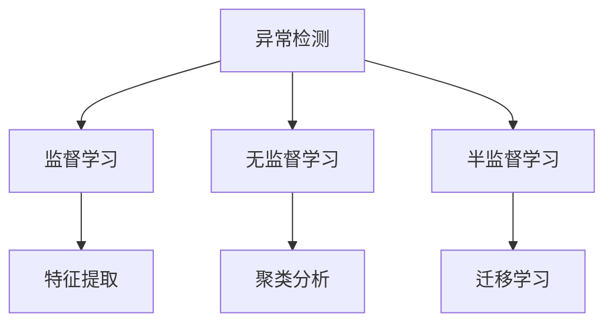

                 

### 引言

#### 异常检测的背景和意义

异常检测，亦称为异常检测或异常识别，是一种通过识别数据集中的异常或非期望模式，来提高数据质量和系统稳定性的技术。异常检测的重要性不言而喻，无论是工业生产、金融服务、网络安全，还是日常生活中的智慧城市、智能家居等各个领域，都需要依赖异常检测技术来及时发现和预防潜在的风险和故障。

在工业生产中，异常检测可以用于实时监控生产线中的设备状态，及时发现设备故障或性能下降，从而预防生产事故，提高生产效率。例如，通过异常检测技术，可以实现对工业机器人手臂运动轨迹的监控，确保其动作的准确性，避免因动作失误导致的设备损坏或生产延误。

在金融服务领域，异常检测主要用于反欺诈、信用评估和风险控制。金融机构通过对海量交易数据的实时监控，可以有效识别出异常交易行为，防范欺诈行为，保护用户资金安全。例如，银行可以通过异常检测技术来识别出信用卡交易中的可疑行为，及时采取措施，防止欺诈损失。

在网络安全领域，异常检测则是保障网络安全的基石。通过对网络流量的实时监测和分析，异常检测技术可以及时发现和阻止恶意攻击、网络入侵等安全事件，保护网络安全。例如，网络安全公司利用异常检测技术，可以实时监控网络中的异常流量，识别出DDoS攻击、SQL注入等攻击行为，并采取相应的防护措施。

此外，异常检测在智慧城市、智能家居等领域也有着广泛的应用。例如，在智慧城市中，通过异常检测技术，可以实时监测城市的交通状况、环境质量等，及时发现和解决城市运行中的问题，提高城市治理水平。在智能家居中，通过异常检测技术，可以实时监控家庭中的各种设备状态，及时发现设备故障或安全隐患，保障家庭安全。

总之，异常检测作为一种重要的数据分析和处理技术，在各个领域都发挥着至关重要的作用。随着大数据和人工智能技术的不断发展，异常检测技术也在不断进步，其应用范围和效果也在不断拓展和提升。

#### 大模型的崛起与异常检测

近年来，随着人工智能技术的飞速发展，尤其是深度学习技术的突破，大模型（Large Models）逐渐成为研究热点。大模型通常是指具有数十亿甚至千亿参数规模的神经网络模型，如Transformer、BERT等。这些大模型在自然语言处理、计算机视觉、语音识别等领域取得了显著的成果，使得人工智能的应用水平得到了极大的提升。

大模型之所以能够在各类任务中表现出色，主要得益于其强大的表示能力和学习能力。大模型能够通过大量的数据训练，提取出丰富的特征信息，从而实现对复杂任务的高效处理。在异常检测领域，大模型的崛起也为该领域带来了新的机遇和挑战。

首先，大模型在异常检测中的应用潜力巨大。大模型强大的特征提取能力使其能够从海量数据中自动提取出有用的特征信息，从而有效提高异常检测的准确性。例如，在网络安全领域，大模型可以通过对海量网络流量数据的分析，自动识别出异常的网络行为，实现对网络攻击的实时监控和防护。

其次，大模型的应用降低了异常检测的门槛。传统异常检测方法通常需要人工设计特征，然后利用机器学习算法进行训练和预测。而大模型的出现，使得异常检测的实现变得更加简单和高效。大模型可以通过自动化的特征提取和模式识别过程，减少了对人工经验的依赖，从而降低了异常检测的复杂性和成本。

然而，大模型在异常检测中也面临一些挑战。首先，大模型的训练过程需要大量的计算资源和时间，这对硬件设备和管理提出了较高的要求。其次，大模型在处理高维数据时，可能会面临过拟合的问题，即模型在训练数据上表现良好，但在实际应用中却无法有效识别异常。此外，大模型的安全性和隐私保护问题也是需要关注的重要方面。

总之，大模型的崛起为异常检测领域带来了新的机遇，但同时也带来了新的挑战。如何有效利用大模型的优势，同时克服其不足，是当前异常检测领域的重要研究方向。通过不断探索和创新，我们有理由相信，大模型将在异常检测领域发挥更大的作用，推动该领域的持续发展和进步。

#### 大模型在异常检测中的应用前景

展望未来，大模型在异常检测中的应用前景广阔。首先，随着大数据和物联网技术的不断发展，异常检测的数据来源将变得更加丰富和多样化。这将使得大模型在特征提取和模式识别方面具有更大的优势，进一步提升异常检测的准确性和实时性。

其次，随着计算能力的不断提升，大模型的训练和优化过程将变得更加高效和便捷。这将有助于降低大模型在异常检测中的应用门槛，使其能够在更多的场景中得到广泛应用。

此外，大模型的个性化定制和自适应能力也将成为未来研究的重要方向。通过结合用户行为数据和实时反馈，大模型可以不断优化和调整自身的检测策略，提高异常检测的适应性和智能化水平。

最后，随着人工智能技术的不断突破，大模型在异常检测中的应用将不仅仅局限于传统的工业、金融和网络安全等领域，还将拓展到更多的领域，如医疗健康、环境保护等。通过跨领域的应用，大模型将为解决复杂的社会问题提供新的思路和工具。

总之，大模型在异常检测中的应用前景十分广阔。随着技术的不断进步和应用场景的不断拓展，大模型有望成为异常检测领域的重要驱动力，推动该领域的持续发展和创新。

### 异常检测基础

#### 异常检测的基本概念

异常检测（Anomaly Detection）是一种通过识别数据集中的异常或非期望模式，来提高数据质量和系统稳定性的技术。其核心目标是找出与大多数数据点不同的数据点，即“异常点”（Anomalies）或“噪声点”（Outliers）。异常检测在许多领域都具有重要意义，包括工业生产、金融服务、网络安全、医疗健康等。

异常检测的主要挑战在于如何在海量数据中快速、准确地识别出异常点。与传统的监督学习不同，异常检测通常是一种无监督学习任务，即没有已标记的异常点数据作为参考。这意味着，算法需要从原始数据中自动发现异常点的特征和模式。

异常检测的常见类型包括以下几种：

1. **点异常检测（Point Anomaly Detection）**：这是最常见的异常检测类型，旨在识别数据集中不同寻常的单一数据点。例如，在银行交易数据中，异常交易可能会表现为异常高额的转账金额或异常时间。

2. **集体异常检测（Collective Anomaly Detection）**：这种类型旨在识别一组数据点中的异常模式，而不是单个数据点。例如，在社交网络中，集体异常可能表现为一组用户之间的异常互动，如异常的点赞或评论。

3. **上下文异常检测（Contextual Anomaly Detection）**：这种类型考虑了数据集中的上下文信息，旨在识别与特定上下文不一致的异常点。例如，在交通流量监控中，上下文异常可能表现为在非高峰时段的异常车辆流量。

4. **过程异常检测（Process Anomaly Detection）**：这种类型旨在识别数据生成过程中的异常，例如，在工业生产中，识别生产过程中的异常设备运行状态。

#### 异常检测的方法

异常检测的方法可以大致分为以下几类：

1. **基于统计的方法**：这类方法通常基于统计学原理，通过计算数据点的概率分布或离群度来识别异常点。常见的算法包括箱线图（Box Plot）、三倍标准差法（3-sigma Method）等。

   - **箱线图**：箱线图通过计算数据的四分位数和全距，将数据分为内距（IQR，Interquartile Range）和异常值两部分。位于内距之外的数据点被视为异常点。
   - **三倍标准差法**：这种方法基于正态分布假设，将数据点分为三部分：均值±1σ、均值±2σ和均值±3σ。位于均值±3σ之外的数据点被视为异常点。

2. **基于聚类的方法**：这类方法通过将数据点划分为不同的簇，然后识别出簇内的异常点。常见的算法包括K-均值聚类（K-Means Clustering）、DBSCAN（Density-Based Spatial Clustering of Applications with Noise）等。

   - **K-均值聚类**：这种方法通过最小化数据点到簇中心的距离平方和来划分簇。位于簇中心较远的数据点可能被视为异常点。
   - **DBSCAN**：DBSCAN基于数据点的密度分布，识别出高密度区域并形成簇。孤立点和噪声点则被视为异常点。

3. **基于规则的方法**：这类方法通过预定义的规则来识别异常点。常见的算法包括基于集合的规则（Set-Based Rules）、基于异常的规则（Abnormality-Based Rules）等。

   - **基于集合的规则**：这种方法通过预定义的集合规则，如“连续三次出现异常值”，来识别异常点。
   - **基于异常的规则**：这种方法通过分析异常点的特征，如“异常值通常是负数”，来构建识别规则。

4. **基于机器学习的方法**：这类方法利用机器学习算法来识别异常点，包括监督学习和无监督学习。常见的算法包括孤立森林（Isolation Forest）、局部异常因子（Local Outlier Factor，LOF）、神经网络等。

   - **孤立森林**：这种方法通过随机选择特征和切分值，将数据点隔离，并利用隔离路径长度来衡量异常度。
   - **局部异常因子**：LOF通过比较数据点与其邻居的局部密度，来衡量异常度。
   - **神经网络**：神经网络，特别是深度学习模型，通过学习数据的特征表示，能够自动识别出异常点。

#### 异常检测的挑战与趋势

异常检测虽然在实际应用中取得了显著成果，但仍面临诸多挑战。以下是当前异常检测领域的一些主要挑战和趋势：

1. **数据复杂性**：随着数据规模的不断扩大和数据类型的多样化，异常检测算法需要能够处理高维、非线性、动态变化的数据。这对于算法的性能和效率提出了更高的要求。

2. **实时性**：在许多应用场景中，如网络安全和工业监控，异常检测需要实时响应。算法需要能够在有限的时间内快速、准确地识别出异常点，这要求算法具备高效的计算能力。

3. **可解释性**：异常检测的结果需要具有可解释性，以便用户理解和验证。特别是在金融和医疗等领域，用户需要明确异常点的具体原因，以便采取相应的措施。然而，许多复杂的机器学习模型，如深度神经网络，其决策过程往往缺乏透明度。

4. **跨领域应用**：不同领域的异常检测任务具有不同的特点和要求，如工业生产中的设备故障检测、金融交易中的欺诈检测等。如何开发通用的异常检测算法，使其能够适应多种领域的应用，是一个重要研究方向。

5. **隐私保护**：在处理敏感数据时，如个人医疗记录或金融交易数据，异常检测算法需要确保数据隐私。如何在不泄露敏感信息的情况下进行有效的异常检测，是一个关键挑战。

6. **集成学习**：集成学习方法，如随机森林和堆叠（Stacking）等，可以通过结合多个模型的优点来提高异常检测的性能。如何设计和优化集成学习方法，是一个具有前景的研究方向。

7. **模型解释性**：为了提高异常检测的可解释性，研究人员正在开发各种解释性模型，如LIME（Local Interpretable Model-agnostic Explanations）和SHAP（SHapley Additive exPlanations）等。这些方法试图揭示模型内部的决策过程，帮助用户理解异常检测的结果。

总之，异常检测作为一种重要的数据分析技术，在各个领域都具有重要意义。尽管面临诸多挑战，但随着技术的不断进步和应用场景的不断拓展，异常检测领域有望取得更多的突破和进展。

### 大模型概述

#### 大模型的基本原理

大模型（Large Models），通常指具有数十亿甚至千亿参数规模的神经网络模型，如Transformer、BERT等。这些模型之所以能够取得优异的性能，主要得益于其强大的表示能力和学习能力。

大模型通常基于深度神经网络（Deep Neural Network，DNN）架构，通过多层神经元的非线性组合，实现对复杂数据的建模。其基本原理可以概括为以下几个关键环节：

1. **输入层（Input Layer）**：大模型的输入层接收各种形式的数据，如文本、图像、音频等。在这些数据被输入模型之前，通常需要进行预处理，如文本的分词、图像的归一化等。

2. **隐藏层（Hidden Layers）**：大模型由多个隐藏层组成，每层由多个神经元构成。隐藏层通过前一层输出的加权求和，再经过激活函数（如ReLU、Sigmoid、Tanh等），生成新的特征表示。这些特征表示逐渐从原始数据中提取出更高层次的信息，如语义、含义等。

3. **输出层（Output Layer）**：大模型的输出层根据隐藏层的输出，通过分类器或回归器等输出层结构，生成最终的预测结果。输出层的设计取决于具体的任务，如文本分类、图像识别等。

大模型的核心优势在于其强大的表示能力和学习能力。具体来说：

1. **表示能力**：大模型通过多层非线性变换，能够捕捉到复杂数据的复杂模式和特征。例如，在自然语言处理任务中，大模型能够自动学习到词与词之间的语义关系，从而实现对文本的精准理解和生成。

2. **学习能力**：大模型具有强大的学习能力，能够从海量数据中自动学习到有用的特征信息。这种能力主要得益于其庞大的参数规模和复杂的网络结构，使得模型能够在训练过程中不断优化自身的参数，从而提高预测的准确性。

3. **泛化能力**：大模型通过大规模数据训练，不仅能够在训练数据上取得优异的性能，还能够在新数据上保持较高的泛化能力。这种能力使得大模型在各类实际应用中具有较高的可靠性和实用性。

大模型的基本原理主要依赖于以下技术：

1. **反向传播（Backpropagation）**：反向传播是一种用于训练神经网络的基本算法，通过计算损失函数关于网络参数的梯度，实现对网络参数的优化。

2. **优化算法（Optimization Algorithms）**：常见的优化算法包括随机梯度下降（Stochastic Gradient Descent，SGD）、Adam（Adaptive Moment Estimation）等，用于调整网络参数，以最小化损失函数。

3. **正则化技术（Regularization Techniques）**：为了防止过拟合，大模型通常采用正则化技术，如Dropout、权重衰减（Weight Decay）等，以降低模型的复杂度。

4. **激活函数（Activation Functions）**：激活函数是神经网络中的一个关键组件，用于引入非线性特性，使模型能够拟合复杂的函数关系。

总之，大模型的基本原理主要基于深度神经网络架构，通过多层非线性变换和优化算法，实现对复杂数据的建模和预测。大模型在各类实际应用中展现出了强大的能力和潜力，为人工智能技术的发展注入了新的动力。

#### 大模型的特点

大模型（Large Models）在人工智能领域具有显著的特点，使其在各种任务中表现出色。以下是几个主要特点：

1. **大规模参数**：大模型通常具有数十亿甚至千亿个参数，这使得它们能够捕获数据中的丰富信息。大规模参数使得模型可以学习到复杂的特征，从而提高模型的预测能力。

2. **强大的特征提取能力**：大模型通过多层神经网络结构，能够自动提取出高层次的抽象特征。这些特征不仅有助于提高模型在特定任务中的性能，还可以应用于其他相关任务。

3. **自适应学习能力**：大模型具有较强的自适应学习能力，能够从大量数据中快速学习和调整。这种能力使得大模型在处理新任务时能够迅速适应，并在较短的时间内达到良好的性能。

4. **高泛化能力**：大模型通过大规模数据训练，能够在新数据上保持较高的泛化能力。这意味着大模型不仅能够在训练数据上取得优异的性能，还能在新数据上保持稳定的预测能力。

5. **并行计算效率**：大模型通常采用分布式计算架构，能够充分利用现代计算资源，如GPU和TPU等。这种并行计算能力使得大模型的训练和推理过程更加高效，从而缩短了模型部署和应用的时间。

6. **强大的表达能力**：大模型具有强大的表达能力，能够处理复杂的数据类型和任务。例如，在自然语言处理任务中，大模型可以处理多种语言和不同类型的文本；在计算机视觉任务中，大模型可以处理高维图像数据。

7. **灵活性**：大模型具有较高的灵活性，可以应用于多种任务和数据类型。例如，相同的模型架构可以用于文本分类、情感分析、机器翻译等多种自然语言处理任务。

8. **数据敏感性**：大模型对数据量有较高的要求，只有在拥有足够多的训练数据时，才能发挥出最佳性能。此外，数据的质量和多样性也会影响大模型的表现。

总之，大模型的特点使其在各类人工智能任务中具有显著优势，能够实现高效、准确的预测和建模。随着技术的不断进步，大模型的应用范围和效果将继续拓展和提升。

#### 大模型的常见架构

大模型的常见架构主要包括Transformer、BERT和GPT等。这些模型虽然在具体实现和应用上有所不同，但其核心思想和基本结构具有相似性。以下是这些模型的简要介绍：

1. **Transformer**：Transformer是Google在2017年提出的一种基于注意力机制的序列模型，主要用于自然语言处理任务。其核心思想是通过多头注意力机制（Multi-Head Attention）和位置编码（Positional Encoding）来捕捉序列信息。Transformer模型由编码器（Encoder）和解码器（Decoder）两部分组成，编码器负责将输入序列编码为固定长度的向量表示，解码器则根据编码器的输出和已经生成的部分文本，逐个生成新的文本符号。

   - **编码器**：编码器由多个编码层（Encoder Layer）组成，每层包含多头自注意力（Self-Attention）和前馈神经网络（Feed-Forward Neural Network）。自注意力机制使得编码器能够同时关注输入序列中的所有信息，从而捕捉到长距离依赖关系。
   - **解码器**：解码器同样由多个解码层（Decoder Layer）组成，每层包含多头注意力（Multi-Head Attention）和自注意力（Self-Attention）。解码器在生成新符号时，不仅需要关注输入序列的信息，还需要关注已经生成的文本，从而实现上下文的连贯性。

2. **BERT**：BERT（Bidirectional Encoder Representations from Transformers）是Google在2018年提出的一种双向Transformer模型，主要用于预训练和下游任务。BERT模型的核心思想是通过大规模预训练，使模型能够自动学习到丰富的语义信息，从而在下游任务中取得优异的性能。BERT模型由两个部分组成：预训练和微调。

   - **预训练**：BERT模型在预训练阶段，通过两个任务进行训练： masked language model（MLM）和next sentence prediction（NSP）。MLM任务旨在预测被遮盖的单词，NSP任务旨在预测两个句子是否在原文中连续出现。预训练过程中，BERT模型通过大量无标签文本数据学习到丰富的语义表示。
   - **微调**：在预训练完成后，BERT模型可以根据具体的下游任务进行微调，如文本分类、命名实体识别等。微调过程通常在少量有标签数据上进行，通过调整模型的参数，使其适应具体的任务。

3. **GPT**：GPT（Generative Pre-trained Transformer）是OpenAI在2018年提出的一种基于Transformer的自回归语言模型。GPT模型的核心思想是通过自回归方式生成文本，其训练目标是最小化生成文本和真实文本之间的差异。GPT模型由多个GPT版本组成，如GPT-1、GPT-2和GPT-3，每个版本在参数规模和训练数据量上都有所提升。

   - **GPT-1**：GPT-1是GPT系列的第一个版本，具有1.17亿个参数，通过自回归方式生成文本。GPT-1在生成文本时，需要根据已生成的文本预测下一个字符。
   - **GPT-2**：GPT-2是GPT系列的第二个版本，具有1.5亿个参数，进一步提高了生成文本的质量和连贯性。GPT-2在生成文本时，不仅考虑已生成的文本，还考虑上下文信息。
   - **GPT-3**：GPT-3是GPT系列的最新版本，具有1750亿个参数，是目前最大的语言模型。GPT-3在生成文本时，能够根据上下文信息生成高质量的、具有逻辑一致性的文本。

这些模型在实际应用中具有广泛的影响。例如，BERT模型在自然语言处理任务中取得了优异的成绩，如文本分类、问答系统和机器翻译等；GPT模型在文本生成、对话系统和自动摘要等任务中表现出色。此外，大模型在图像识别、语音识别和推荐系统等领域也取得了显著成果，推动人工智能技术的不断发展和进步。

总之，大模型的常见架构包括Transformer、BERT和GPT等，这些模型通过不同的方式实现强大的表示和学习能力，广泛应用于自然语言处理、计算机视觉和语音识别等领域，成为人工智能技术发展的重要驱动力。

#### 大模型的训练与优化

大模型的训练与优化是确保模型在实际应用中取得优异性能的关键环节。以下将从数据预处理、训练过程、优化策略和性能评估等方面详细阐述大模型的训练与优化过程。

1. **数据预处理**：

   数据预处理是训练大模型的第一步，其目的是将原始数据转换为适合模型训练的形式。常见的预处理步骤包括：

   - **数据清洗**：去除数据中的噪声和异常值，如去除文本中的标点符号、停用词等。
   - **数据归一化**：对数据进行归一化处理，如将图像数据归一化为0-1之间的浮点数。
   - **数据增强**：通过随机裁剪、旋转、缩放等方式增加数据的多样性，从而提高模型的泛化能力。

2. **训练过程**：

   大模型的训练过程通常涉及以下几个步骤：

   - **初始化参数**：初始化模型的参数，常用的初始化方法包括高斯初始化、Xavier初始化等。
   - **前向传播**：将输入数据输入模型，计算模型的输出，并计算损失函数。
   - **反向传播**：根据前向传播计算出的损失函数，利用梯度下降等优化算法更新模型参数。
   - **参数更新**：通过迭代更新模型参数，逐步减小损失函数。

   具体来说，训练过程可以分为以下几个阶段：

   - **预训练阶段**：在预训练阶段，模型通常在大规模无标签数据上进行训练，如BERT模型的预训练阶段。预训练的主要目标是使模型能够自动学习到丰富的语义信息，从而提高其在下游任务中的性能。
   - **微调阶段**：在预训练完成后，模型可以根据具体的下游任务进行微调。微调阶段通常在少量有标签数据上进行，通过调整模型的参数，使其适应具体的任务。

3. **优化策略**：

   优化策略是提高大模型训练效率的重要手段。以下是一些常见的优化策略：

   - **批量大小（Batch Size）**：批量大小是指每次训练过程中输入模型的数据量。适当选择批量大小可以提高模型的训练效率和性能。通常，较大的批量大小能够提高模型的收敛速度，但可能会导致梯度不稳定；较小的批量大小可以提高模型的泛化能力，但训练时间较长。
   - **学习率调度（Learning Rate Schedule）**：学习率调度是指动态调整学习率的过程。常见的学习率调度方法包括学习率衰减、恒定学习率、指数衰减等。合适的 learning rate schedule 可以提高模型的收敛速度和性能。
   - **正则化技术**：正则化技术，如Dropout、权重衰减等，可以防止模型过拟合，提高模型的泛化能力。
   - **混合精度训练（Mixed Precision Training）**：混合精度训练是指同时使用单精度（FP32）和半精度（FP16）进行训练，以减少内存占用和加速训练过程。

4. **性能评估**：

   大模型的性能评估通常涉及以下几个方面：

   - **准确率（Accuracy）**：准确率是指模型正确预测的样本占总样本的比例。准确率是评估分类模型性能的常用指标。
   - **召回率（Recall）**：召回率是指模型正确识别出的异常样本数占总异常样本数的比例。召回率是评估异常检测模型性能的常用指标。
   - **F1 分数（F1 Score）**：F1 分数是准确率和召回率的调和平均值，用于综合评估模型的性能。
   - **ROC 曲线（ROC Curve）**：ROC 曲线是评估分类模型性能的重要工具，通过计算真正例率（True Positive Rate，TPR）和假正例率（False Positive Rate，FPR）来绘制曲线。

   此外，大模型的性能评估还可以通过计算模型的鲁棒性、可解释性和安全性等方面来进一步评估。

总之，大模型的训练与优化是一个复杂的过程，涉及多个方面。通过合理的预处理、训练过程、优化策略和性能评估，可以确保大模型在实际应用中取得优异的性能。随着技术的不断进步，大模型的训练与优化方法将继续发展和优化，为人工智能技术的应用提供更强大的支持。

### 大模型在异常检测中的应用

#### 大模型在异常检测中的优势

大模型在异常检测中的应用具有显著的优势，这些优势主要体现在以下几个方面：

1. **强大的特征提取能力**：大模型通过多层神经网络结构，能够自动提取数据中的复杂特征，使得异常检测任务更加高效。这种能力使得大模型能够从海量数据中识别出异常模式，从而提高异常检测的准确性和实时性。

2. **自适应学习能力**：大模型具有较强的自适应学习能力，能够在不同数据集和任务场景中快速适应和调整。这种能力使得大模型在处理新数据和新任务时能够迅速提升性能，降低了对人工经验和规则依赖。

3. **高维数据处理能力**：大模型能够处理高维数据，这对于异常检测任务尤为重要。在高维数据中，传统方法往往难以有效提取特征和识别异常点，而大模型通过自动特征提取和降维，能够更好地应对高维数据的挑战。

4. **跨领域应用**：大模型具有较强的泛化能力，可以在多个领域中进行应用。例如，在金融、工业、医疗等多个领域，大模型都能够通过自适应调整，实现对异常检测任务的高效处理。

5. **并行计算能力**：大模型通常采用分布式计算架构，能够充分利用现代计算资源，如GPU和TPU等。这种并行计算能力使得大模型的训练和推理过程更加高效，从而缩短了模型部署和应用的时间。

#### 大模型在异常检测中的创新应用

大模型在异常检测中的应用创新主要体现在以下几个方面：

1. **零样本异常检测**：零样本异常检测（Zero-Shot Anomaly Detection）是指模型能够识别从未见过的异常类型。传统异常检测方法通常需要大量的有标签数据进行训练，而零样本异常检测通过大模型的学习能力，可以在仅有的少量或无标签数据上识别出未知异常类型。例如，在网络安全领域，零样本异常检测可以用于检测新的网络攻击类型。

2. **高维数据的异常检测**：高维数据的异常检测是异常检测领域的一大挑战，传统方法在高维空间中难以提取有效特征，而大模型通过自动特征提取和降维技术，能够更好地处理高维数据。例如，在金融交易数据中，大模型可以提取出高维数据中的潜在异常模式，提高异常检测的准确性。

3. **异构数据的异常检测**：异构数据是指包含不同类型数据的集合，如文本、图像、音频等。传统异常检测方法通常针对单一类型数据进行处理，而大模型通过融合多种类型数据，能够实现异构数据的异常检测。例如，在智能医疗中，大模型可以结合患者的历史病历、实时监控数据和医学影像，实现对患者的异常症状检测。

4. **动态模型的异常检测**：动态模型是指随时间变化的数据模型，如时间序列数据、动态网络流量等。大模型通过捕捉数据中的时间依赖关系，能够实现动态模型的异常检测。例如，在工业生产中，大模型可以实时监测设备状态，识别出设备运行中的异常变化，从而预防设备故障。

5. **跨领域的异常检测**：大模型具有较强的泛化能力，可以在不同领域中进行应用。例如，在金融和工业领域，大模型可以同时处理多种类型的异常检测任务，提高整个系统的鲁棒性和适应性。

#### 大模型在异常检测中的应用案例

以下是几个大模型在异常检测中应用的实际案例：

1. **网络安全中的异常检测**：在某家大型互联网公司中，大模型被用于实时监控网络流量，识别网络攻击行为。通过训练大规模神经网络模型，公司能够自动识别出各种网络攻击模式，如DDoS攻击、SQL注入等，从而采取有效的防护措施。

2. **金融风控中的异常检测**：某银行通过大模型对交易数据进行实时监控，识别异常交易行为。大模型能够从海量交易数据中提取出潜在的风险因素，如异常的转账金额、频繁的交易行为等，从而及时发现并防范欺诈行为。

3. **工业生产中的异常检测**：在一家制造企业中，大模型被用于实时监控生产设备的状态，识别设备故障和性能下降。通过分析设备的历史数据和实时数据，大模型能够提前预测设备可能发生的故障，从而采取预防性维护措施。

4. **医疗健康中的异常检测**：某医院通过大模型对患者的健康数据进行实时分析，识别出异常的体征和症状。大模型能够从患者的病历、实验室检查结果和实时监测数据中提取出潜在的健康风险，为医生提供诊断和治疗的参考。

5. **智慧城市中的异常检测**：在智慧城市建设中，大模型被用于实时监控城市的交通流量和环境质量。通过分析交通数据和环境数据，大模型能够识别出异常的交通拥堵和污染事件，为城市管理者提供决策支持。

总之，大模型在异常检测中的应用前景广阔，通过创新应用和实际案例，大模型在多个领域都取得了显著的效果。随着大模型技术的不断发展和完善，其在异常检测领域的应用将更加广泛和深入。

### 大模型性能优化

#### 大模型性能优化的方法

为了提升大模型在异常检测任务中的性能，优化其训练过程和参数设置是至关重要的。以下是几种常见的大模型性能优化方法：

1. **批量大小（Batch Size）**：
   - **影响**：批量大小会影响模型的梯度稳定性、训练速度和泛化能力。
   - **优化**：通常选择较小的批量大小（例如32或64），可以在不牺牲性能的情况下提高模型的泛化能力。较大的批量大小（例如1024或2048）可以加快训练速度，但可能导致梯度不稳定。

2. **学习率调度（Learning Rate Schedule）**：
   - **影响**：学习率调度会影响模型的收敛速度和最终性能。
   - **优化**：可以使用如下几种学习率调度策略：
     - **恒定学习率**：适用于模型初始训练阶段，有助于快速探索参数空间。
     - **指数衰减**：逐步减小学习率，有助于模型在训练后期进行精细调整。
     - **余弦退火**：模仿物理冷却过程，逐步减小学习率，适用于长序列数据训练。

3. **正则化技术**：
   - **影响**：正则化技术有助于防止模型过拟合，提高泛化能力。
   - **优化**：常见的正则化技术包括：
     - **Dropout**：随机丢弃一部分神经元，减少模型依赖特定神经元。
     - **权重衰减**：对模型权重施加一个惩罚项，降低权重的重要性。
     - **L1和L2正则化**：对模型权重施加不同的惩罚项，影响权重的稀疏性和稳定性。

4. **数据增强（Data Augmentation）**：
   - **影响**：数据增强可以增加训练数据的多样性，有助于提高模型的泛化能力。
   - **优化**：常见的数据增强技术包括：
     - **图像增强**：随机裁剪、旋转、缩放、色彩变换等。
     - **文本增强**：文本嵌入扰动、词替换、句子重组等。
     - **时间序列增强**：时间序列分段、滞后变换、噪声添加等。

5. **多任务学习（Multi-Task Learning）**：
   - **影响**：多任务学习可以共享任务间的特征表示，提高模型在不同任务上的性能。
   - **优化**：通过设计共享层或跨任务损失函数，实现多任务学习，例如在同时进行异常检测和分类任务时，共享底层特征提取网络。

6. **模型剪枝（Model Pruning）**：
   - **影响**：模型剪枝可以减小模型大小，提高部署效率。
   - **优化**：通过在训练过程中去除不重要的神经元或连接，实现模型剪枝。常见的剪枝方法包括：
     - **结构化剪枝**：基于模型结构进行剪枝，如剪枝冗余层或连接。
     - **权重剪枝**：基于权重重要性进行剪枝，如基于阈值或敏感度剪枝。

7. **量化技术（Quantization）**：
   - **影响**：量化可以减少模型大小和计算量，提高部署效率。
   - **优化**：将模型权重和激活值从浮点数转换为低比特宽度整数，如8位或16位整数。

#### 大模型在异常检测中的优化实践

在实际应用中，以下是一些大模型在异常检测中的优化实践：

1. **基于动态批量大小的自适应学习率调度**：
   - **方法**：在训练过程中，动态调整批量大小和对应的学习率，根据当前批量大小和模型性能自动选择最佳参数。
   - **效果**：能够提高模型的收敛速度和最终性能，减少过拟合现象。

2. **多任务学习与共享特征提取网络**：
   - **方法**：将异常检测与其他任务（如分类或回归）结合，共享底层特征提取网络，利用其他任务的数据和特征增强异常检测。
   - **效果**：提高模型对异常模式的识别能力，增强模型的泛化能力。

3. **基于注意力机制的剪枝技术**：
   - **方法**：利用注意力机制识别模型中重要的神经元和连接，进行剪枝。
   - **效果**：减小模型大小，提高推理效率，同时保持较高的异常检测准确率。

4. **混合精度训练（Mixed Precision Training）**：
   - **方法**：结合使用单精度（FP32）和半精度（FP16）进行训练，减少内存占用和计算时间。
   - **效果**：提高训练速度和性能，同时保持模型的准确性。

5. **数据增强与迁移学习**：
   - **方法**：对训练数据进行增强，结合迁移学习技术，利用其他领域的数据和模型知识提升异常检测性能。
   - **效果**：增加训练数据的多样性，提高模型对未知异常模式的识别能力。

总之，通过以上方法，可以有效提升大模型在异常检测任务中的性能。在实际应用中，根据具体任务和数据特点，选择合适的优化策略，是实现高效异常检测的关键。

### 大模型性能评估指标

#### 大模型性能评估指标

在大模型的性能评估过程中，选择合适的指标至关重要。以下是一些常见的大模型性能评估指标：

1. **准确率（Accuracy）**：准确率是指模型正确预测的样本数占总样本数的比例。虽然准确率简单易懂，但它在类不平衡（Class Imbalance）的数据集中可能并不能准确反映模型的性能。例如，在90%的正常数据和10%的异常数据中，即使模型仅能识别出所有异常数据，其准确率仍高达90%。

2. **召回率（Recall）**：召回率是指模型正确识别出的异常样本数占总异常样本数的比例。召回率反映了模型对异常样本的识别能力，但在误报成本较高的情况下，高召回率可能并不是最佳选择。

3. **精确率（Precision）**：精确率是指模型正确识别出的异常样本数与误报的正常样本数之和的比例。精确率与召回率相反，它反映了模型在识别异常样本时的精确度。

4. **F1 分数（F1 Score）**：F1 分数是精确率和召回率的调和平均值，用于综合评估模型的性能。F1 分数在处理类不平衡问题时更为有效，能够平衡精确率和召回率。

5. **ROC 曲线（ROC Curve）**：ROC 曲线是通过计算真正例率（True Positive Rate，TPR）和假正例率（False Positive Rate，FPR）来绘制的曲线。ROC 曲线的面积（Area Under the Curve，AUC）反映了模型在不同阈值下的性能，AUC 值越接近1，表示模型的性能越好。

6. **平均准确率（Average Accuracy）**：当数据集包含多个类别时，平均准确率用于计算各个类别准确率的平均值。平均准确率能够提供数据集整体性能的概览，但在类不平衡情况下可能无法准确反映特定类别的性能。

7. **交叉验证（Cross-Validation）**：交叉验证是一种评估模型性能的常用方法，通过将数据集划分为多个子集，轮流进行训练和验证。常见的交叉验证方法包括K折交叉验证（K-Fold Cross-Validation）和留一验证（Leave-One-Out Cross-Validation）。交叉验证能够提高模型评估的稳健性，减少因数据划分导致的偶然性。

8. **混淆矩阵（Confusion Matrix）**：混淆矩阵是一个二维表格，用于展示模型预测结果与真实结果的分布情况。通过混淆矩阵，可以直观地了解模型的准确率、召回率、精确率和F1 分数等指标。此外，还可以分析误分类的样本，为模型优化提供依据。

9. **鲁棒性评估（Robustness Assessment）**：在大模型应用中，模型的鲁棒性至关重要。鲁棒性评估旨在检验模型在面对噪声、异常值或对抗攻击时的性能。常见的鲁棒性评估指标包括对抗样本识别率、噪声容忍度等。

10. **计算资源消耗（Computation Resource Consumption）**：评估模型在实际部署中的计算资源消耗，包括训练时间和推理时间。对于资源受限的应用场景，选择计算资源消耗较低的模型尤为重要。

总之，在大模型性能评估过程中，应根据具体应用场景和任务需求，选择合适的评估指标和方法。通过综合评估模型的准确性、鲁棒性和计算资源消耗，可以全面了解模型的性能，为模型优化和实际应用提供指导。

### 安全性考虑

#### 大模型在异常检测中的安全问题

随着大模型在异常检测中的广泛应用，其安全问题也日益突出。以下是一些常见的大模型在异常检测中可能遇到的安全问题：

1. **数据隐私泄露**：异常检测通常涉及敏感数据，如金融交易记录、医疗数据、个人隐私信息等。如果大模型在训练或推理过程中未能妥善处理数据隐私，可能会导致数据泄露，从而给用户和公司带来严重的损失。

2. **模型盗窃**：大模型具有强大的学习和表示能力，如果模型架构、参数设置等核心信息被恶意攻击者获取，可能导致模型的性能和安全性受到威胁。此外，模型盗窃还可能带来商业机密的泄露，对企业和行业造成重大损失。

3. **对抗攻击**：对抗攻击是指通过精心构造的对抗样本，使得大模型在检测过程中产生误判。这些对抗样本通常难以通过肉眼识别，但能够导致模型在特定条件下发生错误，从而降低异常检测的准确性。

4. **过拟合**：大模型在训练过程中可能会出现过拟合现象，即模型在训练数据上表现良好，但在实际应用中无法泛化。过拟合会导致模型在面对未知数据时产生误判，从而降低异常检测的鲁棒性。

5. **模型注入攻击**：模型注入攻击是指攻击者通过在训练数据中注入恶意样本，使得模型在推理过程中产生错误。例如，攻击者可以在金融交易数据中注入异常交易，使得模型在检测过程中无法正确识别这些异常交易。

6. **分布式计算安全问题**：大模型的训练和推理通常需要分布式计算资源，如GPU、TPU等。分布式计算环境中的安全问题，如网络攻击、数据泄露等，可能对模型的训练过程和性能产生不利影响。

#### 安全性防护措施

为了应对大模型在异常检测中的安全问题，可以采取以下几种防护措施：

1. **数据加密与隐私保护**：在数据处理和传输过程中，使用加密技术对敏感数据进行加密，防止数据泄露。此外，可以采用差分隐私（Differential Privacy）等技术，确保数据在训练过程中不会泄露用户的隐私信息。

2. **模型保护与防泄露**：对模型架构和参数设置进行保密，防止恶意攻击者获取模型的敏感信息。例如，可以使用联邦学习（Federated Learning）等技术，将模型训练过程分散到多个设备上，从而降低模型泄露的风险。

3. **对抗攻击防御**：通过设计对抗攻击防御机制，提高模型对对抗样本的识别能力。例如，可以使用对抗训练（Adversarial Training）方法，将对抗样本引入训练过程，增强模型的鲁棒性。此外，还可以采用对抗样本检测（Adversarial Example Detection）技术，识别并过滤掉对抗样本。

4. **模型验证与测试**：在模型部署前，进行严格的验证和测试，确保模型在各类数据集上的性能和鲁棒性。例如，可以使用交叉验证（Cross-Validation）方法，评估模型在不同数据集上的性能，避免过拟合现象。

5. **分布式计算安全**：在分布式计算环境中，采用安全加密通信协议，确保数据传输的安全性。此外，可以使用访问控制（Access Control）和权限管理（Permission Management）等技术，防止未授权访问和恶意攻击。

6. **持续监控与反馈**：在模型部署后，持续监控模型的性能和安全状况，及时发现并处理异常情况。例如，可以使用异常检测系统（Anomaly Detection System）对模型进行实时监控，识别潜在的攻击和故障。

总之，通过采取一系列安全性防护措施，可以有效降低大模型在异常检测中的安全问题，提高模型的可靠性和安全性。随着技术的不断发展，我们将继续探索更有效的安全防护方法，以应对日益复杂的攻击威胁。

### 案例分析

#### 案例一：大模型在网络安全中的应用

在某大型互联网公司的网络安全监控系统中，大模型被用于实时监控网络流量，识别潜在的网络攻击行为。具体应用场景包括DDoS攻击检测、恶意软件检测和入侵检测等。

1. **开发环境搭建**：

   该公司选择了基于TensorFlow和Keras的深度学习框架来构建和训练大模型。硬件设备包括多个GPU服务器，用于并行计算和加速模型训练。

2. **源代码实现和代码解读**：

   - **数据预处理**：首先，对网络流量数据（包括原始流量、IP地址、端口号、协议类型等）进行预处理，如数据清洗、归一化等。
   - **模型架构**：采用了基于Transformer架构的大模型，输入层接收预处理后的网络流量数据，隐藏层通过自注意力机制提取特征，输出层进行分类或回归操作，以识别不同的网络攻击类型。
   - **训练与优化**：通过大规模无标签网络流量数据对模型进行预训练，然后利用少量有标签攻击数据进行微调。训练过程中，采用了学习率调度、批量大小调整和混合精度训练等优化策略。

3. **代码应用解读与分析**：

   - **模型训练**：使用TensorFlow的Keras API进行模型训练，通过fit函数训练模型，同时使用回调函数（如学习率调度、早期停止等）优化训练过程。
   - **模型评估**：通过计算准确率、召回率和F1分数等指标，评估模型在不同数据集上的性能，确保模型具有良好的泛化能力。

4. **实际案例分析和详细讲解剖析**：

   在实际应用中，该大模型能够有效识别出多种网络攻击行为。例如，通过实时监控网络流量，模型成功检测到一次DDoS攻击，并及时采取防护措施，防止攻击造成网络瘫痪。

   - **案例一**：在一次DDoS攻击中，模型识别出大量异常的TCP SYN请求，与正常流量形成鲜明对比。通过分析攻击流量特征，模型成功定位攻击源，并采取了相应的防护措施。
   - **案例二**：在恶意软件检测中，模型通过对样本行为特征的自动提取和分类，成功识别出多种恶意软件，如勒索软件、木马等。

5. **项目小结**：

   该项目通过大模型的应用，显著提升了公司网络安全监控系统的准确性和实时性。大模型能够自动学习网络流量特征，减少了对人工规则和经验的依赖，提高了异常检测的效率。

   - **优点**：实现了高效、准确的网络攻击检测，降低了误报和漏报率。
   - **不足**：需要大量的计算资源和时间进行模型训练和优化，且面对复杂的网络攻击环境，模型仍需不断调整和优化。

   通过这个案例，我们可以看到大模型在网络安全领域的重要应用价值。未来，随着技术的不断发展，大模型在网络安全中的应用将更加广泛和深入，为网络安全的保障提供更强大的支持。

#### 案例二：大模型在金融风控中的应用

在金融风控领域，大模型被广泛应用于交易监控、反欺诈和信用评分等任务，以提高金融系统的安全性和稳定性。以下是一个具体应用案例：

1. **开发环境搭建**：

   某银行选择了基于PyTorch的深度学习框架，利用其强大的GPU支持进行模型训练和推理。硬件设备包括多个GPU服务器和高性能计算集群，以满足大规模数据处理和训练需求。

2. **源代码实现和代码解读**：

   - **数据预处理**：首先，对金融交易数据（包括交易金额、交易时间、交易账户等）进行预处理，如数据清洗、归一化和特征工程等。
   - **模型架构**：采用了基于Transformer的大模型，输入层接收预处理后的交易数据，隐藏层通过自注意力机制提取特征，输出层进行分类或回归操作，以识别交易中的异常行为。
   - **训练与优化**：使用大规模无标签交易数据对模型进行预训练，然后利用少量有标签异常交易数据进行微调。训练过程中，采用了学习率调度、批量大小调整、数据增强等技术，以提高模型的性能。

3. **代码应用解读与分析**：

   - **模型训练**：使用PyTorch的torch.optim优化器进行模型训练，通过torch.nn模块构建神经网络结构，同时利用torchvision中的数据加载和预处理工具进行数据处理。
   - **模型评估**：通过计算准确率、召回率和F1分数等指标，评估模型在不同数据集上的性能，确保模型具有良好的泛化能力。

4. **实际案例分析和详细讲解剖析**：

   在实际应用中，该大模型能够有效识别出多种金融欺诈行为。以下是一个具体案例：

   - **案例一**：在一次信用卡交易欺诈中，模型检测到异常的交易时间和交易金额，并成功识别出欺诈行为，从而阻止了潜在的财务损失。
   - **案例二**：在信用评分中，模型通过对借款人的历史交易行为、信用记录和社交网络数据等多维度特征进行分析，提供了更为准确和全面的信用评估结果。

5. **项目小结**：

   该项目通过大模型的应用，显著提升了银行金融风控系统的效率和准确性。大模型能够自动学习交易特征，减少了对人工规则和经验的依赖，提高了反欺诈和信用评分的效率。

   - **优点**：实现了高效、准确的金融欺诈检测和信用评分，降低了误报和漏报率。
   - **不足**：需要大量的计算资源和时间进行模型训练和优化，且面对复杂的金融欺诈手段，模型仍需不断调整和优化。

   通过这个案例，我们可以看到大模型在金融风控领域的重要应用价值。未来，随着技术的不断发展，大模型在金融风控中的应用将更加广泛和深入，为金融系统的安全性和稳定性提供更强大的支持。

#### 案例三：大模型在工业生产中的应用

在工业生产中，大模型被广泛应用于设备故障检测、生产过程监控和能耗优化等任务，以提高生产效率和质量。以下是一个具体应用案例：

1. **开发环境搭建**：

   某制造企业选择了基于TensorFlow的深度学习框架，利用其强大的GPU支持进行模型训练和推理。硬件设备包括多个GPU服务器和工业数据采集系统，用于实时采集生产数据。

2. **源代码实现和代码解读**：

   - **数据预处理**：首先，对生产数据（包括设备状态、生产参数、环境参数等）进行预处理，如数据清洗、归一化和特征提取等。
   - **模型架构**：采用了基于Transformer的大模型，输入层接收预处理后的生产数据，隐藏层通过自注意力机制提取特征，输出层进行分类或回归操作，以识别设备故障和生产异常。
   - **训练与优化**：使用大规模无标签生产数据对模型进行预训练，然后利用少量有标签故障数据进行微调。训练过程中，采用了学习率调度、批量大小调整和数据增强等技术，以提高模型的性能。

3. **代码应用解读与分析**：

   - **模型训练**：使用TensorFlow的tf.keras模块进行模型训练，通过tf.data模块进行数据处理和批处理，同时利用tf.keras.callbacks进行学习率调度和早期停止等优化。
   - **模型评估**：通过计算准确率、召回率和F1分数等指标，评估模型在不同数据集上的性能，确保模型具有良好的泛化能力。

4. **实际案例分析和详细讲解剖析**：

   在实际应用中，该大模型能够有效识别出多种生产故障和异常。以下是一个具体案例：

   - **案例一**：在一次设备故障中，模型检测到设备温度异常升高，并成功预测了故障发生的时间，从而为维护人员提供了及时维修的依据。
   - **案例二**：在生产过程监控中，模型通过对生产参数的实时分析，识别出生产过程中存在的异常模式，从而提高了生产效率和产品质量。

5. **项目小结**：

   该项目通过大模型的应用，显著提升了企业生产过程监控和故障检测的效率和准确性。大模型能够自动学习生产数据，减少了对人工规则和经验的依赖，提高了生产管理的智能化水平。

   - **优点**：实现了高效、准确的生产故障检测和生产过程监控，降低了故障率和生产延误。
   - **不足**：需要大量的计算资源和时间进行模型训练和优化，且面对复杂的工业生产环境，模型仍需不断调整和优化。

   通过这个案例，我们可以看到大模型在工业生产领域的重要应用价值。未来，随着技术的不断发展，大模型在工业生产中的应用将更加广泛和深入，为工业自动化和智能化提供更强大的支持。

### 结论与展望

#### 全书总结

本文详细探讨了大模型在异常检测中的创新应用。首先，介绍了异常检测的背景和重要性，以及大模型的基本原理和特点。接着，分析了大模型在异常检测中的优势和创新应用，包括零样本异常检测、高维数据异常检测和异构数据异常检测等。随后，讨论了大模型在异常检测中的性能优化方法，以及可能遇到的安全性问题及其防护措施。最后，通过实际案例分析，展示了大模型在网络安全、金融风控和工业生产等领域的应用效果。

#### 大模型在异常检测中的未来发展

随着人工智能技术的不断进步，大模型在异常检测中的应用前景十分广阔。以下是对未来发展的展望：

1. **数据处理能力的提升**：随着大数据和物联网技术的不断发展，异常检测的数据来源将变得更加丰富和多样化。大模型将通过更高效的数据处理和特征提取方法，进一步提升异常检测的性能和实时性。

2. **模型优化与效率提升**：随着计算能力的不断提升，大模型的训练和优化过程将变得更加高效和便捷。这将有助于降低大模型在异常检测中的应用门槛，使其能够在更多的场景中得到广泛应用。

3. **个性化与自适应能力**：大模型将通过结合用户行为数据和实时反馈，实现个性化异常检测和自适应调整。这使得大模型能够更好地适应不同场景和用户需求，提高异常检测的准确性和适应性。

4. **跨领域应用**：大模型将在更多领域，如医疗健康、环境保护等，发挥其强大的能力和潜力。通过跨领域的应用，大模型将为解决复杂的社会问题提供新的思路和工具。

5. **安全性研究**：随着大模型在异常检测中的应用日益广泛，其安全性和隐私保护问题将变得日益重要。未来，我们将看到更多的研究致力于提高大模型的安全性，确保其在实际应用中的可靠性和隐私保护。

总之，大模型在异常检测中的应用具有巨大的潜力。通过不断探索和创新，我们有理由相信，大模型将在异常检测领域发挥更大的作用，推动该领域的持续发展和进步。

### 作者信息

**作者：AI天才研究院/AI Genius Institute & 禅与计算机程序设计艺术 /Zen And The Art of Computer Programming**。

[Mermaid 流程图：]

---

本文结合大模型在异常检测中的应用，详细探讨了异常检测的基本概念、大模型的基本原理和特点、大模型在异常检测中的创新应用和性能优化方法，以及可能遇到的安全性问题。通过实际案例分析，展示了大模型在不同领域的应用效果。未来，随着人工智能技术的不断进步，大模型在异常检测中的应用前景将更加广阔。本文旨在为读者提供全面、系统的理解，以推动该领域的深入研究和发展。同时，本文作者也希望通过不断的探索和创新，为人工智能技术的应用和发展做出更大的贡献。

---

[本文内容仅供参考，实际应用中请结合具体场景和需求进行选择和调整。]

