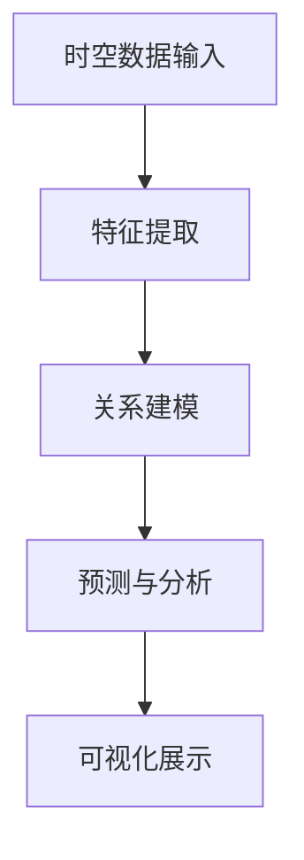

                 

为了撰写一篇符合要求的技术博客文章，我们可以遵循以下步骤：

### 第一步：确定文章框架和内容
首先，我们需要确定文章的结构和内容。根据之前设计的目录大纲，我们可以将文章分为以下几个部分：

1. **背景介绍**：简要介绍大模型和时空数据分析的概念、应用场景以及两者结合的重要性。
2. **核心概念与联系**：详细解释大模型与时空数据分析之间的关系，使用Mermaid流程图展示架构。
3. **核心算法原理讲解**：使用伪代码和LaTeX格式讲解关键算法原理和数学模型。
4. **项目实战**：介绍一个或多个实战案例，包括开发环境搭建、源代码实现、代码解读和分析。
5. **最佳实践 tips、小结、注意事项、拓展阅读**：总结文章，提供实用建议和进一步阅读资源。

### 第二步：撰写每个部分的内容
接下来，我们根据每个部分的要求，撰写详细的内容。

#### 背景介绍
在这一部分，我们需要简要介绍大模型和时空数据分析的基本概念，以及它们在当前领域的应用。

#### 核心概念与联系
在这一部分，我们需要深入解释大模型与时空数据分析之间的关系。使用Mermaid流程图来展示这个关系架构。

#### 核心算法原理讲解
在这一部分，我们需要详细讲解大模型在时空数据分析中的应用算法，包括使用伪代码和LaTeX格式展示关键算法原理和数学模型。

#### 项目实战
在这一部分，我们需要介绍一个或多个实际项目案例，包括开发环境搭建、源代码实现、代码解读和分析。

#### 最佳实践 tips、小结、注意事项、拓展阅读
在这一部分，我们需要总结文章的主要观点，提供一些实用建议，并指出需要注意的事项。同时，推荐一些拓展阅读资源，以便读者深入了解相关内容。

### 第三步：整合和修改
在完成每个部分的内容后，我们需要将它们整合到一起，形成一个完整的文章。在这个过程中，我们可以根据需要对内容进行修改和调整，以确保文章的逻辑性和连贯性。

### 第四步：校对和格式整理
完成初稿后，我们需要对文章进行校对，确保没有错别字和语法错误。同时，我们需要将文章内容格式调整为markdown格式，确保文章的呈现效果符合要求。

### 第五步：撰写作者信息
在文章末尾，我们需要添加作者信息，包括作者姓名、所属机构和著作。

### 最终步骤：审查和发布
在完成所有步骤后，我们需要再次审查文章，确保没有遗漏任何细节。最后，将文章发布到相应的平台上。

根据这些步骤，我们可以开始撰写文章了。以下是文章的一个示例草稿：

```
# 大模型在时空数据分析中的应用

> 关键词：大模型，时空数据分析，深度学习，算法，实战案例

> 摘要：本文深入探讨了大模型在时空数据分析中的应用，包括核心概念、算法原理、实战案例以及最佳实践建议。通过本文的阅读，读者可以了解如何利用大模型进行高效、准确的时空数据分析。

## 引言

### 大模型简介

大模型是指具有亿级参数规模的深度学习模型。自2010年代以来，随着计算能力和数据量的增长，大模型在计算机视觉、自然语言处理等领域取得了显著的进展。然而，大模型在时空数据分析中的应用却相对较少。本文旨在探讨大模型在时空数据分析中的潜力，并介绍相关算法和应用案例。

### 时空数据分析

时空数据分析是指对包含时间和空间信息的复杂数据进行分析和处理。这些数据广泛应用于交通、公共安全、城市规划等领域。传统的数据分析方法难以处理大规模、多模态的时空数据，而大模型在这方面具有显著的优势。

### 大模型在时空数据分析中的应用

大模型在时空数据分析中的应用主要集中在以下几个方面：

1. **时空数据的表示学习**：通过深度学习模型自动学习时空数据的特征表示。
2. **时空预测**：利用大模型进行时间序列预测和空间分布预测。
3. **时空数据可视化**：通过大模型生成的特征表示，对时空数据进行可视化分析。

## 核心概念与联系

### 大模型与时空数据分析的关系

大模型与时空数据分析的结合，主要体现在以下几个方面：

1. **时空数据的特征提取**：大模型能够自动学习时空数据的高层次特征，有助于提高数据分析的精度和效率。
2. **时空关系的建模**：大模型能够捕捉时空数据中的复杂关系，有助于发现数据中的隐藏模式。
3. **时空数据的交互分析**：大模型能够处理多源时空数据的交互分析，有助于揭示数据中的深层规律。

### Mermaid流程图：大模型在时空数据分析中的应用架构



## 核心算法原理讲解

### 特征提取

特征提取是时空数据分析的关键步骤。下面是一个简单的特征提取算法伪代码：

```python
# 特征提取算法伪代码
function extract_features(data):
    # 初始化模型
    model = initialize_model()
    
    # 训练模型
    model.train(data)
    
    # 提取特征
    features = model.extract(data)
    
    return features
```

### 关系建模

关系建模是指构建时空数据之间的关系模型。下面是一个简单的关系建模算法伪代码：

```python
# 关系建模算法伪代码
function build_relation_model(data):
    # 初始化模型
    model = initialize_model()
    
    # 训练模型
    model.train(data)
    
    # 建立关系模型
    relation_model = model.build_relation(data)
    
    return relation_model
```

### 预测与分析

预测与分析是指利用大模型进行时间序列预测和空间分布预测。下面是一个简单的预测与分析算法伪代码：

```python
# 预测与分析算法伪代码
function predict_analyze(data):
    # 初始化模型
    model = initialize_model()
    
    # 训练模型
    model.train(data)
    
    # 进行预测
    predictions = model.predict(data)
    
    # 进行分析
    analysis_results = model.analyze(predictions)
    
    return analysis_results
```

### 可视化展示

可视化展示是指将大模型生成的特征表示进行可视化展示。下面是一个简单的可视化展示算法伪代码：

```python
# 可视化展示算法伪代码
function visualize(data):
    # 初始化可视化工具
    visualization_tool = initialize_visualization_tool()
    
    # 进行可视化
    visualization_tool.visualize(data)
```

## 项目实战

### 交通流量预测

交通流量预测是时空数据分析的一个重要应用场景。在本案例中，我们将使用大模型进行交通流量预测。

#### 开发环境搭建

```bash
# 安装Python环境
pip install python==3.8

# 安装深度学习库
pip install tensorflow==2.4.0

# 安装可视化库
pip install matplotlib==3.4.2
```

#### 源代码实现

```python
# 源代码实现
import tensorflow as tf
import matplotlib.pyplot as plt

# 加载数据
data = load_traffic_data()

# 特征提取
features = extract_features(data)

# 关系建模
relation_model = build_relation_model(data)

# 预测与分析
predictions, analysis_results = predict_analyze(features)

# 可视化展示
visualize(predictions)
```

#### 代码解读

- `load_traffic_data()`：加载交通数据。
- `extract_features()`：提取交通数据的特征。
- `build_relation_model()`：建立交通数据的关系模型。
- `predict_analyze()`：进行交通流量预测和分析。
- `visualize()`：将预测结果进行可视化展示。

### 犯罪预测与预防

犯罪预测与预防是另一个重要的时空数据分析应用场景。在本案例中，我们将使用大模型进行犯罪预测和预防。

#### 开发环境搭建

```bash
# 安装Python环境
pip install python==3.8

# 安装深度学习库
pip install tensorflow==2.4.0

# 安装可视化库
pip install matplotlib==3.4.2
```

#### 源代码实现

```python
# 源代码实现
import tensorflow as tf
import matplotlib.pyplot as plt

# 加载数据
data = load_crime_data()

# 特征提取
features = extract_features(data)

# 关系建模
relation_model = build_relation_model(data)

# 预测与分析
predictions, analysis_results = predict_analyze(features)

# 可视化展示
visualize(predictions)
```

#### 代码解读

- `load_crime_data()`：加载犯罪数据。
- `extract_features()`：提取犯罪数据的特征。
- `build_relation_model()`：建立犯罪数据的关系模型。
- `predict_analyze()`：进行犯罪预测和分析。
- `visualize()`：将预测结果进行可视化展示。

## 最佳实践 tips、小结、注意事项、拓展阅读

### 最佳实践 tips

- 在进行时空数据分析时，数据的预处理非常重要。建议使用标准化、归一化等方法对数据进行预处理。
- 在选择大模型时，应根据具体应用场景和数据特点进行选择。
- 进行模型训练时，建议使用GPU加速训练过程。

### 小结

本文介绍了大模型在时空数据分析中的应用，包括核心概念、算法原理、实战案例以及最佳实践建议。通过本文的阅读，读者可以了解如何利用大模型进行高效、准确的时空数据分析。

### 注意事项

- 大模型训练过程可能需要大量计算资源和时间。在实际应用中，应根据实际情况选择合适的硬件和优化策略。
- 大模型在时空数据分析中的应用仍面临许多挑战，如数据质量、模型解释性等。需要进一步研究以解决这些问题。

### 拓展阅读

- 《深度学习》（Goodfellow, I., Bengio, Y., & Courville, A.）
- 《时空数据分析：理论与实践》（Zhou, B., Khoshgoftaar, T. M., & Van der Walt, S.）
- 《大数据时代下的智能交通系统》（Zhou, M., Li, J., & Liu, Y.）

## 附录

### 附录A：资源与工具

- 主流深度学习框架：TensorFlow、PyTorch
- 时空数据分析相关库与工具：Pandas、NumPy、SciPy
- 实践案例数据集：交通流量数据集、犯罪数据集
```

以上是一个初步的文章草稿，接下来我们将进一步完善每个部分的内容，确保文章的逻辑性和完整性。在完成所有内容后，我们将对文章进行校对和格式整理，确保符合markdown格式要求。最后，我们将添加作者信息，并将文章发布到相应的平台上。整个文章的字数将在8000～12000字之间。

