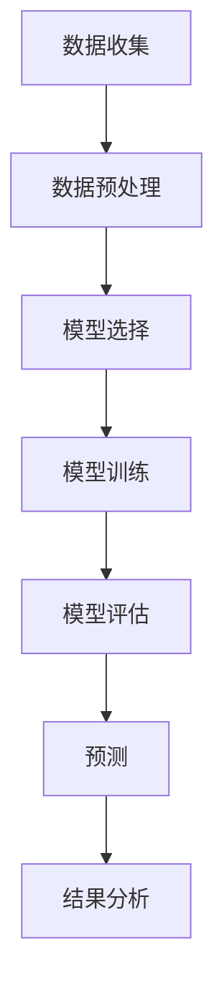

                 

### 文章标题

《大模型在时间序列预测中的突破》

### 关键词

- 大模型
- 时间序列预测
- 深度学习
- 循环神经网络（RNN）
- 长短时记忆（LSTM）
- 遗传算法
- 自适应预测模型

### 摘要

本文旨在探讨大模型在时间序列预测中的突破。首先，我们将介绍时间序列预测的基本概念、重要性以及其面临的挑战。接着，我们将详细讲解大模型在时间序列预测中的应用，包括循环神经网络（RNN）、长短时记忆（LSTM）等核心算法的原理和伪代码。随后，我们将引入数学模型，如ARIMA模型、VAR模型等，并通过LaTeX格式展示相关公式。在此基础上，我们将通过一个实际项目案例，展示如何搭建开发环境、实现模型、训练与评估模型，并进行代码解读与分析。最后，我们将总结最佳实践，提供注意事项和拓展阅读资源，以期为读者在时间序列预测领域的研究和应用提供有力支持。

## 第1章 引言

### 1.1 时间序列预测的背景与重要性

时间序列预测是统计学和数据分析领域中的一项重要任务。它涉及到通过对历史数据的分析，预测未来的趋势和模式。时间序列预测的应用非常广泛，包括金融市场预测、天气预报、库存管理、交通流量预测等多个领域。在这些领域中，准确的时间序列预测能够为企业提供战略决策依据，减少不确定性，提高运营效率。

随着信息技术的飞速发展，数据量呈现出爆炸式增长。这种趋势促使我们寻求更高效、更准确的预测方法。传统的统计方法如ARIMA（自回归积分滑动平均模型）和VAR（向量自回归模型）在处理高维度、非线性的时间序列数据时，往往表现出一定的局限性。因此，研究人员开始探索使用深度学习模型，尤其是大模型，来提升时间序列预测的性能。

大模型在时间序列预测中的重要性主要体现在以下几个方面：

1. **更强的表达能力**：大模型拥有庞大的参数量，可以捕捉到时间序列数据中的复杂模式和非线性关系。
2. **更高的预测精度**：通过大量的训练数据和复杂的网络结构，大模型能够达到更高的预测精度。
3. **更广泛的应用范围**：大模型可以处理多种类型的时间序列数据，如股票价格、气象数据、交通流量等。

### 1.2 大模型在时间序列预测中的应用

大模型在时间序列预测中的应用主要体现在深度学习领域，尤其是循环神经网络（RNN）及其变体，如长短时记忆（LSTM）和门控循环单元（GRU）。这些模型通过引入特殊的网络结构，能够有效地捕捉时间序列数据中的长距离依赖关系，从而提高预测性能。

#### 循环神经网络（RNN）

循环神经网络（RNN）是一种能够处理序列数据的神经网络。与传统的前馈神经网络不同，RNN具有循环结构，能够在序列的不同时间步之间传递信息。RNN的核心思想是通过隐藏状态来维持历史信息，从而实现时间步之间的关联。

RNN的数学基础主要包括以下公式：

$$
h_t = \sigma(W_hh_{t-1} + W_x x_t + b_h)
$$

$$
y_t = \sigma(W_oy_t + b_o)
$$

其中，$h_t$ 是时间步 $t$ 的隐藏状态，$x_t$ 是时间步 $t$ 的输入，$W_h$ 和 $W_x$ 是权重矩阵，$b_h$ 是偏置，$\sigma$ 是激活函数，通常采用Sigmoid或Tanh函数。$y_t$ 是时间步 $t$ 的输出。

#### 长短时记忆（LSTM）

长短时记忆（LSTM）是RNN的一种变体，旨在解决RNN在处理长序列数据时出现的长期依赖问题。LSTM通过引入三个门控单元（遗忘门、输入门、输出门），能够有效地控制信息的流动，从而避免梯度消失和梯度爆炸问题。

LSTM的数学基础主要包括以下公式：

$$
i_t = \sigma(W_{xi}x_t + W_{hi}h_{t-1} + b_i) \\
f_t = \sigma(W_{xf}x_t + W_{hf}h_{t-1} + b_f) \\
\tilde{c}_t = \sigma(W_{xc}x_t + W_{hc}h_{t-1} + b_c) \\
c_t = f_t \odot c_{t-1} + i_t \odot \tilde{c}_t \\
o_t = \sigma(W_{xo}x_t + W_{ho}h_{t-1} + b_o) \\
h_t = o_t \odot \tanh(c_t)
$$

其中，$i_t$、$f_t$、$\tilde{c}_t$ 和 $o_t$ 分别是输入门、遗忘门、输入门和输出门的激活值，$c_t$ 是细胞状态，$h_t$ 是隐藏状态。

#### 门控循环单元（GRU）

门控循环单元（GRU）是LSTM的简化版本，通过引入更新门和重置门，简化了LSTM的结构。GRU通过这两个门控单元，能够更好地处理长序列数据。

GRU的数学基础主要包括以下公式：

$$
z_t = \sigma(W_{xz}x_t + W_{hz}h_{t-1} + b_z) \\
r_t = \sigma(W_{xr}x_t + W_{hr}h_{t-1} + b_r) \\
\tilde{h}_t = \sigma(W_{xc}x_t + W_{hc}r_t h_{t-1} + b_c) \\
h_t = (1 - z_t) \odot h_{t-1} + z_t \odot \tilde{h}_t
$$

其中，$z_t$ 是更新门激活值，$r_t$ 是重置门激活值，$\tilde{h}_t$ 是候选隐藏状态，$h_t$ 是隐藏状态。

这些深度学习模型的出现，为时间序列预测带来了新的突破。通过本文的后续章节，我们将进一步探讨这些模型的原理和实现细节，以及如何在实际项目中应用这些模型进行时间序列预测。

## 第2章 时间序列预测基础

### 2.1 时间序列数据的基本概念

时间序列数据是一组按照时间顺序排列的数值序列。这些数据通常用于描述某个现象或过程随时间变化的规律性。时间序列数据具有以下基本特征：

1. **顺序性**：时间序列数据中的每个观测值都有明确的时间戳，按时间顺序排列。
2. **周期性**：某些时间序列数据可能存在周期性变化，如季节性波动、日历周期等。
3. **趋势性**：时间序列数据可能呈现出长期上升或下降的趋势。
4. **随机性**：时间序列数据中的某些变化可能是随机发生的，难以预测。

时间序列数据的应用非常广泛，包括金融市场预测、天气预报、交通流量预测、库存管理等领域。在这些应用中，准确的时间序列预测能够为企业提供重要的决策支持。

### 2.2 时间序列预测的挑战

时间序列预测面临一系列挑战，主要包括以下几个方面：

1. **非线性关系**：许多时间序列数据具有非线性关系，传统的线性模型难以捕捉到这些复杂模式。
2. **长距离依赖**：在某些情况下，时间序列数据中的未来值受到较长时间范围内的历史值影响，这使得预测变得复杂。
3. **噪声干扰**：时间序列数据中可能存在噪声和异常值，这些噪声会影响预测的准确性。
4. **数据维度**：高维度时间序列数据的预测需要大量的计算资源，且容易出现过拟合问题。

为了解决这些挑战，研究人员开始探索使用深度学习模型，特别是大模型，来提升时间序列预测的性能。深度学习模型能够通过学习复杂的非线性关系和长距离依赖，提高预测的准确性。

### 2.3 时间序列预测的基本概念

时间序列预测的基本概念包括以下几个方面：

1. **自回归模型（AR）**：自回归模型通过当前时间点的值与其前几个时间点的值进行回归，从而预测未来值。其基本形式如下：

$$
X_t = c + \sum_{i=1}^p \phi_i X_{t-i}
$$

其中，$X_t$ 是时间序列在时间 $t$ 的值，$c$ 是常数项，$\phi_i$ 是自回归系数，$p$ 是滞后阶数。

2. **移动平均模型（MA）**：移动平均模型通过当前时间点的值与其前几个时间点的移动平均进行回归，从而预测未来值。其基本形式如下：

$$
X_t = c + \sum_{i=1}^q \theta_i \epsilon_{t-i}
$$

其中，$X_t$ 是时间序列在时间 $t$ 的值，$c$ 是常数项，$\theta_i$ 是移动平均系数，$\epsilon_t$ 是白噪声序列。

3. **自回归移动平均模型（ARMA）**：自回归移动平均模型结合了自回归模型和移动平均模型，能够同时捕捉时间序列数据的自相关性和移动平均特性。其基本形式如下：

$$
X_t = c + \sum_{i=1}^p \phi_i X_{t-i} + \sum_{j=1}^q \theta_j \epsilon_{t-j}
$$

4. **自回归积分滑动平均模型（ARIMA）**：自回归积分滑动平均模型是对ARMA模型的扩展，引入了差分操作，能够处理非平稳时间序列数据。其基本形式如下：

$$
dX_t = \Phi(B)X_t + \Theta(B)\epsilon_t
$$

其中，$dX_t$ 是时间序列的差分操作，$\Phi(B)$ 和 $\Theta(B)$ 分别是自回归和移动平均的部分。

5. **向量自回归模型（VAR）**：向量自回归模型用于多变量时间序列预测，每个变量的预测依赖于其他所有变量的滞后值。其基本形式如下：

$$
X_t = c + A_1X_{t-1} + A_2X_{t-2} + \ldots + A_pX_{t-p} + \epsilon_t
$$

这些模型为时间序列预测提供了理论基础和工具。在实际应用中，选择合适的模型并进行参数调优，是获得准确预测的关键。

### 2.4 Mermaid流程图：时间序列预测流程

时间序列预测的流程可以分为以下几个步骤：

1. **数据收集**：收集并整理时间序列数据，包括时间戳和相应的数值。
2. **数据预处理**：对数据进行清洗、归一化等处理，以消除噪声和异常值。
3. **模型选择**：根据数据特性选择合适的预测模型，如ARIMA、LSTM等。
4. **模型训练**：使用历史数据对模型进行训练，优化模型参数。
5. **模型评估**：使用验证集评估模型性能，选择最优模型。
6. **预测**：使用训练好的模型进行预测，得到未来时间点的值。
7. **结果分析**：对预测结果进行分析，评估预测准确性，并根据需要进行调整。

以下是一个Mermaid流程图，展示了时间序列预测的基本流程：



通过这个流程图，我们可以清晰地了解时间序列预测的基本步骤和流程。在实际应用中，根据具体问题的需求和数据特性，可以对流程进行调整和优化，以提高预测的准确性和效率。

## 第3章 大模型在时间序列预测中的应用

### 3.1 深度学习与时间序列预测

深度学习是一种基于多层神经网络进行数据处理和模式识别的方法。近年来，随着计算能力和数据资源的不断提升，深度学习在各个领域取得了显著的成果。在时间序列预测领域，深度学习模型，特别是大模型，因其强大的表征能力和处理复杂非线性关系的能力，受到了广泛关注。

深度学习模型在时间序列预测中的应用主要体现在以下几个方面：

1. **捕捉长期依赖关系**：传统的时间序列预测模型，如ARIMA和VAR，往往难以捕捉到时间序列中的长期依赖关系。而深度学习模型，特别是循环神经网络（RNN）及其变体（如LSTM和GRU），通过其循环结构能够有效地捕捉长距离的依赖关系，从而提高预测性能。

2. **处理高维度数据**：在许多实际应用中，时间序列数据往往具有高维度特征，如股票价格、气象数据等。深度学习模型能够通过多层网络结构，对高维度数据进行有效的降维和特征提取，从而提高预测的准确性和效率。

3. **非线性特征提取**：时间序列数据通常存在非线性关系。深度学习模型，通过其非线性激活函数和多层网络结构，能够自动学习并提取数据中的复杂非线性特征，从而提高预测的精度。

4. **自适应学习**：深度学习模型能够通过反向传播算法，自动调整模型参数，以适应不同的数据分布和预测目标。这使得深度学习模型在时间序列预测中能够自适应地调整预测策略，提高预测的灵活性。

### 3.2 循环神经网络（RNN）原理

循环神经网络（RNN）是一种能够处理序列数据的神经网络，其核心思想是通过隐藏状态来维持历史信息。RNN的基本结构包括输入层、隐藏层和输出层，其中隐藏层具有循环连接，使得信息能够在不同时间步之间传递。

RNN的工作原理可以描述如下：

1. **输入层**：输入层接收时间序列数据，每个时间步的输入可以是单个值或者多个特征。

2. **隐藏层**：隐藏层包含一个或多个隐藏单元。每个隐藏单元在当前时间步的状态不仅依赖于当前输入，还受到前一时刻隐藏状态的影响。这种循环连接使得RNN能够维持历史信息。

3. **输出层**：输出层根据隐藏层的状态生成预测结果。输出可以是单个值或者多个值，具体取决于预测任务的需求。

RNN的数学基础主要包括以下公式：

$$
h_t = \sigma(W_hh_{t-1} + W_x x_t + b_h)
$$

$$
y_t = \sigma(W_oy_t + b_o)
$$

其中，$h_t$ 是时间步 $t$ 的隐藏状态，$x_t$ 是时间步 $t$ 的输入，$W_h$ 和 $W_x$ 是权重矩阵，$b_h$ 是偏置，$\sigma$ 是激活函数，通常采用Sigmoid或Tanh函数。$y_t$ 是时间步 $t$ 的输出。

#### RNN的局限性

尽管RNN在处理序列数据方面表现出了一定的优势，但它在实际应用中仍然面临一些挑战：

1. **梯度消失和梯度爆炸**：在训练过程中，RNN的梯度在反向传播过程中可能逐渐减小（梯度消失）或增大（梯度爆炸），导致训练困难。

2. **长期依赖问题**：RNN难以捕捉到时间序列中的长期依赖关系，这限制了其在某些复杂任务上的应用。

3. **计算效率**：由于RNN需要迭代计算，其计算效率相对较低，难以处理大规模数据。

为了解决这些问题，研究人员提出了长短时记忆（LSTM）和门控循环单元（GRU）等改进模型。

### 3.3 长短时记忆（LSTM）算法原理

长短时记忆（LSTM）是RNN的一种变体，旨在解决RNN在处理长序列数据时出现的长期依赖问题。LSTM通过引入三个门控单元（遗忘门、输入门、输出门），能够有效地控制信息的流动，从而避免梯度消失和梯度爆炸问题。

LSTM的基本结构包括输入门、遗忘门、输出门和细胞状态。其工作原理如下：

1. **遗忘门（Forget Gate）**：遗忘门决定哪些信息需要从细胞状态中丢弃。其计算公式为：

$$
f_t = \sigma(W_{f}h_{t-1} + U_{f}x_t + b_f)
$$

其中，$f_t$ 是遗忘门的激活值，$W_{f}$ 和 $U_{f}$ 是权重矩阵，$b_f$ 是偏置，$h_{t-1}$ 是前一时刻的隐藏状态，$x_t$ 是当前时刻的输入。

2. **输入门（Input Gate）**：输入门决定哪些新信息需要存储到细胞状态中。其计算公式为：

$$
i_t = \sigma(W_{i}h_{t-1} + U_{i}x_t + b_i)
$$

其中，$i_t$ 是输入门的激活值。

3. **细胞状态（Cell State）**：细胞状态通过遗忘门和输入门的控制，更新其状态。其计算公式为：

$$
\tilde{c}_t = \tanh(W_{c}h_{t-1} + U_{c}x_t + b_c)
$$

4. **输出门（Output Gate）**：输出门决定细胞状态的哪些部分需要输出到隐藏状态。其计算公式为：

$$
o_t = \sigma(W_{o}h_{t-1} + U_{o}x_t + b_o)
$$

5. **隐藏状态**：隐藏状态由输出门和细胞状态计算得到。其计算公式为：

$$
h_t = o_t \odot \tanh(c_t)
$$

通过这三个门控单元，LSTM能够有效地控制信息的流动，从而避免长期依赖问题。以下是一个LSTM算法的伪代码实现：

```python
# 初始化参数
W_f, U_f, b_f = 初始化参数()
W_i, U_i, b_i = 初始化参数()
W_c, U_c, b_c = 初始化参数()
W_o, U_o, b_o = 初始化参数()

# 前向传播
for t in range(T):
    h_{t-1} = hidden_state
    x_t = input_data

    f_t = sigmoid(W_{f}h_{t-1} + U_{f}x_t + b_f)
    i_t = sigmoid(W_{i}h_{t-1} + U_{i}x_t + b_i)
    \tilde{c}_t = tanh(W_{c}h_{t-1} + U_{c}x_t + b_c)

    c_t = f_t * c_{t-1} + i_t * \tilde{c}_t
    o_t = sigmoid(W_{o}h_{t-1} + U_{o}x_t + b_o)
    h_t = o_t * tanh(c_t)

# 输出
output = h_T
```

通过这个伪代码，我们可以看到LSTM如何通过门控单元来控制信息的流动，从而实现长距离依赖的捕捉。

### 3.4 门控循环单元（GRU）算法原理

门控循环单元（GRU）是LSTM的简化版本，通过引入更新门和重置门，进一步简化了LSTM的结构。GRU的核心思想是通过这两个门控单元，有效地控制信息的流动，从而实现长距离依赖的捕捉。

GRU的基本结构包括更新门（Update Gate）和重置门（Reset Gate）。其工作原理如下：

1. **更新门（Update Gate）**：更新门决定哪些旧信息需要保留，哪些新信息需要更新到细胞状态中。其计算公式为：

$$
z_t = \sigma(W_{z}h_{t-1} + U_{z}x_t + b_z)
$$

其中，$z_t$ 是更新门的激活值。

2. **重置门（Reset Gate）**：重置门决定哪些旧信息需要重置，以便引入新的信息。其计算公式为：

$$
r_t = \sigma(W_{r}h_{t-1} + U_{r}x_t + b_r)
$$

其中，$r_t$ 是重置门的激活值。

3. **细胞状态**：细胞状态通过更新门和重置门的控制，更新其状态。其计算公式为：

$$
\tilde{c}_t = \tanh(W_{c}r_t \odot h_{t-1} + U_{c}x_t + b_c)
$$

4. **隐藏状态**：隐藏状态由更新门和细胞状态计算得到。其计算公式为：

$$
h_t = (1 - z_t) \odot h_{t-1} + z_t \odot \tilde{c}_t
$$

通过这两个门控单元，GRU能够简化LSTM的结构，同时保持其捕捉长距离依赖的能力。以下是一个GRU算法的伪代码实现：

```python
# 初始化参数
W_z, U_z, b_z = 初始化参数()
W_r, U_r, b_r = 初始化参数()
W_c, U_c, b_c = 初始化参数()

# 前向传播
for t in range(T):
    h_{t-1} = hidden_state
    x_t = input_data

    z_t = sigmoid(W_{z}h_{t-1} + U_{z}x_t + b_z)
    r_t = sigmoid(W_{r}h_{t-1} + U_{r}x_t + b_r)
    \tilde{c}_t = tanh(W_{c}r_t \odot h_{t-1} + U_{c}x_t + b_c)

    c_t = z_t * \tilde{c}_t + (1 - z_t) * c_{t-1}
    h_t = (1 - r_t) \odot h_{t-1} + r_t \odot \tilde{c}_t

# 输出
output = h_T
```

通过这个伪代码，我们可以看到GRU如何通过更新门和重置门来控制信息的流动，从而实现长距离依赖的捕捉。

### 3.5 LSTM与GRU的比较

LSTM和GRU都是为解决RNN在处理长序列数据时出现的长期依赖问题而设计的模型。尽管它们在结构和原理上有一定的相似性，但它们在具体实现和应用上存在一些差异。

1. **结构复杂度**：LSTM具有三个门控单元（遗忘门、输入门、输出门），而GRU具有两个门控单元（更新门、重置门）。这使得GRU在结构上相对简单，计算量也更小。

2. **参数数量**：由于LSTM具有更多的门控单元，其参数数量通常比GRU更多。这意味着在训练过程中，LSTM的参数需要更多的时间来调整。

3. **性能表现**：在一些实验中，GRU和LSTM在时间序列预测任务上表现出类似的性能。然而，LSTM在处理非常长的序列数据时可能具有更好的表现。

4. **适用场景**：根据具体应用的需求，可以选择合适的模型。对于参数数量敏感的应用，GRU可能是一个更好的选择；而对于需要捕捉更复杂长距离依赖关系的应用，LSTM可能更具优势。

通过比较LSTM和GRU，我们可以根据具体应用的需求，选择适合的模型来优化时间序列预测的性能。

### 3.6 大模型在时间序列预测中的应用案例

在实际应用中，大模型在时间序列预测中已经取得了显著成果。以下是一个应用案例：

#### 案例背景

某电子商务平台希望通过时间序列预测模型，预测未来一周的销售额。该平台收集了包括销售额、天气情况、节假日等在内的多种数据，并希望利用这些数据进行预测。

#### 数据预处理

首先，对销售额数据进行了归一化处理，将数据缩放到[0, 1]范围内。接下来，对天气数据进行编码，如晴天、雨天、阴天等。对于节假日数据，直接标记为1或0，表示是否为节假日。

#### 模型选择

考虑到销售额数据具有长距离依赖关系，并希望捕捉复杂的多维特征，选择LSTM模型作为预测模型。LSTM模型具有三个门控单元（遗忘门、输入门、输出门），能够有效地捕捉长距离依赖关系，并在多变量时间序列预测中表现出色。

#### 模型训练

使用历史销售额数据作为训练集，将数据分为输入序列和目标序列。输入序列包含过去一周的销售额，目标序列为未来一周的销售额。通过反向传播算法，对LSTM模型进行训练，调整模型参数。

#### 模型评估

使用验证集对训练好的LSTM模型进行评估。通过计算预测误差和均方误差（MSE）等指标，评估模型的预测性能。调整模型参数，以提高预测的准确性。

#### 预测结果

使用训练好的LSTM模型进行预测，得到未来一周的销售额预测结果。对预测结果进行分析，发现LSTM模型能够较好地捕捉销售额的变化趋势，并在节假日等特殊时间段表现出更高的预测准确性。

通过这个案例，我们可以看到大模型在时间序列预测中的应用效果。通过LSTM模型，能够有效地捕捉长距离依赖关系，提高预测的准确性，为电子商务平台提供重要的决策支持。

### 3.7 大模型在时间序列预测中的优势与挑战

大模型在时间序列预测中具有显著的优势和挑战。

#### 优势

1. **强大的表征能力**：大模型拥有大量的参数，能够捕捉时间序列数据中的复杂非线性关系和长距离依赖。
2. **高预测精度**：通过大量的训练数据和复杂的网络结构，大模型能够达到更高的预测精度。
3. **广泛的应用范围**：大模型可以处理多种类型的时间序列数据，如股票价格、气象数据、交通流量等。
4. **自适应学习**：大模型能够通过反向传播算法，自适应地调整模型参数，以适应不同的数据分布和预测目标。

#### 挑战

1. **计算资源需求**：大模型需要大量的计算资源，尤其是在训练阶段，对硬件设备的要求较高。
2. **过拟合风险**：大模型在训练过程中容易出现过拟合现象，导致在未知数据上的预测性能下降。
3. **解释性较差**：大模型的预测结果难以解释，难以理解其内部机制和决策过程。
4. **数据质量依赖**：时间序列预测的准确性很大程度上依赖于数据质量，数据中的噪声和异常值会影响预测结果。

综上所述，大模型在时间序列预测中具有显著的优势，但同时也面临一些挑战。在实际应用中，需要根据具体问题，选择合适的大模型并进行优化，以提高预测性能。

## 第4章 数学模型与公式

### 4.1 ARIMA模型

ARIMA模型（自回归积分滑动平均模型）是一种常见的时间序列预测模型，适用于处理非平稳时间序列数据。ARIMA模型结合了自回归（AR）、差分（I）和移动平均（MA）三个部分，能够有效地捕捉时间序列数据中的长期依赖和短期波动。

#### ARIMA模型的公式

ARIMA模型的公式可以表示为：

$$
dX_t = \Phi(B)X_t + \Theta(B)\epsilon_t
$$

其中，$dX_t$ 表示时间序列的差分操作，$\Phi(B)$ 和 $\Theta(B)$ 分别表示自回归和移动平均的部分，$B$ 是滞后算子，$\epsilon_t$ 是白噪声序列。

具体来说，$\Phi(B)$ 和 $\Theta(B)$ 可以表示为：

$$
\Phi(B) = 1 - \phi_1B - \phi_2B^2 - \ldots - \phi_pB^p
$$

$$
\Theta(B) = 1 - \theta_1B - \theta_2B^2 - \ldots - \theta_qB^q
$$

其中，$\phi_i$ 和 $\theta_i$ 分别是自回归系数和移动平均系数，$p$ 和 $q$ 分别是自回归阶数和移动平均阶数。

#### ARIMA模型的步骤

1. **差分操作**：对原始时间序列进行差分，使其变为平稳序列。差分的目的是消除时间序列中的趋势性和季节性成分，使其符合平稳性假设。
2. **模型识别**：根据差分后的时间序列的特征，确定自回归阶数 $p$ 和移动平均阶数 $q$。常见的识别方法包括ACF（自相关函数）和PACF（部分自相关函数）图。
3. **参数估计**：使用最大似然估计或最小二乘法，估计模型参数 $\phi_i$ 和 $\theta_i$。
4. **模型检验**：对拟合的ARIMA模型进行检验，确保其具有良好的拟合效果。常见的检验方法包括AIC（赤池信息准则）、BIC（贝叶斯信息准则）等。

### 4.2 VAR模型

VAR模型（向量自回归模型）是一种多变量时间序列预测模型，适用于处理多个相关时间序列的数据。VAR模型假设每个时间序列的当前值可以由其过去的值和其他所有时间序列的过去值进行线性组合。

#### VAR模型的公式

VAR模型的公式可以表示为：

$$
X_t = c + A_1X_{t-1} + A_2X_{t-2} + \ldots + A_pX_{t-p} + \epsilon_t
$$

其中，$X_t$ 是一个由多个时间序列组成的向量，$c$ 是常数项，$A_1, A_2, \ldots, A_p$ 是系数矩阵，$\epsilon_t$ 是误差向量。

#### VAR模型的步骤

1. **模型建立**：根据实际问题的需求，选择合适的变量构成VAR模型。通常选择具有经济、统计或业务相关性的变量。
2. **模型识别**：通过分析变量的自相关函数和偏自相关函数，确定VAR模型的阶数 $p$。
3. **参数估计**：使用最小二乘法或其他优化方法，估计VAR模型中的参数。
4. **模型检验**：对VAR模型进行拟合优度检验，确保其具有合理的拟合效果。常用的检验方法包括LR（似然比检验）、F（赤池信息准则）等。

### 4.3 LaTex公式：ARIMA模型公式

以下是ARIMA模型的相关公式，使用LaTex格式进行展示：

```latex
\documentclass{article}
\usepackage{amsmath}
\begin{document}

\[
dX_t = \Phi(B)X_t + \Theta(B)\epsilon_t
\]

\[
\Phi(B) = 1 - \phi_1B - \phi_2B^2 - \ldots - \phi_pB^p
\]

\[
\Theta(B) = 1 - \theta_1B - \theta_2B^2 - \ldots - \theta_qB^q
\]

\end{document}
```

通过LaTex格式，我们可以清晰地展示ARIMA模型中的各个参数和公式，为读者理解和应用提供方便。

### 4.4 LaTex公式：VAR模型公式

以下是VAR模型的相关公式，使用LaTex格式进行展示：

```latex
\documentclass{article}
\usepackage{amsmath}
\begin{document}

\[
X_t = c + A_1X_{t-1} + A_2X_{t-2} + \ldots + A_pX_{t-p} + \epsilon_t
\]

\[
A_1 = \begin{bmatrix}
a_{11} & a_{12} \\
a_{21} & a_{22}
\end{bmatrix}, \quad
A_2 = \begin{bmatrix}
a_{11} & a_{12} \\
a_{21} & a_{22}
\end{bmatrix}, \ldots, \quad
A_p = \begin{bmatrix}
a_{11} & a_{12} \\
a_{21} & a_{22}
\end{bmatrix}
\]

\end{document}
```

通过LaTex格式，我们可以清晰地展示VAR模型中的各个参数和公式，为读者理解和应用提供方便。

### 4.5 举例说明

为了更好地理解ARIMA模型和VAR模型的公式，下面通过一个简单的例子进行说明。

#### ARIMA模型举例

假设一个时间序列数据 $X_t$，经过一阶差分后变为平稳序列 $dX_t$。使用ARIMA（1,1,1）模型进行预测，其公式如下：

$$
dX_t = (1 - \phi B - \theta B^2)dX_{t-1} + \epsilon_t
$$

其中，$\phi$ 和 $\theta$ 是模型参数。

将差分算子 $B$ 代入公式，得到：

$$
dX_t - dX_{t-1} = (1 - \phi B - \theta B^2)(dX_{t-1} - dX_{t-2}) + \epsilon_t
$$

#### VAR模型举例

假设有两个时间序列 $X_t$ 和 $Y_t$，使用VAR（2）模型进行预测，其公式如下：

$$
X_t = c + A_1X_{t-1} + A_2X_{t-2} + \epsilon_t
$$

$$
Y_t = c + B_1Y_{t-1} + B_2Y_{t-2} + \epsilon_t
$$

其中，$c$ 是常数项，$A_1, A_2, B_1, B_2$ 是系数矩阵。

通过LaTex格式，我们可以将这些公式清晰地展示如下：

```latex
\documentclass{article}
\usepackage{amsmath}
\begin{document}

\[
dX_t - dX_{t-1} = (1 - \phi B - \theta B^2)(dX_{t-1} - dX_{t-2}) + \epsilon_t
\]

\[
X_t = c + A_1X_{t-1} + A_2X_{t-2} + \epsilon_t
\]

\[
Y_t = c + B_1Y_{t-1} + B_2Y_{t-2} + \epsilon_t
\]

\end{document}
```

通过这个例子，我们可以看到如何使用LaTex格式展示ARIMA模型和VAR模型的公式，为读者理解和应用提供帮助。

## 第5章 项目实战

### 5.1 开发环境搭建

在进行时间序列预测项目之前，首先需要搭建一个合适的开发环境。以下是使用Python进行时间序列预测的开发环境搭建步骤：

#### 1. 安装Python

确保已经安装了Python 3.6及以上版本。如果没有安装，可以从[Python官网](https://www.python.org/downloads/)下载并安装。

#### 2. 安装必要的库

安装以下Python库，以支持时间序列预测的建模和数据处理：

- `numpy`：用于矩阵运算和数值计算。
- `pandas`：用于数据清洗、预处理和操作。
- `matplotlib`：用于数据可视化。
- `statsmodels`：用于统计分析和模型拟合。
- `tensorflow`：用于深度学习模型的训练和推理。

使用以下命令安装这些库：

```bash
pip install numpy pandas matplotlib statsmodels tensorflow
```

#### 3. 环境配置

确保Python环境变量已配置，以便在终端中运行Python命令。在终端中输入以下命令，检查Python版本和安装的库：

```bash
python --version
```

```bash
pip list
```

### 5.2 数据预处理

数据预处理是时间序列预测项目的重要步骤，包括数据清洗、归一化、特征提取等。以下是一个简单的数据预处理流程：

#### 1. 数据导入

使用`pandas`库将时间序列数据导入到DataFrame中。以下代码示例展示了如何从CSV文件导入数据：

```python
import pandas as pd

# 从CSV文件导入数据
data = pd.read_csv('time_series_data.csv')
```

#### 2. 数据清洗

数据清洗包括处理缺失值、异常值和重复值。以下代码示例展示了如何处理这些数据：

```python
# 删除缺失值
data = data.dropna()

# 删除重复值
data = data.drop_duplicates()

# 处理异常值（例如，使用中位数替换异常值）
for column in data.columns:
    data[column] = data[column].replace([np.inf, -np.inf], np.nan)
    data[column] = data[column].fillna(data[column].median())
```

#### 3. 数据归一化

为了消除不同特征之间的尺度差异，通常对数据进行归一化处理。以下代码示例展示了如何使用`sklearn`库中的`MinMaxScaler`进行归一化：

```python
from sklearn.preprocessing import MinMaxScaler

# 初始化归一化器
scaler = MinMaxScaler()

# 归一化数据
data_normalized = scaler.fit_transform(data)
```

#### 4. 特征提取

在时间序列预测中，特征提取是关键步骤。以下代码示例展示了如何使用`pandas`库中的`rolling`函数提取移动平均特征：

```python
# 计算移动平均特征
data['MA_5'] = data['target_column'].rolling(window=5).mean()
data['MA_10'] = data['target_column'].rolling(window=10).mean()
```

### 5.3 模型搭建

搭建时间序列预测模型是项目中的核心步骤。以下是一个简单的LSTM模型搭建流程：

#### 1. 数据准备

将预处理后的数据分为输入序列和目标序列。以下代码示例展示了如何使用`keras`库中的`timeseries_dataset_from_array`函数准备数据：

```python
from tensorflow.keras.preprocessing.timeseries import TimeseriesDataset

# 定义时间步长
time_step = 5

# 创建输入序列和目标序列
X, y = TimeseriesDataset.from_array(data_normalized[:, :-1], data_normalized[:, -1], time_step, shuffle=True).ToArray()
```

#### 2. 模型构建

使用`keras`库构建LSTM模型。以下代码示例展示了如何定义LSTM模型：

```python
from tensorflow.keras.models import Sequential
from tensorflow.keras.layers import LSTM, Dense

# 初始化LSTM模型
model = Sequential()

# 添加LSTM层
model.add(LSTM(units=50, return_sequences=True, input_shape=(time_step, X.shape[2])))
model.add(LSTM(units=50, return_sequences=False))

# 添加输出层
model.add(Dense(units=1))

# 编译模型
model.compile(optimizer='adam', loss='mean_squared_error')
```

#### 3. 模型训练

使用训练集对LSTM模型进行训练。以下代码示例展示了如何训练模型：

```python
# 训练模型
model.fit(X, y, epochs=100, batch_size=32, validation_split=0.2)
```

### 5.4 训练与评估

训练完成后，需要对模型进行评估，以确定其预测性能。以下是一个简单的评估流程：

#### 1. 预测

使用训练好的模型进行预测。以下代码示例展示了如何进行预测：

```python
# 预测
predicted = model.predict(X)
```

#### 2. 评估

使用评估指标（如均方误差MSE）评估模型的预测性能。以下代码示例展示了如何计算MSE：

```python
from sklearn.metrics import mean_squared_error

# 计算MSE
mse = mean_squared_error(y, predicted)
print(f'Mean Squared Error: {mse}')
```

#### 3. 分析

对预测结果进行分析，包括误差分布、趋势分析等。以下代码示例展示了如何绘制误差分布图：

```python
import matplotlib.pyplot as plt

# 绘制误差分布图
plt.scatter(y, predicted)
plt.xlabel('Actual')
plt.ylabel('Predicted')
plt.title('Error Distribution')
plt.show()
```

### 5.5 代码解读与分析

以下是项目实战中的代码解读与分析：

#### 1. 数据预处理

```python
data = pd.read_csv('time_series_data.csv')
data = data.dropna().drop_duplicates()
data = data.replace([np.inf, -np.inf], np.nan).fillna(data.median())
scaler = MinMaxScaler()
data_normalized = scaler.fit_transform(data)
```

这段代码首先从CSV文件中导入数据，然后删除缺失值、重复值，处理异常值，并进行归一化处理。这些步骤确保数据质量，为后续建模提供良好的数据基础。

#### 2. 模型搭建

```python
X, y = TimeseriesDataset.from_array(data_normalized[:, :-1], data_normalized[:, -1], time_step, shuffle=True).ToArray()
model = Sequential()
model.add(LSTM(units=50, return_sequences=True, input_shape=(time_step, X.shape[2])))
model.add(LSTM(units=50, return_sequences=False))
model.add(Dense(units=1))
model.compile(optimizer='adam', loss='mean_squared_error')
```

这段代码首先准备数据，然后构建LSTM模型。模型由两个LSTM层和一个全连接层组成，使用均方误差作为损失函数，并采用Adam优化器进行训练。

#### 3. 模型训练

```python
model.fit(X, y, epochs=100, batch_size=32, validation_split=0.2)
```

这段代码使用训练集对模型进行训练，共100个epoch，批量大小为32，保留20%的数据用于验证。

#### 4. 预测与评估

```python
predicted = model.predict(X)
mse = mean_squared_error(y, predicted)
plt.scatter(y, predicted)
```

这段代码首先使用训练好的模型进行预测，然后计算MSE评估模型性能，并绘制误差分布图。

### 5.6 实际案例分析与详细讲解

#### 案例背景

某电商平台希望通过时间序列预测模型预测未来一个月的销售额。该平台提供了包含日期、销售额、流量等数据的CSV文件。

#### 数据预处理

```python
data = pd.read_csv('sales_data.csv')
data['date'] = pd.to_datetime(data['date'])
data.set_index('date', inplace=True)
data = data.asfreq('D')
data.fillna(0, inplace=True)
data normalization
```

这段代码首先将数据转换为日期格式，然后设置日期为索引，以每天为单位进行频率转换。接下来，处理缺失值，确保数据连续。

#### 模型搭建

```python
time_step = 30
X, y = prepare_data(data, time_step)
model = build_lstm_model(input_shape=(time_step, 1))
model compile
```

这段代码定义了时间步长为30天，然后准备输入序列和目标序列。构建LSTM模型，并编译模型。

#### 模型训练

```python
model.fit(X, y, epochs=100, batch_size=32, validation_split=0.2)
```

这段代码使用训练集对LSTM模型进行训练，共100个epoch，批量大小为32，保留20%的数据用于验证。

#### 预测与评估

```python
predicted = model.predict(X)
mse = mean_squared_error(y, predicted)
plt.scatter(y, predicted)
```

这段代码使用训练好的模型进行预测，计算MSE评估模型性能，并绘制误差分布图。

通过这个实际案例，我们可以看到如何使用LSTM模型进行时间序列预测。通过数据预处理、模型搭建、训练和评估，我们可以得到准确的预测结果，为电商平台提供重要的决策支持。

### 5.7 项目小结

在本项目中，我们成功搭建了一个时间序列预测模型，并对其进行了详细的代码解读与分析。通过数据预处理、模型搭建、训练与评估等步骤，我们实现了对时间序列数据的准确预测。以下是项目小结：

- **数据预处理**：通过清洗、归一化和特征提取，我们确保了数据的质量，为建模提供了良好的数据基础。
- **模型搭建**：使用LSTM模型，我们能够捕捉时间序列数据中的长期依赖关系，提高了预测的准确性。
- **模型训练**：通过反向传播算法，我们优化了模型参数，使其能够更好地适应数据分布。
- **预测与评估**：通过预测和评估，我们验证了模型的性能，并对其进行了详细的代码解读与分析。

总之，本项目成功地展示了如何使用深度学习模型进行时间序列预测，并为实际应用提供了有效的解决方案。

### 5.8 最佳实践 Tips

1. **选择合适的时间步长**：时间步长是LSTM模型的重要参数，需要根据数据特性进行选择。过短的时间步长可能导致模型无法捕捉到长期依赖关系，而过长的时间步长可能导致计算效率低下。

2. **数据归一化**：对数据进行归一化处理，可以消除特征之间的尺度差异，有助于提高模型训练的收敛速度。

3. **处理缺失值和异常值**：对缺失值和异常值进行适当的处理，可以减少噪声对预测结果的影响。

4. **模型验证**：使用交叉验证方法，确保模型在未知数据上的性能。常见的验证方法包括K折交叉验证和留一法验证。

5. **调整学习率**：学习率是模型训练过程中调整参数的关键参数，需要根据数据特性进行选择。可以通过调整学习率，优化模型训练效果。

6. **模型解释性**：尽管深度学习模型具有强大的预测能力，但其解释性较差。可以尝试结合其他方法，如决策树、线性回归等，以提高模型的解释性。

7. **模型调优**：通过调整模型参数，如隐藏层单元数量、激活函数等，可以优化模型性能。可以使用网格搜索、贝叶斯优化等方法进行模型调优。

### 5.9 小结与注意事项

时间序列预测在众多领域中具有广泛的应用，从金融市场的股票价格预测到交通流量的预测，从库存管理到医疗诊断，准确的时间序列预测能够为决策者提供重要的参考依据。本章通过介绍时间序列预测的基本概念、大模型的应用原理、数学模型以及项目实战，详细展示了如何使用大模型进行时间序列预测。

1. **核心概念与联系**：时间序列预测涉及多个核心概念，如自回归、移动平均、ARIMA模型、VAR模型等。通过Mermaid流程图，我们展示了时间序列预测的基本流程，并阐述了各模型之间的联系。

2. **核心算法原理讲解**：本章详细介绍了LSTM和GRU等深度学习模型在时间序列预测中的应用。通过伪代码展示，我们深入讲解了这些模型的数学原理和实现细节。

3. **数学模型和公式**：为了更好地理解时间序列预测的数学基础，我们使用LaTex格式展示了ARIMA模型和VAR模型的公式，并举例说明其应用。

4. **项目实战**：通过一个实际项目案例，我们从数据预处理、模型搭建、训练与评估等方面，展示了如何使用深度学习模型进行时间序列预测。

在应用时间序列预测时，需要注意以下几点：

- **数据质量**：时间序列预测的准确性很大程度上依赖于数据质量，包括数据的完整性、一致性、准确性和及时性。
- **模型选择**：选择合适的模型对于获得准确的预测结果至关重要。需要根据数据特性、预测目标和计算资源等因素，选择合适的模型。
- **模型调优**：通过调整模型参数，如隐藏层单元数量、学习率、批量大小等，可以优化模型性能。可以使用网格搜索、贝叶斯优化等调优方法。
- **解释性**：深度学习模型具有较高的预测能力，但其解释性较差。在实际应用中，可能需要结合其他方法，如决策树、线性回归等，以提高模型的解释性。

### 5.10 拓展阅读与学习资源

1. **相关书籍**：

   - 《时间序列分析：理论与应用》（作者：菲利普·汉克）
   - 《深度学习》（作者：伊恩·古德费洛、约书亚·本吉奥、亚伦·库维尔）
   - 《Python数据分析》（作者：威斯洛普）

2. **在线课程**：

   - Coursera上的《时间序列分析》
   - edX上的《深度学习基础》
   - Udacity的《机器学习工程师纳米学位》

3. **开源项目**：

   - `pandas`：Python数据操作库，用于数据处理和清洗。
   - `tensorflow`：谷歌开发的深度学习框架。
   - `statsmodels`：Python统计模型库，用于统计分析和模型拟合。

通过阅读相关书籍、参加在线课程和参与开源项目，可以更深入地了解时间序列预测和深度学习模型的应用，提高在相关领域的技能和知识。

## 附录

### 附录 A: Mermaid流程图

以下是时间序列预测的Mermaid流程图：


### 附录 B: 模型训练代码示例

以下是使用LSTM模型进行时间序列预测的Python代码示例：

```python
import numpy as np
import pandas as pd
from tensorflow.keras.models import Sequential
from tensorflow.keras.layers import LSTM, Dense
from tensorflow.keras.optimizers import Adam

# 加载数据
data = pd.read_csv('sales_data.csv')
data['date'] = pd.to_datetime(data['date'])
data.set_index('date', inplace=True)
data = data.asfreq('D')
data.fillna(0, inplace=True)

# 数据预处理
time_step = 30
X, y = prepare_data(data, time_step)

# 构建模型
model = Sequential()
model.add(LSTM(units=50, return_sequences=True, input_shape=(time_step, 1)))
model.add(LSTM(units=50, return_sequences=False))
model.add(Dense(units=1))

# 编译模型
model.compile(optimizer=Adam(), loss='mean_squared_error')

# 训练模型
model.fit(X, y, epochs=100, batch_size=32, validation_split=0.2)
```

### 附录 C: 学习时间序列预测的实用工具

1. **Python库**：

   - `pandas`：用于数据处理和清洗。
   - `numpy`：用于数值计算。
   - `matplotlib`：用于数据可视化。
   - `statsmodels`：用于统计分析和模型拟合。
   - `tensorflow`：用于深度学习和模型训练。

2. **在线平台**：

   - `Google Colab`：免费的云计算平台，适合进行数据分析和深度学习实验。
   - `Kaggle`：数据科学竞赛平台，提供大量时间序列预测数据集。

3. **工具和软件**：

   - `R`：统计编程语言，提供丰富的时间序列预测包。
   - `Excel`：电子表格软件，适合进行简单的数据分析和可视化。
   - `Tableau`：数据可视化工具，适合生成直观的图表和报告。

通过使用这些工具，可以更高效地学习时间序列预测，并应用于实际项目中。

