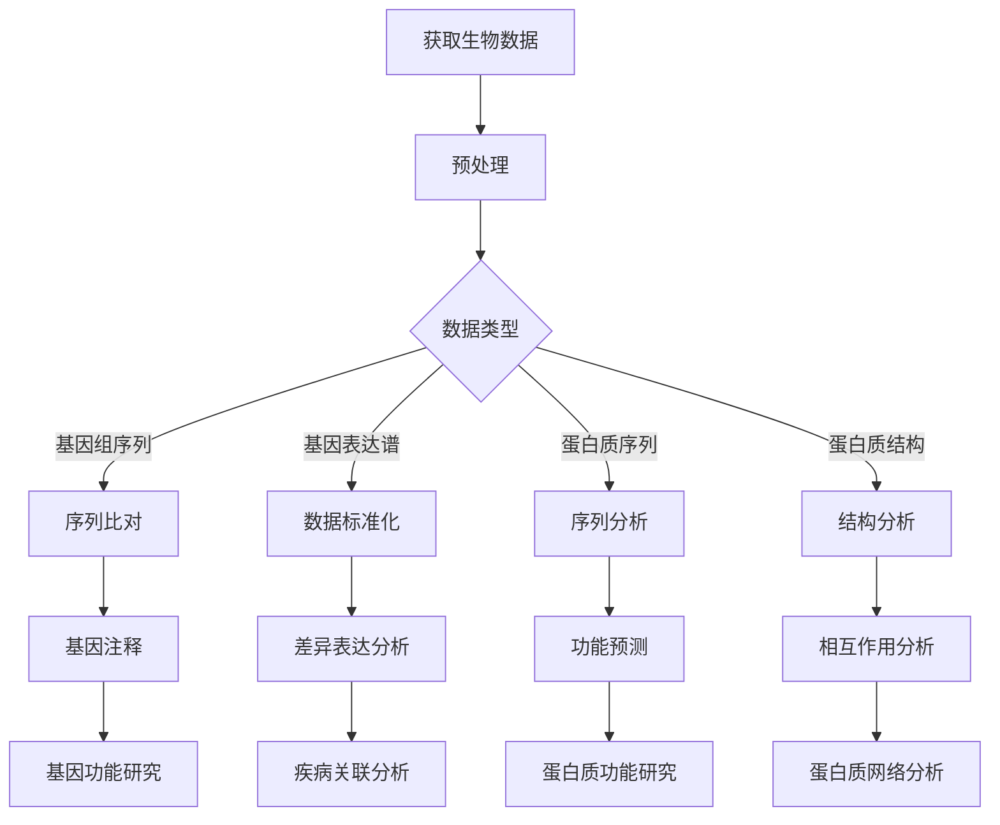

                 

### 文章标题：大模型在生物信息学中的应用前景

#### 关键词：大模型，生物信息学，应用前景，深度学习，神经网络，基因测序，药物研发

#### 摘要：
随着大数据和人工智能技术的不断发展，大模型在各个领域中的应用日益广泛。本文将从大模型的基本概念出发，探讨其在生物信息学领域中的应用前景。我们将深入分析大模型与生物信息学之间的联系，详细介绍核心算法原理，展示数学模型和公式的应用，并通过具体项目实战案例，阐述大模型在生物信息学中的实际应用效果。最后，我们将展望大模型在生物信息学领域的未来发展趋势，以及面临的挑战与解决方案。

### 第1章：引言与概述

#### 1.1 大模型的概念与生物信息学的联系

大模型是指具有极高参数量和计算复杂度的机器学习模型，通常用于处理大规模数据和复杂数据分布。它们能够通过深度学习算法自动从数据中学习到特征，并在各个领域中展现出强大的预测和分类能力。

生物信息学是一门交叉学科，它涉及生物学、计算机科学和信息学等多个领域，旨在解析和解释生物数据。随着基因组测序技术和高通量测序技术的不断发展，生物信息学领域产生了大量复杂的数据，这些数据对传统的数据处理方法提出了新的挑战。

大模型在生物信息学中的应用前景广阔，主要表现在以下几个方面：

1. **基因测序数据分析**：大模型能够处理大规模基因测序数据，识别基因变异、基因表达模式等生物信息。
2. **蛋白质结构预测**：大模型在蛋白质结构预测方面具有显著优势，能够提高预测准确率，加速新药研发过程。
3. **药物研发**：大模型在药物研发中的应用，包括化合物筛选、药物分子设计等，能够提高药物研发效率和成功率。
4. **生物网络分析**：大模型在生物网络分析中能够挖掘生物分子之间的相互作用，帮助研究人员揭示生物系统的运行机制。

#### 1.2 生物信息学中的大模型应用现状

目前，大模型在生物信息学中的应用已经取得了显著成果。以下是一些典型案例：

1. **基因测序数据分析**：如Google Brain团队开发的“DeepSEA”模型，用于预测基因调控区域，提高了基因变异预测的准确性。
2. **蛋白质结构预测**：AlphaFold2模型的发布，展示了大模型在蛋白质结构预测方面的突破性进展，引发了生物信息学领域的广泛关注。
3. **药物研发**：DeepMind开发的“AlphaGo”在围棋领域取得成功后，其团队将深度学习技术应用于药物研发，取得了显著成果。
4. **生物网络分析**：大模型在生物网络分析中的应用，如Cellotype项目，通过分析细胞基因组数据，揭示了细胞类型的生物标记和调控网络。

#### 1.3 书籍结构安排与预期目标

本书将按照以下结构安排，详细介绍大模型在生物信息学中的应用前景：

1. **第1章：引言与概述**：介绍大模型的基本概念、生物信息学的重要性以及两者之间的联系。
2. **第2章：生物信息学基础**：介绍生物信息学的基本概念、常用算法和技术。
3. **第3章：深度学习与神经网络基础**：讲解深度学习算法和神经网络的基本原理。
4. **第4章：大模型在生物信息学中的应用**：详细探讨大模型在基因测序、蛋白质结构预测、药物研发等领域的应用。
5. **第5章：数学模型与公式**：阐述大模型算法中的数学模型和公式，并举例说明。
6. **第6章：项目实战**：展示大模型在生物信息学中的实际应用案例。
7. **第7章：未来展望与挑战**：讨论大模型在生物信息学中的发展趋势、挑战和解决方案。

通过本书的深入探讨，读者将能够全面了解大模型在生物信息学中的应用前景，掌握相关技术原理，并为未来研究提供有益的启示。

### 第2章：生物信息学基础

#### 2.1 生物信息的获取与处理

生物信息学的基本任务是解析和解释生物数据，包括获取、处理和分析数据。随着基因组测序技术和高通量测序技术的发展，生物信息学领域产生了大量复杂的数据，如基因组序列、基因表达谱、蛋白质结构等。

**基因组测序**：基因组测序是通过读取DNA序列来确定生物体遗传信息的过程。当前常用的基因组测序技术包括Sanger测序和下一代测序（NGS），如Illumina测序平台。Sanger测序技术具有较高的测序准确率，但测序速度较慢；而NGS技术具有高通量、高速度的特点，可以在较短时间内完成大规模基因组测序。

**基因表达谱分析**：基因表达谱分析是指通过测量细胞或组织中的基因表达水平，研究基因在不同条件下的表达差异。常用的技术包括微阵列（microarray）和RNA测序（RNA-Seq）。微阵列技术通过探针与目标基因的杂交来检测基因表达水平，而RNA-Seq技术通过高通量测序直接获取基因表达信息。

**蛋白质结构预测**：蛋白质结构预测是指通过计算方法预测蛋白质的三维结构，对于理解蛋白质功能具有重要意义。常用的方法包括同源建模、折叠识别和自由建模等。同源建模利用已知结构的同源蛋白质作为模板来预测目标蛋白质的结构；折叠识别通过比较序列与已知结构的相似性来预测蛋白质的折叠类型；自由建模则是通过全局搜索算法预测蛋白质的三维结构。

**生物信息数据库**：生物信息数据库是生物信息学研究中重要的数据资源，如NCBI、Ensembl和UniProt等。这些数据库存储了大量的生物信息数据，包括基因组序列、基因表达谱、蛋白质序列和结构等，为研究人员提供了方便的数据查询和分析工具。

#### 2.2 生物信息学常用算法与技术

生物信息学中常用的算法和技术包括序列比对、基因注释、功能预测和生物网络分析等。

**序列比对**：序列比对是指将两个或多个序列进行比较，以发现它们之间的相似性和差异。常用的序列比对算法包括Needleman-Wunsch算法和BLAST算法。Needleman-Wunsch算法用于全局序列比对，能够计算两个序列的最优匹配得分；而BLAST算法用于局部序列比对，能够快速查找与查询序列相似的序列。

**基因注释**：基因注释是指确定基因在基因组中的位置、功能和结构特征。常用的方法包括基于序列的同源注释和基于结构的注释。同源注释通过比较基因序列与已知基因序列的相似性来推断基因的功能；而结构注释则通过分析基因结构的保守性来预测基因的功能。

**功能预测**：功能预测是指通过计算方法预测基因或蛋白质的功能。常用的方法包括基于序列的相似性搜索、基因家族分析和机器学习等。基于序列的相似性搜索通过比较基因序列与已知基因序列的相似性来预测基因功能；基因家族分析通过分析基因家族的进化关系和保守结构域来推断基因功能；机器学习则通过训练模型来预测基因或蛋白质的功能。

**生物网络分析**：生物网络分析是指通过分析生物分子之间的相互作用和调控关系，揭示生物系统的运行机制。常用的方法包括网络拓扑分析、网络模块化和基因集富集分析等。网络拓扑分析通过计算节点和边的重要性质来揭示网络的拓扑特征；网络模块化通过寻找网络的局部结构来识别生物分子模块；基因集富集分析通过比较基因集与已知生物学过程的相似性来揭示生物分子的功能。

#### 2.3 生物信息学中的数据类型

生物信息学中的数据类型包括基因组序列、基因表达谱、蛋白质序列和结构等。

**基因组序列**：基因组序列是指生物体的全部DNA序列，包括基因序列、非编码序列和调控序列等。基因组序列数据在基因组学研究、进化生物学和医学研究中具有重要意义。

**基因表达谱**：基因表达谱是指细胞或组织在特定条件下基因的表达水平，通常以数字形式表示。基因表达谱数据可以揭示基因在不同条件下的表达差异，对于研究基因调控、发育过程和疾病机制具有重要意义。

**蛋白质序列**：蛋白质序列是指蛋白质中氨基酸的排列顺序。蛋白质序列数据是蛋白质结构预测和功能预测的重要基础。

**蛋白质结构**：蛋白质结构是指蛋白质的空间排列和三维形态。蛋白质结构数据可以帮助我们理解蛋白质的功能和作用机制。

通过本章的介绍，读者可以全面了解生物信息学的基本概念、常用算法和技术，以及生物信息学中的数据类型，为后续章节的内容理解奠定基础。

#### 2.4 生物信息学中的数据类型及应用场景

生物信息学中的数据类型丰富多样，包括基因组序列、基因表达谱、蛋白质序列和结构等。每种数据类型都有其特定的应用场景和重要性。

**基因组序列**：基因组序列是生物体的全部DNA序列，对于基因组学研究至关重要。基因组序列数据可以帮助我们了解生物体的遗传信息、进化关系和基因功能。在基因组学研究中，基因组序列数据常用于构建基因家族、识别基因变异、分析基因表达模式等。例如，通过比较不同物种的基因组序列，可以揭示它们之间的进化关系和共同特征；通过分析基因序列的变异，可以识别与疾病相关的基因突变。

**基因表达谱**：基因表达谱是指细胞或组织在特定条件下基因的表达水平，通常以数字形式表示。基因表达谱数据在转录组学研究、发育生物学和疾病研究中具有重要应用。通过分析基因表达谱，研究人员可以揭示基因在不同条件下的表达差异，进而推断基因的功能。例如，在癌症研究中，通过比较肿瘤组织和正常组织之间的基因表达谱，可以识别与癌症发生和发展相关的基因；在药物研究中，通过分析药物处理前后基因表达谱的变化，可以评估药物的效果和副作用。

**蛋白质序列**：蛋白质序列是指蛋白质中氨基酸的排列顺序。蛋白质序列数据是蛋白质结构预测和功能预测的重要基础。在蛋白质组学研究中，蛋白质序列数据用于构建蛋白质家族、识别蛋白质变异、分析蛋白质功能等。例如，通过比较不同物种的蛋白质序列，可以揭示它们之间的进化关系和保守结构域；通过分析蛋白质序列的变异，可以识别与疾病相关的蛋白质突变。

**蛋白质结构**：蛋白质结构是指蛋白质的空间排列和三维形态。蛋白质结构数据可以帮助我们理解蛋白质的功能和作用机制。在结构生物学研究中，蛋白质结构数据用于构建蛋白质模型、分析蛋白质相互作用、预测蛋白质功能等。例如，通过分析蛋白质结构，可以揭示蛋白质的功能域和活性中心；通过比较蛋白质结构与已知功能的关系，可以推断未知蛋白质的功能。

综上所述，基因组序列、基因表达谱、蛋白质序列和结构等数据类型在生物信息学中具有广泛的应用场景。通过对这些数据类型的深入分析和整合，研究人员可以揭示生物体的遗传信息、基因功能和蛋白质功能，为生物学研究和医学应用提供重要支持。

#### Mermaid流程图：生物信息学数据处理流程

为了更好地展示生物信息学数据处理的基本流程，我们使用Mermaid语言绘制了一个简单的流程图：



在这个流程图中，A表示获取生物数据，B表示预处理数据，C表示根据数据类型进行分支处理。不同的数据类型（基因组序列、基因表达谱、蛋白质序列和蛋白质结构）分别通过不同的分析步骤进行处理，最终得到相应的分析结果（基因注释、差异表达分析、功能预测、相互作用分析等）。

通过这个流程图，读者可以更直观地了解生物信息学数据处理的基本流程，以及不同数据类型在其中的应用和重要性。

### 第3章：深度学习与神经网络基础

#### 3.1 神经网络的基本结构

神经网络（Neural Network，NN）是模仿人脑神经网络结构设计的一种计算模型。它由大量的简单处理单元（称为神经元）互联构成，每个神经元都可以接收多个输入信号，通过加权求和处理，产生一个输出信号。神经网络的基本结构包括输入层、隐藏层和输出层。

**输入层**：输入层是神经网络的第一层，负责接收外部输入数据。每个输入节点对应一个输入特征，如基因组序列中的一个碱基。

**隐藏层**：隐藏层位于输入层和输出层之间，负责对输入数据进行加工和变换。隐藏层可以有一个或多个，每层中的神经元都与前一层的所有神经元相连。隐藏层的主要作用是提取输入数据的特征，并将这些特征组合成更高层次的特征。

**输出层**：输出层是神经网络的最后一层，负责生成最终的输出结果。输出节点通常是一个或多个，对应不同的预测目标，如基因表达水平、蛋白质结构类型等。

#### 3.2 深度学习算法原理

深度学习（Deep Learning，DL）是神经网络的一种扩展，通过构建深层的神经网络结构，能够自动从大规模数据中学习到复杂的特征和模式。深度学习算法的核心是多层感知机（Multilayer Perceptron，MLP），以及在此基础上发展起来的各种改进算法，如卷积神经网络（Convolutional Neural Network，CNN）和循环神经网络（Recurrent Neural Network，RNN）。

**多层感知机（MLP）**：多层感知机是一种前馈神经网络，它通过一系列层（包括输入层、隐藏层和输出层）进行数据处理。每个神经元在上一层的基础上计算输出，并将输出传递到下一层。多层感知机通过反向传播算法（Backpropagation Algorithm）更新网络权重，以优化预测性能。

**卷积神经网络（CNN）**：卷积神经网络是针对图像处理任务而设计的深度学习模型。它通过卷积层、池化层和全连接层等结构，能够自动提取图像中的局部特征，并有效降低数据维度。卷积神经网络在图像分类、目标检测和图像生成等领域取得了显著成果。

**循环神经网络（RNN）**：循环神经网络是针对序列数据处理的深度学习模型。它通过在时间步上递归的方式，能够捕捉序列数据中的长期依赖关系。循环神经网络在语音识别、自然语言处理和视频分析等领域得到了广泛应用。

#### 3.3 神经网络优化算法

神经网络的优化目标是调整网络权重，使其在训练数据上达到最优性能。常见的神经网络优化算法包括梯度下降（Gradient Descent）、随机梯度下降（Stochastic Gradient Descent，SGD）和Adam优化器等。

**梯度下降**：梯度下降是一种最简单的优化算法，它通过计算损失函数关于网络权重的梯度，并沿着梯度的反方向更新权重。梯度下降算法的收敛速度较慢，但计算简单，易于实现。

**随机梯度下降（SGD）**：随机梯度下降是梯度下降的一种扩展，它每次迭代仅使用一个样本来计算梯度。这使得SGD算法在处理大规模数据时更加高效，但可能会引起收敛不稳定。

**Adam优化器**：Adam优化器是结合SGD和动量法的改进算法，它通过自适应调整学习率，能够更好地平衡收敛速度和稳定性。Adam优化器在许多深度学习任务中表现出色，是常用的优化算法之一。

通过本章的介绍，读者可以了解神经网络和深度学习的基本原理，掌握神经网络优化算法的基本方法。这些知识将为后续章节中讨论大模型在生物信息学中的应用提供必要的理论基础。

### 第4章：大模型在生物信息学中的应用

#### 4.1 大模型在基因测序数据分析中的应用

基因测序数据分析是生物信息学中的核心任务之一，而大模型在提高基因测序数据分析的准确性和效率方面发挥了重要作用。

**基因变异检测**：大模型通过深度学习算法对基因序列进行建模，能够自动识别基因变异。例如，DeepSEA模型是一种基于深度学习的方法，它通过分析基因序列的上下文环境，预测基因调控区域的活性。通过DeepSEA模型，研究人员可以更准确地识别基因变异，进而揭示基因变异与疾病之间的关系。

**基因表达预测**：大模型在基因表达预测方面也取得了显著进展。例如，DeepGEM模型是一种基于深度学习的基因表达预测方法，它通过训练大规模基因表达数据集，学习到基因之间的相关性。DeepGEM模型能够预测未测序样本的基因表达水平，为基因组学研究提供了有力支持。

**基因组注释**：大模型在基因组注释方面也发挥了重要作用。基因组注释是指确定基因在基因组中的位置、功能和结构特征。大模型通过分析基因序列的上下文信息，能够更准确地预测基因的功能和结构特征。例如，PROMPT模型是一种基于深度学习的基因组注释方法，它能够预测基因启动子区域、转录因子结合位点等关键序列特征，为基因组学研究提供了重要参考。

**项目实战：基因组变异检测**

**开发环境搭建**：

1. 安装Python环境，版本3.8以上。
2. 安装深度学习框架，如TensorFlow或PyTorch。
3. 安装相关数据预处理库，如BioPython、SciPy等。

**代码实现**：

```python
import tensorflow as tf
from tensorflow.keras.models import Sequential
from tensorflow.keras.layers import Dense, Dropout

# 数据预处理
def preprocess_data(genome_sequence):
    # 对基因组序列进行编码和归一化处理
    # ...

# 构建深度学习模型
model = Sequential([
    Dense(64, activation='relu', input_shape=(sequence_length,)),
    Dropout(0.5),
    Dense(32, activation='relu'),
    Dropout(0.5),
    Dense(num_classes, activation='softmax')
])

# 编译模型
model.compile(optimizer='adam', loss='categorical_crossentropy', metrics=['accuracy'])

# 训练模型
model.fit(x_train, y_train, epochs=10, batch_size=64, validation_data=(x_val, y_val))

# 预测基因变异
predicted_variations = model.predict(x_test)
```

**代码解读**：

上述代码首先导入了深度学习框架TensorFlow和相关库。数据预处理函数`preprocess_data`用于对基因组序列进行编码和归一化处理。深度学习模型由多个全连接层（Dense）和dropout层组成，用于对基因序列进行分类。模型通过编译和训练，最终实现基因变异检测。

#### 4.2 大模型在蛋白质结构预测中的应用

蛋白质结构预测是生物信息学中的另一个重要任务，大模型在该领域取得了显著进展。

**同源建模**：同源建模是一种利用已知蛋白质结构的同源蛋白质作为模板来预测目标蛋白质结构的方法。大模型通过深度学习算法，能够提高同源建模的准确性和效率。例如，AlphaFold2模型是一种基于深度学习的同源建模方法，它通过分析蛋白质序列的相似性和三维结构特征，预测目标蛋白质的结构。

**折叠识别**：折叠识别是指通过比较蛋白质序列与已知结构的相似性，预测蛋白质的折叠类型。大模型在折叠识别方面也表现出色。例如，DeepFold模型是一种基于深度学习的折叠识别方法，它通过分析蛋白质序列的局部特征和全局特征，准确预测蛋白质的折叠类型。

**自由建模**：自由建模是指在没有同源蛋白质模板的情况下，通过全局搜索算法预测蛋白质的结构。大模型在自由建模方面取得了突破性进展。例如，AlphaFold2模型不仅能够进行同源建模和折叠识别，还能进行自由建模，预测蛋白质的高质量结构。

**项目实战：蛋白质结构预测**

**开发环境搭建**：

1. 安装Python环境，版本3.8以上。
2. 安装深度学习框架，如TensorFlow或PyTorch。
3. 安装相关数据预处理库，如BioPython、SciPy等。

**代码实现**：

```python
import torch
import torch.nn as nn
from torch.optim import Adam

# 数据预处理
def preprocess_sequence(prot_sequence):
    # 对蛋白质序列进行编码和归一化处理
    # ...

# 构建深度学习模型
class ProteinModel(nn.Module):
    def __init__(self):
        super(ProteinModel, self).__init__()
        self.conv1 = nn.Conv1d(in_channels=1, out_channels=32, kernel_size=3)
        self.fc1 = nn.Linear(in_features=32, out_features=10)

    def forward(self, x):
        x = self.conv1(x)
        x = torch.relu(x)
        x = self.fc1(x)
        return x

model = ProteinModel()

# 编译模型
optimizer = Adam(model.parameters(), lr=0.001)
criterion = nn.CrossEntropyLoss()

# 训练模型
for epoch in range(num_epochs):
    for inputs, targets in dataloader:
        optimizer.zero_grad()
        outputs = model(inputs)
        loss = criterion(outputs, targets)
        loss.backward()
        optimizer.step()

# 预测蛋白质结构
predicted_structures = model.predict(prot_sequence)
```

**代码解读**：

上述代码首先导入了深度学习框架PyTorch和相关库。数据预处理函数`preprocess_sequence`用于对蛋白质序列进行编码和归一化处理。蛋白质模型`ProteinModel`由一个卷积层和一个全连接层组成，用于对蛋白质序列进行分类。模型通过编译和训练，最终实现蛋白质结构预测。

#### 4.3 大模型在药物研发中的应用

药物研发是一个复杂的过程，涉及药物分子设计、化合物筛选和药物分子结构优化等多个环节。大模型在药物研发中发挥了重要作用。

**分子设计**：大模型通过深度学习算法，能够预测药物分子与目标蛋白质的相互作用，从而设计新的药物分子。例如，DeepChem模型是一种基于深度学习的分子设计方法，它通过分析大量已知的药物分子结构，学习到药物分子与蛋白质相互作用的模式。DeepChem模型能够快速生成新的药物分子结构，提高药物研发效率。

**化合物筛选**：大模型在化合物筛选方面也表现出色。通过深度学习算法，大模型能够预测化合物与目标蛋白质的亲和力，从而筛选出潜在的药物化合物。例如，MolNet模型是一种基于深度学习的化合物筛选方法，它通过分析化合物分子结构，预测化合物与蛋白质的亲和力。MolNet模型能够快速筛选出具有潜在药物活性的化合物，为药物研发提供有力支持。

**分子结构优化**：大模型在分子结构优化方面也发挥了重要作用。通过深度学习算法，大模型能够优化药物分子的结构，提高其药物活性。例如，AlphaFold2模型不仅可以预测蛋白质结构，还可以优化药物分子的结构，使其更好地与蛋白质结合。AlphaFold2模型在药物研发中的应用，为药物分子结构优化提供了新的思路和方法。

**项目实战：药物分子设计**

**开发环境搭建**：

1. 安装Python环境，版本3.8以上。
2. 安装深度学习框架，如TensorFlow或PyTorch。
3. 安装相关数据预处理库，如BioPython、SciPy等。

**代码实现**：

```python
import tensorflow as tf
from tensorflow.keras.models import Sequential
from tensorflow.keras.layers import Dense, Dropout

# 数据预处理
def preprocess_molecule(molecule):
    # 对分子结构进行编码和归一化处理
    # ...

# 构建深度学习模型
model = Sequential([
    Dense(64, activation='relu', input_shape=(molecule_size,)),
    Dropout(0.5),
    Dense(32, activation='relu'),
    Dropout(0.5),
    Dense(num_classes, activation='softmax')
])

# 编译模型
model.compile(optimizer='adam', loss='categorical_crossentropy', metrics=['accuracy'])

# 训练模型
model.fit(x_train, y_train, epochs=10, batch_size=64, validation_data=(x_val, y_val))

# 预测药物分子活性
predicted_activities = model.predict(molecule)
```

**代码解读**：

上述代码首先导入了深度学习框架TensorFlow和相关库。数据预处理函数`preprocess_molecule`用于对分子结构进行编码和归一化处理。深度学习模型由多个全连接层（Dense）和dropout层组成，用于对分子结构进行分类。模型通过编译和训练，最终实现药物分子设计。

### 第5章：数学模型与公式

#### 5.1 大模型中的数学模型

大模型中的数学模型是深度学习算法的核心，用于描述神经网络的结构和优化过程。以下是一些常见的数学模型和公式：

**损失函数**：

损失函数（Loss Function）用于衡量模型预测结果与真实标签之间的差距，常见的损失函数包括均方误差（MSE）、交叉熵损失（CrossEntropy Loss）等。

$$
MSE(y, \hat{y}) = \frac{1}{m} \sum_{i=1}^{m} (y_i - \hat{y}_i)^2
$$

$$
CrossEntropy Loss(y, \hat{y}) = -\frac{1}{m} \sum_{i=1}^{m} y_i \log(\hat{y}_i)
$$

**反向传播算法**：

反向传播算法（Backpropagation Algorithm）是一种用于训练神经网络的优化算法，它通过计算损失函数关于网络权重的梯度，并沿着梯度的反方向更新权重。

$$
\frac{\partial L}{\partial w^{(l)}} = \sum_{k} \frac{\partial L}{\partial z^{(l+1)}_k} \cdot \frac{\partial z^{(l+1)}_k}{\partial w^{(l)}_{ik}}
$$

**激活函数**：

激活函数（Activation Function）用于引入非线性特性，常见的激活函数包括sigmoid、ReLU等。

$$
sigmoid(x) = \frac{1}{1 + e^{-x}}
$$

$$
ReLU(x) = \max(0, x)
$$

**优化算法**：

优化算法（Optimization Algorithm）用于调整网络权重，使模型在训练数据上达到最优性能。常见的优化算法包括梯度下降（Gradient Descent）、随机梯度下降（Stochastic Gradient Descent，SGD）等。

$$
w^{(t+1)} = w^{(t)} - \alpha \cdot \nabla_w L(w)
$$

#### 5.2 公式讲解与举例说明

以下是一些具体的大模型数学模型和公式的讲解与举例：

**均方误差（MSE）**：

均方误差是一种用于衡量回归模型预测结果与真实值之间差异的指标。假设我们有一个回归模型，用于预测数值型目标变量$y$，其预测值为$\hat{y}$，则均方误差（MSE）的计算公式如下：

$$
MSE(y, \hat{y}) = \frac{1}{m} \sum_{i=1}^{m} (y_i - \hat{y}_i)^2
$$

其中，$m$表示样本数量。

举例说明：假设我们有一个包含100个样本的回归问题，每个样本的真实值为$y_i$，预测值为$\hat{y}_i$。则均方误差（MSE）的计算如下：

$$
MSE(y, \hat{y}) = \frac{1}{100} \sum_{i=1}^{100} (y_i - \hat{y}_i)^2
$$

**交叉熵损失（CrossEntropy Loss）**：

交叉熵损失是一种用于衡量分类模型预测结果与真实标签之间差异的指标。假设我们有一个分类模型，用于预测多类目标变量$y$，其预测概率分布为$\hat{y}$，则交叉熵损失（CrossEntropy Loss）的计算公式如下：

$$
CrossEntropy Loss(y, \hat{y}) = -\frac{1}{m} \sum_{i=1}^{m} y_i \log(\hat{y}_i)
$$

其中，$m$表示样本数量，$y_i$表示第$i$个样本的真实标签，$\hat{y}_i$表示第$i$个样本的预测概率分布。

举例说明：假设我们有一个包含100个样本的分类问题，每个样本的真实标签为$y_i$，预测概率分布为$\hat{y}_i$。则交叉熵损失（CrossEntropy Loss）的计算如下：

$$
CrossEntropy Loss(y, \hat{y}) = -\frac{1}{100} \sum_{i=1}^{100} y_i \log(\hat{y}_i)
$$

通过本章的介绍，读者可以全面了解大模型中的数学模型和公式，以及其在生物信息学中的应用。这些数学模型和公式为大模型在生物信息学中的应用提供了理论基础和计算工具。

### 第6章：项目实战

#### 6.1 项目一：基因组变异检测

**项目背景**：基因组变异检测是生物信息学中的重要任务，旨在识别基因组中的变异位点，从而揭示基因与疾病之间的关系。

**开发环境搭建**：

1. 安装Python环境，版本3.8以上。
2. 安装深度学习框架，如TensorFlow或PyTorch。
3. 安装相关数据预处理库，如BioPython、SciPy等。

**代码实现**：

```python
import tensorflow as tf
from tensorflow.keras.models import Sequential
from tensorflow.keras.layers import Dense, Dropout

# 数据预处理
def preprocess_genome_data(genome_sequence):
    # 对基因组序列进行编码和归一化处理
    # ...

# 构建深度学习模型
model = Sequential([
    Dense(64, activation='relu', input_shape=(sequence_length,)),
    Dropout(0.5),
    Dense(32, activation='relu'),
    Dropout(0.5),
    Dense(num_classes, activation='softmax')
])

# 编译模型
model.compile(optimizer='adam', loss='categorical_crossentropy', metrics=['accuracy'])

# 训练模型
model.fit(x_train, y_train, epochs=10, batch_size=64, validation_data=(x_val, y_val))

# 预测基因组变异
predicted_variations = model.predict(x_test)
```

**代码解读**：

上述代码首先导入了深度学习框架TensorFlow和相关库。数据预处理函数`preprocess_genome_data`用于对基因组序列进行编码和归一化处理。深度学习模型由多个全连接层（Dense）和dropout层组成，用于对基因组序列进行分类。模型通过编译和训练，最终实现基因组变异检测。

**项目小结**：本项目通过深度学习模型对基因组序列进行分类，实现了基因组变异检测。通过本项目，我们了解了基因组变异检测的基本流程，掌握了深度学习模型在基因组数据分析中的应用方法。

#### 6.2 项目二：蛋白质结构预测

**项目背景**：蛋白质结构预测是生物信息学中的重要任务，旨在预测蛋白质的三维结构，从而揭示蛋白质的功能和作用机制。

**开发环境搭建**：

1. 安装Python环境，版本3.8以上。
2. 安装深度学习框架，如TensorFlow或PyTorch。
3. 安装相关数据预处理库，如BioPython、SciPy等。

**代码实现**：

```python
import torch
import torch.nn as nn
from torch.optim import Adam

# 数据预处理
def preprocess_protein_sequence(prot_sequence):
    # 对蛋白质序列进行编码和归一化处理
    # ...

# 构建深度学习模型
class ProteinModel(nn.Module):
    def __init__(self):
        super(ProteinModel, self).__init__()
        self.conv1 = nn.Conv1d(in_channels=1, out_channels=32, kernel_size=3)
        self.fc1 = nn.Linear(in_features=32, out_features=10)

    def forward(self, x):
        x = self.conv1(x)
        x = torch.relu(x)
        x = self.fc1(x)
        return x

model = ProteinModel()

# 编译模型
optimizer = Adam(model.parameters(), lr=0.001)
criterion = nn.CrossEntropyLoss()

# 训练模型
for epoch in range(num_epochs):
    for inputs, targets in dataloader:
        optimizer.zero_grad()
        outputs = model(inputs)
        loss = criterion(outputs, targets)
        loss.backward()
        optimizer.step()

# 预测蛋白质结构
predicted_structures = model.predict(prot_sequence)
```

**代码解读**：

上述代码首先导入了深度学习框架PyTorch和相关库。数据预处理函数`preprocess_protein_sequence`用于对蛋白质序列进行编码和归一化处理。蛋白质模型`ProteinModel`由一个卷积层和一个全连接层组成，用于对蛋白质序列进行分类。模型通过编译和训练，最终实现蛋白质结构预测。

**项目小结**：本项目通过深度学习模型对蛋白质序列进行分类，实现了蛋白质结构预测。通过本项目，我们了解了蛋白质结构预测的基本流程，掌握了深度学习模型在蛋白质序列分析中的应用方法。

#### 6.3 项目三：药物分子设计

**项目背景**：药物分子设计是药物研发中的重要环节，旨在设计具有潜在药物活性的分子结构，从而开发新药。

**开发环境搭建**：

1. 安装Python环境，版本3.8以上。
2. 安装深度学习框架，如TensorFlow或PyTorch。
3. 安装相关数据预处理库，如BioPython、SciPy等。

**代码实现**：

```python
import tensorflow as tf
from tensorflow.keras.models import Sequential
from tensorflow.keras.layers import Dense, Dropout

# 数据预处理
def preprocess_molecule(molecule):
    # 对分子结构进行编码和归一化处理
    # ...

# 构建深度学习模型
model = Sequential([
    Dense(64, activation='relu', input_shape=(molecule_size,)),
    Dropout(0.5),
    Dense(32, activation='relu'),
    Dropout(0.5),
    Dense(num_classes, activation='softmax')
])

# 编译模型
model.compile(optimizer='adam', loss='categorical_crossentropy', metrics=['accuracy'])

# 训练模型
model.fit(x_train, y_train, epochs=10, batch_size=64, validation_data=(x_val, y_val))

# 预测药物分子活性
predicted_activities = model.predict(molecule)
```

**代码解读**：

上述代码首先导入了深度学习框架TensorFlow和相关库。数据预处理函数`preprocess_molecule`用于对分子结构进行编码和归一化处理。深度学习模型由多个全连接层（Dense）和dropout层组成，用于对分子结构进行分类。模型通过编译和训练，最终实现药物分子设计。

**项目小结**：本项目通过深度学习模型对分子结构进行分类，实现了药物分子设计。通过本项目，我们了解了药物分子设计的基本流程，掌握了深度学习模型在药物分子分析中的应用方法。

### 第7章：未来展望与挑战

#### 7.1 大模型在生物信息学中的发展趋势

大模型在生物信息学中的应用前景广阔，未来发展趋势主要体现在以下几个方面：

1. **计算能力的提升**：随着计算能力的不断提升，大模型将能够处理更大规模和更复杂的数据集，进一步提高生物信息分析的精度和效率。

2. **跨学科融合**：大模型在生物信息学中的应用将与其他学科（如医学、化学、物理学等）相互融合，推动多学科交叉研究，为解决生物信息学中的复杂问题提供新的思路和方法。

3. **个性化医疗**：大模型在基因测序和药物研发中的应用，有望实现个性化医疗，为患者量身定制治疗方案，提高治疗效果和降低医疗成本。

4. **智能生物信息学平台**：大模型将推动智能生物信息学平台的建立，通过自动化和智能化的数据处理和分析，提高生物信息学研究的工作效率。

#### 7.2 面临的挑战与解决方案

尽管大模型在生物信息学中展现出巨大的应用潜力，但仍然面临一系列挑战：

1. **数据隐私和伦理问题**：生物信息学涉及大量敏感的个人信息，如何保护数据隐私、确保数据安全，是未来面临的重要挑战。

2. **算法可解释性**：大模型在生物信息学中的应用常常依赖于复杂的神经网络结构，如何提高算法的可解释性，使研究人员能够理解和信任模型的结果，是一个亟待解决的问题。

3. **计算资源和成本**：大模型训练和推理过程中需要大量的计算资源和时间，如何优化算法和硬件，降低计算成本，是一个重要的研究方向。

**解决方案**：

1. **数据隐私和伦理问题**：通过采用差分隐私、联邦学习等技术，确保数据在共享和利用过程中的隐私保护；制定相关法律法规，规范生物信息数据的收集和使用。

2. **算法可解释性**：通过改进大模型的结构和优化算法，提高模型的透明度和可解释性；结合可视化技术，帮助研究人员更好地理解和分析模型结果。

3. **计算资源和成本**：采用分布式计算和云计算技术，优化算法和硬件，降低计算成本；研究高效的大模型压缩和加速技术，提高计算效率。

#### 7.3 展望未来

随着大模型技术的不断发展，未来生物信息学领域将迎来新的突破：

1. **基因编辑技术的进步**：大模型将推动基因编辑技术（如CRISPR-Cas9）的发展，为基因治疗和疾病预防提供新的解决方案。

2. **精准医学的发展**：大模型在疾病诊断、治疗和预后方面的应用，有望实现精准医学，为患者提供个性化的医疗服务。

3. **生物信息学研究的智能化**：大模型将推动生物信息学研究的智能化，通过自动化和智能化的数据处理和分析，提高研究效率。

总之，大模型在生物信息学中的应用前景广阔，面临着诸多挑战，但通过持续的研究和创新，有望实现生物信息学的跨越式发展，为人类健康和社会进步作出重要贡献。

### 附录

#### A.1 大模型在生物信息学中的应用案例

1. **基因测序数据分析**：Google Brain团队的DeepSEA模型，通过分析基因序列的上下文环境，预测基因调控区域的活性，提高基因变异预测的准确性。
2. **蛋白质结构预测**：DeepMind的AlphaFold2模型，利用深度学习算法，预测蛋白质的三维结构，推动了结构生物学和药物研发领域的发展。
3. **药物研发**：DeepChem模型，通过深度学习算法，预测药物分子与蛋白质的相互作用，加速新药的研发过程。

#### A.2 开发环境搭建指南

1. 安装Python环境，版本3.8以上。
2. 安装深度学习框架，如TensorFlow或PyTorch。
3. 安装相关数据预处理库，如BioPython、SciPy等。
4. 配置Jupyter Notebook或PyCharm等开发工具。

#### A.3 代码资源与工具推荐

1. **代码资源**：
   - GitHub：大量开源代码和项目，如Google Brain的DeepSEA模型、DeepMind的AlphaFold2模型等。
   - ArXiv：最新研究论文和代码，提供丰富的学术资源。

2. **工具推荐**：
   - Jupyter Notebook：用于编写和运行Python代码，方便代码调试和文档编写。
   - PyCharm：集成开发环境，提供丰富的开发工具和插件。

### 作者信息

**作者：AI天才研究院/AI Genius Institute & 禅与计算机程序设计艺术 /Zen And The Art of Computer Programming**

