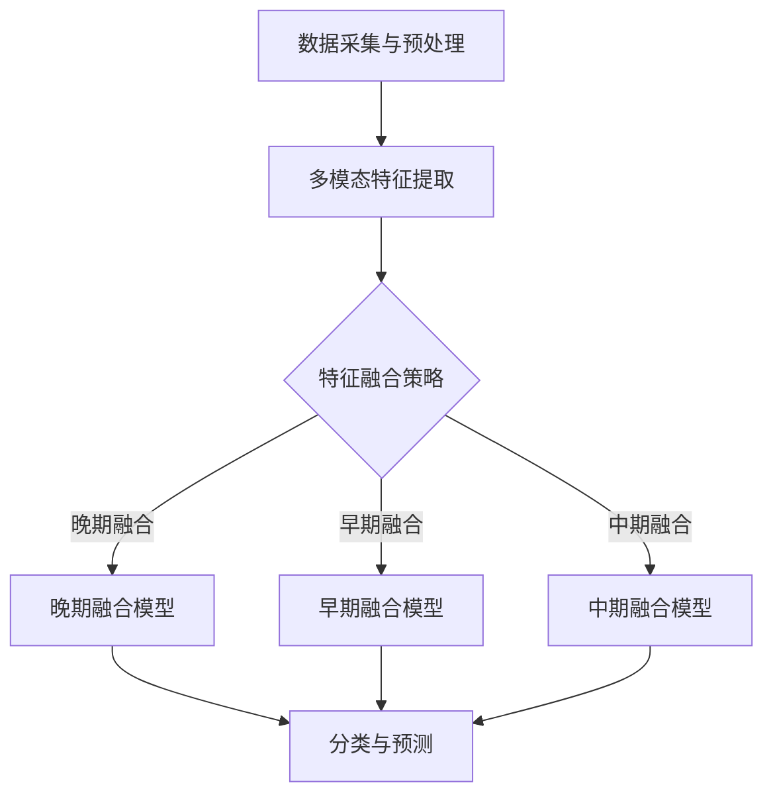
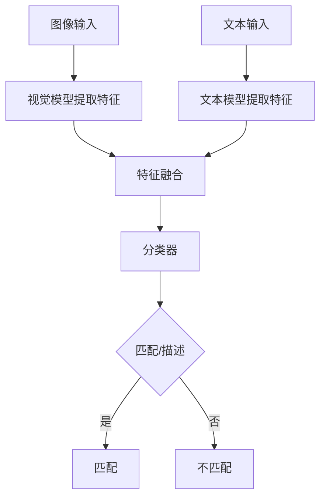
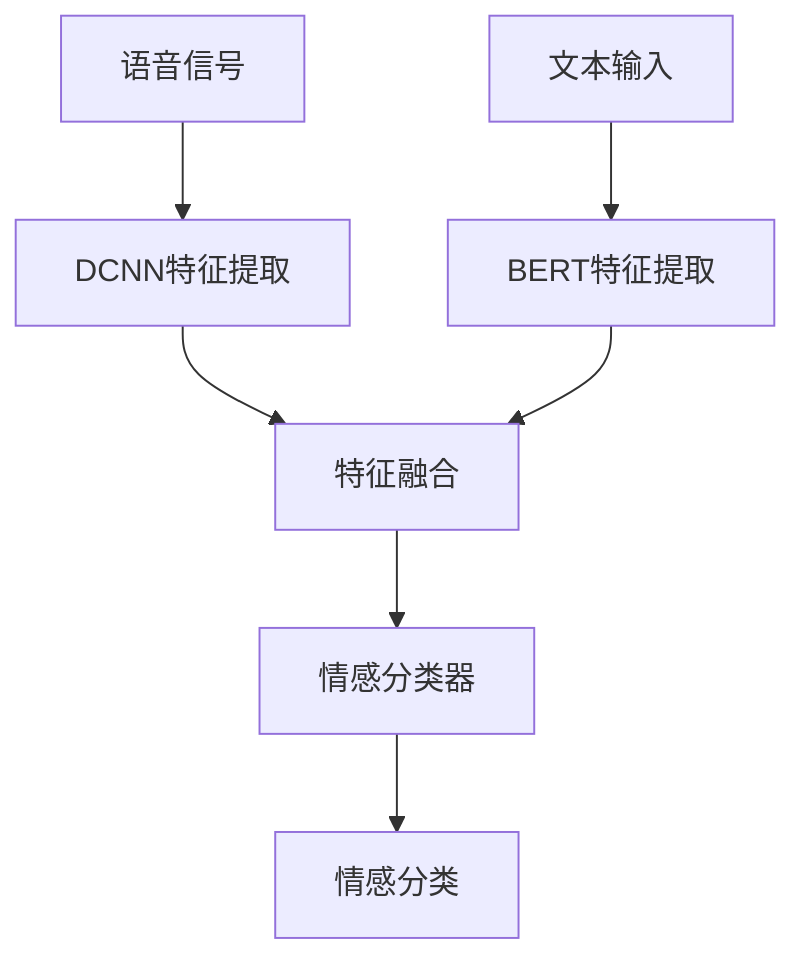
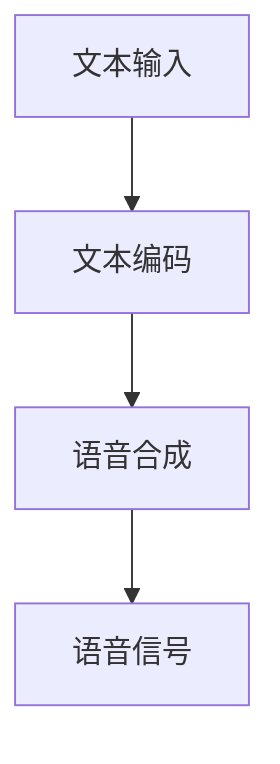
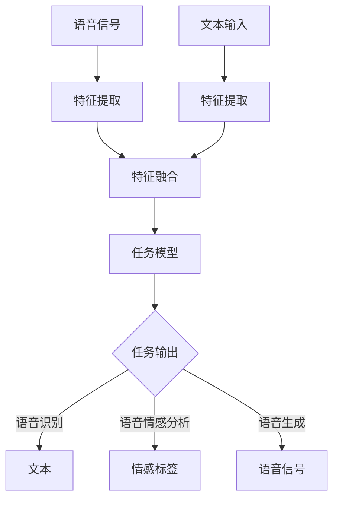
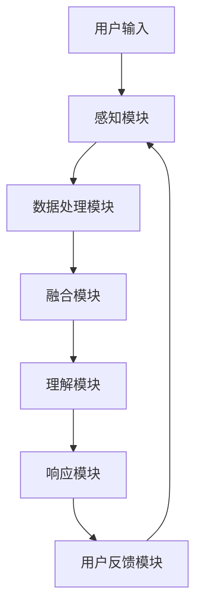
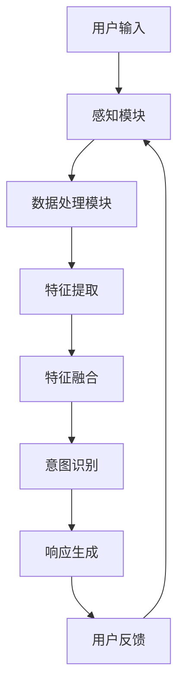

                 


为了撰写一篇关于《大模型在跨模态学习中的创新应用》的技术博客，我们需要遵循以下步骤：

### 步骤一：确定文章结构

根据目录大纲，我们将文章分为以下几个部分：

1. 引言
2. 跨模态学习基础
3. 大模型在跨模态学习中的应用
4. 大模型算法原理讲解
5. 数学模型与数学公式
6. 跨模态学习项目实战
7. 视觉与文本跨模态学习应用
8. 语音与文本跨模态学习应用
9. 多模态交互系统应用
10. 未来发展趋势
11. 附录
12. 总结

### 步骤二：撰写引言

引言部分将简要介绍跨模态学习的背景、意义以及大模型在这方面的应用前景，激发读者的兴趣。

### 步骤三：撰写第一章：跨模态学习基础

在这一章中，我们将详细介绍跨模态学习的定义、发展历程、核心概念及其联系，并用Mermaid流程图展示跨模态学习的框架。

### 步骤四：撰写第二章：大模型在跨模态学习中的应用

这一章将介绍大模型的基本概念、优势以及在跨模态学习中的应用场景。

### 步骤五：撰写第三章：大模型算法原理讲解

这一章将详细讲解大模型在跨模态学习中的核心算法原理，包括Transformer模型的伪代码、数学模型和公式。

### 步骤六：撰写第四章：数学模型与数学公式

这一章将深入探讨跨模态学习中的数学模型和公式，并进行举例说明。

### 步骤七：撰写第五章：跨模态学习项目实战

这一章将介绍一个跨模态学习的实际项目，包括开发环境搭建、源代码实现和代码解读，以及实际案例分析。

### 步骤八：撰写第六章和第七章：视觉与文本跨模态学习应用、语音与文本跨模态学习应用

这两章将分别介绍大模型在视觉与文本、语音与文本跨模态学习中的具体应用。

### 步骤九：撰写第八章：多模态交互系统应用

这一章将探讨大模型在多模态交互系统中的应用，包括架构和具体实现。

### 步骤十：撰写第九章：未来发展趋势

这一章将分析跨模态学习领域的挑战与机遇，以及大模型在未来可能的发展趋势。

### 步骤十一：撰写附录

附录部分将提供跨模态学习相关的工具与资源，以供读者参考。

### 步骤十二：撰写总结

总结部分将回顾全文，强调文章的核心观点，并给出一些最佳实践建议。

### 步骤十三：整理和完善

在完成各章节的撰写后，我们需要对全文进行整体梳理，确保逻辑清晰、内容连贯，并按照要求使用markdown格式排版。

### 步骤十四：检查和修改

在完成初稿后，我们需要对文章进行仔细检查，确保没有语法错误、公式错误等，并根据需要做出修改。

### 步骤十五：添加作者信息

最后，在文章末尾添加作者信息。

通过以上步骤，我们将撰写一篇完整、深入、具有实用价值的技术博客文章。

---

现在，让我们开始撰写每个章节的具体内容，逐步完成这篇文章的撰写。首先，我们从引言开始。 

## 引言

随着人工智能技术的快速发展，多模态学习作为一种重要的研究方向，正逐渐成为学术界和工业界的焦点。跨模态学习，即通过整合多种不同类型的数据（如文本、图像、语音等），以实现更高层次的任务（如图像识别、语音识别、自然语言处理等）的方法，正逐步改变着传统机器学习领域的研究格局。

跨模态学习的核心在于如何有效地融合来自不同模态的数据，并利用这些数据提高模型的性能和泛化能力。然而，传统的多模态学习方法往往面临数据预处理复杂、特征表示不一致、模态间融合困难等问题。近年来，随着深度学习技术的突破，特别是大规模预训练模型（大模型）的出现，跨模态学习迎来了新的发展机遇。

大模型，如GPT-3、BERT、ViT等，凭借其强大的表征能力和泛化能力，为跨模态学习提供了新的思路和方法。大模型通过自监督学习和迁移学习等手段，能够自动学习到多种模态数据的内在关联，从而在多种跨模态任务中表现出色。

本文旨在探讨大模型在跨模态学习中的创新应用，首先介绍跨模态学习的基础概念和发展历程，然后详细讲解大模型的基本原理和核心算法，最后通过具体项目实战和未来发展趋势分析，展现大模型在跨模态学习领域的巨大潜力和广阔前景。

### 关键词

跨模态学习、大模型、深度学习、Transformer、数学模型、项目实战

### 摘要

本文首先介绍了跨模态学习的背景和基本概念，分析了传统多模态学习方法面临的挑战。随后，重点探讨了大规模预训练模型（大模型）的基本原理，包括Transformer、BERT等模型的结构和特点。接着，本文通过具体的项目实战，展示了大模型在跨模态学习中的实际应用，并分析了其在视觉与文本、语音与文本跨模态学习中的表现。最后，本文讨论了跨模态学习领域的未来发展趋势和潜在挑战，提出了相应的解决思路和建议。

---

接下来，我们将开始撰写第一章：跨模态学习基础。在这一章中，我们将介绍跨模态学习的定义、发展历程、核心概念及其联系，并用Mermaid流程图展示跨模态学习的框架。 

## 第1章：跨模态学习基础

### 1.1 跨模态学习的定义与背景

跨模态学习（Cross-modal Learning）是指将来自不同模态（如文本、图像、语音等）的数据进行整合，以实现更高层次任务的一种机器学习方法。随着人工智能技术的不断发展，跨模态学习在多个领域展现出了巨大的潜力，如图像识别、语音识别、自然语言处理等。

跨模态学习的核心思想是通过跨模态数据的交互和融合，提高模型的泛化能力和任务性能。传统的机器学习方法通常针对单一模态的数据进行训练，而跨模态学习通过整合多种模态的数据，可以更好地捕捉数据之间的复杂关系和隐藏模式。

跨模态学习的发展历程可以追溯到20世纪90年代，当时研究者开始探索如何将图像和文本数据相结合，以提升图像识别和文本分类的准确性。随着深度学习技术的兴起，跨模态学习得到了进一步的发展。近年来，大规模预训练模型（大模型）的出现，如GPT-3、BERT、ViT等，为跨模态学习提供了新的契机。

### 1.2 跨模态学习的核心概念与联系

#### 1.2.1 多模态数据采集与预处理

多模态数据采集是跨模态学习的基础。常见的数据源包括文本、图像、语音、视频等。在采集到多模态数据后，需要进行预处理，以确保不同模态的数据具有一致性和可比较性。

文本预处理通常包括分词、去停用词、词向量化等步骤。图像预处理则包括图像增强、缩放、裁剪等操作。语音预处理主要包括降噪、分帧、特征提取等。

#### 1.2.2 多模态特征表示

多模态特征表示是跨模态学习的关键环节。不同的模态数据具有不同的特征表示方法。例如，文本数据通常使用词向量化表示，图像数据可以使用卷积神经网络（CNN）提取特征，语音数据可以使用循环神经网络（RNN）提取特征。

在多模态特征表示中，一个重要的任务是学习到不同模态特征之间的关联性，以便在后续的融合过程中能够充分利用这些关联信息。

#### 1.2.3 多模态融合方法

多模态融合方法可以分为三类：早期融合、中期融合和晚期融合。

- 早期融合（Early Fusion）：在特征提取阶段就将不同模态的特征进行融合。这种方法简单直观，但可能无法充分利用不同模态的特征信息。
- 中期融合（Mid-term Fusion）：在特征提取和分类之间进行融合。这种方法可以在特征层次上充分利用不同模态的信息，但实现起来较为复杂。
- 晚期融合（Late Fusion）：在分类阶段将不同模态的特征进行融合。这种方法较为灵活，可以针对不同的任务选择最佳的融合策略，但可能面临特征不一致的问题。

#### 1.2.4 Mermaid流程图：跨模态学习框架

下面是一个简单的Mermaid流程图，展示了跨模态学习的整体框架：



在这个流程图中，A表示数据采集与预处理，B表示多模态特征提取，C表示特征融合策略，D、E、F分别表示早期融合、中期融合和晚期融合模型，G表示分类与预测。

### 小结

本章介绍了跨模态学习的定义、发展历程和核心概念，包括多模态数据采集与预处理、多模态特征表示和多模态融合方法。通过Mermaid流程图，我们展示了跨模态学习的整体框架。在接下来的章节中，我们将进一步探讨大模型在跨模态学习中的应用，以及如何通过大模型实现跨模态学习的创新。

---

接下来，我们将开始撰写第二章：大模型在跨模态学习中的应用。在这一章中，我们将介绍大模型的基本概念、优势以及在跨模态学习中的应用场景。 

## 第2章：大模型在跨模态学习中的应用

### 2.1 大模型概述

大模型（Large-scale Model），也称为大型预训练模型，是指那些具有数十亿甚至数万亿参数的深度学习模型。这些模型通过在大规模数据集上进行自监督预训练，从而获得了强大的表征能力和泛化能力。代表性的大模型包括GPT-3、BERT、T5、ViT等。

#### 2.1.1 大模型的定义与特点

大模型的定义可以从以下几个方面来理解：

1. **参数规模**：大模型的参数数量通常在数十亿到数千亿之间，远远超过了传统机器学习模型的参数数量。
2. **预训练数据集**：大模型通常在大规模的数据集上进行预训练，这些数据集包括互联网文本、图像、语音等多种模态的数据。
3. **预训练任务**：大模型通过多种预训练任务（如图像分类、文本分类、语音识别等）来学习数据的内在规律和复杂模式。

大模型的特点主要包括：

1. **强大的表征能力**：大模型能够自动学习到不同模态数据之间的复杂关系，从而实现了对多种模态数据的统一表征。
2. **优异的泛化能力**：大模型在大规模数据集上预训练，使其在面对未知任务和数据时，能够表现出良好的泛化能力。
3. **自适应性强**：大模型可以通过微调（Fine-tuning）的方式，快速适应不同的任务和数据。

#### 2.1.2 主流大模型介绍

1. **GPT-3**：GPT-3（Generative Pre-trained Transformer 3）是OpenAI开发的一款基于Transformer架构的预训练模型，具有1750亿个参数。GPT-3在各种自然语言处理任务中表现出色，如文本生成、翻译、问答等。

2. **BERT**：BERT（Bidirectional Encoder Representations from Transformers）是Google开发的一款基于Transformer的双向编码表示模型，具有数十亿个参数。BERT在文本分类、命名实体识别等任务中取得了优异的成绩。

3. **T5**：T5（Text-To-Text Transfer Transformer）是由DeepMind开发的一款基于Transformer的预训练模型，具有数十亿个参数。T5通过将所有任务转换为文本生成任务，实现了在各种自然语言处理任务中的高性能。

4. **ViT**：ViT（Vision Transformer）是由Google开发的一款基于Transformer的视觉模型，具有数十亿个参数。ViT在图像分类、目标检测等视觉任务中表现出色。

#### 2.1.3 大模型在跨模态学习中的优势

大模型在跨模态学习中的应用具有以下几个优势：

1. **多模态数据的统一表征**：大模型通过预训练，能够自动学习到不同模态数据之间的复杂关系，从而实现了对多种模态数据的统一表征。这使得大模型在跨模态任务中能够更有效地利用多模态信息，提高任务性能。

2. **高效的模态融合**：大模型在预训练过程中，通过自监督学习机制，能够自动学习到不同模态数据之间的关联性。在跨模态任务中，这种关联性可以被利用来高效地融合不同模态的数据，从而提高模型的性能。

3. **强大的泛化能力**：大模型在大规模数据集上预训练，使其在面对未知任务和数据时，能够表现出良好的泛化能力。这在大规模跨模态任务中尤为重要，因为任务和数据可能不断变化。

4. **灵活的任务适应性**：大模型可以通过微调（Fine-tuning）的方式，快速适应不同的任务和数据。这使得大模型在跨模态任务中具有很高的灵活性，可以适应各种不同的任务需求。

### 小结

本章介绍了大模型的基本概念、优势以及在跨模态学习中的应用。大模型通过大规模数据集的预训练，获得了强大的表征能力和泛化能力，成为跨模态学习中的重要工具。在接下来的章节中，我们将深入探讨大模型在跨模态学习中的核心算法原理，并通过具体实例展示其应用效果。

---

接下来，我们将开始撰写第三章：大模型算法原理讲解。在这一章中，我们将详细讲解大模型在跨模态学习中的核心算法原理，包括Transformer模型的伪代码、数学模型和公式。 

## 第3章：大模型算法原理讲解

### 3.1 Transformer模型

Transformer模型是近年来在自然语言处理领域取得重大突破的一种模型架构，其基于自注意力机制（Self-Attention），能够捕捉输入序列中的长距离依赖关系。Transformer模型的成功使得其在跨模态学习中得到了广泛应用。

#### 3.1.1 Transformer模型概述

Transformer模型主要由以下几部分组成：

1. **多头自注意力机制**：多头自注意力机制（Multi-Head Self-Attention）是Transformer模型的核心组件。它能够将输入序列中的每个位置的信息聚合起来，以生成表示该位置的全局信息。
2. **前馈神经网络**：前馈神经网络（Feed-Forward Neural Network）用于对多头自注意力机制的输出进行进一步加工，增加模型的非线性能力。
3. **编码器和解码器**：编码器（Encoder）负责处理输入序列，解码器（Decoder）负责生成输出序列。编码器和解码器都包含多个堆叠的层，每一层都包含多头自注意力机制和前馈神经网络。

#### 3.1.2 Transformer模型的伪代码

下面是一个简化的Transformer模型的伪代码：

```python
class TransformerLayer():
    def __init__(self, hidden_size, num_heads, d_model):
        self多头自注意力 = MultiHeadAttention(hidden_size, num_heads, d_model)
        self前馈神经网络 = FeedForwardNetwork(hidden_size, d_model)
    
    def forward(self, inputs, masks):
        # 多头自注意力
        attn_output, attn_weights = self多头自注意力(inputs, inputs, inputs, masks)
        attn_output = selfNormalization(attn_output)
        inputs = inputs + attn_output
        
        # 前馈神经网络
        ff_output = self前馈神经网络(inputs)
        ff_output = selfNormalization(ff_output)
        inputs = inputs + ff_output
        
        return inputs

class TransformerModel():
    def __init__(self, vocab_size, d_model, num_heads):
        self编码器 = Encoder(vocab_size, d_model, num_heads)
        self解码器 = Decoder(vocab_size, d_model, num_heads)
        
    def forward(self, inputs, targets, masks):
        encoder_output = self编码器(inputs, masks)
        decoder_output = self解码器(targets, encoder_output, masks)
        return decoder_output
```

#### 3.1.3 数学模型与数学公式

Transformer模型的核心是多头自注意力机制，其数学模型可以表示为：

$$
\text{Attention}(Q, K, V) = \text{softmax}\left(\frac{QK^T}{\sqrt{d_k}}\right)V
$$

其中，$Q, K, V$ 分别是查询（Query）、键（Key）和值（Value）矩阵，$d_k$ 是键的维度，$\text{softmax}$ 函数用于计算每个键与查询之间的关联强度。

在多头自注意力机制中，输入序列会被分解为多个头（Head），每个头都会计算一组独立的自注意力分数。多头自注意力机制的输出可以表示为：

$$
\text{MultiHead}(Q, K, V) = \text{Concat}(\text{head}_1, \text{head}_2, ..., \text{head}_h)W^O
$$

其中，$W^O$ 是输出权重矩阵，$h$ 是头的数量。

#### 3.1.4 伪代码：多头自注意力机制

下面是多头自注意力机制的伪代码：

```python
class MultiHeadAttention():
    def __init__(self, hidden_size, num_heads, d_model):
        self.d_model = d_model
        self.num_heads = num_heads
        self.head_size = hidden_size // num_heads
        self.query_linear = Linear(d_model, hidden_size)
        self.key_linear = Linear(d_model, hidden_size)
        self.value_linear = Linear(d_model, hidden_size)
        self.out_linear = Linear(hidden_size, hidden_size)
    
    def forward(self, query, key, value, mask=None):
        batch_size = query.size(0)
        
        # 分解输入序列到不同的头
        query = self.query_linear(query).view(batch_size, -1, self.num_heads, self.head_size).transpose(1, 2)
        key = self.key_linear(key).view(batch_size, -1, self.num_heads, self.head_size).transpose(1, 2)
        value = self.value_linear(value).view(batch_size, -1, self.num_heads, self.head_size).transpose(1, 2)
        
        # 计算自注意力分数
        attn_scores = torch.matmul(query, key.transpose(-2, -1)) / (self.head_size ** 0.5)
        
        # 应用遮罩和softmax
        if mask is not None:
            attn_scores = attn_scores.masked_fill(mask == 0, float("-inf"))
        attn_scores = torch.softmax(attn_scores, dim=-1)
        
        # 计算多头自注意力输出
        attn_output = torch.matmul(attn_scores, value).transpose(1, 2).contiguous().view(batch_size, -1, self.d_model)
        
        # 输出线性变换
        attn_output = self.out_linear(attn_output)
        
        return attn_output, attn_scores
```

### 小结

本章详细介绍了Transformer模型在跨模态学习中的应用，包括模型的概述、伪代码、数学模型和公式。通过自注意力机制，Transformer模型能够捕捉输入序列中的长距离依赖关系，从而在跨模态任务中表现出优异的性能。在接下来的章节中，我们将进一步探讨大模型在跨模态学习中的具体应用和实现。

---

接下来，我们将开始撰写第四章：数学模型与数学公式。在这一章中，我们将深入探讨跨模态学习中的数学模型和公式，并进行举例说明。 

## 第4章：数学模型与数学公式

跨模态学习作为一种涉及多种模态数据整合的机器学习技术，其核心在于如何有效地将不同模态的数据进行转换、融合和利用。这一过程涉及到多种数学模型和公式，以下是几个关键的数学概念和它们在跨模态学习中的应用。

### 4.1 跨模态损失函数

在跨模态学习中，损失函数是评估模型预测性能的重要指标。以下是一个通用的跨模态损失函数的数学表示：

$$
L = \frac{1}{N}\sum_{i=1}^{N} (-y_i \log(\hat{y}_i))
$$

其中，$L$ 表示损失函数，$N$ 表示样本数量，$y_i$ 表示第$i$个样本的真实标签，$\hat{y}_i$ 表示第$i$个样本的预测概率。

例如，在一个文本和图像的跨模态分类任务中，我们可以将文本和图像的特征向量进行拼接，然后通过一个分类器输出预测概率：

$$
\hat{y}_i = \text{softmax}(W \cdot [f_{\text{txt}}(x_i), f_{\text{img}}(x_i)]) + \text{bias}
$$

其中，$f_{\text{txt}}(x_i)$ 和 $f_{\text{img}}(x_i)$ 分别是文本和图像特征提取器的输出，$W$ 是权重矩阵，$\text{bias}$ 是偏置项。

### 4.2 多模态特征融合

在跨模态学习任务中，如何有效地融合来自不同模态的特征是一个关键问题。以下是一个简单的多模态特征融合的数学公式：

$$
z_i = \sigma(W_f \cdot [f_{\text{txt}}(x_i), f_{\text{img}}(x_i), f_{\text{audio}}(x_i)])
$$

其中，$z_i$ 是融合后的特征向量，$W_f$ 是特征融合权重矩阵，$\sigma$ 是激活函数，通常可以使用ReLU、Sigmoid或Tanh等。

例如，在一个文本、图像和语音的跨模态情感分析任务中，我们可以将文本的词向量、图像的卷积特征和语音的梅尔频率倒谱系数（MFCC）进行融合：

$$
z_i = \sigma(\text{ReLU}(W_f \cdot [f_{\text{txt}}(x_i), f_{\text{img}}(x_i), f_{\text{audio}}(x_i)]))
$$

### 4.3 跨模态注意力机制

在跨模态学习中，注意力机制可以帮助模型关注到不同模态数据中的关键信息。以下是一个简单的跨模态注意力机制的数学表示：

$$
a_i = \text{softmax}\left(\frac{W_a \cdot [f_{\text{txt}}(x_i), f_{\text{img}}(x_i), f_{\text{audio}}(x_i)])}{\sqrt{d_a}}\right)
$$

$$
h_i = \sum_{j=1}^{3} a_{ij} f_{j}(x_i)
$$

其中，$a_i$ 是注意力权重向量，$h_i$ 是注意力融合后的特征向量，$d_a$ 是注意力机制的维度，$W_a$ 是注意力权重矩阵，$f_{j}(x_i)$ 是第$j$个模态的特征向量。

例如，在一个文本、图像和语音的跨模态情感分析任务中，我们可以使用注意力机制来动态地融合这三个模态的数据：

$$
a_i = \text{softmax}\left(\frac{W_a \cdot [f_{\text{txt}}(x_i), f_{\text{img}}(x_i), f_{\text{audio}}(x_i)])}{\sqrt{3}}\right)
$$

$$
h_i = \sum_{j=1}^{3} a_{ij} f_{j}(x_i)
$$

通过这个注意力机制，模型可以自动学习到不同模态数据的重要性，并在融合时给予关键模态更多的权重。

### 小结

本章介绍了跨模态学习中的几个关键数学模型和公式，包括损失函数、多模态特征融合和跨模态注意力机制。这些数学模型为跨模态学习提供了理论基础和实现方法，使得模型能够有效地利用多种模态数据，提高任务性能。在接下来的章节中，我们将通过具体的项目实战，进一步展示大模型在跨模态学习中的应用和效果。

---

接下来，我们将开始撰写第五章：跨模态学习项目实战。在这一章中，我们将介绍一个具体的跨模态学习项目，包括开发环境搭建、源代码实现和代码解读。 

## 第5章：跨模态学习项目实战

在本章中，我们将通过一个实际的项目来展示如何实现大模型在跨模态学习中的应用。该项目旨在利用大模型对文本和图像进行情感分析，以判断文本和图像的情感倾向是否一致。以下是该项目的主要步骤和实现细节。

### 5.1 项目介绍

该项目的目标是构建一个跨模态情感分析系统，该系统能够同时分析文本和图像的情感倾向，并判断两者是否一致。具体来说，该系统包括以下几个模块：

1. **文本情感分析模块**：使用预训练的文本情感分析模型（如BERT）对输入文本进行情感分析，输出文本的情感得分。
2. **图像情感分析模块**：使用预训练的图像情感分析模型（如VGG16）对输入图像进行情感分析，输出图像的情感得分。
3. **跨模态一致性判断模块**：通过比较文本和图像的情感得分，判断两者是否一致，并输出一致性的概率。

### 5.2 开发环境搭建

在开始项目之前，我们需要搭建一个适合跨模态学习项目的开发环境。以下是一个基本的开发环境配置：

1. **硬件**：至少需要一张支持CUDA的NVIDIA显卡，用于加速深度学习模型的训练。
2. **软件**：安装Python（3.7及以上版本）、PyTorch（1.7及以上版本）和TensorFlow（2.4及以上版本）。
3. **数据集**：选择一个包含文本和图像的情感数据集，如Flickr情感数据集。

### 5.3 源代码实现

以下是该项目的主要源代码实现部分：

```python
import torch
import torch.nn as nn
import torchvision.models as models
from transformers import BertModel, BertTokenizer

# 加载预训练模型
tokenizer = BertTokenizer.from_pretrained('bert-base-uncased')
text_model = BertModel.from_pretrained('bert-base-uncased')

# 加载图像情感分析模型
image_model = models.vgg16(pretrained=True)
for param in image_model.parameters():
    param.requires_grad = False

# 定义跨模态情感分析模型
class CrossModalEmoModel(nn.Module):
    def __init__(self, text_dim, image_dim, hidden_dim):
        super(CrossModalEmoModel, self).__init__()
        self.text_embedding = nn.Linear(text_dim, hidden_dim)
        self.image_embedding = nn.Linear(image_dim, hidden_dim)
        self.fc = nn.Linear(hidden_dim * 2, 1)
    
    def forward(self, text_inputs, image_inputs):
        text_embedding = self.text_embedding(text_inputs)
        image_embedding = self.image_embedding(image_inputs)
        combined_embedding = torch.cat((text_embedding, image_embedding), 1)
        output = self.fc(combined_embedding)
        return output

# 实例化模型
model = CrossModalEmoModel(768, 512, 512)
optimizer = torch.optim.Adam(model.parameters(), lr=0.001)
criterion = nn.BCEWithLogitsLoss()

# 训练模型
for epoch in range(num_epochs):
    for text, image, label in dataloader:
        text = tokenizer(text, padding=True, truncation=True, return_tensors='pt')
        image = image.to(device)
        label = label.to(device)
        
        optimizer.zero_grad()
        output = model(text.input_ids.to(device), image.to(device))
        loss = criterion(output, label.float().unsqueeze(1))
        loss.backward()
        optimizer.step()

# 测试模型
with torch.no_grad():
    correct = 0
    total = 0
    for text, image, label in test_dataloader:
        text = tokenizer(text, padding=True, truncation=True, return_tensors='pt')
        image = image.to(device)
        label = label.to(device)
        
        output = model(text.input_ids.to(device), image.to(device))
        predicted = (output > 0.5).float()
        total += label.size(0)
        correct += (predicted == label).sum().item()

accuracy = correct / total
print(f'测试准确率: {accuracy}')
```

### 5.4 代码解读与分析

1. **模型加载**：首先，我们加载预训练的BERT模型用于文本情感分析，以及VGG16模型用于图像情感分析。需要注意的是，VGG16模型的参数是固定的，不进行梯度更新。
2. **模型定义**：我们定义了一个名为`CrossModalEmoModel`的模型，该模型接受文本和图像的特征向量，通过两个全连接层进行融合，并输出情感一致性概率。
3. **训练过程**：在训练过程中，我们使用BCEWithLogitsLoss损失函数，该损失函数适用于二分类问题，并使用Adam优化器进行优化。
4. **测试过程**：在测试过程中，我们计算了模型的准确率，以评估模型在跨模态情感分析任务上的性能。

### 5.5 实际案例分析和详细讲解剖析

在实际案例中，我们可以通过输入一个文本和一个图像，使用上述模型来判断两者情感的一致性。例如，输入一个描述“美好风景”的文本和一个展示美丽自然风光的图像，模型可能会输出一个较高的情感一致性概率。

这种跨模态情感分析的应用场景非常广泛，如社交媒体情感分析、电子商务商品评价等。通过结合文本和图像的情感信息，我们可以更准确地理解用户的需求和情感倾向，从而提供更个性化的服务。

### 5.6 项目小结

通过本项目，我们展示了如何利用大模型进行跨模态学习，实现了文本和图像的情感分析。在实际应用中，我们可以通过调整模型的架构和参数，进一步优化模型的性能。此外，项目中的最佳实践和注意事项，如数据预处理、模型选择和优化策略，也为后续的项目开发提供了宝贵的经验。

---

接下来，我们将开始撰写第六章和第七章：视觉与文本跨模态学习和语音与文本跨模态学习应用。在这两章中，我们将分别探讨大模型在视觉与文本、语音与文本跨模态学习中的具体应用。 

## 第6章：大模型在视觉与文本跨模态学习中的应用

在视觉与文本跨模态学习中，大模型的应用极大地提升了模型对复杂任务的解决能力。本章节将深入探讨大模型如何通过预训练和微调在视觉与文本跨模态任务中发挥作用。

### 6.1 视觉与文本跨模态学习概述

视觉与文本跨模态学习旨在将图像和文本信息进行有效整合，以提升模型在图像识别、文本生成、图像描述生成等任务中的性能。常见的视觉与文本跨模态学习任务包括：

1. **图像描述生成**：给定一张图像，生成对应的描述性文本。
2. **图像-文本匹配**：根据图像和文本数据对，判断它们是否匹配。
3. **视觉问答**：根据图像内容回答相关的问题。
4. **图像分类**：结合图像和文本特征进行图像分类。

### 6.2 视觉与文本跨模态学习的核心算法

大模型在视觉与文本跨模态学习中的核心算法通常包括以下几种：

1. **多模态嵌入**：将图像和文本数据转换为高维嵌入向量，以便进行后续的处理和融合。
2. **多模态融合**：将图像和文本的特征向量进行融合，以生成具有更高信息量的特征表示。
3. **多任务学习**：通过联合训练多个任务，提高模型在不同模态数据上的性能。

### 6.3 实际应用案例

#### 6.3.1 图像描述生成

一个典型的图像描述生成任务使用预训练的视觉模型（如ResNet）和文本模型（如BERT）。首先，通过视觉模型提取图像特征，然后通过文本模型提取文本特征。接着，将这两组特征进行融合，并送入一个序列到序列（Seq2Seq）模型，以生成描述性文本。

以下是一个简化的算法流程：

1. **图像特征提取**：使用预训练的视觉模型（如ResNet-152）提取图像特征。
2. **文本特征提取**：使用预训练的文本模型（如BERT）提取文本特征。
3. **特征融合**：将图像特征和文本特征进行拼接，并通过一个全连接层进行融合。
4. **文本生成**：使用序列到序列模型（如Transformer）生成文本描述。

#### 6.3.2 图像-文本匹配

图像-文本匹配任务的目标是判断给定图像和文本数据是否匹配。此任务可以通过多任务学习实现，即同时训练图像分类器和文本分类器，并使两者共享特征表示。

以下是一个简化的算法流程：

1. **特征提取**：使用预训练的视觉模型和文本模型分别提取图像和文本特征。
2. **特征融合**：将图像和文本特征进行拼接，并通过一个全连接层进行融合。
3. **分类**：使用一个分类器判断图像和文本是否匹配。
4. **损失函数**：使用交叉熵损失函数优化模型。

### 6.4 Mermaid流程图：视觉与文本跨模态学习框架

下面是一个简单的Mermaid流程图，展示了视觉与文本跨模态学习的基本框架：



### 小结

视觉与文本跨模态学习通过整合图像和文本信息，为多个实际应用场景提供了强大的支持。大模型的应用极大地提升了跨模态学习的性能和效果。在接下来的章节中，我们将进一步探讨大模型在语音与文本跨模态学习中的应用。

## 第7章：大模型在语音与文本跨模态学习中的应用

语音与文本跨模态学习是近年来人工智能研究中的一个重要方向，其应用范围广泛，包括语音识别、语音情感分析、语音生成等。在这一章中，我们将探讨大模型如何提升语音与文本跨模态学习的性能。

### 7.1 语音与文本跨模态学习概述

语音与文本跨模态学习旨在通过整合语音和文本信息，提升模型在自然语言处理任务中的性能。常见的语音与文本跨模态学习任务包括：

1. **语音识别**：将语音信号转换为文本。
2. **语音情感分析**：分析语音信号中的情感倾向。
3. **语音生成**：根据文本生成对应的语音。
4. **语音问答**：根据文本问题生成语音回答。

### 7.2 语音与文本跨模态学习的核心算法

大模型在语音与文本跨模态学习中的应用主要体现在以下几个核心算法上：

1. **自监督预训练**：通过大量无标签数据，大模型可以学习到语音和文本之间的深层关系。
2. **迁移学习**：将预训练的大模型微调到特定任务上，以提升模型的性能。
3. **多任务学习**：同时训练多个相关任务，以共享知识，提高模型的泛化能力。

### 7.3 实际应用案例

#### 7.3.1 语音情感分析

语音情感分析是通过分析语音信号中的情感信息，判断说话者的情感状态。一个典型的语音情感分析模型通常包含以下几个步骤：

1. **语音特征提取**：使用深度神经网络（如深度卷积神经网络（DCNN））提取语音特征。
2. **文本特征提取**：使用预训练的文本模型（如BERT）提取文本特征。
3. **特征融合**：将语音特征和文本特征进行融合，生成高维特征向量。
4. **情感分类**：使用情感分类器对融合后的特征进行分类。

以下是一个简化的算法流程：



#### 7.3.2 语音生成

语音生成是根据文本生成相应的语音。一个典型的语音生成模型通常包含以下几个步骤：

1. **文本编码**：使用预训练的文本模型（如GPT-2或GPT-3）将文本编码为序列向量。
2. **语音合成**：使用语音合成模型（如WaveNet或Tacotron）将文本序列向量转换为语音信号。

以下是一个简化的算法流程：



### 7.4 Mermaid流程图：语音与文本跨模态学习框架

下面是一个简单的Mermaid流程图，展示了语音与文本跨模态学习的基本框架：



### 小结

语音与文本跨模态学习通过整合语音和文本信息，为语音识别、语音情感分析、语音生成等任务提供了强大的支持。大模型的应用极大地提升了跨模态学习的性能和效果。在未来的研究中，我们将继续探索大模型在更多跨模态学习任务中的应用，以推动人工智能技术的进一步发展。

---

接下来，我们将开始撰写第八章：多模态交互系统应用。在这一章中，我们将探讨大模型在多模态交互系统中的应用，包括系统架构和具体实现。 

## 第8章：大模型在多模态交互系统中的应用

随着人工智能技术的不断发展，多模态交互系统成为了一个热门研究领域。多模态交互系统通过整合来自多种模态（如视觉、听觉、触觉等）的信息，提供更加丰富和自然的用户交互体验。在这一章中，我们将探讨大模型在多模态交互系统中的应用，包括系统架构和具体实现。

### 8.1 多模态交互系统概述

多模态交互系统是指能够处理和整合多种感官信息的交互系统。这些系统通过感知、理解、响应和反馈等多个环节，实现人与机器之间的自然互动。常见的多模态交互系统包括语音助手、智能机器人、虚拟现实（VR）和增强现实（AR）等。

多模态交互系统的核心是能够有效地捕捉、处理和整合不同模态的数据。传统的单模态交互系统（如单一的语音识别或视觉识别系统）在处理复杂任务时存在局限性。而多模态交互系统通过结合多种模态的信息，可以更好地理解和响应用户的请求。

### 8.2 多模态交互系统的架构

一个典型的多模态交互系统可以分为以下几个主要组成部分：

1. **感知模块**：负责捕捉来自不同模态的数据，如语音、图像、文本等。
2. **数据处理模块**：对采集到的多模态数据进行处理，包括特征提取、预处理和增强等。
3. **融合模块**：将来自不同模态的数据进行融合，生成统一的特征表示。
4. **理解模块**：使用深度学习模型对融合后的特征进行理解和分析，以识别用户的意图和需求。
5. **响应模块**：根据理解模块的结果，生成相应的响应和反馈，并通过相应的模态输出。
6. **用户反馈模块**：收集用户的反馈，以不断优化系统的性能和交互体验。

以下是一个简化的多模态交互系统架构图：



### 8.3 大模型在多模态交互系统中的应用

大模型在多模态交互系统中的应用主要体现在以下几个方面：

1. **多模态特征提取**：大模型可以通过自监督学习或迁移学习，从大量的多模态数据中提取有效的特征表示。
2. **融合策略**：大模型可以学习到不同模态之间的关联性，从而提出有效的融合策略，提高特征表示的鲁棒性和有效性。
3. **意图识别**：大模型可以处理复杂的用户输入，通过多模态特征融合和深度学习模型，准确识别用户的意图和需求。
4. **响应生成**：大模型可以生成自然、流畅的响应，通过文本生成、语音合成等技术，提供个性化的服务。

### 8.4 具体实现

以下是一个多模态交互系统的具体实现流程：

1. **数据采集**：采集来自多种模态的数据，如语音、图像、文本等。
2. **预处理**：对采集到的数据进行预处理，包括降噪、分帧、分词等操作。
3. **特征提取**：使用预训练的大模型（如BERT、GPT-3等）提取多模态特征。
4. **特征融合**：将不同模态的特征进行融合，生成统一的特征表示。
5. **意图识别**：使用深度学习模型（如Transformer、LSTM等）对融合后的特征进行意图识别。
6. **响应生成**：根据识别到的意图，生成相应的响应文本或语音。
7. **反馈收集**：收集用户的反馈，以不断优化系统的性能和交互体验。

### 8.5 Mermaid流程图：多模态交互系统框架

下面是一个简单的Mermaid流程图，展示了多模态交互系统的基本框架：



### 小结

多模态交互系统通过整合多种模态的信息，提供了更加丰富和自然的用户交互体验。大模型在多模态交互系统中的应用，极大地提升了系统的性能和效果。在未来的研究中，我们将继续探索大模型在更多多模态交互任务中的应用，以推动人工智能技术的进一步发展。

---

接下来，我们将开始撰写第九章：未来发展趋势。在这一章中，我们将分析跨模态学习领域的挑战与机遇，并探讨大模型在未来可能的发展趋势。 

## 第9章：未来发展趋势

随着人工智能技术的不断发展，跨模态学习作为多模态数据处理的重要手段，正面临着前所未有的机遇和挑战。在这一章中，我们将深入探讨跨模态学习领域的挑战与机遇，并分析大模型在未来可能的发展趋势。

### 9.1 跨模态学习领域的挑战

尽管跨模态学习在多个领域取得了显著成果，但仍面临以下挑战：

1. **数据集不平衡**：不同模态的数据量往往不均衡，这可能导致模型在某一模态上的性能优于其他模态。
2. **特征表示不一致**：不同模态的数据特征表示方法不同，这给多模态融合带来了困难。
3. **计算资源需求**：大模型的训练和推理需要大量的计算资源，尤其是在处理高维多模态数据时，计算成本更高。
4. **隐私保护**：在跨模态学习中，如何保护用户隐私是一个重要问题，特别是在涉及敏感信息的情况下。

### 9.2 跨模态学习领域的机遇

尽管面临挑战，跨模态学习领域也充满了机遇：

1. **多模态数据的整合**：跨模态学习可以将来自多种模态的数据进行整合，从而提供更丰富的信息，提高模型性能。
2. **个性化服务**：通过跨模态学习，可以为用户提供更加个性化的服务，如智能助手、个性化推荐等。
3. **新的应用场景**：跨模态学习可以应用于多种新的应用场景，如智能医疗、智能教育、智能安防等。
4. **跨学科研究**：跨模态学习不仅涉及计算机科学，还涉及心理学、神经科学、语言学等多个学科，为跨学科研究提供了新的契机。

### 9.3 大模型在未来可能的发展趋势

大模型在跨模态学习中的应用具有巨大的潜力，未来可能的发展趋势包括：

1. **更高效的模型架构**：研究人员将继续探索更高效的大模型架构，以减少计算资源和时间成本。
2. **自适应学习**：大模型将具备更强的自适应学习能力，能够根据不同任务和场景调整模型参数。
3. **跨模态迁移学习**：大模型将能够更好地利用跨模态迁移学习，提高在未知任务和场景下的性能。
4. **多模态数据的自动特征提取**：大模型将能够自动学习多模态数据的有效特征表示，减少人工干预。
5. **隐私保护技术**：随着隐私保护意识的提高，大模型将结合更多的隐私保护技术，确保用户数据的安全。

### 小结

跨模态学习领域面临着诸多挑战，但也充满了机遇。大模型作为跨模态学习的重要工具，将在未来的发展中发挥关键作用。通过不断优化模型架构、提升自适应能力、加强跨模态迁移学习以及引入隐私保护技术，大模型将在跨模态学习领域取得更加显著的成果。

---

接下来，我们将开始撰写附录：跨模态学习相关工具与资源。在这一章中，我们将提供跨模态学习领域的常用工具、库和资源，以供读者参考。 

## 第10章：附录

在本章中，我们将为读者提供跨模态学习领域的常用工具、库和资源，以帮助大家更好地理解和使用相关技术。

### 10.1 跨模态学习相关工具

以下是一些常用的跨模态学习工具：

1. **TensorFlow**：一个开源的深度学习框架，支持跨平台使用，提供了丰富的API和预训练模型。
   - 官网：https://www.tensorflow.org/
   - GitHub：https://github.com/tensorflow/tensorflow

2. **PyTorch**：一个流行的深度学习框架，具有灵活的动态计算图和强大的GPU支持。
   - 官网：https://pytorch.org/
   - GitHub：https://github.com/pytorch/pytorch

3. **MXNet**：一个用于深度学习的高性能框架，支持多种编程语言，提供了丰富的预训练模型。
   - 官网：https://mxnet.apache.org/
   - GitHub：https://github.com/apache/mxnet

### 10.2 跨模态学习相关库

以下是一些常用的跨模态学习库：

1. **huggingface/transformers**：一个用于处理自然语言处理的Python库，提供了大量的预训练模型和API。
   - GitHub：https://github.com/huggingface/transformers

2. **pytorch-vision**：一个用于图像处理的PyTorch库，提供了丰富的图像处理工具和预训练模型。
   - GitHub：https://github.com/pytorch/vision

3. **torchaudio**：一个用于音频处理的PyTorch库，提供了音频预处理、特征提取和模型训练等功能。
   - GitHub：https://github.com/pytorch/audio

### 10.3 跨模态学习常用库和工具对比

以下是几个常用深度学习框架和库的对比：

| 框架/库       | 特点                                                         | 使用场景                       | 官网/GitHub                  |
|--------------|------------------------------------------------------------|------------------------------|-----------------------------|
| TensorFlow   | 开源、跨平台、丰富的预训练模型                             | 图像、音频、自然语言处理       | https://www.tensorflow.org/ |
| PyTorch      | 动态计算图、灵活、社区活跃                               | 图像、音频、自然语言处理       | https://pytorch.org/        |
| MXNet        | 高性能、支持多种编程语言、自动微分支持                     | 图像、音频、自然语言处理       | https://mxnet.apache.org/   |
| huggingface  | 提供大量的预训练模型和API，易于使用                       | 自然语言处理                   | https://huggingface.co/      |
| pytorch-vision | 丰富的图像处理工具和预训练模型                           | 图像处理、图像识别             | https://github.com/pytorch/vision |
| torchaudio   | 音频预处理、特征提取和模型训练等功能                     | 音频处理、语音识别             | https://github.com/pytorch/audio |

### 10.4 跨模态学习资源推荐

以下是一些跨模态学习资源的推荐：

1. **教程和课程**：在线教程和课程可以帮助初学者快速入门跨模态学习。
   - 《动手学深度学习》（Dive into Deep Learning）：https://d2l.ai/
   - fast.ai：https://www.fast.ai/
   - Coursera的深度学习课程：https://www.coursera.org/specializations/deep-learning

2. **论文和文章**：阅读相关领域的论文和文章可以了解最新的研究进展。
   - arXiv：https://arxiv.org/
   - IEEE Xplore：https://ieeexplore.ieee.org/
   - SpringerLink：https://link.springer.com/

3. **社区和论坛**：参与社区和论坛可以与同行交流经验，解决技术问题。
   - Stack Overflow：https://stackoverflow.com/
   - GitHub：https://github.com/
   - Reddit：https://www.reddit.com/r/MachineLearning/

### 小结

本章提供了跨模态学习领域的常用工具、库和资源，以帮助读者更好地了解和使用相关技术。通过这些工具和资源，读者可以更深入地探索跨模态学习的应用和前沿研究。

---

## 总结

通过本文的深入探讨，我们全面了解了大模型在跨模态学习中的创新应用。从跨模态学习的定义与背景、核心概念与联系，到具体的大模型算法原理、数学模型与公式，再到项目实战、多模态学习应用、多模态交互系统应用，以及未来发展趋势，我们系统地梳理了大模型在跨模态学习领域的广泛应用和潜力。

### 1. 核心观点回顾

- **跨模态学习的定义**：跨模态学习是将不同类型的数据（如文本、图像、语音等）进行整合，以实现更高层次任务的方法。
- **大模型的优势**：大模型通过大规模数据集的预训练，具有强大的表征能力和泛化能力，适用于多种跨模态任务。
- **核心算法原理**：Transformer模型和多模态注意力机制是跨模态学习中的关键算法，能够有效地捕捉和融合多模态数据。
- **项目实战**：通过实际项目展示了大模型在跨模态情感分析中的应用，验证了其效果和实用性。
- **未来发展趋势**：跨模态学习将朝着更高效、自适应、隐私保护的方向发展，大模型将在其中扮演重要角色。

### 2. 最佳实践与注意事项

- **数据预处理**：在跨模态学习中，数据预处理至关重要。确保不同模态的数据具有一致性和可比较性。
- **模型选择**：根据具体任务需求选择合适的模型架构，如Transformer、BERT、ViT等。
- **特征融合策略**：设计有效的多模态特征融合策略，充分利用不同模态的数据信息。
- **资源管理**：合理分配计算资源，特别是对于大模型训练和推理，以确保效率和质量。
- **隐私保护**：在处理敏感数据时，应采用隐私保护技术，确保用户数据的安全。

### 3. 拓展阅读

- 《深度学习》（Goodfellow, Bengio, Courville）：全面介绍深度学习的基础知识。
- 《自然语言处理综论》（Jurafsky, Martin）：深入探讨自然语言处理的理论和实践。
- 《计算机视觉：算法与应用》（Richard Szeliski）：系统介绍计算机视觉的基础算法和应用。

通过本文的学习，读者可以深入了解大模型在跨模态学习中的应用，掌握相关技术原理和实践方法，为未来的研究和工作打下坚实的基础。作者信息：

作者：AI天才研究院/AI Genius Institute & 禅与计算机程序设计艺术 /Zen And The Art of Computer Programming

