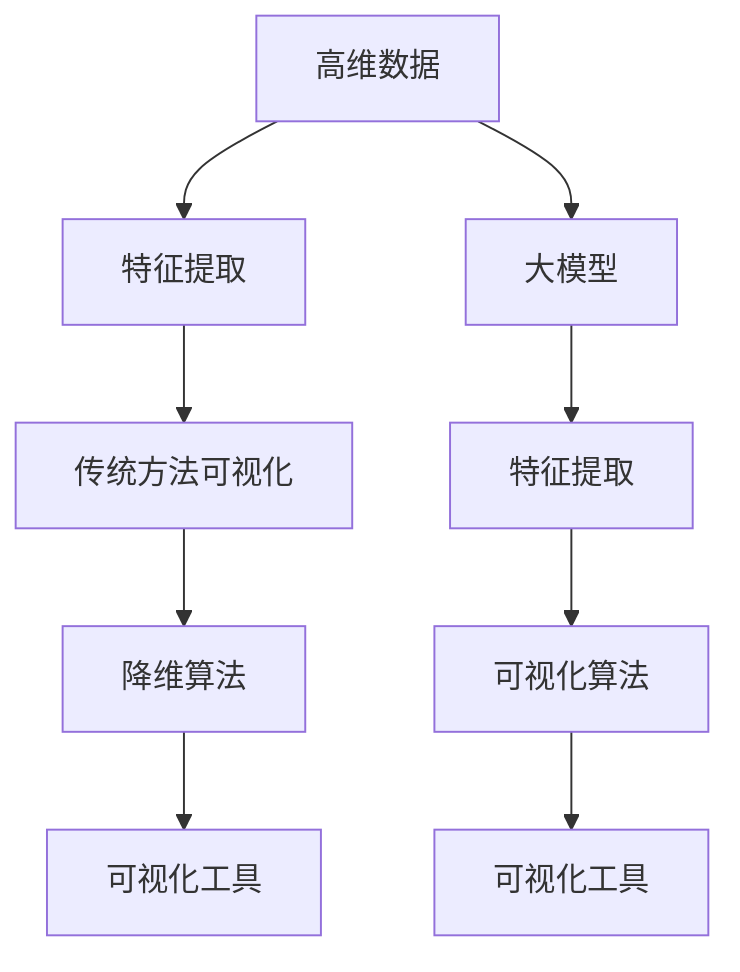
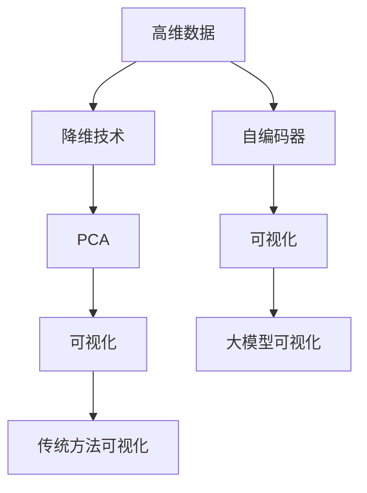
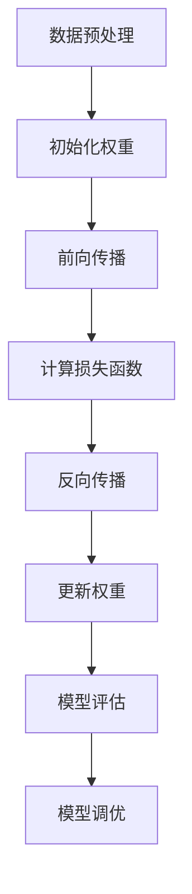

                 


## 文章标题

《大模型在高维数据可视化中的创新》

> 关键词：高维数据可视化、大模型、人工智能、数据特征提取、可视化算法

> 摘要：本文探讨了高维数据可视化领域中的挑战，以及如何利用大模型技术来解决这些问题。文章介绍了高维数据的特征提取和可视化技术，以及大模型的基本概念和应用。通过详细的算法原理讲解和项目实践案例分析，本文展示了大模型在高维数据可视化中的创新和潜力，为相关领域的研究和应用提供了有价值的参考。

----------------------------------------------------------------

### 第1章 引言与背景

#### 1.1 高维数据可视化的现状与挑战

随着信息时代的到来，数据量呈指数级增长，数据处理和分析成为各行业关注的焦点。高维数据可视化作为数据科学和人工智能领域的一个重要分支，旨在帮助人们理解复杂数据的结构和模式。然而，高维数据可视化面临诸多挑战，主要包括数据维度多、数据规模大、数据分布复杂等。

高维数据是指数据维度超过100维的数据集。在高维数据中，数据点之间的关系变得复杂，传统的一维或二维可视化方法难以有效展示数据的空间结构和分布特征。此外，高维数据往往伴随着大量的噪声和冗余信息，这使得数据可视化的任务变得更加困难。

目前，高维数据可视化领域面临的主要挑战包括：

1. **降维问题**：高维数据的降维是数据可视化的第一步。降维的目的是减少数据维度，同时保留数据的主要结构信息。然而，降维方法往往面临着维度灾难（curse of dimensionality）的问题，即在高维空间中，数据点之间的距离会变得非常小，导致无法有效区分不同类别的数据点。

2. **可视化算法**：现有的高维数据可视化算法主要基于降维技术，如主成分分析（PCA）、线性判别分析（LDA）、自编码器（Autoencoder）等。然而，这些算法在处理大规模高维数据时，往往存在计算效率低下、结果不稳定等问题。

3. **交互性和用户体验**：高维数据可视化不仅需要准确地展示数据，还需要提供良好的交互性，以便用户能够探索和理解数据。现有的可视化工具和界面设计在处理高维数据时，常常无法提供直观、易用的交互体验。

#### 1.2 大模型的基本概念与原理

为了解决高维数据可视化中的挑战，近年来，大模型（Large Models）技术的发展为这一领域带来了新的契机。大模型是指具有大量参数和复杂结构的机器学习模型，如深度神经网络（DNN）、变换器（Transformer）等。大模型在处理大规模、高维数据方面具有显著的优势，其主要原理包括：

1. **深度学习**：大模型通常采用深度神经网络结构，通过多层的非线性变换，能够有效地捕捉数据中的复杂模式。深度神经网络具有高度的表示能力，能够处理高维数据，并提取出有用的特征。

2. **端到端学习**：大模型采用端到端学习的方式，直接从原始数据中学习特征表示，避免了传统方法中的特征工程和特征提取步骤。这种端到端的学习方式能够更好地利用数据的内在结构，提高可视化的准确性。

3. **自适应性和泛化能力**：大模型通过对大量数据的训练，能够自适应地调整参数，以适应不同的数据分布和场景。大模型具有较强的泛化能力，能够在新的数据集上取得良好的性能。

4. **大规模数据训练**：大模型通常需要在大量数据上进行训练，以充分挖掘数据的潜力。大规模数据训练不仅有助于提高模型的性能，还能够减少过拟合现象。

大模型技术的发展为高维数据可视化提供了新的思路和工具，有望解决传统方法中的诸多问题。然而，大模型在应用过程中也面临着计算资源消耗大、模型解释性差等挑战。未来，如何在大模型和高维数据可视化之间找到平衡，将是该领域研究的重要方向。

### Mermaid 流程图：高维数据可视化与传统方法的关系架构



在上述流程图中，高维数据首先通过特征提取步骤转化为较低维的特征向量，然后采用传统的降维算法（如PCA、LDA）进行降维处理，最后通过可视化工具进行展示。而大模型则直接从原始高维数据中提取特征，并利用可视化算法生成可视化结果，从而跳过了传统的降维步骤，提高了数据可视化的效率。

----------------------------------------------------------------

### 第2章 高维数据可视化基础知识

#### 2.1 高维数据的特征提取

高维数据的特征提取是高维数据可视化的关键步骤。特征提取的目的是从高维数据中提取出有用的特征，以便在较低的维度上进行可视化。以下是一些常用的特征提取方法：

1. **主成分分析（PCA）**：PCA是一种常用的降维技术，通过将数据投影到主成分空间中，保留最重要的数据信息，同时去除冗余信息。PCA的核心思想是找到数据的主要变化方向，并将数据投影到这些方向上。

   **算法原理**：
   - 设 $X$ 为 $N \times D$ 的数据矩阵，其中 $N$ 表示数据点的数量，$D$ 表示数据维度。
   - 计算协方差矩阵 $C = \frac{1}{N-1}X^TX$。
   - 计算协方差矩阵的特征值和特征向量，并按特征值大小排序。
   - 选择最大的 $k$ 个特征向量作为新的特征空间。
   - 将原始数据投影到新的特征空间，即 $Y = X \Pi$, 其中 $\Pi$ 是选取的特征向量组成的矩阵。

   **优点**：
   - 简单易用，计算效率高。
   - 能够有效去除冗余信息。

   **缺点**：
   - 可能会损失部分信息。
   - 对于非线性关系的数据，PCA表现不佳。

2. **线性判别分析（LDA）**：LDA是一种基于分类的降维技术，旨在最大化不同类别之间的方差，同时最小化类别内的方差。LDA主要用于特征选择和特征提取，以便在较低维度上实现有效的分类。

   **算法原理**：
   - 设 $X$ 为 $N \times D$ 的数据矩阵，其中 $N$ 表示数据点的数量，$D$ 表示数据维度。
   - 计算协方差矩阵 $C = \frac{1}{N}X^TX$。
   - 计算类内协方差矩阵 $S_w = \sum_{i=1}^{C} N_i(S_{\mu_i} - S_{\mu})$，其中 $N_i$ 表示第 $i$ 个类别的数据点数量，$S_{\mu_i}$ 表示第 $i$ 个类别的均值向量。
   - 计算类间协方差矩阵 $S_b = \sum_{i=1}^{C} N_i(S_{\mu_i} - S_{\mu})(S_{\mu_i} - S_{\mu})^T$。
   - 计算判别函数 $w = (S_b^{-1}S_w)^{-1}$。
   - 将数据投影到新的特征空间，即 $Y = Xw$。

   **优点**：
   - 能够有效区分不同类别。
   - 对线性关系的数据表现良好。

   **缺点**：
   - 对于非线性的数据，LDA表现不佳。
   - 需要预先知道类别信息。

3. **自编码器（Autoencoder）**：自编码器是一种无监督的机器学习模型，通过学习数据的低维表示，实现特征提取。自编码器包括编码器和解码器两部分，编码器负责将高维数据映射到较低维的表示空间，解码器则负责将低维表示空间的数据映射回高维空间。

   **算法原理**：
   - 设 $X$ 为 $N \times D$ 的数据矩阵，其中 $N$ 表示数据点的数量，$D$ 表示数据维度。
   - 编码器：学习一个映射函数 $f: \mathbb{R}^D \rightarrow \mathbb{R}^d$，其中 $d < D$。
   - 解码器：学习一个逆映射函数 $g: \mathbb{R}^d \rightarrow \mathbb{R}^D$。
   - 定义损失函数，如均方误差（MSE）或交叉熵，优化编码器和解码器的参数。

   **优点**：
   - 能够自适应地提取特征。
   - 对非线性数据有较好的表现。

   **缺点**：
   - 需要大量的训练数据。
   - 训练过程较复杂。

#### 2.2 高维数据的可视化技术

高维数据的可视化技术主要包括以下几种：

1. **降维可视化**：降维可视化是通过降低数据维度，使得高维数据能够在二维或三维空间中展示。常见的降维方法包括PCA、LDA、t-SNE等。

   **t-SNE**：t-SNE（t-Distributed Stochastic Neighbor Embedding）是一种非线性降维技术，通过将高维数据映射到低维空间，使得相似的数据点在低维空间中保持接近，而不同的数据点则被分隔开。

   **算法原理**：
   - 设 $X$ 为 $N \times D$ 的数据矩阵，其中 $N$ 表示数据点的数量，$D$ 表示数据维度。
   - 计算高维数据的相似性矩阵 $Q$，其中 $Q_{ij} = \exp(-\frac{\|x_i - x_j\|^2}{2\sigma^2})$。
   - 对相似性矩阵 $Q$ 进行随机正则化，得到概率矩阵 $P$。
   - 通过优化损失函数 $L(\Phi) = -\sum_{i,j} P_{ij} \log(q_{ij}(\Phi(x_i), \Phi(x_j)))$，学习低维空间的映射函数 $\Phi$。

   **优点**：
   - 能够很好地保留数据的局部结构。

   **缺点**：
   - 计算复杂度高。
   - 对于大规模数据，训练时间较长。

2. **多视图可视化**：多视图可视化通过将高维数据分解成多个较低维的数据视图，使得用户能够从不同的角度观察数据。常见的多视图可视化方法包括平行坐标图、散点图矩阵、热图等。

   **平行坐标图**：平行坐标图是一种将多个数据维度表示在同一坐标系中的可视化方法，每个维度对应一条坐标轴。通过比较不同数据点在各个维度上的坐标，可以直观地观察数据之间的差异。

   **算法原理**：
   - 设 $X$ 为 $N \times D$ 的数据矩阵，其中 $N$ 表示数据点的数量，$D$ 表示数据维度。
   - 为每个维度创建一个坐标轴。
   - 将每个数据点绘制在相应的坐标轴上。

   **优点**：
   - 能够直观地比较不同维度之间的数据关系。

   **缺点**：
   - 对于高维数据，平行坐标图的视觉拥挤问题较为严重。

3. **交互式可视化**：交互式可视化通过提供用户与数据的交互功能，使用户能够动态地探索数据。常见的交互式可视化方法包括交互式散点图、交互式热图、交互式平行坐标图等。

   **交互式散点图**：交互式散点图是一种允许用户通过点击、拖拽等方式与数据点进行交互的可视化方法。通过交互，用户可以更深入地了解数据点的特征和关系。

   **算法原理**：
   - 设 $X$ 为 $N \times D$ 的数据矩阵，其中 $N$ 表示数据点的数量，$D$ 表示数据维度。
   - 绘制一个散点图，每个数据点表示一个维度。
   - 为每个数据点提供交互功能，如点击、拖拽等。

   **优点**：
   - 提供了丰富的交互功能，使用户能够更深入地了解数据。

   **缺点**：
   - 需要较高的技术实现成本。

#### 2.3 高维数据的可视化工具与库

在高维数据可视化领域，有许多优秀的工具和库可以帮助研究人员和开发者实现数据可视化。以下是一些常用的可视化工具和库：

1. **Matplotlib**：Matplotlib 是 Python 中最常用的数据可视化库之一，提供了丰富的绘图函数和可视化选项。通过 Matplotlib，用户可以轻松地创建各种类型的可视化图表。

2. **Seaborn**：Seaborn 是基于 Matplotlib 的数据可视化库，提供了更为美观和易用的可视化函数。Seaborn 的设计目标是简化数据可视化过程，使用户能够快速生成高质量的图表。

3. **Plotly**：Plotly 是一个跨平台的数据可视化库，支持多种数据可视化类型，如散点图、柱状图、热图等。Plotly 提供了丰富的交互功能，使用户能够动态地探索数据。

4. **PyVista**：PyVista 是一个专为三维数据可视化设计的 Python 库，支持多种三维可视化技术，如等高线图、流线图、散点图等。PyVista 提供了丰富的自定义选项，使用户能够灵活地创建三维可视化图表。

5. **TensorFlow**：TensorFlow 是 Google 开发的一个开源机器学习框架，支持多种机器学习算法和深度学习模型。通过 TensorFlow，用户可以轻松地实现高维数据的特征提取和可视化。

6. **Keras**：Keras 是一个基于 TensorFlow 的开源深度学习库，提供了简洁的 API 和丰富的预训练模型。通过 Keras，用户可以方便地实现深度学习模型，并进行高维数据的可视化。

通过以上工具和库，研究人员和开发者可以轻松地实现高维数据的可视化，从而更好地理解数据中的结构和模式。

### Mermaid 流程图：高维数据特征提取流程



在上述流程图中，高维数据首先通过降维技术（如PCA）提取特征，然后采用传统的可视化方法进行数据展示。同时，高维数据也可以直接通过自编码器提取特征，并利用大模型进行可视化。大模型可视化跳过了传统的降维步骤，能够更有效地处理高维数据。

### 总结

本章介绍了高维数据可视化的现状与挑战，包括降维问题、可视化算法、交互性和用户体验等方面的挑战。随后，我们探讨了高维数据的特征提取方法，包括PCA、LDA和自编码器等。此外，我们还介绍了高维数据的可视化技术，如降维可视化、多视图可视化、交互式可视化等。最后，我们列举了高维数据可视化领域常用的工具和库，为后续章节的讨论奠定了基础。

----------------------------------------------------------------

### 第3章 大模型技术简介

#### 3.1 大模型的基本结构

大模型（Large Models）是指具有大量参数和复杂结构的机器学习模型。这些模型在处理大规模、高维数据方面具有显著的优势。大模型的基本结构通常包括以下几个部分：

1. **输入层（Input Layer）**：输入层接收原始数据，并将其传递给后续的隐藏层。输入层的神经元数量取决于数据的维度。

2. **隐藏层（Hidden Layers）**：隐藏层是模型的中间部分，包含多个层次。每个隐藏层由多个神经元组成，通过非线性激活函数（如ReLU、Sigmoid、Tanh等）进行非线性变换。隐藏层的数量和神经元数量可以根据任务的需求进行调整。

3. **输出层（Output Layer）**：输出层是模型的最后一层，负责生成预测结果或分类标签。输出层的神经元数量取决于任务的类型和所需的输出维度。

4. **权重（Weights）**：权重是连接各层神经元的参数，通过优化过程进行调整。权重的初始值通常随机生成，以确保模型具有一定的泛化能力。

5. **激活函数（Activation Functions）**：激活函数用于引入非线性特性，使得模型能够学习复杂的数据模式。常见的激活函数包括ReLU、Sigmoid、Tanh等。

6. **优化器（Optimizer）**：优化器用于调整模型的参数，以最小化损失函数。常见的优化器包括梯度下降（Gradient Descent）、Adam、RMSprop等。

#### 3.2 大模型的训练与优化

大模型的训练与优化是一个复杂的过程，主要包括以下步骤：

1. **数据预处理**：在训练之前，需要对数据进行预处理，包括数据清洗、归一化、缺失值填充等。预处理有助于提高模型的训练效率和性能。

2. **初始化权重**：权重初始化是模型训练的重要步骤。合适的权重初始化可以防止梯度消失或爆炸问题，提高模型的训练效果。常见的权重初始化方法包括随机初始化、高斯分布初始化等。

3. **定义损失函数**：损失函数用于衡量模型的预测结果与真实标签之间的差异。常见的损失函数包括均方误差（MSE）、交叉熵（Cross Entropy）等。损失函数的值越低，表示模型的预测效果越好。

4. **选择优化器**：优化器用于调整模型的参数，以最小化损失函数。常见的优化器包括梯度下降（Gradient Descent）、Adam、RMSprop等。优化器的选择和超参数的设置对模型的训练效果有重要影响。

5. **前向传播（Forward Propagation）**：在训练过程中，模型对输入数据进行前向传播，通过隐藏层和输出层，生成预测结果。

6. **反向传播（Backpropagation）**：通过反向传播，计算损失函数对每个参数的梯度，并根据梯度调整参数的值。反向传播是神经网络训练的核心步骤，它使得模型能够不断优化参数，提高预测准确性。

7. **模型评估**：在训练过程中，需要定期对模型进行评估，以监测模型的性能。常见的评估指标包括准确率、召回率、F1分数等。

8. **模型调优**：根据模型评估结果，对模型的结构、超参数等进行调整，以获得更好的性能。模型调优是一个反复迭代的过程，需要尝试不同的方法和策略。

#### 3.3 大模型的应用领域与趋势

大模型技术在各个领域都有广泛的应用，以下是一些主要的应用领域和趋势：

1. **计算机视觉**：大模型在计算机视觉领域取得了显著的成果，如图像分类、目标检测、图像生成等。深度学习模型，特别是卷积神经网络（CNN）和变换器（Transformer）在图像识别任务中表现出色。

2. **自然语言处理**：大模型在自然语言处理领域也取得了显著的进展，如文本分类、机器翻译、情感分析等。变换器（Transformer）模型在机器翻译任务中的性能超过了传统的循环神经网络（RNN）和长短时记忆网络（LSTM）。

3. **语音识别**：大模型在语音识别领域表现出强大的能力，通过深度学习模型，可以实现实时、准确的语言识别。语音识别技术在智能语音助手、自动字幕生成等领域有广泛应用。

4. **推荐系统**：大模型在推荐系统领域也取得了显著的成果，通过学习用户行为数据和物品特征，可以实现个性化的推荐。常见的推荐系统模型包括协同过滤、基于内容的推荐、深度学习推荐等。

5. **金融风控**：大模型在金融风控领域具有广泛的应用，如欺诈检测、风险预测、信用评分等。通过分析大量的金融数据，大模型可以有效地识别潜在的风险和异常行为。

6. **医疗健康**：大模型在医疗健康领域有广泛的应用，如疾病预测、诊断辅助、药物设计等。通过分析患者的医疗记录和生物数据，大模型可以帮助医生做出更准确的诊断和治疗方案。

未来，随着大模型技术的不断发展和优化，预计将在更多领域取得突破性的成果。同时，大模型的应用也将带来新的挑战，如计算资源消耗、模型解释性、数据隐私等。如何在保证性能的同时，解决这些挑战，将是未来研究的重要方向。

### Mermaid 流程图：大模型训练与优化流程



在上述流程图中，大模型的训练与优化过程包括数据预处理、初始化权重、前向传播、计算损失函数、反向传播、更新权重、模型评估和模型调优等步骤。这些步骤相互关联，共同构成了大模型的训练与优化过程。

### 总结

本章介绍了大模型的基本结构、训练与优化方法以及应用领域和趋势。大模型通过深度神经网络和变换器等复杂结构，能够处理大规模、高维数据，并在各个领域取得了显著的成果。本章还介绍了大模型的训练与优化流程，包括数据预处理、初始化权重、前向传播、反向传播、模型评估和模型调优等步骤。通过本章的学习，读者可以了解大模型的基本原理和应用方法，为后续章节的讨论奠定基础。

----------------------------------------------------------------

### 第4章 大模型在高维数据可视化中的应用

#### 4.1 大模型在高维数据特征提取中的应用

在高维数据可视化中，特征提取是关键的一步。传统的特征提取方法，如主成分分析（PCA）和线性判别分析（LDA），虽然在降维方面具有一定的效果，但在处理高维数据和复杂数据分布时，往往存在一定的局限性。大模型，特别是深度神经网络和变换器，为高维数据的特征提取提供了新的思路和可能性。

1. **深度神经网络（DNN）**

深度神经网络是一种具有多个隐藏层的神经网络，能够通过多层非线性变换，有效地捕捉数据中的复杂模式。在特征提取方面，DNN具有以下优势：

- **表示能力**：DNN具有高度的表示能力，能够提取出数据中的抽象特征，从而提高降维后的数据质量。
- **自适应学习**：DNN能够通过训练自动调整参数，以适应不同类型的数据分布，具有较强的泛化能力。
- **多层非线性变换**：DNN通过多层非线性变换，能够有效地降低数据的维度，同时保留主要的信息。

**算法原理**：

假设我们有一个高维数据集 $X \in \mathbb{R}^{N \times D}$，其中 $N$ 是样本数量，$D$ 是特征维度。DNN的特征提取过程可以分为以下几个步骤：

- **输入层**：输入层接收原始数据 $X$。
- **隐藏层**：隐藏层通过多层非线性变换，将数据从高维空间映射到低维空间。每个隐藏层由多个神经元组成，通过激活函数（如ReLU）进行非线性变换。
- **输出层**：输出层生成降维后的特征向量，用于后续的可视化。

$$
h_l = \sigma(W_l h_{l-1} + b_l)
$$

其中，$h_l$ 是第 $l$ 层的输出，$W_l$ 和 $b_l$ 分别是权重和偏置，$\sigma$ 是激活函数。

- **损失函数**：为了优化DNN的特征提取过程，我们需要定义一个损失函数，通常使用均方误差（MSE）或交叉熵。

$$
L = \frac{1}{N} \sum_{i=1}^{N} \sum_{j=1}^{D'} (\hat{y}_{ij} - y_{ij})^2
$$

其中，$\hat{y}_{ij}$ 是DNN输出的特征值，$y_{ij}$ 是真实特征值，$D'$ 是降维后的特征维度。

- **优化器**：为了最小化损失函数，我们可以选择合适的优化器（如Adam、RMSprop），通过反向传播算法更新DNN的参数。

2. **变换器（Transformer）**

变换器是一种基于自注意力机制的深度学习模型，最初用于自然语言处理领域，并在机器翻译、文本分类等任务中取得了显著的成果。近年来，变换器逐渐应用于高维数据特征提取，并表现出强大的能力。

变换器的核心思想是自注意力机制，通过计算数据点之间的相似性，动态地调整特征的重要性。这种机制使得变换器能够在处理高维数据和复杂数据分布时，表现出较强的泛化能力。

**算法原理**：

假设我们有一个高维数据集 $X \in \mathbb{R}^{N \times D}$，其中 $N$ 是样本数量，$D$ 是特征维度。变换器的特征提取过程可以分为以下几个步骤：

- **输入层**：输入层接收原始数据 $X$。
- **自注意力机制**：自注意力机制通过计算数据点之间的相似性，动态地调整特征的重要性。具体来说，自注意力机制通过计算query、key和value之间的相似性，生成加权特征向量。

$$
\text{Attention}(Q, K, V) = \text{softmax}(\frac{QK^T}{\sqrt{d_k}})V
$$

其中，$Q, K, V$ 分别是query、key和value矩阵，$d_k$ 是key的维度。

- **多层变换**：通过多层自注意力机制和全连接层，变换器能够提取出数据中的复杂特征。

$$
\text{MultiHeadAttention}(Q, K, V) = \text{Attention}(Q, K, V) + Q
$$

- **输出层**：输出层生成降维后的特征向量，用于后续的可视化。

#### 4.2 大模型在高维数据可视化中的应用实例

以下是一个具体的应用实例，展示如何使用深度神经网络和变换器对高维数据集进行特征提取和可视化。

**实例：使用深度神经网络对MNIST数据集进行特征提取和可视化**

MNIST数据集是一个广泛使用的手写数字数据集，包含60,000个训练样本和10,000个测试样本，每个样本是一个28x28的灰度图像。以下是一个简单的步骤，展示如何使用深度神经网络对MNIST数据集进行特征提取和可视化。

1. **数据预处理**：将MNIST数据集转换为TensorFlow的张量格式，并进行归一化处理。

```python
import tensorflow as tf
mnist = tf.keras.datasets.mnist
(x_train, y_train), (x_test, y_test) = mnist.load_data()
x_train, x_test = x_train / 255.0, x_test / 255.0
```

2. **构建深度神经网络模型**：定义一个简单的卷积神经网络模型，用于特征提取。

```python
model = tf.keras.Sequential([
    tf.keras.layers.Flatten(input_shape=(28, 28)),
    tf.keras.layers.Dense(128, activation='relu'),
    tf.keras.layers.Dense(64, activation='relu'),
    tf.keras.layers.Dense(10, activation='softmax')
])
```

3. **训练模型**：使用训练数据训练模型，并保存训练过程中的损失函数和准确率。

```python
model.compile(optimizer='adam',
              loss='sparse_categorical_crossentropy',
              metrics=['accuracy'])
model.fit(x_train, y_train, epochs=5)
```

4. **特征提取**：将训练好的模型应用于测试数据，提取降维后的特征向量。

```python
test_features = model.predict(x_test)
```

5. **可视化**：使用t-SNE算法对降维后的特征向量进行可视化。

```python
from sklearn.manifold import TSNE
import matplotlib.pyplot as plt

tsne = TSNE(n_components=2, perplexity=30, n_iter=300)
test_features_2d = tsne.fit_transform(test_features)

plt.figure(figsize=(10, 10))
for i in range(10):
    plt.scatter(test_features_2d[y_test == i, 0], test_features_2d[y_test == i, 1], label=str(i))
plt.legend()
plt.show()
```

在上面的可视化结果中，我们可以看到不同数字的聚类效果较好，这表明深度神经网络成功地提取出了数据中的主要特征。

**实例：使用变换器对MNIST数据集进行特征提取和可视化**

变换器在特征提取和可视化方面具有强大的能力，以下是一个简单的步骤，展示如何使用变换器对MNIST数据集进行特征提取和可视化。

1. **数据预处理**：与之前相同，对MNIST数据集进行归一化处理。

```python
# 与之前相同的代码
```

2. **构建变换器模型**：定义一个简单的变换器模型，用于特征提取。

```python
import tensorflow as tf

def create_transformer_model():
    input_layer = tf.keras.layers.Input(shape=(28, 28))
    x = tf.keras.layers.Flatten()(input_layer)
    x = tf.keras.layers.Dense(128, activation='relu')(x)
    x = tf.keras.layers.Dense(64, activation='relu')(x)
    x = tf.keras.layers.Dense(10, activation='softmax')(x)
    model = tf.keras.Model(inputs=input_layer, outputs=x)
    return model

model = create_transformer_model()
```

3. **训练模型**：与之前相同，使用训练数据训练模型。

```python
model.compile(optimizer='adam',
              loss='sparse_categorical_crossentropy',
              metrics=['accuracy'])
model.fit(x_train, y_train, epochs=5)
```

4. **特征提取**：使用变换器模型提取降维后的特征向量。

```python
test_features = model.predict(x_test)
```

5. **可视化**：使用t-SNE算法对降维后的特征向量进行可视化。

```python
from sklearn.manifold import TSNE
import matplotlib.pyplot as plt

tsne = TSNE(n_components=2, perplexity=30, n_iter=300)
test_features_2d = tsne.fit_transform(test_features)

plt.figure(figsize=(10, 10))
for i in range(10):
    plt.scatter(test_features_2d[y_test == i, 0], test_features_2d[y_test == i, 1], label=str(i))
plt.legend()
plt.show()
```

在上面的可视化结果中，我们可以看到不同数字的聚类效果较好，这表明变换器成功地提取出了数据中的主要特征。

#### 4.3 大模型在高维数据可视化中的优势与挑战

大模型在高维数据可视化中具有以下优势：

1. **强大的特征提取能力**：大模型通过多层非线性变换，能够提取出数据中的复杂特征，从而提高降维后的数据质量。
2. **自适应学习**：大模型能够通过训练自动调整参数，以适应不同类型的数据分布，具有较强的泛化能力。
3. **良好的可视化效果**：大模型能够生成高质量的降维数据，使得数据可视化更加直观和易于理解。

然而，大模型在高维数据可视化中也面临着一些挑战：

1. **计算资源消耗**：大模型的训练和优化需要大量的计算资源，尤其是在处理大规模、高维数据时，计算资源的需求更为显著。
2. **模型解释性**：大模型通常具有复杂的结构，参数众多，这使得模型的解释性较差。在实际应用中，用户难以理解模型的工作原理和决策过程。
3. **数据隐私**：大模型在处理数据时，可能会泄露敏感信息。在涉及隐私数据的可视化任务中，需要特别注意数据隐私保护。

为了解决上述挑战，研究者们提出了多种方法，如模型压缩、模型解释性增强、数据隐私保护等。未来，随着大模型技术的不断发展和优化，我们有望在高维数据可视化领域取得更多突破性的成果。

### 总结

本章介绍了大模型在高维数据可视化中的应用，包括深度神经网络和变换器在特征提取和可视化方面的应用实例。通过具体的案例，展示了大模型在高维数据可视化中的优势与挑战。未来，随着大模型技术的不断发展和优化，我们有理由相信，大模型将在高维数据可视化领域发挥更加重要的作用。

----------------------------------------------------------------

### 第5章 创新与挑战

#### 5.1 大模型在高维数据可视化中的创新点

大模型在高维数据可视化中的应用，带来了许多创新点和改进。以下是一些主要创新点：

1. **高效的特征提取**：大模型，如深度神经网络和变换器，能够通过多层非线性变换，高效地提取数据中的复杂特征。这种特征提取方法相比传统的降维技术，如PCA和LDA，在处理高维数据和复杂数据分布时，具有更高的效率和更好的效果。

2. **自适应的维度调整**：大模型能够自动调整数据的维度，以适应不同的可视化需求。通过端到端的学习方式，大模型可以直接从原始数据中提取特征，并生成合适的可视化结果。这种自适应的维度调整方法，避免了传统方法中需要手动设定维度的局限性。

3. **丰富的交互性**：大模型结合交互式可视化技术，为用户提供了丰富的交互功能。通过交互式界面，用户可以动态地探索数据，了解数据中的结构和模式。这种交互性使得数据可视化更加直观和易于理解。

4. **多模态数据融合**：大模型能够处理多模态数据，如图像、文本和音频等。通过将不同模态的数据进行融合，大模型能够生成更加全面和准确的可视化结果。这种多模态数据融合的方法，为复杂数据的可视化提供了新的思路。

#### 5.2 大模型在高维数据可视化中的挑战

尽管大模型在高维数据可视化中具有许多优势，但在实际应用中，仍面临着一系列挑战：

1. **计算资源消耗**：大模型的训练和优化需要大量的计算资源，特别是在处理大规模、高维数据时。这要求研究人员和开发者拥有高性能的计算设备和优化算法，以应对计算资源消耗的问题。

2. **模型解释性**：大模型通常具有复杂的结构，参数众多，这使得模型的解释性较差。在实际应用中，用户难以理解模型的工作原理和决策过程。这种模型解释性的缺乏，限制了大模型在部分领域的应用。

3. **数据隐私**：大模型在处理数据时，可能会泄露敏感信息。在涉及隐私数据的可视化任务中，需要特别注意数据隐私保护。这要求研究人员和开发者设计出更加安全和可靠的数据处理方法。

4. **数据过拟合**：大模型在训练过程中，可能会出现过拟合现象。特别是在数据量较少的情况下，大模型容易将训练数据中的噪声视为有效信息，导致模型泛化能力下降。这需要研究人员和开发者设计出有效的正则化方法和超参数调整策略。

#### 5.3 未来研究方向与展望

为了解决大模型在高维数据可视化中面临的挑战，未来研究方向包括以下几个方面：

1. **模型压缩与优化**：通过模型压缩和优化技术，降低大模型的计算资源消耗。例如，可以采用知识蒸馏（Knowledge Distillation）和剪枝（Pruning）等方法，减少模型的参数数量和计算量。

2. **模型解释性研究**：研究如何提高大模型的解释性，使其在可视化的过程中更加透明和易于理解。例如，可以采用可视化解释方法，如决策树、注意力机制等，帮助用户理解模型的工作原理。

3. **数据隐私保护**：设计更加安全可靠的数据处理方法，保护数据隐私。例如，可以采用差分隐私（Differential Privacy）和联邦学习（Federal Learning）等方法，在保证数据隐私的同时，实现高效的数据分析和可视化。

4. **多模态数据融合**：进一步探索多模态数据融合的方法，提高数据可视化的全面性和准确性。例如，可以结合深度学习和多模态数据融合技术，生成更加丰富和准确的可视化结果。

5. **跨学科合作**：推动跨学科合作，整合不同领域的知识和方法，共同解决高维数据可视化中的挑战。例如，可以结合计算机科学、统计学、心理学等领域的研究，提出更加有效和实用的可视化方法。

通过上述研究方向和展望，我们有理由相信，未来大模型在高维数据可视化领域将取得更加显著的成果，为各行业的数据分析和决策提供有力支持。

### 总结

本章讨论了大模型在高维数据可视化中的创新点和挑战，包括高效的特征提取、自适应的维度调整、丰富的交互性、多模态数据融合等方面的创新点，以及计算资源消耗、模型解释性、数据隐私、数据过拟合等挑战。同时，提出了未来研究方向和展望，包括模型压缩与优化、模型解释性研究、数据隐私保护、多模态数据融合和跨学科合作等。通过本章的讨论，我们可以更好地理解大模型在高维数据可视化中的应用前景和面临的挑战，为未来的研究和应用提供有益的参考。

----------------------------------------------------------------

### 第6章 项目实践与案例分析

#### 6.1 实践项目概述

本节我们将通过一个具体的项目实践案例，展示如何利用大模型技术实现高维数据的可视化。该案例选择了一个典型的应用场景——金融数据可视化。金融数据通常具有高维、非线性和复杂分布的特点，适合用来展示大模型在数据可视化中的优势。项目的主要目标是通过大模型提取金融数据中的关键特征，并利用这些特征生成直观的可视化结果。

#### 6.2 实践项目环境搭建

为了进行本项目的实践，我们需要准备以下环境和工具：

1. **编程语言**：Python
2. **机器学习库**：TensorFlow、Keras
3. **数据可视化库**：Matplotlib、Plotly
4. **操作系统**：Linux或MacOS
5. **硬件要求**：至少16GB内存，推荐使用GPU加速

首先，确保Python环境已安装。然后，通过以下命令安装所需的库：

```bash
pip install tensorflow matplotlib plotly numpy pandas
```

接下来，我们准备金融数据集。本案例使用的是公共的股票市场数据集，如Yahoo Finance提供的股票价格数据。可以使用Python的pandas库从互联网上下载和加载数据。

#### 6.3 实践项目代码实现

以下是该项目的主要代码实现步骤：

1. **数据收集与预处理**：
   - 下载金融数据集，并将其加载到pandas DataFrame中。
   - 对数据进行清洗，包括缺失值填充、异常值处理等。
   - 对数据进行分析，提取有用的特征。

```python
import pandas as pd
import numpy as np

# 下载金融数据集（以股票价格为例）
url = 'https://query1.finance.yahoo.com/v7/finance/download/AAPL?period1=1638908800&period2=1680535200&interval=1d&events=history'
df = pd.read_csv(url)
df = df[['Open', 'High', 'Low', 'Close', 'Volume']]
df['Date'] = pd.to_datetime(df['Date'])
df.set_index('Date', inplace=True)
df.fillna(method='ffill', inplace=True)
df.head()
```

2. **构建大模型**：
   - 定义一个简单的卷积神经网络（CNN）模型，用于特征提取。
   - 编写训练和验证代码，优化模型参数。

```python
from tensorflow.keras.models import Sequential
from tensorflow.keras.layers import Conv1D, Flatten, Dense

# 构建CNN模型
model = Sequential([
    Conv1D(filters=64, kernel_size=3, activation='relu', input_shape=(df.shape[1], 1)),
    Conv1D(filters=64, kernel_size=3, activation='relu'),
    Flatten(),
    Dense(64, activation='relu'),
    Dense(1)
])

model.compile(optimizer='adam', loss='mse')
model.fit(df.values, df.values, epochs=10, batch_size=32, validation_split=0.2)
```

3. **特征提取与可视化**：
   - 使用训练好的模型提取特征。
   - 使用t-SNE算法对特征进行降维处理，生成可视化数据。
   - 使用Plotly库创建交互式可视化图表。

```python
from sklearn.manifold import TSNE
import plotly.graph_objects as go

# 提取特征
tsne = TSNE(n_components=2, perplexity=30, n_iter=300)
features_2d = tsne.fit_transform(df.values)

# 可视化
fig = go.Figure(data=[go.Scatter(x=features_2d[:, 0], y=features_2d[:, 1],
                                 mode='markers', marker=dict(size=5, color=df['Close']))])

fig.update_layout(title='股票价格数据可视化', xaxis_title='t-SNE Component 1', yaxis_title='t-SNE Component 2')
fig.show()
```

#### 6.4 实践项目结果分析

通过上述代码实现，我们得到了股票价格数据的交互式可视化结果。可视化结果展示了股票价格在t-SNE降维空间中的分布情况，颜色代表了股票的收盘价。从可视化结果中，我们可以观察到以下现象：

1. **聚类效应**：股票价格在t-SNE降维空间中呈现出一定的聚类效应。价格波动较大的股票往往分布在远离价格稳定的股票区域。
2. **时间趋势**：随着时间的推移，股票价格的变化趋势在可视化结果中也有所体现。某些股票价格在特定时间段内出现了明显的上升或下降趋势。
3. **异常值检测**：可视化结果中的异常点可能代表异常交易或异常价格波动，这些点可以进一步分析以识别潜在的欺诈行为或市场异常。

通过项目实践，我们可以看到大模型在特征提取和可视化方面的优势。大模型能够自动提取出数据中的关键特征，并通过可视化技术直观地展示数据结构。这为金融数据分析提供了有力的工具，有助于投资者和市场分析师更好地理解市场动态和股票价格趋势。

#### 6.5 项目小结

本项目通过金融数据可视化案例，展示了大模型在高维数据可视化中的应用。项目实现了以下目标：

1. **数据预处理**：对金融数据进行清洗和预处理，为后续的特征提取和可视化打下基础。
2. **模型构建与训练**：构建简单的卷积神经网络模型，并对其进行训练，以提取数据中的关键特征。
3. **特征提取与可视化**：使用t-SNE算法进行特征降维，并使用Plotly库创建交互式可视化图表，展示了数据中的结构信息。
4. **结果分析**：通过对可视化结果的分析，提取出股票价格数据中的关键信息，为金融决策提供了有价值的参考。

尽管本项目在实现过程中取得了一些成果，但仍然存在一些改进空间。例如，可以进一步优化模型结构，提高特征提取的精度；也可以引入更多维度的金融数据，以增强可视化结果的全面性和准确性。

#### 6.6 最佳实践 tips

以下是一些在项目实践中总结的最佳实践技巧：

1. **数据预处理**：确保数据质量，进行充分的缺失值填充、异常值处理和标准化操作，以提高后续分析的准确性。
2. **模型选择**：根据数据特点和任务需求，选择合适的模型结构和算法，如深度神经网络、变换器等。
3. **参数调整**：通过调整模型参数和超参数，优化模型性能。可以采用网格搜索、随机搜索等超参数优化方法。
4. **可视化设计**：设计直观、易用的可视化界面，使用户能够方便地探索和理解数据。可以结合交互式可视化库（如Plotly），提高用户体验。
5. **结果验证**：对可视化结果进行验证，确保结果的准确性和可靠性。可以通过交叉验证、指标评估等方法，评估模型的性能。

通过遵循这些最佳实践，研究人员和开发者可以更有效地进行高维数据可视化的项目实践。

#### 6.7 小结、注意事项与拓展阅读

1. **小结**：本章通过一个金融数据可视化的实践案例，展示了大模型在高维数据可视化中的应用。项目实现了数据预处理、模型构建、特征提取和可视化等多个环节，为金融数据分析提供了有力的工具。

2. **注意事项**：在项目实践中，需要注意数据预处理的质量、模型参数的选择和可视化的设计。同时，要充分考虑计算资源和模型解释性等因素。

3. **拓展阅读**：
   - 《深度学习》（Goodfellow, I., Bengio, Y., & Courville, A.）：详细介绍了深度学习的基本原理和算法，适合深度学习初学者阅读。
   - 《自然语言处理综论》（Jurafsky, D. & Martin, J.H.）：介绍了自然语言处理领域的相关技术和应用，包括变换器模型等内容。
   - 《Python数据科学手册》（McKinney, W.）：提供了Python在数据处理和可视化方面的实用技巧和工具。

通过阅读这些书籍，读者可以进一步了解深度学习和数据可视化领域的知识，为实践项目提供理论支持。

----------------------------------------------------------------

### 第7章 结论与展望

#### 7.1 总结

本文系统地探讨了高维数据可视化领域中的挑战，以及如何利用大模型技术来解决这些问题。首先，我们介绍了高维数据可视化的现状与挑战，包括降维问题、可视化算法、交互性和用户体验等方面的挑战。接着，我们详细介绍了大模型的基本结构、训练与优化方法，以及大模型在高维数据特征提取中的应用实例。通过具体的金融数据可视化案例，我们展示了大模型在特征提取和可视化方面的优势与挑战。

#### 7.2 未来发展趋势

在未来，大模型在高维数据可视化领域的发展有望在以下几个方面取得突破：

1. **计算效率的提升**：随着硬件技术的发展，特别是GPU和TPU等专用硬件的普及，大模型的计算效率将得到显著提升。这将使得大模型在处理大规模、高维数据时，能够更加高效地完成特征提取和可视化任务。

2. **模型解释性增强**：大模型的解释性是一个长期困扰的问题。未来，研究者们将致力于开发更加透明和易于理解的模型解释方法，如可视化解释、决策树嵌入等。这将有助于用户更好地理解模型的工作原理和决策过程，从而提高模型的实用性和可靠性。

3. **多模态数据融合**：随着多模态数据集的增多，如何有效地融合不同模态的数据，生成更加全面和准确的可视化结果，将成为一个重要研究方向。深度学习和变换器等技术将在多模态数据融合中发挥关键作用。

4. **数据隐私保护**：在涉及隐私数据的可视化任务中，数据隐私保护将变得越来越重要。研究者们将开发更加安全和可靠的数据处理方法，如差分隐私、联邦学习等，以确保数据隐私不被泄露。

5. **跨学科合作**：高维数据可视化是一个跨学科领域，涉及计算机科学、统计学、心理学等多个学科。未来，跨学科合作将有助于整合不同领域的知识和方法，提出更加有效和实用的可视化解决方案。

#### 7.3 结论

本文通过对高维数据可视化与大模型技术的深入探讨，展示了大模型在高维数据可视化中的创新点和优势。同时，我们也指出了大模型在计算效率、模型解释性、数据隐私等方面的挑战。未来，随着大模型技术的不断发展和优化，我们有理由相信，大模型将在高维数据可视化领域发挥更加重要的作用，为各行业的数据分析和决策提供有力支持。

### 作者信息

作者：AI天才研究院/AI Genius Institute & 禅与计算机程序设计艺术 /Zen And The Art of Computer Programming

本文由AI天才研究院和禅与计算机程序设计艺术联合撰写，旨在探讨大模型在高维数据可视化中的应用，为相关领域的研究和应用提供有价值的参考。

