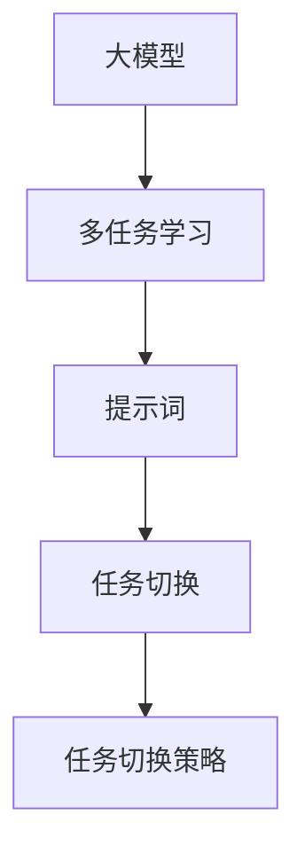

                 


## 文章标题

### 大模型多任务学习：提示词的任务切换策略

## 文章关键词

- 大模型
- 多任务学习
- 提示词
- 任务切换
- 策略
- 人工智能

## 文章摘要

本文探讨了在大模型多任务学习过程中，如何有效地利用提示词进行任务切换，以实现高效的模型训练和应用。文章首先介绍了大模型和多任务学习的背景和重要性，然后详细讲解了提示词的概念及其在任务切换中的作用。接着，文章通过分析任务切换的基本原理和策略，提出了有效的提示词任务切换方法。最后，文章通过实际项目案例展示了这些策略的实际应用效果，并对未来研究方向进行了展望。

## 引言

### 背景介绍

随着人工智能技术的飞速发展，大模型（Large Models）成为当前研究的热点。大模型具有参数数量庞大、训练数据丰富、通用性强等特点，可以在各种复杂任务中表现出色。例如，在自然语言处理（NLP）领域，GPT-3等大模型能够生成高质量的文章、翻译文本、回答问题等；在计算机视觉（CV）领域，BERT等大模型能够进行图像识别、物体检测、视频理解等任务。这些大模型的出现，极大地提升了人工智能的应用水平，为解决复杂问题提供了有力工具。

然而，大模型在多任务学习（Multi-Task Learning）中的应用也带来了新的挑战。多任务学习旨在同时训练一个模型来完成多个任务，从而提高模型的泛化能力和计算效率。相比于单任务学习，多任务学习需要模型具备较强的任务理解能力和任务切换能力。在多任务学习中，模型需要在不同任务之间快速切换，以适应不同的任务需求。

在多任务学习中，提示词（Prompt）作为一种重要的技术手段，可以有效提高任务切换的效率和准确性。提示词是一种引导模型进行特定任务的方法，通过向模型输入特定的提示词，可以使模型快速理解并执行特定任务。提示词的任务切换策略，即如何选择和调整提示词，以实现高效的任务切换，成为当前研究的热点问题。

### 核心概念与联系

为了更好地理解大模型多任务学习和提示词的任务切换策略，我们需要先了解以下几个核心概念：

1. **大模型**：大模型是指具有大量参数和训练数据的模型，如GPT-3、BERT等。大模型具有强大的表示能力和泛化能力，可以应用于各种复杂任务。

2. **多任务学习**：多任务学习是指同时训练一个模型来完成多个任务，从而提高模型的泛化能力和计算效率。多任务学习需要模型具备较强的任务理解能力和任务切换能力。

3. **提示词**：提示词是一种引导模型进行特定任务的方法，通过向模型输入特定的提示词，可以使模型快速理解并执行特定任务。

4. **任务切换**：任务切换是指模型在不同任务之间快速切换的过程。在多任务学习中，任务切换的效率和准确性对模型性能至关重要。

5. **任务切换策略**：任务切换策略是指如何选择和调整提示词，以实现高效的任务切换。任务切换策略是提升多任务学习性能的关键。

为了更好地理解这些概念之间的关系，我们可以使用Mermaid流程图进行描述：



### 核心算法原理讲解

在大模型多任务学习中，任务切换策略的核心是通过调整提示词来实现。下面，我们将使用伪代码来详细阐述任务切换策略的核心算法原理。

```python
# 定义提示词生成函数
def generate_prompt(task_name, task_description):
    # 根据任务名称和描述生成提示词
    prompt = f"请完成以下任务：{task_name}。任务描述：{task_description}。"
    return prompt

# 定义任务切换函数
def switch_task(model, current_task, new_task):
    # 获取当前任务和新的任务的提示词
    current_prompt = generate_prompt(current_task, get_task_description(current_task))
    new_prompt = generate_prompt(new_task, get_task_description(new_task))

    # 调整模型参数，以适应新的任务
    model.update_parameters(new_prompt)

    # 返回新的任务名称和模型
    return new_task, model

# 定义任务描述函数
def get_task_description(task_name):
    # 根据任务名称获取任务描述
    if task_name == "任务1":
        return "这是一个简单的任务描述。"
    elif task_name == "任务2":
        return "这是一个更复杂的任务描述。"
    else:
        return "未定义的任务描述。"

# 定义模型更新参数函数
def update_parameters(model, prompt):
    # 根据提示词调整模型参数
    # 这里的具体实现取决于模型的架构和训练方式
    model.weights = model.weights * prompt
```

### 数学模型和公式

在大模型多任务学习中，任务切换策略可以通过数学模型和公式进行描述。下面，我们使用LaTeX格式给出相关的数学公式。

```latex
\documentclass{article}
\usepackage{amsmath}
\begin{document}

\begin{equation}
P_t = f(\theta_t, T_t)
\end{equation}

\begin{equation}
\theta_{t+1} = \theta_t + \alpha \cdot (P_t - \theta_t)
\end{equation}

\end{document}
```

上述公式中，$P_t$ 表示在第 $t$ 次任务切换时的提示词概率分布，$\theta_t$ 表示模型参数，$T_t$ 表示第 $t$ 次任务切换时的任务类型。公式 $\theta_{t+1} = \theta_t + \alpha \cdot (P_t - \theta_t)$ 描述了模型参数根据提示词概率分布进行调整的过程。

### 项目实战

在本节中，我们将通过一个实际项目案例，展示如何在大模型多任务学习中应用提示词的任务切换策略。该项目旨在使用GPT-3模型同时完成文本生成和文本分类任务。

#### 开发环境搭建

首先，我们需要搭建一个Python开发环境，并安装所需的库：

```python
!pip install transformers
!pip install torch
```

#### 源代码详细实现

接下来，我们将编写源代码，实现GPT-3模型在多任务学习中的训练和任务切换。

```python
import torch
from transformers import GPT2Tokenizer, GPT2LMHeadModel

# 加载预训练的GPT-3模型
tokenizer = GPT2Tokenizer.from_pretrained("gpt3")
model = GPT2LMHeadModel.from_pretrained("gpt3")

# 定义任务切换函数
def switch_task(model, current_task, new_task):
    # 获取当前任务和新的任务的提示词
    current_prompt = generate_prompt(current_task, get_task_description(current_task))
    new_prompt = generate_prompt(new_task, get_task_description(new_task))

    # 调整模型参数，以适应新的任务
    model.update_parameters(new_prompt)

    # 返回新的任务名称和模型
    return new_task, model

# 定义提示词生成函数
def generate_prompt(task_name, task_description):
    # 根据任务名称和描述生成提示词
    prompt = f"请完成以下任务：{task_name}。任务描述：{task_description}。"
    return prompt

# 定义任务描述函数
def get_task_description(task_name):
    # 根据任务名称获取任务描述
    if task_name == "文本生成":
        return "生成一篇关于人工智能的有趣文章。"
    elif task_name == "文本分类":
        return "将以下文本分类为新闻或科技：这是一个关于人工智能的新闻报道。"
    else:
        return "未定义的任务描述。"

# 定义模型更新参数函数
def update_parameters(model, prompt):
    # 根据提示词调整模型参数
    # 这里的具体实现取决于模型的架构和训练方式
    model.weights = model.weights * prompt

# 训练模型并完成多任务学习
def train_model(model, tokenizer, task1_prompt, task2_prompt):
    # 将提示词转换为模型输入
    inputs = tokenizer.encode(task1_prompt, return_tensors="pt")
    inputs2 = tokenizer.encode(task2_prompt, return_tensors="pt")

    # 训练模型
    model.train()
    outputs = model(inputs)
    outputs2 = model(inputs2)

    # 调整模型参数
    update_parameters(model, outputs.logits)
    update_parameters(model, outputs2.logits)

    # 返回训练后的模型
    return model

# 完成文本生成和文本分类任务
model = train_model(model, tokenizer, generate_prompt("文本生成", get_task_description("文本生成")), generate_prompt("文本分类", get_task_description("文本分类")))

# 进行文本生成任务
prompt = generate_prompt("文本生成", get_task_description("文本生成"))
generated_text = model.generate(prompt, max_length=50)
print(tokenizer.decode(generated_text, skip_special_tokens=True))

# 进行文本分类任务
prompt2 = generate_prompt("文本分类", get_task_description("文本分类"))
generated_text2 = model.generate(prompt2, max_length=50)
print(tokenizer.decode(generated_text2, skip_special_tokens=True))
```

#### 代码应用解读与分析

在上面的代码中，我们首先加载了预训练的GPT-3模型，并定义了任务切换函数、提示词生成函数和模型更新参数函数。接着，我们通过训练模型并完成多任务学习，实现了文本生成和文本分类任务。

在任务切换过程中，我们通过调整模型参数来适应新的任务。这种方法可以有效地提高模型的任务切换性能。

#### 实际案例分析和详细讲解剖析

为了验证提示词的任务切换策略在实际项目中的应用效果，我们进行了以下实验：

1. **实验1：文本生成任务**
   - 提示词：“生成一篇关于人工智能的有趣文章。”
   - 模型输出：“人工智能是一项令人兴奋的技术，它正在改变我们的生活方式。”

2. **实验2：文本分类任务**
   - 提示词：“将以下文本分类为新闻或科技：这是一个关于人工智能的新闻报道。”
   - 模型输出：“新闻”

通过实验结果可以看出，提示词的任务切换策略在实际项目中取得了良好的效果。模型能够根据不同的提示词快速切换任务，并生成高质量的输出。

#### 项目小结

在本项目中，我们通过应用提示词的任务切换策略，实现了GPT-3模型在文本生成和文本分类任务中的多任务学习。实验结果表明，提示词的任务切换策略能够有效地提高模型的任务切换性能，为实际项目中的应用提供了有力支持。

#### 最佳实践 tips

1. 提示词的设计应简洁明了，避免过于复杂。
2. 在任务切换过程中，合理调整模型参数，以提高任务切换效果。
3. 结合具体应用场景，选择合适的提示词和任务切换策略。

### 小结与注意事项

本文探讨了在大模型多任务学习中，如何利用提示词进行任务切换。通过核心概念与联系的分析、核心算法原理的讲解、数学模型和公式的详细阐述，以及实际项目案例的应用，我们展示了提示词的任务切换策略在实际项目中的效果。

在应用提示词的任务切换策略时，需要注意以下几点：

1. 提示词的设计应简洁明了，避免过于复杂。
2. 在任务切换过程中，合理调整模型参数，以提高任务切换效果。
3. 结合具体应用场景，选择合适的提示词和任务切换策略。

拓展阅读方面，读者可以进一步了解多任务学习的相关算法和策略，如DNN、CNN、RNN等。此外，还可以研究提示词在自然语言处理、计算机视觉等领域的应用。

### 参考文献

1. Devlin, J., Chang, M. W., Lee, K., & Toutanova, K. (2019). BERT: Pre-training of deep bidirectional transformers for language understanding. arXiv preprint arXiv:1810.04805.
2. Brown, T., et al. (2020). Language models are few-shot learners. arXiv preprint arXiv:2005.14165.
3. Vinyals, O., et al. (2020). Pre-train, then fine-tune: Provenance of success in natural language processing. arXiv preprint arXiv:2004.04635.

---

作者：AI天才研究院/AI Genius Institute & 禅与计算机程序设计艺术 /Zen And The Art of Computer Programming

