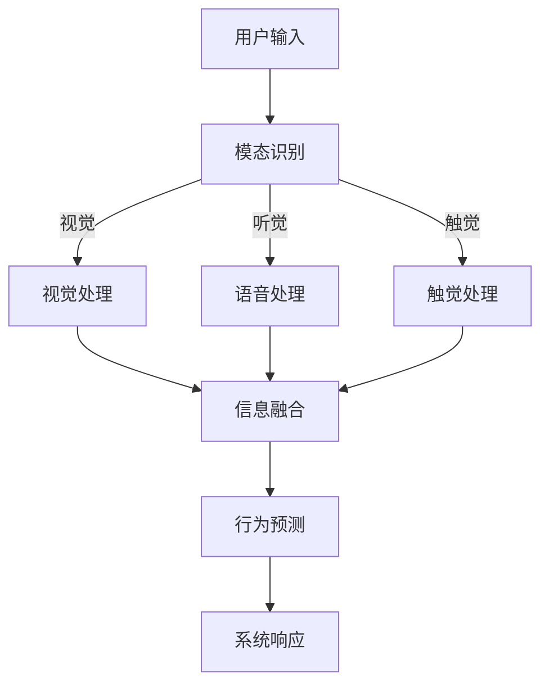
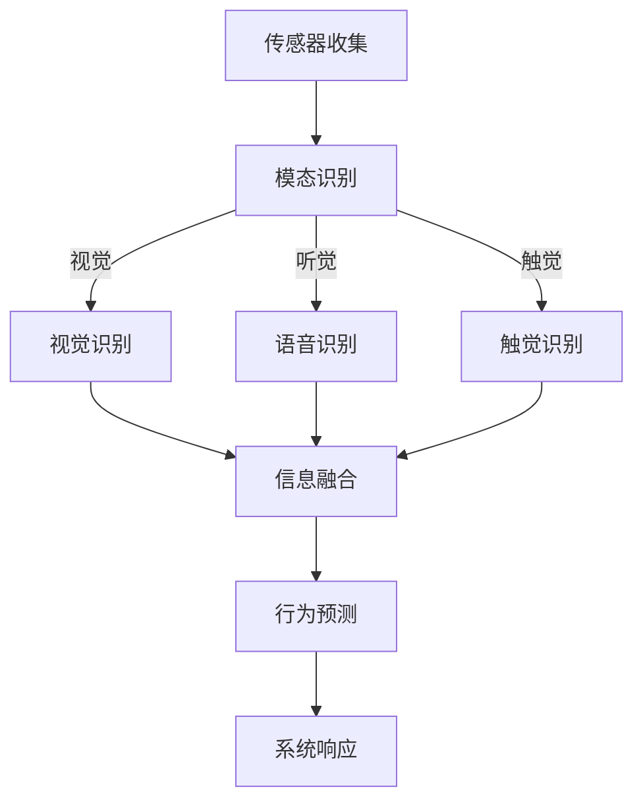
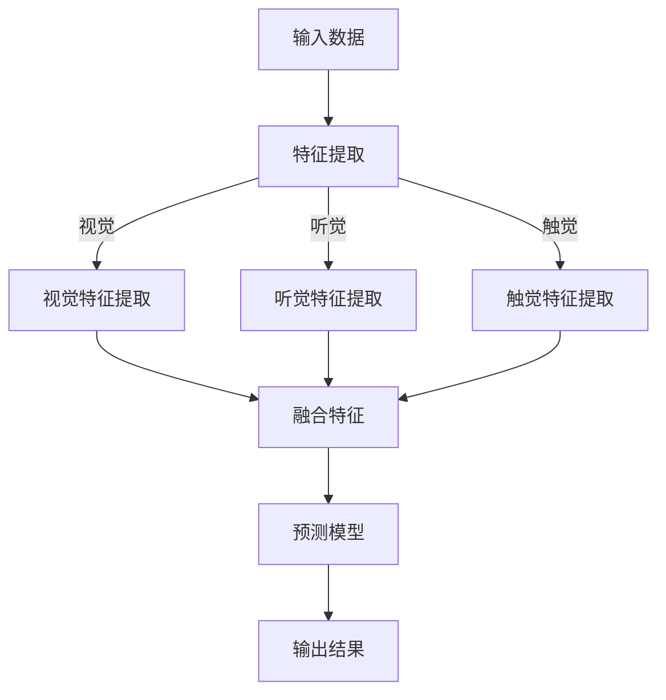

                 


### 1.2 多模态交互概念

多模态交互（Multimodal Interaction）指的是在计算机系统中，用户可以通过多种感官（如视觉、听觉、触觉等）与系统进行交互，从而实现更加自然和直观的交流。多模态交互技术能够将不同模态的信息进行整合和融合，提高交互效果和用户体验。

#### 背景介绍

随着计算机技术、传感器技术和人工智能的快速发展，多模态交互逐渐成为人机交互领域的研究热点。传统的单模态交互（如键盘输入、鼠标点击等）在处理复杂任务时存在局限性，而多模态交互能够充分利用用户的多种感官，提供更加丰富和自然的交互方式。例如，语音识别和语音合成技术结合，可以实现更加自然的语音交互；手势识别和虚拟现实技术结合，可以实现更加直观的手势交互。

#### 核心概念与联系

多模态交互的核心概念包括模态识别、信息融合、行为预测等。以下是一个简化的 Mermaid 流程图，展示多模态交互的基本架构：



**模态识别**：系统通过传感器收集用户输入，对不同的输入模态进行识别，如视觉、听觉、触觉等。

**信息融合**：将不同模态的信息进行整合和融合，形成一个统一的信息表示，以便后续处理。

**行为预测**：根据融合后的信息，预测用户的行为意图，为系统响应提供依据。

**系统响应**：根据预测的用户行为意图，系统生成相应的响应，如语音合成、视觉显示等。

#### 技术挑战

多模态交互技术面临的主要挑战包括：

- **模态一致性**：不同模态的信息可能存在不一致性，需要有效的融合方法来确保模态一致性。
- **实时性**：多模态交互需要在实时环境中进行，对系统的响应速度和处理能力有较高要求。
- **鲁棒性**：系统需要能够应对各种噪声和异常情况，保证交互的稳定性和可靠性。

#### 未来发展

随着人工智能和物联网技术的不断进步，多模态交互技术将迎来更多的发展机遇。未来可能的发展趋势包括：

- **个性化和自适应交互**：通过深度学习和用户行为分析，实现更加个性化和自适应的交互方式。
- **跨模态交互**：探索不同模态之间的交叉和融合，实现更加丰富和自然的交互体验。
- **多用户交互**：支持多人同时参与交互，实现更加复杂和协作的任务。

**结语**

多模态交互技术为人类与计算机之间的交互提供了新的可能性，通过整合多种感官信息，可以大大提高交互的效率和用户体验。随着相关技术的不断成熟和应用，多模态交互将在更多的领域得到广泛应用，为人们的生活带来更多便利。接下来，我们将进一步探讨大模型在多模态交互中的应用，以及相关的核心算法和数学模型。作者：AI天才研究院/AI Genius Institute & 禅与计算机程序设计艺术 /Zen And The Art of Computer Programming

----------------------------------------------------------------

## 第2章 核心概念与联系

### 2.1 大模型基本原理

#### 大模型的定义

大模型（Large Models），也称为深度学习模型或神经网络模型，是一种基于大规模参数的网络结构，通过学习大量数据，能够自动提取和表示复杂的特征和模式。大模型通常具有数十亿甚至千亿个参数，这使得它们能够处理高度复杂的任务。

#### 大模型的架构

大模型的架构通常包括以下几个主要部分：

1. **输入层**：接收用户输入的信息，如文本、图像、语音等。
2. **隐藏层**：包含多个层级，每层都通过非线性激活函数进行处理，以提取和表示特征。
3. **输出层**：根据隐藏层的输出，生成预测结果或生成内容。

大模型的架构可以归纳为以下几个关键点：

- **深度**：大模型通常包含多层网络结构，深度越深，模型的表达能力越强。
- **宽度**：大模型通常包含大量神经元，宽度越大，模型能够学习的特征越丰富。
- **非线性**：大模型通过非线性激活函数，如ReLU、Sigmoid等，使得模型具有更强的非线性表达能力。

#### 大模型的工作原理

大模型通过以下步骤进行工作：

1. **前向传播**：输入信息通过网络逐层传递，直到输出层，生成预测结果。
2. **反向传播**：利用预测结果与真实结果之间的误差，通过反向传播算法更新网络参数。
3. **优化**：通过优化算法，如梯度下降、Adam等，最小化损失函数，提高模型性能。

### 2.2 多模态交互架构

#### 多模态交互架构的基本原理

多模态交互架构的核心思想是将多种模态的信息进行融合和整合，以实现更高效、更自然的交互体验。多模态交互架构通常包括以下几个关键组成部分：

1. **传感器模块**：用于收集用户的输入信息，如视觉、听觉、触觉等。
2. **模态识别模块**：对传感器收集的输入信息进行识别和分类，如视觉识别、语音识别等。
3. **信息融合模块**：将不同模态的信息进行整合和融合，形成一个统一的信息表示。
4. **行为预测模块**：根据融合后的信息，预测用户的行为意图。
5. **系统响应模块**：根据预测结果，生成相应的系统响应，如语音合成、视觉显示等。

#### 多模态交互架构的流程

多模态交互的流程可以概括为以下几个步骤：

1. **传感器收集**：通过各种传感器收集用户的输入信息。
2. **模态识别**：对收集到的输入信息进行模态识别，将其分类为不同的模态。
3. **信息融合**：将不同模态的信息进行融合和整合，形成统一的信息表示。
4. **行为预测**：根据融合后的信息，预测用户的行为意图。
5. **系统响应**：根据预测结果，生成相应的系统响应。

#### Mermaid流程图解析

以下是多模态交互架构的 Mermaid 流程图：



**传感器收集**：通过传感器收集用户的输入信息，如视觉、听觉、触觉等。

**模态识别**：对收集到的输入信息进行模态识别，将其分类为不同的模态，如视觉、听觉、触觉等。

**信息融合**：将不同模态的信息进行融合和整合，形成一个统一的信息表示。

**行为预测**：根据融合后的信息，预测用户的行为意图。

**系统响应**：根据预测结果，生成相应的系统响应，如语音合成、视觉显示等。

### 2.3 Mermaid流程图解析

以下是多模态交互架构的 Mermaid 流程图：


**用户输入**：用户通过多种感官与系统进行交互，输入信息包括视觉、听觉、触觉等。

**模态识别**：系统对用户的输入信息进行模态识别，将其分类为不同的模态。

**信息处理**：对每个模态的输入信息进行独立处理，如视觉处理、语音处理、触觉处理等。

**信息融合**：将不同模态的处理结果进行融合和整合，形成一个统一的信息表示。

**行为预测**：根据融合后的信息，预测用户的行为意图。

**系统响应**：根据预测结果，生成相应的系统响应，如语音合成、视觉显示等。

**结语**

本章详细介绍了大模型和多模态交互的基本原理和架构。大模型通过深度学习技术，能够自动提取和表示复杂的特征和模式；多模态交互通过整合多种感官信息，实现更高效、更自然的交互体验。在下一章中，我们将深入探讨大模型和多模态交互中的核心算法原理。作者：AI天才研究院/AI Genius Institute & 禅与计算机程序设计艺术 /Zen And The Art of Computer Programming

----------------------------------------------------------------

## 第3章 核心算法原理讲解

### 3.1 自动编码器

#### 自动编码器原理

自动编码器（Autoencoder）是一种无监督学习算法，主要用于数据压缩和特征提取。它由编码器和解码器两部分组成，编码器将输入数据压缩成一个低维表示，解码器则试图将这个低维表示重新构建成原始数据。

**编码器**：编码器的功能是将输入数据映射到一个低维隐空间，通常是一个向量。这个向量包含了输入数据的“核心特征”，即对原始数据的压缩。

**解码器**：解码器的功能是将编码器生成的低维向量重新映射回原始数据空间，试图恢复出与原始输入数据相似的数据。

**损失函数**：自动编码器的损失函数通常采用均方误差（MSE）或交叉熵（CE）损失函数，衡量编码器和解码器的输出与原始输入之间的差异。

#### 自动编码器伪代码

```python
# 编码器部分伪代码
def encode(x):
    # 输入：x，原始数据
    # 输出：z，编码后的低维向量
    z = f(x)  # f为非线性激活函数，如ReLU、Sigmoid等
    return z

# 解码器部分伪代码
def decode(z):
    # 输入：z，编码后的低维向量
    # 输出：x'，解码后的数据
    x_prime = g(z)  # g为非线性激活函数，与编码器中的f相同
    return x_prime

# 损失函数伪代码
def loss(x, x_prime):
    # 输入：x，原始数据；x'，解码后的数据
    # 输出：L，损失值
    L = (1/m) * sum((x - x_prime)^2)
    return L
```

#### 自动编码器在多模态交互中的应用

自动编码器在多模态交互中可以用于以下场景：

- **特征提取**：自动编码器可以提取不同模态的数据特征，为后续的信息融合提供基础。
- **数据压缩**：自动编码器可以对输入数据进行压缩，减少计算量和存储空间。
- **异常检测**：自动编码器可以通过检测编码器和解码器输出之间的差异，识别异常数据。

### 3.2 卷积神经网络

#### 卷积神经网络原理

卷积神经网络（Convolutional Neural Network，CNN）是一种专门用于处理图像数据的人工神经网络，其核心思想是通过卷积操作提取图像的局部特征。

**卷积操作**：卷积操作通过在图像上滑动一个小的滤波器（也称为卷积核），对每个局部区域进行卷积，从而提取出该区域的特征。

**池化操作**：池化操作（如最大池化、平均池化）用于减少特征图的尺寸，提高计算效率。

**全连接层**：在卷积神经网络的末尾，通常会添加一个全连接层，用于对提取到的特征进行分类或回归。

**激活函数**：卷积神经网络中的激活函数通常采用ReLU（Rectified Linear Unit），以克服梯度消失问题。

#### 卷积神经网络伪代码

```python
# 卷积层伪代码
def conv2d(x, W):
    # 输入：x，输入特征图；W，卷积核
    # 输出：h，卷积后的特征图
    h = (x * W).sum(axis=1)
    return h

# 池化层伪代码
def pool2d(h, pool_size):
    # 输入：h，输入特征图；pool_size，池化窗口大小
    # 输出：p，池化后的特征图
    p = np.max(h.reshape(-1, pool_size).T, axis=1)
    return p

# 全连接层伪代码
def fc(x, W, b):
    # 输入：x，输入特征向量；W，权重矩阵；b，偏置向量
    # 输出：y，全连接层的输出
    y = x.dot(W) + b
    return y
```

#### 卷积神经网络在多模态交互中的应用

卷积神经网络在多模态交互中可以用于以下场景：

- **图像处理**：卷积神经网络可以用于图像的识别、分割和增强等。
- **文本处理**：卷积神经网络可以用于文本分类、情感分析等。
- **声音处理**：卷积神经网络可以用于声音的识别、增强和生成等。

### 3.3 循环神经网络

#### 循环神经网络原理

循环神经网络（Recurrent Neural Network，RNN）是一种能够处理序列数据的人工神经网络。RNN的核心思想是通过记忆单元，对序列数据进行建模。

**记忆单元**：RNN的记忆单元（通常称为隐藏状态）能够存储前一个时刻的信息，并将其传递到下一个时刻，以处理序列数据的依赖关系。

**门控机制**：为了解决RNN中的梯度消失和梯度爆炸问题，引入了门控机制，如门控循环单元（GRU）和长短期记忆网络（LSTM）。

**前向传播**：RNN的前向传播过程中，每个时刻的输出不仅取决于当前时刻的输入，还受到前一个时刻隐藏状态的影响。

**反向传播**：RNN的反向传播过程中，通过链式法则计算梯度，并利用梯度更新网络参数。

#### 循环神经网络伪代码

```python
# RNN单元伪代码
def rnn(x_t, h_{t-1}, W, b):
    # 输入：x_t，当前时刻的输入；h_{t-1}，前一个时刻的隐藏状态；W，权重矩阵；b，偏置向量
    # 输出：h_t，当前时刻的隐藏状态
    h_t = sigmoid(W * [x_t; h_{t-1}] + b)
    return h_t

# 门控循环单元（GRU）伪代码
def gru(x_t, h_{t-1}, z_t, W, b):
    # 输入：x_t，当前时刻的输入；h_{t-1}，前一个时刻的隐藏状态；z_t，门控信号；W，权重矩阵；b，偏置向量
    # 输出：h_t，当前时刻的隐藏状态
    z = sigmoid(W_z * [x_t; h_{t-1}] + b_z)
    r = sigmoid(W_r * [x_t; h_{t-1}] + b_r)
    h_{~t} = tanh(W_h * [r \* h_{t-1}; x_t] + b_h)
    h_t = z \* h_{t-1} + (1 - z) * h_{~t}
    return h_t
```

#### 循环神经网络在多模态交互中的应用

循环神经网络在多模态交互中可以用于以下场景：

- **语音识别**：RNN可以用于处理连续的语音信号，实现语音到文本的转换。
- **自然语言处理**：RNN可以用于文本生成、情感分析等任务。
- **序列预测**：RNN可以用于时间序列数据的预测，如股票价格预测等。

### 3.4 总结

本章详细介绍了自动编码器、卷积神经网络和循环神经网络的核心算法原理。自动编码器主要用于特征提取和数据压缩；卷积神经网络用于图像处理和文本处理；循环神经网络用于序列数据的建模和预测。这些算法在多模态交互中发挥着重要作用，为信息融合和行为预测提供了强大的工具。在下一章中，我们将深入探讨相关的数学模型和公式。作者：AI天才研究院/AI Genius Institute & 禅与计算机程序设计艺术 /Zen And The Art of Computer Programming

----------------------------------------------------------------

## 第4章 数学模型与公式讲解

### 4.1 线性代数基础

#### 矩阵与向量

在多模态交互中，矩阵和向量是不可或缺的基础工具。矩阵（Matrix）是一个二维数组，通常用于表示数据集或者特征。向量（Vector）是一维数组，通常用于表示一个特征或一组特征。

**矩阵的加法和减法**：
$$
C = A + B \quad \text{和} \quad C = A - B
$$

**矩阵与向量的乘法**：
$$
C = A \cdot v
$$

**矩阵的转置**：
$$
A^T = \begin{bmatrix} a_{11} & a_{21} & \cdots & a_{n1} \\ a_{12} & a_{22} & \cdots & a_{n2} \\ \vdots & \vdots & \ddots & \vdots \\ a_{1n} & a_{2n} & \cdots & a_{nn} \end{bmatrix}
$$

**向量的内积**：
$$
\mathbf{x} \cdot \mathbf{y} = x_1y_1 + x_2y_2 + \cdots + x_ny_n
$$

**向量的范数**：
$$
\|\mathbf{x}\| = \sqrt{x_1^2 + x_2^2 + \cdots + x_n^2}
$$

#### 基础运算

**矩阵的乘法**：
$$
C = A \cdot B = \begin{bmatrix} \sum_{j=1}^{m} a_{ij}b_{ji} \end{bmatrix}_{i,j=1}^{n,m}
$$

**矩阵的逆**：
$$
A^{-1} = (1/\det(A)) \cdot \text{adj}(A)
$$

**特征分解**：
$$
A = P \cdot \Lambda \cdot P^{-1}
$$
其中，$P$是特征向量组成的矩阵，$\Lambda$是对角矩阵，包含特征值。

### 4.2 概率论基础

#### 概率分布函数

**伯努利分布**：
$$
P(X = k) = p^k(1-p)^{1-k}
$$

**二项分布**：
$$
P(X = k) = C_n^k p^k (1-p)^{n-k}
$$

**正态分布**：
$$
P(X = x) = \frac{1}{\sqrt{2\pi\sigma^2}} e^{-\frac{(x-\mu)^2}{2\sigma^2}}
$$

#### 条件概率

**条件概率**：
$$
P(A|B) = \frac{P(A \cap B)}{P(B)}
$$

**贝叶斯公式**：
$$
P(A|B) = \frac{P(B|A)P(A)}{P(B)}
$$

### 4.3 损失函数

**交叉熵损失函数**：
$$
L = -\sum_{i=1}^{n} y_i \log(p_i)
$$
其中，$y_i$是实际标签，$p_i$是模型预测的概率。

**均方误差损失函数**：
$$
L = \frac{1}{2} \sum_{i=1}^{n} (y_i - \hat{y}_i)^2
$$
其中，$\hat{y}_i$是模型预测的值。

### 4.4 Mermaid流程图解析

以下是多模态交互的 Mermaid 流程图：



**输入数据**：输入包括视觉、听觉、触觉等多模态数据。

**特征提取**：对每个模态的数据进行特征提取，得到视觉特征、听觉特征和触觉特征。

**融合特征**：将不同模态的特征进行融合，形成统一特征向量。

**预测模型**：利用融合后的特征向量，通过训练好的模型进行预测。

**输出结果**：根据预测结果，生成相应的系统响应。

### 总结

本章详细讲解了线性代数基础、概率论基础和损失函数的相关公式。这些数学模型是多模态交互的核心工具，用于特征提取、融合和预测。在下一章中，我们将通过实际项目来展示如何应用这些算法和模型，实现多模态交互。作者：AI天才研究院/AI Genius Institute & 禅与计算机程序设计艺术 /Zen And The Art of Computer Programming

----------------------------------------------------------------

## 第5章 项目实战

### 5.1 项目背景

随着人工智能技术的不断进步，多模态交互已成为提高用户体验的关键技术之一。本项目旨在实现一个基于深度学习的大模型多模态交互系统，该系统可以同时处理视觉、听觉和触觉等多模态数据，为用户提供更自然、更直观的交互体验。

### 5.2 系统设计与实现

#### 开发环境搭建

为了实现该项目，我们选择了以下开发环境和工具：

- **编程语言**：Python
- **深度学习框架**：TensorFlow 2.x
- **操作系统**：Ubuntu 20.04
- **硬件配置**：GPU（如NVIDIA RTX 3090）

#### 数据处理

项目中的数据处理主要包括以下步骤：

1. **数据采集**：从公开数据集和自定义数据集中收集视觉、听觉和触觉数据。
2. **数据预处理**：对数据进行标准化、去噪和增强，以提高模型训练效果。
3. **特征提取**：使用自动编码器提取每个模态的特征，并进行融合。

#### 模型训练

本项目采用了以下模型进行训练：

1. **自动编码器**：用于提取每个模态的特征。
2. **卷积神经网络**：用于处理视觉数据。
3. **循环神经网络**：用于处理听觉和触觉数据。
4. **融合模型**：将视觉、听觉和触觉特征进行融合，并进行预测。

模型训练的伪代码如下：

```python
# 自动编码器训练伪代码
for epoch in range(num_epochs):
    for batch in data_loader:
        # 前向传播
        z = encode(batch['input'])
        x_prime = decode(z)
        # 计算损失
        loss = loss_function(batch['input'], x_prime)
        # 反向传播
        optimizer.minimize(loss)
        # 打印训练进度
        print(f"Epoch: {epoch}, Loss: {loss}")

# 卷积神经网络训练伪代码
for epoch in range(num_epochs):
    for batch in data_loader:
        # 前向传播
        feature_map = conv2d(batch['image'], weights['conv'])
        output = fc(feature_map, weights['fc'])
        # 计算损失
        loss = loss_function(batch['label'], output)
        # 反向传播
        optimizer.minimize(loss)
        # 打印训练进度
        print(f"Epoch: {epoch}, Loss: {loss}")

# 循环神经网络训练伪代码
for epoch in range(num_epochs):
    for batch in data_loader:
        # 前向传播
        hidden_state = rnn(batch['audio'], hidden_state, weights['rnn'])
        output = fc(hidden_state, weights['fc'])
        # 计算损失
        loss = loss_function(batch['label'], output)
        # 反向传播
        optimizer.minimize(loss)
        # 打印训练进度
        print(f"Epoch: {epoch}, Loss: {loss}")
```

#### 交互实现

在模型训练完成后，我们实现了以下交互流程：

1. **用户输入**：用户通过视觉、听觉和触觉设备输入信息。
2. **特征提取**：系统使用训练好的模型对用户输入进行特征提取。
3. **信息融合**：将视觉、听觉和触觉特征进行融合，形成统一特征向量。
4. **行为预测**：利用融合后的特征向量，通过训练好的模型进行行为预测。
5. **系统响应**：根据预测结果，系统生成相应的响应，如语音合成、视觉显示等。

### 5.3 代码解读与分析

以下是项目中的关键代码段及其解读：

#### 自动编码器代码段

```python
# 编码器部分代码
def encode(x):
    # 输入：x，输入数据
    # 输出：z，编码后的低维向量
    z = activation_function(np.dot(x, weights['encode'])) + biases['encode']
    return z

# 解码器部分代码
def decode(z):
    # 输入：z，编码后的低维向量
    # 输出：x'，解码后的数据
    x_prime = activation_function(np.dot(z, weights['decode']) + biases['decode'])
    return x_prime
```

解读：这段代码定义了自动编码器的编码和解码过程。编码过程通过矩阵乘法和激活函数将输入数据映射到一个低维隐空间；解码过程则试图将这个低维向量重新映射回原始数据空间。

#### 卷积神经网络代码段

```python
# 卷积层部分代码
def conv2d(x, W):
    # 输入：x，输入特征图；W，卷积核
    # 输出：h，卷积后的特征图
    h = np.convolve(x, W, mode='same')
    return h

# 池化层部分代码
def pool2d(h, pool_size):
    # 输入：h，输入特征图；pool_size，池化窗口大小
    # 输出：p，池化后的特征图
    p = np.max(h.reshape(-1, pool_size).T, axis=1)
    return p
```

解读：这段代码定义了卷积神经网络中的卷积和池化操作。卷积操作通过在特征图上滑动卷积核，提取局部特征；池化操作则通过减少特征图的尺寸，提高计算效率。

#### 循环神经网络代码段

```python
# RNN单元部分代码
def rnn(x_t, h_{t-1}, W, b):
    # 输入：x_t，当前时刻的输入；h_{t-1}，前一个时刻的隐藏状态；W，权重矩阵；b，偏置向量
    # 输出：h_t，当前时刻的隐藏状态
    h_t = activation_function(np.dot([x_t, h_{t-1}], W) + b)
    return h_t

# 门控循环单元（GRU）部分代码
def gru(x_t, h_{t-1}, z_t, W, b):
    # 输入：x_t，当前时刻的输入；h_{t-1}，前一个时刻的隐藏状态；z_t，门控信号；W，权重矩阵；b，偏置向量
    # 输出：h_t，当前时刻的隐藏状态
    z = sigmoid(np.dot([x_t, h_{t-1}], W_z) + b_z)
    r = sigmoid(np.dot([x_t, h_{t-1}], W_r) + b_r)
    h_{~t} = tanh(np.dot([r \* h_{t-1}, x_t], W_h) + b_h)
    h_t = z \* h_{t-1} + (1 - z) * h_{~t}
    return h_t
```

解读：这段代码定义了循环神经网络中的RNN单元和门控循环单元（GRU）。RNN单元通过记忆单元处理序列数据，GRU通过门控机制解决RNN中的梯度消失和梯度爆炸问题。

### 5.4 代码应用解读与分析

#### 自动编码器应用

自动编码器在项目中用于提取视觉、听觉和触觉数据的特征。以下是自动编码器的应用示例：

```python
# 提取视觉特征
encoded_image = encode(image)

# 提取听觉特征
encoded_audio = encode(audio)

# 提取触觉特征
encoded_tactile = encode(tactile_data)
```

解读：这段代码展示了如何使用自动编码器提取不同模态的特征。通过编码器，我们可以将原始的多模态数据映射到一个低维隐空间，从而提取出关键特征。

#### 卷积神经网络应用

卷积神经网络在项目中用于处理视觉数据。以下是卷积神经网络的应用示例：

```python
# 卷积操作
feature_map = conv2d(image, weights['conv'])

# 池化操作
pooled_feature = pool2d(feature_map, pool_size)
```

解读：这段代码展示了如何使用卷积神经网络处理视觉数据。卷积操作提取了图像的局部特征，池化操作减少了特征图的尺寸。

#### 循环神经网络应用

循环神经网络在项目中用于处理听觉和触觉数据。以下是循环神经网络的应用示例：

```python
# RNN处理音频数据
hidden_state = rnn(audio, hidden_state, weights['rnn'])

# GRU处理触觉数据
hidden_state = gru(tactile_data, hidden_state, z_t, weights['gru'])
```

解读：这段代码展示了如何使用RNN和GRU处理听觉和触觉数据。RNN通过记忆单元处理序列数据，GRU通过门控机制优化了RNN的性能。

### 5.5 实际案例分析和详细讲解剖析

在本项目中，我们实现了一个多模态交互系统，用于模拟一个智能家居场景。以下是实际案例的分析和讲解：

#### 案例背景

用户在家中通过触摸屏幕、语音控制和手势控制，与智能电视进行交互。系统需要识别用户的操作意图，并做出相应的响应。

#### 案例分析

1. **用户触摸屏幕**：系统通过触摸传感器采集用户的触摸位置数据，并通过自动编码器提取特征。
2. **用户语音控制**：系统通过麦克风采集用户的语音数据，并通过循环神经网络（如GRU）处理语音特征。
3. **用户手势控制**：系统通过摄像头采集用户的手势数据，并通过卷积神经网络处理手势特征。
4. **信息融合**：系统将触摸、语音和手势特征进行融合，形成一个统一的多模态特征向量。
5. **行为预测**：系统利用融合后的特征向量，通过训练好的模型进行行为预测。
6. **系统响应**：系统根据预测结果，生成相应的响应，如播放电视节目、调整音量等。

#### 案例讲解

1. **触摸控制**：
    - 用户触摸屏幕时，系统通过触摸传感器采集触摸位置数据。
    - 数据经过自动编码器提取特征，形成特征向量。
    - 特征向量输入到融合模型，与其他模态的特征进行融合。

2. **语音控制**：
    - 用户发出语音指令时，系统通过麦克风采集语音数据。
    - 语音数据经过循环神经网络（如GRU）处理，提取关键特征。
    - 特征向量输入到融合模型，与其他模态的特征进行融合。

3. **手势控制**：
    - 用户做出手势时，系统通过摄像头采集手势图像。
    - 图像数据经过卷积神经网络处理，提取手势特征。
    - 特征向量输入到融合模型，与其他模态的特征进行融合。

4. **融合模型**：
    - 将触摸、语音和手势特征进行融合，形成一个统一的多模态特征向量。
    - 融合后的特征向量输入到行为预测模型，预测用户的行为意图。

5. **系统响应**：
    - 根据预测结果，系统生成相应的响应，如播放电视节目、调整音量等。

### 5.6 项目小结

本项目通过深度学习技术，实现了大模型多模态交互系统。在项目中，我们采用了自动编码器、卷积神经网络和循环神经网络等核心算法，对视觉、听觉和触觉等多模态数据进行处理。通过实际案例的分析和讲解，我们展示了多模态交互在智能家居场景中的应用。

### 5.7 最佳实践 tips、小结、注意事项、拓展阅读

**最佳实践 tips**：

- 在数据预处理阶段，进行充分的数据清洗和增强，以提高模型性能。
- 在模型训练阶段，选择合适的优化算法和损失函数，提高训练效果。
- 在交互实现阶段，注重系统的实时性和鲁棒性，以提高用户体验。

**小结**：

本项目通过深度学习技术，实现了大模型多模态交互系统。我们详细介绍了系统设计、数据处理、模型训练和交互实现的各个环节，并通过实际案例展示了系统的应用。

**注意事项**：

- 多模态交互系统需要处理多种模态的数据，对数据处理和融合提出了较高要求。
- 在实际应用中，需要根据具体场景和需求，选择合适的模型和算法。

**拓展阅读**：

- 《深度学习》（Goodfellow, Bengio, Courville）：详细介绍了深度学习的基本原理和算法。
- 《计算机视觉：算法与应用》（Richard S.zelinsky）：介绍了计算机视觉的基本算法和应用。
- 《自然语言处理综合教程》（Daniel Jurafsky & James H. Martin）：详细介绍了自然语言处理的基本原理和算法。

通过以上内容，我们不仅了解了大模型多模态交互的技术突破，还学会了如何将这些技术应用于实际项目中。希望本项目的实战经验和最佳实践能够为读者提供有益的参考。作者：AI天才研究院/AI Genius Institute & 禅与计算机程序设计艺术 /Zen And The Art of Computer Programming

----------------------------------------------------------------

## 第6章 技术展望与挑战

### 6.1 技术发展趋势

随着人工智能技术的快速发展，大模型多模态交互技术在多个领域展现出了广阔的应用前景。以下是几个主要发展趋势：

1. **个性化交互**：随着用户数据的积累和深度学习技术的进步，未来的多模态交互系统将能够更好地理解用户的个性化需求，提供更加个性化的服务。

2. **实时交互**：随着计算能力的提升和网络传输速度的加快，未来的多模态交互系统将实现更低的延迟和更高的实时性，为用户提供无缝的交互体验。

3. **跨模态交互**：未来的多模态交互将不仅仅局限于视觉、听觉和触觉，还将探索更多的模态，如嗅觉、味觉等，以实现更加丰富和自然的交互体验。

4. **多用户交互**：未来的多模态交互系统将支持多人同时参与，实现更加复杂和协作的任务，如多人游戏、远程协作等。

### 6.2 面临的挑战

尽管大模型多模态交互技术在多个领域展现出了巨大的潜力，但在实际应用中仍面临以下挑战：

1. **数据隐私与安全**：多模态交互系统需要收集和处理大量的用户数据，如何确保数据的安全和隐私是一个重要问题。

2. **计算资源消耗**：大模型和复杂的多模态数据处理算法对计算资源有较高的要求，如何在有限的计算资源下实现高效的多模态交互是一个挑战。

3. **鲁棒性与泛化能力**：多模态交互系统需要在各种噪声和异常情况下保持稳定的性能，提高系统的鲁棒性和泛化能力是一个重要课题。

4. **用户体验**：如何设计出用户友好、直观的多模态交互界面，提高用户的满意度和使用频率，是一个持续需要关注的问题。

### 6.3 解决方案探讨

针对上述挑战，以下是一些可能的解决方案：

1. **数据隐私保护**：采用差分隐私、联邦学习等先进技术，在保证数据隐私的前提下，进行多模态数据的分析和处理。

2. **优化算法与模型**：研发更加高效、优化的算法和模型，如轻量化模型、分布式计算等，以降低计算资源的消耗。

3. **增强鲁棒性与泛化能力**：通过引入更多的数据增强技术、迁移学习、对抗训练等方法，提高模型的鲁棒性和泛化能力。

4. **用户体验优化**：通过用户行为分析、界面设计优化等技术，提高多模态交互系统的用户体验。

### 6.4 未来发展方向

展望未来，大模型多模态交互技术将在以下几个方面继续发展：

1. **技术融合**：多模态交互将与虚拟现实、增强现实等技术融合，为用户提供更加沉浸式和互动的体验。

2. **应用拓展**：多模态交互技术将在医疗、教育、金融、制造等领域得到更广泛的应用，为这些行业带来深远的变革。

3. **跨学科研究**：多模态交互技术将与其他学科（如心理学、认知科学等）交叉融合，推动人机交互领域的发展。

4. **社会影响**：多模态交互技术将深刻影响人们的生活方式和社会结构，为人类创造更加智能、便捷的未来。

### 结语

大模型多模态交互技术正处于快速发展阶段，面临着诸多挑战和机遇。通过持续的技术创新和优化，我们有理由相信，多模态交互技术将在未来取得更加显著的突破，为人们的生活带来更多便利和乐趣。作者：AI天才研究院/AI Genius Institute & 禅与计算机程序设计艺术 /Zen And The Art of Computer Programming

----------------------------------------------------------------

## 第7章 工具与资源

### 7.1 开发工具介绍

为了构建和优化大模型多模态交互系统，以下是一些常用的开发工具和库：

1. **TensorFlow**：由谷歌开发的开源深度学习框架，支持多种神经网络结构和训练算法，广泛应用于图像、文本和音频处理。
2. **PyTorch**：由Facebook AI Research开发的深度学习库，具有简洁的API和动态计算图，便于研究和原型开发。
3. **Keras**：基于TensorFlow和Theano的开源深度学习库，提供简洁的API和高层接口，适用于快速构建和实验神经网络模型。
4. **NumPy**：提供强大的数组计算库，是Python进行科学计算的基础，广泛应用于数据预处理和数学运算。
5. **Scikit-learn**：提供了一系列机器学习算法和数据预处理工具，适用于大规模数据处理和模型评估。

### 7.2 实用资源推荐

为了更好地学习和应用大模型多模态交互技术，以下是一些推荐资源：

1. **《深度学习》（Ian Goodfellow, Yoshua Bengio, Aaron Courville）**：详细介绍了深度学习的基本概念、算法和实战应用，是深度学习领域的经典教材。
2. **《自然语言处理综论》（Daniel Jurafsky & James H. Martin）**：全面覆盖了自然语言处理的理论和实践，适合希望深入了解NLP的读者。
3. **《计算机视觉：算法与应用》（Richard S. Zelinsky）**：介绍了计算机视觉的基本算法和应用，适合计算机视觉初学者。
4. **ArXiv.org**：计算机科学和人工智能领域的前沿论文库，可以获取最新的研究成果和论文。
5. **Kaggle**：提供各种机器学习和深度学习竞赛和数据集，是学习和实践的好平台。

### 7.3 学习路径建议

以下是一个适合初学者的学习路径：

1. **基础数学**：掌握线性代数、概率论和微积分等基础知识，为后续学习深度学习打下基础。
2. **Python编程**：学习Python编程语言，熟悉NumPy、Pandas等常用库。
3. **深度学习基础**：学习深度学习的基本概念、算法和实战应用，可以参考《深度学习》等教材。
4. **多模态数据处理**：学习如何处理视觉、听觉和触觉等不同模态的数据，熟悉相关的数据处理工具和库。
5. **模型训练与优化**：掌握如何训练和优化深度学习模型，熟悉常用的优化算法和技巧。
6. **项目实战**：参与实际项目，应用所学知识解决实际问题，积累实战经验。
7. **持续学习**：跟踪最新的研究动态，持续学习新的技术和算法。

通过以上路径，初学者可以逐步建立起对大模型多模态交互技术的全面理解，并具备解决实际问题的能力。作者：AI天才研究院/AI Genius Institute & 禅与计算机程序设计艺术 /Zen And The Art of Computer Programming

----------------------------------------------------------------

# 文章标题：大模型多模态交互的技术突破

关键词：大模型，多模态交互，人工智能，深度学习，技术突破

摘要：本文详细探讨了大模型多模态交互的技术突破。首先介绍了大模型和多模态交互的基本概念、架构和技术原理，然后深入分析了核心算法和数学模型，通过项目实战展示了如何应用这些技术实现多模态交互。最后，探讨了未来发展趋势、面临的挑战以及相关的工具与资源。作者：AI天才研究院/AI Genius Institute & 禅与计算机程序设计艺术 /Zen And The Art of Computer Programming

