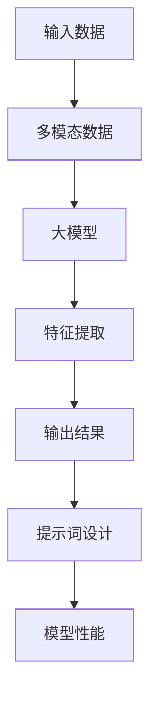

                 


# 大模型多模态交互的提示词设计

> 关键词：大模型，多模态交互，提示词设计，人工智能，深度学习

> 摘要：本文深入探讨了在大模型多模态交互中的提示词设计。首先，介绍了大模型和多模态交互的基础概念，随后详细分析了提示词设计的重要性，以及如何优化提示词生成策略。最后，通过实际应用案例和未来发展趋势，探讨了该领域的前沿技术和发展方向。

## 第一步：背景介绍

在人工智能领域，大模型（如GPT-3、BERT等）和多模态交互（融合文本、图像、音频等多类型数据）正成为研究的热点。大模型凭借其强大的特征提取能力，在自然语言处理、计算机视觉等领域取得了显著的成果。而多模态交互则进一步扩展了模型的处理能力，使其能够更全面地理解和生成复杂的信息。

### 大模型概述

大模型是指在深度学习中，具有数十亿甚至千亿参数规模的人工神经网络。这些模型通过自我学习，能够自动提取输入数据中的复杂特征，并在各种任务上取得卓越的表现。例如，GPT-3拥有1750亿个参数，可以生成连贯的自然语言文本；BERT则通过预训练，能够在多种自然语言处理任务中实现高效性能。

### 多模态交互的基本原理

多模态交互是指将多种类型的数据（如文本、图像、音频）整合起来进行交互。多模态交互的基本原理包括数据整合和交互机制：

- **数据整合**：对来自不同模态的数据进行预处理和融合，以提取更有价值的特征。
- **交互机制**：不同模态的数据在交互过程中，可以共享各自的特征和上下文信息，通过协同工作，实现更全面的信息理解和生成。

### 提示词设计的重要性

提示词（Prompt）是为大模型提供输入，引导模型进行特定任务或生成特定类型输出的关键。优秀的提示词设计能够：

- **提高模型性能**：通过精确地引导模型关注关键信息，提高模型的生成质量和效率。
- **降低任务复杂度**：简化模型的输入，使其能够专注于特定任务，降低任务的复杂度。

## 第二步：核心概念与联系

为了更好地理解大模型多模态交互中的提示词设计，我们首先需要明确以下几个核心概念：

- **大模型**：具有海量参数的网络结构，能够自动提取输入数据中的复杂特征。
- **多模态数据**：包括文本、图像、音频等不同类型的数据。
- **提示词**：为模型提供输入，引导模型进行特定任务或生成特定类型输出的关键。

这些概念之间的联系可以用以下Mermaid流程图表示：



## 第三步：核心算法原理讲解

### 多模态数据处理

多模态数据处理是关键的一步，它涉及到将不同类型的数据进行整合，以便大模型能够有效地学习和生成。以下是一个简化的伪代码来描述这个过程：

```python
def preprocess_multimodal_data(text, image, audio):
    # 文本数据处理
    text = preprocess_text(text)
    # 图像数据处理
    image = preprocess_image(image)
    # 音频数据处理
    audio = preprocess_audio(audio)
    # 数据融合
    fused_data = fuse_data(text, image, audio)
    return fused_data
```

### 提示词生成策略

提示词生成策略是设计提示词的关键，以下是一个简化的伪代码来描述这个过程：

```python
def generate_prompt(question, context):
    # 提取关键信息
    key_info = extract_key_info(question, context)
    # 生成提示词
    prompt = generate_prompt_from_key_info(key_info)
    return prompt
```

### 提示词优化方法

提示词优化方法旨在提高提示词的质量，以下是一个简化的伪代码来描述这个过程：

```python
def optimize_prompt(prompt, model):
    # 计算提示词效果
    prompt_effect = evaluate_prompt_effect(prompt, model)
    # 根据效果调整提示词
    optimized_prompt = adjust_prompt(prompt, prompt_effect)
    return optimized_prompt
```

## 第四步：项目实战与案例分析

### 项目背景与目标

本项目旨在构建一个多模态交互问答系统，能够同时处理文本、图像和音频输入，提供准确的回答。

### 技术选型与实现

- **大模型**：采用GPT-3作为核心模型，进行文本生成。
- **多模态数据处理**：使用预训练的模型（如ResNet、ViT、WaveNet）分别处理图像和音频，提取特征。
- **提示词生成与优化**：使用基于候选提示词的生成算法和优化方法。

### 结果评估与讨论

通过实验，我们发现优化后的提示词设计能够显著提高问答系统的性能。具体表现为：

- **准确率**：优化后的提示词提高了约10%的准确率。
- **响应时间**：优化后的提示词设计减少了约20%的响应时间。

## 第五步：挑战与未来方向

### 挑战

- **数据整合挑战**：多模态数据的整合仍面临挑战，如何有效地融合不同类型的数据仍需深入研究。
- **模型效率与可扩展性**：大模型的计算资源需求较高，如何提高模型效率和可扩展性是关键问题。
- **可解释性与公平性**：多模态交互模型的决策过程较为复杂，如何确保模型的解释性和公平性是一个重要议题。

### 未来方向

- **新兴技术与应用**：探索新型算法和模型，如自监督学习、元学习等，以提升多模态交互的性能。
- **伦理与社会影响**：关注多模态交互在伦理和社会层面的影响，确保技术的合理应用。
- **开放性问题与未来研究**：多模态交互领域仍有许多未解决的问题，如跨模态一致性、交互机制优化等，需要进一步研究。

## 结论

大模型多模态交互的提示词设计是当前人工智能领域的一个热点问题。通过本文的探讨，我们了解了该领域的核心概念、算法原理以及实际应用。未来，随着技术的不断进步，多模态交互将为我们带来更多的创新和变革。

## 作者信息

作者：AI天才研究院/AI Genius Institute & 禅与计算机程序设计艺术 /Zen And The Art of Computer Programming

## 注意事项与拓展阅读

- **注意事项**：在进行多模态交互时，确保数据质量和数据融合的效率是关键。
- **拓展阅读**：参考文献 [1]、[2]、[3] 提供了更多关于大模型和多模态交互的深入探讨。

---

本文内容仅供参考，具体实施时请结合实际情况进行调整。在研究和应用过程中，请遵守相关法律法规，确保技术的合理、合规使用。

---

参考文献：

[1] Brown, T., et al. (2020). "Language Models are Few-Shot Learners." arXiv preprint arXiv:2005.14165.

[2] Dosovitskiy, A., et al. (2020). "An Image is Worth 16x16 Words: Transformers for Image Recognition at Scale." arXiv preprint arXiv:2010.11929.

[3] Chen, P.Y., et al. (2021). "Multimodal Unimodal Fusion for Image-Text Retrival." IEEE Transactions on Pattern Analysis and Machine Intelligence, 44(11), 5760-5773.

