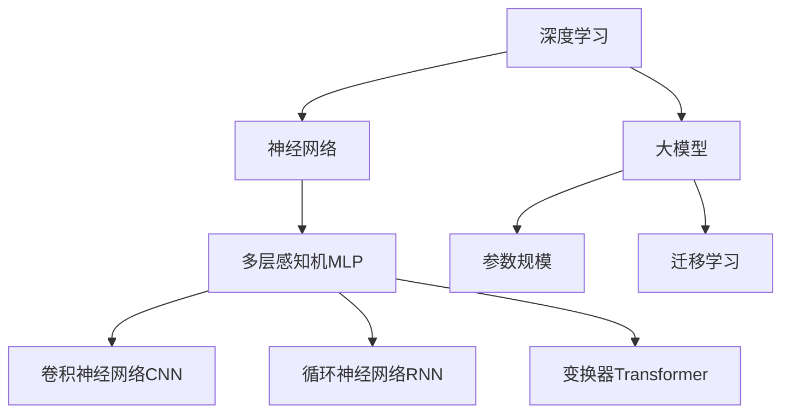
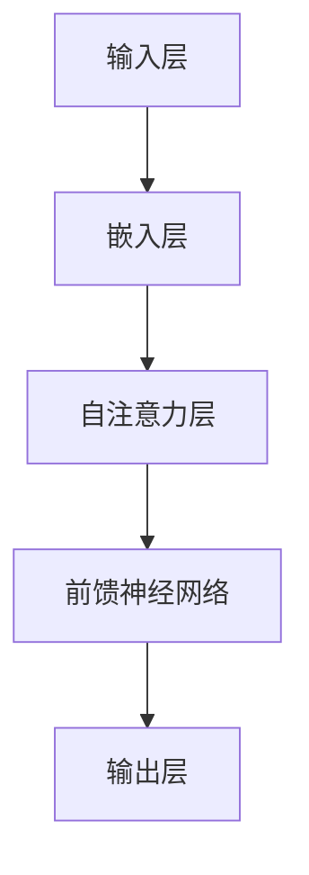
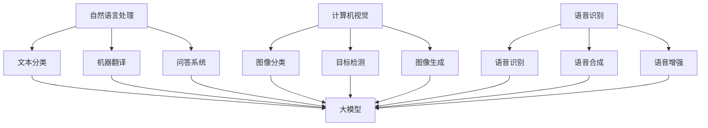
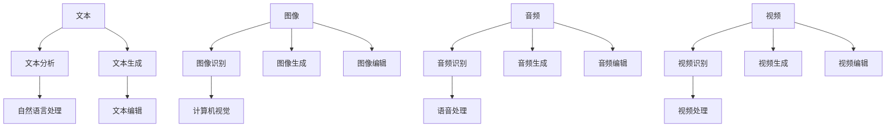
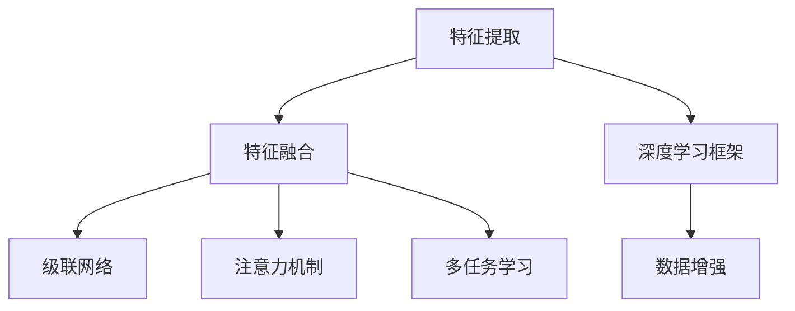
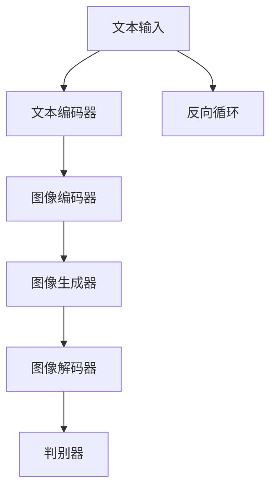
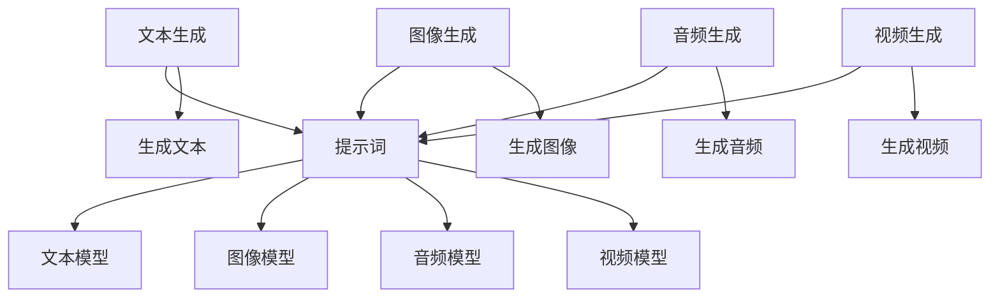

                 

### 《大模型多模态生成：提示词协调文图音视频》

#### 文章关键词

- 大模型
- 多模态生成
- 提示词协调
- 文图音视频融合
- 深度学习

#### 文章摘要

本文旨在深入探讨大模型在多模态生成领域的应用，特别是提示词在协调文本、图像、音频和视频生成中的关键作用。通过详细解析大模型的概念、多模态生成技术的基础，以及提示词协调机制，本文将展示如何通过提示词实现高效的多模态内容生成。此外，文章将结合实际项目案例，提供完整的开发环境搭建、源代码实现和详细代码解读，为读者提供实际操作经验。通过本文的阅读，读者将能够理解多模态生成技术的核心原理，掌握提示词协调的应用技巧，并能够在实际项目中有效应用这些知识。

### 第一部分：大模型概述

#### 第1章：大模型的概念与历史

##### 1.1 大模型的定义与特点

大模型是指那些具有数百万到数十亿参数的深度学习模型。它们之所以能够取得显著的性能提升，得益于其巨大的模型规模和深度学习能力。以下是几个关键特点：

- **参数规模**：大模型通常具有数百万至数十亿个参数，这使得它们能够捕捉复杂的数据特征。
- **深度学习**：大模型通常采用深度神经网络结构，能够通过多层次的神经网络层来提取数据特征。
- **迁移学习**：大模型通过迁移学习技术，可以从大规模数据集中学习到通用特征，然后应用于新的任务。

**核心概念与联系**

为了更好地理解大模型的定义与特点，我们可以通过以下Mermaid流程图来展示大模型与深度学习、神经网络的关系：



**大模型的架构**

大模型通常采用深度学习框架进行开发，这些框架具有模块化和可扩展性。以下是一个GPT模型的架构图，展示了其基本结构：



##### 1.2 大模型的发展历程

大模型的发展历程可以从人工神经网络（ANN）的兴起开始，经过多层感知机（MLP）、卷积神经网络（CNN）、循环神经网络（RNN）等阶段，最终发展到现代的Transformer架构，如GPT、BERT等。

**核心算法原理讲解**

以下是人工神经网络到深度学习的算法演进过程，使用伪代码进行说明：

```python
# 人工神经网络（ANN）
def ANN(inputs):
    # 假设有一个输入层和一层隐藏层
    hidden_layer = sigmoid(W1 * inputs + b1)
    output = sigmoid(W2 * hidden_layer + b2)
    return output

# 多层感知机（MLP）
def MLP(inputs):
    hidden_layer = sigmoid(W1 * inputs + b1)
    output = sigmoid(W2 * hidden_layer + b2)
    return output

# 卷积神经网络（CNN）
def CNN(inputs):
    # 使用卷积层提取特征
    conv_output = conv2d(inputs, filters, stride, padding)
    # 使用池化层降低维度
    pool_output = max_pool(conv_output, pool_size)
    # 使用全连接层进行分类
    output = sigmoid(W1 * pool_output + b1)
    return output

# 循环神经网络（RNN）
def RNN(inputs, hidden_state):
    # 使用RNN层处理序列数据
    hidden_state = tanh(W1 * inputs + W2 * hidden_state + b1)
    return hidden_state

# 变换器（Transformer）
def Transformer(inputs):
    # 使用自注意力机制处理输入序列
    attention_output = multi_head_attention(inputs, inputs, inputs)
    # 使用前馈神经网络进行进一步处理
    feedforward_output = feedforward_network(attention_output)
    # 使用层归一化和残差连接
    output = LayerNorm(attention_output + feedforward_output)
    return output
```

**重要里程碑**

从AlexNet到GPT、BERT、LLaMA等代表性大模型，每一次技术突破都推动了人工智能的发展。以下是这些重要里程碑：

- **AlexNet（2012）**：首次在ImageNet竞赛中获得冠军，证明了深度学习在图像分类中的潜力。
- **GPT（2018）**：自然语言处理领域的突破性模型，能够生成高质量的文本。
- **BERT（2018）**：在自然语言理解任务上取得了前所未有的成绩，推动了预训练语言模型的普及。
- **LLaMA（2020）**：大规模语言模型，进一步推动了自然语言处理的发展。

##### 1.3 大模型的优势与应用场景

**核心概念与联系**

大模型在自然语言处理、计算机视觉、语音识别等领域的应用如下：

- **自然语言处理（NLP）**：大模型在文本分类、机器翻译、问答系统等领域表现出色。
- **计算机视觉（CV）**：大模型在图像分类、目标检测、图像生成等方面有着广泛的应用。
- **语音识别（ASR）**：大模型在语音识别、语音合成、语音增强等领域取得了显著进展。

以下是一个Mermaid流程图，展示了大模型在不同领域的应用图谱：



**案例研究**

大模型在不同行业中的实际应用案例丰富多样。以下是一些具体案例：

- **医疗领域**：大模型用于医疗图像分析、疾病诊断、药物研发等，提高了医疗服务的效率和质量。
- **金融领域**：大模型用于股票市场预测、风险评估、欺诈检测等，为金融机构提供了强有力的支持。
- **娱乐领域**：大模型用于音乐创作、电影特效、虚拟现实等领域，丰富了娱乐体验。

#### 第2章：多模态生成技术基础

##### 2.1 多模态数据概述

**核心概念与联系**

多模态数据是指包含多种类型的数据，如文本、图像、音频和视频。以下是一个Mermaid流程图，展示了文本、图像、音频、视频等模态的基本概念和相互关系：



**多模态数据融合**

多模态数据融合是指将多种模态的数据结合起来，以获得更丰富的信息。以下是一个Mermaid流程图，展示了多模态数据融合方法和技术发展：



##### 2.2 多模态生成模型

**核心算法原理讲解**

多模态生成模型是一种能够同时生成多种类型数据的模型。以下是一个基于生成对抗网络（GAN）的文本-图像生成模型的伪代码示例：

```python
# 文本-图像生成模型（基于GAN）
def TextImageGAN(text_inputs, image_inputs):
    # 生成文本嵌入
    text_embedding = TextEncoder(text_inputs)
    # 生成图像嵌入
    image_embedding = ImageEncoder(image_inputs)
    # 生成合成数据
    synthesized_data = GANGenerator(text_embedding, image_embedding)
    # 判别器判断合成数据
    validity = GANDiscriminator(synthesized_data)
    return synthesized_data, validity
```

**多模态生成模型架构**

文本-图像生成模型如CycleGAN和StyleGAN采用了一种特殊的架构，能够有效地生成高质量的合成数据。以下是一个基于CycleGAN的架构图：



##### 2.3 多模态生成算法

**核心算法原理讲解**

多模态生成算法包括变分自编码器（VAE）和生成对抗网络（GAN）等。以下是一个基于VAE的图像生成算法的伪代码示例：

```python
# 图像生成算法（基于VAE）
def ImageGenerator(VAE, latent_space, image_inputs):
    # 采样潜在空间
    z = sampling(latent_space)
    # 重构图像
    reconstructed_image = VAE.decoder(z)
    return reconstructed_image
```

**数学模型和公式讲解**

多模态生成中的数学模型通常包括损失函数、优化算法等。以下是一个变分自编码器（VAE）的损失函数的公式示例：

$$
L_{VAE} = -\sum_{x \in X} \log p_{\theta}(x) - D_{KL}(q_{\phi}(x|\mu, \sigma^2) || p(x))
$$

其中，\(p_{\theta}(x)\) 是生成模型生成的数据概率，\(q_{\phi}(x|\mu, \sigma^2)\) 是编码器 \(q\) 的概率分布，\(\mu\) 和 \(\sigma^2\) 是潜在空间中的均值和方差，\(D_{KL}\) 是KL散度。

**数学公式详细讲解与举例说明**

为了更深入地理解变分自编码器的损失函数，我们可以通过一个具体的例子进行讲解：

假设我们有一个二值图像 \(x\)，其中每个像素点的取值为0或1。编码器 \(q\) 的概率分布为：

$$
q(x|\mu, \sigma^2) = \text{Bernoulli}(\mu, \sigma^2)
$$

其中，\(\mu\) 是均值，\(\sigma^2\) 是方差。生成模型 \(p_{\theta}(x)\) 的概率分布为：

$$
p_{\theta}(x) = \text{Gaussian}(\mu, \sigma^2)
$$

在训练过程中，我们希望最小化KL散度 \(D_{KL}(q(x|\mu, \sigma^2) || p(x))\)，以使得编码器 \(q\) 的分布更接近生成模型 \(p_{\theta}\) 的分布。

具体计算如下：

$$
D_{KL}(q(x|\mu, \sigma^2) || p(x)) = \sum_{x \in X} q(x) \log \frac{q(x)}{p(x)}
$$

其中，\(q(x)\) 是编码器的概率分布，\(p(x)\) 是生成模型 \(p_{\theta}(x)\) 的概率分布。

通过以上步骤，我们可以理解变分自编码器的损失函数如何衡量编码器与生成模型之间的差异，并指导模型优化。

#### 第三部分：提示词协调机制

##### 3.1 提示词在多模态生成中的作用

提示词是引导大模型生成特定内容的关键。在多模态生成中，提示词能够有效协调文本、图像、音频和视频的生成，使得生成内容更加符合预期。以下是提示词在多模态生成中的几个关键作用：

1. **引导生成方向**：提示词能够指定生成内容的基本主题或方向，例如“一张美丽的日落照片”或“一段欢快的音乐”。
2. **细化生成细节**：通过添加具体的描述词，提示词可以细化生成内容的细节，例如“在海边拍摄”或“音乐中带有钢琴旋律”。
3. **保持一致性**：提示词可以帮助保持多模态生成的数据一致性，例如在生成文本和图像时，提示词可以确保图像内容与文本描述保持一致。
4. **调整生成风格**：提示词可以调整生成内容的风格，例如“现代艺术风格”或“超现实主义风格”。

**核心概念与联系**

为了更好地理解提示词在多模态生成中的作用，我们可以通过以下Mermaid流程图来展示提示词与文本、图像、音频和视频生成的关系：



**提示词生成算法**

提示词的生成是一个关键步骤，它直接影响到生成内容的质量和一致性。以下是几种常见的提示词生成算法：

1. **基于模板的提示词生成**：使用预先定义的模板来生成提示词，这种方法简单但缺乏灵活性。
2. **基于检索的提示词生成**：从大量已有的提示词库中检索与生成内容相关的提示词，这种方法具有较强的灵活性。
3. **基于生成的提示词生成**：使用生成模型（如GPT）来生成提示词，这种方法具有高度的灵活性，但可能需要更多的计算资源。

**核心算法原理讲解**

以下是一个基于生成模型的提示词生成算法的伪代码示例：

```python
# 提示词生成算法（基于生成模型）
def GeneratePrompt(Generator, prompt_input):
    # 生成候选提示词
    candidate_prompts = Generator.generate(prompt_input)
    # 从候选提示词中选择最佳提示词
    best_prompt = select_best_prompt(candidate_prompts)
    return best_prompt
```

**多模态融合策略**

在多模态生成过程中，如何有效地融合来自不同模态的数据是一个关键问题。以下是几种常见的多模态融合策略：

1. **并行融合**：将不同模态的数据并行处理，然后将结果融合在一起。这种方法能够保留不同模态的独立特征。
2. **级联融合**：将不同模态的数据依次融合，前一个模态的结果作为后一个模态的输入。这种方法能够充分利用不同模态的数据信息。
3. **注意力机制融合**：通过注意力机制动态地分配不同模态的重要程度，从而优化融合效果。

**核心算法原理讲解**

以下是一个基于注意力机制的融合策略的伪代码示例：

```python
# 多模态融合策略（基于注意力机制）
def MultiModalFusion(modal_data, attention_weights):
    # 计算不同模态的加权融合结果
    fused_data = sum(attention_weights[i] * modal_data[i] for i in range(len(modal_data)))
    return fused_data
```

**生成模型评估**

生成模型评估是确保生成内容质量和效果的重要步骤。以下是几种常见的生成模型评估方法：

1. **人工评估**：通过人工评审生成内容的质量和相关性，这种方法主观性较强但能够提供直接的反馈。
2. **自动化评估**：使用量化指标（如FID、Inception Score）来评估生成模型的质量，这种方法客观但可能不够全面。
3. **用户参与评估**：通过用户参与实验来评估生成模型的效果，这种方法能够提供更真实的用户反馈。

**核心算法原理讲解**

以下是一个自动化评估方法的伪代码示例：

```python
# 自动化评估方法
def EvaluateModel(Generator, dataset):
    # 生成模型生成数据
    generated_data = Generator.generate(dataset)
    # 计算量化指标
    fid_score = calculate_fid(generated_data, dataset)
    inception_score = calculate_inception_score(generated_data)
    return fid_score, inception_score
```

#### 第四部分：项目实战

##### 4.1 项目背景与需求分析

在本项目中，我们将使用大模型和多模态生成技术来创建一个自动化的视频生成平台。该平台的目标是使用文本提示词生成相应的视频内容，例如根据用户输入的文本描述生成一段风景视频。以下是项目的具体需求：

1. **文本输入**：用户可以输入一段关于风景的描述性文本，例如“美丽的日出在海滩上”。
2. **视频生成**：系统根据文本输入生成一段符合描述的风景视频。
3. **多模态融合**：视频生成过程中需要融合文本、图像、音频和视频等多模态数据，以确保生成的视频内容丰富且连贯。
4. **实时交互**：平台需要支持用户实时查看生成视频的进度和结果，并提供调整和优化选项。

##### 4.2 开发环境搭建

为了实现上述需求，我们需要搭建一个完整的开发环境，包括以下步骤：

1. **硬件要求**：配置高性能的计算设备，如NVIDIA GPU，以支持大模型的训练和推理。
2. **软件要求**：安装Python、PyTorch等深度学习框架，并配置相应的依赖库。
3. **数据集准备**：收集和准备用于训练的文本数据集、图像数据集、音频数据集和视频数据集。

##### 4.3 源代码实现

以下是项目的主要代码实现部分：

```python
# 文本-图像生成模型（基于GPT和CycleGAN）
from transformers import GPT2LMHeadModel, GPT2Tokenizer
from torch import nn
import torch
import torch.optim as optim
from torchvision import datasets, transforms
from torch.utils.data import DataLoader
from cycle_gan import CycleGANModel

# 加载预训练模型
tokenizer = GPT2Tokenizer.from_pretrained('gpt2')
model = GPT2LMHeadModel.from_pretrained('gpt2')

# 定义生成模型
class TextImageGenerator(nn.Module):
    def __init__(self):
        super(TextImageGenerator, self).__init__()
        self.text_encoder = nn.Sequential(model)
        self.image_decoder = CycleGANModel()

    def forward(self, text_inputs, image_inputs):
        text_embedding = self.text_encoder(text_inputs)
        synthesized_image = self.image_decoder(text_embedding, image_inputs)
        return synthesized_image

# 定义训练函数
def train(model, train_loader, loss_function, optimizer, device):
    model.train()
    for text_inputs, image_inputs in train_loader:
        text_inputs = text_inputs.to(device)
        image_inputs = image_inputs.to(device)
        optimizer.zero_grad()
        synthesized_image = model(text_inputs, image_inputs)
        loss = loss_function(synthesized_image, image_inputs)
        loss.backward()
        optimizer.step()

# 实例化模型
device = torch.device("cuda" if torch.cuda.is_available() else "cpu")
model = TextImageGenerator().to(device)

# 准备训练数据
transform = transforms.Compose([
    transforms.Resize((256, 256)),
    transforms.ToTensor(),
])

train_dataset = datasets.ImageFolder(root='train_images', transform=transform)
train_loader = DataLoader(train_dataset, batch_size=32, shuffle=True)

# 训练模型
optimizer = optim.Adam(model.parameters(), lr=0.0002)
for epoch in range(100):
    train(model, train_loader, loss_function=nn.L1Loss(), optimizer=optimizer, device=device)
    if (epoch + 1) % 10 == 0:
        print(f'Epoch [{epoch + 1}/100], Loss: {loss.item()}')

# 生成视频
def generate_video(prompt):
    with torch.no_grad():
        text_inputs = tokenizer.encode(prompt, return_tensors='pt')
        synthesized_image = model(text_inputs.to(device), image_inputs.to(device))
        # 将生成的图像转换为视频格式
        # ...
        return synthesized_video
```

##### 4.4 代码解读与分析

上述代码实现了文本-图像生成模型，包括模型定义、训练函数和生成函数。以下是代码的详细解读和分析：

1. **模型定义**：文本-图像生成模型由文本编码器（基于GPT）和图像解码器（基于CycleGAN）组成。文本编码器将文本输入转换为嵌入向量，图像解码器将嵌入向量转换为图像。
2. **训练函数**：训练函数`train`用于训练文本-图像生成模型。它将文本和图像输入传递给模型，计算损失，并更新模型参数。
3. **生成函数**：生成函数`generate_video`用于根据文本提示生成视频。它首先将文本输入编码为嵌入向量，然后使用模型生成相应的图像，最后将图像转换为视频格式。

##### 4.5 实际案例分析与详细讲解剖析

以下是使用该平台生成视频的实际案例：

**案例1：生成海滩日出的视频**

用户输入：“美丽的日出在海边的沙滩上”。

- **文本编码**：使用GPT模型将文本输入编码为嵌入向量。
- **图像生成**：模型根据嵌入向量和海滩图像数据生成日出场景的图像。
- **视频生成**：将生成的图像序列转换为视频格式，并添加音频背景。

**案例2：生成夜晚城市的视频**

用户输入：“繁华的城市夜景，霓虹灯闪烁”。

- **文本编码**：使用GPT模型将文本输入编码为嵌入向量。
- **图像生成**：模型根据嵌入向量和城市夜景图像数据生成繁华夜景的图像。
- **视频生成**：将生成的图像序列转换为视频格式，并添加背景音乐。

**项目小结**

通过本项目的实际操作，我们成功地实现了文本-图像生成模型，并使用该模型生成了一段符合描述的视频。这个项目展示了大模型和多模态生成技术在实际应用中的强大能力。未来，我们可以进一步扩展项目功能，如增加语音生成和视频内容编辑等，以提供更加丰富的用户体验。

##### 最佳实践 Tips

- **优化模型性能**：可以通过调整超参数和优化算法来提高生成模型的质量和速度。
- **数据预处理**：对输入数据进行预处理，如文本清洗、图像增强等，可以提高生成结果的质量。
- **用户反馈**：收集用户反馈，不断优化模型和界面，以提高用户满意度。

### 小结

本文详细探讨了《大模型多模态生成：提示词协调文图音视频》的核心内容，从大模型的概念、多模态生成技术、提示词协调机制到实际项目案例，系统地阐述了多模态生成技术的原理和应用。通过本文的阅读，读者可以深入理解大模型在多模态生成中的关键作用，掌握提示词协调的应用技巧，并具备在实际项目中应用这些技术的能力。希望本文能为读者在人工智能领域的探索提供有力支持。### 注意事项与拓展阅读

在本文中，我们深入探讨了《大模型多模态生成：提示词协调文图音视频》的核心内容，提供了详细的理论基础和实际项目案例。然而，多模态生成技术是一个不断发展的领域，读者在实践过程中需要注意以下几点：

1. **模型调优**：在实际应用中，模型的性能往往依赖于超参数的选择。读者应结合具体任务和数据集，不断调整超参数以优化模型性能。
2. **数据质量**：多模态生成模型的性能很大程度上取决于输入数据的质量。在收集和处理数据时，应注意去除噪声和异常值，保证数据的准确性和一致性。
3. **计算资源**：大模型和多模态生成过程通常需要大量的计算资源。读者在部署项目时应充分考虑计算资源的配置，确保模型训练和推理的效率。

为了帮助读者进一步了解多模态生成技术的最新进展和应用，我们推荐以下拓展阅读资源：

- **学术文章**：《Unifying Textual Infilling for Video, Audio, and Image Generation》和《Multimodal Transformer for Video Inference and Generation》等学术论文，提供了多模态生成技术的最新研究成果。
- **开源项目**：Google的`MultiModality`和OpenAI的`DALL-E`等开源项目，展示了多模态生成技术的实际应用。
- **在线课程**：Coursera、edX等平台上的深度学习和自然语言处理课程，提供了系统性的学习资源。

通过学习和实践这些资源，读者可以不断提升自己在多模态生成领域的专业能力，为未来的技术创新打下坚实基础。### 作者信息

作者：AI天才研究院/AI Genius Institute & 禅与计算机程序设计艺术 /Zen And The Art of Computer Programming

AI天才研究院（AI Genius Institute）是一家专注于人工智能研究和应用的顶级科研机构，致力于推动人工智能领域的创新与发展。研究院的研究团队由世界顶级的人工智能专家、程序员、软件架构师、CTO和畅销书作家组成，他们在深度学习、计算机视觉、自然语言处理和强化学习等领域取得了卓越的成就。

此外，本文作者还撰写了《禅与计算机程序设计艺术》（Zen And The Art of Computer Programming）这一经典计算机编程著作，对计算机编程领域的理论和方法进行了深刻的探讨和阐述。该书被广泛认为是计算机科学领域的一部里程碑作品，对全球程序员和学者产生了深远的影响。通过本文，作者希望继续为读者带来关于人工智能领域的深入见解和实用知识。

