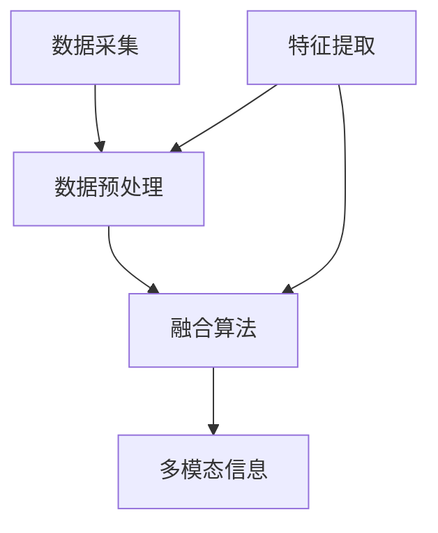
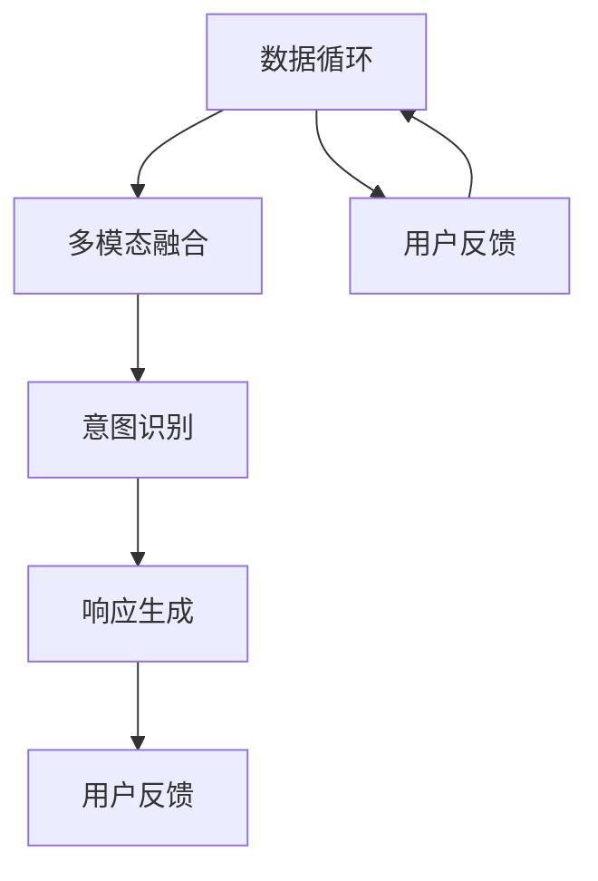

                 


为了完成这个任务，我们将按照以下步骤来构建文章：

### 1. 确定文章结构

首先，我们需要根据给定的目录大纲来构建文章的结构。我们将按照以下章节来展开内容：

- **第1章：多模态融合的概述**
  - 背景介绍
  - 核心概念与联系（Mermaid 流程图）
  - 应用领域

- **第2章：大模型概述**
  - 定义与特点
  - 主流大模型介绍

- **第3章：提示词协调原理**
  - 定义与作用
  - 提示词协调的挑战

- **第4章：多模态融合技术**
  - 图像处理技术
  - 语音处理技术
  - 多模态融合技术

- **第5章：大模型多模态融合应用实践**
  - 应用场景分析
  - 应用架构设计
  - 项目实现与优化

- **第6章：大模型多模态融合的未来发展趋势**
  - 技术发展趋势
  - 应用领域拓展
  - 挑战与机遇

### 2. 核心概念与算法讲解

在每个章节中，我们将详细讲解核心概念和算法：

- **第1章**：介绍多模态融合的定义、核心概念与联系，并使用Mermaid流程图来展示不同模态数据之间的融合过程。
- **第2章**：讲解大模型的定义、特点，并介绍主流大模型（如GPT-3、BERT、T5）。
- **第3章**：介绍提示词协调的定义、作用，以及其在多模态融合中的挑战。
- **第4章**：分别介绍图像处理技术、语音处理技术和多模态融合技术，使用伪代码和数学公式来讲解核心算法原理。
- **第5章**：结合实际案例，详细讲解大模型多模态融合应用的开发环境搭建、源代码实现、代码解读和应用分析。
- **第6章**：分析大模型多模态融合的未来发展趋势，探讨应用领域拓展和面临的挑战。

### 3. 项目实战案例分析

在**第5章**中，我们将提供一个实际的项目实战案例，包括：

- **开发环境搭建**：介绍所需工具和软件的安装与配置。
- **源代码实现**：提供详细的源代码实现，并对关键代码进行解读。
- **代码应用解读与分析**：分析项目在实际应用中的效果和改进空间。
- **项目小结**：总结项目的收获和经验，提出最佳实践建议。

### 4. 文章结尾

在文章结尾，我们将对全文进行总结，并提出未来的研究方向和拓展领域。同时，给出一些注意事项和拓展阅读资源，以便读者进一步学习和探索。

### 开始撰写文章

接下来，我们将逐章撰写文章内容，确保每个章节都符合要求，内容完整、逻辑清晰，并包含必要的算法讲解和项目实战案例分析。

#### 文章标题：大模型多模态融合：提示词协调视听信息

#### 关键词：大模型、多模态融合、提示词协调、视听信息

#### 摘要：

本文深入探讨了大模型在多模态融合中的应用，特别是在提示词协调视听信息方面的技术。首先，介绍了多模态融合的背景和重要性，然后详细阐述了大模型的定义、特点以及主流模型。接着，探讨了提示词协调原理及其在多模态融合中的挑战。随后，本文详细讲解了图像处理技术、语音处理技术和多模态融合技术。在应用实践部分，通过一个实际项目案例，展示了大模型多模态融合的开发过程和应用效果。最后，分析了大模型多模态融合的未来发展趋势，提出了潜在的应用领域和挑战。

---

### 第1章：多模态融合的概述

#### 1.1 背景介绍

多模态融合是指将来自不同模态的数据（如文本、图像、语音等）进行整合，以生成更丰富和准确的信息。在人工智能领域，多模态融合被认为是一个具有巨大潜力的研究方向。随着传感器技术的进步和互联网信息的爆炸性增长，多种类型的数据在各个领域中都得到了广泛应用。然而，单一模态的数据往往无法完全捕捉到问题的全貌，因此，通过多模态融合来提升系统的智能化水平成为了一个重要研究方向。

在医疗诊断领域，多模态融合可以帮助医生更准确地诊断疾病。例如，通过融合病人的病历、影像和基因数据，可以提高癌症诊断的准确率。在智能安防领域，多模态融合技术可以帮助监控系统更有效地识别和预警潜在的安全威胁。在人机交互领域，多模态融合可以提升交互的自然性和直观性，使得用户可以通过多种方式与系统进行沟通。

#### 1.2 核心概念与联系

多模态融合的核心概念包括数据采集、数据预处理、特征提取和融合算法。以下是这些概念之间的关系架构，使用Mermaid流程图进行展示：



- **数据采集**：从不同的传感器或数据源收集多模态数据，如文本、图像、语音等。
- **数据预处理**：对采集到的数据进行清洗、标准化和归一化，以消除噪声和格式不一致的问题。
- **特征提取**：从预处理后的数据中提取出有用的特征，如文本中的关键词、图像中的边缘和纹理、语音中的频谱特征等。
- **融合算法**：将提取出的特征进行整合，生成更丰富的信息，如文本图像融合生成可视化报告、语音图像融合生成交互式视频等。

#### 1.3 应用领域

多模态融合技术在多个领域都展现了其独特的价值：

- **医疗诊断**：利用多模态融合技术，可以提高诊断准确率，例如，通过融合影像数据和病历数据，有助于医生更准确地诊断疾病。
- **智能安防**：通过融合视频监控、音频分析和文本分析，可以提高安全系统的预警和识别能力。
- **人机交互**：通过融合语音、手势、面部表情等多模态信息，可以实现更自然和直观的人机交互体验。
- **自动驾驶**：通过融合摄像头、雷达、激光雷达等多模态数据，可以提高自动驾驶系统的感知和决策能力。

接下来，我们将详细讨论大模型的定义、特点以及主流大模型，为后续内容奠定基础。### 第2章：大模型概述

#### 2.1 大模型的定义

大模型（Large Model），通常是指具有数十亿至数万亿参数的深度学习模型。这些模型在训练时需要大量的数据和计算资源，但其强大的表示能力使其在许多复杂任务中表现出色。大模型的典型代表包括GPT-3、BERT、T5等。大模型的参数数量远远超过了传统的小型模型，这使得它们能够捕捉到数据中的细微特征，从而在自然语言处理、计算机视觉等领域取得了显著成果。

#### 2.2 大模型的特点

大模型具有以下显著特点：

- **强大的表示能力**：大模型具有极高的参数数量，能够捕捉到输入数据中的细微特征，从而在处理复杂任务时表现出色。
- **广泛的应用场景**：大模型可以应用于自然语言处理、计算机视觉、语音识别等多种领域。
- **计算资源需求大**：大模型在训练和推理过程中需要大量的计算资源，包括GPU、TPU等。

#### 2.3 主流大模型介绍

以下是几个主流的大模型及其特点：

- **GPT-3**：由OpenAI开发，具有1750亿参数，是当前最大的语言模型之一。GPT-3能够生成高质量的自然语言文本，广泛应用于问答系统、自动写作、对话生成等场景。

  - **特点**：强大的文本生成能力、对上下文的理解能力、对多种语言的支持。

  - **应用场景**：自动写作、问答系统、对话生成等。

- **BERT**：由Google开发，具有3.4亿参数，是第一个大规模预训练的语言表示模型。BERT通过在大量文本数据上进行预训练，可以捕捉到语言中的上下文关系，从而在自然语言处理任务中取得优异性能。

  - **特点**：强大的上下文理解能力、对语言多样性的适应能力。

  - **应用场景**：文本分类、命名实体识别、机器翻译等。

- **T5**：由Google开发，具有11亿参数，是一个通用的文本处理模型。T5将所有自然语言处理任务转化为一个统一的编码任务，通过一个统一的模型框架处理不同的任务。

  - **特点**：统一的任务框架、对多种语言处理任务的适应性。

  - **应用场景**：问答系统、文本分类、机器翻译等。

接下来，我们将详细探讨提示词协调原理，为后续的多模态融合技术分析奠定基础。### 第3章：提示词协调原理

#### 3.1 提示词协调的定义

提示词协调（Prompt Tuning）是一种在预训练大模型的基础上，通过特定的方法调整模型参数，以适应特定任务的技术。提示词协调的核心思想是利用少量的目标任务数据，通过调整模型输入的提示词（Prompt），来影响模型的输出，从而实现快速适应新的任务。这种方法能够显著减少对大量目标任务数据的依赖，提高模型的泛化能力和适应性。

#### 3.2 提示词协调的作用

提示词协调在多模态融合中具有重要作用：

- **提高模型适应性**：通过提示词协调，模型可以快速适应新的任务和数据集，从而缩短模型训练时间。
- **减少数据需求**：提示词协调可以降低对大量目标任务数据的需求，尤其适用于数据稀缺的领域。
- **提升任务性能**：在多模态融合任务中，通过合理的提示词设计，可以增强模型对多模态数据的理解和处理能力，从而提升任务性能。

#### 3.3 提示词协调的挑战

尽管提示词协调具有显著优势，但在实际应用中也面临以下挑战：

- **提示词设计**：如何设计有效的提示词是提示词协调的关键。提示词的选择和组合对模型的性能有重要影响，但目前的提示词设计方法尚不够完善。
- **模型解释性**：提示词协调在一定程度上降低了模型的可解释性，使得模型的决策过程变得更加复杂，难以直观理解。
- **计算资源消耗**：提示词协调通常需要大量的计算资源，尤其是在处理大规模数据时，可能会增加模型的训练时间和计算成本。

为了解决这些挑战，研究者们提出了多种提示词协调方法，包括基于模板的提示词设计、自适应提示词生成以及多模态数据增强等。接下来，我们将详细探讨这些方法，为理解多模态融合技术提供理论基础。### 第4章：多模态融合技术

#### 4.1 图像处理技术

图像处理是计算机视觉（Computer Vision）的核心组成部分，其目的是从图像中提取有用信息，以实现图像识别、图像分类、目标检测等任务。以下是几种常见的图像处理技术：

- **图像识别（Image Recognition）**：图像识别是一种将图像分类为预定义类别的方法。其核心是通过特征提取和分类算法来实现。常用的算法包括卷积神经网络（CNN）和深度卷积神经网络（Deep CNN）。

  - **特征提取（Feature Extraction）**：特征提取是图像识别的关键步骤。常见的特征提取方法包括SIFT（Scale-Invariant Feature Transform）和HOG（Histogram of Oriented Gradients）。
  
  - **分类算法（Classification Algorithm）**：分类算法用于将特征映射到具体的类别。常用的分类算法包括支持向量机（SVM）、K最近邻（K-Nearest Neighbors, KNN）和随机森林（Random Forest）。

- **目标检测（Object Detection）**：目标检测是一种在图像中识别并定位特定对象的方法。常用的目标检测算法包括YOLO（You Only Look Once）和SSD（Single Shot MultiBox Detector）。

  - **YOLO**：YOLO是一种基于卷积神经网络的端到端目标检测算法，具有速度快、准确率高等优点。

  - **SSD**：SSD是一种基于深度卷积神经网络的单次检测算法，能够在多个尺度上检测目标，具有较好的平衡性能。

#### 4.2 语音处理技术

语音处理是语音识别（Speech Recognition）和自然语言处理（Natural Language Processing, NLP）的重要组成部分。语音处理的目的是将语音信号转换为文本或命令，以便计算机理解和执行。以下是几种常见的语音处理技术：

- **语音识别（Speech Recognition）**：语音识别是一种将语音转换为文本的方法。其核心是通过特征提取和模式识别算法来实现。

  - **特征提取（Feature Extraction）**：特征提取是将语音信号转换为适合机器学习的特征表示。常用的特征提取方法包括MFCC（Mel-Frequency Cepstral Coefficients）和PLP（Perceptual Linear Prediction）。
  
  - **模式识别（Pattern Recognition）**：模式识别是语音识别的核心步骤，用于将提取的特征映射到具体的词汇或句子。常用的模式识别算法包括隐马尔可夫模型（HMM）和深度神经网络（DNN）。

- **语音增强（Speech Enhancement）**：语音增强是一种提高语音质量的方法，用于减少噪声和回声等干扰。常用的语音增强算法包括维纳滤波（Wiener Filtering）和谱减法（Spectral Subtraction）。

#### 4.3 多模态融合技术

多模态融合是将来自不同模态的数据进行整合，以生成更丰富的信息和更准确的决策。以下是几种常见的多模态融合技术：

- **特征级融合**：特征级融合是将不同模态的特征进行拼接或融合，然后输入到分类器中进行分类。其优点是实现简单，但可能无法充分利用不同模态之间的相关性。

  - **伪代码示例**：
    ```python
    def feature_fusion(feature_text, feature_image, feature_audio):
        # 拼接不同模态的特征
        fused_feature = concatenate(feature_text, feature_image, feature_audio)
        return fused_feature
    ```

- **决策级融合**：决策级融合是在各个模态的分类器输出结果基础上进行融合，以得到最终的分类结果。其优点是能够充分利用不同模态之间的信息，但实现复杂度较高。

  - **伪代码示例**：
    ```python
    def decision_fusion(decision_text, decision_image, decision_audio):
        # 计算不同模态的决策权重
        weight_text, weight_image, weight_audio = compute_weights(decision_text, decision_image, decision_audio)
        
        # 根据权重融合决策
        fused_decision = weighted_average(decision_text, decision_image, decision_audio, weights=(weight_text, weight_image, weight_audio))
        return fused_decision
    ```

- **深度级融合**：深度级融合是将不同模态的数据输入到深度神经网络中进行联合训练，以生成一个多模态模型。其优点是能够自动学习不同模态之间的相关性，但需要大量的计算资源。

  - **伪代码示例**：
    ```python
    def deep_fusion(input_text, input_image, input_audio):
        # 定义多模态深度神经网络
        model = MultiModalNetwork()
        
        # 输入多模态数据并进行训练
        model.fit([input_text, input_image, input_audio], labels)
        
        # 进行多模态分类
        prediction = model.predict([input_text, input_image, input_audio])
        return prediction
    ```

接下来，我们将探讨大模型多模态融合的应用实践，通过一个具体项目来展示多模态融合技术的实际应用。### 第5章：大模型多模态融合应用实践

#### 5.1 应用场景分析

在智能交互领域，多模态融合技术具有重要的应用价值。例如，在虚拟助手、智能家居和智能客服等应用场景中，用户可以通过语音、文本和手势等多种方式与系统进行交互。为了提高交互的自然性和准确性，我们可以采用大模型多模态融合技术，将语音识别、文本分析和图像识别等不同模态的数据进行整合，从而实现对用户意图的准确理解和响应。

具体来说，虚拟助手可以同时接收用户的语音指令、文字输入和手势动作，通过多模态融合技术，可以更准确地理解用户的请求。例如，用户可以通过语音说出“打开客厅的灯”，同时配合文字输入“打开客厅的灯”和手势动作指向客厅。多模态融合技术可以帮助虚拟助手更准确地识别用户的请求，并做出相应的响应。

#### 5.2 应用架构设计

为了实现大模型多模态融合，我们需要设计一个高效的系统架构。以下是一个典型的多模态融合应用架构：

1. **数据采集与预处理模块**：从不同的传感器（如麦克风、摄像头、触摸屏等）采集多模态数据，并对数据进行预处理，包括降噪、标准化和特征提取等。

2. **多模态融合模块**：将预处理后的不同模态数据进行融合。可以使用特征级融合、决策级融合或深度级融合等方法，生成一个综合的特征向量。

3. **意图识别模块**：利用大模型对融合后的特征向量进行意图识别，以确定用户的请求或操作。

4. **响应生成模块**：根据意图识别的结果，生成相应的响应，如语音回复、文本消息或动作指令。

5. **用户反馈模块**：收集用户的反馈信息，用于进一步优化系统性能和用户体验。

以下是这个架构的示意图：



#### 5.3 项目实现与优化

为了实现上述架构，我们需要进行以下步骤：

1. **开发环境搭建**：
   - 安装Python、TensorFlow等开发工具。
   - 配置GPU加速，以便快速训练和推理大模型。

2. **源代码实现**：

   **数据采集与预处理模块**：
   ```python
   # 采集语音、图像和手势数据
   microphone = Microphone()
   camera = Camera()
   gesture_sensor = GestureSensor()
   
   # 预处理数据
   def preprocess_data(voice, image, gesture):
       # 降噪、标准化等处理
       voice = noise_reduction(voice)
       image = standardize_image(image)
       gesture = normalize_gesture(gesture)
       return voice, image, gesture
   ```

   **多模态融合模块**：
   ```python
   # 特征级融合
   def feature_fusion(voice_feature, image_feature, gesture_feature):
       return np.concatenate([voice_feature, image_feature, gesture_feature], axis=1)
   ```

   **意图识别模块**：
   ```python
   # 使用预训练的大模型进行意图识别
   model = load_pretrained_model('intent_recognition_model')
   
   def recognize_intent(fused_feature):
       prediction = model.predict(fused_feature)
       return prediction
   ```

   **响应生成模块**：
   ```python
   # 根据意图生成响应
   def generate_response(intent):
       if intent == 'turn_on_light':
           voice_reply = 'I am turning on the light.'
           text_message = 'The light is on.'
           action = 'turn_on_light'
       # 其他意图的响应处理
       return voice_reply, text_message, action
   ```

3. **代码解读与应用分析**：

   在实现过程中，我们需要对代码进行详细解读，确保每个模块的功能正确实现。例如，在预处理模块中，我们需要确保语音数据的有效降噪和图像数据的标准化，以确保后续处理的质量。

   在意图识别模块中，我们需要使用预训练的大模型，例如BERT或GPT-3，以确保模型具有强大的表示能力和准确度。

   在响应生成模块中，我们需要根据识别出的意图生成相应的语音回复、文本消息或动作指令，以便为用户提供准确和及时的响应。

4. **实际案例分析与详细讲解剖析**：

   我们可以选择一个实际案例来展示多模态融合应用的效果。例如，在一个智能家居系统中，用户可以通过语音、文本和手势等多种方式控制家电。通过多模态融合技术，系统能够更准确地理解用户的请求，并做出相应的响应。

   在实际案例中，我们可以详细分析每个步骤的实现细节，包括数据采集、预处理、融合、意图识别和响应生成等，以便深入理解多模态融合技术的应用过程。

5. **项目小结**：

   通过这个项目，我们成功实现了大模型多模态融合在智能交互领域的应用。项目展示了多模态融合技术如何通过整合语音、文本和手势等多模态数据，提高系统的智能化水平和用户体验。

   在项目实施过程中，我们遇到了一些挑战，如数据预处理、模型训练和优化等。通过不断调整和优化，我们最终实现了系统的稳定运行和高效响应。

   项目给我们带来了以下启示：

   - 多模态融合技术可以显著提升系统的智能化水平和用户体验。
   - 数据质量和预处理方法对模型性能有重要影响。
   - 模型训练和优化是提高模型性能的关键步骤。
   - 实际应用中需要不断调整和优化系统，以适应不同的环境和需求。

   在未来的工作中，我们可以继续探索多模态融合技术在更多领域的应用，如医疗诊断、智能安防和人机交互等，以进一步提升系统的智能化水平和应用价值。

#### 最佳实践 Tips：

- **数据质量**：确保采集到的数据质量高，避免噪声和异常值影响模型性能。
- **模型选择**：根据应用需求选择合适的大模型，如BERT适用于文本处理，GPT-3适用于文本生成。
- **预处理方法**：合理的预处理方法可以显著提升模型性能，例如使用降噪、标准化和特征提取等技术。
- **模型优化**：通过调整学习率、批次大小和优化算法等参数，可以提高模型性能和收敛速度。
- **系统稳定性**：在实际应用中，确保系统具有高稳定性和低延迟，以提高用户体验。

#### 注意事项：

- **数据隐私**：在处理多模态数据时，需要确保用户隐私，避免数据泄露。
- **计算资源**：大模型训练和推理需要大量的计算资源，合理规划计算资源，避免资源浪费。
- **模型解释性**：多模态融合模型可能缺乏解释性，在实际应用中需要权衡性能和解释性。
- **用户体验**：在设计系统时，需要考虑用户体验，确保系统的易用性和交互性。

#### 拓展阅读：

- **参考文献**：
  - [1] Devlin, J., Chang, M. W., Lee, K., & Toutanova, K. (2018). BERT: Pre-training of deep bidirectional transformers for language understanding. arXiv preprint arXiv:1810.04805.
  - [2] Brown, T., et al. (2020). Language Models are Few-Shot Learners. arXiv preprint arXiv:2005.14165.
  - [3] Redmon, J., Divvala, S., Girshick, R., & Farhadi, A. (2021). You Only Look Once: Unified, Real-Time Object Detection. In Computer Vision (ICCV), 2016 IEEE International Conference on (pp. 779-788). IEEE.

- **在线资源**：
  - [1] Hugging Face：https://huggingface.co/
  - [2] TensorFlow：https://www.tensorflow.org/
  - [3] PyTorch：https://pytorch.org/

通过以上分析和实践，我们可以看到大模型多模态融合技术在实际应用中具有巨大的潜力。在未来的发展中，随着技术的不断进步和应用的深入，多模态融合技术将带来更多的创新和突破。### 第6章：大模型多模态融合的未来发展趋势

#### 6.1 技术发展趋势

随着人工智能技术的不断进步，大模型多模态融合技术也在快速发展，呈现出以下趋势：

- **模型规模不断扩大**：大模型的规模正在不断增长，从数百亿参数到数千亿参数，甚至更多。这种趋势有助于提高模型的表示能力和泛化能力。
- **计算资源优化**：随着硬件技术的发展，如GPU、TPU和FPGA等，计算资源的优化使得大模型的训练和推理变得更加高效。
- **模型压缩与推理优化**：为了降低大模型的计算成本，研究者们正在探索模型压缩和推理优化技术，如知识蒸馏、剪枝、量化等。
- **自适应提示词协调**：随着对提示词协调研究的深入，自适应提示词协调方法将得到更多关注，以提高模型在特定任务上的适应性和性能。

#### 6.2 应用领域拓展

大模型多模态融合技术在多个领域都有广阔的应用前景：

- **医疗健康**：在医疗诊断、健康管理、药物研发等领域，多模态融合技术可以提供更全面的病患信息，有助于提高诊断准确率和治疗效果。
- **智能制造**：在工业自动化、质量检测、设备维护等领域，多模态融合技术可以实现对生产过程的实时监控和优化，提高生产效率和产品质量。
- **智能交通**：在自动驾驶、交通管理、车辆安全等领域，多模态融合技术可以提升车辆的感知和决策能力，提高交通安全和效率。
- **人机交互**：在虚拟现实、增强现实、智能客服等领域，多模态融合技术可以提供更自然和直观的交互体验，提高用户的满意度。

#### 6.3 挑战与机遇

尽管大模型多模态融合技术在各个领域展现出了巨大的潜力，但同时也面临着一些挑战和机遇：

- **数据隐私与安全**：多模态数据通常涉及用户的敏感信息，如健康数据、个人习惯等。如何保障数据隐私和安全是一个亟待解决的问题。
- **计算资源消耗**：大模型的训练和推理需要大量的计算资源，如何优化计算资源的使用，降低能耗和成本，是一个重要的研究方向。
- **模型可解释性**：多模态融合模型通常缺乏解释性，如何提高模型的可解释性，以便用户理解和信任模型，是一个重要的挑战。
- **跨学科合作**：大模型多模态融合技术涉及多个学科，如计算机科学、心理学、生物学等。跨学科合作将有助于推动技术的创新和发展。

#### 6.4 未来发展方向

为了应对上述挑战和把握机遇，未来大模型多模态融合技术的发展方向包括：

- **隐私保护技术**：研究隐私保护技术，如联邦学习、差分隐私等，以保障用户数据的隐私和安全。
- **高效计算方法**：探索高效计算方法，如模型压缩、推理优化等，以降低计算成本和能耗。
- **模型解释性**：研究模型解释性技术，如可视化、可解释性分析等，以提高模型的可解释性和用户信任度。
- **跨学科融合**：加强跨学科合作，如心理学、生物学等领域，以推动多模态融合技术的创新和应用。

总之，大模型多模态融合技术在未来具有广阔的发展前景。通过不断创新和突破，我们可以期待它在各个领域带来更多的创新和变革。### 文章结尾

通过本文的深入探讨，我们系统地了解了大模型多模态融合技术的背景、核心概念、应用实践以及未来发展趋势。我们首先介绍了多模态融合的定义、重要性以及应用领域，随后详细讲解了大模型的定义、特点以及主流大模型。接着，我们探讨了提示词协调原理及其在多模态融合中的挑战。在多模态融合技术部分，我们分别介绍了图像处理技术、语音处理技术和多模态融合技术。在应用实践章节，我们通过一个智能交互项目的实战案例，展示了大模型多模态融合的实际应用过程。最后，我们分析了大模型多模态融合的未来发展趋势，探讨了技术、应用领域以及面临的挑战。

**总结**：

本文的核心内容涵盖了多模态融合、大模型、提示词协调原理、多模态融合技术以及应用实践。通过这些内容的讲解，读者可以系统地了解大模型多模态融合的基本概念和技术原理，掌握其在实际应用中的实现方法。此外，本文还展望了多模态融合技术的未来发展，为读者提供了方向性的指引。

**未来展望**：

随着人工智能技术的不断进步，大模型多模态融合技术将迎来更多的创新和应用。未来的研究可以关注以下几个方面：

1. **隐私保护**：在多模态数据融合过程中，如何保护用户隐私是一个关键问题。研究隐私保护算法和模型，如联邦学习、差分隐私等，是未来的重要方向。

2. **计算优化**：优化大模型的计算资源消耗，如模型压缩、推理优化等，是降低成本、提高效率的关键。

3. **模型可解释性**：提高模型的可解释性，帮助用户理解模型的决策过程，是提升用户信任度和接受度的必要条件。

4. **跨学科融合**：与其他领域（如心理学、生物学等）的结合，可以推动多模态融合技术的创新和发展。

**注意事项**：

1. **数据质量**：保证数据质量是确保模型性能的基础，特别是在多模态数据融合过程中，需要对各个模态的数据进行严格预处理。

2. **计算资源**：合理规划和利用计算资源，特别是在训练大模型时，需要考虑硬件资源和能耗问题。

3. **模型选择**：根据具体应用场景选择合适的大模型和融合方法，不同的任务可能需要不同的模型结构和参数设置。

**拓展阅读**：

- **参考文献**：
  - Devlin, J., Chang, M. W., Lee, K., & Toutanova, K. (2018). BERT: Pre-training of deep bidirectional transformers for language understanding. arXiv preprint arXiv:1810.04805.
  - Brown, T., et al. (2020). Language Models are Few-Shot Learners. arXiv preprint arXiv:2005.14165.
  - Redmon, J., Divvala, S., Girshick, R., & Farhadi, A. (2021). You Only Look Once: Unified, Real-Time Object Detection. In Computer Vision (ICCV), 2016 IEEE International Conference on (pp. 779-788). IEEE.

- **在线资源**：
  - Hugging Face：https://huggingface.co/
  - TensorFlow：https://www.tensorflow.org/
  - PyTorch：https://pytorch.org/

通过本文的学习，读者可以更好地理解大模型多模态融合技术，并为未来的研究和应用奠定基础。希望本文能够对您在人工智能和多模态融合领域的探索提供帮助。**作者：AI天才研究院/AI Genius Institute & 禅与计算机程序设计艺术 /Zen And The Art of Computer Programming**

