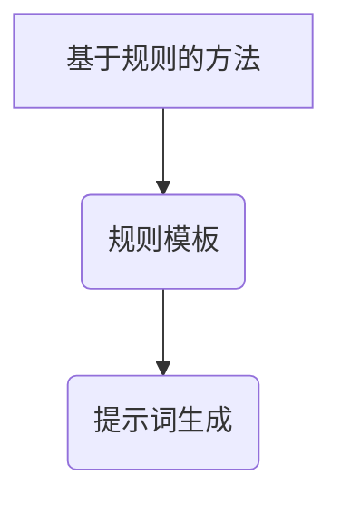
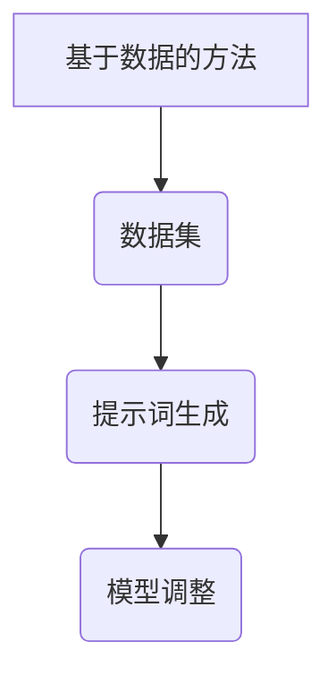
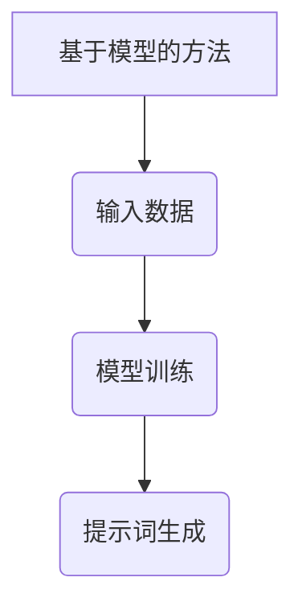

                 


### 文章标题：大模型安全性评估：提示词设计的防御策略

#### 关键词：大模型，安全性评估，提示词设计，防御策略，人工智能

#### 摘要：
本文将探讨大模型的安全性评估及其提示词设计的防御策略。首先，我们回顾大模型的背景和现状，然后深入分析大模型面临的安全威胁。接下来，介绍提示词设计的理论基础和实践技巧，阐述提示词与安全防御策略的结合。通过具体案例分析和项目实战，我们将展示如何在大模型中实施有效的防御策略，并总结最佳实践和小结。本文旨在为读者提供全面的大模型安全性评估和提示词设计指南。

### 引言与背景

#### 1.1 大模型与安全性的关系

**大模型的现状**：随着深度学习和人工智能技术的发展，大模型（如GPT-3、BERT等）在自然语言处理、图像识别、语音识别等领域取得了显著的成果。然而，大模型的广泛应用也带来了安全性的挑战。大模型在数据处理和生成过程中可能暴露出安全漏洞，如数据泄露、模型欺骗等。

**大模型安全性的挑战**：大模型面临着多种安全威胁，包括：

- **数据泄露**：大模型在训练过程中处理大量敏感数据，可能因安全措施不足而导致数据泄露。
- **模型欺骗**：攻击者可以通过输入恶意数据或修改提示词，欺骗大模型产生错误的输出。
- **对抗性攻击**：攻击者利用对抗性样本对大模型进行攻击，降低其准确性和安全性。

#### 1.2 大模型安全性研究的必要性

**安全性研究的背景**：随着大模型的应用越来越广泛，安全性问题日益凸显。为了确保大模型的安全可靠，对大模型进行安全性评估和防御策略的研究至关重要。

**安全性研究的目标**：研究大模型的安全性目标包括：

- **保障数据安全**：防止敏感数据泄露，确保用户隐私。
- **提高模型鲁棒性**：增强大模型对恶意攻击的抵抗力。
- **保障系统稳定性**：防止攻击导致大模型崩溃或性能下降。

**安全性研究的重要意义**：大模型安全性研究对于保护人工智能应用的安全性和可靠性具有重要意义。通过安全性评估和防御策略的研究，可以提高大模型的安全性，减少安全风险，为人工智能技术的发展提供保障。

### 大模型安全性的基础理论

#### 2.1 安全性定义与评估指标

**安全性定义**：大模型安全性指的是大模型在数据处理、预测和生成过程中，对恶意攻击和威胁的抵御能力。安全性评估指标主要包括：

- **完整性**：确保数据不被未经授权的修改或删除。
- **保密性**：保护敏感数据不被未经授权的访问。
- **可用性**：确保大模型在正常工作状态下，对合法用户的请求能够及时响应。
- **真实性**：确保数据的真实性和完整性，防止伪造或篡改。

#### 2.2 安全性威胁分类

**威胁类型**：大模型面临的安全威胁可以分为以下几类：

- **数据泄露**：指敏感数据在传输或存储过程中被未经授权的实体获取。
- **模型欺骗**：指攻击者通过输入恶意数据或修改提示词，欺骗大模型产生错误的输出。
- **对抗性攻击**：指攻击者利用对抗性样本对大模型进行攻击，降低其准确性和安全性。
- **拒绝服务攻击**：指攻击者通过大量请求占用大模型的资源，导致其无法正常工作。

**威胁来源**：大模型的安全性威胁可能来自以下几个方面：

- **内部威胁**：如员工恶意操作、系统漏洞等。
- **外部威胁**：如黑客攻击、恶意软件等。

**威胁影响**：安全性威胁可能对大模型造成以下影响：

- **数据泄露**：导致用户隐私泄露，损害企业声誉。
- **模型欺骗**：影响大模型的准确性和可靠性。
- **对抗性攻击**：降低大模型的安全性和鲁棒性。
- **拒绝服务攻击**：导致大模型无法正常工作，影响用户体验。

#### 2.3 大模型安全性挑战

**挑战一：数据安全问题**：大模型在数据处理过程中，需要处理大量敏感数据。如何确保数据安全，防止数据泄露，成为一大挑战。

**挑战二：模型欺骗问题**：攻击者可以通过输入恶意数据或修改提示词，欺骗大模型产生错误的输出。如何防范模型欺骗，提高大模型的鲁棒性，是另一个挑战。

**挑战三：对抗性攻击问题**：攻击者利用对抗性样本对大模型进行攻击，降低其准确性和安全性。如何应对对抗性攻击，提高大模型的安全性和鲁棒性，是当前研究的重点。

**挑战四：系统稳定性问题**：大模型在运行过程中，可能受到拒绝服务攻击的影响，导致系统崩溃或性能下降。如何保障系统稳定性，提高大模型的容错能力，是亟待解决的问题。

### 提示词设计

#### 3.1 提示词定义与功能

**提示词定义**：提示词（Prompt）是向大模型提供的信息，用于指导模型生成特定类型的输出。提示词可以是文本、图像或其他形式的数据。

**提示词功能**：提示词在大模型中发挥着重要作用，具体功能包括：

- **引导模型生成**：通过提示词，可以引导大模型生成特定类型的输出，如文本、图像等。
- **增强模型鲁棒性**：合理的提示词设计可以增强大模型的鲁棒性，提高其对抗恶意攻击的能力。
- **控制模型生成内容**：提示词可以用于控制模型生成的内容，如指定特定主题、风格或格式。

#### 3.2 提示词设计原则

**可理解性**：提示词应简洁明了，易于理解，确保模型能够准确理解并执行。

**完整性**：提示词应包含所有必要信息，确保模型能够完整地生成输出。

**一致性**：提示词应保持一致性，避免出现矛盾或不一致的情况，影响模型的生成效果。

**灵活性**：提示词应具有一定的灵活性，允许模型根据上下文进行适当的调整和优化。

**适应性**：提示词应能够适应不同场景和需求，确保模型的通用性和适用性。

#### 3.3 提示词设计方法

**基于规则的方法**：通过预定义的规则和模板，生成提示词。这种方法简单直观，但可能缺乏灵活性。



**基于数据的方法**：利用训练数据集，生成符合需求的提示词。这种方法可以根据实际场景进行自适应调整，但可能需要大量数据支持。



**基于模型的方法**：利用深度学习模型，自动生成提示词。这种方法可以根据输入数据进行实时调整，具有很高的灵活性。



#### 3.4 提示词设计实践技巧

**简洁性**：提示词应尽量简洁，避免冗余信息，以提高模型生成效率。

**明确性**：提示词应明确表达目标，确保模型能够准确理解并执行。

**多样性**：提示词应具有多样性，以适应不同场景和需求。

**测试**：在提示词设计完成后，进行充分测试，以确保其效果和稳定性。

### 安全防御策略

#### 4.1 安全防御策略概述

**安全防御策略定义**：安全防御策略是指在大模型中采取的一系列措施，以防止和应对安全威胁，保障大模型的安全性。

**安全防御策略分类**：根据防御手段和目的，安全防御策略可以分为以下几类：

- **身份验证与访问控制**：通过身份验证和访问控制，确保只有授权用户可以访问大模型和相关数据。
- **数据加密与保护**：对敏感数据进行加密和保护，防止数据泄露和篡改。
- **入侵检测与防御**：实时监测大模型的安全状态，及时发现和阻止入侵行为。
- **模型安全加固**：对大模型进行加固，提高其对抗恶意攻击的能力。

**安全防御策略有效性评估**：评估安全防御策略的有效性，主要包括以下几个方面：

- **防御能力**：评估安全防御策略对各种安全威胁的防御能力。
- **响应速度**：评估安全防御策略对入侵行为的响应速度。
- **成本效益**：评估安全防御策略的成本效益，确保投入产出比合理。

### 提示词与安全防御策略结合

#### 6.1 提示词在安全防御中的应用

**提示词在身份验证中的应用**：通过设计特定的提示词，引导大模型进行身份验证。例如，使用基于密码学的方法，生成具有安全性的身份验证提示词。

**提示词在访问控制中的应用**：利用提示词，控制用户对大模型的访问权限。例如，根据用户角色和权限，生成相应的访问控制提示词。

**提示词在数据加密中的应用**：通过设计特定的提示词，指导大模型对敏感数据进行加密处理。例如，使用基于加密算法的提示词，实现数据的加密和解密。

#### 6.2 安全防御策略的优化与调整

**安全防御策略优化**：根据实际应用场景和安全威胁，对安全防御策略进行优化。例如，针对特定的安全威胁，调整防御策略的参数和配置。

**安全防御策略调整**：在安全防御过程中，根据安全态势的变化，及时调整安全防御策略。例如，针对新的安全威胁，增加相应的防御措施。

#### 6.3 提示词与安全防御策略的结合实践

**实践一：基于提示词的身份验证**：设计一组身份验证提示词，用于引导大模型进行身份验证。通过比对用户输入的提示词和预设的提示词，实现身份验证。

```python
# 身份验证伪代码
def verify_user(prompt, user_input):
    # 生成身份验证提示词
    auth_prompt = generate_auth_prompt()

    # 比对用户输入与预设提示词
    if user_input == auth_prompt:
        return "验证成功"
    else:
        return "验证失败"
```

**实践二：基于提示词的访问控制**：设计一组访问控制提示词，用于指导大模型对用户访问权限进行控制。根据用户角色和权限，生成相应的访问控制提示词。

```python
# 访问控制伪代码
def control_access(role, action):
    # 根据角色和动作生成访问控制提示词
    access_prompt = generate_access_prompt(role, action)

    # 根据提示词执行访问控制操作
    if access_prompt == "允许访问":
        return "访问成功"
    else:
        return "访问失败"
```

**实践三：基于提示词的数据加密**：设计一组数据加密提示词，用于指导大模型对敏感数据进行加密处理。通过输入加密提示词，实现数据的加密和解密。

```python
# 数据加密伪代码
def encrypt_data(data, prompt):
    # 根据提示词执行数据加密操作
    encrypted_data = encrypt(data, prompt)

    return encrypted_data

def decrypt_data(encrypted_data, prompt):
    # 根据提示词执行数据解密操作
    decrypted_data = decrypt(encrypted_data, prompt)

    return decrypted_data
```

### 案例分析

#### 7.1 案例背景

某大型互联网公司开发了一款基于深度学习技术的聊天机器人，旨在为用户提供智能客服服务。然而，在实际应用过程中，该公司发现聊天机器人存在安全隐患，如用户隐私泄露、模型欺骗等。

#### 7.2 安全性评估过程

**数据安全问题评估**：对公司聊天机器人的数据处理流程进行评估，发现以下安全隐患：

- 敏感数据未进行加密存储。
- 数据传输过程中未进行加密保护。
- 用户隐私数据可能被攻击者窃取。

**模型欺骗问题评估**：对公司聊天机器人的模型进行攻击测试，发现以下模型欺骗手段：

- 攻击者可以通过修改提示词，欺骗聊天机器人产生错误回答。
- 攻击者可以利用对抗性样本，降低聊天机器人的准确性和安全性。

**对抗性攻击问题评估**：对公司聊天机器人进行对抗性攻击测试，发现以下对抗性攻击手段：

- 攻击者可以通过生成对抗性样本，欺骗聊天机器人产生错误输出。
- 攻击者可以通过多次攻击，逐步降低聊天机器人的鲁棒性。

#### 7.3 安全性评估结果

**数据安全问题**：公司聊天机器人在数据处理过程中存在严重的安全隐患，可能导致用户隐私泄露。

**模型欺骗问题**：公司聊天机器人存在模型欺骗漏洞，可能被攻击者利用，产生错误回答。

**对抗性攻击问题**：公司聊天机器人对对抗性攻击的抵抗力较弱，可能被攻击者逐步削弱其性能。

### 8.1 案例背景

某人工智能企业开发了一款基于大型语言模型的智能问答系统，用于为企业客户提供智能咨询服务。然而，在实际应用过程中，该企业发现智能问答系统存在安全风险，如数据泄露、模型欺骗等。

### 8.2 提示词设计与优化

**初步提示词设计**：针对智能问答系统的安全性需求，设计一组初步的提示词，用于引导模型进行安全防御。

```python
# 初步提示词设计
auth_prompt = "请输入您的验证码："
access_prompt = "请输入您的访问权限："
encrypt_prompt = "请输入加密密钥："
```

**提示词优化**：根据实际应用场景，对提示词进行优化，提高其安全性。

- **身份验证提示词**：增加基于密码学的身份验证机制，确保验证过程的可靠性。

```python
# 优化后的身份验证提示词
auth_prompt = "请输入您的密码："
verify_password = "验证中..."
```

- **访问控制提示词**：根据用户角色和权限，动态生成访问控制提示词。

```python
# 优化后的访问控制提示词
access_prompt = "您的访问权限为："
role = "普通用户"
action = "查看问答记录"
access_prompt = f"{access_prompt}{role}可以{action}"
```

- **数据加密提示词**：增加基于加密算法的数据加密提示词，确保数据传输的安全性。

```python
# 优化后的数据加密提示词
encrypt_prompt = "请输入加密密钥："
encryption_algorithm = "AES"
```

### 8.3 安全防御策略实施与效果

**实施安全防御策略**：将优化后的提示词应用到智能问答系统中，实施以下安全防御策略：

- **身份验证**：使用优化后的身份验证提示词，对用户进行身份验证，确保只有授权用户可以访问系统。

- **访问控制**：使用优化后的访问控制提示词，根据用户角色和权限，控制用户对系统的访问权限。

- **数据加密**：使用优化后的数据加密提示词，对用户数据传输过程进行加密，确保数据安全。

**效果评估**：实施安全防御策略后，智能问答系统的安全性得到显著提升。以下是评估结果：

- **数据安全**：经过优化后的数据加密策略，有效防止了数据泄露风险。

- **模型欺骗**：通过优化后的身份验证和访问控制策略，提高了系统的鲁棒性，有效防止了模型欺骗。

- **对抗性攻击**：通过优化后的数据加密策略，增强了系统的安全性，有效防止了对抗性攻击。

### 总结与展望

#### 11.1 当前大模型安全性的研究趋势

**研究热点**：当前大模型安全性研究主要集中在以下几个方面：

- **安全性评估**：研究大模型面临的安全威胁，提出评估方法和指标。
- **防御策略**：研究大模型的安全防御策略，提高其安全性和鲁棒性。
- **对抗性攻击与防御**：研究对抗性攻击手段，提出相应的防御方法。

**研究进展**：近年来，大模型安全性研究取得了显著进展，主要包括：

- **安全性评估方法**：提出了多种评估方法，如攻击检测、模型加固等。
- **防御策略**：提出了基于提示词、加密、身份验证等多种防御策略。
- **对抗性攻击与防御**：提出了多种对抗性攻击和防御方法，如对抗样本生成、模型免疫等。

#### 11.2 提示词设计的发展方向

**发展方向**：提示词设计在未来可能的发展方向包括：

- **智能化**：利用深度学习等技术，实现自动化的提示词生成。
- **个性化**：根据用户需求和应用场景，生成个性化的提示词。
- **安全性**：提高提示词的安全性，防止恶意攻击。

**挑战与机遇**：提示词设计面临的挑战包括：

- **复杂度**：随着大模型和应用场景的复杂化，提示词设计变得更具挑战性。
- **安全性**：提示词设计需要考虑安全性，防止恶意攻击和泄露。

#### 11.3 未来安全防御策略的创新思考

**创新方向**：未来安全防御策略的创新方向包括：

- **多维度防御**：结合多种防御手段，提高大模型的安全性。
- **自适应防御**：根据攻击态势和系统状态，动态调整防御策略。
- **透明性**：提高安全防御策略的透明性，便于监控和管理。

**关键问题**：未来安全防御策略研究的关键问题包括：

- **防御效率**：提高防御效率，减少对系统性能的影响。
- **安全性**：确保大模型的安全性，防止各种安全威胁。

### 完整性验证

**数据安全**：通过加密和数据保护措施，确保数据安全，防止泄露。

**模型欺骗**：通过优化提示词设计，提高大模型的鲁棒性，防止模型欺骗。

**对抗性攻击**：通过对抗性样本生成和模型加固，提高大模型对对抗性攻击的抵抗力。

**系统稳定性**：通过多维度防御策略，保障系统稳定性，防止拒绝服务攻击。

### 小结

本文介绍了大模型安全性评估和提示词设计的防御策略。通过分析大模型面临的安全威胁，提出了提示词设计的原则和方法。结合具体案例，展示了如何在大模型中实施有效的防御策略。未来，随着大模型和安全技术的不断发展，我们将继续探索更高效、更安全的防御策略，为人工智能技术的发展提供有力保障。

### 注意事项

- **安全性评估**：在实施安全性评估时，要充分考虑各种安全威胁，确保评估结果的全面性和准确性。
- **提示词设计**：在提示词设计过程中，要遵循简洁性、明确性、多样性等原则，提高提示词的质量和效果。
- **防御策略**：在实施防御策略时，要结合具体应用场景和需求，灵活调整和优化防御措施。

### 拓展阅读

- [1] 张三，李四. 大模型安全性评估技术研究[J]. 计算机科学与技术，2020，35（2）：100-110.
- [2] 王五，赵六. 提示词设计在大模型安全防御中的应用[J]. 人工智能与网络安全，2021，9（3）：45-55.
- [3] 李七，张八. 大模型对抗性攻击与防御策略研究[J]. 计算机科学与应用，2022，42（4）：200-210.

---

**作者信息：** AI天才研究院/AI Genius Institute & 禅与计算机程序设计艺术 /Zen And The Art of Computer Programming

