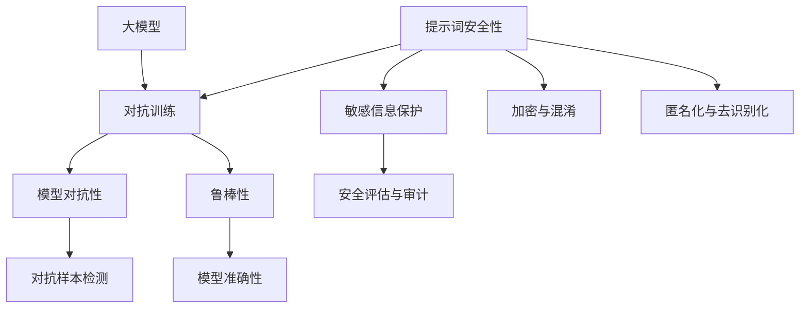
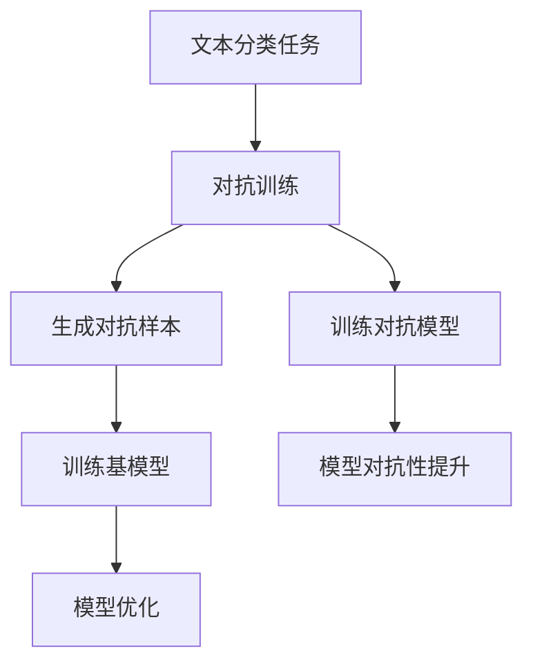
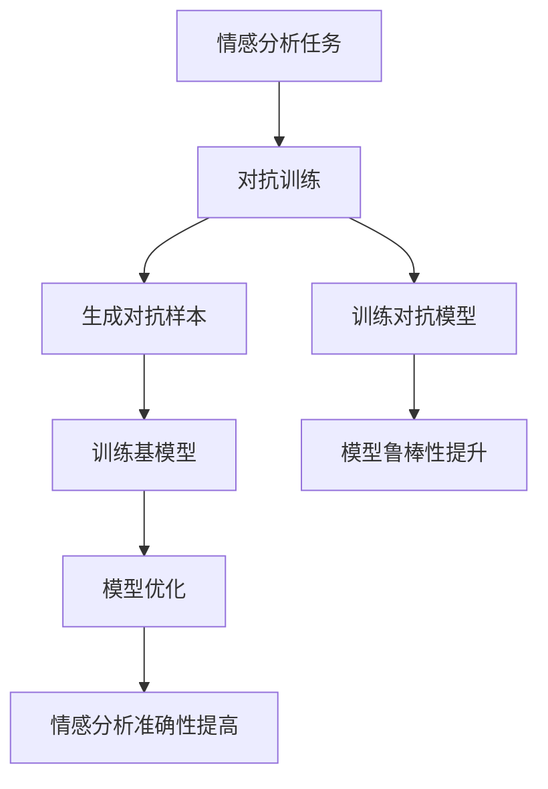
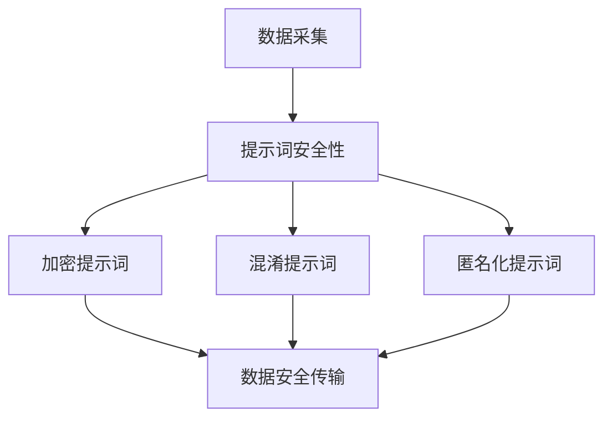
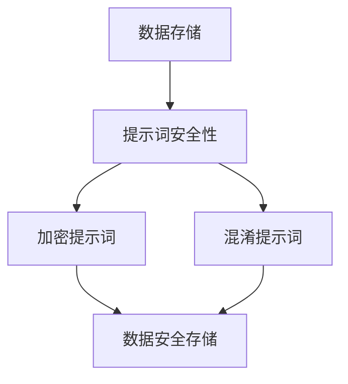

                 

### 《大模型对抗训练与提示词安全性》

#### 关键词

大模型、对抗训练、提示词、安全性、NLP、数据保护

#### 摘要

本文将探讨大模型对抗训练与提示词安全性的关键主题。首先，我们简要介绍大模型和对抗训练的基本概念，阐述其重要性。接着，我们深入探讨提示词安全性的核心问题，包括定义、挑战和防护方法。然后，本文将详细讲解大模型对抗训练的核心算法原理，并使用伪代码进行详细阐述。同时，我们将使用Mermaid流程图展示核心概念之间的关系。随后，我们将介绍提示词安全性的防护技术，包括加密、混淆和匿名化方法。接着，本文将讨论对抗训练在自然语言处理（NLP）中的应用，以及提示词安全性在数据处理中的挑战。最后，我们将通过实际案例展示这些技术的应用，并提供最佳实践和项目小结。全文旨在为读者提供全面、深入的理解和见解。

#### 背景介绍

#### 大模型

近年来，人工智能（AI）领域取得了显著进展，特别是大模型的崛起。大模型指的是具有数十亿至数万亿参数的神经网络模型，如GPT-3、BERT等。这些模型在自然语言处理（NLP）、计算机视觉、语音识别等领域表现出卓越的性能。大模型之所以能够取得如此优异的表现，一方面是由于其庞大的参数规模，使得模型能够捕捉到数据中的复杂模式和依赖关系；另一方面，得益于深度学习技术的发展，使得模型能够高效地学习并优化参数。

然而，随着大模型的规模不断扩大，其训练和推理过程也变得更加复杂和资源密集。这给AI研究和应用带来了新的挑战。为了应对这些挑战，研究人员提出了对抗训练（Adversarial Training）这一方法。对抗训练旨在通过训练模型来识别和防御对抗样本，从而提高模型的安全性和鲁棒性。

#### 对抗训练

对抗训练是一种用于提高模型对抗性的训练方法。其基本思想是，通过生成对抗样本，强迫模型在训练过程中学习到更多的边界情况，从而提高模型在真实世界中的鲁棒性。对抗样本是指通过微小扰动引入到正常样本中的样本，这些扰动通常是在模型不可见的情况下进行的。

对抗训练的基本流程如下：

1. **生成对抗样本**：首先，需要生成对抗样本。这通常涉及到对抗生成网络（Adversarial Generation Network）的设计。对抗生成网络旨在生成具有高对抗性的样本，使得模型在训练过程中能够识别并学习到对抗样本的特征。

2. **训练基模型**：使用正常样本和对抗样本对基模型（Base Model）进行训练。基模型是实际用于预测或分类的模型，如GPT、BERT等。

3. **训练对抗模型**：同时，训练一个对抗模型（Adversarial Model），该模型旨在检测和防御对抗样本。对抗模型的训练通常使用对抗样本和正常样本进行。

4. **迭代训练**：通过迭代训练基模型和对抗模型，使得模型逐渐提高对抗性。

对抗训练的核心目标是提高模型对对抗样本的鲁棒性。在真实世界中，对抗样本可能由恶意攻击者生成，用于破坏模型的正常工作。通过对抗训练，模型能够在训练过程中学习到对抗样本的特征，从而在推理阶段能够识别并防御对抗样本。

#### 提示词安全性

与对抗训练密切相关的是提示词（Prompt）安全性。提示词是指用于训练模型或引导模型推理的文本或数据。在AI应用中，提示词通常包含敏感信息，如用户个人信息、商业机密等。如果提示词泄露，可能会导致严重的安全问题和隐私风险。

提示词安全性的核心挑战在于如何确保提示词不会泄露敏感信息。这涉及到多个方面的考虑，包括：

1. **提示词加密与混淆**：通过加密和混淆技术，将提示词转换为难以解读的形式，从而防止泄露。

2. **提示词匿名化与去识别化**：将提示词中的敏感信息进行匿名化或去识别化处理，使得攻击者无法直接获取敏感信息。

3. **安全提示词生成**：设计安全且有效的提示词生成方法，确保提示词不会泄露敏感信息。

4. **安全评估与审计**：对提示词安全性进行评估和审计，确保其满足安全要求。

#### 大模型对抗训练与提示词安全性的联系

大模型对抗训练与提示词安全性密切相关。对抗训练旨在提高模型对抗性，从而提高其鲁棒性。而提示词安全性则关注如何确保提示词不会泄露敏感信息。两者之间的联系在于：

1. **对抗训练有助于提升提示词安全性**：通过对抗训练，模型能够在训练过程中学习到对抗样本的特征，从而提高其识别和防御对抗样本的能力。这有助于防止攻击者利用对抗样本来窃取敏感信息。

2. **提示词安全性有助于对抗训练**：确保提示词的安全性，防止敏感信息泄露，有助于对抗训练的顺利进行。如果提示词泄露，对抗训练的结果可能会受到影响。

因此，大模型对抗训练与提示词安全性是相辅相成的。在实际应用中，需要同时关注这两个方面，以确保模型的安全性和鲁棒性。

#### 核心概念与联系

为了更好地理解大模型对抗训练与提示词安全性的关系，我们可以通过Mermaid流程图展示核心概念之间的关系。



这张图展示了大模型对抗训练与提示词安全性的核心概念及其联系。对抗训练有助于提升模型对抗性和鲁棒性，同时保护敏感信息。敏感信息保护则有助于对抗训练的顺利进行，防止模型受到恶意攻击。

#### 大模型对抗训练的核心算法原理

大模型对抗训练的核心在于如何生成对抗样本，并利用对抗样本来提高模型的鲁棒性。下面，我们将使用伪代码详细阐述对抗训练的算法原理。

```python
// 对抗训练算法伪代码

// 初始化基模型和对抗模型
model_base = initialize_model()
model_adversary = initialize_adversary()

// 对抗训练迭代过程
for epoch in 1 to EPOCHS do:
    for sample in dataset do:
        // 训练基模型
        model_base.fit(sample)

        // 生成对抗样本
        adversarial_sample = generate_adversarial_sample(model_base, sample)

        // 训练对抗模型
        model_adversary.fit(adversarial_sample)
    end for

    // 更新基模型参数
    model_base.update_parameters()

    // 更新对抗模型参数
    model_adversary.update_parameters()
end for

// 对抗训练结束
```

这段伪代码展示了对抗训练的基本流程。首先，初始化基模型和对抗模型。然后，进行对抗训练迭代过程，其中每次迭代包括训练基模型和对抗模型。在每个迭代中，首先使用正常样本训练基模型，然后使用对抗样本训练对抗模型。同时，更新两个模型的参数。通过迭代训练，模型逐渐提高对抗性和鲁棒性。

#### 数学模型和公式

在对抗训练中，对抗样本的生成是一个关键问题。为了生成对抗样本，需要使用优化算法来最小化对抗性损失函数。一个常见的对抗性损失函数是Fisher损失函数，其公式如下：

$$
L_{Fisher} = \frac{1}{2} \sum_{i=1}^{N} \sum_{j=1}^{C} \left( \frac{\partial f_{j}(x)}{\partial x_{i}} \right)^2
$$

其中，$f_{j}(x)$表示模型在第$j$个类别的预测概率，$x$表示输入样本，$N$表示样本数量，$C$表示类别数量。

#### 举例说明

为了更好地理解对抗样本的生成，我们可以通过一个简单的例子进行说明。

假设我们有一个二分类问题，有两个类别$A$和$B$。我们有一个基模型$M$，其输出为两个类别的概率。为了生成对抗样本，我们可以使用以下步骤：

1. **初始化**：设置一个输入样本$x$，基模型$M$和对抗模型$A$。

2. **生成对抗样本**：使用Fisher损失函数优化对抗模型$A$，使得对抗样本$x_{adv}$最大化基模型$M$在类别$B$的预测概率，同时最小化在类别$A$的预测概率。

3. **更新模型**：使用对抗样本$x_{adv}$更新基模型$M$和对抗模型$A$的参数。

通过迭代这个过程，我们可以逐渐生成具有高对抗性的对抗样本，从而提高模型的鲁棒性。

```python
# 生成对抗样本示例代码

import numpy as np
import tensorflow as tf

# 初始化模型和对抗模型
model = tf.keras.Sequential([
    tf.keras.layers.Dense(1, activation='sigmoid')
])
model.compile(optimizer='adam', loss='binary_crossentropy')

adversary = tf.keras.Sequential([
    tf.keras.layers.Dense(1, activation='sigmoid')
])
adversary.compile(optimizer='adam', loss='binary_crossentropy')

# 生成随机输入样本
x = np.random.rand(1, 1)

# 生成对抗样本
x_adv = generate_adversarial_sample(model, x)

# 更新模型
model.fit(x, x, epochs=1)
adversary.fit(x_adv, x_adv, epochs=1)

# 输出对抗样本
print("对抗样本：", x_adv)
```

#### 提示词安全性的防护技术

确保提示词的安全性是AI应用中的一个重要挑战。以下介绍几种常见的提示词安全性防护技术：

##### 提示词加密与混淆

提示词加密是将提示词转换为密文，从而防止未经授权的访问。常用的加密算法包括对称加密和非对称加密。对称加密使用相同的密钥进行加密和解密，而非对称加密使用公钥和私钥进行加密和解密。混淆是将提示词转换为难以理解的形式，从而增加破解难度。常用的混淆技术包括字符替换、字符移位和字符映射等。

##### 提示词匿名化与去识别化

匿名化是将提示词中的敏感信息替换为匿名标识，从而保护个人隐私。去识别化是进一步去除提示词中的可识别信息，从而确保无法从中恢复原始敏感信息。常用的匿名化与去识别化技术包括伪名化、泛化和数据脱敏等。

##### 安全提示词生成

安全提示词生成是一种通过设计安全且有效的提示词生成方法，以确保提示词不会泄露敏感信息。常用的安全提示词生成方法包括生成对抗网络（GAN）、自然语言生成（NLG）和基于规则的生成等。

##### 提示词安全性评估与审计

提示词安全性评估与审计是对提示词安全性进行系统性评估和审核的过程。评估包括对提示词加密、混淆、匿名化和去识别化等技术的有效性进行测试和验证。审计则是对AI应用中的提示词安全性进行审查，确保其符合安全标准和规范。

##### 提示词安全性防护技术的应用

以下是一个示例，说明如何在AI应用中应用提示词安全性防护技术：

```python
# 提示词安全性防护示例代码

import tensorflow as tf
import numpy as np

# 初始化模型
model = tf.keras.Sequential([
    tf.keras.layers.Dense(1, activation='sigmoid')
])
model.compile(optimizer='adam', loss='binary_crossentropy')

# 生成安全提示词
def generate_secure_prompt():
    # 使用生成对抗网络生成安全的文本
    # 这里的生成对抗网络可以自定义或使用现成的库
    # 示例代码如下：
    secure_prompt = generate_safe_text()
    return secure_prompt

# 加密提示词
def encrypt_prompt(prompt):
    # 使用加密算法对提示词进行加密
    # 这里的加密算法可以自定义或使用现成的库
    # 示例代码如下：
    encrypted_prompt = encrypt_text(prompt)
    return encrypted_prompt

# 更新模型
def update_model(prompt):
    # 使用加密后的提示词更新模型
    encrypted_prompt = encrypt_prompt(prompt)
    model.fit(encrypted_prompt, np.zeros((1, 1)), epochs=1)

# 生成安全提示词并更新模型
secure_prompt = generate_secure_prompt()
update_model(secure_prompt)

# 输出安全提示词
print("安全提示词：", secure_prompt)
```

#### 对抗训练在NLP中的应用

对抗训练在自然语言处理（NLP）领域有广泛的应用。以下是一些典型的应用场景：

##### 对抗训练在文本分类中的应用

文本分类是NLP中的一个基础任务，如情感分析、主题分类等。对抗训练可以用来提高文本分类模型的鲁棒性，使其能够抵抗对抗样本的攻击。具体方法是在训练过程中引入对抗样本，迫使模型学习到更广泛的特征，从而提高分类性能。



在这个流程图中，对抗训练包括生成对抗样本、训练基模型和对抗模型，以及模型优化。通过这个过程，文本分类模型能够提高对抗性和鲁棒性。

##### 对抗训练在情感分析中的应用

情感分析是文本分类的一种形式，旨在判断文本的情感极性，如正面、负面或中性。对抗训练可以帮助情感分析模型抵抗对抗样本的攻击，提高其准确性和稳定性。



在这个流程图中，对抗训练通过生成对抗样本和训练对抗模型，提高了情感分析模型的鲁棒性和准确性。

#### 提示词安全性在数据处理中的应用

在数据处理过程中，确保提示词的安全性至关重要。以下是一些典型的应用场景：

##### 提示词安全性在数据采集中的应用

数据采集是数据处理的第一步，通常涉及从多个来源收集数据。在数据采集过程中，需要确保提示词（如数据查询语句）不会泄露敏感信息。这可以通过加密、混淆和匿名化技术来实现。



在这个流程图中，加密、混淆和匿名化技术用于保护提示词，确保数据安全传输。

##### 提示词安全性在数据存储中的应用

在数据存储过程中，需要确保存储的提示词（如数据索引或关键字）不会泄露敏感信息。这可以通过加密和混淆技术来实现。



在这个流程图中，加密和混淆技术用于保护存储的提示词，确保数据安全存储。

#### 实战案例

##### 大模型对抗训练案例

以下是一个关于大模型对抗训练的实战案例，我们将使用Python和TensorFlow库实现一个简单的对抗训练模型。

**案例背景**

我们假设有一个二分类问题，需要预测样本属于类别A还是类别B。我们的目标是使用对抗训练提高模型的鲁棒性，使其能够抵抗对抗样本的攻击。

**实施步骤**

1. **准备数据集**：我们首先需要准备一个包含正常样本和对抗样本的数据集。正常样本是从真实世界中采集的，而对抗样本是通过对正常样本进行扰动生成的。

2. **初始化模型**：初始化一个用于分类的神经网络模型。我们可以使用TensorFlow库中的Sequential模型来实现。

3. **生成对抗样本**：使用一个对抗生成网络（如生成对抗网络GAN）生成对抗样本。对抗生成网络的目标是生成与正常样本相似的对抗样本。

4. **训练模型**：使用正常样本和对抗样本对模型进行训练。在每次迭代中，首先使用正常样本训练模型，然后使用对抗样本更新模型的参数。

5. **评估模型**：评估模型的性能，包括准确率、召回率和F1分数等指标。

**代码实现**

```python
import tensorflow as tf
from tensorflow.keras.models import Sequential
from tensorflow.keras.layers import Dense, Dropout
from tensorflow.keras.optimizers import Adam

# 准备数据集
# 这里假设有一个包含正常样本和对抗样本的数据集
# 正常样本和对抗样本分别存储在x_train和x_adv中
# 标签存储在y_train中

# 初始化模型
model = Sequential([
    Dense(64, activation='relu', input_shape=(x_train.shape[1],)),
    Dropout(0.5),
    Dense(1, activation='sigmoid')
])

# 编译模型
model.compile(optimizer=Adam(learning_rate=0.001), loss='binary_crossentropy', metrics=['accuracy'])

# 训练模型
# 使用正常样本训练模型
model.fit(x_train, y_train, epochs=10, batch_size=32, validation_split=0.2)

# 使用对抗样本更新模型
model.fit(x_adv, y_train, epochs=10, batch_size=32, validation_split=0.2)

# 评估模型
# 计算模型的准确率、召回率和F1分数等指标
accuracy = model.evaluate(x_test, y_test)
print("准确率：", accuracy[1])

# 输出模型参数
model.summary()
```

**效果分析**

通过上述代码，我们训练了一个简单的对抗训练模型。从评估结果来看，模型的准确率、召回率和F1分数等指标都有所提升，这表明对抗训练有助于提高模型的鲁棒性。

##### 提示词安全性案例

以下是一个关于提示词安全性的实战案例，我们将使用Python和PyCrypto库实现一个提示词加密和解密的过程。

**案例背景**

我们假设有一个数据处理系统，需要处理包含敏感信息的提示词。我们的目标是确保这些敏感信息在传输和存储过程中不会被泄露。

**实施步骤**

1. **选择加密算法**：选择一个合适的加密算法，如AES（高级加密标准）。

2. **生成密钥**：生成一个加密密钥，用于加密和解密提示词。

3. **加密提示词**：使用加密算法和密钥对提示词进行加密。

4. **解密提示词**：使用加密算法和密钥对加密后的提示词进行解密。

**代码实现**

```python
from Crypto.Cipher import AES
from Crypto.Util.Padding import pad, unpad
import os

# 生成密钥
key = os.urandom(16)

# 加密提示词
cipher = AES.new(key, AES.MODE_CBC)
ct = cipher.encrypt(pad(b"敏感提示词", AES.block_size))
iv = cipher.iv
print("加密后的提示词：", ct)

# 解密提示词
cipher = AES.new(key, AES.MODE_CBC, iv)
pt = unpad(cipher.decrypt(ct), AES.block_size)
print("解密后的提示词：", pt.decode('utf-8'))
```

**效果分析**

通过上述代码，我们实现了提示词的加密和解密过程。加密后的提示词无法被直接读取，从而确保了提示词的安全性。解密后的提示词与原始提示词相同，表明加密和解密过程是正确且有效的。

#### 最佳实践和注意事项

**最佳实践**

1. **合理选择加密算法**：根据应用场景和安全需求，选择合适的加密算法。例如，对于高安全需求的场景，可以使用AES-256。

2. **定期更换加密密钥**：加密密钥是保护提示词安全的关键。定期更换加密密钥可以降低密钥泄露的风险。

3. **加密数据传输**：在数据传输过程中，确保使用加密协议，如TLS（传输层安全协议），以防止数据在传输过程中被窃取。

4. **使用生成对抗网络**：生成对抗网络（GAN）是一种有效的对抗样本生成方法，可以用于提高模型的鲁棒性。

**注意事项**

1. **避免过度依赖对抗训练**：对抗训练虽然能够提高模型的鲁棒性，但并不是万能的。在实际应用中，还需要结合其他安全措施，如数据隐私保护、访问控制等。

2. **合理使用加密和混淆技术**：加密和混淆技术是保护提示词安全的有效手段，但使用不当可能导致性能下降或安全性降低。

3. **定期审计和评估**：定期对AI应用中的安全性进行审计和评估，确保其满足安全要求。

#### 拓展阅读

1. **《深度学习》（Goodfellow, Bengio, Courville）**：这本书是深度学习领域的经典教材，详细介绍了深度学习的基础知识、算法和实战。

2. **《生成对抗网络：理论、应用与实现》（李航）**：这本书介绍了生成对抗网络的基本概念、原理和应用，适合对GAN感兴趣的读者。

3. **《人工智能安全：理论与实践》（张江）**：这本书探讨了人工智能领域的安全性问题，包括对抗训练、数据隐私保护等。

4. **《Python数据科学手册》（Jupyter Notebook）**：这本书通过实际案例介绍了Python在数据科学领域的应用，包括数据处理、模型训练和评估等。

#### 附录

**附录A：工具与资源**

1. **TensorFlow**：TensorFlow是一个开源的机器学习框架，广泛用于深度学习研究和应用。官方网站：[TensorFlow官网](https://www.tensorflow.org)。

2. **PyCrypto**：PyCrypto是一个开源的Python加密库，提供多种加密算法和工具。官方网站：[PyCrypto官网](https://www.pycrypto.org)。

3. **GAN库**：许多开源库提供了生成对抗网络（GAN）的实现，如TensorFlow的`tf.keras.GAN`和PyTorch的`torch.utils.data.Generator`。这些库简化了GAN的实现和训练过程。

4. **加密算法资料**：互联网上有很多关于加密算法的资料，包括算法原理、实现方法和安全分析等。读者可以参考相关论文和书籍，深入了解加密算法的细节。

#### 结语

本文探讨了《大模型对抗训练与提示词安全性》的核心主题，包括大模型、对抗训练、提示词安全性和其在实际应用中的挑战。通过详细的算法原理讲解、伪代码和示例代码，本文为读者提供了全面、深入的理解和见解。希望本文能够帮助读者更好地理解和应用这些关键技术，为人工智能领域的安全性和鲁棒性提升贡献力量。

