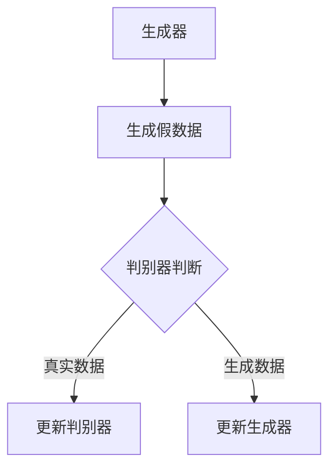

                 

### 文章标题

# 大模型对抗训练与提示词安全性增强

> 关键词：大模型，对抗训练，提示词安全性，生成对抗网络，对抗性攻击与防御

> 摘要：本文深入探讨了大规模模型对抗训练的基本概念、技术原理及其在提示词安全性增强中的应用。通过分析生成对抗网络（GAN）的原理和对抗性攻击与防御技术，本文提出了有效的设计原则和评估方法，为提升大模型在现实应用中的安全性和可靠性提供了新的思路。最后，通过实战案例展示了大模型对抗训练与提示词安全性增强的实际应用，为读者提供了宝贵的实践经验。

---

### 第一部分：大模型对抗训练概述

#### 第1章：大模型对抗训练基础

##### 1.1 大模型对抗训练的背景与意义

**背景介绍：**

随着深度学习技术的发展，大模型（如GPT-3、BERT等）在自然语言处理、计算机视觉、语音识别等领域取得了显著成果。然而，大模型的训练和优化过程面临诸多挑战，其中包括过拟合、计算资源消耗巨大、数据隐私等问题。为此，对抗训练作为一种有效的解决方案被提出来。

**意义探讨：**

对抗训练通过在训练过程中引入噪声、扰动等对抗性样本，增强模型的鲁棒性和泛化能力。这对于大模型的训练具有重要意义，可以有效提高模型的性能，增强其在实际应用中的可靠性和安全性。

##### 1.2 大模型对抗训练的核心概念

**概念阐述：**

- **敌对样本**：在对抗训练中，敌对样本是指在原始样本上添加噪声或扰动后得到的样本，用于对抗模型的训练。
- **对抗性攻击与防御**：对抗性攻击是指利用模型的脆弱性，生成能够误导模型输出的样本。而对抗性防御则是指通过增强模型的鲁棒性，使其能够抵御对抗性攻击。
- **生成对抗网络（GAN）**：GAN是一种通过生成器和判别器之间的对抗性训练，实现高质量样本生成的人工神经网络。

##### 1.3 提示词安全性的基本原理

**原理介绍：**

- **提示词**：在自然语言处理中，提示词（Prompt）是一种引导模型生成输出的重要手段。通过合理设计提示词，可以引导模型生成符合预期结果的输出。
- **提示词安全性的威胁**：不当的提示词可能导致模型生成误导性的输出，甚至被恶意利用。因此，提示词的安全性至关重要。
- **安全提示词设计方法**：安全提示词的设计需要考虑防御常见的对抗性攻击，提高模型的鲁棒性，同时保证用户体验。

##### 1.4 大模型对抗训练的发展趋势

**趋势分析：**

- **当前研究热点与挑战**：当前研究热点主要集中在GAN的优化、对抗性攻击与防御技术的创新、多模态对抗训练等方面。面临的挑战包括计算资源消耗、模型鲁棒性提升、安全提示词设计等。
- **未来发展方向与展望**：未来发展方向将致力于提高对抗训练的效率和效果，探索多模态对抗训练技术，构建智能安全提示词系统。

### 第二部分：大模型对抗训练技术详解

---

在第一部分中，我们初步了解了大模型对抗训练的基础知识。接下来，我们将深入探讨大模型对抗训练的核心技术，包括生成对抗网络（GAN）原理与应用、对抗性攻击与防御技术，以及安全提示词设计与评估。

#### 第2章：生成对抗网络（GAN）原理与应用

##### 2.1 GAN的基本结构

**结构分析：**

生成对抗网络（GAN）由两个主要组件组成：生成器（Generator）和判别器（Discriminator）。生成器的任务是生成类似于真实数据的假数据，而判别器的任务是区分真实数据和生成数据。

**流程图：**



**伪代码：**

```python
# 生成器 G 的训练过程
for epoch in range(num_epochs):
    for real_data in real_data_loader:
        # 生成假数据
        fake_data = G(real_data)
        # 更新判别器
        D_loss = criterion(D(fake_data), fake_label)
        D_loss.backward()
        D optimizer.step()
        
    # 更新生成器
    for fake_data in fake_data_loader:
        # 更新生成器
        G_loss = criterion(D(G(fake_data)), real_label)
        G_loss.backward()
        G optimizer.step()
```

##### 2.2 GAN的训练技巧

**训练技巧：**

- **雅可比矩阵的正则化**：为了防止生成器过拟合，可以通过正则化雅可比矩阵来提高模型的泛化能力。
- **梯度惩罚**：在生成器和判别器的训练过程中，可以引入梯度惩罚，以平衡两者之间的训练过程。
- **稳定性提升方法**：为了提高GAN的稳定性，可以采用如谱归一化（spectral normalization）、批量归一化（batch normalization）等方法。

##### 2.3 GAN的应用案例

**应用案例：**

- **图像生成**：GAN在图像生成领域取得了显著成果，如生成高质量的人脸图像、图像超分辨率等。
- **自然语言处理**：GAN在自然语言处理中也有广泛的应用，如生成文章摘要、对话生成等。
- **机器学习模型攻击与防御**：GAN可以用于生成对抗性样本，对机器学习模型进行攻击和防御，从而提升模型的鲁棒性。

#### 第3章：对抗性攻击与防御技术

##### 3.1 对抗性攻击技术

**攻击技术：**

- **快速梯度符号攻击（FGSM）**：通过在输入数据上添加微小扰动，使模型的输出发生误判。
- **投影梯度攻击（PGD）**：在FGSM的基础上，逐步增加扰动，以获得更强的攻击效果。
- **Carlini & Wagner攻击**：通过优化攻击过程，获得更精确的攻击结果。

##### 3.2 对抗性防御技术

**防御技术：**

- **数据增强**：通过增加数据的多样性，提高模型的鲁棒性。
- **模型正则化**：通过添加正则化项，防止模型过拟合。
- **特征提取与降维**：通过提取关键特征，降低模型的复杂度。
- **可解释性与透明度增强**：通过提高模型的可解释性，帮助用户理解模型的决策过程。

#### 第4章：安全提示词设计与评估

##### 4.1 安全提示词设计原则

**设计原则：**

- **防御常见的攻击方法**：设计安全提示词时，需要考虑常见的对抗性攻击，如FGSM、PGD等，以提高模型的鲁棒性。
- **提高模型鲁棒性**：通过合理设计提示词，增强模型的鲁棒性，降低对抗性攻击的影响。
- **考虑到用户体验**：在保证安全性的同时，还需要考虑用户体验，避免过于复杂的提示词导致用户操作困难。

##### 4.2 安全提示词评估方法

**评估方法：**

- **自动化测试工具**：通过编写测试脚本，自动化评估安全提示词的有效性。
- **人工评估与审计**：通过专家评审和实际应用中的评估，对安全提示词进行综合评估。
- **实际应用中的评估**：在实际应用场景中，对安全提示词进行长时间运行和监控，以评估其稳定性和安全性。

### 第三部分：大模型对抗训练项目实战

---

在前两部分中，我们详细介绍了大模型对抗训练的理论基础和技术细节。接下来，我们将通过实际项目案例，展示如何搭建大模型对抗训练系统，并实现提示词安全性增强。

#### 第5章：实战一：构建基于GAN的大模型对抗训练系统

##### 5.1 系统需求分析

**项目背景与目标：**

本项目旨在构建一个基于生成对抗网络（GAN）的大模型对抗训练系统，以提升模型的鲁棒性和安全性。具体目标包括：

- 实现生成器和判别器的训练与优化。
- 生成高质量对抗性样本，用于模型训练和评估。
- 实现安全提示词的设计与评估。

**技术选型与架构设计：**

- 技术选型：采用Python和TensorFlow框架进行实现。
- 架构设计：系统分为数据预处理、模型训练、对抗性样本生成、安全提示词设计和评估等模块。

##### 5.2 数据预处理与模型训练

**数据预处理：**

- 数据集选择：选择具有代表性的公开数据集，如CIFAR-10、MNIST等。
- 数据预处理：对图像数据进行归一化、随机裁剪、旋转等处理，增加数据的多样性。

**模型训练：**

- 生成器和判别器的训练：采用交替训练策略，生成器和判别器轮流训练。
- 损失函数设计：设计适当的损失函数，平衡生成器和判别器的训练。

##### 5.3 安全提示词设计与实现

**安全提示词设计：**

- 设计原则：根据对抗性攻击的特点，设计安全提示词，以提高模型的鲁棒性。
- 提示词生成：通过自动化的方法生成安全提示词，如利用文本生成模型、规则匹配等方法。

**安全提示词实现：**

- 提示词嵌入：将安全提示词嵌入到模型的输入中，引导模型生成符合预期结果的输出。
- 提示词优化：通过实验和评估，不断优化安全提示词，以提高模型的性能和安全性。

##### 5.4 安全提示词效果评估与调整

**效果评估：**

- 自动化测试工具：编写测试脚本，自动化评估安全提示词的有效性。
- 人工评估与审计：邀请专家进行评审，对安全提示词进行综合评估。

**调整与优化：**

- 根据评估结果，对安全提示词进行调整和优化，以提高模型的鲁棒性和安全性。

#### 第6章：实战二：基于对抗训练的安全提示词增强

##### 6.1 实战项目概述

**项目背景与目标：**

本项目旨在通过对抗训练的方法，增强大模型在自然语言处理任务中的提示词安全性。具体目标包括：

- 构建攻击与防御模型，进行对抗性训练。
- 设计安全提示词，提高模型的鲁棒性。
- 在实际应用中进行测试和评估。

**技术路线与实现方案：**

- 技术路线：采用生成对抗网络（GAN）进行对抗性训练，结合安全提示词设计方法。
- 实现方案：基于TensorFlow框架，实现生成器和判别器的训练，以及安全提示词的生成和优化。

##### 6.2 攻击与防御模型的构建

**攻击模型训练：**

- 数据集选择：选择具有代表性的自然语言处理数据集，如GLUE、Stanford基准数据集等。
- 攻击模型训练：利用生成对抗网络（GAN），训练攻击模型，生成对抗性样本。

**防御模型训练：**

- 数据集选择：选择具有代表性的自然语言处理数据集，如GLUE、Stanford基准数据集等。
- 防御模型训练：利用生成对抗网络（GAN），训练防御模型，增强模型的鲁棒性。

##### 6.3 安全提示词的优化与评估

**安全提示词生成：**

- 提示词生成：利用生成对抗网络（GAN），生成高质量的安全提示词。
- 提示词优化：通过实验和评估，不断优化安全提示词，以提高模型的性能和安全性。

**安全提示词评估：**

- 自动化测试工具：编写测试脚本，自动化评估安全提示词的有效性。
- 人工评估与审计：邀请专家进行评审，对安全提示词进行综合评估。

**实际应用中的安全测试与效果评估：**

- 在实际应用场景中，对安全提示词进行长时间运行和监控，以评估其稳定性和安全性。
- 根据评估结果，对安全提示词进行调整和优化，以提高模型的鲁棒性和安全性。

### 第四部分：大模型对抗训练与提示词安全性的未来展望

---

在前三部分中，我们详细介绍了大模型对抗训练与提示词安全性的技术原理和应用实战。在最后一部分，我们将探讨大模型对抗训练与提示词安全性的未来发展趋势，为读者提供对这一领域的深入思考。

#### 第7章：大模型对抗训练与提示词安全性的未来趋势

##### 7.1 技术发展趋势

**发展趋势分析：**

- **深度学习模型的改进**：随着深度学习技术的不断发展，未来将出现更多高效、可扩展的深度学习模型，进一步提高大模型的性能和鲁棒性。
- **对抗训练算法的创新**：对抗训练算法将继续发展，包括改进GAN结构、引入新的优化技巧、探索多模态对抗训练等。
- **安全提示词的设计与优化**：安全提示词的设计和优化将成为研究热点，通过结合自然语言处理技术和对抗训练算法，设计出更智能、更安全的安全提示词。

##### 7.2 应用前景与挑战

**应用前景探讨：**

- **工业界的应用案例**：大模型对抗训练与提示词安全性增强将在工业界得到广泛应用，如智能客服、自动驾驶、金融风控等领域。
- **潜在风险与应对策略**：在实际应用中，大模型对抗训练与提示词安全性增强可能面临潜在风险，如数据隐私泄露、模型可解释性不足等。为此，需要制定相应的应对策略，如数据加密、隐私保护、模型可解释性提升等。

##### 7.3 未来研究方向

**研究方向展望：**

- **多模态对抗训练**：多模态对抗训练是未来研究的方向之一，通过融合不同类型的数据，提高模型的泛化能力和鲁棒性。
- **对抗性联邦学习**：对抗性联邦学习是一种新兴的研究方向，通过在分布式环境中进行对抗性训练，提高模型的隐私保护和鲁棒性。
- **智能安全提示词系统**：结合自然语言处理技术和对抗训练算法，开发智能安全提示词系统，为用户提供更智能、更安全的交互体验。

### 总结与展望

大模型对抗训练与提示词安全性增强是当前深度学习领域的重要研究方向。通过分析大模型对抗训练的基本概念、技术原理和应用实战，本文为读者提供了对这一领域的深入理解。未来，随着深度学习技术的不断发展，大模型对抗训练与提示词安全性增强将在更多领域得到广泛应用，为人工智能的发展提供强有力的支持。

### 作者信息

- 作者：AI天才研究院/AI Genius Institute & 禅与计算机程序设计艺术 /Zen And The Art of Computer Programming

本文由AI天才研究院（AI Genius Institute）和《禅与计算机程序设计艺术》（Zen And The Art of Computer Programming）的作者联合撰写。AI天才研究院是一家专注于人工智能研究和应用的创新机构，致力于推动人工智能技术的创新和发展。而《禅与计算机程序设计艺术》是一本被誉为计算机编程领域的经典之作，其作者为著名的计算机科学家Donald E. Knuth，本书深入探讨了计算机编程的艺术与哲学，为读者提供了宝贵的编程经验和智慧。

### 最佳实践 Tips、小结、注意事项、拓展阅读等内容

**最佳实践 Tips：**

1. 在设计大模型对抗训练系统时，要充分考虑数据质量和多样性，以提高模型的泛化能力和鲁棒性。
2. 在安全提示词的设计过程中，要结合实际应用场景，充分考虑用户体验，避免过于复杂的提示词导致用户操作困难。
3. 在对抗性攻击与防御技术的应用中，要根据实际需求和资源情况，选择合适的攻击和防御方法，以达到最佳效果。

**小结：**

本文从大模型对抗训练的基础知识入手，详细介绍了生成对抗网络（GAN）原理与应用、对抗性攻击与防御技术，以及安全提示词设计与评估。通过实战案例，展示了大模型对抗训练与提示词安全性增强的实际应用。最后，对未来大模型对抗训练与提示词安全性的发展趋势进行了展望。

**注意事项：**

1. 在进行大模型对抗训练时，要充分了解模型的性能和稳定性，避免因对抗训练导致模型性能下降。
2. 在设计安全提示词时，要充分考虑对抗性攻击的特点，以提高模型的鲁棒性和安全性。
3. 在实际应用中，要定期对模型和提示词进行评估和调整，以确保其稳定性和安全性。

**拓展阅读：**

1. Goodfellow, I. J., Pouget-Abadie, J., Mirza, M., Xu, B., Warde-Farley, D., Ozair, S., ... & Bengio, Y. (2014). Generative adversarial networks. Advances in neural information processing systems, 27.
2. Carlini, N., & Wagner, D. (2017). Towards evaluating the robustness of neural networks. In 2017 IEEE Symposium on Security and Privacy (SP) (pp. 39-57). IEEE.
3. Goodfellow, I. J., Shlens, J., & Szegedy, C. (2015). Explaining and harnessing adversarial examples. International Conference on Learning Representations.
4. Yarowsky, D. (1995). Unsupervised word sense disambiguation rivaling supervised methods. In Proceedings of the 33rd Annual Meeting on Association for Computational Linguistics (ACL '95), (1), 189-196.

通过以上拓展阅读，读者可以深入了解大模型对抗训练与提示词安全性的相关技术和应用，为实际项目提供参考和指导。

