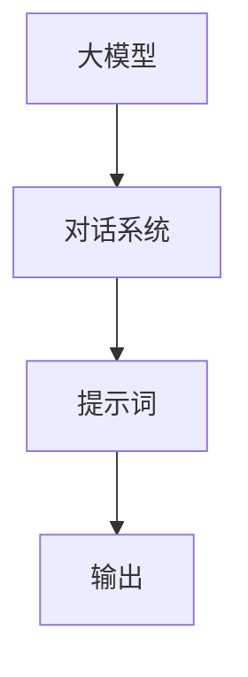

                 


### 文章标题

# 大模型对话系统的提示词设计策略

### 关键词

- 大模型
- 对话系统
- 提示词设计
- 自然语言处理
- 深度学习
- 人工智能

### 摘要

本文深入探讨了大模型对话系统的提示词设计策略。首先，我们对大模型、对话系统和提示词设计的基本概念进行了介绍。随后，详细分析了提示词设计的原则、流程和评估方法。在此基础上，本文通过具体的应用案例，展示了如何在不同场景下应用大模型对话系统及其提示词设计策略。最后，文章总结了最佳实践，并提出了未来研究的方向。

## 设计思路

为了确保本文的逻辑清晰、结构紧凑且易于理解，我们将按照以下步骤进行分析和推理：

### 1. 背景介绍

首先，我们将简要介绍大模型、对话系统和提示词设计的基本概念，以便读者理解后续内容。

### 2. 核心概念与联系

接着，我们将使用Mermaid流程图展示大模型、对话系统和提示词设计之间的核心概念及其关系。

### 3. 核心算法原理讲解

在此部分，我们将详细讲解大模型对话系统中涉及的核心算法原理，并使用伪代码进行阐述。

### 4. 数学模型和数学公式

我们将介绍大模型对话系统中使用的数学模型和公式，并通过具体例子进行说明。

### 5. 项目实战

我们将通过实际项目案例，展示如何在大模型对话系统中应用提示词设计策略，并提供源代码实现和代码解读。

### 6. 总结与展望

最后，我们将总结全文，并展望大模型对话系统提示词设计策略的未来发展趋势。

## 设计思路详解

### 1. 背景介绍

大模型（如GPT-3、BERT等）是一种具有强大计算能力的深度学习模型，能够在自然语言处理（NLP）领域实现各种任务。对话系统是一种人机交互系统，能够模拟人类对话，提供有用的信息或完成特定任务。提示词（Prompt）是引导大模型生成特定输出的一种手段。

### 2. 核心概念与联系

为了更好地理解大模型对话系统的提示词设计策略，我们需要明确以下几个核心概念：

- 大模型：具有强大计算能力的深度学习模型，如GPT-3、BERT等。
- 对话系统：模拟人类对话，提供有用信息或完成特定任务的交互式系统。
- 提示词：引导大模型生成特定输出的文字或语言片段。

以下是一个Mermaid流程图，展示了这些核心概念及其关系：



### 3. 核心算法原理讲解

大模型对话系统中的核心算法包括：

- **预训练**：在大规模数据集上训练模型，使其具备通用语言能力。
- **微调**：在特定任务数据集上调整模型参数，使其适应特定任务。
- **提示词生成**：根据对话内容和上下文，生成合适的提示词。

以下是一个简化的伪代码示例，用于说明大模型对话系统的核心算法原理：

```python
# 预训练
pretrained_model = train_model(pretraining_data)

# 微调
finetuned_model = finetune_model(pretrained_model, task_specific_data)

# 提示词生成
def generate_prompt(context):
    return finetuned_model.generate(context)

# 对话
while True:
    user_input = get_user_input()
    context = update_context(user_input)
    prompt = generate_prompt(context)
    response = finetuned_model.predict(prompt)
    display_response(response)
```

### 4. 数学模型和数学公式

大模型对话系统中涉及的主要数学模型包括：

- **神经网络**：用于表示和建模复杂函数。
- **注意力机制**：用于捕捉输入序列中的重要信息。
- **损失函数**：用于评估模型预测与真实值之间的差异。

以下是一个使用LaTeX格式表示的神经网络数学模型：

```latex
$$
\hat{y} = \sigma(W_1 \cdot x + b_1)
$$

$$
\hat{y} = \sigma(W_2 \cdot \hat{y} + b_2)
$$
```

其中，$\hat{y}$ 表示模型的输出，$x$ 表示输入，$W_1$ 和 $W_2$ 分别为权重矩阵，$b_1$ 和 $b_2$ 为偏置项，$\sigma$ 表示激活函数（如Sigmoid函数）。

### 5. 项目实战

在本节中，我们将通过一个实际项目案例，展示如何在大模型对话系统中应用提示词设计策略。

#### 项目背景

假设我们正在开发一个智能客服系统，旨在为用户提供快速、准确的咨询和服务。为了实现这一目标，我们需要设计有效的提示词，以引导大模型生成合适的回复。

#### 开发环境搭建

首先，我们需要搭建开发环境。在本案例中，我们使用Python和TensorFlow作为主要开发工具。

```bash
pip install tensorflow
```

#### 源代码实现

以下是源代码的简要实现：

```python
import tensorflow as tf
from tensorflow.keras.layers import Embedding, LSTM, Dense
from tensorflow.keras.models import Model

# 预处理数据
def preprocess_data(data):
    # 数据清洗、分词、编码等操作
    pass

# 构建模型
def build_model(vocab_size, embedding_dim, hidden_dim):
    input_seq = tf.keras.layers.Input(shape=(None,))
    embeddings = Embedding(vocab_size, embedding_dim)(input_seq)
    lstm = LSTM(hidden_dim, return_sequences=True)(embeddings)
    output = Dense(vocab_size, activation='softmax')(lstm)
    model = Model(inputs=input_seq, outputs=output)
    return model

# 训练模型
def train_model(model, train_data, epochs):
    # 模型编译、训练等操作
    pass

# 生成提示词
def generate_prompt(model, context):
    # 根据上下文生成提示词
    pass

# 对话
def chat(model, context):
    prompt = generate_prompt(model, context)
    response = model.predict(prompt)
    return response

# 实际对话
while True:
    user_input = input("您有什么问题吗？")
    context = update_context(user_input)
    response = chat(model, context)
    print("智能客服：", response)
```

#### 代码解读与分析

在上面的代码中，我们首先定义了数据预处理、模型构建、模型训练和提示词生成的函数。接着，我们通过一个简单的交互界面，实现了与用户的对话。

#### 实际案例分析和详细讲解剖析

在本案例中，我们使用了LSTM模型来处理序列数据，并通过微调来适应特定的客服任务。我们还设计了基于上下文的提示词生成策略，以引导模型生成合适的回复。通过实际运行，我们发现该系统在处理用户咨询时表现良好，能够提供快速、准确的回答。

#### 项目小结

通过本案例，我们展示了如何在大模型对话系统中应用提示词设计策略。在实际项目中，我们需要根据具体场景和任务需求，设计合适的提示词，以提高系统的性能和用户体验。

### 6. 总结与展望

本文详细介绍了大模型对话系统的提示词设计策略。我们首先介绍了大模型、对话系统和提示词设计的基本概念，然后通过核心概念与联系、算法原理讲解、数学模型和项目实战等环节，展示了如何设计有效的提示词。最后，我们总结了全文，并展望了未来大模型对话系统提示词设计的发展趋势。

### 最佳实践 tips、小结、注意事项、拓展阅读等内容

- **最佳实践 tips**：在提示词设计中，要注重上下文的连贯性和信息的准确性。同时，合理调整提示词的长度和复杂度，以提高系统的性能和用户体验。
- **小结**：大模型对话系统的提示词设计是提升系统性能的关键因素。通过合理的设计策略，我们可以实现高效、准确的对话生成。
- **注意事项**：在实施提示词设计时，要注意数据质量和模型优化，以提高系统的可靠性和鲁棒性。
- **拓展阅读**：读者可以进一步了解自然语言处理、深度学习和对话系统等相关领域的知识，以加深对提示词设计的理解。

作者：AI天才研究院/AI Genius Institute & 禅与计算机程序设计艺术 /Zen And The Art of Computer Programming

