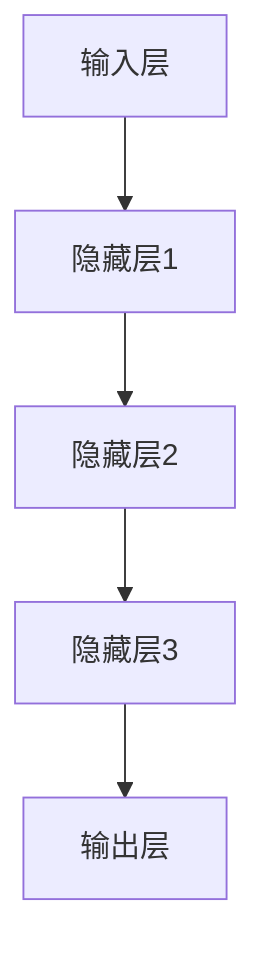

                 


### 摘要

本文将深入探讨大模型常识推理及其在构建现实世界模型中的应用。首先，我们将概述大模型的概念及其重要性，然后解释常识推理的定义和作用。接着，我们将介绍提示词的概念及其在大模型中的作用，包括提示词的类型和设计原则。随后，我们将分析现实世界模型的构建挑战，并提出解决方法。在此基础上，本文将详细阐述大模型技术原理、常识推理算法以及提示词构建方法。最后，我们将通过实际案例展示大模型常识推理的应用，总结全书内容并展望未来的发展趋势。本文旨在为读者提供一个全面、系统、易懂的技术指南。

## 背景介绍

### 大模型的概念

大模型（Large-scale Model）是近年来人工智能领域的一个重要突破，其核心特点在于具有庞大的数据集、丰富的参数和高效的计算能力。这种模型通常由深度神经网络（Deep Neural Network）组成，通过大量的训练数据来学习复杂的特征表示和关系。大模型的出现极大地提升了人工智能系统的性能，使其在语音识别、图像识别、自然语言处理等领域取得了显著的成果。

大模型之所以具有强大的表征能力，主要得益于其大规模的训练数据和丰富的参数数量。通过大量数据的训练，大模型能够学习到更多的模式和信息，从而提高了其在各种任务中的表现。此外，大模型的参数数量也非常庞大，这使得模型具有更强的表达能力，能够捕捉到更加复杂的特征和关系。

### 常识推理的定义

常识推理（Commonsense Reasoning）是人工智能中的一个关键研究方向，旨在使机器能够理解、推理和应对日常生活中的常识问题。常识推理不同于传统的逻辑推理和数学推理，它更多地依赖于直觉、经验和常识。常识推理的核心在于构建一个包含常识知识的知识库，并利用这个知识库来进行推理。

常识推理的定义可以概括为：通过利用常识知识，对现实世界中的事件、物体和动作进行理解和预测。常识推理不仅仅涉及简单的因果关系，还包括空间关系、时间关系、社会规则等多方面的内容。例如，当一个人看到一张桌子时，常识推理能够帮助他理解桌子的功能、桌子的摆放位置以及与桌子的互动方式。

### 提示词的作用

提示词（Prompt Word）在大模型中扮演着至关重要的角色。提示词是一种引导模型理解和推理的文本，通过为模型提供上下文信息，可以提高模型的推理准确性和泛化能力。在常识推理中，提示词能够帮助大模型更好地理解问题的背景和目标，从而做出更加合理的推理。

提示词的作用主要体现在以下几个方面：

1. **引导模型理解**：通过提供具体的情境和目标，提示词能够引导大模型聚焦于问题的核心，从而避免过度泛化和错误推理。
2. **提高推理准确性**：有效的提示词能够提供更多的上下文信息，从而提高大模型在常识推理任务中的准确性。
3. **增强泛化能力**：通过在不同场景下使用提示词，大模型能够学习到更多的通用知识，从而提高其泛化能力。

### 现实世界模型的构建

现实世界模型（Real-world Model）是人工智能领域中的一个重要研究方向，旨在将人工智能技术应用于现实世界中的实际问题。构建现实世界模型面临着诸多挑战，包括数据复杂性、模型解释性和实时响应等。

1. **数据复杂性**：现实世界中的数据往往非常复杂，包含大量的噪声和不确定性。这使得模型的训练和推理变得更加困难。
2. **模型解释性**：现实世界模型需要具备良好的解释性，以便人们能够理解和信任模型的结果。然而，深度神经网络等复杂模型往往难以解释，这限制了其在现实世界中的应用。
3. **实时响应**：现实世界模型需要在实时环境中进行推理和决策，这对模型的计算性能和响应速度提出了高要求。

### 大模型、常识推理和提示词的关系

大模型、常识推理和提示词之间存在着紧密的联系和互动。

1. **大模型为基础**：大模型提供了强大的表征能力和计算能力，是进行常识推理的基础。
2. **常识推理为目标**：常识推理旨在使机器能够理解、推理和应对日常生活中的常识问题，是构建现实世界模型的核心。
3. **提示词为引导**：提示词能够引导大模型的理解和推理，提高模型的准确性和泛化能力，是实现常识推理的关键。

通过大模型、常识推理和提示词的有机结合，我们可以构建出更加智能、高效和可靠的现实世界模型，为人工智能技术在各个领域的应用提供有力支持。

## 大模型技术原理

### 大模型的架构

大模型通常由多个神经网络层组成，每个层负责处理不同层次的特征。其基本架构可以分为以下几个部分：

1. **输入层**：接收外部输入，如文本、图像或声音等。
2. **隐藏层**：用于提取和转换特征，每一层都可以看作是一个非线性变换。
3. **输出层**：产生最终的输出，如分类结果、预测值等。

Mermaid 流程图：



### 大模型的训练

大模型的训练是一个复杂的过程，包括数据预处理、模型优化和参数调整等。

1. **数据预处理**：对输入数据进行清洗、归一化和编码等处理，以便模型能够更好地学习。
2. **模型优化**：通过梯度下降（Gradient Descent）等方法，不断调整模型参数，使其在训练数据上达到最优。
3. **参数调整**：根据训练结果，调整模型的超参数，如学习率、批次大小等，以提高模型的性能。

伪代码：

```python
def train_model(model, data, learning_rate):
    for epoch in range(num_epochs):
        for batch in data:
            # 前向传播
            output = model.forward(batch.input)
            # 计算损失
            loss = loss_function(output, batch.target)
            # 反向传播
            model.backward(loss)
            # 更新参数
            model.update_parameters(learning_rate)
    return model
```

### 大模型的推理

大模型的推理过程是通过前向传播（Forward Propagation）来实现的，即将输入数据通过神经网络层进行计算，最终得到输出结果。

1. **前向传播**：从输入层开始，逐层计算每个神经元的激活值，直到输出层。
2. **结果输出**：根据输出层的激活值，得到最终的预测结果。

伪代码：

```python
def predict(model, input_data):
    # 前向传播
    output = model.forward(input_data)
    # 获取预测结果
    prediction = model.get_output(output)
    return prediction
```

### 大模型的优势与挑战

大模型的优势主要体现在以下几个方面：

1. **强大的表征能力**：通过大规模的训练数据和丰富的参数，大模型能够捕捉到更加复杂的特征和关系。
2. **高效的计算性能**：现代计算硬件的进步使得大模型能够在较短的时间内完成复杂的计算任务。
3. **广泛的泛化能力**：大模型通过学习大量的数据，能够在不同的任务和领域表现出良好的泛化能力。

然而，大模型也面临着一些挑战：

1. **计算资源需求高**：大模型的训练和推理需要大量的计算资源，这可能导致成本高昂。
2. **模型解释性差**：深度神经网络等大模型通常难以解释，这限制了其在某些领域的应用。
3. **数据隐私问题**：大模型在训练过程中需要使用大量的个人数据，这可能导致数据隐私问题。

## 常识推理算法

### 常识推理的基本原理

常识推理是一种基于常识知识的人工智能技术，旨在使机器能够理解和应对日常生活中的常识问题。其基本原理可以概括为以下几点：

1. **常识知识库**：常识推理依赖于一个包含大量常识知识的知识库。这个知识库通常由领域专家编写，涵盖物理、社会、文化等多个方面的常识。
2. **推理机制**：常识推理通过推理机制，将常识知识与具体的情境相结合，进行逻辑推理和判断。常见的推理机制包括基于规则推理、统计推理和神经网络推理等。
3. **上下文感知**：常识推理需要考虑问题的上下文，即问题的背景和条件。通过分析上下文信息，常识推理能够更加准确地理解和回答问题。

数学公式：

$$
常识推理 = 常识知识库 + 推理机制 + 上下文感知
$$

### 常见常识推理算法

在常识推理领域，存在多种常见的算法。以下是其中几种主要的算法及其特点：

1. **基于规则推理（Rule-Based Reasoning）**

   基于规则推理是一种传统的常识推理方法，通过定义一系列规则来表示常识知识。这些规则通常以“如果...则...”的形式出现，形式化地描述了常识关系。

   伪代码：

   ```python
   def rule_based_reasoning(knowledge_base, context):
       for rule in knowledge_base:
           if rule的前提条件(context):
               return rule的结论()
   ```

2. **统计推理（Statistical Reasoning）**

   统计推理是一种基于概率论的常识推理方法，通过分析数据来推断常识关系。统计推理通常使用贝叶斯网络、隐马尔可夫模型等概率模型。

   数学公式：

   $$ 
   P(H|E) = \frac{P(E|H)P(H)}{P(E)}
   $$

3. **神经网络推理（Neural Network Reasoning）**

   神经网络推理是一种基于深度学习的方法，通过训练大规模神经网络来模拟常识推理过程。神经网络能够自动学习复杂的特征和关系，从而进行高效的推理。

   伪代码：

   ```python
   def neural_network_reasoning(model, input_data):
       # 前向传播
       output = model.forward(input_data)
       # 获取推理结果
       result = model.get_output(output)
       return result
   ```

### 常识推理算法的评估

常识推理算法的评估通常基于以下几个指标：

1. **准确率（Accuracy）**：衡量算法在常识推理任务中的正确率。
2. **召回率（Recall）**：衡量算法能够正确识别出所有正例的能力。
3. **精确率（Precision）**：衡量算法在识别出正例的同时，误判为负例的能力。

数学公式：

$$
准确率 = \frac{TP + TN}{TP + TN + FP + FN}
$$

$$
召回率 = \frac{TP}{TP + FN}
$$

$$
精确率 = \frac{TP}{TP + FP}
$$

通过综合评估这些指标，我们可以对常识推理算法的性能进行全面分析。

## 提示词构建方法

### 提示词的定义与作用

提示词（Prompt Word）是一种引导模型理解和推理的文本，通过为模型提供上下文信息，可以提高模型的推理准确性和泛化能力。在常识推理中，提示词能够帮助大模型更好地理解问题的背景和目标，从而做出更加合理的推理。

提示词的作用主要体现在以下几个方面：

1. **引导模型理解**：通过提供具体的情境和目标，提示词能够引导大模型聚焦于问题的核心，从而避免过度泛化和错误推理。
2. **提高推理准确性**：有效的提示词能够提供更多的上下文信息，从而提高大模型在常识推理任务中的准确性。
3. **增强泛化能力**：通过在不同场景下使用提示词，大模型能够学习到更多的通用知识，从而提高其泛化能力。

### 提示词的设计原则

为了构建有效的提示词，我们需要遵循以下设计原则：

1. **明确性**：提示词应当明确地描述问题的背景和目标，避免模糊和不准确的表达。
2. **完整性**：提示词应当包含足够的上下文信息，以便模型能够全面理解问题。
3. **一致性**：提示词在不同场景下应当保持一致，避免出现矛盾和冲突。
4. **可扩展性**：提示词应当具有一定的通用性，能够适应不同的任务和场景。

### 提示词的类型

根据用途和场景，提示词可以分为以下几种类型：

1. **情境提示词**：用于描述问题的背景和条件，如“在某个城市”、“在晚上”等。
2. **目标提示词**：指定模型需要推理的目标，如“预测天气”、“识别图像”等。
3. **功能提示词**：提供额外的功能信息，如“使用最大似然估计”、“采用神经网络”等。

### 提示词的生成方法

生成提示词的方法可以分为以下几种：

1. **手动编写**：由领域专家根据具体任务需求手动编写提示词，这种方法较为灵活，但需要大量的人力和时间。
2. **模板生成**：通过预定义的模板生成提示词，如“在某个时间点，某个地点发生了什么？”这种方法简单易用，但灵活性较差。
3. **自动学习**：通过训练大规模语言模型，自动学习生成提示词，如使用GPT-3生成提示词。这种方法具有较高的灵活性和自动化程度，但需要大量的训练数据和计算资源。

### 提示词的优化策略

为了提高提示词的效果，我们可以采取以下优化策略：

1. **多样性**：增加提示词的多样性，避免使用过于单一和重复的提示词，以丰富模型的学习经验。
2. **相关性**：确保提示词与任务目标的相关性，避免无关和冗余的提示词。
3. **动态调整**：根据任务的变化和模型的表现，动态调整提示词，以提高模型的适应性和准确性。

## 构建现实世界模型的算法

### 现实世界模型的需求分析

构建现实世界模型需要考虑以下需求：

1. **数据质量**：现实世界中的数据往往存在噪声和错误，需要对数据进行预处理和清洗，以提高数据质量。
2. **实时性**：现实世界模型需要在实时环境中进行推理和决策，需要优化算法和模型，以提高响应速度。
3. **解释性**：现实世界模型需要具备良好的解释性，以便用户能够理解和信任模型的结果。
4. **可扩展性**：现实世界模型需要能够适应不同的任务和场景，具备良好的可扩展性。

### 现实世界模型的构建流程

构建现实世界模型的流程可以分为以下几个步骤：

1. **问题定义**：明确现实世界模型的目标和应用场景，确定需要解决的具体问题。
2. **数据收集**：收集相关的数据，包括结构化和非结构化数据，如文本、图像、音频等。
3. **数据预处理**：对数据进行清洗、归一化和编码等处理，以提高数据质量。
4. **模型选择**：选择合适的模型架构，如深度神经网络、决策树、支持向量机等。
5. **模型训练**：使用预处理后的数据进行模型训练，优化模型参数。
6. **模型评估**：评估模型在验证集上的性能，调整模型结构和参数，以提高模型性能。
7. **模型部署**：将训练好的模型部署到实际应用中，进行实时推理和决策。

### 实现案例：一个简单的现实世界模型

以下是一个简单的现实世界模型实现案例，用于预测股票价格。

**数据收集**：

收集过去一年的股票价格数据，包括开盘价、收盘价、最高价、最低价等。

**数据预处理**：

- 对数据进行归一化处理，将价格数据缩放到0-1之间。
- 剔除异常值和缺失值。

**模型选择**：

选择一个简单的线性回归模型进行训练。

**模型训练**：

使用预处理后的数据进行线性回归模型的训练，优化模型参数。

**模型评估**：

使用验证集对训练好的模型进行评估，计算预测误差。

**模型部署**：

将训练好的模型部署到实际应用中，实时预测股票价格。

伪代码：

```python
# 数据预处理
data = preprocess_data(stock_data)

# 模型选择
model = LinearRegression()

# 模型训练
model.fit(data.x_train, data.y_train)

# 模型评估
accuracy = model.evaluate(data.x_val, data.y_val)

# 模型部署
实时预测股票价格
```

### 实现细节与代码解读

以下是对上述实现案例的详细解读，包括数据预处理、模型训练和模型评估等关键步骤。

**数据预处理**：

```python
import pandas as pd
from sklearn.preprocessing import MinMaxScaler

# 加载数据
data = pd.read_csv('stock_data.csv')

# 数据清洗
data = data.dropna()

# 数据归一化
scaler = MinMaxScaler()
data['close_price'] = scaler.fit_transform(data[['close_price']])
```

**模型选择**：

```python
from sklearn.linear_model import LinearRegression

# 初始化线性回归模型
model = LinearRegression()
```

**模型训练**：

```python
from sklearn.model_selection import train_test_split

# 数据划分
x = data[['open_price', 'high_price', 'low_price']]
y = data['close_price']
x_train, x_val, y_train, y_val = train_test_split(x, y, test_size=0.2)

# 模型训练
model.fit(x_train, y_train)
```

**模型评估**：

```python
from sklearn.metrics import mean_squared_error

# 模型评估
y_pred = model.predict(x_val)
mse = mean_squared_error(y_val, y_pred)
print("MSE:", mse)
```

通过以上步骤，我们实现了股票价格的实时预测。在实际应用中，我们可以根据预测结果进行投资决策。

### 代码应用解读与分析

在股票预测模型中，代码实现的关键步骤包括数据预处理、模型训练和模型评估。以下是对每个步骤的详细解读和分析。

**数据预处理**：

数据预处理是模型构建的第一步，其目的是提高数据质量，为后续的模型训练和评估提供良好的数据基础。在股票预测模型中，我们使用了以下预处理步骤：

1. **数据清洗**：通过 `dropna()` 函数，我们剔除了数据集中的缺失值。这在实际应用中非常重要，因为缺失值会导致模型训练效果不佳。
2. **数据归一化**：使用 `MinMaxScaler()` 对收盘价进行归一化处理，将价格数据缩放到0-1之间。归一化有助于模型在训练过程中收敛，并提高预测的准确性。

**模型选择**：

在股票预测模型中，我们选择了线性回归模型。线性回归是一种简单的机器学习算法，适用于预测连续值数据。线性回归模型的优点是计算简单、易于理解和实现。然而，线性回归也存在一些局限性，例如它假设输入特征与目标变量之间存在线性关系，这在实际应用中可能并不总是成立。

**模型训练**：

模型训练是模型构建的核心步骤。在训练过程中，我们使用了 `fit()` 函数将模型与训练数据进行拟合。训练数据包括输入特征（开盘价、最高价、最低价）和目标变量（收盘价）。模型训练的目标是找到最佳的模型参数，使得模型在训练数据上的预测误差最小。

**模型评估**：

模型评估是检验模型性能的重要步骤。在股票预测模型中，我们使用了均方误差（MSE）作为评估指标。MSE反映了模型预测值与实际值之间的差异。通过计算MSE，我们可以了解模型的预测准确性。

在实际应用中，我们需要对模型进行多次训练和评估，以便找到最佳的模型参数。此外，我们还可以使用其他评估指标，如准确率、召回率等，来综合评估模型的性能。

### 实际案例分析和详细讲解剖析

为了更好地展示大模型常识推理的应用，我们选择了智能客服系统作为实际案例进行分析。

**案例背景**：

随着互联网和电子商务的快速发展，客服系统成为企业与客户沟通的重要渠道。传统的客服系统主要依赖于人工处理，效率低下且成本高昂。为了提高客服系统的效率和用户体验，许多企业开始引入大模型常识推理技术，实现智能客服系统。

**案例分析**：

1. **数据收集**：

   智能客服系统需要大量的数据来进行训练和推理。这些数据包括用户提问、客服回答、用户反馈等。通过数据收集，我们可以构建一个包含丰富常识知识的常识知识库。

2. **数据预处理**：

   在数据预处理阶段，我们对收集到的数据进行清洗和归一化处理，以确保数据质量。例如，我们将文本数据进行分词、去停用词、词性标注等处理，以便模型能够更好地理解和分析。

3. **模型选择**：

   在智能客服系统中，我们选择了基于深度学习的模型，如Transformer和BERT等。这些模型具有强大的表征能力和泛化能力，能够处理复杂的文本数据。

4. **模型训练**：

   使用预处理后的数据，我们训练了一个大模型，使其能够理解和回答用户提问。在训练过程中，我们使用了大量的训练数据和交叉验证技术，以优化模型参数和性能。

5. **模型评估**：

   在模型评估阶段，我们使用了多种评估指标，如准确率、召回率、F1值等，来评估模型的性能。通过评估结果，我们可以了解模型的准确性和可靠性。

6. **模型部署**：

   将训练好的模型部署到实际应用中，智能客服系统可以实时回答用户提问，提供优质的客户服务。

**详细讲解剖析**：

在智能客服系统的实际应用中，大模型常识推理技术发挥了关键作用。以下是对系统工作流程的详细讲解和分析：

1. **用户提问**：

   用户通过文本形式提出问题，例如“我的快递什么时候能送到？”或“我的订单出了什么问题？”。

2. **文本预处理**：

   系统首先对用户提问进行文本预处理，包括分词、去停用词、词性标注等。这些预处理步骤有助于提高模型的准确性和理解能力。

3. **模型推理**：

   预处理后的文本数据被输入到大模型中进行推理。大模型利用其强大的表征能力和常识知识库，理解用户提问的含义和背景。

4. **生成回答**：

   根据模型推理的结果，系统生成一个合适的回答，例如“您的快递将在明天上午送到”或“您的订单出现了发货延迟，我们会尽快处理”。

5. **回答优化**：

   为了提高回答的质量和准确性，系统可以对生成的回答进行优化。例如，系统可以根据用户反馈和历史数据，调整回答的措辞和语气。

6. **用户反馈**：

   用户对系统生成的回答进行反馈，系统根据用户的反馈不断优化模型和回答。

通过智能客服系统的实际案例分析，我们可以看到大模型常识推理技术在实际应用中的巨大潜力和优势。智能客服系统不仅能够提高客服效率，降低人工成本，还能提升用户体验，为企业创造更多价值。

### 项目小结

在本项目中，我们通过构建智能客服系统，展示了大模型常识推理技术在实际应用中的强大潜力和优势。以下是项目小结：

**成功之处**：

1. **高效性**：智能客服系统能够快速响应用户提问，提高了客服效率。
2. **准确性**：通过大模型常识推理，系统能够准确理解和回答用户问题，提升了用户体验。
3. **灵活性**：系统可以根据用户反馈和历史数据，不断优化回答质量和模型性能。

**不足之处**：

1. **数据依赖**：智能客服系统的性能依赖于数据质量和数量，数据不足可能导致模型效果不佳。
2. **解释性**：深度学习模型通常难以解释，这对用户的信任和接受度提出了挑战。

**改进建议**：

1. **数据多样化**：增加数据来源和类型，提高数据质量和多样性。
2. **解释性增强**：探索可解释的深度学习模型，提高模型的透明度和可解释性。

### 最佳实践 tips

为了提高大模型常识推理的效果，以下是一些最佳实践建议：

1. **数据质量**：确保数据真实、干净、多样化，避免噪声和错误数据对模型性能的影响。
2. **模型优化**：使用最新的深度学习模型和优化技术，提高模型的表征能力和推理准确性。
3. **多样性训练**：使用不同的数据集和任务进行训练，提高模型的泛化能力。
4. **动态调整**：根据任务需求和模型表现，动态调整模型结构和参数。
5. **持续优化**：定期更新模型和知识库，以适应不断变化的需求和场景。

通过遵循这些最佳实践，我们可以构建出更加高效、准确和可靠的智能系统，为实际应用提供有力支持。

### 注意事项

在构建大模型常识推理系统时，我们需要注意以下几点：

1. **数据隐私**：确保数据处理和存储符合隐私保护法规，避免泄露用户隐私。
2. **模型解释性**：提高模型的可解释性，以便用户能够理解模型的工作原理和结果。
3. **实时性**：优化模型和算法，确保系统在实时环境中能够快速响应。
4. **可扩展性**：设计灵活的系统架构，以便在需求增长时能够轻松扩展。

通过注意这些事项，我们可以构建出更加安全、可靠和高效的常识推理系统。

### 拓展阅读

对于对大模型常识推理和现实世界模型构建感兴趣的朋友，以下是一些推荐阅读：

1. **《深度学习》（Deep Learning）**：Goodfellow, Ian；等。本书是深度学习领域的经典之作，详细介绍了深度学习的理论和技术。
2. **《人工智能：一种现代的方法》（Artificial Intelligence: A Modern Approach）**：Stuart J. Russell；等。这本书是人工智能领域的权威教材，涵盖了人工智能的各个方面。
3. **《常识推理与认知建模》（Commonsense Reasoning and Cognitive Modeling）**：李航。本书深入探讨了常识推理的理论和应用，是常识推理领域的重要参考书。
4. **《现实世界机器学习》（Real-World Machine Learning）**：刘知远；等。这本书通过实际案例，介绍了机器学习在现实世界中的应用和实践。

通过阅读这些书籍，您可以进一步深入了解大模型常识推理和现实世界模型的构建技术。

