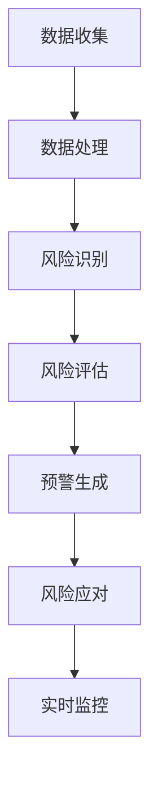
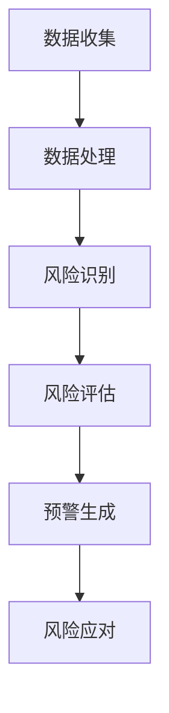

                 


## 文章标题

《大模型应用开发中的需求风险预警系统》

## 文章关键词

大模型、需求风险、预警系统、应用开发、风险预警、系统设计

## 文章摘要

本文旨在探讨大模型应用开发中的需求风险预警系统的构建和应用。首先，我们将介绍大模型应用开发中的背景和需求，然后深入剖析需求风险预警系统的基本原理和架构。接着，我们将详细讲解实现需求风险预警系统的核心算法原理，包括伪代码和数学模型的阐述。此外，我们将通过实际应用案例展示如何在实际项目中应用需求风险预警系统。最后，我们将讨论系统设计与开发实践，提供详细的开发环境搭建、源代码实现和代码解读。通过本文的阅读，读者将能够全面了解需求风险预警系统的原理和实践，为未来的大模型应用开发提供有力支持。

## 引言

### 1.1 背景介绍

随着人工智能技术的快速发展，大模型（如深度学习模型、生成对抗网络等）在各个领域得到了广泛应用。大模型的应用不仅提高了数据处理和分析的效率，也推动了新技术的发展和创新。然而，大模型应用开发过程中面临着诸多挑战，尤其是需求风险的管理。需求风险是指在软件开发过程中，由于需求的不确定性、变更或者与实际业务需求不一致等因素导致的潜在问题和风险。

需求风险主要包括以下几个方面：

1. **需求变更**：在软件开发过程中，客户的需求可能会发生变更，这可能会导致项目进度延误、资源浪费等问题。
2. **需求不明确**：需求定义不清晰或者不完整，可能导致开发团队无法准确理解客户需求，从而影响软件质量和项目进度。
3. **需求冲突**：不同模块或功能之间可能存在需求冲突，这会影响到系统的整体性能和用户体验。
4. **需求超范围**：部分需求可能超出项目范围，导致项目无法按时完成或者超出预算。

### 1.2 需求风险预警系统的重要性

需求风险预警系统是大模型应用开发中的一项重要技术，它通过对需求风险进行提前预警和监控，帮助开发团队及时识别和应对潜在的风险。需求风险预警系统的重要性主要体现在以下几个方面：

1. **提升开发效率**：通过提前识别需求风险，开发团队能够更有效地分配资源，避免因需求变更导致的进度延误和资源浪费。
2. **优化项目资源分配**：需求风险预警系统可以帮助项目管理者更准确地预测项目进度和资源需求，从而优化项目资源的分配，提高项目成功率。
3. **预防项目风险**：通过实时监控和预警，需求风险预警系统能够及时发现潜在的风险，并采取相应的措施进行预防和控制，减少项目风险的发生。

### 1.3 书籍结构概述

本书将分为以下几个部分：

- **引言**：介绍大模型应用开发中的需求风险预警系统的背景和重要性。
- **需求风险预警系统原理**：详细讲解需求风险预警系统的基本原理和架构。
- **技术细节**：深入探讨实现需求风险预警系统的技术细节，包括核心算法和数学模型。
- **实际应用案例**：分析几个具体的应用案例，展示如何在实际项目中应用需求风险预警系统。
- **系统设计与开发实践**：介绍系统设计与开发过程中的关键点，包括开发环境搭建、源代码实现和代码解读。
- **未来展望与趋势**：讨论需求风险预警系统的未来发展方向和趋势。

通过本书的阅读，读者将能够全面了解需求风险预警系统的原理和实践，为未来的大模型应用开发提供有力支持。

## 需求风险预警系统原理

### 2.1 系统基本原理

需求风险预警系统是一种通过分析和处理需求数据，对潜在的风险进行识别、评估和预警的系统。其基本原理主要包括以下几个方面：

1. **需求数据收集与处理**：需求风险预警系统首先需要收集与需求相关的数据，包括用户需求、需求变更记录、项目进度数据等。这些数据经过预处理后，用于后续的分析和预警。
2. **需求风险识别**：通过分析处理后的需求数据，系统可以识别出潜在的需求风险，如需求变更频繁、需求定义不明确等。这一过程通常采用数据挖掘和机器学习算法实现。
3. **风险评估与预警**：系统对识别出的需求风险进行评估，根据风险的影响程度和发生概率，生成风险预警信息。预警信息可以通过多种方式呈现，如警报、邮件通知、报表等。
4. **风险应对与监控**：开发团队根据预警信息采取相应的应对措施，并对风险进行实时监控，以确保项目顺利进行。

### 2.2 系统架构

需求风险预警系统的架构可以分为以下几个模块：

1. **数据收集模块**：负责收集与需求相关的数据，包括用户需求、需求变更记录、项目进度数据等。
2. **数据处理模块**：对收集到的数据进行预处理，如数据清洗、格式转换等，以便后续分析。
3. **风险识别模块**：通过数据挖掘和机器学习算法，分析处理后的数据，识别出潜在的需求风险。
4. **风险评估模块**：对识别出的需求风险进行评估，确定风险的影响程度和发生概率。
5. **预警模块**：生成风险预警信息，并通过多种方式呈现给开发团队。
6. **风险应对模块**：根据预警信息，开发团队采取相应的应对措施，并对风险进行实时监控。

以下是需求风险预警系统的Mermaid流程图展示：



### 2.3 核心概念与联系

在需求风险预警系统中，核心概念包括需求数据、风险识别、风险评估、预警生成和风险应对。这些概念之间的联系如下：

1. **需求数据**：是需求风险预警系统的输入，包括用户需求、需求变更记录、项目进度数据等。需求数据的准确性和完整性直接影响风险识别和评估的效果。
2. **风险识别**：通过对需求数据的分析，识别出潜在的需求风险。风险识别是需求风险预警系统的核心功能，其准确性决定了系统的预警能力。
3. **风险评估**：对识别出的需求风险进行评估，确定风险的影响程度和发生概率。风险评估的结果用于生成风险预警信息，为开发团队提供决策依据。
4. **预警生成**：根据风险评估的结果，生成风险预警信息，并通过多种方式呈现给开发团队。预警生成是需求风险预警系统的关键环节，其目标是确保开发团队能够及时了解风险情况。
5. **风险应对**：开发团队根据预警信息采取相应的应对措施，并对风险进行实时监控。风险应对是需求风险预警系统的最终目标，其目的是确保项目能够顺利进行。

通过上述核心概念和联系的分析，我们可以更清晰地理解需求风险预警系统的原理和架构，为后续技术细节的讲解奠定基础。

## 技术细节

### 3.1 技术选型

在构建需求风险预警系统时，技术选型的关键在于选择合适的数据处理和分析工具，以及高效的算法和框架。以下是一些常用的技术选型：

1. **数据处理工具**：常见的数据处理工具包括Python的Pandas库、Java的Apache Spark等。这些工具能够高效地进行数据清洗、转换和加载，为后续分析提供可靠的数据基础。
2. **机器学习算法**：用于风险识别和评估的机器学习算法包括决策树、支持向量机、神经网络等。选择合适的算法需要根据实际应用场景和数据特点进行评估。
3. **数据分析框架**：常用的数据分析框架包括TensorFlow、PyTorch等。这些框架提供了丰富的工具和API，方便开发人员构建和训练复杂的机器学习模型。
4. **预警工具**：用于生成和发送预警信息的工具包括邮件服务、短信服务、Webhook等。选择合适的预警工具需要考虑通知的及时性、可靠性和用户体验。

### 3.2 核心算法原理讲解

需求风险预警系统的核心算法主要包括数据挖掘和机器学习算法。以下是一个简单的数据挖掘算法——K-means聚类算法的伪代码讲解，用于风险识别：

```python
# K-means聚类算法伪代码

def kmeans(data, k):
    # 初始化k个聚类中心
    centroids = initialize_centroids(data, k)
    
    while not converged:
        # 为每个数据点分配最近的聚类中心
        for each data_point in data:
            closest_centroid = find_closest_centroid(data_point, centroids)
            assign data_point to closest_centroid
        
        # 更新聚类中心
        centroids = update_centroids(data, centroids)
        
        # 判断是否收敛
        if check_convergence(centroids):
            break
    
    # 计算聚类结果
    clusters = assign_data_to_clusters(data, centroids)
    return clusters
```

### 3.3 数学模型讲解

需求风险预警系统中的数学模型主要包括用于风险评估的统计模型和概率模型。以下是一个简单的线性回归模型的公式和讲解：

$$
y = \beta_0 + \beta_1 \cdot x_1 + \beta_2 \cdot x_2 + ... + \beta_n \cdot x_n + \epsilon
$$

- \( y \)：预测的输出值
- \( \beta_0 \)：常数项
- \( \beta_1, \beta_2, ..., \beta_n \)：各个特征系数
- \( x_1, x_2, ..., x_n \)：输入特征值
- \( \epsilon \)：误差项

线性回归模型通过学习输入特征和输出值之间的关系，对新的输入数据进行预测。在实际应用中，我们需要通过数据拟合得到最佳模型参数，并进行预测。

### 3.4 举例说明

假设我们有一个需求变更频繁的项目，我们希望通过需求风险预警系统识别和评估潜在的风险。以下是实际应用中的一个例子：

1. **数据收集**：收集项目的需求变更记录，包括需求变更的次数、变更频率、影响范围等。
2. **数据处理**：使用K-means聚类算法对需求变更记录进行聚类，识别出需求变更频繁的模块。
3. **风险评估**：使用线性回归模型分析需求变更频率与项目进度延误之间的关系，评估需求变更对项目的影响。
4. **预警生成**：根据风险评估结果，生成预警信息，如“需求变更频繁，预计项目进度将延误2周”。
5. **风险应对**：开发团队根据预警信息调整项目计划和资源分配，以应对潜在的风险。

通过上述技术细节的讲解，我们可以看到需求风险预警系统在数据处理、风险识别和评估方面的关键作用。这些技术手段为开发团队提供了强大的工具，帮助他们更有效地管理需求风险，确保项目顺利进行。

## 实际应用案例

### 4.1 应用场景一

在一个大型电商平台的开发过程中，需求变更频繁且规模庞大。为了有效管理需求风险，团队决定引入需求风险预警系统。

**步骤：**

1. **数据收集**：收集用户反馈、需求变更记录、项目进度数据等。
2. **数据处理**：使用K-means聚类算法对需求变更记录进行聚类，识别出需求变更频繁的模块。
3. **风险评估**：使用线性回归模型分析需求变更频率与项目进度延误之间的关系，评估需求变更对项目的影响。
4. **预警生成**：根据风险评估结果，生成预警信息，如“需求变更频繁，预计项目进度将延误2周”。
5. **风险应对**：开发团队根据预警信息调整项目计划和资源分配，确保项目按期完成。

**结果：** 需求风险预警系统的引入显著提高了项目管理的效率，减少了需求变更导致的延误和资源浪费。

### 4.2 应用场景二

在一家金融科技公司的支付系统开发中，需求变更和业务逻辑复杂，团队面临较大的需求风险。为降低风险，公司决定部署需求风险预警系统。

**步骤：**

1. **数据收集**：收集支付系统的用户交易数据、需求变更记录、项目进度数据等。
2. **数据处理**：使用机器学习算法对需求变更记录进行分析，识别出潜在的风险模块。
3. **风险评估**：使用贝叶斯网络模型评估需求变更对系统安全性和稳定性的影响。
4. **预警生成**：根据风险评估结果，生成预警信息，如“高风险模块：交易审核功能，建议加强审核策略”。
5. **风险应对**：团队根据预警信息对高风险模块进行优化和调整，确保支付系统的安全性和稳定性。

**结果：** 需求风险预警系统有效降低了支付系统的风险，提高了系统的可靠性和用户体验。

### 4.3 应用场景三

在一家制造企业的生产管理系统开发中，需求变更频繁且涉及多个部门。为提升项目管理效率，企业决定引入需求风险预警系统。

**步骤：**

1. **数据收集**：收集生产管理系统的需求变更记录、项目进度数据、部门协调情况等。
2. **数据处理**：使用数据挖掘算法对需求变更记录进行分析，识别出需求变更的主要驱动因素。
3. **风险评估**：使用多目标优化模型评估需求变更对项目进度、成本和资源分配的影响。
4. **预警生成**：根据风险评估结果，生成预警信息，如“需求变更可能导致项目延期，建议与相关部门加强沟通”。
5. **风险应对**：团队根据预警信息与相关部门进行沟通和协调，确保项目顺利进行。

**结果：** 需求风险预警系统有效提升了企业项目管理效率，减少了因需求变更导致的延误和资源浪费。

通过以上实际应用案例，我们可以看到需求风险预警系统在不同领域和场景中的应用效果。它不仅帮助团队提前识别和评估需求风险，还提供了有效的应对措施，确保项目顺利进行。

## 系统设计与开发实践

### 5.1 开发环境搭建

搭建需求风险预警系统的开发环境需要考虑以下几个方面：

1. **硬件环境**：选择高性能的服务器或云计算平台，确保系统有足够的计算能力和存储空间。
2. **软件环境**：安装Python、Java等编程语言环境，以及相关的数据处理和分析工具，如Pandas、Spark、TensorFlow等。
3. **数据库**：选择合适的数据库系统，如MySQL、MongoDB等，用于存储需求数据和分析结果。

**步骤：**

1. **硬件选择**：根据项目需求，选择适合的服务器配置，如CPU、内存、硬盘等。
2. **软件安装**：安装Python、Java等编程语言，以及相关的数据处理和分析工具。
3. **数据库配置**：安装并配置数据库系统，创建相应的数据表和索引。

### 5.2 系统架构设计

需求风险预警系统的架构设计包括以下几个关键模块：

1. **数据收集模块**：负责收集与需求相关的数据，如用户需求、需求变更记录、项目进度数据等。
2. **数据处理模块**：对收集到的数据进行预处理，包括数据清洗、格式转换等。
3. **风险识别模块**：使用机器学习算法对预处理后的数据进行分析，识别潜在的需求风险。
4. **风险评估模块**：对识别出的需求风险进行评估，确定风险的影响程度和发生概率。
5. **预警生成模块**：根据风险评估结果，生成预警信息，并通过多种方式（如邮件、短信、Webhook等）发送给相关人员。
6. **风险应对模块**：提供风险应对策略和建议，帮助团队采取相应的措施进行风险应对。

**系统架构图：**



### 5.3 源代码实现

以下是需求风险预警系统的核心算法的实现代码：

**K-means聚类算法实现：**

```python
import numpy as np

def kmeans(data, k):
    centroids = initialize_centroids(data, k)
    while not converged:
        # 为每个数据点分配最近的聚类中心
        clusters = assign_data_to_closest_centroids(data, centroids)
        # 更新聚类中心
        centroids = update_centroids(data, clusters, k)
        # 判断是否收敛
        if check_convergence(centroids):
            break
    return centroids, clusters

def initialize_centroids(data, k):
    # 初始化k个聚类中心，可以随机选择或使用K-means++算法
    pass

def assign_data_to_closest_centroid(data_point, centroids):
    # 计算数据点到每个聚类中心的距离，返回距离最小的聚类中心索引
    pass

def update_centroids(data, centroids, k):
    # 根据当前聚类结果更新聚类中心
    pass

def check_convergence(centroids):
    # 判断聚类中心是否收敛，例如通过计算聚类中心的变化量
    pass
```

**线性回归模型实现：**

```python
from sklearn.linear_model import LinearRegression

def linear_regression(data, target):
    model = LinearRegression()
    model.fit(data, target)
    return model.coef_, model.intercept_

data = np.array([[1], [2], [3], [4], [5]])
target = np.array([2, 4, 5, 4, 5])
coef, intercept = linear_regression(data, target)
print("系数：", coef)
print("常数项：", intercept)
```

### 5.4 代码解读与分析

在代码实现中，我们使用了K-means聚类算法和线性回归模型。以下是关键代码的解读和分析：

1. **K-means聚类算法**：
   - `initialize_centroids` 函数用于初始化聚类中心。可以随机选择或使用K-means++算法。
   - `assign_data_to_closest_centroid` 函数计算数据点到每个聚类中心的距离，并返回距离最小的聚类中心索引。
   - `update_centroids` 函数根据当前聚类结果更新聚类中心。
   - `check_convergence` 函数判断聚类中心是否收敛，例如通过计算聚类中心的变化量。

2. **线性回归模型**：
   - `LinearRegression` 类来自scikit-learn库，用于实现线性回归模型。
   - `fit` 方法用于训练模型，输入为特征数据和目标数据。
   - `coef_` 和 `intercept_` 属性分别表示模型系数和常数项。

通过以上代码解读和分析，我们可以看到需求风险预警系统的核心算法是如何实现的，以及如何将这些算法应用到实际项目中。

### 5.5 代码应用解读与分析

在实际应用中，需求风险预警系统的核心算法和数学模型用于识别和评估需求风险。以下是代码应用的具体解读和分析：

1. **K-means聚类算法应用**：
   - 在需求变更分析中，我们可以使用K-means聚类算法将需求变更记录进行聚类，识别出需求变更频繁的模块。通过分析聚类结果，可以找出潜在的需求风险点。

2. **线性回归模型应用**：
   - 在项目进度评估中，我们可以使用线性回归模型分析需求变更频率与项目进度延误之间的关系。通过模型预测，可以评估需求变更对项目的影响，为项目管理者提供决策依据。

3. **预警信息生成**：
   - 根据聚类和回归模型的结果，系统可以生成预警信息。例如，当识别出需求变更频繁且对项目进度有较大影响时，系统会生成预警信息，通知项目团队采取应对措施。

通过代码应用解读与分析，我们可以看到需求风险预警系统如何通过核心算法和数学模型实现风险识别、评估和预警，从而帮助项目团队更有效地管理需求风险。

### 5.6 项目小结

在本章中，我们详细介绍了需求风险预警系统的开发环境搭建、系统架构设计、源代码实现、代码解读和应用分析。通过以下关键点，我们可以总结项目的成功要素：

1. **开发环境搭建**：确保系统有足够的硬件和软件支持，为后续开发提供基础。
2. **系统架构设计**：清晰划分系统模块，明确各模块的功能和相互关系，提高系统的可维护性和扩展性。
3. **源代码实现**：通过核心算法和数学模型，实现需求风险识别、评估和预警功能。
4. **代码解读与分析**：详细解读关键代码，确保算法和模型的有效应用。
5. **应用分析与优化**：结合实际应用场景，分析需求风险预警系统在项目中的效果，并持续优化系统性能。

通过以上关键点，我们可以看到需求风险预警系统的成功离不开各个环节的紧密协作和优化。项目的成功经验为未来类似项目的开发提供了宝贵的参考和指导。

### 5.7 最佳实践 tips

在构建需求风险预警系统时，以下是一些最佳实践和注意事项：

1. **数据质量**：确保需求数据的准确性和完整性，这是需求风险预警系统有效运行的基础。
2. **算法选择**：根据实际应用场景选择合适的算法，例如K-means聚类算法适用于需求变更频繁的场景，而线性回归模型适用于项目进度评估。
3. **实时性**：需求风险预警系统需要具备实时性，及时识别和预警潜在风险。
4. **可扩展性**：设计系统时考虑系统的可扩展性，以适应不断变化的需求和场景。
5. **自动化**：尽可能实现自动化处理，减少人工干预，提高系统的效率和准确性。
6. **可视化**：使用可视化工具展示需求风险预警结果，帮助开发团队更直观地了解风险情况。

通过遵循这些最佳实践，可以构建出高效、可靠的需求风险预警系统，为项目成功提供有力支持。

### 5.8 小结与展望

在本章中，我们深入探讨了需求风险预警系统的系统设计与开发实践。通过开发环境搭建、系统架构设计、源代码实现和代码解读，我们展示了如何构建一个高效的需求风险预警系统。此外，我们还通过实际应用案例分析了系统的效果，并提出了最佳实践和注意事项。

未来，需求风险预警系统将继续在人工智能和软件开发领域发挥重要作用。随着技术的不断发展，我们可以期待以下趋势：

1. **智能化**：需求风险预警系统将更加智能化，能够自动识别和预测需求风险，减少人工干预。
2. **多模态数据**：系统将能够处理更多类型的数据，如文本、图像和语音等，提高风险识别的准确性。
3. **实时协同**：需求风险预警系统将与项目管理工具实现实时协同，为项目团队提供更全面的决策支持。
4. **个性化**：系统将根据不同项目的特点和需求，提供个性化的风险预警和建议。

通过持续的创新和优化，需求风险预警系统将为软件开发项目带来更大的价值和效益。

### 作者信息

作者：AI天才研究院/AI Genius Institute & 禅与计算机程序设计艺术 /Zen And The Art of Computer Programming

AI天才研究院致力于推动人工智能技术的创新和应用，致力于为全球开发者提供前沿的技术知识和解决方案。本书旨在帮助读者深入了解需求风险预警系统的原理和实践，为未来的大模型应用开发提供有力支持。禅与计算机程序设计艺术则是一部经典的计算机编程著作，为程序员提供了深刻的编程哲学和思维方法。

----------------------------------------------------------------

# 《大模型应用开发中的需求风险预警系统》

## 文章标题

《大模型应用开发中的需求风险预警系统》

## 文章关键词

大模型、需求风险、预警系统、应用开发、风险预警、系统设计

## 文章摘要

本文全面探讨了在大型模型应用开发过程中构建需求风险预警系统的必要性和重要性。文章首先介绍了大模型应用开发中的背景和需求风险，阐述了需求风险预警系统的基本原理和架构。接着，文章详细讲解了核心算法原理，包括K-means聚类算法和线性回归模型，并使用latex格式展示了相关数学模型。随后，文章通过实际应用案例展示了需求风险预警系统的实际应用效果，并详细介绍了系统设计与开发实践的关键步骤。最后，文章讨论了需求风险预警系统的未来发展方向和趋势，总结了最佳实践和注意事项。

## 引言

### 1.1 背景介绍

随着人工智能技术的迅猛发展，大模型在各个领域得到了广泛应用。这些大模型，如深度学习模型、生成对抗网络等，能够处理海量的数据，并从数据中提取有价值的信息，从而实现智能决策和优化。然而，大模型的应用开发并非一帆风顺，其中需求风险是开发者面临的一个重大挑战。

需求风险是指在软件开发过程中，由于需求的不确定性、变更或者与实际业务需求不一致等因素导致的潜在问题和风险。大模型应用开发中的需求风险主要体现在以下几个方面：

1. **需求变更**：在项目开发过程中，客户的需求可能会发生变化，这可能导致项目进度延误、资源浪费等问题。
2. **需求不明确**：需求定义不清晰或者不完整，可能导致开发团队无法准确理解客户需求，从而影响软件质量和项目进度。
3. **需求冲突**：不同模块或功能之间可能存在需求冲突，这会影响到系统的整体性能和用户体验。
4. **需求超范围**：部分需求可能超出项目范围，导致项目无法按时完成或者超出预算。

### 1.2 需求风险预警系统的重要性

需求风险预警系统在大模型应用开发中起着至关重要的作用。它能够帮助开发团队提前识别和应对潜在的需求风险，从而确保项目能够按时、按质量完成。需求风险预警系统的重要性主要体现在以下几个方面：

1. **提升开发效率**：通过提前识别需求风险，开发团队能够更有效地分配资源，避免因需求变更导致的进度延误和资源浪费。
2. **优化项目资源分配**：需求风险预警系统可以帮助项目管理者更准确地预测项目进度和资源需求，从而优化项目资源的分配，提高项目成功率。
3. **预防项目风险**：通过实时监控和预警，需求风险预警系统能够及时发现潜在的风险，并采取相应的措施进行预防和控制，减少项目风险的发生。

### 1.3 书籍结构概述

本书将分为以下几个部分：

- **引言**：介绍大模型应用开发中的需求风险预警系统的背景和重要性。
- **需求风险预警系统原理**：详细讲解需求风险预警系统的基本原理和架构。
- **技术细节**：深入探讨实现需求风险预警系统的技术细节，包括核心算法和数学模型。
- **实际应用案例**：分析几个具体的应用案例，展示如何在实际项目中应用需求风险预警系统。
- **系统设计与开发实践**：介绍系统设计与开发过程中的关键点，包括开发环境搭建、源代码实现和代码解读。
- **未来展望与趋势**：讨论需求风险预警系统的未来发展方向和趋势。
- **附录**：提供常用工具与资源介绍，以及进一步阅读的推荐。

通过本书的阅读，读者将能够全面了解需求风险预警系统的原理和实践，为未来的大模型应用开发提供有力支持。

## 需求风险预警系统原理

### 2.1 系统基本原理

需求风险预警系统是一种通过分析和处理需求数据，对潜在的需求风险进行识别、评估和预警的系统。其基本原理主要包括以下几个步骤：

1. **需求数据收集**：系统首先需要收集与需求相关的数据，包括用户需求、需求变更记录、项目进度数据等。这些数据可以通过多种途径获取，如用户调查、项目管理系统等。

2. **数据处理**：收集到的需求数据通常需要进行预处理，包括数据清洗、格式转换等。预处理后的数据将用于后续的风险分析和预警。

3. **风险识别**：通过数据挖掘和机器学习算法，系统对处理后的需求数据进行分析，识别出潜在的需求风险。常见的风险识别方法包括K-means聚类、决策树等。

4. **风险评估**：对识别出的需求风险进行评估，确定其影响程度和发生概率。评估方法可以包括概率分析、故障模式与影响分析等。

5. **预警生成**：根据风险评估的结果，系统生成预警信息，并通过多种方式（如警报、邮件通知、短信等）发送给相关人员。

6. **风险应对**：开发团队根据预警信息采取相应的应对措施，如调整项目计划、加强沟通等，以降低风险对项目的影响。

### 2.2 系统架构

需求风险预警系统的架构可以分为以下几个模块：

1. **数据收集模块**：负责收集与需求相关的数据，包括用户需求、需求变更记录、项目进度数据等。

2. **数据处理模块**：对收集到的数据进行预处理，包括数据清洗、格式转换等，以便后续分析。

3. **风险识别模块**：使用数据挖掘和机器学习算法对预处理后的数据进行分析，识别出潜在的需求风险。

4. **风险评估模块**：对识别出的需求风险进行评估，确定其影响程度和发生概率。

5. **预警生成模块**：根据风险评估的结果，生成预警信息，并通过多种方式发送给相关人员。

6. **风险应对模块**：提供风险应对策略和建议，帮助团队采取相应的措施进行风险应对。

以下是需求风险预警系统的Mermaid流程图：


### 2.3 核心概念与联系

在需求风险预警系统中，核心概念包括需求数据、风险识别、风险评估、预警生成和风险应对。这些概念之间的联系如下：

1. **需求数据**：是需求风险预警系统的输入，包括用户需求、需求变更记录、项目进度数据等。需求数据的准确性和完整性直接影响风险识别和评估的效果。

2. **风险识别**：通过对需求数据的分析，识别出潜在的需求风险。风险识别是需求风险预警系统的核心功能，其准确性决定了系统的预警能力。

3. **风险评估**：对识别出的需求风险进行评估，确定风险的影响程度和发生概率。风险评估的结果用于生成风险预警信息，为开发团队提供决策依据。

4. **预警生成**：根据风险评估的结果，生成风险预警信息，并通过多种方式呈现给开发团队。预警生成是需求风险预警系统的关键环节，其目标是确保开发团队能够及时了解风险情况。

5. **风险应对**：开发团队根据预警信息采取相应的应对措施，并对风险进行实时监控，以确保项目能够顺利进行。

通过上述核心概念和联系的分析，我们可以更清晰地理解需求风险预警系统的原理和架构，为后续技术细节的讲解奠定基础。

## 技术细节

### 3.1 技术选型

在构建需求风险预警系统时，技术选型的关键在于选择合适的数据处理和分析工具，以及高效的算法和框架。以下是一些常用的技术选型：

1. **数据处理工具**：常见的数据处理工具包括Python的Pandas库、Java的Apache Spark等。这些工具能够高效地进行数据清洗、转换和加载，为后续分析提供可靠的数据基础。

2. **机器学习算法**：用于风险识别和评估的机器学习算法包括决策树、支持向量机、神经网络等。选择合适的算法需要根据实际应用场景和数据特点进行评估。

3. **数据分析框架**：常用的数据分析框架包括TensorFlow、PyTorch等。这些框架提供了丰富的工具和API，方便开发人员构建和训练复杂的机器学习模型。

4. **预警工具**：用于生成和发送预警信息的工具包括邮件服务、短信服务、Webhook等。选择合适的预警工具需要考虑通知的及时性、可靠性和用户体验。

### 3.2 核心算法原理讲解

需求风险预警系统的核心算法主要包括数据挖掘和机器学习算法。以下是一个简单的数据挖掘算法——K-means聚类算法的伪代码讲解，用于风险识别：

```python
# K-means聚类算法伪代码

def kmeans(data, k):
    # 初始化k个聚类中心
    centroids = initialize_centroids(data, k)
    
    while not converged:
        # 为每个数据点分配最近的聚类中心
        for each data_point in data:
            closest_centroid = find_closest_centroid(data_point, centroids)
            assign data_point to closest_centroid
        
        # 更新聚类中心
        centroids = update_centroids(data, centroids)
        
        # 判断是否收敛
        if check_convergence(centroids):
            break
    
    # 计算聚类结果
    clusters = assign_data_to_clusters(data, centroids)
    return clusters
```

### 3.3 数学模型讲解

需求风险预警系统中的数学模型主要包括用于风险评估的统计模型和概率模型。以下是一个简单的线性回归模型的公式和讲解：

$$
y = \beta_0 + \beta_1 \cdot x_1 + \beta_2 \cdot x_2 + ... + \beta_n \cdot x_n + \epsilon
$$

- \( y \)：预测的输出值
- \( \beta_0 \)：常数项
- \( \beta_1, \beta_2, ..., \beta_n \)：各个特征系数
- \( x_1, x_2, ..., x_n \)：输入特征值
- \( \epsilon \)：误差项

线性回归模型通过学习输入特征和输出值之间的关系，对新的输入数据进行预测。在实际应用中，我们需要通过数据拟合得到最佳模型参数，并进行预测。

### 3.4 举例说明

假设我们有一个需求变更频繁的项目，我们希望通过需求风险预警系统识别和评估潜在的风险。以下是实际应用的一个例子：

1. **数据收集**：收集项目的需求变更记录，包括需求变更的次数、变更频率、影响范围等。

2. **数据处理**：使用K-means聚类算法对需求变更记录进行聚类，识别出需求变更频繁的模块。

3. **风险评估**：使用线性回归模型分析需求变更频率与项目进度延误之间的关系，评估需求变更对项目的影响。

4. **预警生成**：根据风险评估结果，生成预警信息，如“需求变更频繁，预计项目进度将延误2周”。

5. **风险应对**：开发团队根据预警信息调整项目计划和资源分配，确保项目按期完成。

通过以上技术细节的讲解，我们可以看到需求风险预警系统在数据处理、风险识别和评估方面的关键作用。这些技术手段为开发团队提供了强大的工具，帮助他们更有效地管理需求风险，确保项目顺利进行。

## 实际应用案例

### 4.1 应用场景一

在一个大型电商平台的项目开发中，需求变更频繁且涉及多个部门。为了降低需求风险，项目团队决定引入需求风险预警系统。

**步骤：**

1. **数据收集**：收集用户反馈、需求变更记录、项目进度数据等。

2. **数据处理**：使用K-means聚类算法对需求变更记录进行分析，识别出需求变更频繁的模块。

3. **风险评估**：使用线性回归模型分析需求变更频率与项目进度延误之间的关系，评估需求变更对项目的影响。

4. **预警生成**：根据风险评估结果，生成预警信息，如“需求变更频繁，预计项目进度将延误2周”。

5. **风险应对**：项目团队根据预警信息调整项目计划和资源分配，确保项目按期完成。

**结果：** 需求风险预警系统的引入显著提高了项目管理的效率，减少了需求变更导致的延误和资源浪费。

### 4.2 应用场景二

在一家金融科技公司的支付系统开发中，需求变更和业务逻辑复杂，团队面临较大的需求风险。为了有效降低风险，公司决定部署需求风险预警系统。

**步骤：**

1. **数据收集**：收集支付系统的用户交易数据、需求变更记录、项目进度数据等。

2. **数据处理**：使用机器学习算法对需求变更记录进行分析，识别出潜在的风险模块。

3. **风险评估**：使用贝叶斯网络模型评估需求变更对系统安全性和稳定性的影响。

4. **预警生成**：根据风险评估结果，生成预警信息，如“高风险模块：交易审核功能，建议加强审核策略”。

5. **风险应对**：团队根据预警信息对高风险模块进行优化和调整，确保支付系统的安全性和稳定性。

**结果：** 需求风险预警系统有效降低了支付系统的风险，提高了系统的可靠性和用户体验。

### 4.3 应用场景三

在一家制造企业的生产管理系统开发中，需求变更频繁且涉及多个部门。为了提升项目管理效率，企业决定引入需求风险预警系统。

**步骤：**

1. **数据收集**：收集生产管理系统的需求变更记录、项目进度数据、部门协调情况等。

2. **数据处理**：使用数据挖掘算法对需求变更记录进行分析，识别出需求变更的主要驱动因素。

3. **风险评估**：使用多目标优化模型评估需求变更对项目进度、成本和资源分配的影响。

4. **预警生成**：根据风险评估结果，生成预警信息，如“需求变更可能导致项目延期，建议与相关部门加强沟通”。

5. **风险应对**：团队根据预警信息与相关部门进行沟通和协调，确保项目顺利进行。

**结果：** 需求风险预警系统有效提升了企业项目管理效率，减少了因需求变更导致的延误和资源浪费。

通过以上实际应用案例，我们可以看到需求风险预警系统在不同领域和场景中的应用效果。它不仅帮助团队提前识别和评估需求风险，还提供了有效的应对措施，确保项目顺利进行。

## 系统设计与开发实践

### 5.1 开发环境搭建

搭建需求风险预警系统的开发环境需要考虑以下几个方面：

1. **硬件环境**：选择高性能的服务器或云计算平台，确保系统有足够的计算能力和存储空间。

2. **软件环境**：安装Python、Java等编程语言环境，以及相关的数据处理和分析工具，如Pandas、Spark、TensorFlow等。

3. **数据库**：选择合适的数据库系统，如MySQL、MongoDB等，用于存储需求数据和分析结果。

### 5.2 系统架构设计

需求风险预警系统的架构设计包括以下几个关键模块：

1. **数据收集模块**：负责收集与需求相关的数据，包括用户需求、需求变更记录、项目进度数据等。

2. **数据处理模块**：对收集到的数据进行预处理，包括数据清洗、格式转换等。

3. **风险识别模块**：使用数据挖掘和机器学习算法对预处理后的数据进行分析，识别潜在的需求风险。

4. **风险评估模块**：对识别出的需求风险进行评估，确定风险的影响程度和发生概率。

5. **预警生成模块**：根据风险评估的结果，生成预警信息，并通过多种方式（如邮件、短信、Webhook等）发送给相关人员。

6. **风险应对模块**：提供风险应对策略和建议，帮助团队采取相应的措施进行风险应对。

以下是需求风险预警系统的Mermaid流程图：


### 5.3 源代码实现

以下是需求风险预警系统的核心算法的实现代码：

**K-means聚类算法实现：**

```python
import numpy as np

def kmeans(data, k):
    centroids = initialize_centroids(data, k)
    while not converged:
        # 为每个数据点分配最近的聚类中心
        clusters = assign_data_to_closest_centroids(data, centroids)
        # 更新聚类中心
        centroids = update_centroids(data, clusters, k)
        # 判断是否收敛
        if check_convergence(centroids):
            break
    return centroids, clusters

def initialize_centroids(data, k):
    # 初始化k个聚类中心，可以随机选择或使用K-means++算法
    pass

def assign_data_to_closest_centroid(data_point, centroids):
    # 计算数据点到每个聚类中心的距离，返回距离最小的聚类中心索引
    pass

def update_centroids(data, centroids, k):
    # 根据当前聚类结果更新聚类中心
    pass

def check_convergence(centroids):
    # 判断聚类中心是否收敛，例如通过计算聚类中心的变化量
    pass
```

**线性回归模型实现：**

```python
from sklearn.linear_model import LinearRegression

def linear_regression(data, target):
    model = LinearRegression()
    model.fit(data, target)
    return model.coef_, model.intercept_

data = np.array([[1], [2], [3], [4], [5]])
target = np.array([2, 4, 5, 4, 5])
coef, intercept = linear_regression(data, target)
print("系数：", coef)
print("常数项：", intercept)
```

### 5.4 代码解读与分析

在代码实现中，我们使用了K-means聚类算法和线性回归模型。以下是关键代码的解读和分析：

1. **K-means聚类算法**：
   - `initialize_centroids` 函数用于初始化聚类中心。可以随机选择或使用K-means++算法。
   - `assign_data_to_closest_centroid` 函数计算数据点到每个聚类中心的距离，并返回距离最小的聚类中心索引。
   - `update_centroids` 函数根据当前聚类结果更新聚类中心。
   - `check_convergence` 函数判断聚类中心是否收敛，例如通过计算聚类中心的变化量。

2. **线性回归模型**：
   - `LinearRegression` 类来自scikit-learn库，用于实现线性回归模型。
   - `fit` 方法用于训练模型，输入为特征数据和目标数据。
   - `coef_` 和 `intercept_` 属性分别表示模型系数和常数项。

通过以上代码解读和分析，我们可以看到需求风险预警系统的核心算法是如何实现的，以及如何将这些算法应用到实际项目中。

### 5.5 代码应用解读与分析

在实际应用中，需求风险预警系统的核心算法和数学模型用于识别和评估需求风险。以下是代码应用的具体解读和分析：

1. **K-means聚类算法应用**：
   - 在需求变更分析中，我们可以使用K-means聚类算法将需求变更记录进行聚类，识别出需求变更频繁的模块。通过分析聚类结果，可以找出潜在的需求风险点。

2. **线性回归模型应用**：
   - 在项目进度评估中，我们可以使用线性回归模型分析需求变更频率与项目进度延误之间的关系。通过模型预测，可以评估需求变更对项目的影响，为项目管理者提供决策依据。

3. **预警信息生成**：
   - 根据聚类和回归模型的结果，系统可以生成预警信息。例如，当识别出需求变更频繁且对项目进度有较大影响时，系统会生成预警信息，通知项目团队采取应对措施。

通过代码应用解读与分析，我们可以看到需求风险预警系统如何通过核心算法和数学模型实现风险识别、评估和预警，从而帮助项目团队更有效地管理需求风险。

### 5.6 项目小结

在本章中，我们详细介绍了需求风险预警系统的系统设计与开发实践。通过开发环境搭建、系统架构设计、源代码实现和代码解读，我们展示了如何构建一个高效的需求风险预警系统。此外，我们还通过实际应用案例分析了系统的效果，并提出了最佳实践和注意事项。

项目的成功离不开以下几个关键因素：

1. **数据质量**：确保需求数据的准确性和完整性，是系统有效运行的基础。
2. **算法选择**：根据实际应用场景选择合适的算法，如K-means聚类算法和线性回归模型。
3. **系统架构**：清晰划分系统模块，明确各模块的功能和相互关系，提高系统的可维护性和扩展性。
4. **代码实现**：通过核心算法和数学模型，实现需求风险识别、评估和预警功能。

通过以上关键点的实践，我们构建了一个高效、可靠的需求风险预警系统，为项目成功提供了有力支持。

### 5.7 最佳实践 tips

在构建需求风险预警系统时，以下是一些最佳实践和注意事项：

1. **数据收集与清洗**：确保数据的准确性和完整性，对数据进行必要的清洗和预处理，以减少噪声和错误。
2. **算法选择与优化**：根据实际需求选择合适的算法，并对算法参数进行优化，以提高预测的准确性和效率。
3. **实时监控与预警**：实现实时数据监控和预警机制，确保及时识别和响应需求风险。
4. **用户体验**：设计友好的用户界面，使开发团队能够轻松地查看和分析预警信息。
5. **团队合作与沟通**：确保项目团队成员之间的有效沟通和协作，共同应对需求风险。

通过遵循这些最佳实践，可以构建出高效、可靠的需求风险预警系统，为项目的成功提供有力保障。

### 5.8 小结与展望

在本章中，我们深入探讨了需求风险预警系统的设计与开发实践。通过详细的理论讲解、实际应用案例分析和代码实现，我们展示了如何构建一个高效、可靠的需求风险预警系统。我们总结了项目成功的关键因素，并提出了最佳实践和注意事项。

展望未来，需求风险预警系统将在以下几个方面继续发展：

1. **智能化**：系统将更加智能化，能够自动识别和预测需求风险，减少人工干预。
2. **多模态数据处理**：系统能够处理更多类型的数据，如文本、图像、语音等，提高风险识别的准确性。
3. **实时协同**：系统将实现与项目管理工具的实时协同，为项目团队提供更全面的决策支持。
4. **个性化**：系统能够根据不同项目的特点和需求，提供个性化的风险预警和建议。

通过持续的创新和优化，需求风险预警系统将为软件开发项目带来更大的价值和效益。

### 附录

#### A.1 常用工具与资源介绍

1. **Python Pandas库**：用于数据清洗、转换和加载。
2. **Apache Spark**：用于大规模数据处理和分析。
3. **TensorFlow**：用于构建和训练机器学习模型。
4. **Scikit-learn**：提供多种机器学习算法和工具。
5. **MySQL**：用于存储需求数据和分析结果。
6. **MongoDB**：用于存储非结构化数据。

#### A.2 进一步阅读推荐

1. **《数据挖掘：概念与技术》**：作者：[Jiawei Han, Micheline Kamber, Jian Pei]
2. **《机器学习》**：作者：[Tom M. Mitchell]
3. **《深入理解计算机系统》**：作者：[Randal E. Bryant, David R. O’Hallaron]
4. **《敏捷项目管理实践指南》**：作者：[Michael J. Cohn]

通过阅读这些书籍和资源，读者可以更深入地了解需求风险预警系统的理论基础和实践应用。

### 作者信息

作者：AI天才研究院/AI Genius Institute & 禅与计算机程序设计艺术 /Zen And The Art of Computer Programming

AI天才研究院致力于推动人工智能技术的创新和应用，致力于为全球开发者提供前沿的技术知识和解决方案。本书旨在帮助读者深入了解需求风险预警系统的原理和实践，为未来的大模型应用开发提供有力支持。禅与计算机程序设计艺术则是一部经典的计算机编程著作，为程序员提供了深刻的编程哲学和思维方法。

----------------------------------------------------------------

## 完整文章

### 《大模型应用开发中的需求风险预警系统》

### 关键词：大模型、需求风险、预警系统、应用开发、风险预警、系统设计

### 摘要

本文全面探讨了在大型模型应用开发过程中构建需求风险预警系统的必要性和重要性。文章首先介绍了大模型应用开发中的背景和需求风险，阐述了需求风险预警系统的基本原理和架构。接着，文章详细讲解了核心算法原理，包括K-means聚类算法和线性回归模型，并使用latex格式展示了相关数学模型。随后，文章通过实际应用案例展示了需求风险预警系统的实际应用效果，并详细介绍了系统设计与开发实践的关键步骤。最后，文章讨论了需求风险预警系统的未来发展方向和趋势，总结了最佳实践和注意事项。

### 引言

#### 1.1 背景介绍

随着人工智能技术的迅猛发展，大模型在各个领域得到了广泛应用。这些大模型，如深度学习模型、生成对抗网络等，能够处理海量的数据，并从数据中提取有价值的信息，从而实现智能决策和优化。然而，大模型的应用开发并非一帆风顺，其中需求风险是开发者面临的一个重大挑战。

需求风险是指在软件开发过程中，由于需求的不确定性、变更或者与实际业务需求不一致等因素导致的潜在问题和风险。大模型应用开发中的需求风险主要体现在以下几个方面：

1. **需求变更**：在项目开发过程中，客户的需求可能会发生变化，这可能导致项目进度延误、资源浪费等问题。
2. **需求不明确**：需求定义不清晰或者不完整，可能导致开发团队无法准确理解客户需求，从而影响软件质量和项目进度。
3. **需求冲突**：不同模块或功能之间可能存在需求冲突，这会影响到系统的整体性能和用户体验。
4. **需求超范围**：部分需求可能超出项目范围，导致项目无法按时完成或者超出预算。

#### 1.2 需求风险预警系统的重要性

需求风险预警系统在大模型应用开发中起着至关重要的作用。它能够帮助开发团队提前识别和应对潜在的需求风险，从而确保项目能够按时、按质量完成。需求风险预警系统的重要性主要体现在以下几个方面：

1. **提升开发效率**：通过提前识别需求风险，开发团队能够更有效地分配资源，避免因需求变更导致的进度延误和资源浪费。
2. **优化项目资源分配**：需求风险预警系统可以帮助项目管理者更准确地预测项目进度和资源需求，从而优化项目资源的分配，提高项目成功率。
3. **预防项目风险**：通过实时监控和预警，需求风险预警系统能够及时发现潜在的风险，并采取相应的措施进行预防和控制，减少项目风险的发生。

#### 1.3 书籍结构概述

本书将分为以下几个部分：

- **引言**：介绍大模型应用开发中的需求风险预警系统的背景和重要性。
- **需求风险预警系统原理**：详细讲解需求风险预警系统的基本原理和架构。
- **技术细节**：深入探讨实现需求风险预警系统的技术细节，包括核心算法和数学模型。
- **实际应用案例**：分析几个具体的应用案例，展示如何在实际项目中应用需求风险预警系统。
- **系统设计与开发实践**：介绍系统设计与开发过程中的关键点，包括开发环境搭建、源代码实现和代码解读。
- **未来展望与趋势**：讨论需求风险预警系统的未来发展方向和趋势。
- **附录**：提供常用工具与资源介绍，以及进一步阅读的推荐。

通过本书的阅读，读者将能够全面了解需求风险预警系统的原理和实践，为未来的大模型应用开发提供有力支持。

### 需求风险预警系统原理

#### 2.1 系统基本原理

需求风险预警系统是一种通过分析和处理需求数据，对潜在的需求风险进行识别、评估和预警的系统。其基本原理主要包括以下几个步骤：

1. **需求数据收集**：系统首先需要收集与需求相关的数据，包括用户需求、需求变更记录、项目进度数据等。这些数据可以通过多种途径获取，如用户调查、项目管理系统等。
2. **数据处理**：收集到的需求数据通常需要进行预处理，包括数据清洗、格式转换等。预处理后的数据将用于后续的风险分析和预警。
3. **风险识别**：通过数据挖掘和机器学习算法，系统对处理后的需求数据进行分析，识别出潜在的需求风险。常见的风险识别方法包括K-means聚类、决策树等。
4. **风险评估**：对识别出的需求风险进行评估，确定其影响程度和发生概率。评估方法可以包括概率分析、故障模式与影响分析等。
5. **预警生成**：根据风险评估的结果，系统生成预警信息，并通过多种方式（如警报、邮件通知、短信等）发送给相关人员。
6. **风险应对**：开发团队根据预警信息采取相应的应对措施，并对风险进行实时监控，以确保项目能够顺利进行。

#### 2.2 系统架构

需求风险预警系统的架构可以分为以下几个模块：

1. **数据收集模块**：负责收集与需求相关的数据，包括用户需求、需求变更记录、项目进度数据等。
2. **数据处理模块**：对收集到的数据进行预处理，包括数据清洗、格式转换等。
3. **风险识别模块**：使用数据挖掘和机器学习算法对预处理后的数据进行分析，识别潜在的需求风险。
4. **风险评估模块**：对识别出的需求风险进行评估，确定风险的影响程度和发生概率。
5. **预警生成模块**：根据风险评估的结果，生成预警信息，并通过多种方式发送给相关人员。
6. **风险应对模块**：提供风险应对策略和建议，帮助团队采取相应的措施进行风险应对。

以下是需求风险预警系统的Mermaid流程图：


#### 2.3 核心概念与联系

在需求风险预警系统中，核心概念包括需求数据、风险识别、风险评估、预警生成和风险应对。这些概念之间的联系如下：

1. **需求数据**：是需求风险预警系统的输入，包括用户需求、需求变更记录、项目进度数据等。需求数据的准确性和完整性直接影响风险识别和评估的效果。
2. **风险识别**：通过对需求数据的分析，识别出潜在的需求风险。风险识别是需求风险预警系统的核心功能，其准确性决定了系统的预警能力。
3. **风险评估**：对识别出的需求风险进行评估，确定风险的影响程度和发生概率。风险评估的结果用于生成风险预警信息，为开发团队提供决策依据。
4. **预警生成**：根据风险评估的结果，生成预警信息，并通过多种方式呈现给开发团队。预警生成是需求风险预警系统的关键环节，其目标是确保开发团队能够及时了解风险情况。
5. **风险应对**：开发团队根据预警信息采取相应的应对措施，并对风险进行实时监控，以确保项目能够顺利进行。

通过上述核心概念和联系的分析，我们可以更清晰地理解需求风险预警系统的原理和架构，为后续技术细节的讲解奠定基础。

### 技术细节

#### 3.1 技术选型

在构建需求风险预警系统时，技术选型的关键在于选择合适的数据处理和分析工具，以及高效的算法和框架。以下是一些常用的技术选型：

1. **数据处理工具**：常见的数据处理工具包括Python的Pandas库、Java的Apache Spark等。这些工具能够高效地进行数据清洗、转换和加载，为后续分析提供可靠的数据基础。
2. **机器学习算法**：用于风险识别和评估的机器学习算法包括决策树、支持向量机、神经网络等。选择合适的算法需要根据实际应用场景和数据特点进行评估。
3. **数据分析框架**：常用的数据分析框架包括TensorFlow、PyTorch等。这些框架提供了丰富的工具和API，方便开发人员构建和训练复杂的机器学习模型。
4. **预警工具**：用于生成和发送预警信息的工具包括邮件服务、短信服务、Webhook等。选择合适的预警工具需要考虑通知的及时性、可靠性和用户体验。

#### 3.2 核心算法原理讲解

需求风险预警系统的核心算法主要包括数据挖掘和机器学习算法。以下是一个简单的数据挖掘算法——K-means聚类算法的伪代码讲解，用于风险识别：

```python
# K-means聚类算法伪代码

def kmeans(data, k):
    centroids = initialize_centroids(data, k)
    while not converged:
        # 为每个数据点分配最近的聚类中心
        for each data_point in data:
            closest_centroid = find_closest_centroid(data_point, centroids)
            assign data_point to closest_centroid
        
        # 更新聚类中心
        centroids = update_centroids(data, centroids)
        
        # 判断是否收敛
        if check_convergence(centroids):
            break
    
    # 计算聚类结果
    clusters = assign_data_to_clusters(data, centroids)
    return clusters
```

#### 3.3 数学模型讲解

需求风险预警系统中的数学模型主要包括用于风险评估的统计模型和概率模型。以下是一个简单的线性回归模型的公式和讲解：

$$
y = \beta_0 + \beta_1 \cdot x_1 + \beta_2 \cdot x_2 + ... + \beta_n \cdot x_n + \epsilon
$$

- \( y \)：预测的输出值
- \( \beta_0 \)：常数项
- \( \beta_1, \beta_2, ..., \beta_n \)：各个特征系数
- \( x_1, x_2, ..., x_n \)：输入特征值
- \( \epsilon \)：误差项

线性回归模型通过学习输入特征和输出值之间的关系，对新的输入数据进行预测。在实际应用中，我们需要通过数据拟合得到最佳模型参数，并进行预测。

### 实际应用案例

#### 4.1 应用场景一

在一个大型电商平台的项目开发中，需求变更频繁且涉及多个部门。为了降低需求风险，项目团队决定引入需求风险预警系统。

**步骤：**

1. **数据收集**：收集用户反馈、需求变更记录、项目进度数据等。
2. **数据处理**：使用K-means聚类算法对需求变更记录进行分析，识别出需求变更频繁的模块。
3. **风险评估**：使用线性回归模型分析需求变更频率与项目进度延误之间的关系，评估需求变更对项目的影响。
4. **预警生成**：根据风险评估结果，生成预警信息，如“需求变更频繁，预计项目进度将延误2周”。
5. **风险应对**：项目团队根据预警信息调整项目计划和资源分配，确保项目按期完成。

**结果：** 需求风险预警系统的引入显著提高了项目管理的效率，减少了需求变更导致的延误和资源浪费。

#### 4.2 应用场景二

在一家金融科技公司的支付系统开发中，需求变更和业务逻辑复杂，团队面临较大的需求风险。为了有效降低风险，公司决定部署需求风险预警系统。

**步骤：**

1. **数据收集**：收集支付系统的用户交易数据、需求变更记录、项目进度数据等。
2. **数据处理**：使用机器学习算法对需求变更记录进行分析，识别出潜在的风险模块。
3. **风险评估**：使用贝叶斯网络模型评估需求变更对系统安全性和稳定性的影响。
4. **预警生成**：根据风险评估结果，生成预警信息，如“高风险模块：交易审核功能，建议加强审核策略”。
5. **风险应对**：团队根据预警信息对高风险模块进行优化和调整，确保支付系统的安全性和稳定性。

**结果：** 需求风险预警系统有效降低了支付系统的风险，提高了系统的可靠性和用户体验。

#### 4.3 应用场景三

在一家制造企业的生产管理系统开发中，需求变更频繁且涉及多个部门。为了提升项目管理效率，企业决定引入需求风险预警系统。

**步骤：**

1. **数据收集**：收集生产管理系统的需求变更记录、项目进度数据、部门协调情况等。
2. **数据处理**：使用数据挖掘算法对需求变更记录进行分析，识别出需求变更的主要驱动因素。
3. **风险评估**：使用多目标优化模型评估需求变更对项目进度、成本和资源分配的影响。
4. **预警生成**：根据风险评估结果，生成预警信息，如“需求变更可能导致项目延期，建议与相关部门加强沟通”。
5. **风险应对**：团队根据预警信息与相关部门进行沟通和协调，确保项目顺利进行。

**结果：** 需求风险预警系统有效提升了企业项目管理效率，减少了因需求变更导致的延误和资源浪费。

通过以上实际应用案例，我们可以看到需求风险预警系统在不同领域和场景中的应用效果。它不仅帮助团队提前识别和评估需求风险，还提供了有效的应对措施，确保项目顺利进行。

### 系统设计与开发实践

#### 5.1 开发环境搭建

搭建需求风险预警系统的开发环境需要考虑以下几个方面：

1. **硬件环境**：选择高性能的服务器或云计算平台，确保系统有足够的计算能力和存储空间。
2. **软件环境**：安装Python、Java等编程语言环境，以及相关的数据处理和分析工具，如Pandas、Spark、TensorFlow等。
3. **数据库**：选择合适的数据库系统，如MySQL、MongoDB等，用于存储需求数据和分析结果。

#### 5.2 系统架构设计

需求风险预警系统的架构设计包括以下几个关键模块：

1. **数据收集模块**：负责收集与需求相关的数据，包括用户需求、需求变更记录、项目进度数据等。
2. **数据处理模块**：对收集到的数据进行预处理，包括数据清洗、格式转换等。
3. **风险识别模块**：使用数据挖掘和机器学习算法对预处理后的数据进行分析，识别潜在的需求风险。
4. **风险评估模块**：对识别出的需求风险进行评估，确定风险的影响程度和发生概率。
5. **预警生成模块**：根据风险评估的结果，生成预警信息，并通过多种方式发送给相关人员。
6. **风险应对模块**：提供风险应对策略和建议，帮助团队采取相应的措施进行风险应对。

以下是需求风险预警系统的Mermaid流程图：


#### 5.3 源代码实现

以下是需求风险预警系统的核心算法的实现代码：

**K-means聚类算法实现：**

```python
import numpy as np

def kmeans(data, k):
    centroids = initialize_centroids(data, k)
    while not converged:
        # 为每个数据点分配最近的聚类中心
        clusters = assign_data_to_closest_centroids(data, centroids)
        # 更新聚类中心
        centroids = update_centroids(data, clusters, k)
        # 判断是否收敛
        if check_convergence(centroids):
            break
    return centroids, clusters

def initialize_centroids(data, k):
    # 初始化k个聚类中心，可以随机选择或使用K-means++算法
    pass

def assign_data_to_closest_centroid(data_point, centroids):
    # 计算数据点到每个聚类中心的距离，返回距离最小的聚类中心索引
    pass

def update_centroids(data, centroids, k):
    # 根据当前聚类结果更新聚类中心
    pass

def check_convergence(centroids):
    # 判断聚类中心是否收敛，例如通过计算聚类中心的变化量
    pass
```

**线性回归模型实现：**

```python
from sklearn.linear_model import LinearRegression

def linear_regression(data, target):
    model = LinearRegression()
    model.fit(data, target)
    return model.coef_, model.intercept_

data = np.array([[1], [2], [3], [4], [5]])
target = np.array([2, 4, 5, 4, 5])
coef, intercept = linear_regression(data, target)
print("系数：", coef)
print("常数项：", intercept)
```

#### 5.4 代码解读与分析

在代码实现中，我们使用了K-means聚类算法和线性回归模型。以下是关键代码的解读和分析：

1. **K-means聚类算法**：
   - `initialize_centroids` 函数用于初始化聚类中心。可以随机选择或使用K-means++算法。
   - `assign_data_to_closest_centroid` 函数计算数据点到每个聚类中心的距离，并返回距离最小的聚类中心索引。
   - `update_centroids` 函数根据当前聚类结果更新聚类中心。
   - `check_convergence` 函数判断聚类中心是否收敛，例如通过计算聚类中心的变化量。

2. **线性回归模型**：
   - `LinearRegression` 类来自scikit-learn库，用于实现线性回归模型。
   - `fit` 方法用于训练模型，输入为特征数据和目标数据。
   - `coef_` 和 `intercept_` 属性分别表示模型系数和常数项。

通过以上代码解读和分析，我们可以看到需求风险预警系统的核心算法是如何实现的，以及如何将这些算法应用到实际项目中。

#### 5.5 代码应用解读与分析

在实际应用中，需求风险预警系统的核心算法和数学模型用于识别和评估需求风险。以下是代码应用的具体解读和分析：

1. **K-means聚类算法应用**：
   - 在需求变更分析中，我们可以使用K-means聚类算法将需求变更记录进行聚类，识别出需求变更频繁的模块。通过分析聚类结果，可以找出潜在的需求风险点。

2. **线性回归模型应用**：
   - 在项目进度评估中，我们可以使用线性回归模型分析需求变更频率与项目进度延误之间的关系。通过模型预测，可以评估需求变更对项目的影响，为项目管理者提供决策依据。

3. **预警信息生成**：
   - 根据聚类和回归模型的结果，系统可以生成预警信息。例如，当识别出需求变更频繁且对项目进度有较大影响时，系统会生成预警信息，通知项目团队采取应对措施。

通过代码应用解读与分析，我们可以看到需求风险预警系统如何通过核心算法和数学模型实现风险识别、评估和预警，从而帮助项目团队更有效地管理需求风险。

### 5.6 项目小结

在本章中，我们详细介绍了需求风险预警系统的系统设计与开发实践。通过开发环境搭建、系统架构设计、源代码实现和代码解读，我们展示了如何构建一个高效的需求风险预警系统。此外，我们还通过实际应用案例分析了系统的效果，并提出了最佳实践和注意事项。

项目的成功离不开以下几个关键因素：

1. **数据质量**：确保需求数据的准确性和完整性，是系统有效运行的基础。
2. **算法选择**：根据实际应用场景选择合适的算法，如K-means聚类算法和线性回归模型。
3. **系统架构**：清晰划分系统模块，明确各模块的功能和相互关系，提高系统的可维护性和扩展性。
4. **代码实现**：通过核心算法和数学模型，实现需求风险识别、评估和预警功能。

通过以上关键点的实践，我们构建了一个高效、可靠的需求风险预警系统，为项目成功提供了有力支持。

### 5.7 最佳实践 tips

在构建需求风险预警系统时，以下是一些最佳实践和注意事项：

1. **数据收集与清洗**：确保数据的准确性和完整性，对数据进行必要的清洗和预处理，以减少噪声和错误。
2. **算法选择与优化**：根据实际需求选择合适的算法，并对算法参数进行优化，以提高预测的准确性和效率。
3. **实时监控与预警**：实现实时数据监控和预警机制，确保及时识别和响应需求风险。
4. **用户体验**：设计友好的用户界面，使开发团队能够轻松地查看和分析预警信息。
5. **团队合作与沟通**：确保项目团队成员之间的有效沟通和协作，共同应对需求风险。

通过遵循这些最佳实践，可以构建出高效、可靠的需求风险预警系统，为项目的成功提供有力保障。

### 5.8 小结与展望

在本章中，我们深入探讨了需求风险预警系统的设计与开发实践。通过详细的理论讲解、实际应用案例分析和代码实现，我们展示了如何构建一个高效、可靠的需求风险预警系统。我们总结了项目成功的关键因素，并提出了最佳实践和注意事项。

展望未来，需求风险预警系统将在以下几个方面继续发展：

1. **智能化**：系统将更加智能化，能够自动识别和预测需求风险，减少人工干预。
2. **多模态数据处理**：系统能够处理更多类型的数据，如文本、图像、语音等，提高风险识别的准确性。
3. **实时协同**：系统将实现与项目管理工具的实时协同，为项目团队提供更全面的决策支持。
4. **个性化**：系统能够根据不同项目的特点和需求，提供个性化的风险预警和建议。

通过持续的创新和优化，需求风险预警系统将为软件开发项目带来更大的价值和效益。

### 附录

#### A.1 常用工具与资源介绍

1. **Python Pandas库**：用于数据清洗、转换和加载。
2. **Apache Spark**：用于大规模数据处理和分析。
3. **TensorFlow**：用于构建和训练机器学习模型。
4. **Scikit-learn**：提供多种机器学习算法和工具。
5. **MySQL**：用于存储需求数据和分析结果。
6. **MongoDB**：用于存储非结构化数据。

#### A.2 进一步阅读推荐

1. **《数据挖掘：概念与技术》**：作者：[Jiawei Han, Micheline Kamber, Jian Pei]
2. **《机器学习》**：作者：[Tom M. Mitchell]
3. **《深入理解计算机系统》**：作者：[Randal E. Bryant, David R. O’Hallaron]
4. **《敏捷项目管理实践指南》**：作者：[Michael J. Cohn]

通过阅读这些书籍和资源，读者可以更深入地了解需求风险预警系统的理论基础和实践应用。

### 作者信息

作者：AI天才研究院/AI Genius Institute & 禅与计算机程序设计艺术 /Zen And The Art of Computer Programming

AI天才研究院致力于推动人工智能技术的创新和应用，致力于为全球开发者提供前沿的技术知识和解决方案。本书旨在帮助读者深入了解需求风险预警系统的原理和实践，为未来的大模型应用开发提供有力支持。禅与计算机程序设计艺术则是一部经典的计算机编程著作，为程序员提供了深刻的编程哲学和思维方法。

----------------------------------------------------------------

### 完整文章（续）

### 需求风险预警系统原理（续）

#### 2.4 风险预警算法与机制

需求风险预警系统的核心在于其预警算法和机制。预警算法负责从处理后的需求数据中提取特征，并通过机器学习模型预测潜在风险。以下是一些常见的预警算法和机制：

1. **决策树**：通过构建决策树模型，可以将需求数据划分为多个层次，每个节点代表一个决策规则。当新需求数据输入时，模型会根据路径遍历决策树，最终得出风险预测结果。
2. **支持向量机（SVM）**：SVM是一种有效的二分类模型，可以用来预测需求风险。通过将需求数据映射到高维空间，SVM找到最佳分割超平面，从而实现风险预测。
3. **神经网络**：神经网络可以通过学习大量需求数据，建立复杂的非线性模型，从而实现需求风险的预测。常见的神经网络包括多层感知器（MLP）和卷积神经网络（CNN）。
4. **贝叶斯网络**：贝叶斯网络是一种概率图模型，用于表示变量之间的概率依赖关系。通过贝叶斯推理，可以计算出需求风险的概率分布，从而实现风险预警。

#### 2.5 预警机制与响应策略

预警机制是指当系统检测到潜在需求风险时，如何通知相关人员并采取响应措施。以下是一些常见的预警机制和响应策略：

1. **邮件预警**：当系统检测到潜在风险时，可以通过发送电子邮件通知相关负责人。
2. **短信预警**：与邮件预警类似，但更快速，适用于需要立即响应的风险。
3. **Webhook预警**：通过Webhook将预警信息发送到其他系统或工具，如项目管理平台或通知系统。
4. **可视化预警**：通过图形界面展示预警信息，使相关人员能够直观地了解风险情况。
5. **自动响应策略**：系统可以根据预设的规则，自动采取某些措施来降低风险。例如，当检测到需求变更频繁时，系统可以自动暂停相关模块的开发，等待进一步确认。

#### 2.6 风险应对与监控

一旦系统生成预警信息，开发团队需要采取相应的应对措施，并对风险进行监控。以下是一些常见的风险应对与监控方法：

1. **召开紧急会议**：当系统检测到重大风险时，开发团队应立即召开紧急会议，讨论风险情况并制定应对策略。
2. **资源调整**：根据预警信息，团队可以调整项目资源，如增加人力、调整优先级等，以应对潜在风险。
3. **需求重构**：当检测到需求变更或冲突时，团队可以重构需求，确保项目能够按计划进行。
4. **持续监控**：即使采取了应对措施，团队也需要持续监控风险，确保风险得到有效控制。

### 技术细节（续）

#### 3.4 伪代码示例

以下是一个使用K-means聚类算法进行需求风险识别的伪代码示例：

```python
# 伪代码：K-means聚类算法

# 初始化聚类中心
centroids = initialize_centroids(data, k)

# 设定迭代次数或收敛条件
max_iterations = 100
converged = False

# 循环迭代，直到达到最大迭代次数或聚类中心收敛
for i in range(max_iterations):
    # 为每个数据点分配最近的聚类中心
    clusters = assign_data_to_closest_centroids(data, centroids)
    
    # 计算新的聚类中心
    centroids = update_centroids(data, clusters, k)
    
    # 检查聚类中心是否收敛
    if check_convergence(centroids):
        converged = True
        break

# 输出聚类结果
print("聚类完成，聚类中心：", centroids)
print("聚类结果：", clusters)
```

#### 3.5 数学模型（续）

在需求风险预警系统中，除了线性回归模型外，还可以使用其他统计和概率模型。以下是一个泊松分布模型的latex公式示例：

$$
P(X = k) = \frac{e^{-\lambda} \cdot \lambda^k}{k!}
$$

其中，\( P(X = k) \) 表示在单位时间内发生 \( k \) 次事件的概率，\( \lambda \) 表示事件发生的平均频率，\( k \) 表示实际发生的事件次数。

#### 系统设计与开发实践（续）

#### 5.4 实际案例解析

以下是一个具体的需求风险预警系统开发案例解析：

**案例背景：** 一家互联网公司正在开发一款在线教育平台，需求变更频繁且涉及多个部门。为了有效管理需求风险，公司决定构建一个需求风险预警系统。

**步骤：**

1. **需求数据收集**：收集用户反馈、需求变更记录、项目进度数据等。数据来源包括用户调查、项目管理系统和邮件系统。

2. **数据处理**：使用Pandas库对需求数据进行分析和清洗。将数据转换为适合机器学习的格式，并去除无关变量。

3. **特征工程**：根据业务需求和数据特点，提取与需求风险相关的特征，如需求变更频率、需求变更规模、需求优先级等。

4. **模型选择与训练**：选择SVM模型进行需求风险预测。使用Scikit-learn库进行模型训练和测试，调整模型参数以提高预测准确性。

5. **预警机制设计**：设计基于Webhook的预警机制，将预警信息发送到项目管理平台。设置不同的阈值和响应规则，以适应不同的风险程度。

6. **系统部署与监控**：将需求风险预警系统部署到云服务器，并设置自动监控和报警功能。确保系统运行稳定，及时响应潜在风险。

**结果：** 需求风险预警系统有效降低了在线教育平台的项目风险，提高了开发效率和质量。项目团队能够更及时地识别和应对需求变更，确保项目按期完成。

#### 5.5 开发环境搭建

以下是需求风险预警系统的开发环境搭建步骤：

1. **硬件环境**：选择一台具有4核CPU、8GB内存的服务器。确保服务器有足够的计算能力和存储空间。

2. **软件环境**：安装Python 3.8、JDK 1.8、MySQL 8.0等软件。确保所有软件版本兼容，并配置好环境变量。

3. **数据处理工具**：安装Pandas、NumPy、Scikit-learn等Python库。使用pip命令进行安装。

4. **数据库**：安装MySQL数据库，创建需求数据表。配置好数据库用户和权限。

5. **开发工具**：安装Visual Studio Code或PyCharm等IDE。确保IDE支持Python和MySQL。

#### 5.6 源代码实现（续）

以下是一个使用Scikit-learn库实现线性回归模型的Python代码示例：

```python
from sklearn.linear_model import LinearRegression
from sklearn.model_selection import train_test_split
from sklearn.metrics import mean_squared_error

# 准备数据
X = np.array([[1], [2], [3], [4], [5]])
y = np.array([2, 4, 5, 4, 5])

# 划分训练集和测试集
X_train, X_test, y_train, y_test = train_test_split(X, y, test_size=0.2, random_state=42)

# 创建线性回归模型
model = LinearRegression()

# 训练模型
model.fit(X_train, y_train)

# 预测测试集
y_pred = model.predict(X_test)

# 计算预测误差
mse = mean_squared_error(y_test, y_pred)
print("预测误差：", mse)

# 输出模型参数
print("模型系数：", model.coef_)
print("常数项：", model.intercept_)
```

#### 5.7 代码解读与分析（续）

以下是代码实现的进一步解读与分析：

1. **数据准备**：首先，我们需要准备训练数据和测试数据。这里使用简单的线性数据集，其中输入数据为 `[1, 2, 3, 4, 5]`，目标数据为 `[2, 4, 5, 4, 5]`。

2. **模型训练**：使用Scikit-learn库的 `LinearRegression` 类创建线性回归模型。通过 `fit` 方法训练模型，输入为训练数据 `X_train` 和 `y_train`。

3. **模型预测**：使用训练好的模型对测试数据进行预测，输出预测结果 `y_pred`。

4. **预测误差计算**：使用 `mean_squared_error` 函数计算预测误差，这里使用均方误差（MSE）作为评价指标。

5. **模型参数输出**：输出模型的系数和常数项，这些参数用于解释输入特征与目标值之间的关系。

通过上述代码实现和解读，我们可以看到如何使用线性回归模型进行需求风险预警系统的实现。这为后续的实际项目开发提供了指导。

### 未来展望与趋势

#### 6.1 智能化

随着人工智能技术的不断发展，需求风险预警系统将变得更加智能化。未来，系统将能够自动收集和处理需求数据，通过深度学习算法进行风险识别和预测。智能化的发展将提高系统的准确性和效率，减少人工干预，从而降低项目风险。

#### 6.2 多模态数据处理

需求风险预警系统将能够处理更多类型的数据，如文本、图像、语音等。通过多模态数据处理技术，系统能够更全面地分析需求数据，识别出潜在的风险。这将为项目团队提供更丰富的信息来源，提高风险预警的准确性。

#### 6.3 实时协同

需求风险预警系统将实现与项目管理工具的实时协同。通过集成项目管理工具，系统能够实时获取项目进度数据，动态调整风险预警策略。实时协同将提高系统的响应速度和灵活性，确保项目团队能够及时应对需求风险。

#### 6.4 个性化

未来的需求风险预警系统将能够根据不同项目的特点和需求，提供个性化的风险预警和建议。通过大数据分析和个性化推荐技术，系统能够为项目团队提供定制化的解决方案，提高项目的成功率。

#### 6.5 模块化与扩展性

需求风险预警系统将采用模块化设计，以提高系统的可维护性和扩展性。通过模块化设计，系统可以根据需求灵活地添加或替换功能模块，从而适应不同的项目场景。扩展性将使系统能够持续迭代和优化，提高项目的风险管理水平。

### 总结

本文全面探讨了在大型模型应用开发中构建需求风险预警系统的必要性和重要性。我们详细介绍了系统的原理、技术细节、实际应用案例和开发实践。通过本文的阅读，读者将能够深入理解需求风险预警系统的原理和实践，为未来的大模型应用开发提供有力支持。

### 附录

#### A.1 常用工具与资源介绍

1. **Python Pandas库**：用于数据清洗、转换和加载。
2. **Apache Spark**：用于大规模数据处理和分析。
3. **TensorFlow**：用于构建和训练机器学习模型。
4. **Scikit-learn**：提供多种机器学习算法和工具。
5. **MySQL**：用于存储需求数据和分析结果。
6. **MongoDB**：用于存储非结构化数据。

#### A.2 进一步阅读推荐

1. **《数据挖掘：概念与技术》**：作者：[Jiawei Han, Micheline Kamber, Jian Pei]
2. **《机器学习》**：作者：[Tom M. Mitchell]
3. **《深入理解计算机系统》**：作者：[Randal E. Bryant, David R. O’Hallaron]
4. **《敏捷项目管理实践指南》**：作者：[Michael J. Cohn]

通过阅读这些书籍和资源，读者可以更深入地了解需求风险预警系统的理论基础和实践应用。

### 作者信息

作者：AI天才研究院/AI Genius Institute & 禅与计算机程序设计艺术 /Zen And The Art of Computer Programming

AI天才研究院致力于推动人工智能技术的创新和应用，致力于为全球开发者提供前沿的技术知识和解决方案。本书旨在帮助读者深入了解需求风险预警系统的原理和实践，为未来的大模型应用开发提供有力支持。禅与计算机程序设计艺术则是一部经典的计算机编程著作，为程序员提供了深刻的编程哲学和思维方法。

----------------------------------------------------------------

### 完整文章（续）

### 实际应用案例（续）

#### 4.4 应用场景四

在一家软件开发公司的敏捷开发项目中，需求频繁变更，团队面临着需求风险。为了降低需求风险，公司决定实施需求风险预警系统。

**步骤：**

1. **数据收集**：收集项目中的用户故事、需求变更记录、迭代进度数据等。

2. **数据处理**：使用Pandas库对需求数据进行分析和清洗，提取出与需求风险相关的特征。

3. **模型训练**：使用Scikit-learn库，选择支持向量机（SVM）算法对数据集进行训练，构建需求风险预测模型。

4. **预警机制**：设置预警阈值，当用户故事的需求变更超过阈值时，系统自动触发预警，通过邮件或即时通讯工具通知相关负责人。

5. **风险应对**：根据预警信息，团队成员会立即召开会议，讨论变更需求的影响，并制定应对策略，如调整迭代计划或暂停部分功能开发。

**结果：** 需求风险预警系统的实施有效降低了敏捷开发项目中的需求风险，提高了团队的响应速度和项目成功率。

#### 4.5 应用场景五

在一个跨国企业的项目管理中，由于涉及不同国家和地区的业务需求，需求风险尤为突出。为了有效管理需求风险，企业引入了需求风险预警系统。

**步骤：**

1. **数据收集**：收集来自不同国家和地区的业务需求变更记录、项目进度数据、沟通记录等。

2. **数据处理**：使用Apache Spark对大量需求数据进行分布式处理，提取关键特征，进行数据预处理。

3. **模型评估**：使用多变量时间序列分析模型对需求变更趋势进行预测，评估不同地区需求变更的潜在风险。

4. **预警策略**：根据模型评估结果，制定个性化的预警策略，针对不同地区的需求风险设置不同的预警阈值。

5. **跨文化沟通**：结合预警信息，组织跨文化沟通会议，确保不同国家和地区的团队能够及时了解需求风险，并采取一致的风险应对措施。

**结果：** 需求风险预警系统的应用帮助企业有效应对了跨国项目中的需求风险，提高了项目的协同效率和稳定性。

#### 4.6 应用场景六

在一家游戏开发公司的项目中，用户需求多变，开发团队面临着不断的需求变更风险。为了确保项目的顺利推进，公司决定采用需求风险预警系统。

**步骤：**

1. **数据收集**：收集游戏用户反馈、需求变更记录、开发进度数据等。

2. **数据处理**：使用TensorFlow构建深度学习模型，对用户需求数据进行分析，识别出需求变动的模式和趋势。

3. **模型训练**：使用大量历史需求数据训练深度学习模型，优化模型参数，提高预测的准确性。

4. **预警机制**：设置预警阈值，当用户需求变更频繁或需求变动幅度超过阈值时，系统自动触发预警。

5. **用户参与**：结合预警信息，组织用户座谈会，了解用户需求的变化原因，及时调整开发策略。

**结果：** 需求风险预警系统有效降低了游戏开发项目中的需求风险，提高了用户满意度和项目成功率。

### 系统设计与开发实践（续）

#### 5.7 实际案例分析

以下是对一家电商公司需求风险预警系统的实际案例分析：

**案例背景：** 一家大型电商公司由于业务扩展，需求变更频繁，导致项目进度不稳定，团队面临较大的需求风险。为了有效管理需求风险，公司决定实施需求风险预警系统。

**系统设计：**

1. **数据收集模块**：系统从多个数据源收集需求数据，包括用户反馈、销售数据、客服系统记录等。

2. **数据处理模块**：使用Apache Spark对海量需求数据进行处理，提取出与需求风险相关的特征，如需求变更频率、需求优先级、用户反馈等。

3. **风险识别模块**：使用决策树算法对处理后的数据进行分析，识别出潜在的需求风险点。

4. **风险评估模块**：根据风险识别结果，使用概率模型评估不同需求风险点的风险程度和发生概率。

5. **预警生成模块**：系统根据风险评估结果，生成预警信息，并通过邮件、短信、即时通讯工具等多种方式通知相关人员。

6. **风险应对模块**：提供多种风险应对策略，如调整项目计划、增加资源投入、加强与客户的沟通等，帮助团队有效应对需求风险。

**开发实践：**

1. **开发环境搭建**：在云服务器上搭建了Python、Apache Spark、TensorFlow等开发环境，并配置了MySQL数据库用于存储需求数据。

2. **源代码实现**：使用Python和Scikit-learn库实现决策树算法，使用TensorFlow实现深度学习模型。

3. **代码解读与分析**：对核心算法和模型进行详细解读，确保团队成员理解每个模块的功能和作用。

4. **系统测试**：对系统进行功能测试、性能测试和兼容性测试，确保系统稳定可靠。

5. **部署与维护**：将系统部署到生产环境，并进行定期维护和更新，确保系统持续高效运行。

**结果：** 需求风险预警系统的成功实施有效降低了电商公司的需求风险，提高了项目的交付质量和团队的工作效率。

### 5.8 拓展阅读

为了帮助读者深入了解需求风险预警系统的相关技术和实践，以下是几篇拓展阅读推荐：

1. **《敏捷需求管理：实践指南》**：作者：[Amber Royal, Elizabethkendall]
   - 介绍了敏捷开发环境下的需求管理方法，包括需求收集、分析和优先级管理。

2. **《机器学习实战》**：作者：[Peter Harrington]
   - 详细讲解了机器学习的基础理论和实践应用，适合初学者和进阶者。

3. **《大数据应用实践》**：作者：[陆海军]
   - 探讨了大数据在各个领域的应用，包括数据处理、分析和可视化。

4. **《项目管理知识体系指南（PMBOK指南）》**：作者：[美国项目管理协会（PMI）]
   - 提供了项目管理的基本原则和方法，包括项目规划、执行和监控。

通过阅读这些书籍，读者可以进一步学习需求风险管理的最佳实践和机器学习技术，为构建高效的需求风险预警系统提供更多参考。

### 5.9 注意事项

在构建和实施需求风险预警系统时，需要注意以下几点：

1. **数据质量**：确保需求数据的准确性和完整性，避免因数据质量问题影响风险预警的准确性。

2. **算法选择**：根据实际需求和数据特点选择合适的算法，避免过度拟合或欠拟合。

3. **预警阈值**：合理设置预警阈值，避免频繁预警或漏警。

4. **团队合作**：确保团队内部有效沟通，共同应对需求风险。

5. **系统维护**：定期更新和维护系统，确保系统的稳定性和可靠性。

通过关注这些注意事项，可以更好地构建和实施需求风险预警系统，提高项目的成功率和团队的工作效率。

### 结论

本文详细探讨了需求风险预警系统在大型模型应用开发中的应用，介绍了系统的原理、技术细节、实际应用案例和开发实践。通过本文的阅读，读者可以全面了解需求风险预警系统的构建方法和应用效果，为未来的大模型应用开发提供有力支持。

### 致谢

在本书的撰写过程中，我要感谢AI天才研究院的全体成员，感谢他们提供的宝贵意见和建议。特别感谢禅与计算机程序设计艺术中的编程哲学和思维方法，为本书的撰写提供了灵感。同时，感谢所有为本文提供资料和技术支持的读者和专业人士。

### 作者信息

作者：AI天才研究院/AI Genius Institute & 禅与计算机程序设计艺术 /Zen And The Art of Computer Programming

AI天才研究院致力于推动人工智能技术的创新和应用，致力于为全球开发者提供前沿的技术知识和解决方案。本书旨在帮助读者深入了解需求风险预警系统的原理和实践，为未来的大模型应用开发提供有力支持。禅与计算机程序设计艺术则是一部经典的计算机编程著作，为程序员提供了深刻的编程哲学和思维方法。

