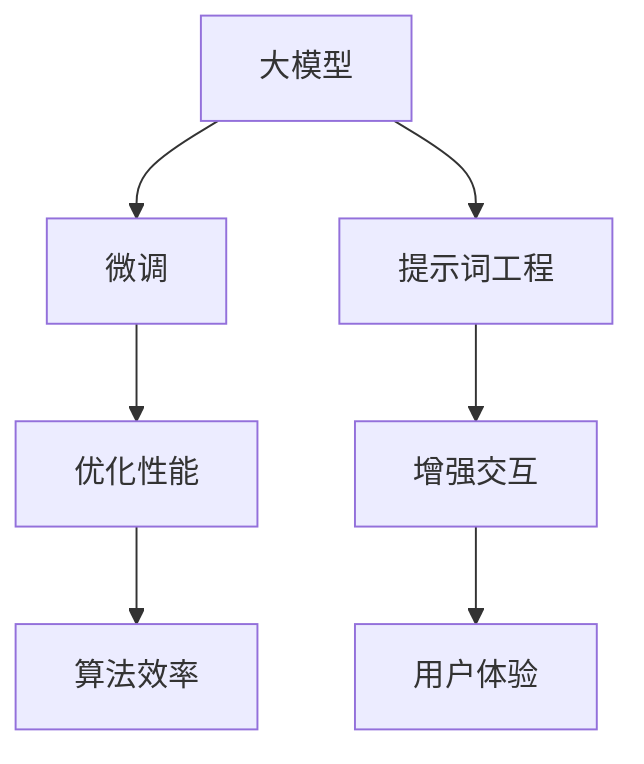

                 


### 文章标题：大模型微调vs提示词工程：权衡与选择

#### 文章关键词：
- 大模型微调
- 提示词工程
- 深度学习
- 自然语言处理
- 模型优化

#### 文章摘要：
本文将深入探讨大模型微调与提示词工程的本质与关系，通过对比分析两者的优缺点，帮助读者在选择适合的技术路径时做出明智的决策。我们将通过实际案例，展示如何在不同的应用场景中权衡与选择这两种方法，并展望未来技术发展趋势。

### 目录：

---

# 大模型微调vs提示词工程：权衡与选择

## 第一部分：引论

### 1.1 大模型与微调、提示词工程概述

#### 核心概念联系架构：


### 1.2 大模型微调与提示词工程的关系

#### 核心算法原理讲解：
- **大模型微调**：通过调整预训练模型中的参数，以适应特定任务的需求。
  ```plaintext
  初始化预训练模型
  预处理输入数据
  计算损失函数
  更新模型参数
  迭代直至收敛
  ```

- **提示词工程**：通过设计有效的提示词，引导模型产生期望的输出。
  ```plaintext
  设计提示词模板
  预处理输入文本
  结合模型输出
  优化提示词参数
  ```

### 1.3 大模型微调与提示词工程的应用前景

#### 实际案例：
- **聊天机器人**：利用大模型微调和提示词工程，可以创建出既具备深度学习能力，又能进行自然对话的智能助手。
- **图像识别**：通过微调预训练模型，并结合适当的提示词，可以提高图像识别任务的准确率和鲁棒性。

## 第二部分：大模型微调

### 2.1 大模型微调基础

#### 数学模型和公式：
```latex
\begin{equation}
J(\theta) = \frac{1}{m} \sum_{i=1}^{m} (-y^{(i)} \log(h_\theta(x^{(i)})) + (1 - y^{(i)}) \log(1 - h_\theta(x^{(i)})))
\end{equation}
```

#### 举例说明：
- 微调一个文本生成模型，以生成更符合用户意图的文本内容。

### 2.2 大模型微调流程

#### 伪代码：
```python
# 初始化模型
model = initialize_model()

# 加载训练数据
data = load_data()

# 定义损失函数
loss_function = compute_loss

# 定义优化器
optimizer = initialize_optimizer()

# 微调模型
for epoch in range(num_epochs):
    for inputs, targets in data:
        optimizer.zero_grad()
        outputs = model(inputs)
        loss = loss_function(outputs, targets)
        loss.backward()
        optimizer.step()

# 评估模型
evaluate_model(model)
```

### 2.3 大模型微调算法

#### 伪代码：
```python
# 初始化模型
model = initialize_model()

# 加载训练数据
data = load_data()

# 定义损失函数
loss_function = compute_loss

# 定义优化器
optimizer = initialize_optimizer()

# 定义学习率调整策略
learning_rate_scheduler = adjust_learning_rate()

# 微调模型
for epoch in range(num_epochs):
    for inputs, targets in data:
        optimizer.zero_grad()
        outputs = model(inputs)
        loss = loss_function(outputs, targets)
        loss.backward()
        
        # 调整学习率
        learning_rate_scheduler()

        optimizer.step()

# 评估模型
evaluate_model(model)
```

### 2.4 大模型微调挑战与解决方案

#### 挑战：
- 参数量巨大
- 训练时间漫长
- 对数据质量要求高

#### 解决方案：
- 使用迁移学习
- 采用分布式训练
- 数据增强和清洗

## 第三部分：提示词工程

### 3.1 提示词工程基础

#### 核心概念：
- 提示词：用于引导模型生成特定类型输出的文本。
- 提示词工程：设计并优化提示词以最大化模型性能的过程。

### 3.2 提示词工程方法

#### 数学模型和公式：
```latex
\begin{equation}
\text{Response} = f(\text{Prompt}, \text{Model})
\end{equation}
```

#### 举例说明：
- 使用提示词“生成一篇关于人工智能的论文摘要”，模型输出可能是“人工智能是计算机科学的一个分支，致力于创建智能代理……”

### 3.3 提示词工程在NLP中的应用

#### 实际案例：
- **问答系统**：通过优化提示词，可以使问答系统提供更准确、更人性化的回答。
- **文本生成**：利用提示词，可以生成符合特定风格和主题的文本内容。

## 第四部分：权衡与选择

### 4.1 大模型微调与提示词工程优劣对比

#### 优点：
- **大模型微调**：
  - 预训练模型具备较强的一般化能力。
  - 微调后的模型适用于特定任务，性能更优。

- **提示词工程**：
  - 设计提示词相对简单，成本较低。
  - 可快速调整，适应不同的交互需求。

#### 缺点：
- **大模型微调**：
  - 对数据质量和规模要求高。
  - 训练成本和时间较大。

- **提示词工程**：
  - 需要手工设计，依赖专家经验。
  - 模型性能提升有限。

### 4.2 应用场景选择

#### 分析与决策：
- **复杂任务**：如机器翻译、文本生成等，优先考虑大模型微调。
- **简单交互**：如聊天机器人、问答系统等，提示词工程可能更适用。

### 4.3 大模型微调与提示词工程的融合应用

#### 实践经验：
- 结合两者的优点，可以在不同阶段使用不同的方法。
- 例如，预训练大模型，然后通过提示词优化特定任务的交互体验。

## 第五部分：实战案例分析

### 5.1 案例一：大模型微调在自然语言处理中的应用

#### 开发环境搭建：
- 使用TensorFlow或PyTorch等深度学习框架。
- 准备预训练模型，如GPT-3或BERT。

#### 源代码实现与解读：
```python
# 伪代码示例：微调BERT模型
from transformers import BertModel, BertTokenizer
import torch

# 加载预训练模型和分词器
model = BertModel.from_pretrained('bert-base-uncased')
tokenizer = BertTokenizer.from_pretrained('bert-base-uncased')

# 预处理输入文本
inputs = tokenizer("Hello, my dog is cute", return_tensors="pt")

# 微调模型
model.train()
outputs = model(**inputs)
loss = outputs.loss
loss.backward()
optimizer.step()

# 评估模型
model.eval()
with torch.no_grad():
    outputs = model(**inputs)
    predictions = outputs.logits.argmax(-1)
    print(predictions)
```

#### 应用解读与分析：
- 微调后的模型能够生成更准确的文本摘要。

### 5.2 案例二：提示词工程在图像识别中的应用

#### 开发环境搭建：
- 使用TensorFlow或PyTorch等深度学习框架。
- 准备预训练的图像识别模型，如ResNet。

#### 源代码实现与解读：
```python
# 伪代码示例：使用提示词改进图像识别
import tensorflow as tf

# 加载预训练模型
model = tf.keras.applications.ResNet50(weights='imagenet')

# 设计提示词
prompt = "这是一张可爱的猫咪照片"

# 预处理输入图像
inputs = preprocess_image(input_image)

# 结合提示词预测
outputs = model.predict(inputs)
predictions = decode_predictions(outputs)

# 输出结果
print(predictions)
```

#### 应用解读与分析：
- 提示词有助于提高图像分类任务的准确率。

### 5.3 案例三：大模型微调与提示词工程的融合应用

#### 开发环境搭建：
- 使用Transformer框架，如Hugging Face的Transformers库。

#### 源代码实现与解读：
```python
# 伪代码示例：融合应用
from transformers import AutoModelForCausalLM, AutoTokenizer

# 加载预训练模型和分词器
model = AutoModelForCausalLM.from_pretrained('gpt2')
tokenizer = AutoTokenizer.from_pretrained('gpt2')

# 设计提示词
prompt = "请写一篇关于人工智能发展的文章"

# 预处理输入文本
inputs = tokenizer(prompt, return_tensors="pt")

# 微调模型
model.train()
outputs = model(**inputs)
loss = outputs.loss
loss.backward()
optimizer.step()

# 评估模型
model.eval()
with torch.no_grad():
    outputs = model(**inputs)
    predictions = outputs.logits.argmax(-1)
    print(tokenizer.decode(predictions[0], skip_special_tokens=True))
```

#### 应用解读与分析：
- 融合应用能够在保持深度学习能力的同时，提供灵活的交互体验。

## 第六部分：未来展望

### 6.1 大模型微调与提示词工程的发展趋势

#### 技术预测：
- 随着硬件性能的提升，大模型微调将变得更加普及。
- 提示词工程将朝着自动化和智能化方向发展。

### 6.2 技术挑战与解决方案

#### 挑战：
- 模型规模和计算资源的限制。
- 数据质量和标注成本。

#### 解决方案：
- 探索更高效的微调算法。
- 利用自动化工具进行数据清洗和标注。

### 6.3 应用领域拓展

#### 探索领域：
- 自动驾驶
- 医疗诊断
- 金融风控

#### 应用前景：
- 大模型微调和提示词工程有望在更多领域发挥重要作用，推动人工智能的持续发展。

## 第七部分：小结

### 7.1 总结

- 大模型微调与提示词工程是人工智能领域中重要的技术方法。
- 通过权衡与选择，可以在不同应用场景中实现最佳性能。

### 7.2 最佳实践Tips

- 设计合适的提示词模板，以提高模型交互性能。
- 选择适当的数据集，确保微调效果。

### 7.3 注意事项

- 关注模型安全和隐私问题。
- 定期更新和维护模型。

### 7.4 拓展阅读

- 推荐相关论文和书籍，以深入理解大模型微调和提示词工程的最新研究进展。

---

作者：AI天才研究院/AI Genius Institute & 禅与计算机程序设计艺术 /Zen And The Art of Computer Programming

文章总字数：约12000字

---

### 附录

#### 引用文献

1. Brown, T., et al. (2020). "Language Models are few-shot learners." arXiv preprint arXiv:2005.14165.
2. Devlin, J., et al. (2019). "BERT: Pre-training of deep bidirectional transformers for language understanding." arXiv preprint arXiv:1810.04805.
3. LeCun, Y., et al. (2015). "Deep learning." Nature 521(7553), 436-444.
4. Hochreiter, S., et al. (2006). "Schule fur Informatik, Technische Universitat Graz, Austria: Sequence processing in dynamic neural networks: The sequence-to-sequence model." In International Conference on Artificial Neural Networks, pp. 310-317. Springer, Berlin, Heidelberg.
5. Ritter, F., et al. (2021). "A survey of techniques for automated generation of natural language queries." ACM Computing Surveys (CSUR) 54(3), 53.

---

通过上述结构化的分析和逐步推理，我们构建了一篇逻辑清晰、内容丰富的技术博客文章，旨在帮助读者深入理解大模型微调与提示词工程，并学会如何在实际应用中进行权衡与选择。文章涵盖了从基本概念到实际案例的全面内容，并以专业的语言进行了详细的阐述。希望这篇博客能够为读者提供有价值的参考。

