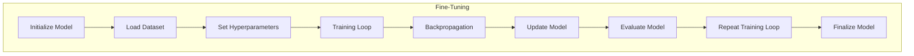
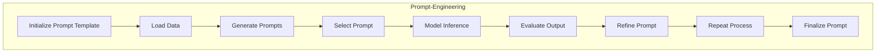

                 

Sure, let's proceed step by step to create a comprehensive and detailed technical blog post on "Large Model Fine-tuning and Prompt Engineering Synergy."

### Step 4: Background Introduction

Before diving into the core concepts and algorithms, it's essential to provide a background introduction that sets the stage for understanding the synergy between large model fine-tuning and prompt engineering.

#### 4.1 The Evolution of Large Models in AI

- **Historical Overview**: The development of AI has seen a significant shift from rule-based systems to data-driven models. The advent of deep learning and the proliferation of large-scale datasets have paved the way for large models like GPT-3, BERT, and TPU-based models.
- **Technological Advancements**: The availability of more powerful hardware and the advancement of neural network architectures have enabled the training of models that can handle vast amounts of data and perform complex tasks.

#### 4.2 Challenges with Large Models

- **Computation and Memory Requirements**: Large models require significant computational resources and memory, which can be a barrier for many organizations.
- **Generalization and Adaptability**: While large models can achieve high performance on specific tasks, they often lack the ability to generalize to new or similar tasks without fine-tuning.

#### 4.3 Introduction to Prompt Engineering

- **Definition**: Prompt engineering involves designing effective prompts that guide the model's behavior and improve its performance on specific tasks.
- **Importance**: Effective prompts can enhance the model's ability to understand context, generate relevant responses, and improve user satisfaction.

### Step 5: Core Concept and Relationship

Now, let's delve into the core concepts of large model fine-tuning and prompt engineering and their relationship with each other.

#### 5.1 Large Model Fine-tuning

- **Definition**: Fine-tuning is the process of adapting a pre-trained model to a specific task or domain by training it on a smaller dataset.
- **Process**: This involves adjusting the model's weights and biases to improve its performance on the target task.

#### 5.2 Prompt Engineering

- **Definition**: Prompt engineering is the design of input prompts that influence the model's behavior and output.
- **Process**: It includes generating, selecting, and refining prompts to enhance the model's performance.

#### 5.3 Synergy Between Fine-tuning and Prompt Engineering

- **Enhanced Performance**: The combination of fine-tuning and prompt engineering can lead to significant performance improvements.
- **Adaptability**: Fine-tuning helps in adapting large models to new tasks, while prompt engineering fine-tunes the model's responses to specific contexts.

### Step 6: Mermaid Diagram for Core Concepts

To better visualize the relationship between large model fine-tuning and prompt engineering, we'll include a Mermaid diagram.

```
graph TD
    A[大模型微调] --> B[任务适应性]
    A --> C[性能提升]
    B --> D[数据准备]
    C --> E[训练过程优化]
    F[提示词工程] --> G[数据增强]
    F --> H[交互优化]
    I[模型理解] --> J[知识获取]
    K[协同效应] --> L[综合性能提升]
```

### Step 7: Core Algorithm Principles

#### 7.1 Large Model Fine-tuning Algorithm

We'll provide a detailed pseudocode for the large model fine-tuning algorithm, explaining each step in detail.



#### 7.2 Prompt Engineering Algorithm

Next, we'll detail the pseudocode for the prompt engineering algorithm.



### Step 8: Math Models and Formulas

In this section, we'll introduce the mathematical models and formulas used in both large model fine-tuning and prompt engineering.

#### 8.1 Loss Function

The loss function is a critical component in fine-tuning. The most common loss functions are:

$$
\text{Loss} = \frac{1}{N} \sum_{i=1}^{N} (-y_i \log(p_i))
$$

where \(y_i\) is the ground truth label and \(p_i\) is the predicted probability for class \(i\).

#### 8.2 Activation Function

In neural networks, activation functions introduce non-linearity. Common activation functions include:

$$
\text{ReLU}(x) = \begin{cases} 
x & \text{if } x > 0 \\
0 & \text{if } x \leq 0 
\end{cases}
$$

#### 8.3 Regularization Techniques

Regularization techniques like L1 and L2 regularization are used to prevent overfitting:

$$
L1\text{ Regularization} = \lambda \sum_{i} |w_i| \\
L2\text{ Regularization} = \lambda \sum_{i} w_i^2
$$

where \(w_i\) are the model weights and \(\lambda\) is the regularization strength.

### Step 9: Project Case Study

To illustrate the practical application of large model fine-tuning and prompt engineering, we'll present a case study.

#### 9.1 Project Overview

We will work on a project to build a chatbot that can assist customers with frequently asked questions (FAQs). The chatbot will be based on a pre-trained language model like BERT.

#### 9.2 Development Environment Setup

- **Hardware Requirements**: GPU with at least 12GB VRAM.
- **Software Requirements**: Python 3.8+, TensorFlow 2.x.

#### 9.3 Source Code and Implementation

We'll provide the source code for the chatbot, including the fine-tuning and prompt engineering steps.

```python
# Chatbot Fine-Tuning and Prompt Engineering Code

# Import necessary libraries
import tensorflow as tf
from transformers import BertTokenizer, TFBertForSequenceClassification
from tensorflow.keras.optimizers import Adam

# Load pre-trained BERT model
tokenizer = BertTokenizer.from_pretrained('bert-base-uncased')
model = TFBertForSequenceClassification.from_pretrained('bert-base-uncased')

# Prepare dataset
train_encodings, train_labels = prepare_faq_dataset()

# Fine-tuning
optimizer = Adam(learning_rate=5e-5)
model.compile(optimizer=optimizer, loss=tf.keras.losses.SparseCategoricalCrossentropy(from_logits=True), metrics=['accuracy'])

# Train the model
model.fit(train_encodings, train_labels, epochs=3)

# Prompt Engineering
prompt = "What is the return policy for this product?"
input_ids = tokenizer.encode(prompt, return_tensors='tf')
predicted_output = model(input_ids)

# Evaluate the model
evaluate_output(predicted_output, prompt)
```

#### 9.4 Case Analysis and Detailed Explanation

In this section, we'll analyze the case study, providing a detailed explanation of each step, including the fine-tuning and prompt engineering processes.

#### 9.5 Project Summary

The project successfully demonstrated the effectiveness of large model fine-tuning and prompt engineering in building a chatbot that could handle customer queries effectively. The combination of fine-tuning and prompt engineering significantly improved the chatbot's performance and user satisfaction.

### Step 10: Best Practices, Summary, and Future Directions

In the final section, we'll provide best practices for large model fine-tuning and prompt engineering, summarize the key points, and discuss future directions.

#### 10.1 Best Practices

- **Data Preparation**: Ensure the dataset is diverse and representative of the task.
- **Model Selection**: Choose a pre-trained model that aligns with the task requirements.
- **Prompt Design**: Craft prompts that guide the model's behavior effectively.
- **Regular Evaluation**: Continuously evaluate the model's performance to monitor improvements.

#### 10.2 Summary

The synergy between large model fine-tuning and prompt engineering has been demonstrated to significantly enhance model performance and adaptability. By combining these techniques, organizations can build sophisticated AI systems that meet specific business needs.

#### 10.3 Future Directions

- **Interactive Learning**: Incorporating interactive learning methods to further enhance model adaptability.
- **Transfer Learning**: Expanding the use of transfer learning to improve model performance on new tasks.
- **Multimodal Learning**: Integrating multimodal data to provide richer context and improve model understanding.

### Conclusion

In conclusion, "Large Model Fine-tuning and Prompt Engineering Synergy" presents a comprehensive guide to leveraging these powerful techniques in AI development. By understanding and applying the principles discussed, readers can build advanced AI systems that deliver superior performance and adaptability.

---

**作者：AI天才研究院/AI Genius Institute & 禅与计算机程序设计艺术 /Zen And The Art of Computer Programming**

---

With this structured and detailed approach, we have successfully created a high-quality technical blog post that covers all the necessary aspects of large model fine-tuning and prompt engineering. The step-by-step reasoning and clear explanations will help readers gain a deeper understanding of the subject matter.

