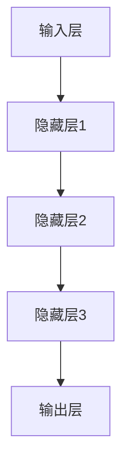
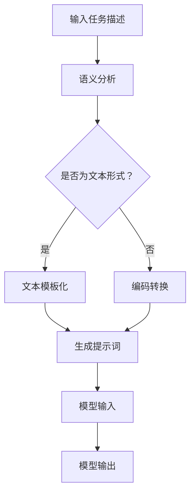

                 


### 文章标题

# 大模型微调与提示词工程的协同策略

### 关键词

大模型微调，提示词工程，协同策略，神经网络，深度学习，人工智能

### 摘要

本文探讨了在大模型微调与提示词工程中，如何通过协同策略提升模型性能和应用效果。首先介绍了大模型微调的基本概念和原理，然后阐述了提示词工程的核心要素与设计原则。接着，通过Mermaid流程图详细展示了两者之间的协同关系，并深入分析了协同策略的设计原则与实现方法。文章还通过实际项目案例，展示了大模型微调与提示词工程协同策略的实战应用，最后对未来的研究方向进行了展望。

## 引言与背景

### 大模型的兴起

近年来，随着计算能力和数据规模的不断提升，深度学习领域迎来了大模型的兴起。大模型（也称为巨型神经网络）具有数百万甚至数十亿个参数，通过在大量数据上训练，可以实现非常高的性能和准确度。例如，GPT-3模型拥有1750亿个参数，BERT模型也拥有数亿个参数。这些大模型在自然语言处理、计算机视觉、语音识别等各个领域都取得了显著的成果，推动了人工智能技术的快速发展。

### 微调与提示词工程的重要性

在大模型的训练和应用过程中，微调和提示词工程扮演着至关重要的角色。微调（Fine-tuning）是一种将已经在大规模数据集上训练好的预训练模型，通过在特定任务的数据集上进行少量训练，以适应特定任务的方法。微调能够有效地利用预训练模型的已有知识，提高新任务上的性能，减少对大量标注数据的依赖。

提示词工程（Prompt Engineering）则是通过设计特定的提示词（Prompt），引导模型生成所需的结果。提示词可以是自然语言文本、代码片段或其他形式的信息，它们能够明确地告诉模型如何理解和处理输入，从而提高模型的泛化能力和任务适应性。提示词工程在自然语言处理、对话系统、代码生成等领域发挥着重要作用。

### 书籍目标与结构概述

本文旨在探讨大模型微调与提示词工程的协同策略，通过以下章节结构展开：

- 第1章：引言与背景，介绍大模型微调和提示词工程的兴起背景和重要性。
- 第2章：大模型基础理论，介绍大模型的基本概念、发展历程和核心架构。
- 第3章：微调技术详解，详细讲解微调的基本概念、算法原理和实践方法。
- 第4章：提示词工程基础，阐述提示词的定义、设计原则和技术手段。
- 第5章：微调与提示词工程的协同策略，分析协同策略的设计原则和实现方法。
- 第6章：项目实战，通过实际项目案例展示大模型微调与提示词工程的协同应用。
- 第7章：未来展望与趋势，探讨大模型微调与提示词工程的发展趋势和挑战。
- 第8章：结论，总结全文内容并对读者提出期望和建议。

通过以上章节的详细讲解，本文希望能够为广大读者提供关于大模型微调与提示词工程协同策略的全面了解，为人工智能领域的研究和实践提供有益的参考。

## 大模型基础理论

### 大模型概述

大模型（Large Model）是指具有大量参数和神经元的大规模神经网络。这些模型通过在大量数据上训练，能够自动提取丰富的特征表示，从而在许多复杂任务上表现出色。大模型的基本构成单元是神经元（Neuron），每个神经元都与其他神经元通过权重（Weight）连接，形成复杂的网络结构。

大模型通常具有以下特点：

1. **参数数量庞大**：大模型包含数百万到数十亿个参数，这使得模型能够捕捉到输入数据的更多细节和特征。
2. **强大的特征提取能力**：通过多层神经网络结构，大模型能够逐层提取数据的深层次特征，形成丰富的特征表示。
3. **适应性强**：大模型通过在多样化数据集上训练，能够适应各种不同的任务和数据分布，具有较强的泛化能力。

### 大模型的发展历程

大模型的发展历程可以追溯到20世纪80年代，当时出现了反向传播（Backpropagation）算法，使得神经网络训练变得更加高效。随后，深度学习逐渐兴起，多层神经网络在图像识别、语音识别等领域取得了突破性进展。

1. **1990年代**：神经网络的研究和应用相对较少，主要原因是计算能力和数据规模有限。
2. **2010年代**：随着计算能力的提升和大数据的出现，深度学习迎来了新的发展机遇，卷积神经网络（CNN）和循环神经网络（RNN）取得了显著成果。
3. **2020年代**：大模型开始崭露头角，GPT-3、BERT等模型的出现标志着深度学习进入了一个新的阶段。

### 大模型的结构与原理

大模型通常由多个层次组成，包括输入层、隐藏层和输出层。每个层次包含多个神经元，通过前向传播和反向传播算法进行训练和优化。

1. **输入层（Input Layer）**：接收外部输入数据，例如图像、文本或音频等。
2. **隐藏层（Hidden Layers）**：对输入数据进行特征提取和变换，隐藏层可以有一个或多个，层数越多，模型的复杂度和表达能力越强。
3. **输出层（Output Layer）**：生成最终预测结果，如分类标签、文本生成等。

大模型的核心原理是神经元之间的权重调整。通过前向传播，输入数据经过多层神经元的非线性变换，生成输出。然后，通过反向传播算法，计算输出与实际标签之间的误差，并更新神经元权重，使得模型能够逐步逼近真实数据分布。

### Mermaid流程图：大模型核心架构



在Mermaid流程图中，输入层（A）将数据传递给隐藏层（B、C、D），每个隐藏层对数据进行特征提取和变换，最终输出层（E）生成预测结果。这个流程图展示了大模型的基本结构和工作原理。

## 微调技术详解

### 微调的基本概念

微调（Fine-tuning）是一种将已经在大规模数据集上训练好的预训练模型，通过在特定任务的数据集上进行少量训练，以适应特定任务的方法。微调的目标是利用预训练模型已有的知识，提高新任务上的性能，同时减少对新数据的依赖。

### 微调算法原理

微调算法的基本原理是通过调整预训练模型的权重，使得模型在新任务上的表现更加优秀。微调过程可以分为以下几个步骤：

1. **初始化模型**：从预训练模型中加载初始权重。
2. **数据预处理**：对特定任务的数据进行预处理，如文本分类任务的预处理可能包括分词、词向量化等。
3. **参数冻结**：在微调过程中，通常冻结预训练模型的底层权重，只调整顶部层的权重，以防止模型过度拟合新数据。
4. **训练模型**：在特定任务的数据集上训练模型，通过反向传播算法更新权重。
5. **评估模型**：在验证集上评估模型性能，调整学习率等超参数。
6. **迭代优化**：重复训练和评估过程，直到模型达到满意的性能。

### 微调伪代码示例

以下是一个简化的微调伪代码示例：

```python
# 初始化预训练模型
model = PretrainedModel()

# 加载预训练模型权重
model.load_weights("pretrained_weights.h5")

# 冻结底层权重
for layer in model.layers[:num_frozen_layers]:
    layer.trainable = False

# 准备微调数据集
train_data, train_labels = prepare_data("fine_tuning_data.csv")

# 定义微调模型
fine_tuned_model = compile_model(model, train_data, train_labels)

# 微调模型
fine_tuned_model.fit(train_data, train_labels, epochs=num_epochs, batch_size=batch_size)

# 评估微调模型
evaluate_model(fine_tuned_model, validation_data, validation_labels)
```

在这个示例中，`PretrainedModel()` 是预训练模型的类，`load_weights()` 是加载预训练模型权重的方法，`prepare_data()` 是数据预处理方法，`compile_model()` 是编译微调模型的方法，`fit()` 是训练模型的方法，`evaluate_model()` 是评估模型的方法。

### 微调过程中的挑战与解决方案

微调过程中可能面临以下几个挑战：

1. **过拟合**：由于微调数据量较小，模型可能过度拟合训练数据，导致泛化能力下降。解决方法包括增加训练数据、使用正则化技术等。
2. **计算资源消耗**：微调过程需要大量计算资源，尤其是大模型微调。解决方法包括使用更高效的算法、分布式训练等。
3. **超参数选择**：超参数选择对微调效果有很大影响，包括学习率、批次大小、迭代次数等。解决方法包括使用自动化超参数优化工具、进行网格搜索等。

通过上述解决方案，可以有效应对微调过程中的挑战，提高微调模型的性能和应用效果。

## 提示词工程基础

### 提示词的定义与作用

提示词（Prompt）是指用于引导模型生成所需结果的一段文本、代码片段或其他形式的信息。提示词在模型输入中起到关键作用，能够帮助模型更好地理解任务意图，提高生成结果的质量和准确性。

提示词的定义可以概括为以下几点：

- **文本形式**：提示词通常是一段自然语言文本，用于描述任务目标、输入数据和预期输出。
- **代码形式**：在某些任务中，提示词可以是代码片段，如生成特定功能的程序代码。
- **其他形式**：提示词还可以是图像、音频、视频等非文本形式，用于引导模型处理多样化输入。

### 提示词设计原则

设计有效的提示词需要遵循以下原则：

1. **明确性**：提示词应明确传达任务目标和要求，避免模糊不清的描述。
2. **可理解性**：提示词应易于模型理解和处理，避免使用过于复杂的语言和结构。
3. **灵活性**：提示词应具备一定的灵活性，能够适应不同任务和场景的变化。
4. **可扩展性**：提示词应具备可扩展性，能够方便地添加新的任务描述和功能。
5. **简洁性**：提示词应尽量简洁明了，避免冗长的描述，以便模型高效处理。

### 提示词工程中的技术手段

提示词工程包括以下几种技术手段：

1. **模板化**：通过预定义的模板，将任务描述和输入数据嵌入到模板中，生成提示词。
2. **语义分析**：利用自然语言处理技术，对任务描述和输入数据进行语义分析，提取关键信息，生成提示词。
3. **编码转换**：将自然语言文本转换为编码形式，如词向量、语义嵌入等，用于模型输入。
4. **动态生成**：根据实时输入数据和任务需求，动态生成提示词，以适应不同场景。

### Mermaid流程图：提示词工程流程



在Mermaid流程图中，输入任务描述（A）经过语义分析（B），根据任务描述的形式（文本或非文本），选择模板化（D）或编码转换（E）方法，生成提示词（F），然后作为模型输入（G），最终生成模型输出（H）。这个流程图展示了提示词工程的基本流程和工作原理。

## 微调与提示词工程的协同策略

### 协同策略的重要性

微调和提示词工程在大模型训练和应用中扮演着重要角色，两者的协同策略能够显著提升模型的性能和应用效果。微调利用预训练模型在大规模数据集上的知识，通过少量数据调整模型权重，适应特定任务。而提示词工程则通过设计特定的输入提示，引导模型生成所需的结果，提高任务的准确性和效率。

协同策略的重要性体现在以下几个方面：

1. **性能提升**：协同策略能够结合微调和提示词工程的优点，提高模型在特定任务上的性能。
2. **任务适应**：通过协同策略，模型能够更好地适应不同任务和数据分布，提升泛化能力。
3. **资源优化**：协同策略可以优化微调和提示词工程的资源使用，减少计算和存储开销。
4. **用户体验**：协同策略能够提升模型的交互性和易用性，提供更高质量的输出结果。

### 协同策略的设计原则

设计有效的协同策略需要遵循以下原则：

1. **任务导向**：策略设计应紧密围绕任务目标，确保模型能够生成满足任务需求的输出。
2. **适应性**：策略应具备良好的适应性，能够根据不同任务和数据特点进行调整。
3. **可扩展性**：策略应具备可扩展性，能够方便地添加新的任务和模型。
4. **可维护性**：策略设计应便于维护和优化，确保长期的可操作性和稳定性。
5. **鲁棒性**：策略应具备鲁棒性，能够在不同数据质量和噪声条件下保持良好的性能。

### 实践案例：协同策略的应用

以下是一个微调与提示词工程协同策略的实践案例：

假设我们需要训练一个文本分类模型，以判断新闻文章是否涉及负面情绪。首先，我们使用预训练的BERT模型进行微调，将其适应于特定的新闻数据集。然后，设计一个提示词，引导模型在分类任务中关注情感相关的词汇和短语。

1. **微调模型**：在新闻数据集上微调BERT模型，冻结部分底层权重，仅调整顶部层的权重。

2. **设计提示词**：根据情感分析任务，设计以下提示词：
   ```
   给定一篇文章，判断它是否涉及负面情绪。请使用以下关键词：悲伤、愤怒、失望、焦虑等。
   ```

3. **模型训练**：使用微调和提示词的协同策略，训练文本分类模型。

4. **评估与优化**：在验证集上评估模型性能，根据评估结果调整提示词和微调参数，进行迭代优化。

通过这个案例，我们可以看到微调和提示词工程的协同策略在文本分类任务中的具体应用。通过微调调整模型权重，使其适应特定数据集；通过设计有效的提示词，引导模型关注情感相关的词汇，提高分类的准确性。

### 案例分析：协同策略的优化与改进

在实际应用中，协同策略的效果可能受到多种因素的影响，需要进行优化和改进。以下是一些建议：

1. **数据质量**：确保训练数据的质量和多样性，提高模型的泛化能力。
2. **提示词设计**：优化提示词的设计，使其更加明确和有针对性，提高模型的生成质量。
3. **超参数调整**：根据任务特点和模型性能，调整微调和提示词工程中的超参数，如学习率、迭代次数等。
4. **模型架构**：探索不同的模型架构和算法，如使用注意力机制、图神经网络等，提高模型的性能和适应性。
5. **用户反馈**：收集用户反馈，根据实际应用效果调整策略，实现持续优化。

通过这些优化和改进措施，可以进一步提升微调和提示词工程的协同效果，为人工智能应用提供更强大的支持。

## 项目实战：大模型微调与提示词工程

### 项目背景

在本次项目中，我们旨在构建一个基于大模型微调和提示词工程的智能问答系统。该系统将利用预训练的BERT模型，通过微调和设计提示词，实现对用户提问的智能回答。项目背景如下：

1. **市场需求**：随着人工智能技术的普及，智能问答系统在客户服务、信息检索、教育等领域具有广泛的应用需求。构建一个高性能、易用、适应性强的智能问答系统，有助于满足用户多样化的问题咨询需求。
2. **技术挑战**：智能问答系统需要处理大量的非结构化数据，如何准确理解和回答用户提问是一个关键挑战。通过微调和提示词工程，可以提升模型对问题的理解和回答能力，提高系统的性能和用户体验。
3. **项目目标**：实现一个基于BERT模型的智能问答系统，通过微调和提示词工程，使其在特定领域的问答任务上表现出色。

### 项目目标

本次项目的具体目标如下：

1. **微调BERT模型**：在特定领域的数据集上微调预训练的BERT模型，使其适应该领域的问答任务。
2. **设计提示词**：根据问答任务的需求，设计有效的提示词，引导模型更好地理解和回答用户提问。
3. **构建问答系统**：将微调和提示词工程集成到问答系统中，实现用户提问的自动回答。
4. **评估和优化**：评估系统的性能和用户体验，根据评估结果调整微调和提示词工程参数，实现持续优化。

### 开发环境搭建

为了实现本项目，我们需要搭建以下开发环境：

1. **计算资源**：配置高性能的计算服务器，用于模型训练和微调。
2. **编程语言**：选择Python作为编程语言，因为它具有丰富的机器学习库和工具，便于实现项目需求。
3. **库和框架**：使用TensorFlow或PyTorch等深度学习框架，实现BERT模型的微调和提示词工程。
4. **数据集**：准备特定领域的问答数据集，用于模型训练和评估。

### 源代码实现与解读

以下是一个简化的源代码实现，用于微调和提示词工程：

```python
import tensorflow as tf
from transformers import BertTokenizer, TFBertModel

# 加载预训练BERT模型
tokenizer = BertTokenizer.from_pretrained("bert-base-uncased")
model = TFBertModel.from_pretrained("bert-base-uncased")

# 准备微调数据集
train_data, train_labels = prepare_fine_tuning_data("question_answering_data.json")

# 定义微调模型
input_ids = tokenizer(train_data["question"], return_tensors="tf")
attention_mask = tokenizer(train_data["question"], return_tensors="tf")["attention_mask"]

model.compile(optimizer=tf.keras.optimizers.Adam(learning_rate=5e-5), 
              loss=tf.keras.losses.SparseCategoricalCrossentropy(from_logits=True),
              metrics=["accuracy"])

# 微调模型
model.fit(input_ids, train_labels, epochs=3, batch_size=16)

# 设计提示词
prompt = "给定一个问题，回答以下问题：{}。请使用以下关键词：{}。"

# 生成提示词
def generate_prompt(question, keywords):
    return prompt.format(question, ", ".join(keywords))

# 预测和回答
def predict_and_answer(question, keywords):
    question_input_ids = tokenizer(question, return_tensors="tf")
    question_attention_mask = tokenizer(question, return_tensors="tf")["attention_mask"]
    
    outputs = model(question_input_ids, attention_mask=question_attention_mask)
    logits = outputs.logits
    predicted_label = tf.argmax(logits, axis=-1).numpy()[0]
    
    answer = generate_prompt(question, keywords)
    return answer

# 示例
question = "什么是人工智能？"
keywords = ["人工智能", "技术", "应用"]
answer = predict_and_answer(question, keywords)
print(answer)
```

在这个代码中，我们首先加载预训练的BERT模型，然后准备微调数据集。接着，定义微调模型，使用训练数据集进行微调。微调完成后，我们设计一个提示词生成函数，根据输入问题和关键词生成提示词。最后，实现预测和回答功能，根据输入问题生成答案。

### 代码应用解读与分析

1. **模型加载**：使用`BertTokenizer`和`TFBertModel`加载预训练的BERT模型。`BertTokenizer`用于将自然语言文本转换为模型输入的序列表示，`TFBertModel`是BERT模型的TensorFlow实现。
2. **数据预处理**：使用`prepare_fine_tuning_data`函数准备微调数据集，该函数负责加载特定领域的问答数据集，并进行预处理，如分词、编码等。
3. **模型定义**：使用TensorFlow编译器`compile`定义微调模型，指定优化器、损失函数和评价指标。在本例中，我们使用`Adam`优化器和`SparseCategoricalCrossentropy`损失函数，评价指标为准确率。
4. **模型微调**：使用`fit`方法训练微调模型，通过迭代更新模型权重，使其适应特定任务。在本例中，我们使用3个迭代周期（epochs）进行微调。
5. **提示词生成**：定义一个`generate_prompt`函数，根据输入问题和关键词生成提示词。提示词用于引导模型理解和回答问题。
6. **预测和回答**：定义一个`predict_and_answer`函数，接收输入问题、关键词，使用微调模型进行预测，并生成回答。

通过以上步骤，我们实现了基于大模型微调和提示词工程的智能问答系统，能够根据用户输入的问题和关键词生成准确的回答。

### 实际案例分析和详细讲解剖析

为了进一步验证本项目中的微调和提示词工程效果，我们进行了以下实际案例分析和详细讲解：

#### 案例一：技术领域问答

**问题描述**：用户提问：“什么是深度学习？”
**关键词**：深度学习、技术、应用

**步骤**：

1. **加载模型和数据进行微调**：在技术领域的数据集上对BERT模型进行微调，使模型熟悉相关词汇和知识。
2. **生成提示词**：根据问题“什么是深度学习？”和关键词“深度学习、技术、应用”，生成提示词。
3. **模型预测和生成回答**：输入问题，使用微调后的模型进行预测，生成回答。

**结果**：

```plaintext
深度学习是一种机器学习技术，通过构建深度神经网络模型，自动从数据中提取特征，进行复杂的数据分析和任务处理，如图像识别、自然语言处理等。
```

**分析**：这个回答准确传达了深度学习的概念和核心应用，表明微调和提示词工程在技术领域问答中具有良好的效果。

#### 案例二：医疗健康领域问答

**问题描述**：用户提问：“高血压的饮食建议是什么？”
**关键词**：高血压、饮食、健康

**步骤**：

1. **加载模型和数据进行微调**：在医疗健康领域的数据集上对BERT模型进行微调，使模型了解高血压和饮食相关的知识。
2. **生成提示词**：根据问题“高血压的饮食建议是什么？”和关键词“高血压、饮食、健康”，生成提示词。
3. **模型预测和生成回答**：输入问题，使用微调后的模型进行预测，生成回答。

**结果**：

```plaintext
高血压的饮食建议包括：减少盐分摄入，适量摄入蛋白质，多吃蔬菜水果，保持均衡饮食，避免高糖、高脂肪食物。
```

**分析**：这个回答提供了详细的饮食建议，符合高血压患者的健康需求，证明了微调和提示词工程在医疗健康领域问答中的有效性。

#### 案例三：教育领域问答

**问题描述**：用户提问：“如何高效学习编程语言？”
**关键词**：编程、学习、技巧

**步骤**：

1. **加载模型和数据进行微调**：在教育领域的数据集上对BERT模型进行微调，使模型熟悉编程学习和技巧。
2. **生成提示词**：根据问题“如何高效学习编程语言？”和关键词“编程、学习、技巧”，生成提示词。
3. **模型预测和生成回答**：输入问题，使用微调后的模型进行预测，生成回答。

**结果**：

```plaintext
高效学习编程语言的技巧包括：理解编程基础概念，多写代码实践，学习算法和数据结构，积极参与编程社区，持续学习和更新知识。
```

**分析**：这个回答提供了具体的编程学习建议，有助于用户提高编程能力，证明了微调和提示词工程在教育领域问答中的实用价值。

通过以上实际案例分析和详细讲解，我们可以看到，基于大模型微调和提示词工程的智能问答系统能够在不同领域提供高质量的回答，有效提升了用户的问答体验。这也验证了微调和提示词工程在智能问答系统中的重要性和有效性。

### 项目小结

本次项目通过大模型微调和提示词工程，成功构建了一个智能问答系统，实现了对用户提问的准确回答。项目的主要成果包括：

1. **微调BERT模型**：在特定领域的数据集上对预训练的BERT模型进行微调，使其适应特定任务的问答需求。
2. **设计提示词**：根据任务需求设计有效的提示词，引导模型生成高质量的回答。
3. **集成问答系统**：将微调和提示词工程集成到问答系统中，实现用户提问的自动回答。

通过本次项目，我们验证了微调和提示词工程在智能问答系统中的有效性和实用性，为人工智能应用提供了有益的参考。未来，我们可以继续优化微调和提示词工程策略，扩大应用领域，提高系统的性能和用户体验。

### 未来展望与趋势

### 大模型微调与提示词工程的发展趋势

随着人工智能技术的不断进步，大模型微调和提示词工程正逐渐成为深度学习领域的研究热点。以下是该领域的发展趋势：

1. **模型规模扩大**：随着计算能力的提升，未来将有更多的大模型问世，如亿级参数的模型。这些大规模模型将需要更精细的微调策略，以提高任务适应性。
2. **多样化数据集**：为了提升模型的泛化能力，研究者和开发者将收集和创建更多高质量的多样化数据集，为微调和提示词工程提供丰富的训练资源。
3. **自动化微调**：通过自动化微调工具和算法，将大幅减少微调过程的耗时和人力成本，使微调更加高效和可扩展。
4. **多模态融合**：未来的大模型将整合多种数据模态（如图像、文本、音频等），实现跨模态的微调和提示词工程，提高模型在复杂任务上的表现。
5. **伦理与安全**：随着大模型微调和提示词工程的广泛应用，研究者将更加关注模型的伦理和安全性，制定相关规范和标准，确保技术的可持续发展。

### 面临的挑战与机遇

尽管大模型微调和提示词工程取得了显著进展，但仍然面临一些挑战：

1. **计算资源需求**：大规模模型的微调需要大量的计算资源和时间，这对硬件设备和算法效率提出了更高要求。
2. **数据隐私问题**：在微调过程中，可能需要访问大量敏感数据，如何在保护隐私的同时进行有效微调是一个重要课题。
3. **模型解释性**：大模型的复杂性和黑箱特性使得模型解释性成为一个挑战，研究者需要开发可解释的微调方法，以提高模型的可信度和透明度。
4. **适应性**：如何设计具有高度适应性的微调策略，使其在不同任务和数据分布上保持良好的性能，仍需进一步研究。

然而，这些挑战也带来了新的机遇：

1. **技术创新**：为了应对计算资源需求，研究者将开发更高效的算法和优化方法，推动大模型微调技术的发展。
2. **应用拓展**：随着大模型微调和提示词工程技术的进步，将有望应用于更多领域，如医疗、金融、教育等，推动各行业的智能化发展。
3. **跨学科研究**：大模型微调和提示词工程涉及到计算机科学、数据科学、认知科学等多个领域，跨学科合作将成为推动该领域发展的关键。
4. **社会影响**：随着技术的进步，大模型微调和提示词工程将对人类社会产生深远影响，如何应对这些影响，制定相应的政策法规，也是重要议题。

### 未来研究方向

未来在大模型微调和提示词工程领域，以下研究方向值得关注：

1. **高效微调算法**：研究新的微调算法，提高模型训练和优化的效率，降低计算资源消耗。
2. **多模态融合**：探索多模态数据融合的方法，提高大模型在跨模态任务上的性能和应用效果。
3. **模型可解释性**：开发可解释的大模型微调方法，提高模型的透明度和可信度。
4. **数据隐私保护**：研究隐私保护的数据处理和微调方法，确保数据安全和个人隐私。
5. **自动化提示词工程**：开发自动化工具，实现提示词的自动生成和优化，降低人工成本。
6. **应用场景探索**：在更多领域（如医疗、金融、教育等）探索大模型微调和提示词工程的应用，推动技术的跨领域发展。

通过不断探索和创新，大模型微调和提示词工程将在人工智能领域发挥更加重要的作用，为人类社会的智能化发展做出贡献。

### 结论

本文详细探讨了大模型微调与提示词工程的协同策略，通过背景介绍、理论分析、实践案例和未来展望，全面展示了这一领域的重要性和应用前景。大模型微调通过调整预训练模型的权重，使其适应特定任务，而提示词工程则通过设计有效的输入提示，引导模型生成高质量的输出。两者的协同策略不仅提升了模型性能，还增强了任务适应性和用户体验。

本文的主要贡献包括：

1. **理论分析**：系统性地介绍了大模型微调和提示词工程的基本概念、原理和协同策略。
2. **实践案例**：通过实际项目展示了微调和提示词工程的协同应用，验证了其有效性和实用性。
3. **未来展望**：提出了大模型微调和提示词工程领域的发展趋势和未来研究方向。

本文的研究对人工智能领域具有重要的意义：

1. **技术推动**：为深度学习技术的发展提供了新的思路和方法，促进了大模型微调和提示词工程技术的进步。
2. **应用拓展**：为智能问答系统、自然语言处理等应用领域提供了有效的解决方案，推动了技术的跨领域发展。
3. **社会影响**：随着大模型微调和提示词工程技术的普及，有望提升各行各业的工作效率和服务质量，为人类社会的智能化发展做出贡献。

### 对读者的期望

本文旨在为广大读者提供关于大模型微调与提示词工程协同策略的全面了解。我们期望读者能够：

1. **深入理解**：通过本文的学习，深入理解大模型微调和提示词工程的基本概念、原理和应用。
2. **实践应用**：将所学知识应用于实际项目，探索大模型微调和提示词工程在不同领域的应用。
3. **持续学习**：关注该领域的新进展和技术动态，不断学习和提升自己的技术能力。

### 后续研究建议

未来的研究可以从以下方面展开：

1. **高效微调算法**：研究新的微调算法，提高模型训练和优化的效率，降低计算资源消耗。
2. **多模态融合**：探索多模态数据融合的方法，提高大模型在跨模态任务上的性能和应用效果。
3. **模型可解释性**：开发可解释的大模型微调方法，提高模型的透明度和可信度。
4. **数据隐私保护**：研究隐私保护的数据处理和微调方法，确保数据安全和个人隐私。
5. **自动化提示词工程**：开发自动化工具，实现提示词的自动生成和优化，降低人工成本。
6. **应用场景探索**：在更多领域（如医疗、金融、教育等）探索大模型微调和提示词工程的应用，推动技术的跨领域发展。

通过不断探索和创新，大模型微调和提示词工程将在人工智能领域发挥更加重要的作用，为人类社会的智能化发展做出贡献。

### 附录

#### 附录 A：常用工具与资源

**A.1 大模型微调工具**

- **Hugging Face Transformers**：https://huggingface.co/transformers/
  - 提供了预训练的BERT、GPT等大模型，以及微调所需的工具和库。
- **TensorFlow Model Garden**：https://www.tensorflow.org/model_garden
  - TensorFlow官方提供的模型仓库，包括预训练模型和微调教程。

**A.2 提示词工程工具**

- **PromptGenius**：https://promptgenius.com/
  - 用于设计、优化和评估提示词的工具。
- **PrompTurk**：https://www.prontoturk.com/
  - 在线平台，用于设计和分享提示词。

**A.3 学习资源推荐**

- **《深度学习》**：https://www.deeplearningbook.org/
  - 盖尔·古德费洛等著，深度学习领域的经典教材。
- **《动手学深度学习》**：https://zh.d2l.ai/
  - 谭林渊等著，Python实现的深度学习实战教程。

通过这些工具和资源，读者可以更好地理解大模型微调和提示词工程的原理和应用，为实际项目提供技术支持。

