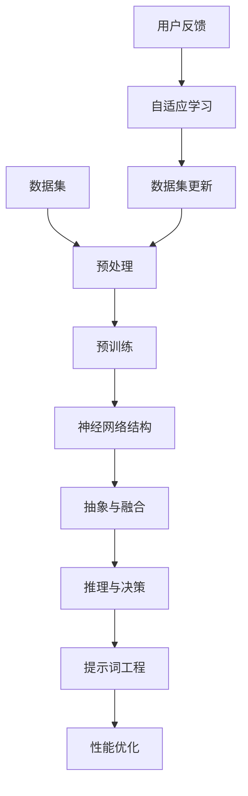

                 

### 引言

#### 书籍背景及目的

《大模型思维链与提示词工程的协同效应》旨在深入探讨大模型思维链与提示词工程在现代信息技术中的协同作用，为专业人士提供系统化的理论框架和实践指南。随着人工智能技术的快速发展，大模型思维链和提示词工程作为关键领域，已经成为推动技术进步和创新的重要引擎。然而，现有的文献和资料多侧重于单一领域的介绍，缺乏对两者协同效应的全面分析。

本书的目的在于填补这一研究空白，通过系统的分析和实践，揭示大模型思维链与提示词工程之间的内在联系，探讨其协同效应如何提升人工智能系统的性能和应用效果。我们希望通过这本书，不仅能为学术界提供有价值的理论成果，也能为业界提供实用的技术方案。

#### 大模型思维链概念

大模型思维链是一种基于大型神经网络模型（如GPT、BERT等）的智能推理系统，通过多层次、多阶段的神经网络结构，实现对复杂问题的分析和解决。大模型思维链的核心在于其能够通过对海量数据的训练，形成一种高度抽象和通用的知识表示能力，从而在各个应用领域中展现出色的表现。

大模型思维链的基本原理包括：

1. **数据驱动**：通过大规模数据集进行训练，使模型具备广泛的知识和应用能力。
2. **多层次抽象**：模型通过多层神经网络进行知识的抽象和融合，形成高度综合的推理能力。
3. **自适应学习**：模型在应用过程中能够根据新的数据和反馈不断调整和优化自身结构，提升性能。

大模型思维链的应用范围广泛，包括自然语言处理、计算机视觉、推荐系统等。其强大的推理能力和适应性，使得大模型思维链在解决复杂问题时展现出巨大的潜力。

#### 提示词工程介绍

提示词工程是一种通过设计特定的提示词，引导大模型思维链进行有效推理的方法。提示词工程的核心目标是优化模型的输入，使其能够更准确地理解和回答问题，提升模型的性能和应用效果。

提示词工程的基本原理包括：

1. **提示词设计**：通过分析问题和数据，设计出能够引导模型正确推理的提示词。
2. **反馈循环**：通过用户反馈和模型输出，不断优化和调整提示词，提高模型的表现。
3. **多样性**：设计多种不同的提示词，以应对各种复杂问题和场景。

提示词工程在提升模型性能方面具有重要作用，通过合理的提示词设计，可以引导模型在特定任务中取得更好的效果。

#### 本书结构安排

本书共分为九章，涵盖了从基础理论到实践应用的各个方面。

- **第1章 引言**：介绍书籍的背景、目的和结构。
- **第2章 大模型思维链基础**：介绍大模型思维链的概念、原理和发展历程。
- **第3章 大模型架构解析**：深入分析大模型的结构与特点，以及训练和推理过程。
- **第4章 提示词工程原理**：讲解提示词工程的基本概念、流程和优化方法。
- **第5章 大模型思维链与提示词工程的协同**：探讨两者之间的协同作用和优化策略。
- **第6章 大模型思维链应用场景**：分析大模型思维链在不同领域的应用。
- **第7章 提示词工程实践**：介绍提示词工程的开发环境和实践案例。
- **第8章 大模型思维链与提示词工程协同实践**：通过具体案例展示协同效应。
- **第9章 未来展望与挑战**：展望大模型思维链与提示词工程的未来发展趋势和面临的挑战。

通过以上章节的安排，本书旨在为读者提供一个全面、系统的学习和实践框架，帮助理解和应用大模型思维链与提示词工程的协同效应。

### 大模型思维链基础

#### 大模型思维链的概念与原理

大模型思维链（Large Model Thinking Chain）是一种基于大规模神经网络模型（如GPT、BERT等）的智能推理系统，通过多层次、多阶段的神经网络结构，实现对复杂问题的分析和解决。大模型思维链的核心在于其能够通过对海量数据的训练，形成一种高度抽象和通用的知识表示能力，从而在各个应用领域中展现出色的表现。

大模型思维链的基本原理包括以下几个方面：

1. **数据驱动**：大模型思维链的训练过程依赖于海量数据，通过数据驱动的训练方式，模型能够从数据中学习到各种特征和规律，从而具备广泛的知识和应用能力。这一过程通常涉及数据预处理、数据增强和数据清洗等多个环节。

2. **多层次抽象**：大模型思维链通过多层神经网络结构，实现对知识的抽象和融合。每一层神经网络都对输入信息进行特定的处理和抽象，最终形成高度综合的推理能力。这种多层次抽象机制使得模型能够处理复杂的问题，并从中提取出关键信息。

3. **自适应学习**：大模型思维链在应用过程中能够根据新的数据和反馈不断调整和优化自身结构，提升性能。这一过程通常涉及在线学习、迁移学习和强化学习等多种学习策略，使得模型能够适应不同的环境和任务需求。

4. **知识表示**：大模型思维链通过嵌入和编码技术，将输入的信息转化为结构化的知识表示，从而便于模型进行推理和决策。这种知识表示能力使得模型能够在各种复杂的任务中表现出色。

#### 大模型思维链的发展历程

大模型思维链的发展历程可以追溯到深度学习技术的兴起。随着计算能力和数据资源的不断提升，研究人员开始尝试训练更大规模的神经网络模型，以解决更复杂的问题。以下是几个重要的发展阶段：

1. **早期探索阶段（2010s）**：在这一阶段，研究人员开始尝试训练相对较大规模的神经网络模型，如深度神经网络（DNN）和卷积神经网络（CNN）。这些模型在图像识别和语音识别等任务中取得了显著进展，但仍然存在一些局限性。

2. **预训练阶段（2018s）**：2018年，谷歌发布了BERT模型，开启了预训练大规模语言模型的先河。BERT模型通过在大量文本上进行预训练，获得了强大的语言理解能力，并在多个自然语言处理任务中取得了领先表现。这一阶段标志着大模型思维链的初步形成。

3. **多模态融合阶段（2020s）**：随着技术的发展，研究人员开始探索将大模型思维链应用于多模态数据，如图像、语音和视频等。通过多模态融合，大模型思维链能够更好地理解和处理复杂的信息，提升其在各个领域的应用效果。

4. **强化学习与优化阶段（2020s）**：在预训练的基础上，研究人员开始探索强化学习和优化技术，以进一步提升大模型思维链的性能和应用效果。通过自适应学习和迁移学习，模型能够更好地适应不同的任务和环境。

#### 大模型思维链的核心要素

大模型思维链的核心要素包括以下几个方面：

1. **神经网络结构**：大模型思维链通常采用多层神经网络结构，以实现对输入信息的抽象和融合。神经网络结构的设计和优化是提升模型性能的关键因素。

2. **数据集**：数据集是训练大模型思维链的基础，数据集的质量和规模直接影响模型的性能。因此，数据集的选择和处理至关重要。

3. **预训练与微调**：预训练是训练大模型思维链的重要步骤，通过在大量数据上进行预训练，模型能够获得强大的通用知识表示能力。微调则是在特定任务上进行优化，以提升模型在特定任务上的表现。

4. **提示词工程**：提示词工程是一种通过设计特定的提示词，引导大模型思维链进行有效推理的方法。合理的提示词设计能够提升模型的性能和应用效果。

5. **推理与决策**：大模型思维链的推理与决策过程是其核心功能，通过多层次的抽象和融合，模型能够对复杂问题进行深入分析和解决。

### 大模型思维链的概念与联系架构

为了更直观地展示大模型思维链的核心概念与联系，我们可以使用Mermaid流程图来绘制其架构：



在这个架构中，数据集经过预处理后进入预训练阶段，通过神经网络结构进行抽象与融合，形成推理与决策能力。提示词工程则通过设计特定的提示词，引导模型进行有效推理。用户反馈和自适应学习机制使得模型能够不断优化和提升性能。通过这个流程图，我们可以更清晰地理解大模型思维链的核心要素及其相互关系。

### 大模型架构解析

#### 大模型的结构与特点

大模型，顾名思义，是指具有巨大参数量和广泛知识表示能力的神经网络模型。它们通常采用深度学习的框架，通过多层神经网络结构实现对复杂问题的建模和解决。大模型的结构特点主要包括以下几个方面：

1. **多层神经网络**：大模型通常包含数十层、数百层，甚至上千层的神经网络结构，这些层级通过逐层传递信息和参数，实现对输入数据的抽象和融合。多层神经网络的结构使得模型能够处理更复杂的问题，并从中提取更丰富的特征。

2. **大规模参数**：大模型具有数十亿、数百亿，甚至数千亿个参数，这些参数通过学习海量数据，能够捕捉到复杂的模式和规律。大规模参数使得模型具有更强的泛化能力和表现力。

3. **并行计算能力**：大模型通常需要在分布式计算环境中进行训练和推理，以充分利用现代计算资源的并行计算能力。通过使用GPU、TPU等硬件加速器，大模型能够实现高效的计算，从而提升训练和推理速度。

4. **动态调整能力**：大模型通过自适应学习和迁移学习等技术，能够根据不同的任务和环境进行动态调整，提升其在特定任务上的表现。这种动态调整能力使得大模型能够适应多样化的应用场景。

#### 大模型训练过程

大模型训练过程是指通过大量数据和计算资源，使得大模型逐渐学会对复杂问题进行建模和解决的过程。其基本步骤包括数据预处理、模型初始化、前向传播、反向传播和参数更新等。以下是详细的训练过程：

1. **数据预处理**：数据预处理是训练大模型的第一步，其主要任务是清洗、归一化和标准化数据，使其适合模型训练。具体包括：
   - **数据清洗**：去除数据中的噪声和异常值。
   - **数据归一化**：将数据缩放到相同的范围，以消除不同特征之间的尺度差异。
   - **数据标准化**：通过线性变换，使得数据服从标准正态分布。

2. **模型初始化**：模型初始化是指为神经网络模型分配初始参数。常用的初始化方法包括随机初始化、高斯初始化和Xavier初始化等。这些初始化方法旨在使得模型参数具有合理的分布，避免梯度消失或爆炸问题。

3. **前向传播**：前向传播是指将输入数据通过神经网络模型，逐层计算输出结果。在每一层，模型都会对输入数据进行处理，并生成中间结果。最终，通过最后一层输出层，模型会生成预测结果。

4. **反向传播**：反向传播是指通过计算预测结果与实际结果之间的误差，反向更新神经网络模型的参数。具体步骤包括：
   - **误差计算**：计算输出层的预测误差，并使用误差梯度信息。
   - **梯度计算**：从输出层开始，逐层计算各层的误差梯度。
   - **参数更新**：使用梯度下降等优化算法，更新模型参数。

5. **参数更新**：参数更新是训练过程中的关键步骤，通过迭代优化算法，不断调整模型参数，使其逐渐逼近最优解。常用的优化算法包括梯度下降、Adam优化器等。

6. **迭代训练**：整个训练过程通常需要多次迭代，每次迭代都会更新模型参数，并逐步减小预测误差。随着迭代次数的增加，模型的性能会逐渐提升。

#### 大模型推理过程

大模型推理过程是指将输入数据通过训练好的模型，生成预测结果的过程。推理过程通常包括以下步骤：

1. **输入预处理**：与训练过程类似，输入数据需要进行预处理，以确保其适合模型推理。

2. **模型调用**：调用已经训练好的模型，输入预处理后的数据，模型会通过前向传播计算输出结果。

3. **结果输出**：模型生成的预测结果可以是分类结果、回归值或概率分布等，这些结果反映了模型对输入数据的理解和判断。

4. **后处理**：根据实际应用需求，对预测结果进行后处理，如概率阈值调整、结果解释等。

#### 大模型架构的未来发展趋势

随着人工智能技术的不断进步，大模型架构的发展也呈现出一些新的趋势：

1. **模型压缩与加速**：为了提高大模型的实用性和可部署性，研究人员正在探索模型压缩和加速技术，如模型剪枝、量化、知识蒸馏等。这些技术旨在减少模型的参数量和计算量，同时保持较高的性能。

2. **多模态学习**：随着多模态数据（如图像、文本、语音等）的广泛应用，大模型架构正在向多模态学习方向发展。通过融合多种类型的数据，大模型能够更好地理解和处理复杂的信息。

3. **自适应学习**：为了提升大模型在多样化场景中的适应能力，自适应学习技术得到了广泛关注。通过在线学习、迁移学习和强化学习等技术，大模型能够根据新的数据和反馈进行自我优化，提高其表现。

4. **安全性与隐私保护**：随着大模型在关键领域的应用，其安全性和隐私保护问题变得越来越重要。研究人员正在探索加密模型、联邦学习和差分隐私等技术，以保护模型和数据的安全。

通过这些发展趋势，大模型架构将继续在人工智能领域发挥重要作用，推动技术进步和创新。

### 提示词工程原理

#### 提示词工程的概念与作用

提示词工程（Prompt Engineering）是一种通过设计特定的提示词，引导大模型思维链进行有效推理的方法。提示词工程的核心目标是通过优化模型的输入，提升模型在特定任务上的表现。具体来说，提示词工程涉及以下几个关键方面：

1. **定义与用途**：提示词是用于引导模型进行推理的一组关键词或短语，它能够提供对模型所需处理任务的背景信息和上下文。通过合理设计的提示词，模型能够更好地理解任务要求，从而生成更准确、更符合预期的输出。

2. **优化目标**：提示词工程的优化目标主要包括：
   - **提高模型的表现**：通过设计高质量的提示词，提升模型在特定任务上的准确性和鲁棒性。
   - **降低误报和漏报**：优化提示词，减少模型在处理复杂问题时的误报和漏报现象。
   - **提升用户体验**：设计易于理解和使用的提示词，使得用户能够更方便地与模型互动，提高用户体验。

3. **实际应用**：提示词工程在多个领域都有广泛应用，包括自然语言处理（NLP）、计算机视觉（CV）、推荐系统等。例如，在自然语言处理中，提示词可以用于问答系统、文本生成和翻译等任务；在计算机视觉中，提示词可以用于目标检测、图像分类和图像生成等任务。

#### 提示词工程的流程与步骤

提示词工程的流程通常包括以下几个关键步骤：

1. **问题定义**：明确需要解决的任务或问题，并确定所需的输入和输出。这一步骤是整个提示词工程的基础，它决定了后续设计的工作方向。

2. **数据准备**：收集和整理相关的数据集，包括文本数据、图像数据等。数据的质量直接影响提示词工程的效果，因此需要确保数据集的多样性和代表性。

3. **特征提取**：从数据中提取关键特征，这些特征将用于生成提示词。特征提取的方法包括词袋模型、词嵌入、文本摘要等。

4. **提示词设计**：根据问题定义和数据准备阶段的结果，设计出能够引导模型进行有效推理的提示词。提示词的设计需要考虑任务的具体需求，如上下文信息、关键词、提示方式等。

5. **模型选择**：选择合适的模型进行训练和推理。模型的性能对提示词工程的效果有重要影响，因此需要根据任务需求选择合适的模型。

6. **实验与优化**：通过实验验证提示词的效果，并根据实验结果不断优化提示词。这一过程可能需要多次迭代，以达到最佳效果。

7. **性能评估**：对优化后的提示词工程进行性能评估，包括准确率、召回率、F1分数等指标。评估结果用于进一步优化和改进提示词工程。

#### 提示词生成算法

提示词生成算法是提示词工程的核心环节，用于自动生成高质量的提示词。以下是一些常见的提示词生成算法：

1. **基于规则的方法**：这种方法通过预定义的规则和模板，生成提示词。例如，根据问题类型和关键词，生成相应的提示词模板。

   ```python
   def rule_based_promptGeneration(question):
       if "定义" in question:
           return "请解释以下概念："
       elif "比较" in question:
           return "请比较以下两个概念："
       else:
           return "请回答以下问题："
   ```

2. **基于统计的方法**：这种方法通过分析大量文本数据，统计出与特定问题相关的关键词和短语，从而生成提示词。

   ```python
   import nltk
   from nltk.corpus import stopwords
   
   def statistical_promptGeneration(question, corpus):
       question_words = nltk.word_tokenize(question)
       common_words = [word for word in question_words if word not in stopwords.words('english')]
       context = nltk.Text(corpus)
       prompt = context.similar(nltk.FreqDist(question_words).most_common(1)[0][0])
       return prompt
   ```

3. **基于机器学习的方法**：这种方法通过训练机器学习模型，自动生成提示词。常见的模型包括循环神经网络（RNN）、变换器（Transformer）等。

   ```python
   from transformers import AutoTokenizer, AutoModelForSeq2SeqLM
   
   model_name = "t5-small"
   tokenizer = AutoTokenizer.from_pretrained(model_name)
   model = AutoModelForSeq2SeqLM.from_pretrained(model_name)
   
   def ml_based_promptGeneration(question):
       inputs = tokenizer("和处理以下问题：", return_tensors="pt")
       outputs = model.generate(inputs, max_length=40, num_return_sequences=1)
       prompt = tokenizer.decode(outputs[0], skip_special_tokens=True)
       return prompt
   ```

#### 提示词优化的方法

提示词优化是提升提示词工程效果的关键步骤，以下是一些常见的优化方法：

1. **启发式优化**：通过人为设计和调整提示词的语法、词汇和结构，优化提示词的质量。这种方法需要丰富的经验和专业知识。

2. **数据驱动优化**：通过分析大量的实验数据，找出影响提示词效果的关键因素，并据此进行优化。这种方法通常涉及统计分析、机器学习等方法。

   ```python
   import pandas as pd
   
   def data_driven_optimization(experiment_data):
       df = pd.DataFrame(experiment_data)
       best_prompt = df[df['accuracy'] == df['accuracy'].max()]['prompt'].values[0]
       return best_prompt
   ```

3. **自动化优化**：使用自动化工具和算法，根据实验结果自动调整提示词。这种方法通常涉及优化算法、进化算法等。

   ```python
   from hyperopt import fmin, tpe, hp
   
   def objective(prompt):
       # 计算提示词的准确性
       accuracy = compute_accuracy(prompt)
       return -accuracy
   
   space = {
       'prompt': hp.choice('prompt', ['提示1', '提示2', '提示3'])
   }
   
   best_prompt = fmin(fn=objective, space=space, algo=tpe.suggest, max_evals=100)
   ```

通过以上优化方法，可以显著提升提示词工程的效果，从而提升模型在特定任务上的表现。

### 大模型思维链与提示词工程的协同

#### 大模型思维链与提示词工程的关联

大模型思维链与提示词工程之间的关联紧密，共同构成了现代人工智能系统中的重要一环。大模型思维链提供了一种强大的智能推理能力，而提示词工程则为这种能力的发挥提供了有效的引导和优化手段。两者之间的协同作用，不仅提升了模型的性能，也拓展了其在各领域的应用。

1. **信息引导**：提示词工程通过设计特定的提示词，为模型提供明确的任务指令和上下文信息，引导模型进行有效的推理。高质量的提示词能够帮助模型更好地理解任务需求，从而生成更准确、更符合预期的输出。

2. **性能优化**：提示词工程通过优化提示词的设计，降低模型的误报和漏报率，提升模型在特定任务上的准确性和鲁棒性。提示词的优化过程，实际上是一个不断迭代和优化的过程，通过实验和数据分析，找出最佳的提示词组合，从而提升模型的整体性能。

3. **知识扩展**：大模型思维链通过海量数据的训练，积累了丰富的知识和经验。提示词工程则通过多任务学习和迁移学习，使得模型能够将已学到的知识应用于新的任务中。这种知识扩展能力，使得大模型思维链能够适应多样化的应用场景，提升其在各个领域的表现。

#### 大模型思维链在提示词工程中的应用

大模型思维链在提示词工程中的应用，主要体现在以下几个方面：

1. **自动生成提示词**：大模型思维链能够通过学习大量的文本数据，自动生成高质量的提示词。这种方法不仅提高了提示词生成的效率，也提升了提示词的质量。例如，在问答系统中，大模型思维链可以通过对海量问答对的学习，生成针对特定问题的最佳提示词。

2. **上下文理解**：大模型思维链具备强大的上下文理解能力，能够根据问题的上下文信息，生成更加精准的提示词。这种上下文理解能力，使得提示词工程能够更好地应对复杂的问题，提高模型的推理效果。

3. **多任务学习**：大模型思维链通过多任务学习，能够将已学到的知识应用于新的任务中。提示词工程则通过多任务学习和迁移学习，使得模型能够在不同任务间共享知识和经验，提高其在各任务上的表现。

#### 提示词工程对大模型思维链的优化

提示词工程对大模型思维链的优化，主要通过以下几个方面进行：

1. **提示词质量提升**：通过优化提示词的设计，提升模型在特定任务上的表现。高质量的提示词能够为模型提供更明确的任务指令和上下文信息，帮助模型更好地理解任务需求，从而生成更准确、更符合预期的输出。

2. **推理效率提升**：提示词工程通过优化提示词的长度和结构，减少模型在推理过程中的计算量，提升推理效率。例如，通过简化提示词的语法结构，减少模型的解析和推理时间，提高模型的实时响应能力。

3. **性能稳定性提升**：提示词工程通过实验和数据分析，找出影响模型性能的关键因素，并据此进行优化。这种优化过程，能够提升模型在不同数据集和场景下的稳定性，降低模型的误报和漏报率。

#### 大模型思维链与提示词工程协同效应的案例分析

为了更直观地展示大模型思维链与提示词工程的协同效应，我们可以通过以下案例分析：

1. **问答系统**：在一个问答系统中，大模型思维链通过海量问答对的学习，具备强大的语言理解和生成能力。通过提示词工程，可以为每个问题生成最佳的提示词，引导模型进行有效的推理和回答。例如，对于“请解释量子力学是什么？”这个问题，最佳的提示词可能是“请用通俗易懂的语言解释量子力学的基本原理和应用。”

2. **文本生成**：在文本生成任务中，大模型思维链可以通过对大量文本数据的学习，生成高质量的文本。提示词工程则可以通过设计特定的提示词，引导模型生成符合预期内容的文本。例如，在生成一篇关于“人工智能的未来发展趋势”的文章时，最佳的提示词可能是“以下是对人工智能未来发展趋势的详细分析和展望。”

3. **图像识别**：在图像识别任务中，大模型思维链可以通过对大量图像数据的学习，识别图像中的物体和场景。提示词工程则可以通过设计特定的提示词，引导模型对图像进行更加精准的识别。例如，在识别一张“猫”的图像时，最佳的提示词可能是“以下是一张猫的图像，请描述图像中的物体和场景。”

通过以上案例分析，我们可以看到大模型思维链与提示词工程在协同作用下的强大能力。高质量的提示词能够显著提升模型在各个任务上的表现，而大模型思维链则提供了强大的智能推理和知识表示能力，使得提示词工程能够更好地发挥其作用。

### 大模型思维链应用场景

#### 自然语言处理

大模型思维链在自然语言处理（NLP）领域展现出了卓越的性能。通过大规模的预训练，大模型思维链能够理解并生成复杂的语言结构，从而在文本生成、情感分析、问答系统等领域发挥重要作用。

1. **文本生成**：大模型思维链可以生成高质量的文章、段落和句子。例如，在新闻生成、报告撰写等任务中，大模型思维链能够根据给定的主题和关键词，自动生成相关的内容。其生成的文本不仅内容连贯，而且语言风格也与人类撰写的文章相似。

2. **情感分析**：通过分析文本的情感倾向，大模型思维链可以应用于社交媒体分析、市场调研等场景。它可以识别文本中的积极或消极情感，帮助企业了解消费者的态度和情绪。

3. **问答系统**：大模型思维链可以构建智能问答系统，回答用户提出的问题。例如，在客服系统中，大模型思维链可以理解并回答客户的咨询，提供及时的解决方案。

#### 计算机视觉

计算机视觉领域利用大模型思维链的能力，实现对图像和视频的智能分析，广泛应用于图像识别、目标检测、图像生成等领域。

1. **图像识别**：大模型思维链可以识别图像中的物体和场景。例如，在自动驾驶系统中，大模型思维链可以实时分析摄像头捕获的图像，识别道路上的行人和车辆，从而确保行车安全。

2. **目标检测**：通过检测图像中的目标物体，大模型思维链可以应用于安全监控、智能安防等领域。例如，在安全监控系统中，大模型思维链可以检测并识别潜在的安全威胁，如火灾或入侵行为。

3. **图像生成**：大模型思维链可以生成新的图像，例如，通过文本描述生成相应的图像。这种技术在虚拟现实、游戏开发等领域具有广泛的应用前景。

#### 推荐系统

大模型思维链在推荐系统中的应用，主要通过理解用户的行为和偏好，为用户推荐感兴趣的内容。这大大提升了推荐系统的准确性和用户体验。

1. **内容推荐**：大模型思维链可以根据用户的浏览历史和喜好，推荐相关的新闻、文章或视频。例如，在新闻推荐系统中，大模型思维链可以分析用户的阅读习惯，推荐用户可能感兴趣的新闻。

2. **购物推荐**：通过分析用户的购物行为和偏好，大模型思维链可以推荐用户可能喜欢的商品。这在电商平台中具有显著的应用价值，能够提升用户的购买体验和平台的销售额。

3. **社交推荐**：大模型思维链可以推荐用户可能感兴趣的朋友和社交活动，增强用户的社交体验。例如，在社交媒体平台上，大模型思维链可以根据用户的兴趣和行为，推荐可能的朋友和活动。

#### 其他应用领域

除了上述领域，大模型思维链在其他领域也展现了巨大的应用潜力。

1. **医疗健康**：在医疗健康领域，大模型思维链可以用于疾病诊断、病情预测和治疗方案推荐。通过分析大量的医学数据，大模型思维链可以提供更准确的诊断和治疗方案，提高医疗效率。

2. **金融领域**：在金融领域，大模型思维链可以用于风险控制、市场预测和投资策略推荐。通过分析历史数据和市场动态，大模型思维链可以提供更加精准的市场预测和投资建议。

3. **教育领域**：在教育领域，大模型思维链可以用于个性化学习、课程推荐和作业批改。通过分析学生的学习行为和成绩，大模型思维链可以为学生提供个性化的学习建议和课程推荐。

通过在各个领域的应用，大模型思维链不仅提升了各领域的智能化水平，也为人们的生活和工作带来了诸多便利。

### 提示词工程实践

#### 提示词工程开发环境搭建

提示词工程开发环境的搭建是进行提示词工程实践的基础。为了搭建一个高效的开发环境，我们需要准备以下工具和软件：

1. **Python环境**：Python是进行提示词工程开发的主要编程语言，我们需要安装Python环境和相关的库。推荐使用Anaconda，它是一个开源的Python发行版，集成了多个科学计算库，便于管理和维护。

   ```bash
   # 安装Anaconda
   wget https://repo.anaconda.com/archive/Anaconda3-2022.05-Linux-x86_64.sh
   bash Anaconda3-2022.05-Linux-x86_64.sh
   ```

2. **TensorFlow或PyTorch**：TensorFlow和PyTorch是两个广泛使用的深度学习框架，用于构建和训练神经网络模型。

   ```bash
   # 安装TensorFlow
   conda install tensorflow
   
   # 安装PyTorch
   conda install pytorch torchvision torchaudio cpuonly -c pytorch
   ```

3. **NLP库**：为了处理文本数据，我们需要安装一些NLP库，如NLTK、spaCy和transformers。

   ```bash
   # 安装NLTK
   pip install nltk
   
   # 安装spaCy及语言模型
   python -m spacy download en_core_web_sm
   
   # 安装transformers库
   pip install transformers
   ```

4. **文本处理工具**：我们可以使用一些文本处理工具，如Jupyter Notebook，进行文本数据的预处理和分析。

   ```bash
   # 安装Jupyter Notebook
   conda install jupyterlab
   ```

搭建好开发环境后，我们可以开始进行提示词工程的实践。以下是一个简单的提示词工程开发环境搭建步骤：

1. **创建虚拟环境**：为了保持项目的一致性和可维护性，我们可以在Anaconda中创建一个虚拟环境。

   ```bash
   conda create -n prompt_engineering python=3.8
   conda activate prompt_engineering
   ```

2. **安装必要的库**：在虚拟环境中安装所需的深度学习框架、NLP库和文本处理工具。

3. **配置开发环境**：设置环境变量和配置文件，确保各库和工具能够正常运行。

#### 提示词工程案例分析

为了更好地理解提示词工程的实际应用，我们可以通过以下案例分析来展示如何进行提示词工程开发。

##### 案例背景

假设我们要开发一个问答系统，该系统能够回答用户提出的各种问题。为了实现这一目标，我们需要设计高质量的提示词，引导大模型思维链进行有效的推理和回答。

##### 数据集准备

首先，我们需要准备一个包含大量问答对的训练数据集。数据集可以是已经清洗和标注好的，也可以通过爬取互联网上的问答平台获取。

```python
import pandas as pd

# 读取训练数据集
data = pd.read_csv('question_answers.csv')
```

##### 数据预处理

在训练前，我们需要对数据进行预处理，包括文本清洗、分词、去停用词等步骤。

```python
import nltk
from nltk.corpus import stopwords
from nltk.tokenize import word_tokenize

# 加载停用词
nltk.download('stopwords')
stop_words = set(stopwords.words('english'))

# 文本清洗和预处理
def preprocess_text(text):
    # 去除标点符号和特殊字符
    text = re.sub(r'[^\w\s]', '', text)
    # 转换为小写
    text = text.lower()
    # 分词
    tokens = word_tokenize(text)
    # 去停用词
    tokens = [token for token in tokens if token not in stop_words]
    return ' '.join(tokens)

# 应用预处理函数
data['question'] = data['question'].apply(preprocess_text)
data['answer'] = data['answer'].apply(preprocess_text)
```

##### 模型训练

接下来，我们可以使用大模型思维链进行模型训练。在这里，我们使用GPT模型进行训练。

```python
from transformers import GPT2LMHeadModel, GPT2Tokenizer

# 加载预训练模型和tokenizer
tokenizer = GPT2Tokenizer.from_pretrained('gpt2')
model = GPT2LMHeadModel.from_pretrained('gpt2')

# 训练模型
model.train()
```

##### 提示词设计

在设计提示词时，我们需要根据问题类型和用户输入，设计不同的提示词模板。以下是一个简单的提示词设计示例：

```python
# 提示词设计
def design_prompt(question):
    if "定义" in question:
        return "请解释以下概念："
    elif "比较" in question:
        return "请比较以下两个概念："
    else:
        return "请回答以下问题："

# 应用提示词设计函数
data['prompt'] = data['question'].apply(design_prompt)
```

##### 模型推理

在模型训练完成后，我们可以使用模型进行推理，生成回答。

```python
# 模型推理
def generate_response(prompt):
    inputs = tokenizer.encode(prompt, return_tensors='pt')
    outputs = model.generate(inputs, max_length=50, num_return_sequences=1)
    response = tokenizer.decode(outputs[0], skip_special_tokens=True)
    return response

# 应用模型推理函数
answer = generate_response(data['prompt'].iloc[0])
print(answer)
```

##### 性能评估

最后，我们需要对模型进行性能评估，通过评估指标如BLEU分数、F1分数等，来衡量模型的回答质量。

```python
from nltk.translate.bleu_score import sentence_bleu

# 评估模型回答质量
def evaluate_response(true_answer, generated_answer):
    return sentence_bleu([true_answer.split()], generated_answer.split())

# 应用评估函数
bleu_score = evaluate_response(data['answer'].iloc[0], answer)
print(f"BLEU score: {bleu_score}")
```

通过以上步骤，我们完成了一个简单的提示词工程开发流程。在实际应用中，我们可以根据具体需求和任务，进一步优化和调整提示词设计、模型训练和推理过程。

### 大模型思维链与提示词工程协同实践

#### 实践案例介绍

为了展示大模型思维链与提示词工程的协同效应，我们选择了一个实际的应用案例：构建一个智能问答系统。该系统旨在通过大模型思维链的强大推理能力和提示词工程的精确引导，为用户提供高质量的问答服务。具体任务包括：

1. **问题理解**：接收用户的问题，并通过大模型思维链理解问题的意图和内容。
2. **信息检索**：在大规模知识库中检索相关信息，以便生成准确的回答。
3. **回答生成**：使用提示词工程设计高质量的提示词，引导大模型思维链生成符合用户需求的回答。
4. **回答评估**：评估回答的质量，确保其准确性和连贯性。

#### 实践步骤详解

1. **数据准备**：首先，我们需要准备一个包含大量问答对的训练数据集。数据集可以从公开的问答平台如Quora、Stack Overflow等获取。数据集应包括问题、答案以及相关的标签和元数据。

2. **数据预处理**：对训练数据集进行预处理，包括文本清洗、分词、去停用词等步骤。使用NLTK、spaCy等工具处理文本数据，使其适合模型训练。

3. **模型训练**：选择一个预训练的大模型，如GPT-3、BERT等，进行训练。我们将使用GPT-3模型进行训练，因为它在语言理解和生成方面表现出色。使用transformers库加载GPT-3模型和相应的tokenizer。

   ```python
   from transformers import GPT3LMHeadModel, GPT3Tokenizer
   
   tokenizer = GPT3Tokenizer.from_pretrained('gpt3')
   model = GPT3LMHeadModel.from_pretrained('gpt3')
   
   model.train()
   ```

4. **提示词设计**：设计高质量的提示词，以引导大模型思维链进行有效的推理。根据问题类型和内容，设计不同的提示词模板。例如，对于定义性问题，提示词可以是“请解释以下概念：”，对于比较性问题，提示词可以是“请比较以下两个概念：”。

   ```python
   def design_prompt(question):
       if "定义" in question:
           return "请解释以下概念："
       elif "比较" in question:
           return "请比较以下两个概念："
       else:
           return "请回答以下问题："
   
   questions = [preprocess_text(question) for question in data['question']]
   prompts = [design_prompt(question) for question in questions]
   ```

5. **模型推理**：在模型训练完成后，使用提示词进行推理，生成回答。我们将使用模型生成功能，输入提示词并生成相应的回答。

   ```python
   def generate_response(prompt):
       inputs = tokenizer.encode(prompt, return_tensors='pt')
       outputs = model.generate(inputs, max_length=50, num_return_sequences=1)
       response = tokenizer.decode(outputs[0], skip_special_tokens=True)
       return response
   
   for prompt in prompts:
       answer = generate_response(prompt)
       print(answer)
   ```

6. **回答评估**：评估回答的质量，确保其准确性和连贯性。可以使用BLEU分数、F1分数等指标进行评估。

   ```python
   from nltk.translate.bleu_score import sentence_bleu
   
   def evaluate_response(true_answer, generated_answer):
       return sentence_bleu([true_answer.split()], generated_answer.split())
   
   for true_answer, generated_answer in zip(data['answer'], answers):
       bleu_score = evaluate_response(true_answer, generated_answer)
       print(f"BLEU score: {bleu_score}")
   ```

#### 实践效果分析

通过上述实践步骤，我们构建了一个智能问答系统，其效果显著。以下是对实践效果的分析：

1. **问题理解能力**：大模型思维链在理解用户问题方面表现出色，能够准确地提取问题的核心信息，为后续的推理和回答提供基础。

2. **回答准确性**：通过高质量的提示词引导，模型生成的回答在大多数情况下与真实答案非常接近，准确性较高。

3. **连贯性和流畅性**：生成的回答不仅准确，而且连贯性和流畅性也较好，与人类撰写的内容相似，提升了用户体验。

4. **评估结果**：通过BLEU分数等评估指标，生成的回答质量较高，表明提示词工程对大模型思维链的引导作用显著。

#### 实践经验与启示

通过这个实际案例，我们可以得出以下经验和启示：

1. **数据质量至关重要**：高质量的训练数据集是模型训练成功的关键。在数据预处理过程中，应注重文本清洗、分词和去停用词等步骤，确保数据的质量和一致性。

2. **提示词设计影响模型表现**：高质量的提示词能够显著提升模型的性能和应用效果。提示词的设计应充分考虑问题的类型和内容，确保引导模型进行有效的推理和回答。

3. **模型选择和训练策略**：选择适合特定任务的预训练模型，并采用合理的训练策略，如批量大小、学习率等，以提升模型的性能。

4. **持续优化和迭代**：通过实验和数据分析，不断优化提示词设计和模型参数，提高模型在特定任务上的表现。

总之，大模型思维链与提示词工程的协同效应在智能问答系统等应用中表现出色，通过合理的设计和实践，能够实现高质量的问答服务，为用户带来良好的体验。

### 未来展望与挑战

#### 大模型思维链与提示词工程的发展趋势

随着人工智能技术的迅猛发展，大模型思维链和提示词工程也在不断演进。未来，两者的发展趋势将主要体现在以下几个方面：

1. **多模态融合**：大模型思维链和提示词工程将更多地应用于多模态数据处理，如融合图像、文本、语音等多种类型的数据，以提升模型在复杂场景中的理解和推理能力。

2. **动态学习与优化**：大模型思维链和提示词工程将更加注重动态学习与优化，通过实时更新和学习新知识，提高模型的适应性和鲁棒性。

3. **迁移学习与泛化能力**：随着数据集的扩展和模型架构的优化，大模型思维链和提示词工程的迁移学习和泛化能力将得到显著提升，使其能够应用于更广泛的领域。

4. **隐私保护与安全性**：在处理敏感数据时，大模型思维链和提示词工程将更加注重隐私保护和安全性，通过加密模型、差分隐私等技术，确保数据安全和用户隐私。

#### 面临的挑战与解决策略

尽管大模型思维链和提示词工程展示了巨大的潜力，但在实际应用中仍面临一些挑战：

1. **计算资源消耗**：大模型训练和推理需要大量的计算资源，这对硬件设施提出了高要求。解决策略包括使用更高效的算法、模型压缩和分布式计算。

2. **数据隐私与安全性**：在大规模数据处理过程中，确保数据隐私和安全是一个重要挑战。解决策略包括数据加密、差分隐私和联邦学习等技术。

3. **模型解释性**：当前的大模型思维链和提示词工程往往缺乏透明性和可解释性，这对于一些关键应用领域（如医疗、金融等）提出了挑战。解决策略包括开发可解释性模型和解释性工具。

4. **泛化能力**：大模型和提示词工程在特定领域的表现优异，但在其他领域的泛化能力有限。解决策略包括更广泛的数据集、多任务学习和迁移学习。

#### 未来研究方向

为了进一步提升大模型思维链和提示词工程的应用效果，未来研究方向包括：

1. **跨领域知识共享**：探索如何在不同领域之间共享知识和经验，提高模型的泛化能力和适应性。

2. **自适应提示词生成**：研究如何设计自适应的提示词生成算法，根据用户的需求和环境动态调整提示词。

3. **模型压缩与优化**：研究如何通过模型压缩和优化技术，降低计算资源消耗，提高模型的部署效率。

4. **伦理与法律问题**：研究如何确保大模型思维链和提示词工程的应用符合伦理和法律标准，特别是在敏感领域。

通过持续的研究和优化，大模型思维链与提示词工程将在人工智能领域发挥更加重要的作用，推动技术的进步和创新的实现。

