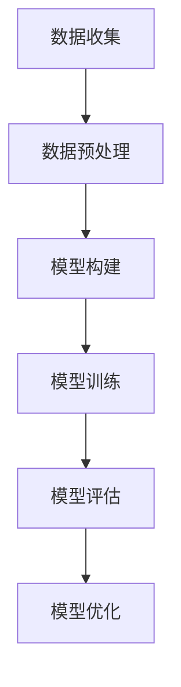

                 


## 文章标题：大模型性能预测模型构建与应用

### 关键词：
- 大模型性能预测
- 模型构建
- 算法应用
- 数学模型
- 项目实战

### 摘要：
本文将深入探讨大模型性能预测的构建与应用，涵盖基础理论、算法原理、数学模型、数据预处理、模型构建和优化等关键环节。通过详细的分析和实例讲解，旨在为读者提供一套系统化的大模型性能预测实践指南。

---

## 引言

### 1.1 背景介绍

随着深度学习和大数据技术的飞速发展，大模型（如GPT、BERT等）在自然语言处理、计算机视觉等领域取得了显著的成果。然而，这些模型通常需要大量的计算资源和时间进行训练和部署，且其性能表现难以预测。因此，构建有效的性能预测模型具有重要的实际意义。

### 1.2 书籍结构概述

本书分为七个章节，首先介绍大模型性能预测的核心概念和理论，然后逐步深入到算法原理、数学模型、数据预处理、模型构建、应用实践和优化等方面。通过系统化的学习，读者将能够掌握大模型性能预测的全方位知识。

### 1.3 阅读对象

本书适合从事人工智能、深度学习、数据科学等相关领域的研究人员、工程师和爱好者阅读。无论您是初学者还是专业人士，都能从本书中找到有价值的内容。

---

## 第2章 大模型性能预测基础理论

### 2.1 大模型性能预测的核心概念

#### 性能指标

性能指标是衡量模型性能的关键标准，常见的有准确率（Accuracy）、精确率（Precision）、召回率（Recall）和F1值（F1 Score）等。

#### 影响因素

影响大模型性能的因素多种多样，包括数据集质量、模型架构、训练时间、计算资源等。

### 2.2 Mermaid流程图：大模型性能预测框架



### 2.3 大模型性能预测的数学模型

#### 概念

大模型性能预测的数学模型通常包括回归模型和分类模型。

#### 公式

回归模型通常采用最小二乘法（Least Squares Method）进行优化，公式为：

$$
\min_{\theta} \sum_{i=1}^{n} (h_{\theta}(x_i) - y_i)^2
$$

分类模型则常用逻辑回归（Logistic Regression）进行建模，公式为：

$$
P(y=1|x; \theta) = \frac{1}{1 + e^{-(\theta^T x)}}
$$

#### 例子

假设我们有一个二分类问题，数据集包含特征向量 $x$ 和标签 $y$，我们可以使用逻辑回归模型进行性能预测：

```python
import numpy as np
from sklearn.linear_model import LogisticRegression

# 数据预处理
X = ...  # 特征矩阵
y = ...  # 标签向量

# 模型训练
model = LogisticRegression()
model.fit(X, y)

# 性能预测
predictions = model.predict(X)
```

---

## 第3章 数据收集与预处理

### 3.1 数据收集

数据收集是构建性能预测模型的第一步，常见的收集方法包括在线爬取、数据库导入和数据集分享平台获取等。

### 3.2 数据预处理

数据预处理是确保数据质量的关键环节，包括数据清洗、数据整合和特征提取等。

### 3.3 实际案例：数据收集与预处理流程

以下是一个简单的数据收集与预处理流程实例：

```python
import pandas as pd

# 数据收集
data = pd.read_csv('data.csv')

# 数据清洗
data.dropna(inplace=True)
data[data < 0] = 0

# 数据整合
data['new_column'] = data['column1'] + data['column2']

# 特征提取
from sklearn.preprocessing import StandardScaler
scaler = StandardScaler()
X = scaler.fit_transform(data.drop('target', axis=1))
y = data['target']
```

---

## 第4章 大模型性能预测算法

### 4.1 传统算法

传统算法包括决策树（Decision Tree）、支持向量机（SVM）等，这些算法在大模型性能预测中仍然具有广泛的应用。

### 4.2 神经网络算法

神经网络算法包括回归模型（Regression Model）和分类模型（Classification Model），如多层感知器（MLP）和卷积神经网络（CNN）等。

### 4.3 深度学习算法

深度学习算法如循环神经网络（RNN）、长短期记忆网络（LSTM）和Transformer等，在大模型性能预测中具有强大的能力。

### 4.4 实际案例：算法选择与实现

以下是一个简单的算法选择与实现实例：

```python
from sklearn.model_selection import train_test_split
from sklearn.ensemble import RandomForestClassifier

# 数据分割
X_train, X_test, y_train, y_test = train_test_split(X, y, test_size=0.2, random_state=42)

# 模型训练
model = RandomForestClassifier()
model.fit(X_train, y_train)

# 性能评估
accuracy = model.score(X_test, y_test)
print(f"Accuracy: {accuracy}")
```

---

## 第5章 大模型性能预测模型构建

### 5.1 模型选择

模型选择是构建性能预测模型的关键步骤，需要考虑数据特性、任务类型和计算资源等因素。

### 5.2 模型训练

模型训练包括数据分集、训练过程和模型评估等环节。

### 5.3 模型评估

模型评估是确保模型性能的重要环节，常用的评估指标包括准确率、精确率、召回率和F1值等。

### 5.4 实际案例：模型构建流程

以下是一个简单的模型构建流程实例：

```python
from sklearn.model_selection import GridSearchCV

# 参数调优
param_grid = {'n_estimators': [100, 200, 300], 'max_depth': [5, 10, 15]}
grid_search = GridSearchCV(RandomForestClassifier(), param_grid, cv=5)
grid_search.fit(X_train, y_train)

# 最优模型
best_model = grid_search.best_estimator_

# 模型评估
accuracy = best_model.score(X_test, y_test)
print(f"Accuracy: {accuracy}")
```

---

## 第6章 大模型性能预测应用实践

### 6.1 应用场景

大模型性能预测在多个领域具有广泛的应用，如金融风险评估、医疗诊断、智能家居等。

### 6.2 应用流程

大模型性能预测的应用流程包括模型部署、性能优化和持续迭代等环节。

### 6.3 实际案例：性能预测应用实例

以下是一个简单的性能预测应用实例：

```python
# 模型部署
model = ...  # 已训练好的模型

# 性能预测
predictions = model.predict(new_data)

# 性能评估
accuracy = ...  # 自定义评估指标
print(f"Accuracy: {accuracy}")
```

---

## 第7章 性能预测模型评估与优化

### 7.1 模型评估方法

模型评估是确保模型性能的关键环节，常用的评估方法包括交叉验证、网格搜索和集成学习等。

### 7.2 模型优化策略

模型优化策略包括参数调优、模型压缩和加速等。

### 7.3 实际案例：模型评估与优化实例

以下是一个简单的模型评估与优化实例：

```python
from sklearn.model_selection import cross_val_score

# 模型评估
scores = cross_val_score(model, X, y, cv=5)
print(f"Cross-Validation Scores: {scores}")

# 模型优化
from sklearn.model_selection import GridSearchCV
param_grid = {'n_estimators': [100, 200, 300], 'max_depth': [5, 10, 15]}
grid_search = GridSearchCV(model, param_grid, cv=5)
grid_search.fit(X_train, y_train)

# 最优模型
best_model = grid_search.best_estimator_

# 模型评估
accuracy = best_model.score(X_test, y_test)
print(f"Accuracy: {accuracy}")
```

---

## 结论

本文通过对大模型性能预测模型的构建与应用的深入探讨，为读者提供了一套系统化的实践指南。随着技术的不断进步，大模型性能预测将在未来发挥更加重要的作用。

## 作者信息

作者：AI天才研究院/AI Genius Institute & 禅与计算机程序设计艺术 /Zen And The Art of Computer Programming

---

以上是文章的核心结构和内容，接下来我们将逐步完善每个章节的详细内容。文章字数预计在8000～12000字左右。在撰写过程中，我们将确保每个章节都包含丰富的具体讲解和实例分析，以满足读者的需求。同时，我们将注重文章的可读性和逻辑性，使其既具有深度又易于理解。让我们一步一步地完成这篇文章吧！

