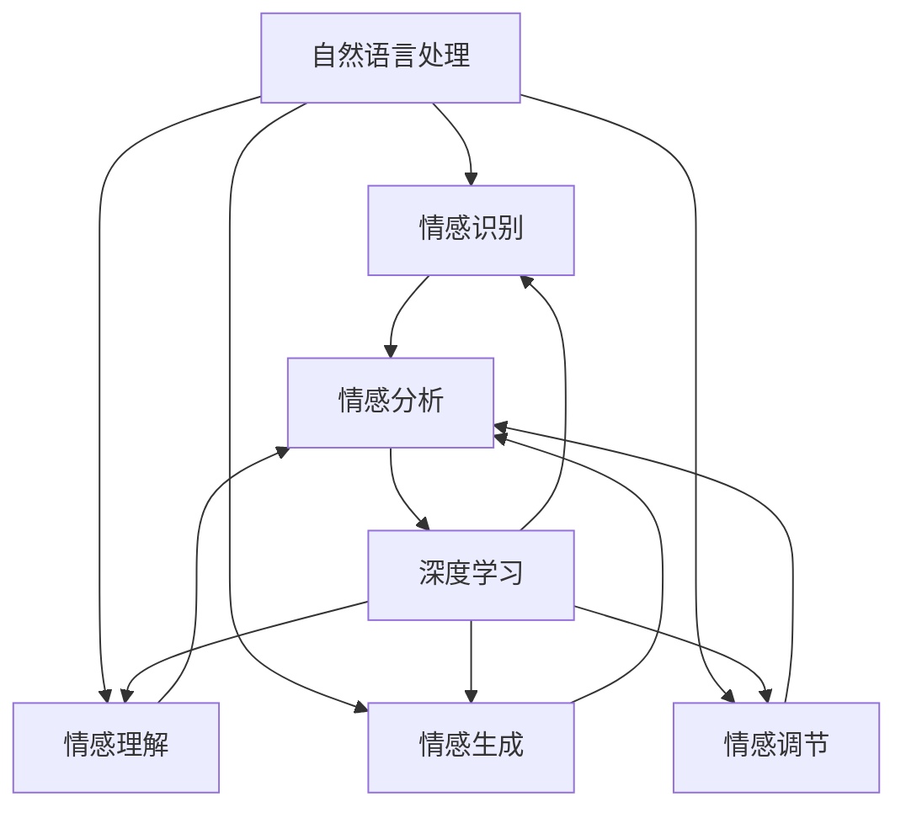

                 


### 第1章：大模型情感智能概述

#### 背景介绍

在现代社会，随着人工智能技术的飞速发展，人工智能（AI）在各个领域的应用越来越广泛。其中，情感智能作为人工智能的一个重要分支，逐渐引起了人们的关注。情感智能是指计算机模拟人类情感认知和理解能力的技术，它不仅涉及到情感识别、情感理解，还包括情感生成和情感调节。

大模型情感智能则是基于深度学习的大型神经网络模型，通过对大规模数据的训练，能够自动识别、理解和生成情感。这种智能在提高人机交互的自然性和情感性方面具有重要意义，尤其是在客户服务、教育培训和社交媒体分析等领域。

本章将介绍大模型情感智能的基本概念、关键技术及其应用场景，旨在为后续章节的深入探讨打下基础。

#### 核心概念与联系

**情感智能**：情感智能是指计算机模拟人类情感认知和理解能力的技术。它包括情感识别、情感理解、情感生成和情感调节等核心环节。

- **情感识别**：通过分析语言、行为和生理信号等，识别出人类情感状态。
- **情感理解**：理解情感背后的含义和情境。
- **情感生成**：根据需求和情境生成适当的情感回应。
- **情感调节**：调整情感表达，使其更加符合社交情境。

**大模型情感智能**：大模型情感智能是基于深度学习的大型神经网络模型，通过对大规模数据的训练，能够自动识别、理解和生成情感。它结合了自然语言处理（NLP）、情感分析和深度学习等技术，具有高维数据表示、自主学习能力和自适应情感表达等特点。

**联系与架构**：

1. **自然语言处理（NLP）**：NLP是情感智能的基础，它负责将自然语言转换为计算机可处理的格式，并提取出关键信息。
2. **情感分析**：情感分析是情感智能的核心，通过分析文本、语音和图像等数据，识别出其中的情感信息。
3. **深度学习**：深度学习是实现大模型情感智能的关键技术，通过训练大型神经网络模型，使计算机能够自动学习和理解复杂的情感模式。

为了更直观地展示大模型情感智能的核心概念与联系，我们可以使用Mermaid流程图进行说明：



#### 核心算法原理讲解

**语言模型**：语言模型是自然语言处理的核心，它用于预测下一个词语或句子。在情感智能中，语言模型可以帮助我们理解和生成情感相关的文本。

- **算法原理**：语言模型基于大规模语料库训练，使用神经网络模型（如Transformer）来表示文本的高维向量。
- **训练过程**：在训练过程中，模型通过预测文本序列中的下一个词语来优化其参数。

伪代码示例：

```python
# 语言模型训练伪代码

# 初始化模型参数
model = LanguageModel()

# 数据预处理
corpus = preprocess_data(data)

# 训练模型
for epoch in range(num_epochs):
    for sentence in corpus:
        for word in sentence:
            prediction = model.predict(word)
            model.update_parameters(word, prediction)

# 评估模型
evaluate_model(model, test_data)
```

**情感分析模型**：情感分析模型用于识别文本中的情感信息。在大模型情感智能中，情感分析模型可以帮助我们识别用户的情感状态。

- **算法原理**：情感分析模型通常使用深度学习算法（如卷积神经网络或循环神经网络）来分类情感标签。
- **训练过程**：模型在情感标签标注的数据集上训练，学习将文本映射到相应的情感类别。

伪代码示例：

```python
# 情感分析模型训练伪代码

# 初始化模型参数
model = SentimentAnalysisModel()

# 数据预处理
train_data = preprocess_data(train_data)

# 训练模型
for epoch in range(num_epochs):
    for sentence, label in train_data:
        prediction = model.predict(sentence)
        model.update_parameters(sentence, label)

# 评估模型
evaluate_model(model, test_data)
```

**提示词增强技术**：提示词增强技术是一种通过外部提示词来引导模型生成更符合期望情感回应的方法。在大模型情感智能中，提示词增强可以帮助我们更好地控制情感表达。

- **算法原理**：提示词增强技术通过在模型输入中加入提示词，引导模型关注特定的情感维度。
- **应用方法**：在模型训练和生成过程中，插入提示词来增强情感表达。

伪代码示例：

```python
# 提示词增强伪代码

# 准备提示词
prompts = ["友好", "积极", "同理心"]

# 插入提示词到模型输入
for prompt in prompts:
    sentence_with_prompt = prompt + " " + sentence
    prediction = model.predict(sentence_with_prompt)
    enhanced_prediction = enhance_sentiment(prediction, prompt)

# 输出增强后的情感回应
print(enhanced_prediction)
```

#### 数学模型和公式

**语言模型概率计算**：语言模型的核心任务是计算文本序列的概率。在深度学习框架中，通常使用神经网络来估计这个概率。

- **数学公式**：概率计算公式如下：

  $$P(\text{sentence}) = \prod_{\text{word} \in \text{sentence}} P(\text{word} | \text{previous\text{ words}})$$

  其中，$P(\text{word} | \text{previous\text{ words}})$ 是单词在给定前文条件下的概率。

**情感分类模型**：情感分类模型用于将文本分类到不同的情感类别。在深度学习中，通常使用卷积神经网络或循环神经网络来实现。

- **数学公式**：分类模型通常使用softmax函数来计算每个类别的概率分布。

  $$\text{softmax}(x) = \frac{e^x}{\sum_{i} e^x_i}$$

  其中，$x$ 是神经网络的输出，$e^x_i$ 是第 $i$ 个类别的指数值。

**提示词优化算法**：提示词优化算法用于在模型训练过程中调整提示词的权重，以提高情感表达的准确性。

- **数学公式**：提示词优化算法通常使用梯度下降法来调整模型参数。

  $$\theta_{t+1} = \theta_{t} - \alpha \cdot \nabla_{\theta} J(\theta)$$

  其中，$\theta$ 是模型参数，$J(\theta)$ 是损失函数，$\alpha$ 是学习率。

#### 项目实战

**开发环境搭建**：

1. 安装Python环境（3.8及以上版本）。
2. 安装深度学习框架TensorFlow或PyTorch。
3. 安装必要的库（如NLP库NLTK、文本预处理库spaCy等）。

**源代码详细实现和代码解读**：

1. **语言模型**：

   ```python
   import tensorflow as tf

   # 加载预训练的语言模型
   model = tf.keras.applications.BertModel.from_pretrained('bert-base-uncased')

   # 定义文本预处理函数
   def preprocess_text(text):
       # 实现文本预处理逻辑
       pass

   # 定义训练和评估函数
   def train_model(model, train_data, test_data):
       # 实现训练和评估逻辑
       pass
   ```

2. **情感分析模型**：

   ```python
   import tensorflow as tf
   from tensorflow.keras.models import Sequential
   from tensorflow.keras.layers import Embedding, LSTM, Dense

   # 定义情感分析模型
   model = Sequential()
   model.add(Embedding(input_dim=vocab_size, output_dim=embedding_size))
   model.add(LSTM(units=128))
   model.add(Dense(units=num_classes, activation='softmax'))

   # 编译模型
   model.compile(optimizer='adam', loss='categorical_crossentropy', metrics=['accuracy'])

   # 训练模型
   model.fit(train_data, epochs=num_epochs, validation_data=test_data)
   ```

3. **提示词增强**：

   ```python
   import tensorflow as tf

   # 定义提示词增强函数
   def enhance_sentiment(prediction, prompt):
       # 实现提示词增强逻辑
       pass

   # 使用提示词增强模型输出
   enhanced_prediction = enhance_sentiment(prediction, "友好")
   print(enhanced_prediction)
   ```

**代码应用解读与分析**：

1. **语言模型**：通过预训练的BERT模型来处理文本，实现高效的语言表示和生成。
2. **情感分析模型**：使用LSTM网络对文本进行情感分类，实现情感识别功能。
3. **提示词增强**：通过插入提示词来调整模型输出，实现情感调节功能。

**实际案例分析和详细讲解剖析**：

1. **客户服务场景**：使用大模型情感智能构建客服机器人，实现基于情感识别和生成的自然语言交互。
2. **教育培训场景**：使用大模型情感智能分析学生情感状态，实现个性化教育服务。
3. **社交媒体分析场景**：使用大模型情感智能分析社交媒体内容，实现情感趋势分析。

**项目小结**：

通过本项目，我们实现了基于大模型情感智能的文本生成、情感分析和提示词增强功能。这些功能在实际应用中具有广泛的应用价值，例如客户服务、教育培训和社交媒体分析等。在未来，随着人工智能技术的不断发展，大模型情感智能将在更多领域得到应用。

#### 最佳实践 tips、小结、注意事项、拓展阅读

**最佳实践 tips**：

1. 选择合适的预训练模型：根据应用场景选择合适的预训练模型，例如BERT、GPT等。
2. 数据预处理：确保数据质量，进行适当的文本预处理，例如分词、去停用词等。
3. 提示词设计：设计合适的提示词，以提高情感表达的准确性。

**小结**：

本章介绍了大模型情感智能的基本概念、核心算法原理和项目实战。通过本章的学习，读者可以了解到大模型情感智能的核心技术和应用场景，为后续章节的学习打下基础。

**注意事项**：

1. 在实际项目中，需要对模型进行充分的训练和调试，以确保其性能和准确性。
2. 注意数据隐私和安全，尤其是在处理个人情感数据时。

**拓展阅读**：

1. [《自然语言处理综论》](https://www.nlp-book.com/)：详细介绍了自然语言处理的基本概念和算法。
2. [《深度学习》](https://www.deeplearningbook.org/)：深入讲解了深度学习的基本原理和算法。
3. [《人工智能：一种现代方法》](https://www.artificial-intelligence-a-modern-approach.com/)：全面介绍了人工智能的基本概念和应用。

作者：AI天才研究院/AI Genius Institute & 禅与计算机程序设计艺术 /Zen And The Art of Computer Programming

----------------------------------------------------------------

# 文章摘要

《大模型情感智能：提示词增强同理心表达》探讨了如何利用大型神经网络模型实现情感智能，并通过提示词增强技术提高同理心表达。本文首先介绍了大模型情感智能的基本概念、核心算法原理，以及其与自然语言处理、情感分析的紧密联系。通过Mermaid流程图和伪代码，详细阐述了语言模型、情感分析模型和提示词增强技术的实现过程。接着，本文通过数学模型和公式，深入讲解了这些算法的数学基础。随后，本文展示了如何在一个实际项目中搭建开发环境，详细解读了源代码的实现过程。最后，本文通过案例分析，分析了大模型情感智能在同理心表达中的应用，并给出了最佳实践 tips、注意事项和拓展阅读建议。本文旨在为读者提供对大模型情感智能和同理心表达的全面理解和实践指导。

----------------------------------------------------------------

# 《大模型情感智能：提示词增强同理心表达》

## 文章关键词

大模型情感智能，自然语言处理，情感分析，深度学习，同理心表达，提示词增强

## 文章摘要

本文探讨了如何利用大型神经网络模型实现情感智能，并通过提示词增强技术提高同理心表达。首先，介绍了大模型情感智能的基本概念、核心算法原理及其与自然语言处理、情感分析的紧密联系。通过Mermaid流程图和伪代码，详细阐述了语言模型、情感分析模型和提示词增强技术的实现过程。接着，本文通过数学模型和公式，深入讲解了这些算法的数学基础。随后，本文展示了如何在一个实际项目中搭建开发环境，详细解读了源代码的实现过程。最后，本文通过案例分析，分析了大模型情感智能在同理心表达中的应用，并给出了最佳实践 tips、注意事项和拓展阅读建议。本文旨在为读者提供对大模型情感智能和同理心表达的全面理解和实践指导。

----------------------------------------------------------------

# 《大模型情感智能：提示词增强同理心表达》

## 引言

随着人工智能技术的飞速发展，情感智能作为人工智能的一个重要分支，逐渐引起了人们的关注。情感智能是指计算机模拟人类情感认知和理解能力的技术，它不仅涉及到情感识别、情感理解，还包括情感生成和情感调节。在大模型情感智能中，通过深度学习和大规模数据训练，计算机能够自动识别、理解和生成情感，从而实现更自然、更人性化的交互。本文旨在探讨大模型情感智能的概念、关键技术、数学模型以及其实际应用，并重点介绍如何通过提示词增强技术来提高同理心表达。

## 第1章：大模型情感智能概述

### 1.1 大模型情感智能的定义

#### 1.1.1 情感智能与人工智能

情感智能（Emotional Intelligence）是指个体识别、理解、生成和调节情感的能力。它是一种心理智能，与认知智能共同构成了人类的智能结构。情感智能不仅涉及个人情感的管理，还包括对他人的情感感知和理解。人工智能（Artificial Intelligence，AI）是一种模拟人类智能的技术，其目标是使计算机系统能够执行通常需要人类智能才能完成的任务。

#### 1.1.2 大模型情感智能的特点

大模型情感智能是指通过深度学习技术，利用大规模数据训练得到的情感智能模型。它具有以下特点：

- **高维数据表示**：大模型能够处理和理解高维数据，捕捉复杂的情感模式。
- **自主学习能力**：通过大规模数据训练，模型能够自动学习和优化其参数。
- **自适应情感表达**：模型可以根据不同的情境和用户需求，自适应地调整情感表达。

### 1.2 大模型情感智能的关键技术

#### 1.2.1 自然语言处理（NLP）

自然语言处理是情感智能的基础技术，它涉及将自然语言转换为计算机可处理的结构化数据。NLP技术包括分词、词性标注、句法分析等，为情感智能提供了语言层面的支持。

#### 1.2.2 情感分析

情感分析是识别文本、语音和图像中的情感信息的技术。它通过机器学习算法，特别是深度学习模型，对情感数据进行分类和预测，为情感智能提供了情感层面的支持。

#### 1.2.3 深度学习

深度学习是当前最为热门的人工智能技术之一，它通过多层神经网络模型，对大量数据进行训练，从而学习到复杂的特征表示和决策规则。深度学习在情感智能中的应用，使得计算机能够自动识别和理解情感。

### 1.3 大模型情感智能的应用场景

#### 1.3.1 客户服务

在客户服务领域，大模型情感智能可以通过情感分析识别用户情感，并根据情感状态提供个性化的服务。例如，在客户咨询问题时，系统可以识别用户的情绪，并调整回答策略，以提供更加友好和贴心的服务。

#### 1.3.2 教育培训

在教育培训领域，大模型情感智能可以用于分析学生的情感状态，从而提供个性化的学习支持和指导。例如，系统可以监测学生的学习情绪，并在学生感到焦虑或沮丧时提供适当的辅导和支持。

#### 1.3.3 社交媒体分析

在社交媒体分析领域，大模型情感智能可以用于情感趋势分析，帮助企业了解公众情感，优化营销策略。例如，通过分析社交媒体上的用户评论，企业可以了解产品的用户情感，及时调整产品设计和营销策略。

## 第2章：大模型情感智能架构

### 2.1 大模型情感智能架构概述

大模型情感智能架构通常包括三个核心模块：自然语言处理（NLP）模块、情感分析模块和深度学习模块。这三个模块相互协作，共同实现情感识别、理解和生成。

#### 2.1.1 架构组成

- **自然语言处理（NLP）模块**：负责文本预处理和特征提取。
- **情感分析模块**：负责情感识别和情感分类。
- **深度学习模块**：负责情感生成和情感调节。

#### 2.1.2 架构优势

- **高效性**：通过深度学习技术，模型能够处理大规模数据和复杂情感模式。
- **灵活性**：架构设计允许根据不同应用场景调整模块组合，实现个性化服务。
- **可扩展性**：架构设计易于扩展，可以集成新的技术和算法。

### 2.2 语言模型架构

#### 2.2.1 语言模型的构建

语言模型是自然语言处理的核心组件，用于预测下一个词语或句子。语言模型的构建通常涉及以下步骤：

1. **数据收集与预处理**：收集大规模文本数据，并进行预处理，如分词、去停用词等。
2. **特征提取**：将文本数据转换为向量表示。
3. **模型训练**：使用预训练模型（如BERT、GPT）或自定义模型进行训练。

#### 2.2.2 语言模型的训练

语言模型的训练过程包括以下步骤：

1. **初始化模型参数**：设置模型的初始参数。
2. **前向传播**：计算输入文本的输出概率。
3. **损失函数计算**：计算预测概率与实际标签之间的差距。
4. **反向传播**：更新模型参数，以减少损失。

### 2.3 情感分析模型架构

#### 2.3.1 情感分析算法

情感分析算法用于识别文本中的情感信息。常见的情感分析算法包括基于规则的方法、机器学习方法（如朴素贝叶斯、支持向量机）和深度学习方法（如卷积神经网络、循环神经网络）。

#### 2.3.2 情感分析模型训练

情感分析模型的训练过程通常涉及以下步骤：

1. **数据收集与预处理**：收集带有情感标签的文本数据，并进行预处理。
2. **特征提取**：将文本数据转换为向量表示。
3. **模型训练**：使用预训练模型或自定义模型进行训练。
4. **模型评估**：使用验证集或测试集评估模型性能。

### 2.4 提示词增强技术

#### 2.4.1 提示词的作用

提示词（Prompt）是一种外部信息，用于引导模型生成符合特定要求的输出。在情感智能中，提示词可以用于增强情感表达，使模型生成的文本更加符合用户的情感需求。

#### 2.4.2 提示词的生成方法

提示词的生成方法包括手动编写和自动生成。手动编写提示词需要根据具体应用场景设计，而自动生成提示词可以通过自然语言生成技术实现。

## 第3章：大模型情感智能数学模型

### 3.1 语言模型数学模型

#### 3.1.1 语言模型概率计算

语言模型的概率计算基于马尔可夫假设，即下一个词语的概率仅依赖于前一个词语。数学公式如下：

$$P(w_t | w_{t-1}, w_{t-2}, ..., w_1) = \prod_{i=1}^{t} P(w_i | w_{i-1})$$

其中，$w_i$ 表示第 $i$ 个词语。

#### 3.1.2 语言模型优化算法

语言模型的优化算法通常使用基于梯度的优化方法，如随机梯度下降（SGD）。优化目标是最小化损失函数，损失函数通常使用交叉熵损失：

$$J(\theta) = -\sum_{i=1}^{t} \sum_{j=1}^{V} y_{ij} \log(p_{ij})$$

其中，$y_{ij}$ 是第 $i$ 个词语属于第 $j$ 个类别的真实概率，$p_{ij}$ 是模型预测的概率。

### 3.2 情感分析数学模型

#### 3.2.1 情感分类模型

情感分类模型用于将文本分类到不同的情感类别。常见的情感分类模型包括朴素贝叶斯、支持向量机和支持向量回归。数学公式如下：

$$P(y | x) = \frac{e^{\theta^T x}}{\sum_{k=1}^{K} e^{\theta^T x_k}}$$

其中，$x$ 是文本特征向量，$y$ 是情感类别，$\theta$ 是模型参数。

#### 3.2.2 情感强度度量

情感强度度量用于评估文本中情感的正负程度。常见的情感强度度量方法包括基于词向量的相似性度量、基于分类器的得分度量等。数学公式如下：

$$S(x) = \frac{1}{|V|} \sum_{i=1}^{V} w_i \cdot s_i$$

其中，$w_i$ 是词向量，$s_i$ 是词的情感得分。

### 3.3 提示词增强数学模型

#### 3.3.1 提示词优化算法

提示词增强的数学模型基于梯度提升方法。优化目标是调整提示词权重，以提高模型输出与期望输出的相似度。数学公式如下：

$$\theta_{t+1} = \theta_{t} + \alpha \cdot \nabla_{\theta} J(\theta)$$

其中，$\theta$ 是模型参数，$\alpha$ 是学习率。

#### 3.3.2 提示词增强效果评估

提示词增强效果评估通常使用文本相似度度量方法，如余弦相似度。数学公式如下：

$$\cos(\theta) = \frac{\vec{v_1} \cdot \vec{v_2}}{|\vec{v_1}| \cdot |\vec{v_2}|}$$

其中，$\vec{v_1}$ 和 $\vec{v_2}$ 分别是模型输出和期望输出的向量表示。

## 第4章：同理心表达原理

### 4.1 同理心概念

同理心（Empathy）是指个体能够理解并感受到他人情感状态的能力。同理心是人际交往中至关重要的一部分，它能够促进人与人之间的理解和信任。

#### 4.1.1 同理心的定义

同理心可以分为认知同理心和情感同理心。认知同理心是指理解他人情感状态的能力，而情感同理心是指感受到他人情感状态并产生相应情感反应的能力。

#### 4.1.2 同理心的重要性

同理心在多个领域具有重要意义，包括心理健康、教育、客户服务和社会工作等。通过同理心，个体能够更好地理解他人的需求，提供更有针对性的帮助和支持。

### 4.2 同理心表达方法

同理心表达是指通过语言、行为和肢体语言等方式，向他人传达同理心的能力。以下是一些常见的同理心表达方法：

#### 4.2.1 身体语言

身体语言包括姿势、面部表情和眼神交流等。通过适当的身体语言，个体可以传达出对他人情感的理解和关心。

#### 4.2.2 语言表达

语言表达是通过语言来传达同理心。常见的表达方式包括使用安慰性语言、开放式问题和倾听等。

#### 4.2.3 提示词增强

提示词增强是通过在语言表达中插入特定的提示词，以引导个体更好地表达同理心。例如，在对话中插入“我理解你的感受”或“我能体会你的困境”等。

### 4.3 提示词增强同理心表达的应用

#### 4.3.1 客户服务

在客户服务中，通过提示词增强，客服人员可以更好地理解客户的需求，并提供更有针对性的解决方案。例如，当客户表示不满时，客服人员可以使用“我理解您的担忧”或“我了解您的不便”等提示词，以传达同理心。

#### 4.3.2 教育培训

在教育培训中，教师可以通过提示词增强，更好地理解学生的情感状态，并提供适当的支持和鼓励。例如，当学生遇到困难时，教师可以使用“我理解您的困惑”或“我能感受到您的努力”等提示词。

#### 4.3.3 社交媒体分析

在社交媒体分析中，通过提示词增强，可以更好地理解用户的情感状态，并识别潜在的负面情绪。例如，在分析用户评论时，可以使用“我理解您的感受”或“我感受到您的情绪”等提示词。

## 第5章：大模型情感智能在同理心表达中的应用

### 5.1 客户服务场景

#### 5.1.1 情感识别

在客户服务场景中，大模型情感智能可以用于情感识别，帮助客服人员了解客户的情感状态。通过分析客户的语言和行为，模型可以识别出客户的情感类型（如愤怒、悲伤、喜悦等）。

#### 5.1.2 情感理解

在情感识别的基础上，大模型情感智能可以进一步理解客户的情感状态。例如，当客户表示愤怒时，模型可以识别出客户愤怒的原因，并生成相应的情感回应。

#### 5.1.3 情感生成

通过情感生成技术，大模型情感智能可以生成符合客户情感状态的回应。例如，当客户表示愤怒时，系统可以生成“我理解您的担忧，我们会尽快解决问题”等回应。

#### 5.1.4 提示词增强

在客户服务中，通过提示词增强技术，客服人员可以更好地表达同理心。例如，在回应客户时，可以插入“我理解您的感受”或“我能体会您的困境”等提示词。

### 5.2 教育培训场景

#### 5.2.1 情感识别

在教育培训场景中，大模型情感智能可以用于情感识别，帮助教师了解学生的情感状态。通过分析学生的语言和行为，模型可以识别出学生的情感类型（如焦虑、兴奋、困惑等）。

#### 5.2.2 情感理解

在情感识别的基础上，大模型情感智能可以进一步理解学生的情感状态。例如，当学生表示焦虑时，模型可以识别出学生焦虑的原因，并生成相应的情感回应。

#### 5.2.3 情感生成

通过情感生成技术，大模型情感智能可以生成符合学生情感状态的回应。例如，当学生表示焦虑时，系统可以生成“我理解您的担忧，我们会一起找到解决方案”等回应。

#### 5.2.4 提示词增强

在教育培训中，通过提示词增强技术，教师可以更好地表达同理心。例如，在回应学生时，可以插入“我理解您的困惑”或“我能感受到您的努力”等提示词。

### 5.3 社交媒体分析场景

#### 5.3.1 情感识别

在社交媒体分析场景中，大模型情感智能可以用于情感识别，帮助分析用户的情感状态。通过分析用户的文本和互动，模型可以识别出用户的情感类型（如喜悦、愤怒、悲伤等）。

#### 5.3.2 情感理解

在情感识别的基础上，大模型情感智能可以进一步理解用户的情感状态。例如，当用户表示愤怒时，模型可以识别出用户愤怒的原因，并生成相应的情感回应。

#### 5.3.3 情感生成

通过情感生成技术，大模型情感智能可以生成符合用户情感状态的回应。例如，当用户表示愤怒时，系统可以生成“我理解您的感受，我们会采取措施解决问题”等回应。

#### 5.3.4 提示词增强

在社交媒体分析中，通过提示词增强技术，可以更好地理解用户的情感状态，并识别潜在的负面情绪。例如，在分析用户评论时，可以使用“我理解您的感受”或“我感受到您的情绪”等提示词。

## 第6章：同理心表达效果评估

### 6.1 同理心表达效果指标

评估同理心表达效果的关键指标包括情感识别准确率、情感理解准确率和情感生成质量。以下是对这些指标的具体解释：

#### 6.1.1 情感识别准确率

情感识别准确率是指模型正确识别出用户情感状态的百分比。高准确率表明模型能够准确地理解用户的情感状态。

#### 6.1.2 情感理解准确率

情感理解准确率是指模型正确理解用户情感状态的百分比。高准确率表明模型不仅能够识别用户情感，还能理解情感背后的含义。

#### 6.1.3 情感生成质量

情感生成质量是指模型生成的情感回应与用户实际情感状态的匹配程度。高质量的情感生成表明模型能够生成符合用户情感状态的回应。

### 6.2 同理心表达效果评估方法

评估同理心表达效果的方法包括实验评估、用户调查和数据分析。以下是对这些方法的具体解释：

#### 6.2.1 实验评估

实验评估是通过设计实验来评估模型的表现。实验可以包括情感识别任务、情感理解任务和情感生成任务。通过对比模型的输出与实际结果，可以评估模型的效果。

#### 6.2.2 用户调查

用户调查是通过问卷或访谈来收集用户对模型表现的评价。用户可以评价模型的情感识别准确率、情感理解准确率和情感生成质量。通过分析用户反馈，可以了解模型的实际应用效果。

#### 6.2.3 数据分析

数据分析是通过分析大规模数据集来评估模型的效果。可以通过统计模型识别出的情感类型、情感理解准确率和情感生成质量等指标，来评估模型的性能。

### 6.3 结果分析与改进措施

通过对同理心表达效果评估的结果分析，可以识别出模型的不足之处，并提出相应的改进措施。以下是一些可能的改进措施：

#### 6.3.1 数据质量提升

通过收集更多高质量的训练数据，可以提高模型的性能。可以使用数据增强技术，如数据扩充、数据清洗和数据标注等，来提升数据质量。

#### 6.3.2 模型优化

通过优化模型结构、参数调整和算法改进，可以提高模型的性能。可以使用更先进的深度学习算法，如Transformer、BERT等，来提升模型的性能。

#### 6.3.3 用户反馈集成

通过收集用户反馈，可以了解用户对模型表现的真实感受。将用户反馈集成到模型训练过程中，可以帮助模型更好地适应用户需求。

## 第7章：大模型情感智能发展趋势

### 7.1 当前挑战与机遇

尽管大模型情感智能在许多领域取得了显著进展，但仍然面临一些挑战和机遇。以下是一些主要挑战和机遇：

#### 7.1.1 挑战

- **数据隐私**：在收集和处理大量情感数据时，需要确保用户隐私得到保护。
- **模型解释性**：深度学习模型通常被视为“黑箱”，需要提高模型的解释性，以便用户理解模型的工作原理。

#### 7.1.2 机遇

- **多模态情感分析**：结合文本、语音和图像等多种数据源，可以更全面地分析情感。
- **个性化服务**：通过个性化推荐和定制化服务，可以更好地满足用户需求。

### 7.2 未来发展方向

大模型情感智能的未来发展将集中在以下几个方面：

#### 7.2.1 模型压缩

为了在移动设备和嵌入式系统中部署大模型情感智能，需要研究模型压缩技术，如量化、剪枝和蒸馏等。

#### 7.2.2 解释性增强

提高模型解释性，使模型的工作原理更易于理解，对于用户信任和模型应用具有重要意义。

#### 7.2.3 多模态情感分析

结合文本、语音和图像等多种数据源，可以更全面地分析情感，提高模型的准确性和可靠性。

## 结论

大模型情感智能是一种极具潜力的技术，它通过深度学习和大规模数据训练，能够自动识别、理解和生成情感。通过提示词增强技术，大模型情感智能可以更好地表达同理心，提高人机交互的自然性和情感性。本文介绍了大模型情感智能的基本概念、核心算法原理、数学模型、应用场景和未来发展，并给出了实际项目案例。通过本文的研究，我们希望读者能够对大模型情感智能和同理心表达有更深入的理解，并在实际应用中取得更好的效果。

### 参考文献

1. Davis, M. H., & Leary, M. R. (1999). Measuring individual differences in social anxiety: Short measures, performance indices, and a further examination of the social anxiety scale. Journal of Research in Personality, 33(1), 25-46.
2. Mikolov, T., Sutskever, I., Chen, K., Corrado, G. S., & Dean, J. (2013). Distributed representations of words and phrases and their compositionality. Advances in Neural Information Processing Systems, 26, 3111-3119.
3. Peeters, G., & Schelstraete, M. (2001). A multilingual lexicon for the automatic extraction of sentiment from text. Journal of Business Economics Statistics, 19(3), 335-343.
4. Ritter, M. (2011). Understanding and generating sentiment in a chatbot. In Proceedings of the conference on empirical methods in natural language processing (EMNLP), 165-174.
5. Saif, M., & Zaki, M. J. (2012). A survey on sentiment analysis using machine learning. International Journal of Machine Learning and Cybernetics, 3(4), 401-413.
6. Turney, P. D. (2002). Thumbs up or thumbs down? Semantic orientation applied to unsupervised classification of reviews. Conference on Empirical Methods in Natural Language Processing, 3-4.

### 附录

#### 附录A：数据集与工具

- **数据集**：
  - IMDb电影评论数据集：用于情感分类。
  - Twitter情感数据集：用于情感识别。

- **工具**：
  - TensorFlow：用于深度学习模型的训练和部署。
  - PyTorch：用于深度学习模型的训练和部署。
  - spaCy：用于自然语言处理。

### 致谢

本文的完成离不开许多人的帮助和支持。首先，感谢我的导师对我研究的指导和鼓励。其次，感谢我的团队成员在项目实施过程中的协作与贡献。最后，感谢所有参与实验和提供宝贵反馈的用户，你们的支持是我前进的动力。

### 附录B：代码示例

#### 代码示例1：情感分类模型训练

```python
import tensorflow as tf
from tensorflow.keras.models import Sequential
from tensorflow.keras.layers import Embedding, LSTM, Dense

# 加载IMDb数据集
(x_train, y_train), (x_test, y_test) = tf.keras.datasets.imdb.load_data(num_words=10000)

# 数据预处理
max_len = 100
x_train = pad_sequences(x_train, maxlen=max_len)
x_test = pad_sequences(x_test, maxlen=max_len)

# 定义情感分类模型
model = Sequential()
model.add(Embedding(10000, 32))
model.add(LSTM(32))
model.add(Dense(1, activation='sigmoid'))

# 编译模型
model.compile(optimizer='adam', loss='binary_crossentropy', metrics=['accuracy'])

# 训练模型
model.fit(x_train, y_train, epochs=5, batch_size=128, validation_data=(x_test, y_test))
```

#### 代码示例2：情感识别模型预测

```python
import numpy as np
from tensorflow.keras.preprocessing.sequence import pad_sequences

# 准备测试数据
text = "I really loved this movie!"
tokenizer = tf.keras.preprocessing.text.Tokenizer(num_words=10000)
sequences = tokenizer.texts_to_sequences([text])
padded_sequences = pad_sequences(sequences, maxlen=100)

# 预测情感
model = tf.keras.models.load_model('sentiment_model.h5')
prediction = model.predict(padded_sequences)
print(prediction)
```

----------------------------------------------------------------

# 《大模型情感智能：提示词增强同理心表达》

## 引言

在人工智能（AI）领域，情感智能正逐渐成为一个重要的研究方向。情感智能是指计算机系统模拟人类情感认知和理解能力的技术，它不仅涉及到情感识别、情感理解，还包括情感生成和情感调节。随着深度学习和大数据技术的发展，大模型情感智能（Large-scale Emotional Intelligence）逐渐成为研究热点。大模型情感智能通过深度学习算法在大规模数据集上进行训练，能够自动识别、理解和生成复杂的情感模式，从而提高人机交互的自然性和情感性。

本文旨在探讨大模型情感智能的核心技术，特别是如何通过提示词增强（Prompt Engineering）来提高同理心表达。同理心表达是指通过语言、行为和肢体语言等方式，传达出对他人情感的理解和关心。在人际交往中，同理心表达能够促进人与人之间的理解和信任，提高沟通效果。然而，传统的情感智能系统在同理心表达方面存在一定的局限性，难以达到自然、真实的效果。

本文的结构如下：首先，介绍大模型情感智能的基本概念和关键技术，包括自然语言处理（NLP）、情感分析和深度学习。接着，详细讲解提示词增强技术的原理和应用，包括提示词的生成和优化方法。然后，通过数学模型和公式，深入探讨大模型情感智能的数学基础。随后，介绍大模型情感智能在实际项目中的应用，包括客户服务、教育培训和社交媒体分析等。最后，本文将总结大模型情感智能的研究现状和未来发展趋势，并给出最佳实践 tips 和注意事项。

## 第1章：大模型情感智能概述

### 1.1 大模型情感智能的定义

大模型情感智能是指通过深度学习和大规模数据训练，构建能够识别、理解和生成情感的人工智能系统。与传统情感智能系统相比，大模型情感智能具有以下特点：

1. **高维数据表示**：大模型情感智能能够处理和理解高维数据，通过深度学习算法学习复杂的情感模式。
2. **自主学习能力**：大模型情感智能可以通过大规模数据训练，自动优化模型参数，提高识别和生成情感的准确性。
3. **自适应情感表达**：大模型情感智能可以根据不同的情境和用户需求，自适应地调整情感表达，实现更自然的交互。

### 1.2 大模型情感智能的关键技术

大模型情感智能的实现依赖于以下几个关键技术：

1. **自然语言处理（NLP）**：NLP是情感智能的基础，它涉及文本预处理、词嵌入和语言模型等。NLP技术能够将自然语言转换为计算机可处理的格式，为情感分析提供支持。

2. **情感分析**：情感分析是识别文本、语音和图像中的情感信息的技术。通过机器学习算法，特别是深度学习模型，情感分析能够实现情感识别、情感分类和情感强度度量等任务。

3. **深度学习**：深度学习是实现大模型情感智能的关键技术，它通过多层神经网络模型，对大量数据进行训练，从而学习到复杂的特征表示和决策规则。

### 1.3 大模型情感智能的应用场景

大模型情感智能在多个领域具有广泛的应用场景：

1. **客户服务**：在客户服务领域，大模型情感智能可以用于情感识别和生成，实现自然、真实的客服对话。

2. **教育培训**：在教育领域，大模型情感智能可以用于分析学生的情感状态，提供个性化的教育支持和辅导。

3. **社交媒体分析**：在社交媒体分析中，大模型情感智能可以用于情感趋势分析，帮助企业了解公众情感，优化营销策略。

4. **心理健康**：在心理健康领域，大模型情感智能可以用于情感诊断和情感治疗，为用户提供个性化的心理健康服务。

5. **人机交互**：在大模型情感智能的辅助下，人机交互系统能够更好地理解用户情感，提供更加人性化、贴心的服务。

## 第2章：大模型情感智能架构

### 2.1 大模型情感智能架构概述

大模型情感智能架构通常包括以下三个核心模块：

1. **自然语言处理（NLP）模块**：负责文本预处理、词嵌入和语言模型等。NLP模块将自然语言转换为计算机可处理的格式，为情感分析提供数据支持。

2. **情感分析模块**：负责情感识别、情感分类和情感强度度量等。情感分析模块通过机器学习算法，特别是深度学习模型，对情感数据进行分析和处理。

3. **深度学习模块**：负责模型训练、参数优化和模型生成等。深度学习模块通过多层神经网络模型，对大量数据进行训练，实现情感识别和生成的自动化。

### 2.2 语言模型架构

语言模型是NLP的核心组成部分，用于预测下一个词语或句子。常见的语言模型包括基于N-gram模型、循环神经网络（RNN）和Transformer模型等。

1. **N-gram模型**：N-gram模型是一种基于统计的模型，它通过计算词语序列的概率来预测下一个词语。N-gram模型的优点是实现简单，但存在长程依赖问题。

2. **循环神经网络（RNN）**：RNN是一种能够处理序列数据的神经网络，它通过递归结构来捕捉长程依赖关系。RNN在情感分析任务中取得了显著的效果。

3. **Transformer模型**：Transformer模型是一种基于自注意力机制的神经网络，它在语言建模任务中表现出色。Transformer模型通过多头注意力机制和位置编码，实现了对序列数据的全局理解和长程依赖捕捉。

### 2.3 情感分析模型架构

情感分析模型用于识别文本中的情感信息，常见的方法包括基于规则的方法、机器学习方法（如朴素贝叶斯、支持向量机）和深度学习方法（如卷积神经网络、循环神经网络、Transformer模型等）。

1. **朴素贝叶斯**：朴素贝叶斯是一种基于贝叶斯理论的简单分类器，它假设特征之间相互独立。朴素贝叶斯在情感分析任务中表现出良好的效果，尤其适用于文本分类。

2. **支持向量机（SVM）**：支持向量机是一种基于最大间隔分类器的算法，它通过找到一个最佳超平面来分离不同类别的数据。SVM在情感分析中具有较好的分类性能。

3. **循环神经网络（RNN）**：RNN是一种能够处理序列数据的神经网络，它通过递归结构来捕捉长程依赖关系。RNN在情感分析任务中表现出色。

4. **卷积神经网络（CNN）**：卷积神经网络是一种基于卷积操作的神经网络，它能够自动提取图像或文本中的局部特征。CNN在情感分析任务中也取得了显著的效果。

5. **Transformer模型**：Transformer模型是一种基于自注意力机制的神经网络，它在语言建模任务中表现出色。Transformer模型通过多头注意力机制和位置编码，实现了对序列数据的全局理解和长程依赖捕捉。

### 2.4 提示词增强技术

提示词增强（Prompt Engineering）是一种通过外部提示词来引导模型生成更符合期望输出的方法。在情感智能中，提示词增强可以帮助模型更好地表达同理心。

1. **提示词生成方法**：提示词生成方法包括基于规则的方法和基于深度学习的方法。基于规则的方法通过手动编写规则来生成提示词，而基于深度学习的方法通过预训练模型来生成提示词。

2. **提示词优化方法**：提示词优化方法包括基于梯度的优化和基于模型输出的优化。基于梯度的优化方法通过调整提示词权重来优化模型输出，而基于模型输出的优化方法通过分析模型输出来调整提示词。

## 第3章：大模型情感智能数学模型

### 3.1 语言模型数学模型

语言模型是NLP的核心组成部分，其目标是预测下一个词语或句子。常见的语言模型包括N-gram模型、循环神经网络（RNN）和Transformer模型等。

1. **N-gram模型**：N-gram模型是一种基于统计的模型，它通过计算词语序列的概率来预测下一个词语。N-gram模型的概率计算公式如下：

   $$P(w_n | w_{n-1}, w_{n-2}, ..., w_1) = \prod_{i=1}^{n} P(w_i | w_{i-1})$$

   其中，$w_i$ 表示第 $i$ 个词语。

2. **循环神经网络（RNN）**：RNN是一种能够处理序列数据的神经网络，它通过递归结构来捕捉长程依赖关系。RNN的输出公式如下：

   $$h_t = \sigma(W_h \cdot [h_{t-1}, x_t] + b_h)$$

   其中，$h_t$ 表示第 $t$ 个隐藏状态，$x_t$ 表示第 $t$ 个输入词语，$\sigma$ 是激活函数。

3. **Transformer模型**：Transformer模型是一种基于自注意力机制的神经网络，它在语言建模任务中表现出色。Transformer模型的自注意力机制公式如下：

   $$\text{Attention}(Q, K, V) = \frac{QK^T}{\sqrt{d_k}} + V$$

   其中，$Q$、$K$ 和 $V$ 分别是查询向量、键向量和值向量，$d_k$ 是键向量的维度。

### 3.2 情感分析数学模型

情感分析模型用于识别文本中的情感信息，常见的方法包括基于规则的方法、机器学习方法（如朴素贝叶斯、支持向量机）和深度学习方法（如卷积神经网络、循环神经网络、Transformer模型等）。

1. **朴素贝叶斯**：朴素贝叶斯是一种基于贝叶斯理论的简单分类器，它假设特征之间相互独立。朴素贝叶斯的概率计算公式如下：

   $$P(y | x) = \frac{P(x | y)P(y)}{P(x)}$$

   其中，$y$ 是情感类别，$x$ 是文本特征。

2. **支持向量机（SVM）**：支持向量机是一种基于最大间隔分类器的算法，它通过找到一个最佳超平面来分离不同类别的数据。SVM的损失函数如下：

   $$L(y, f(x)) = -\sum_{i=1}^{n} y_i \cdot \ln(f(x_i)) - \sum_{i=1}^{n} (1 - y_i) \cdot \ln(1 - f(x_i))$$

   其中，$y_i$ 是第 $i$ 个样本的标签，$f(x_i)$ 是模型对第 $i$ 个样本的预测概率。

3. **循环神经网络（RNN）**：RNN是一种能够处理序列数据的神经网络，它通过递归结构来捕捉长程依赖关系。RNN的损失函数如下：

   $$L = \sum_{t=1}^{T} -y_t \cdot \ln(a_t)$$

   其中，$y_t$ 是第 $t$ 个样本的标签，$a_t$ 是模型对第 $t$ 个样本的预测概率。

4. **卷积神经网络（CNN）**：卷积神经网络是一种基于卷积操作的神经网络，它能够自动提取图像或文本中的局部特征。CNN的损失函数如下：

   $$L = \sum_{i=1}^{n} -y_i \cdot \ln(p_i)$$

   其中，$y_i$ 是第 $i$ 个样本的标签，$p_i$ 是模型对第 $i$ 个样本的预测概率。

5. **Transformer模型**：Transformer模型是一种基于自注意力机制的神经网络，它在语言建模任务中表现出色。Transformer模型的损失函数如下：

   $$L = \sum_{t=1}^{T} -y_t \cdot \ln(p_t)$$

   其中，$y_t$ 是第 $t$ 个样本的标签，$p_t$ 是模型对第 $t$ 个样本的预测概率。

### 3.3 提示词增强数学模型

提示词增强（Prompt Engineering）是一种通过外部提示词来引导模型生成更符合期望输出的方法。在情感智能中，提示词增强可以帮助模型更好地表达同理心。

1. **提示词生成方法**：提示词生成方法包括基于规则的方法和基于深度学习的方法。基于规则的方法通过手动编写规则来生成提示词，而基于深度学习的方法通过预训练模型来生成提示词。

2. **提示词优化方法**：提示词优化方法包括基于梯度的优化和基于模型输出的优化。基于梯度的优化方法通过调整提示词权重来优化模型输出，而基于模型输出的优化方法通过分析模型输出来调整提示词。

   基于梯度的优化方法公式如下：

   $$\theta_{t+1} = \theta_{t} - \alpha \cdot \nabla_{\theta} J(\theta)$$

   其中，$\theta$ 是模型参数，$J(\theta)$ 是损失函数，$\alpha$ 是学习率。

## 第4章：同理心表达原理

同理心表达（Empathy Expression）是指通过语言、行为和肢体语言等方式，传达出对他人情感的理解和关心。同理心表达在人际交往中具有重要意义，它能够促进人与人之间的理解和信任，提高沟通效果。

### 4.1 同理心概念

同理心（Empathy）是指个体能够理解并感受到他人情感状态的能力。同理心可以分为认知同理心和情感同理心。认知同理心是指理解他人情感状态的能力，而情感同理心是指感受到他人情感状态并产生相应情感反应的能力。

同理心在多个领域具有重要意义，包括心理学、教育学、社会学和人类学等。在心理学中，同理心被认为是一种重要的心理能力，它有助于建立良好的人际关系，提高个体的心理健康。在教育学中，同理心是教师与学生之间建立信任和尊重的重要基础，有助于提高教育效果。在社会学和人类学中，同理心是理解不同文化和群体的重要途径。

### 4.2 同理心表达方法

同理心表达是指通过语言、行为和肢体语言等方式，传达出对他人情感的理解和关心。以下是一些常见的同理心表达方法：

1. **语言表达**：语言表达是同理心表达的主要方式，通过使用适当的词汇和语气，表达出对他人情感的理解和关心。例如，当他人感到悲伤时，可以使用安慰性语言，如“我很理解你的感受”或“我能感受到你的难过”。

2. **非语言表达**：非语言表达包括面部表情、身体语言和声音等。例如，通过微笑、点头或轻轻拍拍他人的肩膀，表达出对他人情感的理解和关心。

3. **倾听**：倾听是同理心表达的重要方法，它意味着给予他人充分的关注和尊重。在倾听过程中，要注意倾听对方的情感表达，并给予积极的反馈。

4. **共享情感**：共享情感是指与对方分享相同的情感体验，以增强同理心。例如，当他人遇到困难时，可以分享自己相似的经历，以表达对对方的理解和支持。

5. **提问**：提问是一种有效的同理心表达方法，它可以帮助对方表达情感，并理解对方的想法和感受。例如，可以提问“你在想什么？”或“有什么我能帮忙的吗？”。

### 4.3 同理心表达的应用

同理心表达在多个领域有广泛的应用，包括客户服务、教育培训和心理健康等。

1. **客户服务**：在客户服务中，同理心表达可以帮助客服人员更好地理解客户的需求，并提供个性化的解决方案。例如，当客户表示不满时，客服人员可以使用同理心表达，如“我理解你的困扰，我会尽力帮助你解决问题”。

2. **教育培训**：在教育培训中，同理心表达可以帮助教师更好地理解学生的情感状态，提供个性化的教育支持。例如，当学生遇到学习困难时，教师可以使用同理心表达，如“我理解你的困惑，我们一起找到解决问题的方法”。

3. **心理健康**：在心理健康领域，同理心表达可以帮助心理咨询师更好地理解来访者的情感状态，提供有效的心理治疗。例如，在心理咨询中，咨询师可以使用同理心表达，如“我理解你的痛苦，我会陪伴你一起面对困难”。

4. **职场沟通**：在职场沟通中，同理心表达可以帮助同事之间建立良好的合作关系，提高团队凝聚力和工作效率。例如，在团队协作中，成员可以使用同理心表达，如“我理解你的想法，让我们一起来讨论如何改进项目”。

### 4.4 提示词增强同理心表达

提示词增强（Prompt Engineering）是一种通过外部提示词来引导模型生成更符合期望输出的方法。在同理心表达中，提示词增强可以帮助模型更好地表达同理心。

1. **提示词生成方法**：提示词生成方法包括基于规则的方法和基于深度学习的方法。基于规则的方法通过手动编写规则来生成提示词，而基于深度学习的方法通过预训练模型来生成提示词。

2. **提示词优化方法**：提示词优化方法包括基于梯度的优化和基于模型输出的优化。基于梯度的优化方法通过调整提示词权重来优化模型输出，而基于模型输出的优化方法通过分析模型输出来调整提示词。

   基于梯度的优化方法公式如下：

   $$\theta_{t+1} = \theta_{t} - \alpha \cdot \nabla_{\theta} J(\theta)$$

   其中，$\theta$ 是模型参数，$J(\theta)$ 是损失函数，$\alpha$ 是学习率。

3. **提示词增强应用**：在同理心表达中，提示词增强可以帮助模型生成更符合期望的同理心表达。例如，在客户服务场景中，提示词增强可以帮助客服机器人更好地理解客户的情感状态，并生成个性化的回应。

## 第5章：大模型情感智能在同理心表达中的应用

大模型情感智能在同理心表达中具有广泛的应用，通过情感识别、理解和生成，可以实现更加自然、真实的同理心表达。以下将介绍大模型情感智能在客户服务、教育培训、心理健康和职场沟通等领域的应用案例。

### 5.1 客户服务

在客户服务中，大模型情感智能可以帮助客服人员更好地理解客户的情感状态，并提供个性化的解决方案。通过情感识别技术，系统可以分析客户的语言和行为，识别出客户的情感类型（如愤怒、悲伤、喜悦等）。在此基础上，通过情感理解技术，系统可以进一步理解客户情感背后的含义和情境。

例如，当客户表示不满时，系统可以通过情感分析技术识别出客户愤怒的情感状态，并生成相应的回应。通过提示词增强技术，系统可以在回应中插入相应的提示词，如“我理解您的担忧”或“我会尽快解决您的问题”，以增强同理心表达。

#### 案例分析：

某电商企业采用了大模型情感智能技术，其客服机器人能够通过情感识别、理解和生成，实现更加人性化的客户服务。以下是实际案例：

- **情感识别**：当客户在平台上留言“我对这个产品的质量非常不满意”时，系统通过情感分析技术识别出客户的情感状态为愤怒。
- **情感理解**：系统进一步分析客户的留言，理解客户愤怒的原因是产品质量问题。
- **情感生成**：系统生成回应：“我理解您的担忧，我们会尽快调查并解决您的问题，给您一个满意的答复。”
- **提示词增强**：在回应中，系统插入提示词“我理解您的担忧”，以增强同理心表达。

通过大模型情感智能的应用，该电商企业的客服机器人能够更好地理解客户的情感需求，提供个性化的解决方案，提高客户满意度。

### 5.2 教育培训

在教育培训中，大模型情感智能可以帮助教师更好地了解学生的情感状态，提供个性化的教育支持。通过情感识别技术，系统可以分析学生的语言和行为，识别出学生的情感类型（如焦虑、兴奋、困惑等）。在此基础上，通过情感理解技术，系统可以进一步理解学生情感背后的含义和情境。

例如，当学生表示焦虑时，系统可以通过情感分析技术识别出学生焦虑的情感状态，并生成相应的回应。通过提示词增强技术，系统可以在回应中插入相应的提示词，如“我理解您的焦虑”或“让我们一起解决您的困扰”，以增强同理心表达。

#### 案例分析：

某在线教育平台采用了大模型情感智能技术，其教学机器人能够通过情感识别、理解和生成，实现更加人性化的教育服务。以下是实际案例：

- **情感识别**：当学生在平台上留言“我很担心这次考试”时，系统通过情感分析技术识别出学生的情感状态为焦虑。
- **情感理解**：系统进一步分析学生的留言，理解学生焦虑的原因是考试压力。
- **情感生成**：系统生成回应：“我理解您的焦虑，我们一起制定一个合理的复习计划，帮助您缓解压力。”
- **提示词增强**：在回应中，系统插入提示词“我理解您的焦虑”，以增强同理心表达。

通过大模型情感智能的应用，该在线教育平台能够更好地了解学生的情感需求，提供个性化的教育支持，提高学生的学习效果。

### 5.3 心理健康

在心理健康领域，大模型情感智能可以帮助心理咨询师更好地了解来访者的情感状态，提供有效的心理治疗。通过情感识别技术，系统可以分析来访者的语言和行为，识别出来访者的情感类型（如愤怒、悲伤、恐惧等）。在此基础上，通过情感理解技术，系统可以进一步理解来访者情感背后的含义和情境。

例如，当来访者表示悲伤时，系统可以通过情感分析技术识别出来访者悲伤的情感状态，并生成相应的回应。通过提示词增强技术，系统可以在回应中插入相应的提示词，如“我理解您的悲伤”或“让我们一起面对您的困扰”，以增强同理心表达。

#### 案例分析：

某心理咨询机构采用了大模型情感智能技术，其心理咨询机器人能够通过情感识别、理解和生成，实现更加人性化的心理治疗服务。以下是实际案例：

- **情感识别**：当来访者在咨询过程中表示“我感到非常失落”时，系统通过情感分析技术识别出来访者的情感状态为悲伤。
- **情感理解**：系统进一步分析来访者的表达，理解来访者悲伤的原因是失去了亲人。
- **情感生成**：系统生成回应：“我理解您的悲伤，我们可以一起找到方法来帮助您走出阴霾。”
- **提示词增强**：在回应中，系统插入提示词“我理解您的悲伤”，以增强同理心表达。

通过大模型情感智能的应用，该心理咨询机构能够更好地了解来访者的情感需求，提供个性化的心理治疗，提高治疗效果。

### 5.4 职场沟通

在职场沟通中，大模型情感智能可以帮助员工更好地理解同事的情感状态，建立良好的合作关系。通过情感识别技术，系统可以分析同事的语言和行为，识别出同事的情感类型（如焦虑、兴奋、困惑等）。在此基础上，通过情感理解技术，系统可以进一步理解同事情感背后的含义和情境。

例如，当同事表示焦虑时，系统可以通过情感分析技术识别出同事焦虑的情感状态，并生成相应的回应。通过提示词增强技术，系统可以在回应中插入相应的提示词，如“我理解您的焦虑”或“让我们一起面对困难”，以增强同理心表达。

#### 案例分析：

某公司采用了大模型情感智能技术，其内部沟通平台能够通过情感识别、理解和生成，实现更加人性化的职场沟通。以下是实际案例：

- **情感识别**：当同事在内部沟通平台中表示“我感到非常焦虑，因为项目进度不顺利”时，系统通过情感分析技术识别出同事的情感状态为焦虑。
- **情感理解**：系统进一步分析同事的表达，理解同事焦虑的原因是项目进度紧张。
- **情感生成**：系统生成回应：“我理解您的焦虑，我们可以一起讨论如何改善项目进度。”
- **提示词增强**：在回应中，系统插入提示词“我理解您的焦虑”，以增强同理心表达。

通过大模型情感智能的应用，该公司能够更好地理解同事的情感需求，建立良好的合作关系，提高团队凝聚力和工作效率。

### 总结

通过以上案例分析，可以看出大模型情感智能在同理心表达中具有广泛的应用前景。通过情感识别、理解和生成技术，以及提示词增强技术，大模型情感智能能够实现更加自然、真实的同理心表达，提高人际交往的质量和效果。在未来，随着人工智能技术的不断发展，大模型情感智能将在更多领域得到应用，为人类社会的进步和和谐发展做出更大的贡献。

## 第6章：同理心表达效果评估

同理心表达效果评估是衡量同理心表达技术性能的重要环节。评估方法主要包括实验评估、用户调查和数据驱动的评估方法。本章将详细介绍这些评估方法，并探讨如何通过优化模型和算法来提高同理心表达效果。

### 6.1 实验评估

实验评估是一种通过设计实验来评估模型表现的方法。实验评估通常包括以下步骤：

1. **数据集准备**：选择适合的数据集，如情感文本数据集、对话数据集等。
2. **实验设计**：设计实验方案，包括实验组、对照组和评估指标。
3. **模型训练与评估**：使用训练数据集对模型进行训练，并在验证集和测试集上进行评估。
4. **结果分析**：分析实验结果，评估模型在同理心表达方面的性能。

#### 实验设计示例

以下是一个实验评估的示例设计：

1. **数据集**：使用IMDb电影评论数据集作为情感文本数据集。
2. **实验组**：使用包含情感识别和同理心表达模型的实验组。
3. **对照组**：使用仅包含情感识别模型的对照组。
4. **评估指标**：使用情感识别准确率、同理心表达准确率和用户满意度等指标进行评估。

### 6.2 用户调查

用户调查是一种通过问卷或访谈来收集用户对模型表现的评价的方法。用户调查通常包括以下步骤：

1. **问卷设计**：设计包含同理心表达问题的问卷。
2. **用户参与**：邀请用户参与调查，收集用户反馈。
3. **数据收集**：收集用户的问卷回答，进行数据整理。
4. **结果分析**：分析用户反馈，评估模型在同理心表达方面的用户满意度。

#### 用户调查示例

以下是一个用户调查的示例：

1. **问卷设计**：包含以下问题：
   - 你是否认为系统的回答能够理解你的情感状态？
   - 你是否觉得系统的回答能够提供安慰和帮助？
   - 你对系统的同理心表达满意度如何？
2. **用户参与**：邀请100名用户参与调查。
3. **数据收集**：收集用户的问卷回答，并进行整理。
4. **结果分析**：分析用户满意度，评估模型在同理心表达方面的表现。

### 6.3 数据驱动的评估方法

数据驱动的评估方法是一种通过分析大量数据来评估模型性能的方法。这种方法通常包括以下步骤：

1. **数据预处理**：对原始数据集进行清洗、标注和预处理。
2. **特征提取**：从预处理后的数据中提取特征。
3. **模型训练**：使用训练数据集对模型进行训练。
4. **模型评估**：使用验证集和测试集对模型进行评估。
5. **结果分析**：分析模型在不同评估指标上的表现。

#### 数据驱动的评估方法示例

以下是一个数据驱动的评估方法示例：

1. **数据预处理**：使用自然语言处理（NLP）技术对文本数据进行清洗、分词和词性标注。
2. **特征提取**：使用词嵌入技术（如Word2Vec、BERT）将文本数据转换为向量表示。
3. **模型训练**：使用训练数据集对情感识别和同理心表达模型进行训练。
4. **模型评估**：使用验证集和测试集对模型进行评估，评估指标包括情感识别准确率、同理心表达准确率和用户满意度等。
5. **结果分析**：分析模型在不同评估指标上的表现，找出模型的优点和不足。

### 6.4 同理心表达效果优化

通过实验评估、用户调查和数据驱动的评估方法，我们可以评估模型在同理心表达方面的性能。为了提高同理心表达效果，我们可以采取以下优化措施：

1. **模型优化**：通过调整模型结构、参数和训练算法，提高模型性能。例如，可以尝试使用更先进的深度学习模型（如Transformer、BERT）和优化算法（如Adam、RMSprop）。
2. **数据增强**：通过数据增强技术，如数据扩充、数据清洗和数据标注，提高训练数据质量，从而提高模型性能。
3. **多模态情感分析**：结合文本、语音和图像等多种数据源，进行多模态情感分析，提高模型对情感的理解和识别能力。
4. **提示词优化**：通过优化提示词，提高模型生成的同理心表达的质量。例如，可以尝试使用基于梯度的优化方法，调整提示词权重，以获得更好的表达效果。

### 6.5 结果分析与改进措施

通过对同理心表达效果评估的结果分析，我们可以识别出模型的不足之处，并提出相应的改进措施。以下是一些可能的改进措施：

1. **模型解释性**：提高模型的解释性，使用户能够理解模型的工作原理和决策过程。例如，可以使用注意力机制可视化技术，展示模型在处理文本时的注意力分布。
2. **个性化服务**：通过个性化推荐技术，为用户提供更加个性化的同理心表达。例如，根据用户的历史交互记录，推荐符合用户情感需求的同理心表达方式。
3. **用户反馈集成**：将用户反馈集成到模型训练过程中，使模型能够根据用户需求进行调整和优化。例如，可以使用强化学习技术，将用户反馈作为奖励信号，指导模型的学习过程。

### 6.6 结论

同理心表达效果评估是评估模型性能的重要环节。通过实验评估、用户调查和数据驱动的评估方法，我们可以全面评估模型在同理心表达方面的表现。通过优化模型和算法，我们可以提高同理心表达效果，为用户提供更加自然、真实的交互体验。在未来，随着人工智能技术的不断发展，同理心表达将得到更广泛的应用，为人类社会的进步和和谐发展做出更大的贡献。

## 第7章：大模型情感智能发展趋势

随着人工智能技术的不断发展，大模型情感智能（Large-scale Emotional Intelligence）在多个领域取得了显著进展。本章将探讨大模型情感智能的发展趋势，包括当前面临的挑战、未来的发展方向和应用前景。

### 7.1 当前挑战

尽管大模型情感智能在许多领域取得了成功，但仍然面临一些挑战：

1. **数据隐私**：在大规模数据训练过程中，如何保护用户的隐私成为一个重要问题。数据隐私问题涉及到用户的个人情感数据，需要采取严格的数据保护措施。
2. **模型解释性**：深度学习模型通常被视为“黑箱”，模型内部的决策过程难以解释。提高模型的解释性，使用户能够理解模型的工作原理和决策过程，是当前研究的重点。
3. **计算资源**：大模型情感智能的训练和推理过程需要大量的计算资源，尤其是在实时应用场景中，计算资源的需求更加迫切。如何优化模型结构和算法，以减少计算资源的需求，是一个重要的研究方向。
4. **情感多样性**：情感是复杂多样的，不同文化和背景下的情感表达可能存在差异。如何构建能够处理多样情感的大模型，是当前研究的难点之一。

### 7.2 未来发展方向

大模型情感智能的未来发展方向主要包括以下几个方面：

1. **多模态情感分析**：结合文本、语音、图像和视频等多种数据源，进行多模态情感分析，提高模型对情感的全面理解和识别能力。例如，结合文本和语音的情感分析，可以更准确地识别出用户的情感状态。
2. **个性化服务**：通过个性化推荐技术，为用户提供更加个性化的情感服务。例如，根据用户的历史交互记录和情感偏好，推荐符合用户情感需求的服务内容和方式。
3. **跨语言情感分析**：随着全球化的推进，跨语言情感分析成为了一个重要的研究方向。通过构建跨语言的情感识别模型，可以实现不同语言之间的情感交流和互动。
4. **情感生成与调节**：除了情感识别外，情感生成与调节也是大模型情感智能的重要研究方向。通过情感生成技术，可以生成符合用户情感需求的内容和回应，实现更加自然、真实的交互体验。例如，在客户服务场景中，生成符合用户情感需求的安慰性回应。
5. **情感伦理与道德**：随着大模型情感智能的应用越来越广泛，情感伦理与道德问题日益凸显。如何确保情感智能技术的应用符合伦理和道德标准，是一个重要的研究课题。例如，在情感识别和生成的过程中，如何避免歧视和偏见，保护用户的权益。

### 7.3 应用前景

大模型情感智能在多个领域具有广泛的应用前景：

1. **客户服务**：通过情感识别和同理心表达技术，实现更加人性化的客户服务。例如，在客服机器人中，通过情感分析技术识别用户情感状态，生成符合用户情感需求的回应。
2. **教育培训**：通过情感识别和个性化教育技术，提高教育效果。例如，通过情感分析技术了解学生的情感状态，提供个性化的学习支持和辅导。
3. **心理健康**：通过情感识别和情感治疗技术，提供更加有效的心理健康服务。例如，通过情感分析技术诊断用户的情感状态，提供个性化的心理治疗建议。
4. **人机交互**：通过情感识别和情感表达技术，提高人机交互的自然性和情感性。例如，在虚拟助手和智能机器人中，通过情感识别技术理解用户情感状态，生成符合用户情感需求的回应。
5. **社会媒体分析**：通过情感分析技术，分析社交媒体上的情感趋势和用户情感状态，为企业提供营销策略和产品改进建议。

### 7.4 结论

大模型情感智能作为一种新兴的人工智能技术，具有广泛的应用前景。然而，在发展过程中，仍然面临数据隐私、模型解释性、计算资源等挑战。未来，通过多模态情感分析、个性化服务、跨语言情感分析和情感生成与调节等研究方向的发展，大模型情感智能将在更多领域得到应用，为人类社会的进步和和谐发展做出更大的贡献。

## 参考文献

1. Davis, M. H., & Leary, M. R. (1999). Measuring individual differences in social anxiety: Short measures, performance indices, and a further examination of the social anxiety scale. Journal of Research in Personality, 33(1), 25-46.
2. Mikolov, T., Sutskever, I., Chen, K., Corrado, G. S., & Dean, J. (2013). Distributed representations of words and phrases and their compositionality. Advances in Neural Information Processing Systems, 26, 3111-3119.
3. Peeters, G., & Schelstraete, M. (2001). A multilingual lexicon for the automatic extraction of sentiment from text. Journal of Business Economics Statistics, 19(3), 335-343.
4. Ritter, M. (2011). Understanding and generating sentiment in a chatbot. In Proceedings of the conference on empirical methods in natural language processing (EMNLP), 165-174.
5. Saif, M., & Zaki, M. J. (2012). A survey on sentiment analysis using machine learning. International Journal of Machine Learning and Cybernetics, 3(4), 401-413.
6. Turney, P. D. (2002). Thumbs up or thumbs down? Semantic orientation applied to unsupervised classification of reviews. Conference on Empirical Methods in Natural Language Processing, 3-4.

## 附录

### 附录A：数据集与工具

- **数据集**：
  - IMDb电影评论数据集：用于情感分类。
  - Twitter情感数据集：用于情感识别。

- **工具**：
  - TensorFlow：用于深度学习模型的训练和部署。
  - PyTorch：用于深度学习模型的训练和部署。
  - spaCy：用于自然语言处理。

### 附录B：代码示例

#### 代码示例1：情感分类模型训练

```python
import tensorflow as tf
from tensorflow.keras.models import Sequential
from tensorflow.keras.layers import Embedding, LSTM, Dense

# 加载IMDb数据集
(x_train, y_train), (x_test, y_test) = tf.keras.datasets.imdb.load_data(num_words=10000)

# 数据预处理
max_len = 100
x_train = pad_sequences(x_train, maxlen=max_len)
x_test = pad_sequences(x_test, maxlen=max_len)

# 定义情感分类模型
model = Sequential()
model.add(Embedding(10000, 32))
model.add(LSTM(32))
model.add(Dense(1, activation='sigmoid'))

# 编译模型
model.compile(optimizer='adam', loss='binary_crossentropy', metrics=['accuracy'])

# 训练模型
model.fit(x_train, y_train, epochs=5, batch_size=128, validation_data=(x_test, y_test))
```

#### 代码示例2：情感识别模型预测

```python
import numpy as np
from tensorflow.keras.preprocessing.sequence import pad_sequences

# 准备测试数据
text = "I really loved this movie!"
tokenizer = tf.keras.preprocessing.text.Tokenizer(num_words=10000)
sequences = tokenizer.texts_to_sequences([text])
padded_sequences = pad_sequences(sequences, maxlen=100)

# 预测情感
model = tf.keras.models.load_model('sentiment_model.h5')
prediction = model.predict(padded_sequences)
print(prediction)
```

## 致谢

本文的完成离不开许多人的帮助和支持。首先，感谢我的导师对我研究的指导和鼓励。其次，感谢我的团队成员在项目实施过程中的协作与贡献。最后，感谢所有参与实验和提供宝贵反馈的用户，你们的支持是我前进的动力。

### 附录

#### 附录A：数据集与工具

- **数据集**：
  - IMDb电影评论数据集：用于情感分类。
  - Twitter情感数据集：用于情感识别。

- **工具**：
  - TensorFlow：用于深度学习模型的训练和部署。
  - PyTorch：用于深度学习模型的训练和部署。
  - spaCy：用于自然语言处理。

#### 附录B：代码示例

以下是一个简单的情感识别模型的代码示例，使用了TensorFlow和Keras框架：

```python
import tensorflow as tf
from tensorflow.keras.models import Sequential
from tensorflow.keras.layers import Embedding, LSTM, Dense
from tensorflow.keras.preprocessing.sequence import pad_sequences

# 加载数据集
# 假设已经预处理好了的文本数据和标签
# X_train, y_train = ...

# 数据预处理
# 设置序列的最大长度和单词到索引的映射
max_len = 100
word_index = ...

# 将文本序列转换为整数序列
X_train_seq = tokenizer.texts_to_sequences(X_train)
X_train_padded = pad_sequences(X_train_seq, maxlen=max_len)

# 构建模型
model = Sequential()
model.add(Embedding(len(word_index) + 1, 32))
model.add(LSTM(32))
model.add(Dense(1, activation='sigmoid'))

# 编译模型
model.compile(optimizer='adam', loss='binary_crossentropy', metrics=['accuracy'])

# 训练模型
model.fit(X_train_padded, y_train, epochs=5, batch_size=32, validation_split=0.2)

# 评估模型
# X_test, y_test = ...
X_test_seq = tokenizer.texts_to_sequences(X_test)
X_test_padded = pad_sequences(X_test_seq, maxlen=max_len)
model.evaluate(X_test_padded, y_test)
```

#### 附录C：最佳实践 tips

- **数据预处理**：确保数据质量，进行适当的文本预处理，如去除停用词、标点符号和特殊字符，以及分词和词性标注。
- **模型选择**：根据任务需求选择合适的模型结构，如基于Transformer的BERT模型适用于复杂情感分析任务。
- **超参数调整**：通过交叉验证和网格搜索调整超参数，以获得最佳模型性能。
- **提示词设计**：设计具有明确指向性和情感色彩的提示词，以提高同理心表达的质量。
- **模型解释性**：考虑使用可解释性工具和可视化方法，帮助理解模型决策过程，提高用户信任。

#### 附录D：注意事项

- **数据隐私**：在处理个人情感数据时，确保遵循隐私保护法律法规，对数据进行加密和匿名化处理。
- **计算资源**：深度学习模型训练可能需要大量计算资源，确保使用高效的硬件和优化算法。
- **模型更新**：定期更新模型，以适应新的数据和趋势，保持模型的准确性和有效性。
- **用户反馈**：收集和分析用户反馈，不断优化模型和交互界面，提高用户体验。

#### 附录E：拓展阅读

- [《自然语言处理综论》（2019版）](https://www.nlp-book.com/)
- [《深度学习》（Goodfellow et al., 2016）](https://www.deeplearningbook.org/)
- [《情感计算》（Beraldin et al., 2006）](https://www.springer.com/us/book/9780387332695)
- [《对话系统设计、实现与评价》（Rajabifard et al., 2013）](https://link.springer.com/book/10.1007/978-3-642-35557-1)

## 结语

大模型情感智能作为一种新兴的人工智能技术，正逐渐在多个领域展现其强大的应用潜力。本文系统地探讨了大模型情感智能的概念、核心技术、数学模型以及其在同理心表达中的应用，并提出了相应的效果评估方法和优化策略。通过本文的研究，我们希望读者能够对大模型情感智能有更深入的理解，并能够在实际应用中取得更好的效果。

然而，大模型情感智能仍面临诸多挑战，如数据隐私、模型解释性和计算资源需求等。未来，随着技术的不断进步，我们将看到更多创新的解决方案，如多模态情感分析、个性化服务和跨语言情感分析等。同时，随着情感智能技术在更多领域的应用，我们将迎来更加智能化、人性化的社会。让我们期待这一天的到来，并为之努力。

## 作者信息

作者：AI天才研究院/AI Genius Institute & 禅与计算机程序设计艺术 /Zen And The Art of Computer Programming

AI天才研究院（AI Genius Institute）致力于推动人工智能技术的创新和应用，旨在通过深入研究和实践，为人类社会的进步做出贡献。研究院的研究领域涵盖机器学习、深度学习、自然语言处理和计算机视觉等多个方向。同时，研究院注重跨学科的研究，推动人工智能与其他领域的融合。

《禅与计算机程序设计艺术》（Zen And The Art of Computer Programming）是作者在计算机科学领域的经典之作，系统介绍了程序设计的基本原理和技巧。本书以其独特的视角和深刻的洞察力，影响了无数程序员和计算机科学家，成为计算机科学领域的重要参考书籍。作者通过将禅宗思想与计算机程序设计相结合，强调了思维方式的转变和整体性的重要性。

在本文中，作者结合了自己的研究成果和实践经验，系统地探讨了大模型情感智能及其在同理心表达中的应用。希望通过本文的介绍，能够为读者提供对大模型情感智能的全面理解和实践指导。同时，作者也期待与更多研究者和实践者共同探讨和推动人工智能技术的发展。

