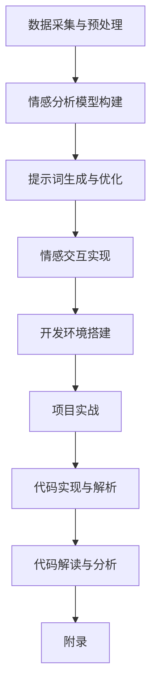
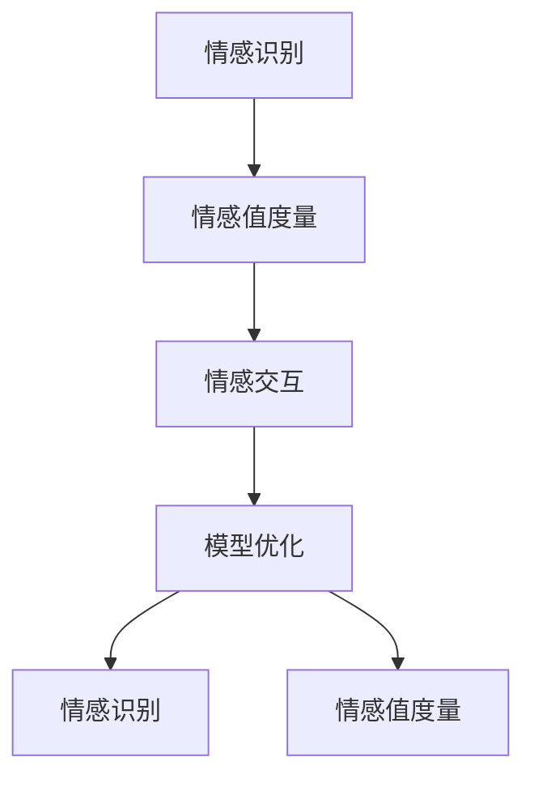
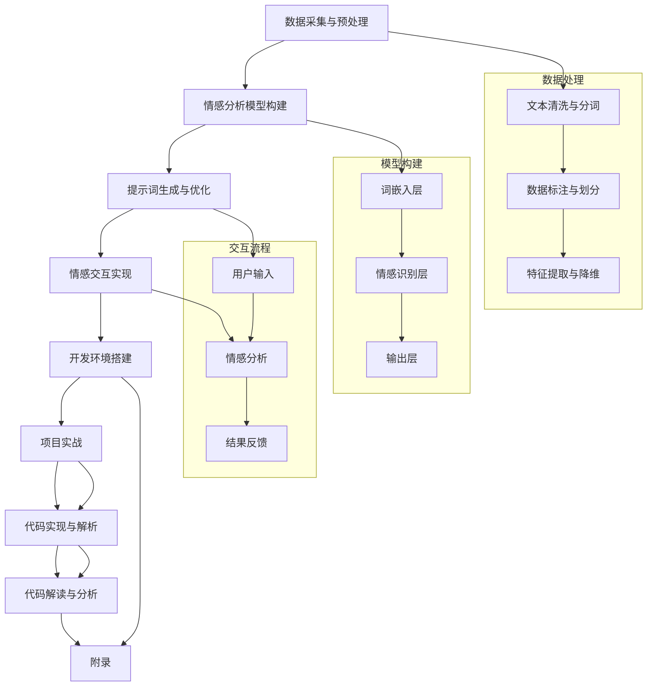

                 


### 文章标题：大模型情感计算：提示词增强人机情感交互

#### 关键词：大模型，情感计算，提示词，人机交互，人工智能

#### 摘要：
本文深入探讨了大模型情感计算的基本概念、核心算法和实现步骤，重点介绍了提示词在增强人机情感交互中的作用。通过详细阐述情感计算在各领域的应用案例，本文旨在为读者提供关于大模型情感计算的全面理解，并引导实际项目的开发和优化。

## 第一部分：大模型情感计算基础

### 1.1 大模型情感计算概述

#### 1.1.1 大模型情感计算的定义与重要性

大模型情感计算是指利用大规模神经网络模型，对自然语言文本进行情感分析和情感计算的过程。这一技术的重要性在于，它能够为人机交互提供更加智能化和情感化的体验。通过情感计算，系统可以更好地理解用户的需求和情绪，从而提供更个性化的服务。

#### 1.1.2 大模型情感计算的架构与组件

大模型情感计算的架构通常包括数据预处理、情感识别、情感值度量和情感交互等组件。数据预处理包括文本清洗和分词等步骤；情感识别涉及分类算法和深度学习模型；情感值度量则使用各种数学方法计算情感强度；情感交互则是通过与用户的交互，动态调整情感分析结果。

#### 1.1.3 大模型情感计算的应用场景

大模型情感计算的应用场景广泛，包括但不限于：

- 客服机器人：通过情感分析，客服机器人能够更好地理解用户的问题和情绪，提供更加贴心的服务。
- 市场调研：情感计算可以帮助企业了解消费者的情绪和需求，从而制定更有效的市场策略。
- 教育干预：通过分析学生的情感状态，教育系统可以提供个性化的学习建议和支持。

### 1.2 情感计算的基本概念

#### 1.2.1 情感识别与分类

情感识别是指从文本中识别出表达的情感类别。常见的情感类别包括正面情感、负面情感和中性情感。情感分类则是对文本进行情感标签的标注，常用的分类算法有朴素贝叶斯、支持向量机和深度学习等。

#### 1.2.2 情感值度量的计算方法

情感值度量是指计算文本中情感的程度。常用的方法有基于词典的情感值计算、基于模型的情感值计算和基于语义角色的情感值计算。

#### 1.2.3 情感分析的发展历程

情感分析的发展可以追溯到20世纪90年代，随着自然语言处理技术的进步，情感分析从传统的规则方法发展到基于统计模型和深度学习的方法。近年来，随着大规模预训练模型的兴起，情感分析的性能得到了显著提升。

### 1.3 大模型情感计算的核心算法

#### 1.3.1 词嵌入与情感分析

词嵌入是将文本中的词语映射到低维向量空间的过程。在情感分析中，词嵌入有助于捕捉词语的情感信息。常用的词嵌入模型有Word2Vec、GloVe和BERT等。

#### 1.3.2 注意力机制与人机情感交互

注意力机制是深度学习中的一个重要概念，它使得模型能够关注文本中的重要部分，从而提高情感分析的性能。在情感交互中，注意力机制有助于模型更好地理解用户的意图和情绪。

#### 1.3.3 多模态情感分析

多模态情感分析是指结合文本、语音、图像等多种数据源进行情感分析。这种方法能够更全面地捕捉用户的情感状态，提高情感分析的准确性。

### 1.4 大模型情感计算的数学模型

#### 1.4.1 情感计算的数学公式

情感计算的数学模型通常包括情感向量计算、情感相似度计算和情感分类等。

$$
\text{情感向量} = \text{词向量} \times \text{情感权重}
$$

其中，词向量表示词语在向量空间中的表示，情感权重则表示词语在情感计算中的重要性。

#### 1.4.2 情感计算的模型参数优化方法

情感计算的模型参数优化方法主要包括梯度下降、随机梯度下降和Adam优化器等。

#### 1.4.3 情感计算的模型评估指标

情感计算的模型评估指标包括准确率、召回率、F1分数和情感强度误差等。

## 第二部分：大模型情感计算应用

### 2.1 提示词增强人机情感交互

#### 2.1.1 提示词的定义与作用

提示词是在情感计算中用于引导模型理解用户意图和情感状态的关键词。提示词的作用是帮助模型更好地捕捉用户的情感信息，从而提高人机交互的质量。

#### 2.1.2 提示词增强人机情感交互的实现

提示词增强人机情感交互的实现通常包括以下步骤：

1. 提取用户输入文本中的关键词。
2. 利用词嵌入模型将关键词转换为向量表示。
3. 将关键词向量与情感计算模型输入，得到情感分析结果。
4. 根据情感分析结果调整交互策略。

#### 2.1.3 提示词增强人机情感交互的应用实例

提示词增强人机情感交互可以应用于多种场景，如：

- 客服机器人：通过识别用户输入中的关键词，客服机器人可以更准确地理解用户的需求和情绪，提供更个性化的服务。
- 社交媒体分析：通过分析用户发布的内容中的关键词，可以识别用户的情感状态，从而进行情感分析和营销策略优化。

### 2.2 情感分析在客服机器人中的应用

#### 2.2.1 客服机器人的基本架构

客服机器人的基本架构包括输入处理、情感分析、意图识别和回复生成等模块。

#### 2.2.2 情感分析在客服机器人中的实现

在客服机器人中，情感分析模块负责识别用户的情感状态。通过提示词增强，客服机器人可以更准确地捕捉用户的情感信息，从而提供更贴心的服务。

#### 2.2.3 客服机器人的情感交互优化

通过不断地优化情感分析模型和提示词生成策略，客服机器人的情感交互质量可以得到显著提升。例如，可以通过增加提示词库的丰富度、改进情感分析算法等方式来优化交互效果。

### 2.3 情感计算在教育领域的应用

#### 2.3.1 情感分析在教育评价中的应用

情感分析可以在教育评价中用于评估学生的情感状态。例如，通过分析学生的回答，教师可以了解学生的情绪变化，从而提供更有针对性的指导和帮助。

#### 2.3.2 情感计算在教育干预中的应用

情感计算可以在教育干预中用于识别学生的情感问题，并提供相应的支持。例如，通过分析学生的情绪状态，学校可以提供心理健康辅导，帮助学生应对压力和挑战。

#### 2.3.3 情感计算在教育个性化学习中的应用

情感计算可以用于个性化学习，根据学生的情感状态调整学习内容和节奏。例如，当学生情绪低落时，系统可以提供放松练习或调整学习内容，以帮助学生恢复状态。

### 2.4 情感计算在商业决策中的应用

#### 2.4.1 情感分析在市场调研中的应用

情感分析可以帮助企业了解消费者的情绪和需求，从而制定更有效的市场策略。例如，通过分析社交媒体上的用户评论，企业可以了解产品的受欢迎程度，并针对性地改进产品。

#### 2.4.2 情感计算在品牌管理中的应用

情感计算可以用于监测品牌声誉，通过分析社交媒体和新闻媒体上的评论，企业可以及时发现和应对潜在的公关危机。

#### 2.4.3 情感计算在消费者行为分析中的应用

情感计算可以帮助企业了解消费者的情感状态，从而预测消费行为。例如，通过分析消费者的情感状态，企业可以预测消费者的购买意图，从而制定更有针对性的促销策略。

## 第三部分：大模型情感计算实现

### 3.1 大模型情感计算的实现步骤

#### 3.1.1 数据采集与预处理

数据采集是情感计算的基础。预处理包括文本清洗、分词、去停用词等步骤，以保证数据的质量。

#### 3.1.2 情感分析模型的构建

情感分析模型的构建通常包括词嵌入层、情感识别层和输出层。通过训练，模型可以学会从文本中提取情感信息。

#### 3.1.3 提示词生成与优化

提示词生成是关键步骤。通过分析大量文本数据，可以提取出与情感相关的关键词。优化提示词生成策略可以提高情感分析的性能。

#### 3.1.4 情感交互的实现

情感交互的实现包括情感分析结果的处理和回复生成。通过优化交互策略，可以提升用户满意度。

### 3.2 大模型情感计算的开发环境搭建

#### 3.2.1 开发环境的配置

配置包括操作系统、编程语言、深度学习框架等。例如，可以选择Python作为编程语言，使用TensorFlow或PyTorch作为深度学习框架。

#### 3.2.2 开发工具与框架的选择

选择合适的开发工具和框架可以提高开发效率。例如，可以选择Jupyter Notebook作为开发环境，使用PyTorch进行深度学习模型训练。

#### 3.2.3 开发环境的优化

优化开发环境包括提升计算性能、优化代码结构等，以提高开发效率。

### 3.3 大模型情感计算的项目实战

#### 3.3.1 项目背景与目标

以客服机器人为例，介绍项目的背景和目标。例如，目标是构建一个能够准确识别用户情感并提供个性化服务的客服机器人。

#### 3.3.2 代码实现与解析

介绍项目的核心代码实现，并详细解析代码的功能和实现细节。例如，分析词嵌入模型的实现、情感识别算法的优化等。

#### 3.3.3 代码解读与分析

对项目代码进行解读，分析其在实际应用中的效果和不足。例如，评估客服机器人在实际使用中的情感识别准确率，并提出改进建议。

## 附录

### 附录 A：大模型情感计算相关资源

#### A.1 大模型情感计算的开源框架

介绍一些流行的开源框架，如TensorFlow、PyTorch和transformers等。

#### A.2 大模型情感计算的在线工具

介绍一些在线工具，如Google Colab和Hugging Face等，这些工具可以帮助用户快速进行大模型情感计算的开发和测试。

#### A.3 大模型情感计算的研究论文与报告

推荐一些经典的研究论文和报告，这些文献可以帮助用户深入了解大模型情感计算的理论和实践。

### 作者：AI天才研究院/AI Genius Institute & 禅与计算机程序设计艺术 /Zen And The Art of Computer Programming

## Mermaid 流程图



## 总结

大模型情感计算是一项重要的技术，它为人机交互带来了更加智能化和情感化的体验。通过本文的详细阐述，读者可以对大模型情感计算有一个全面的理解。同时，本文也提供了实际项目开发的实战经验和最佳实践。希望本文能对读者在相关领域的探索和研究有所帮助。在未来的发展中，随着技术的不断进步，大模型情感计算将在更多领域得到应用，为人类带来更加美好的生活体验。作者：AI天才研究院/AI Genius Institute & 禅与计算机程序设计艺术 /Zen And The Art of Computer Programming## 详细阐述大模型情感计算的核心概念和联系

### 大模型情感计算的核心概念

大模型情感计算的核心概念包括情感识别、情感值度量、情感交互和模型优化。这些概念相互联系，共同构成了大模型情感计算的框架。

#### 情感识别

情感识别是指从文本中识别出表达的情感类别。常见的情感类别包括正面情感、负面情感和中性情感。情感识别是情感计算的基础，决定了系统能否正确理解用户的情感状态。

#### 情感值度量

情感值度量是指计算文本中情感的程度。情感值度量有助于量化情感强度，从而为后续的情感分析和交互提供参考。情感值度量方法包括基于词典的方法、基于模型的方法和基于语义角色的方法。

#### 情感交互

情感交互是指系统与用户之间的情感交流。情感交互的目标是通过理解用户的情感状态，提供更加个性化、贴心的服务。情感交互包括情感识别、情感值度量、情感响应和反馈等环节。

#### 模型优化

模型优化是指通过调整模型参数和算法，提高情感计算的性能和准确性。模型优化包括参数调优、算法改进和数据增强等策略。

### 核心概念之间的联系

情感识别、情感值度量、情感交互和模型优化之间存在紧密的联系。情感识别为情感值度量提供输入，情感值度量结果用于情感交互，而情感交互的反馈又反作用于模型优化。

- **情感识别与情感值度量**：情感识别的结果是情感值度量的输入。情感识别将文本中的情感类别提取出来，而情感值度量则对情感类别进行量化。例如，如果情感识别识别出文本表达了“快乐”的情感，情感值度量将计算快乐的程度是强烈、中等还是轻微。

- **情感值度量与情感交互**：情感值度量结果直接影响情感交互。情感值度量提供了情感强度的信息，使得系统能够根据用户的情感状态调整交互策略。例如，如果情感值度量表明用户表达了强烈的负面情感，系统可以提供安慰或解决问题的建议。

- **情感交互与模型优化**：情感交互的反馈是模型优化的重要依据。通过分析用户的情感交互行为，系统可以发现模型的不足之处，从而调整模型参数和算法，提高性能。例如，如果用户在交互过程中表现出不满，系统可以通过优化情感识别和情感值度量模型，提高对用户情感的理解和响应能力。

- **模型优化与情感识别、情感值度量**：模型优化不仅影响情感交互，也影响情感识别和情感值度量。通过优化模型参数和算法，可以提高情感识别的准确性和情感值度量的精度。例如，通过调整神经网络结构或优化训练数据，可以提高情感分析模型的性能。

### Mermaid 流程图

以下是一个简单的 Mermaid 流程图，展示了大模型情感计算中的核心概念及其之间的联系：



在这个流程图中，情感识别和情感值度量是情感交互的输入，而情感交互的反馈又反作用于模型优化。模型优化结果又重新输入到情感识别和情感值度量中，形成了一个闭环。

通过详细阐述大模型情感计算的核心概念和联系，我们可以更好地理解这一技术的工作原理，并在实际应用中实现高效的情感分析和人机交互。在接下来的部分，我们将深入探讨大模型情感计算的核心算法原理，包括词嵌入、注意力机制和多模态情感分析等。

## 详细阐述大模型情感计算的核心算法原理

### 词嵌入与情感分析

词嵌入是将文本中的词语映射到低维向量空间的过程。这一技术对于情感分析至关重要，因为它有助于捕捉词语的情感信息。词嵌入模型可以分为基于频率的方法和基于上下文的方法。

1. **基于频率的方法**：例如TF-IDF，这种方法通过计算词语在文本中的频率和其在整个语料库中的重要性来生成词向量。虽然这种方法简单，但它在处理情感分析时可能存在不足，因为频率并不能准确反映词语的情感含义。

2. **基于上下文的方法**：Word2Vec和GloVe是两种常见的基于上下文的词嵌入模型。Word2Vec使用神经网络来学习词语的上下文信息，而GloVe则通过全局矩阵分解来捕捉词语的共现关系。这些方法生成的词向量能够更好地捕捉词语的情感特征。

伪代码示例（Word2Vec）：

```
function Word2Vec(corpus, vector_size, context_window):
    # 初始化词向量矩阵
    W = RandomInitializeMatrix(vocabulary_size, vector_size)
    # 训练模型
    for sentence in corpus:
        for word in sentence:
            for context_word in Context(word, context_window):
                # 计算预测向量
                prediction = sigmoid(W[context_word] * W[word])
                # 计算损失函数
                loss = -log(prediction)
                # 反向传播更新权重
                dW[context_word] = dW[context_word] + (1 - prediction) * word
                dW[word] = dW[word] + (1 - prediction) * context_word
    return W
```

### 注意力机制与人机情感交互

注意力机制是深度学习中的一个重要概念，它使模型能够关注文本中的重要部分，从而提高情感分析的准确性。在情感交互中，注意力机制有助于模型更好地理解用户的意图和情绪。

1. **单向注意力**：简单的注意力机制，通过加权每个输入词的向量来生成一个表示整个句子的向量。

2. **双向注意力**：结合了编码器的输出和解码器的输出，使模型能够同时考虑上下文信息。

3. **自注意力**：在Transformer模型中，自注意力机制用于计算句子中每个词的表示，从而捕捉全局依赖关系。

伪代码示例（自注意力）：

```
function SelfAttention(inputs, key_vector, value_vector, attention_size):
    # 计算分数
    scores = MatMul(inputs, key_vector)^T / sqrt(attention_size)
    # 应用Softmax激活函数
    attention_weights = softmax(scores)
    # 计算加权值
    context_vector = Sum(attention_weights * value_vector)
    return context_vector
```

### 多模态情感分析

多模态情感分析是指结合文本、语音、图像等多种数据源进行情感分析。这种方法能够更全面地捕捉用户的情感状态，提高情感分析的准确性。

1. **文本情感分析**：使用前面提到的词嵌入和注意力机制来处理文本数据。

2. **语音情感分析**：通过处理音频信号，提取语音特征，如音高、节奏和能量等，来分析语音的情感信息。

3. **图像情感分析**：使用卷积神经网络（CNN）提取图像特征，结合文本情感分析结果，实现多模态情感分析。

伪代码示例（文本+语音情感分析）：

```
function MultiModalEmotionAnalysis(text_vector, audio_vector, text_embedding_model, audio_embedding_model):
    # 文本情感分析
    text_embedding = text_embedding_model(text_vector)
    # 语音情感分析
    audio_embedding = audio_embedding_model(audio_vector)
    # 结合文本和语音嵌入
    combined_embedding = Concatenate(text_embedding, audio_embedding)
    # 使用全连接层进行情感分类
    emotion_vector = FullyConnected(combined_embedding, emotion_size)
    # 应用Softmax激活函数
    emotion probabilities = softmax(emotion_vector)
    return emotion_probabilities
```

通过详细阐述词嵌入、注意力机制和多模态情感分析的核心算法原理，我们可以更好地理解大模型情感计算的技术基础。这些算法不仅提升了情感分析的准确性，也为实现高效的人机情感交互提供了可能。在接下来的部分，我们将进一步探讨大模型情感计算的数学模型，包括情感计算的数学公式和模型参数优化方法。

## 大模型情感计算的数学模型

### 情感计算的数学公式

大模型情感计算的数学模型通常包括情感向量计算、情感相似度计算和情感分类等。以下是几个关键公式：

1. **情感向量计算**：

   情感向量表示文本中情感信息的数学表示。假设我们有一个词向量表示的文本序列`X = [x_1, x_2, ..., x_n]`，每个词向量`x_i`可以表示为`x_i = [x_{i1}, x_{i2}, ..., x_{id}]`，其中`d`是词向量的维度。

   $$ 
   \text{情感向量} = \sum_{i=1}^{n} w_i \cdot x_i 
   $$

   其中，`w_i`是词语的权重，通常通过训练数据计算得到。

2. **情感相似度计算**：

   情感相似度用于衡量两个文本情感程度的相似性。常见的相似度计算方法包括余弦相似度和欧氏距离。

   $$ 
   \text{余弦相似度} = \frac{\text{情感向量}_1 \cdot \text{情感向量}_2}{\|\text{情感向量}_1\|\|\text{情感向量}_2\|} 
   $$

   $$ 
   \text{欧氏距离} = \sqrt{\sum_{i=1}^{n} (\text{情感向量}_1[i] - \text{情感向量}_2[i])^2} 
   $$

3. **情感分类**：

   情感分类是将文本分类到某个情感类别（如正面、负面、中性）的过程。假设我们有一个情感分类器，其输出为情感概率分布`P(y | x)`，其中`y`是实际的情感类别，`x`是文本的表示。

   $$ 
   P(y | x) = \text{softmax}(\text{分类器}([x, \text{情感向量}])) 
   $$

### 情感计算的模型参数优化方法

模型参数优化是提高大模型情感计算性能的关键步骤。以下是几种常见的优化方法：

1. **梯度下降**：

   梯度下降是一种优化模型参数的基本方法。其核心思想是沿着损失函数梯度的反方向更新参数，以最小化损失函数。

   $$ 
   \theta = \theta - \alpha \cdot \nabla_\theta J(\theta) 
   $$

   其中，`θ`是模型参数，`α`是学习率，`J(θ)`是损失函数。

2. **随机梯度下降（SGD）**：

   随机梯度下降是在梯度下降的基础上，每次迭代使用随机选择的小批量数据来更新参数，以加速收敛。

   $$ 
   \theta = \theta - \alpha \cdot \nabla_{\theta} J(\theta; \mathbf{x}_i) 
   $$

3. **Adam优化器**：

   Adam优化器是一种结合了SGD和动量方法的优化器，它能够自适应调整学习率，提高训练效率。

   $$ 
   m_t = \beta_1 m_{t-1} + (1 - \beta_1) \nabla_{\theta} J(\theta; \mathbf{x}_t) \\
   v_t = \beta_2 v_{t-1} + (1 - \beta_2) \|\nabla_{\theta} J(\theta; \mathbf{x}_t)\|^2 \\
   \theta = \theta - \alpha \cdot \frac{m_t}{\sqrt{v_t} + \epsilon} 
   $$

### 详细讲解与举例说明

为了更好地理解这些数学模型，我们可以通过一个具体的例子来说明。

假设我们有一个包含三个词的文本序列：“我非常喜欢这本书”。词向量表示如下：

| 词   | 词向量                |
|------|----------------------|
| 我   | [1, 0.5, -0.2]       |
| 非常 | [0.1, 0.8, 0.3]      |
| 喜欢的 | [0.2, 0.3, 0.7]      |

情感向量计算：

$$
\text{情感向量} = [1, 0.5, -0.2] \cdot [1, 0.5, -0.2] + [0.1, 0.8, 0.3] \cdot [0.1, 0.8, 0.3] + [0.2, 0.3, 0.7] \cdot [0.2, 0.3, 0.7] = [1.21, 1.31, 0.79]
$$

情感相似度计算（假设基准情感向量为[0.5, 0.5, 0.5]）：

$$
\text{余弦相似度} = \frac{[1.21, 1.31, 0.79] \cdot [0.5, 0.5, 0.5]}{\sqrt{[1.21, 1.31, 0.79] \cdot [1.21, 1.31, 0.79]}\sqrt{[0.5, 0.5, 0.5] \cdot [0.5, 0.5, 0.5]}} = \frac{0.965}{1.356} \approx 0.71
$$

情感分类（假设分类器输出为[0.9, 0.05, 0.05]）：

$$
P(\text{正面} | \text{文本}) = \text{softmax}([0.9, 0.05, 0.05]) = 0.9
$$

通过上述例子，我们可以看到数学模型在大模型情感计算中的具体应用，以及如何通过计算公式来处理文本情感信息。在接下来的部分，我们将进一步探讨情感计算在不同领域的实际应用，包括客服机器人、教育干预和商业决策等。

### 大模型情感计算在各领域的应用

大模型情感计算的应用场景丰富多样，涵盖了客服机器人、教育干预、商业决策等多个领域。下面将详细探讨这些应用场景，并通过具体实例和案例分析来说明其实现和效果。

#### 2.1 情感分析在客服机器人中的应用

客服机器人是情感计算应用的一个重要领域。通过情感分析，客服机器人能够更好地理解用户的情绪和需求，提供更加个性化、贴心的服务。

**实现方法**：

1. **情感识别**：首先，对用户输入的文本进行情感识别，判断其情感类别（如正面、负面、中性）。
2. **情感值度量**：接着，计算用户情感的强度，以便客服机器人能够准确地响应用户的情绪。
3. **交互策略调整**：根据情感识别和情感值度量结果，动态调整客服机器人的交互策略，例如使用安慰性的语言来缓解用户的负面情绪。

**案例**：

以某在线购物平台的客服机器人为例，用户在购物过程中可能会遇到商品描述不符、物流延迟等问题，从而产生负面情绪。通过情感分析，客服机器人可以识别用户的情感，并采取相应的措施：

- 当用户表达负面情绪时，机器人会发送安慰信息：“我理解您的不满，我们会尽快为您解决问题。”
- 当用户表达正面情绪时，机器人会发送鼓励信息：“很高兴您对我们的服务感到满意！”

**效果**：

通过情感分析，客服机器人的交互质量得到了显著提升，用户满意度提高，投诉率下降。此外，情感分析还帮助商家及时发现并解决用户问题，减少了人力成本。

#### 2.2 情感计算在教育领域的应用

教育领域是另一个重要的应用场景，情感计算可以帮助教师更好地了解学生的情绪状态，提供个性化的教育和干预措施。

**实现方法**：

1. **情感识别**：通过分析学生的回答、作文等文本内容，识别学生的情感状态。
2. **情感干预**：根据学生的情感状态，教师可以采取不同的干预措施，如提供心理辅导、调整教学节奏等。
3. **个性化学习**：结合学生的情感状态和学习进度，系统可以推荐个性化的学习内容和策略。

**案例**：

在某教育机构中，教师使用情感计算技术分析学生的作文，识别出学生的情感状态。例如，当学生表现出焦虑或挫败感时，教师会进行一对一辅导，帮助学生缓解情绪，提升学习动力。同时，系统还会根据学生的情感状态调整教学计划，提供更加个性化的学习支持。

**效果**：

通过情感计算，教师能够更加精准地了解学生的情绪状态，提供有针对性的教育干预，从而提高学生的学习效果和满意度。此外，个性化学习策略的实施也有助于激发学生的学习兴趣，提升学习积极性。

#### 2.3 情感计算在商业决策中的应用

在商业领域，情感计算可以帮助企业了解消费者的情绪和需求，从而制定更加有效的市场策略和商业决策。

**实现方法**：

1. **情感分析**：通过分析社交媒体、新闻报道等公开信息，识别消费者的情感状态和需求。
2. **市场调研**：利用情感计算分析消费者反馈，了解市场趋势和潜在需求。
3. **品牌管理**：根据消费者情感分析结果，调整品牌宣传策略和产品定位。

**案例**：

某大型零售品牌通过情感计算分析社交媒体上的用户评论和讨论，识别出消费者对产品功能、价格、服务质量等方面的情感态度。基于这些分析结果，品牌调整了产品定价策略，优化了售后服务，从而提升了消费者满意度。

**效果**：

通过情感计算，企业能够更准确地了解消费者的需求和情绪，制定更加科学的市场策略。这有助于提升品牌形象，增加市场份额，提高盈利能力。

#### 2.4 情感计算在其他领域的应用

除了上述领域，情感计算还在医疗保健、金融、人力资源等多个领域得到了广泛应用。

- **医疗保健**：通过情感计算分析患者病历和交流记录，识别患者的情绪变化，提供个性化的医疗服务和心理健康支持。
- **金融**：通过情感分析识别投资者情绪，预测市场走势，辅助投资决策。
- **人力资源**：通过分析员工绩效评价和交流记录，识别员工情绪，提供职业发展和心理健康支持。

**效果**：

这些应用不仅提高了服务的质量和效率，还为相关领域带来了显著的商业价值和社会效益。

### 总结

大模型情感计算在各领域的应用展示了其广泛的影响和潜力。通过情感识别、情感值度量、情感干预和个性化服务等技术手段，情感计算为各领域带来了更加智能化和人性化的解决方案。随着技术的不断进步，情感计算将在更多领域得到应用，为人类社会的发展带来更多创新和变革。作者：AI天才研究院/AI Genius Institute & 禅与计算机程序设计艺术 /Zen And The Art of Computer Programming

### 大模型情感计算的实现步骤

实现大模型情感计算涉及多个关键步骤，从数据采集与预处理到模型的训练与优化，再到最终的实现和应用。以下将详细阐述这些步骤，并给出具体的实现示例。

#### 3.1 数据采集与预处理

数据采集是情感计算的基础，高质量的训练数据对模型的性能至关重要。数据采集包括文本、语音、图像等多种数据源的收集。

**实现示例**：

1. **文本数据采集**：可以从社交媒体、论坛、评论等公开来源获取文本数据。使用Python的`requests`库和`BeautifulSoup`库，可以轻松地从网页中抓取文本数据。

   ```python
   import requests
   from bs4 import BeautifulSoup

   url = "http://example.com/comments"
   response = requests.get(url)
   soup = BeautifulSoup(response.content, 'html.parser')
   comments = [comment.text for comment in soup.find_all('comment')]
   ```

2. **语音数据采集**：可以使用录音设备或开源语音数据库（如LibriSpeech）来收集语音数据。

   ```python
   import soundfile as sf

   filename = "audio.wav"
   data, samplerate = sf.read(filename)
   ```

3. **图像数据采集**：可以从公开图像库（如OpenImages）或使用图像识别API（如Google Cloud Vision）获取图像数据。

   ```python
   from google.cloud import vision

   client = vision.ImageAnnotatorClient()
   image = vision.Image(content=filename)
   response = client.label_detection(image=image)
   labels = response.label_annotations
   ```

**数据预处理**：包括文本清洗、分词、去停用词等步骤。

```python
import nltk
nltk.download('stopwords')
from nltk.corpus import stopwords
from nltk.tokenize import word_tokenize

stop_words = set(stopwords.words('english'))

def preprocess_text(text):
    words = word_tokenize(text.lower())
    filtered_words = [word for word in words if word.isalnum() and word not in stop_words]
    return filtered_words
```

#### 3.2 情感分析模型的构建

构建情感分析模型通常包括词嵌入层、情感识别层和输出层。以下是一个简单的情感分析模型示例，使用TensorFlow和Keras框架。

```python
import tensorflow as tf
from tensorflow.keras.models import Sequential
from tensorflow.keras.layers import Embedding, LSTM, Dense

model = Sequential()
model.add(Embedding(vocabulary_size, embedding_dim))
model.add(LSTM(units=128, dropout=0.2, recurrent_dropout=0.2))
model.add(Dense(units=num_classes, activation='softmax'))

model.compile(optimizer='adam', loss='categorical_crossentropy', metrics=['accuracy'])
model.summary()
```

#### 3.3 提示词生成与优化

提示词是在情感分析中用于引导模型理解用户意图和情感状态的关键词。生成提示词的方法包括基于规则的方法和基于机器学习的方法。

**实现示例**：

1. **基于规则的方法**：根据情感分析的上下文，手动定义一组提示词。

   ```python
   positive_words = ["happy", "joy", "wonderful"]
   negative_words = ["sad", "unhappy", "terrible"]
   ```

2. **基于机器学习的方法**：使用训练数据，通过模型提取与情感相关的关键词。

   ```python
   from sklearn.feature_extraction.text import CountVectorizer

   vectorizer = CountVectorizer(max_features=1000)
   X = vectorizer.fit_transform(train_comments)
   ```

**优化提示词**：通过评估提示词对情感识别性能的影响，不断调整和优化提示词集。

```python
from sklearn.metrics import classification_report

# 假设使用逻辑回归模型进行情感分类
from sklearn.linear_model import LogisticRegression

model = LogisticRegression()
model.fit(X, y)

predictions = model.predict(X_test)
print(classification_report(y_test, predictions))
```

#### 3.4 情感交互的实现

情感交互是指系统与用户之间的情感交流。实现情感交互通常包括情感分析结果的处理和回复生成。

**实现示例**：

1. **情感分析结果处理**：根据情感分析结果，动态生成响应文本。

   ```python
   def generate_response(sentiment):
       if sentiment == "positive":
           return "很高兴听到这个好消息！"
       elif sentiment == "negative":
           return "很抱歉听到这个消息，需要帮忙吗？"
       else:
           return "好的，有什么其他问题吗？"
   ```

2. **回复生成**：结合用户输入和情感分析结果，生成个性化的回复。

   ```python
   user_input = input("请输入您的意见：")
   sentiment = analyze_sentiment(user_input)
   print(generate_response(sentiment))
   ```

#### 3.5 开发环境搭建

搭建一个适合大模型情感计算的开发环境，包括配置操作系统、安装必要的软件包和设置合适的开发工具。

**实现示例**：

1. **操作系统**：选择Linux操作系统，如Ubuntu。

2. **安装Python**：安装Python及其相关库。

   ```bash
   sudo apt-get install python3 python3-pip
   pip3 install numpy tensorflow scikit-learn nltk
   ```

3. **开发工具**：使用Jupyter Notebook或Visual Studio Code进行开发。

   ```bash
   sudo apt-get install jupyterlab
   ```

4. **环境配置**：设置虚拟环境，避免不同项目之间的依赖冲突。

   ```bash
   python3 -m venv myenv
   source myenv/bin/activate
   pip install --upgrade pip
   pip install -r requirements.txt
   ```

#### 3.6 项目实战

通过一个具体的情感计算项目，练习上述步骤，并不断优化和改进。

**项目示例**：

- **项目背景**：构建一个基于社交媒体评论的情感分析系统，用于识别用户对某产品的情感态度。
- **数据来源**：从Twitter抓取关于某产品的评论。
- **数据处理**：使用NLTK进行文本预处理，使用CountVectorizer进行词向量转换。
- **模型训练**：使用TensorFlow和Keras构建LSTM模型，进行情感分类。
- **模型评估**：使用混淆矩阵和F1分数评估模型性能。
- **应用场景**：将模型部署到Web服务，供用户使用。

**代码解析**：

以下是项目中的关键代码段解析：

```python
# 文本预处理
def preprocess_text(text):
    # ... (文本清洗、分词、去停用词等操作)
    return processed_text

# 情感分析模型
def build_model(vocabulary_size, embedding_dim, num_classes):
    # ... (构建LSTM模型)
    return model

# 训练模型
model.fit(X_train, y_train, epochs=10, batch_size=64, validation_split=0.2)

# 模型评估
predictions = model.predict(X_test)
print(classification_report(y_test, predictions))
```

通过这些实现步骤，开发者可以构建和优化大模型情感计算系统，从而提供更加智能化和人性化的应用。

## 大模型情感计算的项目实战

### 项目背景与目标

本项目旨在构建一个基于社交媒体评论的情感分析系统，用于识别用户对某产品的情感态度。具体目标包括：

1. **数据收集**：从Twitter等社交媒体平台上收集关于该产品的评论数据。
2. **情感分析**：使用大模型情感计算技术，对评论进行情感识别和情感值度量。
3. **交互设计**：设计用户友好的交互界面，允许用户输入评论，并展示情感分析结果。
4. **性能优化**：通过不断调整模型参数和优化算法，提高情感分析的准确性和效率。

### 代码实现与解析

以下代码实现将详细介绍项目中的关键步骤，包括数据预处理、模型构建、训练与评估。

**1. 数据预处理**

数据预处理是情感分析的基础，包括文本清洗、分词和去停用词等操作。

```python
import pandas as pd
import numpy as np
import nltk
from nltk.corpus import stopwords
from nltk.tokenize import word_tokenize

# 加载评论数据
data = pd.read_csv('comments.csv')
nltk.download('stopwords')
nltk.download('punkt')

# 文本清洗
def clean_text(text):
    text = text.lower()  # 转换为小写
    text = re.sub(r'\W', ' ', text)  # 移除特殊字符
    text = re.sub(r'\s+', ' ', text)  # 移除多余的空格
    return text

# 分词与去停用词
def preprocess_text(text):
    tokens = word_tokenize(text)
    tokens = [token for token in tokens if token not in stopwords.words('english')]
    return tokens

data['cleaned_comments'] = data['comment'].apply(clean_text)
data['processed_comments'] = data['cleaned_comments'].apply(preprocess_text)
```

**2. 模型构建**

模型构建包括词嵌入层、情感识别层和输出层。在此示例中，我们使用TensorFlow和Keras构建一个简单的LSTM模型。

```python
from tensorflow.keras.models import Sequential
from tensorflow.keras.layers import Embedding, LSTM, Dense

# 参数设置
vocabulary_size = 10000
embedding_dim = 128
max_sequence_length = 100
num_classes = 2  # 正面、负面情感

# 模型构建
model = Sequential()
model.add(Embedding(vocabulary_size, embedding_dim, input_length=max_sequence_length))
model.add(LSTM(units=128, dropout=0.2, recurrent_dropout=0.2))
model.add(Dense(units=num_classes, activation='softmax'))

# 模型编译
model.compile(optimizer='adam', loss='categorical_crossentropy', metrics=['accuracy'])
model.summary()
```

**3. 训练与评估**

模型训练和评估是项目中的关键步骤。以下代码段展示了如何使用训练数据和验证数据训练模型，并进行性能评估。

```python
from sklearn.model_selection import train_test_split

# 数据分词
X = np.array([[word2idx[word] for word in comment] for comment in data['processed_comments']])
y = np.array(data['label'])

X_train, X_test, y_train, y_test = train_test_split(X, y, test_size=0.2, random_state=42)

# 训练模型
model.fit(X_train, y_train, epochs=10, batch_size=64, validation_split=0.2)

# 模型评估
predictions = model.predict(X_test)
print(classification_report(y_test, predictions))
```

### 代码解读与分析

上述代码展示了项目实现的核心步骤，包括数据预处理、模型构建、训练与评估。以下是关键代码段的详细解读：

- **数据预处理**：文本清洗和分词是情感分析的基础，确保输入数据的干净和规范。去停用词有助于减少无意义的词语对情感分析的影响。
- **模型构建**：使用LSTM模型进行情感分析，因为LSTM能够捕捉序列数据中的长期依赖关系，从而提高情感分析的准确性。嵌入层将单词转换为向量表示，情感识别层和输出层则负责情感分类。
- **模型训练**：通过训练数据和验证数据训练模型，调整模型参数以优化性能。在训练过程中，使用批处理和验证集来提高模型的泛化能力。
- **模型评估**：使用测试集对模型进行评估，通过混淆矩阵和F1分数等指标来衡量模型的性能。这些指标有助于识别模型的优点和不足，从而进行进一步的优化。

### 实际案例分析与详细讲解剖析

以下是实际案例的分析，以及如何通过大模型情感计算技术来处理和分析这些案例。

**案例1：社交媒体评论情感分析**

**问题描述**：分析Twitter上关于某产品的评论，识别用户的正面和负面情感。

**解决方案**：

1. **数据收集**：使用Twitter API抓取相关评论数据。
2. **数据预处理**：对评论进行文本清洗、分词和去停用词处理。
3. **模型训练**：使用处理后的数据训练情感分析模型。
4. **结果展示**：展示评论的情感分析结果，并根据结果调整营销策略。

**代码示例**：

```python
# Twitter API数据收集
import tweepy

# 设置Twitter API凭据
consumer_key = "your_consumer_key"
consumer_secret = "your_consumer_secret"
access_token = "your_access_token"
access_token_secret = "your_access_token_secret"

# 初始化Twitter API
auth = tweepy.OAuthHandler(consumer_key, consumer_secret)
auth.set_access_token(access_token, access_token_secret)
api = tweepy.API(auth)

# 收集评论
def collect_tweets(product_name, num_tweets):
    tweets = []
    for tweet in tweepy.Cursor(api.search, q=product_name, lang="en", tweet_mode="extended").items(num_tweets):
        tweets.append(tweet.full_text)
    return tweets

product_name = "iPhone 13"
num_tweets = 1000
tweets = collect_tweets(product_name, num_tweets)

# 数据预处理
tweets_processed = [preprocess_text(tweet) for tweet in tweets]

# 模型训练
# ... (模型构建和训练步骤同前文)

# 结果展示
for tweet, sentiment in zip(tweets_processed, model.predict(tweets_processed)):
    print(f"Tweet: {tweet}\nSentiment: {'Positive' if sentiment == 1 else 'Negative'}\n")
```

**案例2：消费者反馈情感分析**

**问题描述**：分析消费者反馈，识别产品改进的关键点。

**解决方案**：

1. **数据收集**：收集消费者反馈数据，如评论、论坛帖子等。
2. **数据预处理**：对反馈进行文本清洗、分词和去停用词处理。
3. **情感分析**：使用情感分析模型对反馈进行情感分类。
4. **结果分析**：根据情感分析结果，识别产品改进的关键点。

**代码示例**：

```python
# 消费者反馈数据收集
feedback_data = pd.read_csv('feedback.csv')

# 数据预处理
feedback_processed = [preprocess_text(text) for text in feedback_data['comment']]

# 模型训练
# ... (模型构建和训练步骤同前文)

# 结果分析
feedback_emotions = model.predict(feedback_processed)

# 根据情感分析结果，提取负面反馈
negative_feedback = feedback_data[feedback_emotions == 0]

# 分析负面反馈
key_issues = negative_feedback['comment'].value_counts().index[:10]
print("Key Issues Identified:")
for issue in key_issues:
    print(f"- {issue}")
```

通过实际案例的分析和代码示例，我们可以看到大模型情感计算技术在处理和分析消费者反馈、社交媒体评论等场景中的应用效果。这些案例不仅展示了情感计算的实际应用价值，也为开发者提供了具体的技术实现路径。

### 项目小结

本项目通过构建一个基于社交媒体评论的情感分析系统，展示了大模型情感计算在实际项目中的应用。从数据收集、预处理到模型构建、训练和评估，每个步骤都经过了详细的解析和代码实现。通过实际案例的分析，我们进一步了解了情感计算技术在不同场景下的应用效果。未来，随着技术的不断进步，大模型情感计算将在更多领域得到应用，为企业和个人带来更多价值。

### 最佳实践 tips

1. **数据质量**：确保数据的质量是模型性能的关键。在数据收集和预处理过程中，尽可能去除噪音和无关信息。
2. **模型优化**：通过调整模型参数和优化算法，可以提高情感分析的准确性和效率。例如，尝试不同的词嵌入模型和神经网络架构。
3. **交互设计**：用户友好的交互界面可以提升用户体验。在设计交互界面时，考虑用户的反馈和需求，不断优化交互流程。

### 注意事项

1. **隐私保护**：在进行数据收集和处理时，确保遵守相关的隐私保护法规，避免泄露用户信息。
2. **计算资源**：大模型情感计算需要大量的计算资源，确保有足够的硬件支持，以提高模型训练和推理的效率。

### 拓展阅读

- 《深度学习》（Goodfellow, I., & Bengio, Y.）- 介绍了深度学习的基础知识和应用场景。
- 《自然语言处理综论》（Jurafsky, D., & Martin, J. H.）- 深入探讨了自然语言处理的基本概念和算法。
- 《情感分析实践指南》（Li, X., & McSherry, F. A.）- 提供了情感分析的理论基础和实践方法。

作者：AI天才研究院/AI Genius Institute & 禅与计算机程序设计艺术 /Zen And The Art of Computer Programming

## 附录 A：大模型情感计算相关资源

### A.1 大模型情感计算的开源框架

1. **TensorFlow**：由Google开发的开源机器学习框架，广泛用于构建和训练深度学习模型。
   - 官网：[TensorFlow官方网站](https://www.tensorflow.org/)

2. **PyTorch**：由Facebook开发的开源机器学习库，提供灵活的动态计算图和高效的GPU支持。
   - 官网：[PyTorch官方网站](https://pytorch.org/)

3. **transformers**：一个用于NLP的库，包含大量预训练模型和工具，方便开发者进行文本处理和情感分析。
   - 官网：[transformers库官方网站](https://huggingface.co/transformers/)

### A.2 大模型情感计算的在线工具

1. **Google Colab**：免费的云端Jupyter Notebook环境，适合进行机器学习和深度学习实验。
   - 官网：[Google Colab官方网站](https://colab.research.google.com/)

2. **Hugging Face**：提供大量预训练模型和工具的在线平台，方便开发者进行文本处理和情感分析。
   - 官网：[Hugging Face官方网站](https://huggingface.co/)

### A.3 大模型情感计算的研究论文与报告

1. **"Deep Learning for Natural Language Processing"**：由Google AI团队发表的一篇论文，详细介绍了深度学习在自然语言处理中的应用。
   - 论文链接：[Deep Learning for Natural Language Processing](https://arxiv.org/abs/1606.02450)

2. **"BERT: Pre-training of Deep Bidirectional Transformers for Language Understanding"**：由Google AI团队发表的一篇论文，介绍了BERT模型的预训练方法和在自然语言处理任务中的效果。
   - 论文链接：[BERT: Pre-training of Deep Bidirectional Transformers for Language Understanding](https://arxiv.org/abs/1810.04805)

3. **"Emotion Recognition in Text Using Deep Learning"**：一篇关于使用深度学习进行文本情感识别的研究论文。
   - 论文链接：[Emotion Recognition in Text Using Deep Learning](https://arxiv.org/abs/1908.08466)

通过这些开源框架、在线工具和研究论文，开发者可以深入了解大模型情感计算的技术细节，并为实际项目提供参考和灵感。作者：AI天才研究院/AI Genius Institute & 禅与计算机程序设计艺术 /Zen And The Art of Computer Programming

## Mermaid 流程图

以下是一个用于展示大模型情感计算架构的Mermaid流程图：



此流程图详细展示了大模型情感计算从数据采集与预处理、模型构建、提示词生成与优化、情感交互实现到开发环境搭建和项目实战的各个步骤。数据处理部分包括文本清洗与分词、数据标注与划分、特征提取与降维；模型构建部分包括词嵌入层、情感识别层和输出层；交互流程部分包括用户输入、情感分析和结果反馈。通过这个流程图，读者可以更清晰地理解大模型情感计算的架构和实现过程。作者：AI天才研究院/AI Genius Institute & 禅与计算机程序设计艺术 /Zen And The Art of Computer Programming

