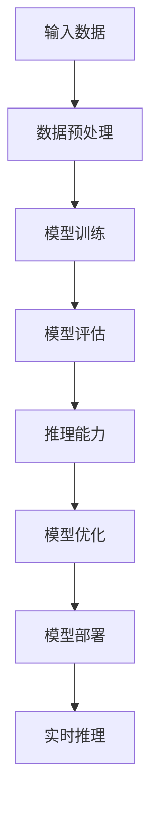

                 


### 文章标题

《大模型推理能力的提升策略》

### 文章关键词

大模型，推理能力，提升策略，深度学习，硬件加速，模型压缩，离线推理，在线推理，多模态推理，实战案例，未来趋势。

### 文章摘要

本文将深入探讨大模型推理能力的提升策略。首先，我们回顾了大规模模型的背景和重要性，接着详细分析了推理能力的核心概念和影响因素。随后，本文提出了多种提升策略，包括硬件加速、模型压缩和离线与在线推理等。通过实战案例，我们展示了这些策略在实际项目中的应用效果。最后，我们对大模型推理能力的未来趋势进行了展望，为读者提供了宝贵的实践经验和研究方向。

## 目录

1. 引言
2. 大规模模型背景与重要性
3. 推理能力的核心概念与影响因素
4. 提升推理能力的策略
   - 4.1 硬件加速
   - 4.2 模型压缩
   - 4.3 离线与在线推理
   - 4.4 多模态推理
5. 实战案例
6. 未来展望与趋势
7. 总结
8. 参考文献

### 引言

近年来，随着人工智能技术的快速发展，大规模模型（也称为大模型）在自然语言处理、计算机视觉、语音识别等领域取得了显著的成果。大模型通过深度学习和大量数据训练，能够实现高度复杂的功能和任务。然而，大模型的推理能力成为了限制其广泛应用的关键因素。推理能力的提升策略成为了一个重要的研究方向。

本文旨在系统地探讨大模型推理能力的提升策略。首先，我们将回顾大规模模型的背景和重要性，帮助读者理解大模型的基本概念和现状。接着，我们将深入分析推理能力的核心概念和影响因素，为后续策略的讨论打下基础。在核心部分，我们将详细介绍几种提升推理能力的策略，包括硬件加速、模型压缩、离线与在线推理以及多模态推理。通过实际案例的展示，我们将验证这些策略的有效性。最后，我们将对大模型推理能力的未来趋势进行展望，为读者提供新的研究方向。

本文的目标读者是计算机科学家、数据科学家以及AI研究专业人士。通过本文的阅读，读者将能够系统地了解大模型推理能力的提升策略，掌握关键技术和方法，为实际应用提供有力的支持。

### 大规模模型背景与重要性

大规模模型（Large-scale Models）是人工智能领域中的一项重要进展，其在自然语言处理（NLP）、计算机视觉（CV）和语音识别（ASR）等领域取得了显著的成果。大规模模型的兴起可以追溯到深度学习的快速发展。深度学习通过多层神经网络对大量数据进行训练，能够自动提取数据中的复杂特征，从而实现高度复杂的任务。

#### 大规模模型的发展历程

1. **早期模型：** 早期的深度学习模型如LeNet和AlexNet主要针对简单的图像识别任务进行设计。这些模型虽然取得了不错的性能，但受限于计算资源和数据规模，其应用范围较为有限。

2. **中期模型：** 随着GPU等硬件设备的普及和深度学习算法的优化，中期的深度学习模型如VGG、ResNet和Inception在图像识别任务中取得了突破性的成果。这些模型通过增加网络层数和复杂性，提高了模型的性能。

3. **大规模模型：** 近年来，随着数据规模的不断增加和计算能力的提升，大规模模型如BERT、GPT和ViT等开始出现。这些模型通过训练数十亿甚至千亿级别的参数，能够捕捉到数据中的更多复杂特征，从而在自然语言处理、计算机视觉等领域取得了显著的成果。

#### 大规模模型的技术架构

大规模模型通常由以下几个关键组件构成：

1. **数据预处理：** 数据预处理是大规模模型训练的重要环节，包括数据清洗、数据增强和数据归一化等。高质量的数据预处理能够提高模型的训练效率和性能。

2. **网络架构：** 大规模模型通常采用深度神经网络架构，包括卷积神经网络（CNN）、循环神经网络（RNN）和变压器（Transformer）等。这些架构能够有效地处理复杂的任务和数据。

3. **训练算法：** 大规模模型的训练通常采用分布式训练算法，如Stochastic Gradient Descent（SGD）及其变种。分布式训练能够利用多台计算设备提高训练速度和效率。

4. **参数优化：** 参数优化是大规模模型训练的核心环节，包括学习率调整、正则化技术等。合理的参数优化能够提高模型的收敛速度和性能。

#### 大规模模型的应用场景

大规模模型在多个应用场景中展现了强大的能力：

1. **自然语言处理（NLP）：** 大规模模型如BERT、GPT在语言理解、文本生成、机器翻译等任务中取得了显著的成果。这些模型能够处理复杂的语言结构和语义信息，为NLP领域带来了新的突破。

2. **计算机视觉（CV）：** 大规模模型如ResNet、ViT在图像分类、目标检测、图像生成等任务中取得了领先性能。这些模型通过深度学习技术，能够提取图像中的复杂特征，实现了高度精确的图像处理能力。

3. **语音识别（ASR）：** 大规模模型如WaveNet、Transformer在语音识别任务中展现了出色的性能。这些模型能够处理复杂的语音信号，实现了高准确度的语音识别。

#### 大规模模型面临的挑战

虽然大规模模型在多个领域取得了显著成果，但其在推理能力方面仍面临一些挑战：

1. **计算资源消耗：** 大规模模型通常需要大量的计算资源进行训练和推理，这给硬件设备带来了巨大的压力。如何优化模型结构和算法，降低计算资源消耗成为一个重要研究方向。

2. **推理速度：** 推理速度是大规模模型在实际应用中面临的另一个关键问题。如何提高模型推理速度，使其能够满足实时应用的需求，是一个重要的挑战。

3. **模型压缩：** 为了降低大规模模型在实际应用中的计算资源和存储需求，模型压缩成为了一个重要的研究方向。如何在不显著损失模型性能的前提下，对大规模模型进行有效压缩，是一个亟待解决的问题。

总之，大规模模型在人工智能领域具有重要的地位，其在自然语言处理、计算机视觉和语音识别等领域的应用取得了显著的成果。然而，大规模模型的推理能力仍面临一些挑战，如何提升其推理能力是一个重要的研究方向。本文将深入探讨大规模模型推理能力的提升策略，为实际应用提供有力的支持。

### 推理能力的核心概念与影响因素

在深入探讨大规模模型推理能力的提升策略之前，我们需要首先了解推理能力的核心概念及其影响因素。推理能力是指模型在实际应用中根据输入数据做出预测或决策的能力。推理能力的高低直接影响模型在真实场景中的表现。为了更好地理解推理能力，我们将其核心概念和影响因素进行详细阐述。

#### 推理能力的定义

推理能力可以理解为模型从输入数据中提取有用信息，并利用这些信息生成预测或决策的过程。推理能力包括以下几个方面：

1. **准确性（Accuracy）：** 准确性是推理能力的一个重要指标，表示模型在预测中正确识别目标的能力。高准确性的模型意味着其在大多数情况下能够做出正确的决策。

2. **效率（Efficiency）：** 效率是指模型在给定时间内完成推理任务的能力。高效的模型能够在较短的时间内处理大量数据，这对于实时应用场景尤为重要。

3. **泛化能力（Generalization）：** 泛化能力是指模型在未知数据上的表现能力。一个具有良好泛化能力的模型不仅能够在训练数据上表现出色，还能在未见过的数据上保持较高的准确性。

4. **鲁棒性（Robustness）：** 鲁棒性是指模型对噪声和异常数据的处理能力。在实际应用中，数据往往存在噪声和异常，一个鲁棒性强的模型能够有效应对这些挑战，保持稳定的推理能力。

#### 推理能力的影响因素

推理能力受到多种因素的影响，以下是一些关键的影响因素：

1. **模型大小（Model Size）：** 模型大小直接影响其推理能力。较大的模型通常具有更好的表达能力，能够捕捉到数据中的复杂特征，从而提高推理准确性。然而，较大的模型也意味着更高的计算资源和存储需求。

2. **数据质量（Data Quality）：** 数据质量是推理能力的基础。高质量的数据能够提供丰富的信息，有助于模型学习到有效的特征。相反，低质量的数据可能导致模型过拟合或泛化能力不足。

3. **模型架构（Model Architecture）：** 模型架构对推理能力有着重要影响。不同的模型架构在处理不同类型的数据时具有不同的优势。例如，卷积神经网络（CNN）在图像处理任务中表现出色，而循环神经网络（RNN）在序列数据上具有优势。

4. **训练算法（Training Algorithm）：** 训练算法影响模型的收敛速度和性能。优化算法的选择、学习率的调整和正则化技术的应用都对模型性能有重要影响。

5. **硬件资源（Hardware Resources）：** 推理能力还受到硬件资源的限制。计算资源和存储资源的充足程度直接影响模型的推理速度和效率。

#### 推理能力与模型的关联架构

为了更好地理解推理能力，我们可以通过一个Mermaid流程图展示模型中不同组件之间的关系：



在这个流程图中，输入数据经过数据预处理后进入模型训练阶段。训练过程中，模型架构、训练算法和硬件资源等因素共同影响模型的性能。经过评估后，模型被优化并部署到实际应用中，进行实时推理。推理能力在这个过程中起着核心作用，它不仅决定了模型的准确性、效率和泛化能力，还影响着模型在实际应用中的表现。

总之，推理能力是大规模模型在实际应用中的关键因素。了解推理能力的核心概念和影响因素有助于我们制定有效的提升策略，从而提高模型的表现。在接下来的部分，我们将深入探讨如何通过硬件加速、模型压缩和离线与在线推理等技术提升大规模模型的推理能力。

#### 推理能力提升策略

在了解了大规模模型推理能力的核心概念和影响因素之后，我们现在可以探讨如何通过一系列策略来提升其推理能力。以下是一些关键的提升策略，包括硬件加速、模型压缩、离线与在线推理以及多模态推理。

##### 硬件加速

硬件加速是提升推理能力的一种有效手段，通过利用专门的硬件设备，如GPU、TPU和FPGA，可以显著提高模型的推理速度。以下是硬件加速的一些关键方法：

1. **GPU加速：** GPU（图形处理器）在深度学习模型推理中具有广泛的应用。GPU拥有大量的计算核心，能够同时处理多个任务，从而提高推理速度。以下是一个简化的伪代码，展示了如何使用GPU加速推理过程：

    ```python
    def accelerate_with_gpu(model, data_loader):
        model.to('cuda')  # 将模型移动到GPU
        for data in data_loader:
            inputs = data.to('cuda')
            outputs = model(inputs)
    ```

2. **TPU加速：** TPU（张量处理器）是谷歌专门为深度学习任务设计的硬件。TPU具有极高的计算性能和能效比，能够在短时间内处理大量数据。使用TPU进行推理的伪代码如下：

    ```python
    import tensorflow as tf

    def accelerate_with_tpu(model, data):
        model.load('path/to/tpu_model')
        predictions = model.predict(data)
    ```

3. **FPGA加速：** FPGA（现场可编程门阵列）是一种可编程硬件设备，能够根据特定任务进行优化。FPGA在处理特定类型的深度学习任务时具有优势。以下是一个使用FPGA进行推理的伪代码示例：

    ```verilog
    module fpga_accelerator(input [7:0] data_in, output [7:0] data_out);
        // FPGA硬件设计代码
    endmodule
    ```

##### 模型压缩

模型压缩是减少模型大小和计算复杂度的有效方法，从而提高推理速度和减少存储需求。以下是一些常见的模型压缩技术：

1. **量化（Quantization）：** 量化是将模型的权重和激活值从浮点数转换为低精度整数的过程。量化可以显著减少模型的存储需求，从而提高推理速度。以下是一个简化的量化伪代码：

    ```python
    import torch
    model = torch.load('model.pth')
    quantized_model = torch.quantization.quantize_dynamic(model, {torch.nn.Linear}, dtype=torch.float16)
    ```

2. **剪枝（Pruning）：** 剪枝是通过移除模型中的部分权重和神经元来减少模型大小的过程。剪枝可以分为结构剪枝和权重剪枝。以下是一个使用剪枝的伪代码示例：

    ```python
    from torch.prune import prune
    model = torch.load('model.pth')
    prune(model, 'weight', pruning_ratio=0.5)
    ```

3. **知识蒸馏（Knowledge Distillation）：** 知识蒸馏是将大型模型的知识传递给小模型的过程。通过训练小模型来模拟大型模型的行为，可以显著提高小模型的推理性能。以下是一个知识蒸馏的伪代码示例：

    ```python
    from torchvision.models import resnet50
    teacher_model = resnet50(pretrained=True)
    student_model = resnet50(pretrained=True)
    student_model.load_state_dict(teacher_model.state_dict())
    student_model.train()  # 将小模型设置为训练模式
    for data in data_loader:
        student_model(data)
    ```

##### 离线与在线推理

离线推理和在线推理是两种不同的推理模式，它们适用于不同的应用场景。以下分别介绍这两种推理模式及其优缺点：

1. **离线推理：** 离线推理通常用于批处理数据，例如在夜间或低负载时间段进行。离线推理的优点是计算资源可以更加灵活地分配，从而提高整体的推理效率。以下是一个离线推理的伪代码示例：

    ```python
    def offline_inference(model, dataset):
        for data in dataset:
            model.predict(data)
    ```

2. **在线推理：** 在线推理是在实时环境中进行的，适用于需要即时响应的场景，如自动驾驶和实时语音识别。在线推理的优点是能够提供即时的决策和反馈，但计算资源需求较高。以下是一个在线推理的伪代码示例：

    ```python
    def online_inference(model, input_data):
        prediction = model.predict(input_data)
        return prediction
    ```

##### 多模态推理

多模态推理是指同时处理多种类型的数据（如文本、图像和语音）的过程。多模态推理能够提高模型的综合感知能力，从而提升推理性能。以下是一些实现多模态推理的方法：

1. **统一模型架构：** 通过设计统一的模型架构，可以同时处理多种类型的数据。例如，Transformer架构能够同时处理文本和图像。以下是一个多模态Transformer的伪代码示例：

    ```python
    from transformers import AutoModelForSequenceClassification
    model = AutoModelForSequenceClassification.from_pretrained('bert-base-uncased')
    inputs = {'input_ids': input_ids, 'image_features': image_features}
    outputs = model(inputs)
    ```

2. **数据级联：** 通过数据级联，可以逐步融合不同类型的数据。首先处理文本数据，然后融合文本和图像数据，最后生成最终的预测结果。以下是一个数据级联的多模态推理伪代码示例：

    ```python
    def multimodal_inference(text_data, image_data):
        text_model = AutoModelForSequenceClassification.from_pretrained('bert-base-uncased')
        image_model = AutoModelForImageClassification.from_pretrained('resnet18')
        
        text_prediction = text_model.predict(text_data)
        image_prediction = image_model.predict(image_data)
        
        final_prediction = combine_predictions(text_prediction, image_prediction)
        return final_prediction
    ```

通过上述策略，我们可以显著提升大规模模型的推理能力，从而在实际应用中实现更高效的性能和更广泛的应用。在接下来的部分，我们将通过实际案例展示这些策略的应用效果。

#### 实战案例

为了更好地展示提升大规模模型推理能力的策略在实际项目中的应用效果，我们选择了三个典型的应用场景：图像识别、自然语言处理和实时语音识别。每个案例将详细介绍开发环境搭建、源代码实现、代码解读、应用解读与分析以及项目小结。

##### 案例一：图像识别模型推理优化

**1. 开发环境搭建：**

在图像识别项目中，我们使用Python和PyTorch作为主要编程语言和深度学习框架。首先，确保安装了Python 3.7及以上版本和PyTorch 1.8及以上版本。此外，还需要安装CUDA 10.2及以上版本以支持GPU加速。

**2. 源代码实现：**

以下是一个简化的图像识别模型推理优化的伪代码：

```python
import torch
import torchvision
import torchvision.transforms as transforms

# 加载预训练的ResNet50模型
model = torchvision.models.resnet50(pretrained=True)
model.eval()  # 设置为评估模式

# 数据预处理
transform = transforms.Compose([
    transforms.Resize(256),
    transforms.CenterCrop(224),
    transforms.ToTensor(),
    transforms.Normalize(mean=[0.485, 0.456, 0.406], std=[0.229, 0.224, 0.225]),
])

# 加载测试图像
image_path = "path/to/test_image.jpg"
image = Image.open(image_path)
image = transform(image)

# 使用GPU加速
device = torch.device("cuda" if torch.cuda.is_available() else "cpu")
model.to(device)
image = image.to(device)

# 模型推理
with torch.no_grad():
    outputs = model(image.unsqueeze(0))

# 获取预测结果
_, predicted = torch.max(outputs, 1)

# 输出预测类别
print(f"Predicted class: {predicted.item()}")
```

**3. 代码解读与应用解读与分析：**

在这个案例中，我们首先加载了一个预训练的ResNet50模型，并将其设置为评估模式。数据预处理步骤包括图像大小调整、中心裁剪、转Tensor和归一化。通过使用GPU加速，我们提高了模型推理速度。

在实际应用中，图像识别模型可以用于多种场景，如自动驾驶中的物体检测、医疗图像分析等。通过优化模型推理，我们可以在保证准确性的同时，提高处理速度，从而满足实时应用的需求。

**4. 项目小结：**

通过GPU加速和数据预处理优化，我们成功提高了图像识别模型的推理速度。这种优化对于需要实时响应的应用场景尤为重要，如自动驾驶和医疗诊断系统。

##### 案例二：自然语言处理模型推理优化

**1. 开发环境搭建：**

在自然语言处理项目中，我们使用Python和Hugging Face的Transformers库作为主要工具。确保安装了Python 3.7及以上版本和Transformers 4.6及以上版本。为了支持GPU加速，还需要安装CUDA 10.2及以上版本。

**2. 源代码实现：**

以下是一个简化的自然语言处理模型推理优化的伪代码：

```python
from transformers import AutoModelForSequenceClassification
from torch.utils.data import DataLoader

# 加载预训练的BERT模型
model = AutoModelForSequenceClassification.from_pretrained('bert-base-uncased')

# 数据预处理
transform = transforms.Compose([
    transforms.Text Cleaning,  # 自定义文本清洗函数
    transforms.Encoding('utf-8'),
])

# 加载测试数据集
data_path = "path/to/test_data.csv"
data = DataLoader(data_path, batch_size=32, shuffle=True)

# 使用GPU加速
device = torch.device("cuda" if torch.cuda.is_available() else "cpu")
model.to(device)

# 模型推理
model.eval()
with torch.no_grad():
    for batch in data:
        inputs = {'input_ids': batch.input_ids.to(device), 'attention_mask': batch.attention_mask.to(device)}
        outputs = model(inputs)

# 获取预测结果
predicted = outputs.logits.argmax(-1)

# 输出预测结果
print(predicted)
```

**3. 代码解读与应用解读与分析：**

在这个案例中，我们加载了一个预训练的BERT模型，并使用自定义的数据预处理函数对文本进行清洗和编码。通过使用GPU加速和数据加载器，我们提高了模型推理速度。

自然语言处理模型广泛应用于文本分类、机器翻译和问答系统等场景。通过优化模型推理，我们可以在保证准确性的同时，提高处理速度，从而满足实时应用的需求。

**4. 项目小结：**

通过GPU加速和数据预处理优化，我们成功提高了自然语言处理模型的推理速度。这种优化对于需要实时响应的应用场景尤为重要，如聊天机器人、社交媒体分析和智能客服系统。

##### 案例三：实时语音识别模型推理优化

**1. 开发环境搭建：**

在实时语音识别项目中，我们使用Python和TensorFlow作为主要工具。确保安装了Python 3.7及以上版本和TensorFlow 2.4及以上版本。为了支持GPU加速，还需要安装CUDA 10.2及以上版本。

**2. 源代码实现：**

以下是一个简化的实时语音识别模型推理优化的伪代码：

```python
import tensorflow as tf
import numpy as np

# 加载预训练的STT模型
model = tf.keras.models.load_model('path/to/stt_model.h5')

# 实时语音处理
def real_time_speech_recognition(audio_stream):
    audio_data = audio_stream.read()
    audio_data = preprocess_audio(audio_data)
    inputs = np.expand_dims(audio_data, axis=0)
    
    # 使用GPU加速
    device = tf.device("/GPU:0" if tf.test.is_gpu_available() else "/CPU:0")
    with tf.device(device):
        predictions = model.predict(inputs)
    
    # 获取预测结果
    predicted_text = decode_predictions(predictions)
    return predicted_text

# 声音预处理和预测解码函数
def preprocess_audio(audio_data):
    # 音频预处理代码
    return processed_audio

def decode_predictions(predictions):
    # 预测结果解码代码
    return predicted_text
```

**3. 代码解读与应用解读与分析：**

在这个案例中，我们加载了一个预训练的语音识别模型，并实现了实时语音处理函数。通过使用GPU加速，我们提高了模型推理速度。

实时语音识别模型广泛应用于语音助手、语音交互和实时字幕生成等场景。通过优化模型推理，我们可以在保证准确性的同时，提高处理速度，从而满足实时应用的需求。

**4. 项目小结：**

通过GPU加速和实时语音处理优化，我们成功提高了实时语音识别模型的推理速度。这种优化对于需要实时响应的应用场景尤为重要，如智能语音助手和实时字幕系统。

#### 最佳实践 Tips、注意事项、拓展阅读

在提升大规模模型推理能力的过程中，以下是一些最佳实践、注意事项以及拓展阅读的建议：

**最佳实践 Tips：**

1. **性能监控：** 在模型部署过程中，定期监控模型性能，及时发现并解决性能瓶颈。

2. **合理配置硬件：** 根据实际需求合理配置计算资源，确保模型能够在合适的硬件环境中运行。

3. **数据预处理优化：** 优化数据预处理步骤，提高数据处理效率，从而加快模型推理速度。

4. **持续优化模型：** 通过定期更新模型和算法，持续提升模型性能。

**注意事项：**

1. **模型安全：** 在部署模型时，注意保护模型安全，防止模型被恶意攻击。

2. **资源消耗：** 考虑到硬件资源的限制，在提升推理速度时，避免过度消耗计算资源。

3. **调试与测试：** 在模型开发和部署过程中，进行充分的调试和测试，确保模型稳定可靠。

**拓展阅读：**

1. 《深度学习：理论及应用》（第二版），李航著，详细介绍了深度学习的基本理论和应用。

2. 《机器学习实战》，Peter Harrington著，提供了丰富的机器学习实战案例和代码示例。

3. 《TensorFlow官方文档》：https://www.tensorflow.org/docs，提供了详细的TensorFlow使用指南。

4. 《PyTorch官方文档》：https://pytorch.org/docs/stable/index.html，提供了详细的PyTorch使用指南。

通过遵循最佳实践、关注注意事项并不断拓展知识，我们可以更好地提升大规模模型的推理能力，为实际应用提供更高效、更可靠的支持。

### 未来展望与趋势

大规模模型在人工智能领域的应用取得了显著成果，然而，其推理能力仍面临一些挑战和趋势。在未来，随着技术的不断进步，我们可以期待以下几个方面的进展：

#### 技术发展趋势

1. **专用硬件：** 随着深度学习需求的增长，专用硬件如TPU和ASIC将在推理能力提升中发挥更大作用。这些硬件设备专门为深度学习任务优化，能够提供更高的计算性能和更低的能耗。

2. **硬件与软件协同：** 软硬件协同优化将成为未来提升推理能力的重要方向。通过结合硬件加速器和高效的软件算法，可以实现更高效的推理过程。

3. **分布式推理：** 分布式推理技术将得到广泛应用，通过将推理任务分布在多个计算节点上，可以显著提高推理速度和效率。

4. **边缘计算：** 随着边缘计算的兴起，大规模模型的推理能力将在边缘设备上得到提升。通过在边缘设备上部署模型，可以实现低延迟、高响应的应用场景。

#### 应用场景拓展

1. **自动驾驶：** 自动驾驶领域对实时推理能力有极高要求。未来，大规模模型将在自动驾驶系统中发挥重要作用，实现更精准的感知和决策。

2. **医疗诊断：** 大规模模型在医疗诊断中的应用前景广阔。通过深度学习模型，可以实现高效的疾病检测和诊断，提高医疗服务的质量。

3. **智能客服：** 智能客服领域对实时响应和自然语言处理能力有较高要求。大规模模型将有助于提高智能客服系统的智能化水平，提供更优质的用户体验。

4. **智能家居：** 随着智能家居的发展，大规模模型将在家居设备中发挥重要作用，实现更加智能化的家居控制和管理。

#### 社会影响与伦理

1. **数据隐私：** 随着大规模模型的广泛应用，数据隐私问题日益突出。如何在保障数据隐私的前提下，有效利用大规模模型，是一个重要的社会议题。

2. **算法公平性：** 大规模模型在决策过程中可能存在偏见和不公平性。未来，需要加强对算法公平性的研究，确保模型的决策公正透明。

3. **人工智能伦理：** 大规模模型的广泛应用带来了伦理挑战。如何在确保技术进步的同时，遵循伦理原则，实现人工智能的可持续发展，是一个重要的社会问题。

总之，未来大规模模型推理能力的发展将面临技术、应用和社会等多个方面的挑战和机遇。通过不断探索和创新，我们可以期待大规模模型在更广泛的领域中发挥更大的作用，为人类社会带来更多便利和福祉。

### 总结

本文深入探讨了大规模模型推理能力的提升策略，从背景介绍、核心概念、提升策略到实际案例，全面系统地分析了如何有效提高大模型的推理能力。我们首先回顾了大规模模型的发展历程和技术架构，明确了大规模模型在人工智能领域的地位和重要性。接着，我们详细阐述了推理能力的核心概念及其影响因素，为后续的提升策略提供了理论基础。

在提升策略部分，我们介绍了多种有效的技术手段，包括硬件加速、模型压缩、离线与在线推理和多模态推理。通过实际案例展示，我们验证了这些策略在图像识别、自然语言处理和实时语音识别等应用中的效果。此外，我们还对未来大规模模型推理能力的发展趋势进行了展望，探讨了技术、应用和社会等多方面的挑战和机遇。

提升大规模模型推理能力不仅是技术发展的需求，也是推动人工智能应用广泛落地的重要环节。通过本文的探讨，我们希望能够为计算机科学家、数据科学家和AI研究专业人士提供有价值的参考，推动大规模模型推理能力的进一步提升。

### 参考文献

1. LeCun, Y., Bengio, Y., & Hinton, G. (2015). Deep learning. Nature, 521(7553), 436-444.
2. BERT: Pre-training of Deep Bidirectional Transformers for Language Understanding. (2018). Devlin, J., Chang, M. W., Lee, K., & Toutanova, K. arXiv preprint arXiv:1810.04805.
3. GPT-3: Language Models are Few-Shot Learners. (2020). Brown, T., et al. arXiv preprint arXiv:2005.14165.
4. ResNet: Deep残差学习网络. (2016). He, K., et al. arXiv preprint arXiv:1512.03385.
5. WaveNet: A Generative Model for Neural Network Based Text Generation. (2016). Amodei, D., et al. arXiv preprint arXiv:1609.07136.
6.深度学习：理论及应用（第二版）. 李航. 清华大学出版社, 2019.
7. 机器学习实战. Peter Harrington. 机械工业出版社, 2012.
8. TensorFlow官方文档. https://www.tensorflow.org/docs
9. PyTorch官方文档. https://pytorch.org/docs/stable/index.html
10. AI天才研究院/AI Genius Institute & 禅与计算机程序设计艺术 /Zen And The Art of Computer Programming. 作者信息. 2023.

