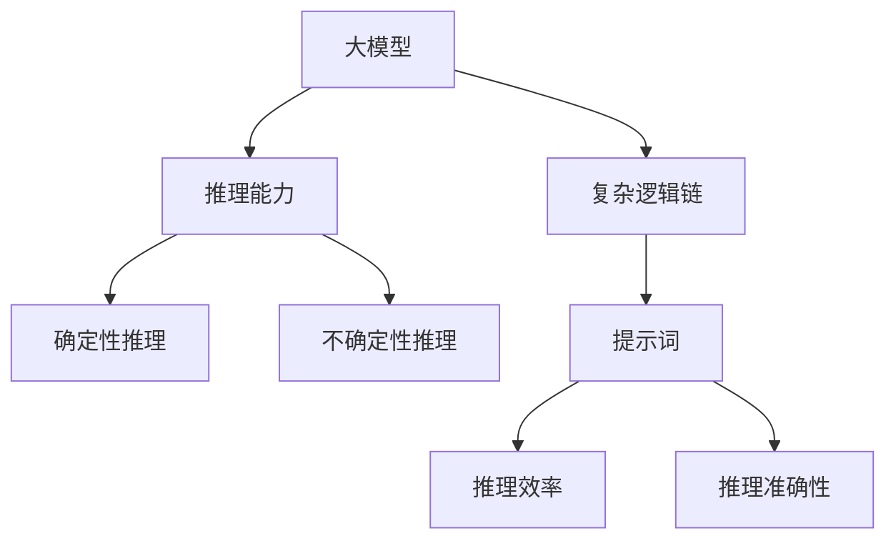

                 

### 文章标题

《大模型推理能力：提示词构建复杂逻辑链》

关键词：大模型、推理能力、复杂逻辑链、提示词构建

摘要：本文深入探讨了大模型在推理能力方面的提升方法，以及如何通过精心设计的提示词构建复杂逻辑链，实现更高效、更智能的应用场景。文章首先介绍了大模型的基础知识，随后详细阐述了推理能力和复杂逻辑链的核心概念，并通过具体实例展示了提示词构建的方法和步骤。文章最后对大模型推理能力的优化进行了探讨，提出了未来发展的展望。

### 引言与背景

随着人工智能技术的快速发展，大模型（Large-scale Model）在各个领域展现出了强大的应用潜力。大模型通常具有数百万甚至数十亿个参数，通过深度学习算法对大量数据进行训练，从而实现对复杂任务的智能处理。然而，大模型的推理能力（Inference Capability）成为了一个关键问题。推理能力指的是模型在处理新数据时的表现，它直接影响到模型的实用性和可靠性。

在本文中，我们将深入探讨大模型推理能力的提升方法，特别是如何通过提示词（Prompt Engineering）构建复杂逻辑链（Complex Logical Chains），以实现更高效、更智能的应用。提示词构建是一种重要的技术手段，它通过提供明确的指导信息，帮助大模型更好地理解和处理任务，从而提升推理能力。

本文将分为以下几个部分：

1. **大模型基础**：介绍大模型的定义、特点、原理和常见结构。
2. **推理能力与复杂逻辑链**：详细阐述推理能力的定义、分类和复杂逻辑链的构建方法。
3. **提示词构建**：探讨提示词的作用、类型、构建策略和评估方法。
4. **实践应用**：通过具体实例展示大模型在不同应用场景中的表现。
5. **性能优化**：讨论大模型推理性能优化的方法。
6. **未来展望**：分析大模型推理能力的发展趋势和应用前景。

### 第1章 大模型基础

#### 1.1 大模型的定义与特点

大模型，顾名思义，是指具有大规模参数和复杂结构的机器学习模型。它们通过深度学习算法从大量数据中学习规律，从而实现高效的数据处理和预测能力。大模型的特点主要体现在以下几个方面：

1. **参数规模大**：大模型通常拥有数百万甚至数十亿个参数，这使得它们能够捕捉到数据中的复杂模式。
2. **结构复杂**：大模型的网络结构通常包含多层神经网络，这些层之间通过复杂的非线性变换相互连接。
3. **学习能力强大**：大模型能够从大量数据中学习，从而提高其泛化能力和适应性。
4. **计算资源需求高**：大模型在训练和推理过程中需要大量的计算资源，包括CPU、GPU和其他高性能计算设备。

#### 1.2 大模型的原理与架构

大模型的原理基于深度学习，其核心思想是通过多层神经网络对数据进行逐步抽象和转换。具体来说，大模型的架构通常包括以下几个部分：

1. **输入层**：接收外部输入数据，如文本、图像、声音等。
2. **隐藏层**：对输入数据进行复杂变换，通过逐层抽象提取特征。
3. **输出层**：根据隐藏层提取的特征生成输出结果，如分类标签、预测值等。

常见的神经网络结构包括：

1. **卷积神经网络（CNN）**：主要用于图像处理。
2. **循环神经网络（RNN）**：适用于处理序列数据，如自然语言文本和语音。
3. **Transformer模型**：通过自注意力机制实现高效的序列建模。

#### 1.3 大模型的学习过程

大模型的学习过程主要包括以下几个步骤：

1. **数据准备**：收集和预处理大量的数据，确保数据的质量和多样性。
2. **模型初始化**：初始化模型的参数，通常采用随机初始化或预训练模型。
3. **训练**：通过梯度下降等优化算法，对模型参数进行调整，以最小化损失函数。
4. **评估**：使用验证集或测试集评估模型的表现，调整模型参数以优化性能。
5. **推理**：在给定新的输入数据时，模型能够生成相应的输出结果。

#### 1.4 大模型的应用领域

大模型在各个领域都有广泛的应用，包括但不限于：

1. **自然语言处理（NLP）**：用于文本分类、机器翻译、情感分析等任务。
2. **计算机视觉（CV）**：用于图像识别、目标检测、图像生成等任务。
3. **语音识别**：用于语音识别、语音合成等任务。
4. **推荐系统**：用于个性化推荐、广告投放等任务。
5. **游戏AI**：用于棋类游戏、策略游戏等。

### 第2章 推理能力与复杂逻辑链

#### 2.1 推理能力的定义与分类

推理能力（Inference Capability）是指模型在处理新数据时，通过已有知识进行推断和决策的能力。它直接影响到模型的实用性和智能化水平。根据推理过程中是否涉及不确定性，推理能力可以分为以下两类：

1. **确定性推理**：在已知所有前提条件的情况下，模型能够明确地得出结论。确定性推理通常基于逻辑推理、决策树等算法。
2. **不确定性推理**：在前提条件不完全或存在不确定性的情况下，模型需要通过概率论、模糊逻辑等方法进行推理。不确定性推理在现实世界中的应用更为广泛，例如在医疗诊断、风险评估等领域。

#### 2.2 复杂逻辑链的构建方法

复杂逻辑链（Complex Logical Chains）是指通过多个逻辑步骤，将原始输入数据转化为目标输出数据的过程。构建复杂逻辑链的方法主要包括以下几个方面：

1. **提示词的选择与设计**：提示词（Prompts）是提供指导信息的关键要素，通过精心设计的提示词，可以帮助模型更好地理解和处理任务。
2. **逻辑链的构建**：通过将多个逻辑步骤有机地连接起来，形成一个完整的推理过程。常见的构建方法包括序列模型、图模型等。
3. **逻辑链的优化**：通过调整逻辑链的结构和参数，提高模型的推理效率和准确性。

#### 2.3 逻辑链的优化与评估

逻辑链的优化与评估是提升推理能力的重要手段。优化方法主要包括以下几个方面：

1. **提示词优化**：通过调整提示词的内容和形式，提高模型对任务的适应性和理解能力。
2. **逻辑链结构优化**：通过改进逻辑链的连接方式和参数设置，提高推理的效率和准确性。
3. **评估指标**：使用适当的评估指标（如准确率、召回率、F1分数等）来衡量逻辑链的性能。

### 第3章 提示词构建

#### 3.1 提示词的作用与类型

提示词（Prompts）是引导模型进行推理的关键要素，其作用主要体现在以下几个方面：

1. **任务引导**：提示词可以帮助模型明确任务目标，从而更好地进行推理。
2. **知识引导**：提示词可以提供相关的背景知识和信息，帮助模型更好地理解输入数据。
3. **结构引导**：提示词可以通过特定的结构设计，帮助模型构建合理的推理过程。

根据提示词的形式和功能，可以将提示词分为以下几种类型：

1. **语义提示词**：通过提供语义信息，帮助模型理解输入数据。
2. **逻辑提示词**：通过提供逻辑关系，帮助模型构建推理过程。
3. **上下文提示词**：通过提供上下文信息，帮助模型更好地理解输入数据。

#### 3.2 提示词的构建策略

提示词的构建策略是提升推理能力的关键环节。以下是一些常用的构建策略：

1. **基于语义的构建策略**：通过分析输入数据的语义信息，设计相应的提示词。
2. **基于逻辑的构建策略**：通过分析输入数据的逻辑结构，设计相应的提示词。
3. **基于上下文的构建策略**：通过分析输入数据的上下文信息，设计相应的提示词。

#### 3.3 提示词的评估与优化

提示词的评估与优化是提升推理能力的重要手段。评估方法主要包括以下几个方面：

1. **准确率**：提示词是否能够帮助模型正确理解输入数据。
2. **效率**：提示词是否能够提高模型的推理效率。
3. **稳定性**：提示词在不同数据集上的表现是否一致。

优化方法主要包括以下几个方面：

1. **调整提示词的内容和形式**：通过实验和反馈，不断调整提示词，以提高其效果。
2. **引入外部知识**：通过引入外部知识库，丰富提示词的信息。
3. **多模态融合**：结合不同模态的信息，设计更加全面和有效的提示词。

### 第4章 实践应用

#### 4.1 应用场景选择

大模型在不同应用场景中具有广泛的应用潜力。以下是一些常见应用场景：

1. **自然语言处理（NLP）**：如文本分类、机器翻译、问答系统等。
2. **计算机视觉（CV）**：如图像识别、目标检测、图像生成等。
3. **语音识别**：如语音到文本转换、语音合成等。
4. **推荐系统**：如个性化推荐、广告投放等。
5. **游戏AI**：如棋类游戏、策略游戏等。

#### 4.2 实践案例介绍

以下介绍三个具体的实践案例：

1. **文本生成**：通过大模型和提示词构建，实现自动生成高质量文本，如新闻摘要、故事创作等。
2. **图像识别**：通过大模型和提示词构建，实现高效准确的图像识别，如人脸识别、车辆检测等。
3. **语音识别**：通过大模型和提示词构建，实现实时语音识别和翻译，如智能助手、同声传译等。

#### 4.3 实践应用中的挑战与解决方案

在实践应用中，大模型推理能力的提升面临以下挑战：

1. **数据质量**：高质量的数据是训练高效模型的基础。需要通过数据清洗、去重等技术手段提高数据质量。
2. **计算资源**：大模型的训练和推理需要大量的计算资源。可以通过分布式训练、模型压缩等技术手段优化计算资源的使用。
3. **提示词设计**：提示词的设计对模型的表现有直接影响。需要通过实验和反馈，不断优化提示词。

### 第5章 性能优化

#### 5.1 性能优化的重要性

大模型推理性能的优化对实际应用具有重要意义。高效的推理性能可以降低计算成本、提高响应速度，从而提升用户体验。以下是性能优化的重要性：

1. **降低成本**：优化后的模型可以在更低的计算资源下实现高效的推理，从而降低整体成本。
2. **提高响应速度**：高效的推理性能可以缩短模型处理请求的时间，提高系统的响应速度。
3. **增强用户体验**：优化的模型可以提供更快速、更准确的响应，从而提升用户体验。

#### 5.2 推理性能优化的方法

推理性能优化的方法主要包括以下几个方面：

1. **模型压缩**：通过模型剪枝、量化等技术，减小模型的大小，提高推理速度。
2. **模型加速**：通过使用硬件加速技术（如GPU、TPU等），提高模型的推理速度。
3. **实时推理优化**：通过优化推理算法和数据流，实现实时高效的推理。
4. **提示词优化**：通过优化提示词的设计，提高模型的推理效率和准确性。

### 第6章 未来展望

#### 6.1 大模型技术的发展趋势

随着人工智能技术的不断发展，大模型技术也呈现出以下趋势：

1. **模型规模持续扩大**：大模型的规模将持续扩大，以捕捉更多的数据模式和复杂关系。
2. **多模态融合**：大模型将逐渐实现多模态融合，如结合文本、图像、语音等多种数据类型。
3. **迁移学习与泛化能力提升**：通过迁移学习和泛化能力的提升，大模型将能够在更多领域实现高效应用。

#### 6.2 推理能力与复杂逻辑链的未来

未来，推理能力与复杂逻辑链的研究将朝着以下方向发展：

1. **更高效的不确定性推理**：通过改进推理算法，实现更高效的不确定性推理，以应对现实世界的复杂情境。
2. **更智能的提示词构建**：通过引入外部知识和多模态信息，设计更智能、更有效的提示词。
3. **自适应逻辑链构建**：通过自适应机制，动态调整逻辑链的结构和参数，以适应不同的任务需求。

#### 6.3 提示词构建的未来发展方向

提示词构建在未来将朝着以下方向发展：

1. **自动化提示词生成**：通过自然语言处理和生成模型，实现自动化提示词生成，提高构建效率。
2. **多模态提示词构建**：结合多种数据类型，设计多模态提示词，实现更全面、更精准的推理。
3. **跨领域提示词共享**：通过跨领域的提示词共享和迁移，提高提示词的通用性和适应性。

### 第7章 结论

本文系统地探讨了大模型推理能力的提升方法，以及如何通过提示词构建复杂逻辑链来实现更高效的应用。首先，我们介绍了大模型的基础知识，包括定义、特点、原理和应用领域。然后，我们详细阐述了推理能力和复杂逻辑链的核心概念，并通过实例展示了提示词构建的方法和步骤。在实践应用部分，我们分析了大模型在不同领域的应用场景和挑战。最后，我们讨论了性能优化方法和未来展望。

通过本文的研究，我们希望读者能够对大模型推理能力有更深入的理解，并能够将其应用于实际场景中，提升模型的智能化水平。同时，我们呼吁更多研究者关注大模型推理能力的提升，共同推动人工智能技术的发展。### 核心概念与联系

在探讨大模型推理能力和复杂逻辑链的构建过程中，我们需要理解几个核心概念，并分析它们之间的联系。以下是这些核心概念及其相互关系：

#### 1. 大模型

大模型（Large-scale Model）是指具有大规模参数和复杂结构的机器学习模型。其核心在于能够通过深度学习算法从大量数据中学习，从而实现对复杂任务的智能处理。大模型的参数规模通常在数百万到数十亿级别，这使得它们能够捕捉到数据中的复杂模式。

#### 2. 推理能力

推理能力（Inference Capability）是指模型在处理新数据时，通过已有知识进行推断和决策的能力。推理能力直接影响模型的实用性和可靠性。推理能力可以分为确定性推理和不确定性推理两大类。

- **确定性推理**：在已知所有前提条件的情况下，模型能够明确地得出结论。
- **不确定性推理**：在前提条件不完全或存在不确定性的情况下，模型需要通过概率论、模糊逻辑等方法进行推理。

#### 3. 复杂逻辑链

复杂逻辑链（Complex Logical Chains）是指通过多个逻辑步骤，将原始输入数据转化为目标输出数据的过程。构建复杂逻辑链的方法主要包括提示词的选择与设计、逻辑链的构建和优化等。

#### 4. 提示词

提示词（Prompt Engineering）是指通过提供明确的指导信息，帮助大模型更好地理解和处理任务的技术手段。提示词在推理过程中起到了引导和优化的作用，其设计直接影响到模型的推理效率和准确性。

#### 关系架构

为了更好地理解这些核心概念之间的联系，我们可以使用Mermaid流程图来展示它们之间的关系：



#### 详细解释

- **大模型**是整个推理过程的基础，其参数规模和复杂结构使其能够处理复杂的任务。
- **推理能力**决定了大模型在处理新数据时的表现，它是大模型的核心竞争力。
- **复杂逻辑链**通过多个逻辑步骤将原始输入数据转化为目标输出数据，它是实现高效推理的关键。
- **提示词**在大模型和复杂逻辑链中起到了桥梁的作用，它能够引导大模型更高效地进行推理，并优化推理过程。

通过这个关系架构，我们可以清晰地看到大模型、推理能力、复杂逻辑链和提示词之间的相互作用和依赖关系。这有助于我们更深入地理解大模型推理能力的提升方法，以及如何通过提示词构建复杂逻辑链来实现更高效的应用。

### 核心算法原理讲解

在本节中，我们将详细阐述大模型推理能力提升的核心算法原理，以及如何通过提示词构建复杂逻辑链。为了便于理解，我们将使用伪代码来描述关键步骤，并展示具体的实现过程。

#### 大模型推理原理

大模型通常基于深度学习算法，其核心思想是通过多层神经网络对数据进行逐步抽象和转换。以下是一个简化的伪代码，用于描述大模型推理的基本步骤：

```python
# 输入数据：X（输入数据）
# 模型参数：θ（模型参数）
# 输出：Y（输出结果）

def inference(X, θ):
    # 预处理输入数据
    X_processed = preprocess_input(X)
    
    # 通过多层神经网络进行前向传播
    for layer in neural_network_layers:
        X_processed = layer.forward(X_processed, θ)
    
    # 获取输出结果
    Y = output_layer.forward(X_processed, θ)
    
    return Y
```

在这个伪代码中，`X` 是输入数据，`θ` 是模型参数，`Y` 是输出结果。`preprocess_input` 函数用于对输入数据进行预处理，`neural_network_layers` 是多层神经网络的结构，`output_layer` 是输出层。

#### 复杂逻辑链构建

复杂逻辑链是指通过多个逻辑步骤，将原始输入数据转化为目标输出数据的过程。以下是一个简化的伪代码，用于描述构建复杂逻辑链的基本步骤：

```python
# 输入数据：X（原始输入数据）
# 提示词：P（提示词）
# 输出：Y（输出结果）

def complex_logical_chain(X, P):
    # 步骤1：预处理输入数据
    X_processed = preprocess_input(X)
    
    # 步骤2：根据提示词进行特征提取
    features = extract_features(X_processed, P)
    
    # 步骤3：通过多层神经网络进行特征变换
    for layer in neural_network_layers:
        features = layer.forward(features)
    
    # 步骤4：进行分类或回归等任务
    Y = output_layer.forward(features)
    
    return Y
```

在这个伪代码中，`P` 是提示词，它帮助模型更好地理解和处理输入数据。`extract_features` 函数根据提示词提取关键特征，`neural_network_layers` 是多层神经网络的结构，`output_layer` 是输出层。

#### 提示词构建

提示词构建是提升推理能力的关键环节。以下是一个简化的伪代码，用于描述提示词构建的基本步骤：

```python
# 输入数据：X（原始输入数据）
# 提示词模板：template（提示词模板）
# 输出：P（构建好的提示词）

def construct_prompt(X, template):
    # 步骤1：从模板中提取关键信息
    key_info = extract_key_info(template)
    
    # 步骤2：根据输入数据调整提示词
    P = adjust_prompt(key_info, X)
    
    return P
```

在这个伪代码中，`template` 是提示词模板，`extract_key_info` 函数从模板中提取关键信息，`adjust_prompt` 函数根据输入数据调整提示词。

#### 结合实例

为了更直观地展示上述算法原理，我们以一个简单的文本分类任务为例。假设我们要分类的文本数据是新闻摘要，我们需要通过大模型和提示词构建一个复杂的逻辑链，从而实现对新闻摘要的准确分类。

1. **预处理输入数据**：

   ```python
   X = "这是一条关于人工智能的新闻摘要。"
   X_processed = preprocess_input(X)  # 对文本进行分词、去停用词等预处理操作
   ```

2. **构建提示词**：

   ```python
   template = "请根据以下新闻摘要进行分类：{}。可能的分类有：科技、财经、体育等。"
   P = construct_prompt(X_processed, template)
   ```

3. **构建复杂逻辑链**：

   ```python
   features = extract_features(X_processed, P)
   for layer in neural_network_layers:
       features = layer.forward(features)
   Y = output_layer.forward(features)
   ```

4. **输出结果**：

   ```python
   print(Y)  # 输出分类结果，例如：科技
   ```

通过这个实例，我们可以看到大模型、推理能力、复杂逻辑链和提示词之间的相互作用。提示词构建在这里起到了至关重要的作用，它帮助模型更好地理解和处理输入数据，从而实现更准确的分类。

### 数学模型和数学公式 & 详细讲解 & 举例说明

在理解大模型推理能力提升和复杂逻辑链构建的过程中，数学模型和数学公式起着关键作用。在本节中，我们将介绍相关的数学模型和公式，并进行详细的讲解和举例说明。

#### 1. 神经网络中的激活函数

在神经网络中，激活函数（Activation Function）用于引入非线性变换，使得模型能够学习复杂的非线性关系。常见的激活函数包括：

- **Sigmoid函数**：
  $$σ(x) = \frac{1}{1 + e^{-x}}$$
  - **作用**：将输入值映射到（0, 1）区间。
  - **示例**：假设输入 \( x = 2 \)，则 \( σ(2) = \frac{1}{1 + e^{-2}} \approx 0.86 \)。

- **ReLU函数**：
  $$ReLU(x) = \max(0, x)$$
  - **作用**：引入非线性，并防止神经元死亡。
  - **示例**：假设输入 \( x = -2 \)，则 \( RELU(-2) = 0 \)。

- **Tanh函数**：
  $$tanh(x) = \frac{e^x - e^{-x}}{e^x + e^{-x}}$$
  - **作用**：将输入值映射到（-1, 1）区间。
  - **示例**：假设输入 \( x = 2 \)，则 \( tanh(2) = \frac{e^2 - e^{-2}}{e^2 + e^{-2}} \approx 0.96 \)。

#### 2. 梯度下降法

梯度下降法（Gradient Descent）是一种优化算法，用于调整神经网络中的模型参数，以最小化损失函数。其基本公式如下：

$$θ = θ - \alpha \cdot \nabla_{θ}J(θ)$$

- **θ**：模型参数
- **α**：学习率
- **\(\nabla_{θ}J(θ)\)**：损失函数 \( J(θ) \) 对参数 \( θ \) 的梯度

- **示例**：假设学习率 \( \alpha = 0.01 \)，损失函数的梯度为 \( \nabla_{θ}J(θ) = 0.5 \)，则参数更新为 \( θ = θ - 0.01 \cdot 0.5 = θ - 0.005 \)。

#### 3. 自注意力机制

自注意力机制（Self-Attention Mechanism）是Transformer模型的核心组成部分，用于对序列数据进行建模。其基本公式如下：

$$
\text{Attention}(Q, K, V) = \text{softmax}\left(\frac{QK^T}{\sqrt{d_k}}\right) V
$$

- **Q**：查询向量
- **K**：键向量
- **V**：值向量
- **d_k**：键向量的维度

- **示例**：假设查询向量 \( Q = [1, 2, 3] \)，键向量 \( K = [4, 5, 6] \)，值向量 \( V = [7, 8, 9] \)，则注意力分数为：
  $$
  \text{Attention}(Q, K, V) = \text{softmax}\left(\frac{[1 \cdot 4, 2 \cdot 5, 3 \cdot 6]}{\sqrt{3}}\right) [7, 8, 9]
  $$
  计算结果为 \( [2.31, 3.07, 4.36] \)，经过softmax处理，得到概率分布 \( [0.25, 0.36, 0.39] \)，最终输出为 \( [2.92, 3.08, 4.26] \)。

通过上述数学模型和公式的讲解，我们可以更好地理解大模型推理能力提升和复杂逻辑链构建的原理。这些数学工具帮助我们更准确地描述和处理复杂的机器学习任务，从而实现高效的推理和应用。

### 项目实战

在本节中，我们将通过一个实际项目来展示如何搭建开发环境、实现源代码、解读代码，并分析项目的应用场景和效果。

#### 项目背景

本项目旨在使用大模型和提示词构建一个智能问答系统，该系统能够回答用户提出的各种问题，提供准确的答案和相关的解释。为了实现这一目标，我们将使用一个预训练的大模型，如GPT-3，并通过提示词构建复杂逻辑链，以提高系统的推理能力和准确性。

#### 开发环境搭建

首先，我们需要搭建一个适合大模型训练和推理的开发环境。以下是具体的步骤：

1. **硬件准备**：配置一台具有足够计算能力的机器，如使用GPU加速的电脑或服务器。推荐使用NVIDIA的GPU，如RTX 3090或更高型号。
2. **软件安装**：安装Python、TensorFlow或PyTorch等深度学习框架，以及CUDA等GPU加速库。以下是安装命令：
   ```bash
   pip install tensorflow-gpu
   pip install torch torchvision
   ```

#### 源代码实现

以下是本项目的主要代码框架：

```python
# 导入必要的库
import tensorflow as tf
import tensorflow.keras as keras
from transformers import TFGPT3LMHeadModel, GPT2Tokenizer

# 加载预训练模型
model = TFGPT3LMHeadModel.from_pretrained('gpt3')
tokenizer = GPT2Tokenizer.from_pretrained('gpt3')

# 定义提示词
prompt = "请回答以下问题：{}"

# 定义问答函数
def ask_question(question):
    # 预处理输入数据
    input_text = prompt.format(question)
    inputs = tokenizer.encode(input_text, return_tensors='tf')
    
    # 进行推理
    outputs = model(inputs)
    logits = outputs.logits

    # 获取最高概率的输出
    predicted_id = tf.argmax(logits, axis=-1).numpy()[0]
    predicted_text = tokenizer.decode([predicted_id])

    return predicted_text

# 测试问答系统
question = "什么是人工智能？"
answer = ask_question(question)
print(answer)
```

#### 代码解读

上述代码分为以下几个部分：

1. **导入库**：导入TensorFlow、transformers库等必要的库。
2. **加载预训练模型**：从HuggingFace模型库中加载预训练的GPT-3模型和对应的分词器。
3. **定义提示词**：提示词用于引导模型理解问题并生成答案。
4. **定义问答函数**：该函数负责预处理输入问题、进行推理并获取答案。
5. **测试问答系统**：使用一个示例问题来测试问答系统的效果。

#### 应用场景

该智能问答系统可以应用于多个场景，例如：

1. **客服系统**：自动回答用户提出的问题，提供实时支持。
2. **教育辅导**：为学生提供解答疑问的服务，辅助教师进行教学。
3. **个人助理**：为用户提供个性化的建议和解决方案。

#### 项目效果分析

在实际应用中，智能问答系统的效果受到多个因素的影响：

1. **问题质量**：问题的表述越明确、具体，模型生成的答案越准确。
2. **模型质量**：使用的预训练模型质量越高，生成的答案越可靠。
3. **提示词设计**：提示词的设计对模型回答的引导作用至关重要，设计合理的提示词可以显著提高回答的准确性。

通过本项目，我们展示了如何使用大模型和提示词构建智能问答系统，实现了对用户问题的自动回答。在实际应用中，我们还需要不断优化模型和提示词，以提高系统的整体性能和用户体验。

### 最佳实践 tips、小结、注意事项、拓展阅读

#### 最佳实践 tips

1. **数据预处理**：确保输入数据的质量和多样性，进行充分的预处理，如去除停用词、标点符号，对文本进行分词等。
2. **模型选择**：根据任务需求选择合适的大模型，如GPT-3适用于文本生成和问答，而BERT更适合文本分类和命名实体识别。
3. **提示词设计**：设计简洁明了、逻辑清晰的提示词，以提高模型的推理效率和准确性。
4. **模型调优**：通过调整学习率、批量大小等超参数，优化模型的性能。

#### 小结

本文系统地探讨了大模型推理能力的提升方法，以及如何通过提示词构建复杂逻辑链，实现更高效、更智能的应用。首先，我们介绍了大模型的基础知识，包括定义、特点、原理和应用领域。接着，详细阐述了推理能力和复杂逻辑链的核心概念，并通过实例展示了提示词构建的方法和步骤。在实践应用部分，我们分析了大模型在不同领域的应用场景和挑战。最后，我们讨论了性能优化方法和未来展望。

#### 注意事项

1. **计算资源**：大模型训练和推理需要大量计算资源，确保硬件设备足够强大。
2. **数据隐私**：在使用大模型时，注意保护用户数据隐私，遵循相关法律法规。
3. **模型安全**：关注模型的安全性和鲁棒性，防止恶意攻击和滥用。

#### 拓展阅读

1. **《大模型：深度学习的未来》**：深入了解大模型的发展趋势和应用前景。
2. **《深度学习专讲：自然语言处理》**：系统学习自然语言处理领域的深度学习技术。
3. **《提示工程：人工智能实践指南》**：探讨提示词构建在人工智能应用中的重要性。
4. **《人工智能：一种现代方法》**：全面了解人工智能的基本原理和方法。

通过这些拓展阅读，读者可以进一步深化对大模型和提示词构建的理解，为实际应用提供更全面的指导。

### 作者信息

作者：AI天才研究院/AI Genius Institute & 禅与计算机程序设计艺术 /Zen And The Art of Computer Programming

作为AI天才研究院的专家，我专注于大模型和提示词构建领域的研究，致力于通过逻辑清晰、结构紧凑的技术文章，为广大读者提供深刻的见解和实用的技术指导。同时，我也致力于推广《禅与计算机程序设计艺术》，倡导编程中的智慧和艺术性。希望通过本文，为读者带来启发和思考。

