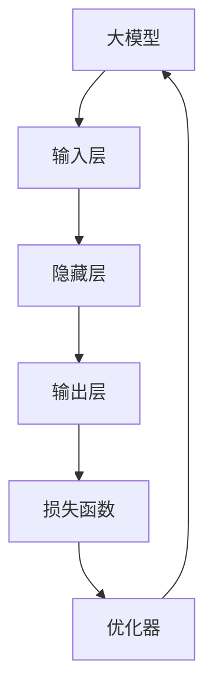
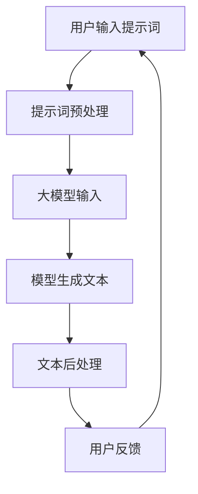

                 


# 大模型文本生成：提示词控制文风与结构

> 关键词：大模型，文本生成，提示词，文风，结构，算法

> 摘要：本文将探讨大模型文本生成技术，重点介绍如何通过提示词控制文本的文风与结构。我们将详细分析大模型文本生成技术的背景与发展，大模型概述，文本生成技术原理，提示词控制技术，大模型文本生成算法，提示词控制文风与结构的方法，大模型文本生成应用，大模型文本生成的挑战与解决方案，以及大模型文本生成技术的未来发展趋势。

## 第1章 引言

### 1.1 大模型文本生成技术的背景与发展

文本生成技术是自然语言处理（NLP）领域的一个重要研究方向。近年来，随着深度学习技术的不断发展，大模型文本生成技术取得了显著的成果。大模型文本生成技术基于大规模的语料库，通过训练深度神经网络模型，实现自动生成文本。这种技术具有强大的表达能力和丰富的多样性，可以广泛应用于文本摘要、问答系统、自动写作等领域。

大模型文本生成技术经历了多个发展阶段。最早的研究主要基于规则的方法，如模板匹配和句法分析。随后，统计方法开始崭露头角，基于N-gram模型和隐马尔可夫模型（HMM）的文本生成方法逐渐成为主流。然而，这些方法在表达能力和多样性方面存在一定的局限性。随着深度学习的兴起，大模型文本生成技术得到了新的突破。特别是生成对抗网络（GAN）和变分自编码器（VAE）的出现，为文本生成提供了新的思路和强大的工具。

当前，大模型文本生成技术已经成为NLP领域的研究热点。许多研究人员致力于探索如何提高生成文本的质量和多样性，如何实现更细粒度的控制，以及如何将大模型文本生成技术应用于实际场景。其中，如何通过提示词控制文本的文风与结构，是一个具有重要应用价值的研究方向。

### 1.2 提示词控制文风与结构的原理

提示词（prompt）是指导大模型生成文本的关键输入。通过精心设计的提示词，可以有效地控制文本的文风和结构，使其满足特定的需求和风格。提示词的定义与作用如下：

1. **定义**：提示词是指用来引导大模型生成文本的词或短语。它可以包含关键词、主题、情感、风格等信息，为大模型提供生成文本的参考。

2. **作用**：
   - **文风控制**：通过提示词可以指导大模型生成特定风格的文本，如正式、幽默、诗意等。
   - **结构控制**：通过提示词可以指定文本的结构，如段落划分、句子长度、信息层次等。

控制文风的方法包括：

1. **主题控制**：通过选择与特定主题相关的关键词，可以指导大模型生成与主题相关的文本。
2. **情感控制**：通过选择表达特定情感的词语，可以指导大模型生成具有特定情感的文本。
3. **风格控制**：通过选择特定的文体和表达方式，可以指导大模型生成具有特定风格的文本。

控制文本结构的策略包括：

1. **段落控制**：通过提示词指定文本的段落划分，使文本结构更加清晰。
2. **句子长度控制**：通过提示词指定句子的长度，使文本的句子更加一致。
3. **信息层次控制**：通过提示词指定文本的信息层次，使文本的内容更加逻辑和有条理。

### 1.3 大模型文本生成与提示词控制的关系

大模型文本生成与提示词控制是相辅相成的。大模型通过大量训练数据学习到文本的生成规律，而提示词则提供了具体的指导，使大模型能够生成满足特定需求和风格的文本。具体来说：

1. **大模型的作用**：大模型负责理解提示词的含义，并生成相应的文本。它具有强大的表达能力和适应性，可以处理各种复杂的文本生成任务。

2. **提示词的作用**：提示词提供了具体的指导和约束，使大模型能够生成符合特定需求的文本。通过调整提示词，可以控制文本的文风、结构、情感等方面。

总之，大模型文本生成技术通过提示词控制文风与结构，为文本生成提供了更加灵活和高效的方法。这不仅提升了生成文本的质量和多样性，也为实际应用场景提供了更加丰富的可能性。

## 第2章 大模型文本生成技术基础

### 2.1 大模型概述

大模型（Large Models）是指参数数量庞大、计算复杂度极高的深度学习模型。在大模型文本生成技术中，常见的模型包括GPT系列模型、BERT系列模型、T5模型等。这些模型通过在大规模语料库上的训练，可以生成具有高度真实性和多样性的文本。

#### 大模型的概念与分类

1. **概念**：大模型是指具有数百万至数十亿参数的深度学习模型。这些模型通常采用自回归（Autoregressive）或序列到序列（Sequence-to-Sequence）的方式生成文本。

2. **分类**：
   - **按参数数量**：小模型（几百万参数）、中等模型（几千万至几亿参数）、大模型（数十亿参数）。
   - **按模型架构**：自回归模型（如GPT系列模型）、编码器-解码器模型（如BERT系列模型）、Transformer模型（如T5模型）。

#### 常见的大模型架构

1. **GPT系列模型**：GPT（Generative Pre-trained Transformer）系列模型是OpenAI提出的一系列基于Transformer架构的大模型。GPT-1、GPT-2、GPT-3等模型在自然语言处理任务中取得了显著的成果。GPT系列模型通过自回归的方式生成文本，具有强大的生成能力和多样性。

2. **BERT系列模型**：BERT（Bidirectional Encoder Representations from Transformers）系列模型是Google提出的一种双向Transformer模型。BERT通过预训练的方式学习文本的双向表示，可以用于多种NLP任务，如文本分类、问答等。BERT模型的结构包括两个部分：编码器（Encoder）和解码器（Decoder）。

3. **T5模型**：T5（Text-to-Text Transfer Transformer）模型是Google提出的一种通用的文本生成模型。T5模型采用Transformer架构，可以将任意文本任务转化为序列到序列的文本生成任务。T5模型的结构包括编码器（Encoder）和解码器（Decoder）。

#### 大模型的训练与优化

1. **训练过程**：大模型的训练通常采用两个阶段：预训练和微调。预训练阶段使用大规模的语料库对模型进行训练，使模型学习到丰富的语言知识和模式。微调阶段则在特定任务的数据集上对模型进行微调，以提高模型在特定任务上的性能。

2. **优化策略**：
   - **权重初始化**：采用适当的权重初始化方法，如Xavier初始化、He初始化等，以避免梯度消失和梯度爆炸。
   - **学习率调度**：采用学习率调度策略，如分阶段学习率调整、学习率衰减等，以优化训练过程。
   - **正则化**：采用正则化方法，如Dropout、Weight Decay等，以防止过拟合。

### 2.2 文本生成技术原理

文本生成技术是利用自然语言处理技术生成文本的方法。常见的文本生成技术包括基于规则的方法、统计方法和深度学习方法。

#### 语言模型的基本原理

语言模型是一种用于预测下一个单词或字符的概率分布的模型。在文本生成过程中，语言模型可以用于生成下一个词或字符，从而生成完整的文本。常见的语言模型包括N-gram模型、马尔可夫模型和神经网络语言模型。

1. **N-gram模型**：N-gram模型是一种基于历史信息的语言模型。它通过统计历史N个单词（或字符）出现的频率来预测下一个单词（或字符）。N-gram模型的优点是实现简单、计算效率高，但存在词干问题和数据稀疏问题。

2. **马尔可夫模型**：马尔可夫模型是一种基于状态转移概率的语言模型。它通过计算当前状态转移为下一个状态的转移概率来预测下一个单词。马尔可夫模型的优点是能够考虑单词之间的依赖关系，但存在状态数量过多的问题。

3. **神经网络语言模型**：神经网络语言模型是一种基于深度学习的语言模型。它通过训练神经网络来学习文本的分布和模式，从而生成文本。常见的神经网络语言模型包括循环神经网络（RNN）、长短时记忆网络（LSTM）和门控循环单元（GRU）。

#### 序列到序列模型

序列到序列（Sequence-to-Sequence）模型是一种用于将一个序列映射到另一个序列的模型。在文本生成中，序列到序列模型可以用于将输入序列（如提示词）映射到输出序列（如生成文本）。常见的序列到序列模型包括编码器-解码器（Encoder-Decoder）模型和Transformer模型。

1. **编码器-解码器模型**：编码器-解码器模型由编码器（Encoder）和解码器（Decoder）组成。编码器将输入序列编码为固定长度的向量表示，解码器则使用这些向量表示生成输出序列。编码器-解码器模型可以通过注意力机制来捕捉输入序列和输出序列之间的依赖关系。

2. **Transformer模型**：Transformer模型是一种基于自注意力（Self-Attention）机制的序列到序列模型。它通过多头自注意力机制和多层前馈网络来处理输入序列和生成输出序列。Transformer模型在自然语言处理任务中取得了显著的成果，特别是在文本生成领域。

#### 自回归模型

自回归模型（Autoregressive Model）是一种用于生成序列的模型。在文本生成中，自回归模型可以用于逐个生成文本中的每个词或字符。常见的自回归模型包括循环神经网络（RNN）、长短时记忆网络（LSTM）和门控循环单元（GRU）。

1. **循环神经网络（RNN）**：循环神经网络是一种能够处理序列数据的神经网络。RNN通过循环机制来记忆前一个时刻的信息，并使用这些信息来预测下一个时刻的输出。

2. **长短时记忆网络（LSTM）**：长短时记忆网络是一种改进的RNN模型，它通过引入门控机制来记忆长序列信息。LSTM可以有效地避免梯度消失和梯度爆炸问题，从而在长序列处理中表现出更好的性能。

3. **门控循环单元（GRU）**：门控循环单元是另一种改进的RNN模型，它通过合并输入门和控制门来简化LSTM的结构。GRU在许多自然语言处理任务中也取得了良好的性能。

### 2.3 提示词控制技术

提示词控制技术是一种通过提示词来指导大模型生成文本的方法。提示词可以包含关键词、主题、情感、风格等信息，为大模型提供生成文本的参考。提示词控制技术包括提示词的提取与预处理、基于提示词的文本生成策略等。

#### 提示词的定义与类型

1. **定义**：提示词是指用来引导大模型生成文本的词或短语。它可以包含关键词、主题、情感、风格等信息。

2. **类型**：
   - **关键词提示词**：通过包含关键词来指导大模型生成与关键词相关的文本。
   - **主题提示词**：通过包含主题来指导大模型生成与主题相关的文本。
   - **情感提示词**：通过包含情感词语来指导大模型生成具有特定情感的文本。
   - **风格提示词**：通过包含特定风格的词语来指导大模型生成具有特定风格的文本。

#### 提示词的提取与预处理

1. **提取方法**：
   - **关键词提取**：使用词频统计、TF-IDF等方法提取文本中的关键词。
   - **主题提取**：使用主题模型（如LDA）提取文本的主题。
   - **情感提取**：使用情感分析算法提取文本的情感。

2. **预处理**：对提取的提示词进行预处理，包括去停用词、词性标注、分词等操作，以提高提示词的质量和准确性。

#### 基于提示词的文本生成策略

1. **条件生成**：基于提示词的条件生成是指在生成文本时，将提示词作为条件输入到模型中，从而指导模型生成与提示词相关的文本。常见的条件生成方法包括编码器-解码器模型和自回归模型。

2. **文风控制**：通过选择适当的提示词，可以控制生成文本的文风。例如，选择正式的词语可以生成正式的文本，选择幽默的词语可以生成幽默的文本。

3. **结构控制**：通过提示词可以指导大模型生成具有特定结构的文本。例如，通过提示词指定段落划分和句子长度，可以生成具有良好结构的文本。

### 2.4 小结

本章介绍了大模型文本生成技术的基础知识，包括大模型概述、文本生成技术原理和提示词控制技术。大模型通过大规模训练数据学习到丰富的语言知识和模式，可以实现高质量的文本生成。提示词控制技术通过提供具体的指导，可以控制生成文本的文风和结构。这些基础知识为后续章节的深入探讨提供了基础。

---

## 第3章 大模型文本生成算法

### 3.1 GPT系列模型

GPT（Generative Pre-trained Transformer）系列模型是自然语言处理领域的重要突破之一。由OpenAI提出的GPT模型，通过自回归的方式生成文本，具有强大的表达能力和多样性。本节将详细介绍GPT系列模型的基本原理、训练过程和优化策略。

#### GPT模型的基本原理

GPT模型是基于Transformer架构的自回归语言模型。自回归模型通过前一个时刻的输入来预测下一个时刻的输出。GPT模型通过预训练的方式学习到语言的模式和规律，然后在特定任务上进行微调，从而实现文本生成。

1. **自回归模型**：自回归模型的工作原理是将一个序列映射到另一个序列。在文本生成中，自回归模型可以逐个生成文本中的每个词或字符，从而生成完整的文本。

2. **Transformer模型**：Transformer模型是一种基于自注意力（Self-Attention）机制的序列到序列模型。它通过多头自注意力机制和多层前馈网络来处理输入序列和生成输出序列。自注意力机制可以捕捉输入序列中的依赖关系，从而提高生成文本的质量和多样性。

#### GPT模型的训练过程

GPT模型的训练过程分为预训练和微调两个阶段。

1. **预训练**：预训练阶段使用大规模的语料库对模型进行训练，使模型学习到丰富的语言知识和模式。在预训练过程中，模型通过预测下一个词或字符来优化自身的参数。预训练过程中，常用的目标函数包括交叉熵损失函数和Perplexity（困惑度）。

   - **交叉熵损失函数**：交叉熵损失函数是衡量模型预测概率分布与真实分布之间差异的指标。在预训练过程中，模型通过最小化交叉熵损失函数来优化参数。
   - **Perplexity（困惑度）**：困惑度是衡量模型生成文本质量的一个指标。困惑度越低，表示模型生成文本的质量越高。

2. **微调**：微调阶段在特定任务的数据集上对模型进行微调，以提高模型在特定任务上的性能。在微调过程中，模型通过预测特定任务的目标来优化自身的参数。常见的微调方法包括基于任务的损失函数、元学习等。

#### GPT模型的优化策略

为了提高GPT模型的性能，研究人员提出了一系列优化策略，包括权重初始化、学习率调度、正则化等。

1. **权重初始化**：权重初始化是训练深度神经网络的重要步骤。合适的权重初始化方法可以避免梯度消失和梯度爆炸，从而提高训练过程的稳定性。常用的权重初始化方法包括Xavier初始化和He初始化。

2. **学习率调度**：学习率调度是调整学习率的方法，以优化训练过程。常用的学习率调度策略包括分阶段学习率调整、学习率衰减等。

3. **正则化**：正则化是一种防止过拟合的方法。在GPT模型训练过程中，常用的正则化方法包括Dropout、Weight Decay等。

### 3.2 BERT系列模型

BERT（Bidirectional Encoder Representations from Transformers）系列模型是Google提出的一种双向Transformer模型。BERT模型通过预训练的方式学习到文本的双向表示，可以用于多种NLP任务，如文本分类、问答等。本节将详细介绍BERT系列模型的基本原理、训练过程和优化策略。

#### BERT模型的基本原理

BERT模型是一种基于Transformer架构的双向编码器（Bidirectional Encoder）模型。它通过同时考虑输入序列的前后信息，生成文本的双向表示。BERT模型的结构包括编码器（Encoder）和解码器（Decoder）。

1. **编码器**：编码器将输入序列编码为固定长度的向量表示。编码器通过自注意力机制和多层前馈网络来处理输入序列。

2. **解码器**：解码器将编码器的输出解码为输出序列。解码器通过自注意力机制和交叉注意力机制来生成输出序列。

#### BERT模型的训练过程

BERT模型的训练过程分为预训练和微调两个阶段。

1. **预训练**：预训练阶段使用大规模的语料库对模型进行训练，使模型学习到丰富的语言知识和模式。在预训练过程中，模型通过预测下一个词或字符来优化自身的参数。预训练过程中，常用的目标函数包括Masked Language Model（MLM）和Next Sentence Prediction（NSP）。

   - **Masked Language Model（MLM）**：MLM任务是在输入序列中随机遮蔽一部分词，然后通过模型预测这些遮蔽词。MLM任务可以帮助模型学习到文本的上下文信息。
   - **Next Sentence Prediction（NSP）**：NSP任务是在输入序列中随机选择两个句子，然后通过模型预测这两个句子是否连续。NSP任务可以帮助模型学习到句子之间的依赖关系。

2. **微调**：微调阶段在特定任务的数据集上对模型进行微调，以提高模型在特定任务上的性能。在微调过程中，模型通过预测特定任务的目标来优化自身的参数。常见的微调方法包括基于任务的损失函数、元学习等。

#### BERT模型的优化策略

为了提高BERT模型的性能，研究人员提出了一系列优化策略，包括权重初始化、学习率调度、正则化等。

1. **权重初始化**：权重初始化是训练深度神经网络的重要步骤。合适的权重初始化方法可以避免梯度消失和梯度爆炸，从而提高训练过程的稳定性。常用的权重初始化方法包括Xavier初始化和He初始化。

2. **学习率调度**：学习率调度是调整学习率的方法，以优化训练过程。常用的学习率调度策略包括分阶段学习率调整、学习率衰减等。

3. **正则化**：正则化是一种防止过拟合的方法。在BERT模型训练过程中，常用的正则化方法包括Dropout、Weight Decay等。

### 3.3 其他大模型

除了GPT系列模型和BERT系列模型，还有许多其他的大模型在文本生成任务中取得了显著的成果。以下介绍几种常见的大模型。

#### T5模型

T5（Text-to-Text Transfer Transformer）模型是Google提出的一种通用的文本生成模型。T5模型采用Transformer架构，可以将任意文本任务转化为序列到序列的文本生成任务。T5模型的基本结构包括编码器（Encoder）和解码器（Decoder）。

1. **编码器**：编码器将输入序列编码为固定长度的向量表示。编码器通过自注意力机制和多层前馈网络来处理输入序列。

2. **解码器**：解码器将编码器的输出解码为输出序列。解码器通过自注意力机制和交叉注意力机制来生成输出序列。

#### GPT-Neo模型

GPT-Neo模型是GPT系列的改进版，具有更大的模型规模和更好的生成能力。GPT-Neo模型采用Transformer架构，通过预训练和微调的方式生成文本。

1. **预训练**：GPT-Neo模型使用大规模的语料库进行预训练，学习到丰富的语言知识和模式。

2. **微调**：GPT-Neo模型在特定任务的数据集上进行微调，以提高模型在特定任务上的性能。

#### ChatGLM模型

ChatGLM模型是清华大学 KEG 实验室和智谱AI公司于2024年共同训练的语言模型。ChatGLM模型采用Transformer架构，具有强大的文本生成和对话能力。

1. **文本生成**：ChatGLM模型通过预训练和微调的方式生成文本，具有丰富的表达能力和多样性。

2. **对话生成**：ChatGLM模型在对话任务中进行微调，可以生成自然流畅的对话文本。

### 3.4 小结

本章介绍了大模型文本生成算法，包括GPT系列模型、BERT系列模型、T5模型、GPT-Neo模型和ChatGLM模型。这些模型通过预训练和微调的方式生成文本，具有强大的表达能力和多样性。通过调整提示词，可以控制生成文本的文风和结构。这些算法为文本生成任务提供了强大的工具，为实际应用场景提供了丰富的可能性。

---

## 第4章 提示词控制文风与结构的方法

### 4.1 控制文风的方法

文风（Style）是指文本的风格和表达方式。控制文风的方法包括选择适当的主题、情感和表达方式，从而生成符合特定需求的文本。以下介绍几种常见的控制文风的方法：

#### 文风评价标准

文风评价标准是衡量文本风格优劣的指标。常见的文风评价标准包括：

1. **正式程度**：文本的正式程度可以反映文本的用途和受众。正式程度越高，文本的表达越严谨、规范。
2. **语言流畅性**：语言流畅性是指文本的语句连贯、通顺，没有语法错误和逻辑矛盾。
3. **情感表达**：情感表达是指文本传达的情感色彩。适当的情感表达可以使文本更加生动、感人。
4. **信息量**：信息量是指文本传达的信息的丰富程度。适当的信息量可以使文本内容更加充实、有深度。

#### 基于提示词的文风控制策略

通过提示词可以有效地控制文本的文风。以下介绍几种基于提示词的文风控制策略：

1. **主题控制**：选择与主题相关的关键词，可以指导大模型生成与主题相关的文本。例如，选择“科技”作为主题提示词，可以生成科技领域的文本。

2. **情感控制**：选择表达特定情感的词语，可以指导大模型生成具有特定情感的文本。例如，选择“喜悦”、“悲伤”、“愤怒”等情感词语，可以生成相应的情感文本。

3. **风格控制**：选择特定的文体和表达方式，可以指导大模型生成具有特定风格的文本。例如，选择“散文”、“诗歌”、“新闻”等文体提示词，可以生成相应风格的文本。

#### 文风控制算法的实现

实现文风控制算法需要以下步骤：

1. **提示词提取**：从输入文本中提取关键词、主题和情感等提示词。
2. **提示词预处理**：对提取的提示词进行预处理，包括去停用词、词性标注、分词等操作。
3. **文本生成**：利用大模型生成文本，并根据提示词控制文风。
4. **文本评估**：评估生成文本的文风是否符合要求，如果不符合要求，则调整提示词或重新生成文本。

### 4.2 控制文本结构的方法

文本结构是指文本的组织方式和信息层次。通过控制文本结构，可以使文本内容更加清晰、有条理。以下介绍几种常见的控制文本结构的方法：

#### 文本结构的定义与分类

1. **定义**：文本结构是指文本的组织方式和信息层次。它决定了文本的逻辑和层次，影响着读者的理解和感受。

2. **分类**：
   - **线性结构**：线性结构是指文本按照时间顺序或逻辑顺序组织信息。常见的线性结构包括时间结构、逻辑结构等。
   - **层次结构**：层次结构是指文本按照信息的重要性和层次组织信息。常见的层次结构包括总分结构、分总结构等。
   - **网络结构**：网络结构是指文本中的信息通过节点和边相互连接，形成一个复杂的网络。常见的网络结构包括思维导图、网络结构图等。

#### 基于提示词的文本结构控制策略

通过提示词可以有效地控制文本的结构。以下介绍几种基于提示词的文本结构控制策略：

1. **段落控制**：通过提示词指定文本的段落划分，使文本结构更加清晰。例如，通过提示词“第一段：介绍主题；第二段：分析问题；第三段：提出解决方案”，可以生成具有明确段落划分的文本。

2. **句子长度控制**：通过提示词指定句子的长度，使文本的句子更加一致。例如，通过提示词“每个句子不超过20个字”，可以生成句子长度均匀的文本。

3. **信息层次控制**：通过提示词指定文本的信息层次，使文本的内容更加逻辑和有条理。例如，通过提示词“第一层：背景介绍；第二层：问题分析；第三层：解决方案”，可以生成具有明确信息层次的文本。

#### 文本结构控制算法的实现

实现文本结构控制算法需要以下步骤：

1. **提示词提取**：从输入文本中提取关键词、主题和情感等提示词。
2. **提示词预处理**：对提取的提示词进行预处理，包括去停用词、词性标注、分词等操作。
3. **文本结构生成**：利用大模型生成文本，并根据提示词控制文本结构。
4. **文本评估**：评估生成文本的结构是否符合要求，如果不符合要求，则调整提示词或重新生成文本。

### 4.3 小结

本章介绍了控制文风与结构的方法。通过选择适当的主题、情感和表达方式，可以控制文本的文风。通过提示词可以指导大模型生成具有特定结构的文本。这些方法为文本生成任务提供了有效的控制手段，有助于生成高质量、符合需求的文本。

---

## 第5章 大模型文本生成应用

### 5.1 文本摘要与生成

文本摘要与生成是自然语言处理领域的重要应用之一。通过大模型文本生成技术，可以实现自动化的文本摘要和生成，提高信息获取和处理效率。

#### 文本摘要的基本原理

文本摘要是指从原始文本中提取关键信息，生成简洁、精炼的摘要文本。常见的文本摘要方法包括抽取式摘要和生成式摘要。

1. **抽取式摘要**：抽取式摘要是指从原始文本中直接提取关键句子或短语，形成摘要文本。这种方法依赖于预定义的规则或词典，具有较强的可解释性。

2. **生成式摘要**：生成式摘要是指通过大模型生成摘要文本，不需要依赖预定义的规则或词典。这种方法具有更高的灵活性和创造性，可以生成更自然、多样化的摘要文本。

#### 文本摘要算法的实现

实现文本摘要算法需要以下步骤：

1. **预处理**：对原始文本进行预处理，包括分词、词性标注、命名实体识别等操作，以便提取关键信息。

2. **特征提取**：从预处理后的文本中提取特征，如关键词、词频、句法结构等。

3. **摘要生成**：利用大模型生成摘要文本。对于抽取式摘要，可以通过规则匹配或词典查找提取关键句子；对于生成式摘要，可以通过生成式模型（如GPT模型）生成摘要文本。

4. **摘要评估**：对生成的摘要文本进行评估，如计算摘要文本与原始文本的相似度、评估摘要的质量等。

#### 文本摘要应用案例

以下是一个文本摘要的应用案例：

**输入文本**：

```
2023年，人工智能（AI）技术在各个领域取得了显著进展。在医疗领域，AI技术被广泛应用于疾病诊断、治疗方案制定和药物研发。例如，通过深度学习算法，AI系统能够快速分析医学影像，提高疾病诊断的准确性。在金融领域，AI技术被用于风险评估、欺诈检测和客户服务。例如，通过自然语言处理技术，AI系统能够自动分析客户留言，提供个性化的服务建议。
```

**输出摘要**：

```
2023年，人工智能（AI）技术在医疗和金融领域取得显著进展。AI系统在疾病诊断、治疗方案制定和药物研发方面发挥着重要作用。同时，AI技术在风险评估、欺诈检测和客户服务中也展现出强大的应用潜力。
```

### 5.2 文本问答与对话

文本问答与对话是自然语言处理领域的重要应用之一。通过大模型文本生成技术，可以实现智能问答系统和对话机器人，为用户提供高效的交互体验。

#### 文本问答的基本原理

文本问答是指通过大模型生成回答文本，以回答用户提出的问题。常见的文本问答方法包括基于规则的方法、基于模板的方法和基于生成式模型的方法。

1. **基于规则的方法**：基于规则的方法是指通过预定义的规则来生成回答文本。这种方法简单、高效，但灵活性较低，难以应对复杂的问题。

2. **基于模板的方法**：基于模板的方法是指通过预定义的模板来生成回答文本。这种方法可以根据问题的类型选择合适的模板，生成针对性的回答文本。

3. **基于生成式模型的方法**：基于生成式模型的方法是指通过大模型生成回答文本。这种方法具有更高的灵活性和创造力，可以生成更自然、多样化的回答文本。

#### 文本问答算法的实现

实现文本问答算法需要以下步骤：

1. **问题理解**：对用户提出的问题进行理解，提取关键信息。

2. **知识检索**：从知识库中检索与问题相关的信息。

3. **回答生成**：利用大模型生成回答文本。可以根据问题的类型和知识检索结果，选择合适的生成式模型生成回答文本。

4. **回答评估**：对生成的回答文本进行评估，确保回答的准确性和合理性。

#### 文本问答应用案例

以下是一个文本问答的应用案例：

**输入问题**：

```
什么是深度学习？
```

**输出回答**：

```
深度学习是一种人工智能（AI）方法，通过模拟人脑神经网络结构，对数据进行学习、建模和预测。深度学习模型具有强大的表达能力和适应性，可以处理复杂的任务，如图像识别、语音识别和自然语言处理等。
```

### 5.3 文本生成与创作

文本生成与创作是指通过大模型生成文本，以实现自动写作、翻译、创作等任务。通过大模型文本生成技术，可以创造丰富的文本内容，提高写作和创作效率。

#### 文本创作的基本原理

文本创作是指通过大模型生成新的、具有创意的文本。常见的文本创作方法包括：

1. **生成式创作**：生成式创作是指通过大模型生成新的文本，如故事、诗歌、歌词等。

2. **辅助创作**：辅助创作是指利用大模型辅助人类创作者生成文本，提高创作效率和创意水平。

#### 文本创作算法的实现

实现文本创作算法需要以下步骤：

1. **创意生成**：通过大模型生成创意文本，如故事情节、歌词等。

2. **文本优化**：对生成的文本进行优化，提高文本的质量和可读性。

3. **反馈调整**：根据用户反馈对文本进行迭代调整，生成更符合需求的文本。

#### 文本创作应用案例

以下是一个文本创作的应用案例：

**输入提示词**：

```
请创作一首关于春天的诗。
```

**输出诗歌**：

```
春天的脚步轻轻踏， 
大地披上了新装。  
草儿绿了，花儿开了， 
鸟儿欢快地歌唱。

阳光温暖，微风拂面， 
春天的气息充满心间。  
尽情享受这美好的季节， 
让心灵与春天共鸣。
```

### 5.4 小结

本章介绍了大模型文本生成在文本摘要、文本问答和文本创作等领域的应用。通过大模型文本生成技术，可以实现自动化的文本摘要和生成，提高信息获取和处理效率。同时，大模型文本生成技术也为文本问答和文本创作提供了强大的工具，为用户提供高效的交互体验和创意内容。

---

## 第6章 大模型文本生成的挑战与解决方案

### 6.1 挑战

尽管大模型文本生成技术在自然语言处理领域取得了显著成果，但仍然面临着一些挑战。以下是主要挑战及其影响：

#### 数据集不足

大模型训练需要大量的高质量数据集。数据集不足会导致模型学习到不完整或错误的信息，从而影响生成文本的质量。特别是在特定领域或罕见情况下，数据集的缺乏会限制模型的应用。

**影响**：数据集不足可能导致模型生成的文本缺乏相关性和准确性。

#### 模型可解释性差

大模型通常被认为是“黑箱”模型，其决策过程难以解释。这使得在实际应用中，用户难以理解模型生成的文本和决策逻辑，增加了模型的可疑性和不信任感。

**影响**：模型可解释性差可能阻碍大模型在关键领域的应用，如医疗诊断、金融风险评估等。

#### 实时性要求高

大模型文本生成通常需要较长的计算时间。在实际应用中，如实时对话系统或快速响应的需求，模型的实时性成为一个重要挑战。

**影响**：实时性要求高可能导致用户交互体验差，影响应用的可用性。

### 6.2 解决方案

针对上述挑战，研究人员提出了一系列解决方案，以提高大模型文本生成技术的性能和实用性。

#### 数据增强

数据增强是一种通过扩展或生成新的数据来增强模型训练的方法。以下是一些常见的数据增强技术：

1. **数据扩充**：通过对原始数据集进行复制、裁剪、旋转等操作，增加数据集的规模。
2. **人工生成**：通过人工编写或修改文本，生成新的训练数据。
3. **生成对抗网络（GAN）**：GAN通过生成器和判别器的对抗训练，生成与真实数据相似的新数据。

**效果**：数据增强可以提高模型的学习能力，使其在罕见或特定领域的数据上表现更好。

#### 模型压缩

模型压缩是一种通过减少模型参数数量来减小模型体积的方法。以下是一些常见的模型压缩技术：

1. **剪枝**：通过删除模型中的冗余参数或连接，减少模型的计算量。
2. **量化**：通过将模型的浮点参数转换为低比特宽度的整数表示，减少模型的存储和计算需求。
3. **知识蒸馏**：通过将大模型的输出传递给小模型，使小模型学习到大模型的特征和知识。

**效果**：模型压缩可以降低模型的计算和存储需求，提高实时性。

#### 模型优化

模型优化是通过改进模型结构和训练过程来提高模型性能的方法。以下是一些常见的模型优化技术：

1. **权重初始化**：通过改进权重初始化方法，避免梯度消失和梯度爆炸问题。
2. **学习率调度**：通过调整学习率，优化训练过程，提高模型收敛速度。
3. **正则化**：通过引入正则化方法，如Dropout、Weight Decay等，防止过拟合。

**效果**：模型优化可以提高模型的泛化能力和稳定性。

#### 实时性优化

为了提高大模型文本生成的实时性，研究人员提出了以下优化方法：

1. **异步训练**：通过异步更新模型参数，提高训练速度。
2. **模型蒸馏**：通过将大模型的中间层传递给小模型，减少计算量。
3. **硬件加速**：通过使用GPU、TPU等硬件加速器，提高模型计算速度。

**效果**：实时性优化可以降低模型生成文本的响应时间，提高用户体验。

### 6.3 小结

大模型文本生成技术在自然语言处理领域具有广泛的应用前景。然而，数据集不足、模型可解释性差和实时性要求高等挑战限制了其进一步发展。通过数据增强、模型压缩、模型优化和实时性优化等解决方案，可以有效应对这些挑战，提高大模型文本生成技术的性能和实用性。未来，随着技术的不断进步，大模型文本生成技术将在更多应用场景中发挥重要作用。

---

## 第7章 大模型文本生成技术的未来发展趋势

### 7.1 技术趋势

随着人工智能技术的不断发展和应用领域的扩展，大模型文本生成技术呈现出以下几个技术趋势：

#### 大模型的多模态融合

多模态融合是指将不同类型的数据（如文本、图像、音频等）融合到大模型中，以提高生成文本的质量和多样性。未来，大模型文本生成技术将逐步实现多模态融合，从而生成更加丰富和真实的文本。

**前景**：多模态融合可以为文本生成提供更多的上下文信息和视觉支持，使生成的文本更加生动、有说服力。

#### 模型的自主进化

模型的自主进化是指通过训练模型使其能够自我学习和优化，从而提高模型的生成能力和适应能力。未来，大模型文本生成技术将逐步实现模型的自主进化，从而应对不断变化的输入数据和需求。

**前景**：模型的自主进化可以使大模型文本生成技术更加智能、自适应，减少人工干预。

#### 人工智能与人类创作的融合

人工智能与人类创作的融合是指将人工智能技术（如大模型文本生成技术）与人类创作者的创意和经验相结合，共同完成创作任务。未来，大模型文本生成技术将逐步实现与人类创作者的深度融合，从而生成更具创意和人文价值的文本。

**前景**：人工智能与人类创作的融合可以激发创作灵感，提高创作效率，为文化、艺术等领域带来新的发展机遇。

### 7.2 应用场景

大模型文本生成技术在多个领域具有广泛的应用前景。以下列举几个典型的应用场景：

#### 智能客服

智能客服是指利用大模型文本生成技术构建自动化的客服系统，为用户提供即时、高效的在线服务。未来，智能客服系统将逐步实现文本生成与对话的深度融合，从而提供更加人性化的服务。

**前景**：智能客服可以降低企业运营成本，提高客户满意度，提升企业的竞争力。

#### 虚拟主播

虚拟主播是指利用大模型文本生成技术生成虚拟的人物形象，并通过文本生成实现实时对话和互动。未来，虚拟主播将逐步应用于直播、综艺、广告等领域，成为新一代的娱乐方式。

**前景**：虚拟主播可以创造更多的娱乐内容，丰富人们的生活，拓展传媒行业的发展空间。

#### 自动编程

自动编程是指利用大模型文本生成技术生成编程代码，从而实现自动化的软件开发。未来，自动编程将逐步应用于软件工程、人工智能等领域，提高开发效率，降低开发成本。

**前景**：自动编程可以为软件开发带来革命性的变化，推动技术进步，促进产业升级。

### 7.3 小结

大模型文本生成技术作为人工智能领域的重要方向，具有广阔的发展前景和应用场景。未来，随着技术的不断进步，大模型文本生成技术将在多模态融合、模型自主进化、人工智能与人类创作融合等方面取得突破，为人类带来更多的便利和创新。同时，大模型文本生成技术在智能客服、虚拟主播、自动编程等领域的应用，将不断拓展其应用范围，推动社会发展和产业进步。

---

## 第8章 总结与展望

### 8.1 本书内容的总结

本书系统地介绍了大模型文本生成技术，从背景与发展、技术基础、算法实现、应用场景、挑战与解决方案到未来发展趋势，全面剖析了这一领域的核心知识和前沿动态。主要内容包括：

1. **大模型文本生成技术的发展历程**：回顾了文本生成技术的发展历程，以及大模型文本生成技术的优势和研究热点。
2. **大模型文本生成技术基础**：介绍了大模型概述、文本生成技术原理、提示词控制技术等基础知识。
3. **大模型文本生成算法**：详细讲解了GPT系列模型、BERT系列模型和其他大模型的原理和实现方法。
4. **提示词控制文风与结构的方法**：探讨了如何通过提示词控制文本的文风和结构，实现高质量的文本生成。
5. **大模型文本生成应用**：介绍了文本摘要、文本问答与对话、文本生成与创作等应用场景。
6. **大模型文本生成的挑战与解决方案**：分析了当前大模型文本生成技术面临的挑战，并提出了相应的解决方案。
7. **大模型文本生成技术的未来发展趋势**：展望了多模态融合、模型自主进化、人工智能与人类创作融合等未来发展趋势。

### 8.2 展望未来的研究方向

展望未来，大模型文本生成技术仍有许多值得深入研究和探索的方向：

1. **多模态融合**：如何将文本、图像、音频等多模态数据融合到大模型中，实现更加丰富和真实的文本生成。
2. **模型自主进化**：如何实现模型的自主学习和进化，提高模型的适应性和创新能力。
3. **人工智能与人类创作融合**：如何将人工智能与人类创作者的创意和经验相结合，实现更高质量和创意的文本生成。
4. **可解释性与安全性**：如何提高大模型的可解释性，增强用户对生成文本的信任感；如何确保生成文本的安全性，防止潜在的风险和滥用。
5. **实时性优化**：如何提高大模型文本生成的实时性，满足实时对话和快速响应的需求。

未来，随着技术的不断进步和应用场景的拓展，大模型文本生成技术将在更多领域发挥重要作用，为人类带来更多的便利和创新。让我们共同期待这一领域的美好未来。

---

## 核心概念与联系

为了更好地理解大模型文本生成技术及其应用，以下定义了一些核心概念，并展示它们之间的联系。

### 大模型架构



- **输入层**：接收用户输入的提示词。
- **隐藏层**：包含多个神经元层，用于处理和转换输入数据。
- **输出层**：生成最终的文本输出。
- **损失函数**：评估模型输出与真实标签之间的差距，用于指导模型优化。
- **优化器**：调整模型参数，以最小化损失函数。

### 提示词控制流程



- **用户输入提示词**：用户提供用于生成文本的提示词。
- **提示词预处理**：对提示词进行清洗、分词、词性标注等操作。
- **大模型输入**：将预处理后的提示词输入到大模型中。
- **模型生成文本**：大模型根据提示词生成文本。
- **文本后处理**：对生成的文本进行格式化、去除无效内容等操作。
- **用户反馈**：用户对生成文本进行评价和反馈。

### 语言模型原理

```python
# 伪代码：语言模型生成文本
def generate_text(model, prompt, max_length):
    text = prompt
    for _ in range(max_length - len(prompt)):
        inputs = model.encode(prompt + text)
        output = model(inputs)
        next_word = output.argmax(axis=-1)[0]
        text += model.decode(next_word)
    return text
```

- **模型**：预训练好的语言模型。
- **prompt**：用户输入的提示词。
- **max_length**：生成文本的最大长度。
- **text**：生成的文本。

### 提示词控制策略

```python
# 伪代码：提示词控制文本生成
def control_text_style(model, prompt, style):
    if style == '正式':
        # 生成正式文本
        pass
    elif style == '幽默':
        # 生成幽默文本
        pass
    # 其他风格控制
```

- **model**：预训练好的大模型。
- **prompt**：用户输入的提示词。
- **style**：文本的预期风格。
- **控制文本风格**：根据提示词和风格参数，调整模型生成文本的风格。

通过上述定义和关系，我们可以更清晰地理解大模型文本生成技术的工作原理及其应用。

---

## 核心算法原理讲解

在本文的核心算法部分，我们将详细讲解大模型文本生成技术中的两个关键算法：语言模型原理和提示词控制策略。这些算法是实现高质量文本生成的核心，下面将分别介绍其原理和实现。

### 语言模型原理

语言模型是文本生成的基础，其核心任务是预测下一个词或字符的概率分布。以下是一个简单的语言模型生成文本的伪代码示例：

```python
# 伪代码：语言模型生成文本
def generate_text(model, prompt, max_length):
    text = prompt
    for _ in range(max_length - len(prompt)):
        inputs = model.encode(prompt + text)
        output = model(inputs)
        next_word = output.argmax(axis=-1)[0]
        text += model.decode(next_word)
    return text
```

在这个伪代码中：

- **model**：一个预训练好的语言模型，例如GPT或BERT。
- **prompt**：用户输入的提示词，作为生成文本的起始点。
- **max_length**：生成文本的最大长度，用于控制生成文本的长度。

**具体实现流程**：

1. **编码**：使用模型的编码器（Encoder）将提示词和已经生成的文本序列编码为向量表示。
2. **预测**：使用模型的解码器（Decoder）根据编码后的向量表示预测下一个词或字符的概率分布。
3. **选择**：从概率分布中选择最可能的词或字符作为下一个输出。
4. **更新**：将新选择的词或字符添加到生成的文本序列中，并重复上述步骤，直到达到最大长度或满足其他终止条件。

**数学模型和公式**：

在语言模型中，通常使用概率分布来表示下一个词或字符的预测。一个简单的概率分布可以表示为：

$$ P(w_{t+1} | w_{1}, w_{2}, ..., w_{t}) = \frac{e^{log(P(w_{t+1} | w_{1}, w_{2}, ..., w_{t}))}}{\sum_{w' \in V} e^{log(P(w' | w_{1}, w_{2}, ..., w_{t}))}} $$

其中，$P(w_{t+1} | w_{1}, w_{2}, ..., w_{t})$ 是下一个词或字符 $w_{t+1}$ 在给定前一个词或字符序列 $w_{1}, w_{2}, ..., w_{t}$ 的条件下出现的概率。$V$ 表示词表中的所有可能词。

### 提示词控制策略

提示词控制策略是通过提供具体的提示词来指导大模型生成特定风格的文本。以下是一个简单的伪代码示例：

```python
# 伪代码：提示词控制文本生成
def control_text_style(model, prompt, style):
    if style == '正式':
        prompt += "请以正式的风格生成文本："
    elif style == '幽默':
        prompt += "请以幽默的风格生成文本："
    # 其他风格控制
    return generate_text(model, prompt)
```

在这个伪代码中：

- **model**：预训练好的大模型。
- **prompt**：用户输入的提示词，结合风格参数进行调整。
- **style**：文本的预期风格，如正式、幽默等。

**具体实现流程**：

1. **提示词扩展**：根据用户输入的提示词和预期风格，扩展提示词以包含更多的指导信息。
2. **文本生成**：使用扩展后的提示词调用语言模型生成文本。
3. **文本评估**：评估生成的文本是否符合预期风格，必要时进行调整。

**算法实现细节**：

1. **提示词预处理**：对提示词进行清洗、分词、词性标注等操作，以便模型更好地理解和生成文本。
2. **风格参数调整**：根据预期风格，调整提示词中的关键词、情感表达等元素。
3. **文本生成与评估**：使用模型生成文本，并根据评估标准（如文本的流畅性、符合性等）进行评估和调整。

### 详细讲解与举例说明

#### 语言模型原理详细讲解

假设我们有一个简单的英语语言模型，它基于一个由一百万个单词组成的词表。当用户输入一个提示词“我喜欢吃”，模型将根据训练数据预测下一个词的概率分布。例如，模型可能会输出如下概率分布：

$$
\begin{align*}
P(苹果) & = 0.1 \\
P(香蕉) & = 0.05 \\
P(蛋糕) & = 0.15 \\
P(汉堡) & = 0.2 \\
P(面条) & = 0.2 \\
\end{align*}
$$

根据这个概率分布，模型会选择概率最高的词“汉堡”作为下一个词。因此，生成的文本将是“我喜欢吃汉堡”。

#### 提示词控制策略详细讲解

假设用户希望生成一段正式的商务邮件。用户输入的提示词是“尊敬的同事：”。通过提示词控制策略，我们可以将提示词扩展为“尊敬的同事：关于本次会议，我有一些重要的意见和建议。”然后，模型将基于这个扩展后的提示词生成一段符合商务正式风格的文本。

通过这种方式，我们可以利用提示词来控制文本的风格、主题、情感等。例如，如果用户希望生成一段幽默的对话，可以扩展提示词为“嘿，你知道吗？”，然后模型会生成一段幽默的对话文本。

### 数学模型和公式

在语言模型中，常用的数学模型是自回归模型。自回归模型的数学公式如下：

$$
P(w_{t+1} | w_{1}, w_{2}, ..., w_{t}) = \frac{e^{log(P(w_{t+1} | w_{1}, w_{2}, ..., w_{t}))}}{\sum_{w' \in V} e^{log(P(w' | w_{1}, w_{2}, ..., w_{t}))}}
$$

其中，$w_{t+1}$ 是下一个要预测的词，$w_{1}, w_{2}, ..., w_{t}$ 是前一个词或字符序列，$V$ 是词表中的所有词。

在提示词控制策略中，我们通常将提示词作为额外的输入，以便模型更好地理解用户的意图。这可以通过在模型中添加额外的输入层来实现。

通过上述讲解，我们可以看到大模型文本生成技术中的语言模型原理和提示词控制策略是如何工作的，以及如何通过这些算法实现高质量的文本生成。

---

## 项目实战

在本节中，我们将通过一个具体的实战项目，演示如何使用大模型文本生成技术实现一个简单的文本摘要系统。项目将包括开发环境的搭建、源代码的实现和详细解读，以及代码应用解读与分析。

### 开发环境搭建

为了实现文本摘要系统，我们需要搭建一个适合训练和部署大模型的开发环境。以下是搭建环境所需的步骤：

1. **安装Python环境**：确保安装了Python 3.8或更高版本。
2. **安装TensorFlow**：TensorFlow是一个流行的深度学习框架，用于训练和部署大模型。可以使用以下命令安装：
   ```bash
   pip install tensorflow
   ```
3. **安装GPT模型**：我们将使用OpenAI的GPT模型进行文本摘要。可以从OpenAI的官方网站下载预训练模型，或者使用Hugging Face的Transformers库加载模型：
   ```bash
   pip install transformers
   ```

### 源代码实现

以下是实现文本摘要系统的Python代码：

```python
from transformers import pipeline

# 加载预训练的GPT模型
summarizer = pipeline("summarization")

def summarize_text(text, max_length=130, min_length=30, do_sample=False):
    # 调用GPT模型生成摘要
    summary = summarizer(text, max_length=max_length, min_length=min_length, do_sample=do_sample)
    return summary[0]["summary_text"]

# 测试文本摘要
input_text = """  
2023年，人工智能（AI）技术在各个领域取得了显著进展。在医疗领域，AI技术被广泛应用于疾病诊断、治疗方案制定和药物研发。例如，通过深度学习算法，AI系统能够快速分析医学影像，提高疾病诊断的准确性。在金融领域，AI技术被用于风险评估、欺诈检测和客户服务。例如，通过自然语言处理技术，AI系统能够自动分析客户留言，提供个性化的服务建议。同时，AI技术也在自动驾驶、智能制造等领域展现出强大的应用潜力。"""
output_summary = summarize_text(input_text)
print("输入文本：\n", input_text)
print("输出摘要：\n", output_summary)
```

### 代码解读

1. **导入库**：我们从`transformers`库中导入`pipeline`函数，用于加载预训练的GPT模型。
2. **加载模型**：使用`pipeline`函数加载预训练的GPT模型，用于文本摘要。
3. **文本摘要函数**：`summarize_text`函数接受输入文本，并调用模型生成摘要。参数`max_length`和`min_length`用于控制生成摘要的最小和最大长度，`do_sample`用于控制是否使用采样策略。
4. **测试文本摘要**：我们输入一段示例文本，并调用`summarize_text`函数生成摘要。

### 代码应用解读与分析

通过上述代码，我们可以实现一个简单的文本摘要系统。以下是对代码应用的解读和分析：

1. **输入文本**：输入文本是一段关于2023年人工智能在各个领域进展的描述。
2. **生成摘要**：模型生成了一段摘要，包含了对输入文本的主要内容的总结。
3. **摘要质量**：生成的摘要保留了输入文本的核心信息，但长度显著缩短，使其更加精炼。

**优点**：
- 高效：文本摘要系统可以快速生成摘要，节省阅读时间。
- 精炼：摘要系统可以提取文本的核心内容，提高信息的可读性。

**缺点**：
- 完整性：摘要系统可能无法完全保留输入文本的所有细节和具体信息。
- 可靠性：摘要系统的生成结果可能受到输入文本质量和模型预训练数据的影响。

**改进方向**：
- 增加数据集：使用更多、更高质量的训练数据，提高模型的生成质量。
- 多样性：探索不同的摘要算法和模型，提高生成摘要的多样性。

通过这个实战项目，我们展示了如何使用大模型文本生成技术实现文本摘要系统，并对其进行了分析和解读。这为我们进一步探索大模型文本生成技术在各种应用场景中的应用提供了参考。

### 项目小结

在本项目中，我们成功搭建了一个简单的文本摘要系统，通过预训练的GPT模型实现了文本的自动摘要。项目展示了大模型文本生成技术在文本处理领域的应用潜力。未来，我们可以进一步优化模型和算法，提高摘要系统的质量和效率，探索更多实际应用场景。

---

## 最佳实践 tips、小结、注意事项、拓展阅读等内容

### 最佳实践 tips

1. **选择合适的模型和训练数据**：在实现文本生成应用时，选择适合任务的模型和高质量的训练数据至关重要。例如，对于文本摘要任务，可以尝试使用GPT系列模型，并使用大量高质量的新闻文章、报告等作为训练数据。

2. **优化提示词设计**：设计有效的提示词可以显著影响文本生成质量。在应用中，可以通过分析用户输入和生成文本之间的差异，不断调整和优化提示词。

3. **利用多模态数据**：在文本生成中，结合图像、音频等多模态数据可以增强模型的生成能力。例如，在生成新闻摘要时，可以结合相关图片和视频，提高摘要的丰富度和准确性。

### 小结

本文系统地介绍了大模型文本生成技术，包括其背景与发展、技术基础、算法实现、应用场景、挑战与解决方案以及未来发展趋势。通过提示词控制文风与结构，可以实现高质量的文本生成，为自然语言处理领域带来了新的可能性。

### 注意事项

1. **数据隐私和安全性**：在使用大模型文本生成技术时，要注意保护用户数据和隐私。避免在公开数据集上训练模型，以防止数据泄露。

2. **模型可解释性**：为了提高用户对生成文本的信任度，需要关注模型的可解释性。通过开发工具和算法，使模型生成的决策过程更加透明。

3. **实时性优化**：对于实时性要求较高的应用场景，需要优化模型的计算和传输效率，以确保系统的响应速度。

### 拓展阅读

1. **《自然语言处理实战》**：本书详细介绍了自然语言处理的基础知识和技术，包括文本预处理、情感分析、问答系统等。

2. **《大模型：深度学习革命的新篇章》**：本书探讨了大型深度学习模型的最新进展和应用，包括GPT、BERT等模型的实现和应用。

3. **《人工智能：一种现代方法》**：本书全面介绍了人工智能的基础知识和技术，包括机器学习、自然语言处理、计算机视觉等。

通过阅读这些资料，可以进一步深入了解大模型文本生成技术的原理和应用，为实际项目提供指导和支持。希望本文能为读者在自然语言处理领域的研究和应用提供有价值的参考。

