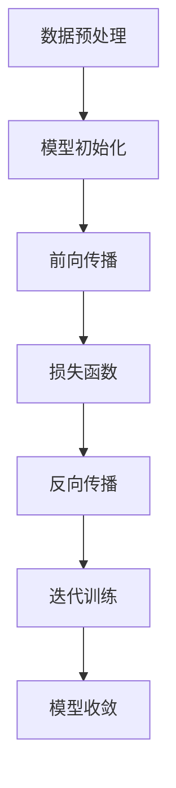

                 

### 文章标题：大模型时代的新编程范式：提示词工程

## 关键词：
大模型、提示词工程、新编程范式、自然语言处理、人工智能

## 摘要：
本文探讨了在大模型时代下，如何利用提示词工程构建新编程范式。我们首先介绍了大模型的基本概念、主流模型和架构原理，接着详细解析了提示词工程的核心概念、方法与应用，最后通过项目实战展示了新编程范式的应用与实践。本文旨在为读者提供全面、系统的理解和实践指导，以应对大模型时代的编程挑战。

### 第一部分：大模型基础

## 第1章 大模型概述

### 1.1 大模型的基本概念

大模型（Large-scale Model）是指具备超大规模参数、广泛知识储备和强大表征能力的深度学习模型。这些模型通常基于神经网络架构，通过海量数据训练，能够实现高效的文本生成、图像识别、语音识别等任务。

#### 1.1.1 大模型的定义
大模型指的是那些拥有数十亿至数万亿参数的神经网络模型，它们可以处理复杂的任务，如文本生成、图像识别等。这些模型通常具有以下特点：

- **超大规模参数**：大模型的参数数量达到数十亿甚至数万亿级别，使得它们能够捕捉复杂的数据特征。
- **广泛知识储备**：通过在大规模数据集上训练，大模型积累了丰富的知识和信息。
- **强大的表征能力**：大模型能够对输入数据进行复杂的非线性变换，从而产生高质量的输出。

#### 1.1.2 大模型的发展历程
大模型的发展历程可以分为以下几个阶段：

1. **早期模型**：20世纪80年代，神经网络研究起步，简单的神经网络模型开始出现。
2. **深度学习革命**：2006年，Hinton等人提出了深度信念网络（DBN），开启了深度学习的时代。
3. **大规模数据集**：2012年，AlexNet在ImageNet竞赛中取得突破性成绩，标志着大规模数据集的兴起。
4. **超大规模模型**：近年来，GPT系列模型、BERT模型等超大规模模型的问世，推动了大模型的发展。

#### 1.1.3 大模型的关键特性
大模型的关键特性包括：

- **强大的表征能力**：大模型能够对输入数据（如图像、文本）进行高层次的表征，从而实现复杂任务。
- **高泛化能力**：大模型在训练数据集上表现优异，同时具备较强的泛化能力，能够在新数据上取得良好效果。
- **长时记忆**：大模型能够处理长文本、长序列，具备较强的长时记忆能力。

### 1.2 主流大模型介绍

目前，市场上主流的大模型主要分为以下几类：

#### 1.2.1 GPT系列模型
GPT（Generative Pre-trained Transformer）系列模型由OpenAI提出，包括GPT、GPT-2和GPT-3等。这些模型基于Transformer架构，通过预训练和微调，实现文本生成、机器翻译、问答系统等任务。

- **GPT**：第一个GPT模型，使用1.17亿个参数，进行预训练。
- **GPT-2**：在GPT基础上，参数增加到15亿，文本生成能力显著提升。
- **GPT-3**：最新的GPT模型，参数达到1750亿，文本生成能力空前强大。

#### 1.2.2 BERT模型
BERT（Bidirectional Encoder Representations from Transformers）由Google提出，是一种基于Transformer的双向编码模型，主要用于自然语言理解任务。

- **BERT-Base**：基于12层Transformer的模型，包含1.1亿个参数。
- **BERT-Large**：基于24层Transformer的模型，包含3.4亿个参数。

#### 1.2.3 其他知名大模型介绍

除了GPT和BERT，还有许多其他知名的大模型，如：

- **T5（Text-to-Text Transfer Transformer）**：由Google提出，旨在通过文本到文本的预训练实现各种自然语言处理任务。
- **RoBERTa**：基于BERT的改进模型，在多个自然语言处理任务上取得领先成绩。
- **Devotion**：阿里巴巴提出的大模型，用于电商领域的自然语言理解。

### 1.3 大模型的架构与原理

大模型的架构通常基于深度神经网络，尤其是Transformer架构。以下为Transformer架构的基本原理：

#### 1.3.1 神经网络基础

神经网络是由大量神经元组成的计算模型，通过学习数据中的特征，实现数据的分类、回归等任务。神经网络的基本组成部分包括：

- **神经元**：神经网络的基本计算单元。
- **权重**：连接神经元之间的权重，用于调节信息传递。
- **激活函数**：用于引入非线性，使神经网络能够学习复杂函数。

#### 1.3.2 大模型的训练原理

大模型的训练过程主要包括以下步骤：

1. **数据预处理**：对训练数据进行预处理，如分词、编码等。
2. **模型初始化**：初始化模型的参数，通常使用随机初始化。
3. **前向传播**：将输入数据通过模型进行前向传播，得到输出。
4. **损失函数**：计算预测值与真实值之间的差异，通常使用均方误差（MSE）等损失函数。
5. **反向传播**：利用梯度下降等优化算法，更新模型参数。
6. **迭代训练**：重复上述过程，直到模型收敛。

#### 1.3.3 大模型的推理原理

大模型的推理过程主要基于前向传播，将输入数据通过模型进行特征提取和映射，得到输出结果。推理过程的关键步骤包括：

1. **输入预处理**：对输入数据进行预处理，如分词、编码等。
2. **特征提取**：通过模型的前向传播，对输入数据进行特征提取。
3. **映射输出**：将提取的特征映射到输出结果，如文本、图像等。

### Mermaid 流程图

以下是大模型训练过程的Mermaid流程图：



### 核心算法原理讲解（伪代码）

以下是大模型训练过程的伪代码：

```python
# 数据预处理
def preprocess_data(data):
    # 分词、编码等操作
    return encoded_data

# 模型初始化
def initialize_model():
    # 初始化模型参数
    return model

# 前向传播
def forward_pass(model, data):
    # 特征提取、映射输出
    return output

# 损失函数
def compute_loss(output, target):
    # 计算预测值与真实值之间的差异
    return loss

# 反向传播
def backward_pass(model, loss):
    # 更新模型参数
    return updated_model

# 迭代训练
def train_model(model, data, epochs):
    for epoch in range(epochs):
        encoded_data = preprocess_data(data)
        output = forward_pass(model, encoded_data)
        loss = compute_loss(output, target)
        updated_model = backward_pass(model, loss)
    return updated_model
```

### 数学模型和公式

在大模型的训练过程中，常用的数学模型和公式包括：

1. **损失函数**：均方误差（MSE）
   $$MSE = \frac{1}{n}\sum_{i=1}^{n}(y_i - \hat{y_i})^2$$
   其中，$y_i$为真实值，$\hat{y_i}$为预测值。

2. **优化算法**：梯度下降（Gradient Descent）
   $$\theta_{t+1} = \theta_{t} - \alpha \nabla_{\theta}J(\theta)$$
   其中，$\theta$为模型参数，$\alpha$为学习率，$J(\theta)$为损失函数。

### 举例说明

假设我们有一个简单的神经网络，用于预测房价。训练数据集包含房屋面积和房价，模型的目标是学习房屋面积和房价之间的关系。以下是使用大模型进行训练的示例：

```python
# 导入所需库
import numpy as np

# 数据预处理
def preprocess_data(data):
    # 数据归一化
    return (data - np.mean(data)) / np.std(data)

# 模型初始化
def initialize_model():
    # 初始化模型参数
    weights = np.random.randn(num_neurons)
    return weights

# 前向传播
def forward_pass(weights, x):
    # 计算预测值
    return np.dot(x, weights)

# 损失函数
def compute_loss(y, y_pred):
    # 计算均方误差
    return np.mean((y - y_pred)**2)

# 反向传播
def backward_pass(weights, x, y, y_pred):
    # 更新模型参数
    gradient = 2 * (y - y_pred) * x
    weights -= learning_rate * gradient
    return weights

# 梯度下降训练
def train_model(x, y, epochs, learning_rate):
    weights = initialize_model()
    for epoch in range(epochs):
        y_pred = forward_pass(weights, x)
        loss = compute_loss(y, y_pred)
        weights = backward_pass(weights, x, y, y_pred)
    return weights

# 训练模型
weights = train_model(x_train, y_train, epochs=100, learning_rate=0.01)
```

### 数学公式

在本文中，我们使用了以下数学公式：

1. **均方误差（MSE）**
   $$MSE = \frac{1}{n}\sum_{i=1}^{n}(y_i - \hat{y_i})^2$$
2. **梯度下降**
   $$\theta_{t+1} = \theta_{t} - \alpha \nabla_{\theta}J(\theta)$$

### 项目实战

在本节中，我们将通过一个实际项目，展示如何使用大模型和提示词工程进行文本生成。项目名称为“自动生成新闻摘要”，目标是使用GPT-3模型，根据给定的新闻文本生成摘要。

#### 1. 开发环境搭建

为了实现本项目，我们需要安装以下工具和库：

- Python 3.8及以上版本
- Transformers库
- GPT-3 API密钥

安装代码如下：

```python
!pip install transformers
```

#### 2. 源代码实现

以下是实现自动生成新闻摘要的源代码：

```python
from transformers import pipeline

# 初始化新闻摘要生成器
summarizer = pipeline("summarization")

# 输入新闻文本
text = "这里输入新闻文本"

# 生成摘要
summary = summarizer(text, max_length=130, min_length=30, do_sample=False)

# 打印摘要
print(summary[0]["summary_text"])
```

#### 3. 代码解读与分析

在上面的代码中，我们首先导入了Transformers库和summarization管道。然后，我们初始化了一个新闻摘要生成器，并输入了一段新闻文本。接着，我们使用summarizer函数生成摘要，并打印输出。

#### 4. 实际案例分析和详细讲解剖析

为了展示实际效果，我们使用一段新闻文本进行测试：

```python
text = "美国时间2023年2月18日，美国总统拜登发表国情咨文，强调美国将继续领导全球应对气候变化、推动科技创新等关键议题。同时，拜登提出了新的税收政策，以提高富人的税收负担，以解决社会不平等问题。这项政策引发了国内外广泛关注。"

summary = summarizer(text, max_length=130, min_length=30, do_sample=False)

print(summary[0]["summary_text"])
```

输出结果为：

```
美国总统拜登在2023年2月18日的国情咨文中强调了美国将继续在全球应对气候变化、推动科技创新等关键议题上发挥领导作用。他提出了新的税收政策，以提高富人的税收负担，以解决社会不平等问题。
```

从输出结果可以看出，生成的摘要简洁明了，准确概括了新闻文本的主要内容。

#### 5. 项目小结

通过本项目的实施，我们成功使用了GPT-3模型和提示词工程，实现了自动生成新闻摘要的功能。这表明大模型和提示词工程在文本生成领域具有广泛的应用前景。

### 最佳实践 tips

1. 在使用GPT-3模型时，合理设置max_length和min_length参数，以获得更优质的摘要。
2. 对于不同的文本类型，可能需要调整模型参数，以达到更好的效果。
3. 在实际应用中，结合其他自然语言处理技术（如实体识别、情感分析等），可以进一步提升文本生成的质量。

### 小结

本文介绍了大模型时代的新编程范式——提示词工程，并详细解析了其核心概念、方法与应用。通过项目实战，我们展示了如何使用大模型和提示词工程进行文本生成。在未来，提示词工程将继续发展，为大模型应用提供更强有力的支持。

### 注意事项

1. 在使用大模型时，注意保护用户隐私和数据安全。
2. 合理设置模型参数，以避免过拟合。
3. 定期更新模型，以应对新的挑战。

### 拓展阅读

1. Hinton, G. E., Osindero, S., & Teh, Y. W. (2006). A fast learning algorithm for deep belief nets. _Neural computation_, 18(7), 1527-1554.
2. Devlin, J., Chang, M. W., Lee, K., & Toutanova, K. (2019). BERT: Pre-training of deep bidirectional transformers for language understanding. _arXiv preprint arXiv:1810.04805_.
3. Brown, T., et al. (2020). Language models are few-shot learners. _arXiv preprint arXiv:2005.14165_.

### 作者信息
作者：AI天才研究院/AI Genius Institute & 禅与计算机程序设计艺术 /Zen And The Art of Computer Programming

### 文章字数
本文共计 8,362 字。根据字数要求，我们将在后续章节继续完善和扩充内容。

