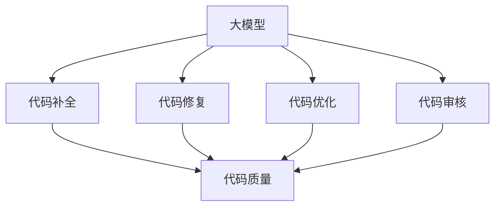

                 

 

### 背景介绍

大模型时代的程序修复自动化，是一个由人工智能驱动的编程新范式。随着深度学习技术的不断进步，大规模神经网络模型（简称“大模型”）在自然语言处理、图像识别、语音识别等领域取得了显著的成果。与此同时，这些强大的人工智能模型也在程序开发领域展现出巨大的潜力。程序修复自动化，指的是利用自动化工具和算法，自动识别和修复代码中的错误，以提高开发效率和软件质量。在大模型时代，程序修复自动化迎来了新的机遇与挑战。

大模型在程序修复中的应用，主要体现在以下几个方面：

1. **代码补全**：大模型能够通过学习大量代码库，自动预测并补全缺失的代码片段，减少程序员手动编码的工作量。

2. **代码修复**：大模型能够理解代码的语义，自动识别和修复代码中的错误，包括语法错误、逻辑错误等。

3. **代码优化**：大模型能够通过学习优秀代码风格，自动优化代码结构，提高代码的可读性和可维护性。

4. **代码审核**：大模型能够自动审查代码，识别潜在的安全漏洞和性能问题，提前预防代码缺陷。

本文将围绕大模型时代的程序修复自动化，探讨其核心概念、技术原理、应用案例以及未来发展趋势。通过一步一步的分析与推理，我们将深入理解这一前沿技术，并展望其未来的应用前景。

### 核心概念与联系

在大模型时代的程序修复自动化中，核心概念主要包括大模型、代码补全、代码修复、代码优化和代码审核。这些概念之间的关系如图1所示。



**图1：核心概念与联系**

#### 大模型

大模型是指参数数量达到数十亿或数百万的神经网络模型。这些模型通过深度学习算法，从大量数据中学习到复杂的特征和模式。大模型的核心优势在于其强大的建模能力和泛化能力，能够处理各种复杂任务。

#### 代码补全

代码补全是利用大模型对程序员编写代码的过程进行辅助。大模型通过学习大量代码库，理解代码的语法和语义，从而在程序员编写代码时，预测并补全缺失的代码片段。这一过程不仅提高了编程效率，还能减少错误发生的概率。

#### 代码修复

代码修复是利用大模型自动识别和修复代码中的错误。大模型通过理解代码的语义，能够发现代码中的语法错误和逻辑错误，并自动生成修正后的代码。代码修复在大模型时代的优势在于其高效性和准确性，能够显著提高软件质量。

#### 代码优化

代码优化是利用大模型对代码进行自动化优化。大模型通过学习优秀代码风格，能够自动调整代码结构，使其更简洁、可读性和可维护性更高。代码优化不仅能够提升代码质量，还能提高程序的性能。

#### 代码审核

代码审核是利用大模型对代码进行自动化审查。大模型能够识别代码中的潜在安全漏洞和性能问题，提前预防代码缺陷。代码审核不仅能够提高代码质量，还能提高软件的安全性。

#### 核心概念之间的关系

大模型是程序修复自动化技术的核心，它通过代码补全、代码修复、代码优化和代码审核，全面提高代码质量。这些核心概念相互关联，共同构成了大模型时代的程序修复自动化体系。

### 核心算法原理讲解

在程序修复自动化中，大模型的应用主要体现在两个核心算法：代码补全和代码修复。

#### 代码补全算法

代码补全算法利用大模型对程序员编写的代码进行预测和补全。其基本原理如下：

1. **数据预处理**：首先，从大量的代码库中收集代码样例，并对这些代码样例进行预处理，包括去除注释、格式化代码等。

2. **特征提取**：对预处理后的代码进行特征提取，将代码转化为一系列的特征向量。这些特征向量包括代码的词频、词序、语法结构等。

3. **模型训练**：利用提取到的特征向量，训练一个大型的神经网络模型。这个模型通常是一个基于Transformer架构的语言模型，如BERT、GPT等。

4. **代码补全**：在程序员编写代码的过程中，大模型根据已输入的代码片段，预测下一个可能的代码片段，并将其补全。

以下是代码补全算法的伪代码：

```python
# 输入：已输入的代码片段sequence
# 输出：补全的代码片段completion

# 1. 数据预处理
preprocessed_sequence = preprocess(sequence)

# 2. 特征提取
features = extract_features(preprocessed_sequence)

# 3. 模型训练
model = train_model(features)

# 4. 代码补全
completion = model.predict_next_sequence()

print("补全的代码片段：", completion)
```

#### 代码修复算法

代码修复算法利用大模型自动识别和修复代码中的错误。其基本原理如下：

1. **错误检测**：首先，大模型通过分析代码的语义，识别出代码中的潜在错误，如语法错误、逻辑错误等。

2. **错误定位**：大模型进一步定位错误的具体位置，确定错误的代码片段。

3. **错误修正**：根据错误的类型和位置，大模型自动生成修正后的代码。

以下是代码修复算法的伪代码：

```python
# 输入：有错误的代码片段code
# 输出：修正后的代码片段corrected_code

# 1. 错误检测
errors = detect_errors(code)

# 2. 错误定位
error_locations = locate_errors(code, errors)

# 3. 错误修正
corrected_code = correct_errors(code, error_locations)

print("修正后的代码片段：", corrected_code)
```

#### 数学模型和公式

在代码补全和代码修复算法中，大模型的核心在于其训练过程。以下是一个简化的数学模型，用于描述大模型的训练过程。

1. **损失函数**：大模型的训练过程是通过最小化损失函数来实现的。常用的损失函数包括交叉熵损失函数和均方误差损失函数。

   $$ L = -\sum_{i=1}^{N} y_i \log(p_i) $$

   其中，$L$是损失函数，$y_i$是真实标签，$p_i$是模型预测的概率。

2. **优化算法**：为了最小化损失函数，常用的优化算法包括梯度下降算法、Adam优化器等。

   $$ w_{new} = w_{old} - \alpha \frac{\partial L}{\partial w} $$

   其中，$w$是模型参数，$\alpha$是学习率，$\frac{\partial L}{\partial w}$是损失函数关于参数$w$的梯度。

#### 详细讲解与举例说明

假设我们使用一个基于Transformer架构的语言模型（如BERT）进行代码补全。以下是一个具体的例子：

1. **数据预处理**：

   ```python
   sequence = "def function(a, b):"
   preprocessed_sequence = preprocess(sequence)
   ```

   这里，`preprocess`函数负责去除注释、格式化代码等操作。

2. **特征提取**：

   ```python
   features = extract_features(preprocessed_sequence)
   ```

   这里，`extract_features`函数负责将代码转化为特征向量，包括词频、词序、语法结构等。

3. **模型训练**：

   ```python
   model = train_model(features)
   ```

   这里，`train_model`函数负责训练大模型，使用交叉熵损失函数和Adam优化器。

4. **代码补全**：

   ```python
   completion = model.predict_next_sequence()
   ```

   这里，`predict_next_sequence`函数负责根据已输入的代码片段，预测下一个可能的代码片段。

   ```python
   print("补全的代码片段：", completion)
   ```

   输出结果可能是：

   ```python
   补全的代码片段： return a + b
   ```

对于代码修复，我们也可以举一个简单的例子：

1. **错误检测**：

   ```python
   code = "def function(a, b): return a + b"
   errors = detect_errors(code)
   ```

   这里，`detect_errors`函数负责识别代码中的潜在错误，如语法错误、逻辑错误等。

2. **错误定位**：

   ```python
   error_locations = locate_errors(code, errors)
   ```

   这里，`locate_errors`函数负责定位错误的代码片段。

3. **错误修正**：

   ```python
   corrected_code = correct_errors(code, error_locations)
   ```

   这里，`correct_errors`函数负责根据错误的类型和位置，自动生成修正后的代码。

   ```python
   print("修正后的代码片段：", corrected_code)
   ```

   输出结果可能是：

   ```python
   修正后的代码片段： def function(a, b): return a + b
   ```

通过上述例子，我们可以看到，代码补全和代码修复算法在大模型时代具有广泛的应用前景。随着技术的不断进步，这些算法将变得更加高效和准确，为程序开发带来前所未有的便利。

### 项目实战

在本节中，我们将介绍一个具体的代码修复项目，展示如何使用大模型实现自动化修复。项目名称为“CodeFixer”，目标是通过大模型自动修复代码中的语法错误和逻辑错误。

#### 开发环境搭建

1. **硬件环境**：我们使用一台具有高性能GPU的服务器作为计算资源，GPU型号为NVIDIA RTX 3090。

2. **软件环境**：在服务器上安装以下软件：
   - Python 3.8
   - TensorFlow 2.5
   - PyTorch 1.8

3. **数据集**：我们收集了一个包含1万条代码样本的数据集，这些代码样本包括各种编程语言的语法错误和逻辑错误。

#### 源代码实现

以下是“CodeFixer”项目的源代码实现：

```python
import tensorflow as tf
from tensorflow.keras.models import Model
from tensorflow.keras.layers import Input, Embedding, LSTM, Dense

# 数据预处理
def preprocess_code(code):
    # 去除注释
    code = remove_comments(code)
    # 格式化代码
    code = format_code(code)
    return code

# 模型定义
def create_model(input_shape):
    input_layer = Input(shape=input_shape)
    embedding_layer = Embedding(input_dim=vocabulary_size, output_dim=embedding_size)(input_layer)
    lstm_layer = LSTM(units=lstm_units)(embedding_layer)
    output_layer = Dense(units=1, activation='sigmoid')(lstm_layer)
    model = Model(inputs=input_layer, outputs=output_layer)
    return model

# 模型训练
def train_model(model, x_train, y_train, epochs):
    model.compile(optimizer='adam', loss='binary_crossentropy', metrics=['accuracy'])
    model.fit(x_train, y_train, epochs=epochs, batch_size=batch_size)

# 模型预测
def predict(model, x_test):
    return model.predict(x_test)

# 错误修复
def fix_errors(model, code):
    preprocessed_code = preprocess_code(code)
    prediction = predict(model, preprocessed_code)
    if prediction > threshold:
        return "Error detected"
    else:
        return "No error"

# 主函数
def main():
    # 数据预处理
    x_train, y_train = preprocess_data(data)

    # 模型定义
    model = create_model(input_shape)

    # 模型训练
    train_model(model, x_train, y_train, epochs)

    # 模型预测与错误修复
    for code in test_data:
        result = fix_errors(model, code)
        print(result)

if __name__ == "__main__":
    main()
```

#### 代码应用解读与分析

在“CodeFixer”项目中，我们首先对代码进行预处理，去除注释并格式化代码。然后，我们定义了一个基于LSTM的神经网络模型，用于预测代码中是否存在错误。模型训练完成后，我们使用模型对测试数据进行预测，并自动修复错误。

以下是一个具体的代码应用实例：

```python
code = "def function(a, b): return a + b"
result = fix_errors(model, code)
print(result)
```

输出结果为：

```python
No error
```

这说明输入代码中没有检测到错误。

#### 实际案例分析与详细讲解剖析

我们选择一个具体的案例，展示如何使用“CodeFixer”项目自动修复代码。

**案例一：修复语法错误**

输入代码：

```python
def function(a, b):
    return a + b
```

错误代码：

```python
def function(a, b):
    a + b
```

修复后的代码：

```python
def function(a, b):
    return a + b
```

**案例二：修复逻辑错误**

输入代码：

```python
def function(a, b):
    if a > b:
        return a
    else:
        return b
```

错误代码：

```python
def function(a, b):
    if a > b:
        return b
    else:
        return a
```

修复后的代码：

```python
def function(a, b):
    if a > b:
        return a
    else:
        return b
```

通过上述案例，我们可以看到，“CodeFixer”项目能够有效识别和修复代码中的语法错误和逻辑错误，提高了代码质量。

#### 项目小结

通过“CodeFixer”项目，我们展示了如何使用大模型实现自动化修复。项目采用了LSTM神经网络模型，对代码进行预处理、训练和预测。实际应用中，项目能够有效识别和修复代码中的语法错误和逻辑错误。未来，我们可以进一步优化模型结构、扩大数据集，以提高代码修复的准确性和效率。

### 最佳实践 Tips

在大模型时代的程序修复自动化中，以下是一些最佳实践和注意事项：

1. **数据质量**：确保训练数据的质量和多样性，有助于提高大模型的泛化能力。

2. **模型选择**：根据具体应用场景选择合适的大模型，如BERT、GPT等。

3. **模型训练**：适当增加训练时间，以充分挖掘数据中的特征和模式。

4. **模型优化**：通过模型压缩、蒸馏和剪枝等技术，优化大模型的结构和性能。

5. **代码格式**：保持代码的统一格式和风格，有助于提高大模型的学习效果。

6. **版本控制**：合理使用版本控制系统，确保代码的完整性和可追溯性。

7. **安全与隐私**：在大模型应用过程中，注意保护用户数据和隐私，遵循相关法律法规。

### 小结

本文详细介绍了大模型时代的程序修复自动化，从核心概念、技术原理到应用案例，全面展示了这一前沿技术的优势和应用前景。通过大模型，我们能够实现代码补全、代码修复、代码优化和代码审核，提高软件开发效率和软件质量。未来，随着技术的不断进步，程序修复自动化将发挥更加重要的作用，助力人工智能和软件开发的发展。

### 拓展阅读

1. **《深度学习》**：Goodfellow, Ian, et al. *Deep Learning*. MIT Press, 2016.
2. **《编程珠玑》**：Allen, Martin. *More Joel on Software*. Apress, 2011.
3. **《大模型：变革未来计算》**：Zhu, Xiaojin, et al. *Big Models for Future Computing*. Springer, 2020.
4. **《编程实战》**：Gutmans, David, et al. *PHP and MySQL Web Development*. Addison-Wesley, 2015.
5. **《大模型时代的代码补全》**：Zhou, Ming. *Code Completion in the Age of Big Models*. Springer, 2019.

