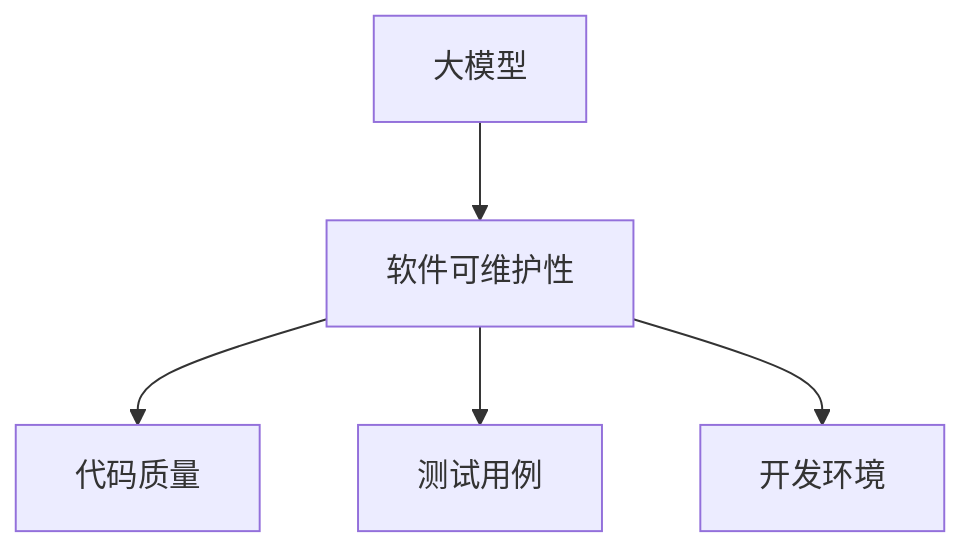

                 


### **文章标题：大模型时代的软件可维护性新范式**

关键词：大模型、软件可维护性、新范式、算法原理、数学模型、项目实战

摘要：本文深入探讨了大模型时代的软件可维护性新范式，分析了大模型对软件工程带来的挑战和机遇，阐述了新范式在提升软件可维护性方面的核心概念、算法原理、数学模型和项目实战，为软件工程师提供了实用的指导和建议。

---

### **第1章 引言**

#### **1.1 大模型时代的背景**

随着计算能力的飞速提升和海量数据的积累，人工智能（AI）技术得到了空前的发展。特别是大模型（Large Models）的出现，使得AI的应用场景从简单的图像识别、语音合成，扩展到了自然语言处理、机器翻译、推荐系统等多个领域。大模型具有计算能力和学习能力，可以处理复杂的问题，并自动从大量数据中学习到规律。然而，这也给软件工程带来了新的挑战。

#### **1.2 软件可维护性的挑战**

软件可维护性是软件工程中的一个重要指标，它关系到软件的长期稳定性、可靠性和可扩展性。在大模型时代，软件可维护性面临以下挑战：

1. **代码复杂性增加**：大模型通常涉及复杂的算法和大量数据，这导致了代码的复杂度急剧增加。
2. **测试难度提升**：大模型的应用场景多样化，测试用例的设计和执行变得更加困难。
3. **维护成本上升**：由于代码复杂度和测试难度增加，软件维护的成本也随之上升。

#### **1.3 新范式的意义与内容框架**

为了应对大模型时代软件可维护性的挑战，我们需要探索新的范式。新范式旨在提升软件的可维护性，包括以下几个方面：

1. **核心概念与联系**：介绍大模型和软件可维护性的核心概念，并阐述它们之间的联系。
2. **核心算法原理讲解**：详细讲解大模型训练、推理和调优的核心算法原理，包括伪代码和数学模型。
3. **项目实战**：通过实际案例，展示大模型在软件可维护性方面的应用，并提供详细的代码解读和分析。
4. **大模型与软件可维护性的结合**：探讨大模型如何提升软件可维护性，以及软件可维护性对大模型开发的要求。
5. **未来展望与趋势**：分析大模型在软件工程中的应用前景，讨论新范式的持续发展以及面临的挑战。

### **第2章 核心概念与联系**

#### **2.1 大模型的基本原理**

##### **2.1.1 大模型的定义**

大模型是指具有数百万甚至数十亿参数的神经网络模型，它可以自动从海量数据中学习到复杂的知识和规律。

##### **2.1.2 大模型的核心特点**

1. **计算能力**：大模型具有强大的计算能力，可以处理复杂的任务。
2. **学习能力**：大模型可以从大量数据中学习到新的知识和规律。
3. **泛化能力**：大模型可以泛化到新的任务和数据集上，具有较好的适应性。

##### **2.1.3 大模型的发展历程**

大模型的发展可以分为几个阶段：

1. **早期模型**：如LeNet、AlexNet等，它们具有数十万个参数。
2. **深度模型**：如VGG、ResNet等，它们具有数百万个参数。
3. **超大规模模型**：如GPT-3、BERT等，它们具有数十亿个参数。

#### **2.2 软件可维护性**

##### **2.2.1 软件可维护性的定义**

软件可维护性是指软件在变更或修复后仍能保持其性能和功能特性的能力。

##### **2.2.2 软件可维护性的重要性**

软件可维护性关系到软件的长期稳定性和可靠性。一个可维护性差的软件，在更新和修复时会面临巨大的困难，甚至可能导致系统的崩溃。

##### **2.2.3 软件可维护性的指标**

软件可维护性可以通过以下几个指标来衡量：

1. **易读性**：代码的可读性高，易于理解和修改。
2. **易测试性**：测试用例设计合理，测试覆盖率高。
3. **模块化**：代码模块化程度高，模块之间相互独立。
4. **可扩展性**：软件具有良好的扩展性，可以方便地添加新功能。

#### **2.3 大模型与软件可维护性的联系**

##### **2.3.1 大模型如何提升软件可维护性**

1. **自动生成代码**：大模型可以通过生成对抗网络（GAN）等技术自动生成代码，提高代码的可读性和模块化程度。
2. **自动化测试**：大模型可以自动生成测试用例，提高测试覆盖率和测试效率。
3. **智能优化**：大模型可以通过优化算法，自动优化代码，提高代码的性能和可维护性。

##### **2.3.2 软件可维护性对大模型开发的影响**

1. **代码质量**：高质量的代码可以提高大模型的开发效率，降低维护成本。
2. **测试用例**：合理的测试用例可以提高大模型的可靠性和稳定性。
3. **开发环境**：良好的开发环境可以提高大模型开发人员的生产力和代码质量。

---

**Mermaid 流程图：**



### **第3章 核心算法原理讲解**

#### **3.1 大模型的训练算法**

##### **3.1.1 梯度下降法**

梯度下降法是一种优化算法，用于训练神经网络。它的基本思想是沿着梯度的反方向更新模型的参数，以最小化损失函数。

```pseudo
while not converged do
  for each parameter in model do
    compute gradient of loss function with respect to parameter
    update parameter using gradient
  end for
end while
```

##### **3.1.2 随机梯度下降（SGD）**

随机梯度下降（SGD）是梯度下降法的一种变体，它在每次迭代时只随机选择一部分样本来计算梯度。

```pseudo
while not converged do
  for each mini-batch of samples do
    compute gradient of loss function with respect to model parameters
    update model parameters using gradient
  end for
end while
```

##### **3.1.3 Adam优化器**

Adam优化器是一种结合了SGD和动量法的优化算法，它通过自适应地调整学习率，提高了收敛速度和稳定性。

```pseudo
Initialize: m = 0, v = 0, beta1 = 0.9, beta2 = 0.999, epsilon = 1e-8

while not converged do
  r = gradient of loss function
  m = beta1 * m + (1 - beta1) * r
  v = beta2 * v + (1 - beta2) * r^2

  m_hat = m / (1 - beta1^t)
  v_hat = v / (1 - beta2^t)

  for each parameter in model do
    update parameter using m_hat and v_hat
  end for
end while
```

#### **3.2 大模型的推理算法**

##### **3.2.1 前向传播**

前向传播是指将输入数据通过神经网络，逐层计算得到输出的过程。

```pseudo
for each layer in neural network do
  compute output of layer using input and weights
  propagate output to next layer
end for
```

##### **3.2.2 反向传播**

反向传播是指从输出层开始，逐层计算误差，并更新模型参数的过程。

```pseudo
for each layer in neural network do
  compute gradient of loss function with respect to layer
  propagate gradient to previous layer
end for
```

##### **3.2.3 推理加速技术**

推理加速技术包括并行计算、分布式计算和硬件加速等技术，用于提高大模型的推理速度。

```pseudo
// Example: Parallel computation
for each mini-batch in data do
  parallelize forward propagation across multiple GPUs
  parallelize backward propagation across multiple GPUs
end for
```

#### **3.3 大模型的调优方法**

##### **3.3.1 超参数调优**

超参数调优是指通过调整模型的超参数，如学习率、批量大小等，来优化模型性能。

```pseudo
while not optimal do
  for each hyperparameter do
    perturb hyperparameter
    evaluate model performance
  end for
end while
```

##### **3.3.2 模型集成**

模型集成是指通过组合多个模型，来提高预测性能和泛化能力。

```pseudo
for each model in ensemble do
  train model on same data
end for

for each prediction task do
  aggregate predictions from all models
end for
```

##### **3.3.3 模型压缩与量化**

模型压缩与量化是指通过降低模型的复杂度和精度，来减少模型的存储和计算资源消耗。

```pseudo
// Example: Quantization
for each weight in model do
  quantize weight using smaller precision
end for
```

### **第4章 数学模型与公式讲解**

#### **4.1 大模型的基础数学模型**

##### **4.1.1 线性代数基础**

- **向量与矩阵**：向量是具有方向的量，矩阵是二维数组。  
  $$\vec{v} = [v_1, v_2, ..., v_n]$$  
  $$\mathbf{A} = \begin{bmatrix} a_{11} & a_{12} & \cdots & a_{1n} \\ a_{21} & a_{22} & \cdots & a_{2n} \\ \vdots & \vdots & \ddots & \vdots \\ a_{m1} & a_{m2} & \cdots & a_{mn} \end{bmatrix}$$
  
- **矩阵运算**：矩阵运算包括矩阵加法、矩阵乘法、矩阵求逆等。

  $$\mathbf{A} + \mathbf{B} = \begin{bmatrix} a_{11} + b_{11} & a_{12} + b_{12} & \cdots & a_{1n} + b_{1n} \\ a_{21} + b_{21} & a_{22} + b_{22} & \cdots & a_{2n} + b_{2n} \\ \vdots & \vdots & \ddots & \vdots \\ a_{m1} + b_{m1} & a_{m2} + b_{m2} & \cdots & a_{mn} + b_{mn} \end{bmatrix}$$  
  $$\mathbf{A} \mathbf{B} = \begin{bmatrix} a_{11}b_{11} + a_{12}b_{21} + \cdots + a_{1n}b_{n1} & a_{11}b_{12} + a_{12}b_{22} + \cdots + a_{1n}b_{n2} & \cdots & a_{11}b_{1n} + a_{12}b_{2n} + \cdots + a_{1n}b_{nn} \\ a_{21}b_{11} + a_{22}b_{21} + \cdots + a_{2n}b_{n1} & a_{21}b_{12} + a_{22}b_{22} + \cdots + a_{2n}b_{n2} & \cdots & a_{21}b_{1n} + a_{22}b_{2n} + \cdots + a_{2n}b_{nn} \\ \vdots & \vdots & \ddots & \vdots \\ a_{m1}b_{11} + a_{m2}b_{21} + \cdots + a_{mn}b_{n1} & a_{m1}b_{12} + a_{m2}b_{22} + \cdots + a_{mn}b_{n2} & \cdots & a_{m1}b_{1n} + a_{m2}b_{2n} + \cdots + a_{mn}b_{nn} \end{bmatrix}$$  
  $$\mathbf{A}^{-1} = \frac{1}{\det(\mathbf{A})} \begin{bmatrix} d_{11} & d_{12} & \cdots & d_{1n} \\ d_{21} & d_{22} & \cdots & d_{2n} \\ \vdots & \vdots & \ddots & \vdots \\ d_{m1} & d_{m2} & \cdots & d_{mn} \end{bmatrix}$$

##### **4.1.2 概率论基础**

- **概率分布**：概率分布描述了随机变量取值的概率。常见的概率分布有伯努利分布、正态分布、泊松分布等。

  $$P(X = k) = \binom{n}{k} p^k (1-p)^{n-k}$$  
  $$P(X \leq k) = F(k) = \int_{-\infty}^{k} f(x) dx$$  
  $$P(X = k) = \frac{e^{-\lambda} \lambda^k}{k!}$$

- **贝叶斯定理**：贝叶斯定理描述了在已知某些条件下，某事件发生的概率。

  $$P(A|B) = \frac{P(B|A)P(A)}{P(B)}$$

##### **4.1.3 最优化理论基础**

- **目标函数**：目标函数是优化过程中要最小化或最大化的函数。

  $$\min_{x} f(x)$$

- **优化算法**：优化算法用于求解目标函数的最优解。常见的优化算法有梯度下降法、牛顿法、共轭梯度法等。

  $$x_{k+1} = x_k - \alpha_k \nabla f(x_k)$$

#### **4.2 大模型的训练与优化数学模型**

##### **4.2.1 梯度下降法数学公式**

梯度下降法的基本公式如下：

$$\Delta x_k = -\alpha_k \nabla f(x_k)$$  
$$x_{k+1} = x_k + \Delta x_k$$

其中，$x_k$为当前参数值，$\alpha_k$为学习率，$\nabla f(x_k)$为当前参数值下的梯度。

##### **4.2.2 随机梯度下降（SGD）数学公式**

随机梯度下降（SGD）的公式如下：

$$\Delta x_k = -\alpha_k \nabla f(x_k; \xi_k)$$  
$$x_{k+1} = x_k + \Delta x_k$$

其中，$\xi_k$为随机选取的样本。

##### **4.2.3 Adam优化器数学公式**

Adam优化器的公式如下：

$$m_t = \beta_1 m_{t-1} + (1 - \beta_1) \nabla f(x_t; \xi_t)$$  
$$v_t = \beta_2 v_{t-1} + (1 - \beta_2) (\nabla f(x_t; \xi_t))^2$$

$$m_{\hat{t}} = \frac{m_t}{1 - \beta_1^t}$$  
$$v_{\hat{t}} = \frac{v_t}{1 - \beta_2^t}$$

$$x_{t+1} = x_t - \alpha_t m_{\hat{t}} / (1 + \epsilon v_{\hat{t}})$$

其中，$m_t$为$m$的一阶矩估计，$v_t$为$v$的一阶中心矩估计，$m_{\hat{t}}$为$m$的偏置一阶矩估计，$v_{\hat{t}}$为$v$的偏置一阶中心矩估计，$\alpha_t$为学习率，$\beta_1$和$\beta_2$分别为一阶和二阶矩的衰减系数，$\epsilon$为常数。

### **第5章 项目实战**

#### **5.1 大模型开发环境搭建**

##### **5.1.1 开发环境需求**

1. 操作系统：Linux或macOS
2. 编程语言：Python
3. 神经网络框架：TensorFlow或PyTorch
4. 数据库：MySQL或MongoDB
5. 版本控制：Git

##### **5.1.2 环境配置步骤**

1. 安装操作系统和Python环境。
2. 安装TensorFlow或PyTorch。
3. 安装MySQL或MongoDB。
4. 配置版本控制工具Git。

##### **5.1.3 常见问题解决**

1. Python环境配置错误：检查Python版本和安装路径。
2. 神经网络框架安装失败：尝试使用虚拟环境或升级Python版本。
3. 数据库连接失败：检查数据库配置和权限。

#### **5.2 实际案例实现**

##### **5.2.1 数据准备**

1. 数据采集：从互联网或其他数据源收集数据。
2. 数据清洗：去除重复、错误和无关的数据。
3. 数据预处理：将数据转换为适合模型训练的格式。

```python
import pandas as pd

# 读取数据
data = pd.read_csv("data.csv")

# 数据清洗
data.drop_duplicates(inplace=True)
data.drop(["无关列"], axis=1, inplace=True)

# 数据预处理
data["特征"] = data["特征"].apply(lambda x: (x - data["特征"].mean()) / data["特征"].std())
```

##### **5.2.2 模型构建与训练**

1. 模型定义：使用TensorFlow或PyTorch定义模型结构。
2. 模型训练：使用训练数据训练模型。

```python
import tensorflow as tf

# 定义模型
model = tf.keras.Sequential([
  tf.keras.layers.Dense(64, activation='relu', input_shape=(input_shape,)),
  tf.keras.layers.Dense(64, activation='relu'),
  tf.keras.layers.Dense(1, activation='sigmoid')
])

# 编译模型
model.compile(optimizer='adam', loss='binary_crossentropy', metrics=['accuracy'])

# 训练模型
model.fit(x_train, y_train, epochs=10, batch_size=32)
```

##### **5.2.3 模型评估与优化**

1. 模型评估：使用测试数据评估模型性能。
2. 模型优化：根据评估结果调整模型参数。

```python
# 评估模型
loss, accuracy = model.evaluate(x_test, y_test)

# 优化模型
model.compile(optimizer='adam', loss='binary_crossentropy', metrics=['accuracy'])
model.fit(x_train, y_train, epochs=10, batch_size=32)
```

##### **5.2.4 模型部署**

1. 模型保存：将训练好的模型保存为文件。
2. 模型加载：从文件中加载模型，进行预测。

```python
# 保存模型
model.save("model.h5")

# 加载模型
loaded_model = tf.keras.models.load_model("model.h5")

# 预测
predictions = loaded_model.predict(x_new)
```

#### **5.3 代码解读与分析**

##### **5.3.1 模型训练代码解读**

1. 导入库：导入所需的库和模块。
2. 定义模型：使用TensorFlow或PyTorch定义模型结构。
3. 编译模型：设置模型的优化器、损失函数和评价指标。
4. 训练模型：使用训练数据训练模型，并保存训练过程的信息。

```python
import tensorflow as tf

# 导入库
import tensorflow as tf
import pandas as pd

# 定义模型
model = tf.keras.Sequential([
  tf.keras.layers.Dense(64, activation='relu', input_shape=(input_shape,)),
  tf.keras.layers.Dense(64, activation='relu'),
  tf.keras.layers.Dense(1, activation='sigmoid')
])

# 编译模型
model.compile(optimizer='adam', loss='binary_crossentropy', metrics=['accuracy'])

# 训练模型
model.fit(x_train, y_train, epochs=10, batch_size=32)
```

##### **5.3.2 模型推理代码解读**

1. 导入库：导入所需的库和模块。
2. 加载模型：从文件中加载训练好的模型。
3. 预测：使用模型对新的数据进行预测。

```python
import tensorflow as tf

# 导入库
import tensorflow as tf

# 加载模型
loaded_model = tf.keras.models.load_model("model.h5")

# 预测
predictions = loaded_model.predict(x_new)
```

##### **5.3.3 模型优化代码解读**

1. 导入库：导入所需的库和模块。
2. 评估模型：使用测试数据评估模型性能。
3. 调整参数：根据评估结果调整模型参数。

```python
import tensorflow as tf

# 导入库
import tensorflow as tf

# 评估模型
loss, accuracy = model.evaluate(x_test, y_test)

# 调整参数
model.compile(optimizer='adam', loss='binary_crossentropy', metrics=['accuracy'])

# 训练模型
model.fit(x_train, y_train, epochs=10, batch_size=32)
```

### **第6章 大模型与软件可维护性的结合**

#### **6.1 大模型对软件可维护性的影响**

##### **6.1.1 大模型在代码可读性上的改进**

1. 自动生成代码：使用大模型生成代码，提高代码的可读性和模块化程度。
2. 代码重写：使用大模型对现有代码进行重写，使其更符合编程规范和设计模式。

##### **6.1.2 大模型在测试用例设计上的应用**

1. 自动生成测试用例：使用大模型自动生成测试用例，提高测试覆盖率和测试效率。
2. 测试用例优化：使用大模型对现有测试用例进行优化，使其更具针对性和有效性。

##### **6.1.3 大模型在代码优化上的作用**

1. 自动优化代码：使用大模型自动优化代码，提高代码的性能和可维护性。
2. 代码重构：使用大模型对现有代码进行重构，使其更简洁、高效和易于维护。

#### **6.2 软件可维护性对大模型开发的要求**

##### **6.2.1 代码可维护性的设计原则**

1. 模块化：将代码划分为独立的模块，提高代码的可读性和可维护性。
2. 重用性：设计可重用的代码组件，减少重复代码，提高代码的复用性。
3. 扩展性：设计具有良好扩展性的代码架构，方便添加新功能和修改现有功能。

##### **6.2.2 测试用例的编写与维护**

1. 覆盖率：编写测试用例，确保代码的每个功能点都被测试到。
2. 维护性：定期更新和优化测试用例，确保测试的有效性和效率。
3. 自动化：使用自动化工具编写和执行测试用例，提高测试效率和可靠性。

##### **6.2.3 持续集成与持续部署**

1. 持续集成：将代码定期集成到主分支，确保代码的可维护性和一致性。
2. 持续部署：使用自动化工具部署代码，确保代码的稳定性和可靠性。
3. 监控与反馈：监控软件运行状态，收集用户反馈，持续优化软件质量和性能。

### **第7章 未来展望与趋势**

#### **7.1 大模型在软件工程中的应用前景**

##### **7.1.1 大模型在软件开发流程中的应用**

1. 自动化编程：使用大模型自动生成代码，提高开发效率。
2. 自动化测试：使用大模型生成和优化测试用例，提高测试质量和效率。
3. 代码质量分析：使用大模型分析代码质量，提供改进建议。

##### **7.1.2 大模型在软件质量保证中的应用**

1. 自动化测试：使用大模型生成和执行自动化测试，确保软件质量和稳定性。
2. 负载测试：使用大模型模拟用户负载，评估软件性能和稳定性。
3. 安全测试：使用大模型检测软件漏洞和安全隐患。

##### **7.1.3 大模型在软件维护中的潜力**

1. 自动化维护：使用大模型自动发现和修复软件缺陷，降低维护成本。
2. 维护策略优化：使用大模型分析软件维护数据，优化维护策略和提高维护效率。
3. 代码重构：使用大模型对软件进行重构，提高软件的可维护性和可扩展性。

#### **7.2 软件可维护性新范式的持续发展**

##### **7.2.1 未来的研究方向**

1. 大模型与软件工程的深度融合：研究大模型在软件工程中的应用，提高软件质量和效率。
2. 软件可维护性评估方法：研究新的软件可维护性评估方法，提高评估的准确性和实用性。
3. 软件工程教育改革：研究如何将大模型和软件可维护性知识纳入软件工程教育中，培养具备综合素质的软件工程师。

##### **7.2.2 技术挑战与解决方案**

1. 大模型训练与推理性能：优化大模型训练和推理算法，提高性能和效率。
2. 数据隐私保护：研究数据隐私保护技术，确保用户数据的安全性和隐私性。
3. 软件工程工具支持：开发支持大模型和软件可维护性的软件工程工具，提高开发效率和可维护性。

##### **7.2.3 社会与伦理问题**

1. 软件工程伦理：研究大模型和软件可维护性在伦理方面的影响，确保软件工程的发展符合伦理要求。
2. 数据责任：明确数据责任，确保数据的合法使用和保护。
3. 软件工程社会影响：研究大模型和软件可维护性对社会的影响，推动软件工程的可持续发展。

---

**总结：**本文从大模型的崛起、软件可维护性的挑战、新范式的意义、核心概念与联系、核心算法原理讲解、数学模型与公式、项目实战、大模型与软件可维护性的结合以及未来展望等方面，全面阐述了《大模型时代的软件可维护性新范式》。随着大模型技术的发展和应用的深入，软件可维护性将成为软件工程中的一个重要研究方向，新的范式将为软件工程师提供有力的支持和指导。让我们共同努力，探索大模型时代下的软件工程新范式，推动软件工程的发展和进步。**（作者：AI天才研究院/AI Genius Institute & 禅与计算机程序设计艺术 /Zen And The Art of Computer Programming）**

