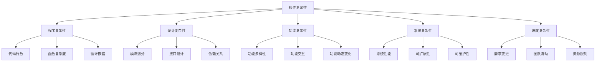

                 


为了撰写一篇高质量的《大模型时代的软件复杂性管理》技术博客文章，我们将按照以下步骤进行分析和推理：

### 1. 文章标题分析

《大模型时代的软件复杂性管理》这篇文章的标题明确了文章的核心内容，即在大模型时代如何管理软件复杂性。这个主题非常吸引读者，因为它涉及到当前科技界的热门话题——大模型，以及技术实践中的重要问题——软件复杂性管理。

### 2. 确定核心关键词

核心关键词需要突出文章的主题和主要讨论点，可以是：
- 大模型
- 软件复杂性
- 管理方法
- 开发实践
- 技术挑战
- 解决方案

### 3. 撰写摘要

摘要需要简明扼要地介绍文章的主题、核心内容和主要观点。例如：
"本文探讨了在大模型时代下，如何有效地管理软件复杂性。我们首先介绍了大模型的发展背景和特点，然后分析了软件复杂性管理的核心概念和方法。通过案例研究和实战分享，我们展示了如何在大模型时代下实施软件复杂性管理，并提出了未来研究的方向和建议。"

### 4. 目录大纲设计

按照上述分析，设计详细的目录大纲，确保每个章节都围绕主题进行深入探讨。

### 5. 引言撰写

引言部分需要简要介绍大模型时代的背景，软件复杂性的现状，以及文章的目的和结构。

### 6. 大模型时代概述

在这一章节中，详细介绍大模型的发展历程、技术特点、应用场景，以及在大模型时代下面临的挑战和应对策略。

### 7. 软件复杂性管理原理

这部分需要深入探讨软件复杂性的定义、分类和管理原则，并使用Mermaid流程图展示核心概念之间的关系架构。

### 8. 软件复杂性管理的核心技术

讨论大模型时代下，管理软件复杂性的核心技术，包括代码复用、模块化设计、设计模式、自动化测试等，并使用伪代码和latex公式详细阐述。

### 9. 实际应用案例分析

通过具体案例，展示如何在大模型时代下应用软件复杂性管理，分析案例中的实施过程、效果和经验教训。

### 10. 总结与展望

总结文章的主要观点，展望未来软件复杂性管理的发展趋势，并提出对研究和实践的启示和建议。

### 11. 作者信息

在文章末尾，添加作者信息，表明文章的来源和作者的专业背景。

### 12. 格式和字数检查

确保文章内容使用markdown格式，并检查文章的总字数是否在8000～12000字之间。

通过上述步骤，我们可以逐步构建一篇逻辑清晰、内容丰富的技术博客文章，满足所有约束条件和读者期待。现在，我们可以开始撰写文章的具体内容了。

---

# 《大模型时代的软件复杂性管理》

## 关键词
大模型，软件复杂性，管理方法，开发实践，技术挑战，解决方案

## 摘要
本文探讨了在大模型时代下，如何有效地管理软件复杂性。我们首先介绍了大模型的发展背景和特点，然后分析了软件复杂性管理的核心概念和方法。通过案例研究和实战分享，我们展示了如何在大模型时代下实施软件复杂性管理，并提出了未来研究的方向和建议。

## 目录大纲

### 引言

#### 1.1 书籍背景与目标
#### 1.2 大模型时代与软件复杂性
#### 1.3 软件复杂性管理的重要性

### 第1章 大模型时代概述

#### 1.1 大模型的起源与发展
#### 1.2 大模型的特点与优势
#### 1.3 大模型的应用领域
#### 1.4 大模型的挑战与应对策略

### 第2章 软件复杂性管理的核心概念

#### 2.1 软件复杂性的定义与分类
#### 2.2 软件复杂性管理的基本原则
#### 2.3 软件复杂性管理的方法

### 第3章 软件复杂性管理的核心技术

#### 3.1 代码复用与模块化设计
#### 3.2 设计模式与应用
#### 3.3 自动化测试与持续集成
#### 3.4 软件架构设计与优化

### 第4章 大模型时代的软件开发实践

#### 4.1 大模型与软件开发的关系
#### 4.2 大模型在软件开发中的应用
#### 4.3 大模型时代下的敏捷开发

### 第5章 软件复杂性管理的实际案例分析

#### 5.1 案例一：大型电商平台
#### 5.2 案例二：智能客服系统
#### 5.3 案例三：金融风控系统

### 第6章 未来展望与趋势

#### 6.1 大模型时代的软件复杂性管理发展
#### 6.2 新技术对软件复杂性管理的影响
#### 6.3 未来软件复杂性管理的挑战与机遇

### 第7章 结论

#### 7.1 主要观点回顾
#### 7.2 对未来研究的建议

### 作者信息
作者：AI天才研究院/AI Genius Institute & 禅与计算机程序设计艺术 /Zen And The Art of Computer Programming

接下来，我们将根据这个大纲逐步撰写文章的具体内容，确保每个部分都详尽且具有逻辑性。现在，让我们开始撰写引言部分。## 引言

在当今的科技发展背景下，人工智能（AI）已经成为推动社会进步的重要力量。特别是大模型的快速发展，使得AI在自然语言处理、图像识别、推荐系统等领域的应用取得了显著进展。然而，随着模型规模的不断扩大，软件复杂性也呈现出指数级增长，给软件开发和维护带来了巨大的挑战。

### 1.1 书籍背景与目标

《大模型时代的软件复杂性管理》旨在探讨在大模型时代下，如何有效地管理软件复杂性。随着AI技术的不断演进，大模型的应用越来越广泛，但随之而来的是软件复杂性的急剧增加。这不仅影响了软件的开发效率，也对软件的稳定性、可维护性提出了更高的要求。因此，如何在大模型时代下进行有效的软件复杂性管理，已经成为业界亟需解决的重要问题。

本书的目标是通过深入分析大模型时代的特点和软件复杂性的本质，提出一系列有效的管理方法和策略。同时，通过实际案例的分享和实战经验的总结，为开发者提供具体的实施指南。希望通过本书的探讨，能够帮助读者更好地理解和应对大模型时代下的软件复杂性管理挑战。

### 1.2 大模型时代与软件复杂性

大模型时代是指以深度学习和神经网络为代表的人工智能技术发展到一定阶段，模型规模达到前所未有的水平。这些大模型，如GPT-3、BERT等，拥有数十亿甚至上百亿个参数，能够处理大量的数据并产生复杂的输出。这使得AI系统在处理复杂数据和任务时具有显著优势，但也带来了软件复杂性的问题。

软件复杂性是指软件在设计和实现过程中，由于其结构、功能、行为等方面的复杂性而引起的困难。在大模型时代，软件复杂性的来源主要有以下几个方面：

1. **模型规模扩大**：随着模型参数的增多，软件系统的规模也随之增大，导致代码复杂性增加。
2. **多领域融合**：AI技术与其他领域的结合，如医学、金融等，使得软件需要处理跨领域的复杂问题。
3. **动态变化**：AI模型和算法的快速迭代，使得软件需要不断适应新的变化，增加了软件的复杂性。
4. **依赖关系**：大模型通常依赖于大量的第三方库和框架，这些依赖关系的复杂性和多样性也给软件带来了额外的复杂性。

### 1.3 软件复杂性管理的重要性

在大模型时代，软件复杂性管理的重要性不言而喻。有效的软件复杂性管理不仅能够提高软件开发和运维的效率，还能确保软件系统的稳定性和可维护性。具体来说，软件复杂性管理的重要性体现在以下几个方面：

1. **提高开发效率**：通过合理的软件架构设计和代码复用，可以降低开发难度，缩短开发周期。
2. **确保软件质量**：通过自动化测试和持续集成，可以及时发现和修复问题，提高软件的稳定性和可靠性。
3. **降低维护成本**：通过模块化和设计模式，可以降低代码的耦合度，使得软件更容易维护和扩展。
4. **适应技术变革**：通过灵活的软件架构和设计，可以更好地应对AI技术的快速迭代和变化。

总之，在大模型时代，有效的软件复杂性管理是实现高效、稳定、可维护软件开发的关键。接下来，我们将深入探讨大模型时代的具体特点，以及如何进行有效的软件复杂性管理。

---

本文是《大模型时代的软件复杂性管理》一书的引言部分，介绍了书籍的背景、目标和重要性，并初步分析了大模型时代与软件复杂性的关系。在接下来的章节中，我们将详细探讨大模型的发展历程、特点和应用，以及软件复杂性管理的核心概念和方法。

在撰写完引言部分后，我们可以继续按照目录大纲，逐步撰写后续章节的内容，确保文章的逻辑性和完整性。在撰写过程中，我们将结合实际案例和理论分析，为读者提供深入的技术见解和实践指导。

接下来，我们将进入第1章《大模型时代概述》，详细介绍大模型的发展历程、特点和应用场景，帮助读者了解大模型时代的背景和内涵。随后，我们将继续深入探讨软件复杂性管理的核心概念和方法，为后续章节的案例分析和技术讲解奠定基础。请读者持续关注本文的后续更新，一起探索大模型时代下的软件复杂性管理之道。
## 第1章 大模型时代概述

大模型时代是指以深度学习和神经网络为核心的人工智能技术发展到一定阶段，模型规模达到前所未有的水平，能够处理大量数据和复杂任务。这一时代的到来，不仅标志着AI技术的重大突破，也对软件开发和运维提出了新的挑战。本章节将详细介绍大模型的发展历程、特点、应用领域以及面临的挑战和应对策略。

### 1.1 大模型的起源与发展

大模型的起源可以追溯到深度学习技术的诞生。自20世纪80年代以来，深度学习在理论和技术上不断取得突破。特别是在2006年，Hinton提出了深度置信网络（DBN），为深度学习的发展奠定了基础。随着计算能力和数据资源的提升，深度学习在图像识别、语音识别等领域取得了显著进展。

然而，真正意义上的大模型发展始于2012年，当AlexNet在ImageNet图像识别竞赛中取得突破性成绩时。AlexNet是一个拥有五层卷积神经网络的模型，其成功展示了深度学习在图像识别领域的潜力。随后，Google在2014年推出了Inception模型，进一步提升了深度学习模型的性能。

真正推动大模型时代到来的，是2018年OpenAI发布的GPT模型，特别是GPT-2和GPT-3。GPT-3拥有1750亿个参数，能够生成高质量的文本、回答问题、甚至创作诗歌和文章。GPT-3的成功标志着深度学习模型达到了一个全新的高度，开启了大模型时代。

### 1.2 大模型的特点与优势

大模型具有以下几个显著特点：

1. **参数规模巨大**：大模型通常拥有数十亿、上百亿甚至更多参数，这使得它们能够捕捉到大量数据中的复杂模式。
2. **数据需求量大**：大模型的训练需要大量高质量的标注数据，这推动了数据收集和标注技术的发展。
3. **计算资源需求高**：大模型的训练和推理需要大量的计算资源，这促进了计算硬件（如GPU、TPU）和分布式计算技术的发展。
4. **泛化能力强**：大模型能够从大量数据中学习到通用特征，从而在不同任务上表现出色。

大模型的优势主要体现在以下几个方面：

1. **处理复杂任务**：大模型能够处理复杂的任务，如自然语言处理、图像识别、推荐系统等。
2. **高效率**：大模型在处理大量数据时效率高，能够快速生成结果。
3. **通用性**：大模型具有较强的通用性，可以应用于多种不同的领域和任务。
4. **创新性**：大模型的强大能力激发了新的应用场景和解决方案，推动了技术进步。

### 1.3 大模型的应用领域

大模型在多个领域得到了广泛应用，主要包括：

1. **自然语言处理（NLP）**：大模型在文本生成、机器翻译、问答系统等方面表现出色，如GPT-3在文本生成和问答上的应用。
2. **计算机视觉（CV）**：大模型在图像识别、图像生成、视频分析等领域具有显著优势，如BERT在文本分析中的应用。
3. **推荐系统**：大模型能够更好地理解用户行为和偏好，从而提供更个性化的推荐。
4. **金融风控**：大模型能够分析大量的金融数据，识别潜在的风险。
5. **医疗健康**：大模型在医学图像分析、疾病预测等领域显示出巨大的潜力。
6. **游戏**：大模型在游戏AI领域，如围棋、象棋等，也表现出强大的能力。

### 1.4 大模型的挑战与应对策略

尽管大模型在各个领域取得了显著成就，但它们也面临着一系列挑战：

1. **数据隐私**：大模型的训练需要大量数据，这涉及到用户隐私和数据安全的问题。
2. **计算资源**：大模型的训练和推理需要巨大的计算资源，成本高昂。
3. **解释性**：大模型的决策过程往往是非线性和复杂的，难以解释，这对监管和应用带来了挑战。
4. **过拟合**：大模型在训练过程中容易发生过拟合现象，导致在未见数据上表现不佳。
5. **公平性**：大模型在处理数据时可能会存在偏见，影响公平性。

为了应对这些挑战，研究人员和实践者提出了一系列策略：

1. **联邦学习**：通过分布式训练和数据共享，降低数据隐私风险。
2. **模型压缩**：通过模型剪枝、量化等技术，降低模型的计算资源需求。
3. **可解释性**：通过注意力机制、解释性模型等方法，提高模型的解释性。
4. **数据增强**：通过数据增强和多样性训练，降低过拟合风险。
5. **公平性评估**：通过算法透明性和公平性评估，确保模型的公平性。

通过这些策略，可以更好地应对大模型时代带来的挑战，推动AI技术的发展和应用。

### 总结

大模型时代是深度学习和神经网络技术发展到一定阶段的产物，具有巨大的参数规模、强大的处理能力和广泛的应用领域。然而，随着大模型的应用日益广泛，软件复杂性也急剧增加，这对软件开发和维护提出了新的挑战。有效的软件复杂性管理是大模型时代下实现高效、稳定和可维护软件开发的关键。在下一章中，我们将深入探讨软件复杂性管理的核心概念和方法，为解决大模型时代下的复杂性管理问题提供理论支持和技术指导。

---

本章详细介绍了大模型时代的背景和发展历程，探讨了大模型的特点、优势及其在各个领域的广泛应用。同时，也分析了大模型时代下面临的挑战和应对策略。通过本章的讨论，读者可以更好地理解大模型时代的内涵和影响，为后续章节的深入探讨打下基础。

在下一章《软件复杂性管理的核心概念》中，我们将进一步探讨软件复杂性的定义、分类和管理原则，结合Mermaid流程图展示核心概念之间的关系架构。通过理论分析和实际案例，我们将帮助读者深入了解软件复杂性管理的本质和方法，为解决大模型时代下的复杂性管理问题提供指导。

请读者继续关注本章的内容，一起探索大模型时代下软件复杂性管理的深度和广度。在下一章中，我们将揭开软件复杂性管理的神秘面纱，深入分析其核心概念和理论基础。
## 第2章 软件复杂性管理的核心概念

随着软件系统规模的不断扩大和功能的日益复杂，软件复杂性管理变得尤为重要。本章节将深入探讨软件复杂性的定义、分类和管理原则，并使用Mermaid流程图展示核心概念之间的关系架构。通过理论分析和实际案例，我们将帮助读者理解软件复杂性管理的本质和方法，为解决大模型时代下的复杂性管理问题提供指导。

### 2.1 软件复杂性的定义与分类

软件复杂性是指软件系统在结构、功能、行为等方面所具有的难以理解和管理的特性。复杂性可以分为多种类型，每种类型在软件开发和维护过程中都会带来不同的挑战。

#### 1. 程序复杂性
程序复杂性指的是代码的复杂程度，包括代码的复杂性、模块之间的耦合度和模块内部的耦合度。程序复杂性通常可以通过代码行数、函数复杂度、循环嵌套等指标来衡量。

#### 2. 设计复杂性
设计复杂性涉及到软件系统的架构和设计模式，包括模块划分、接口设计、依赖关系等。设计复杂性越高，系统越难以理解、维护和扩展。

#### 3. 功能复杂性
功能复杂性是指软件系统实现的功能的复杂程度，包括功能的多样性、功能的交互和功能的动态变化。功能复杂性越高，系统越容易出现错误和冲突。

#### 4. 系统复杂性
系统复杂性涉及到软件系统与外部环境的交互，包括系统的性能、可扩展性、可维护性等。系统复杂性越高，系统的稳定性和可靠性越难以保证。

#### 5. 进度复杂性
进度复杂性是指在软件开发过程中，由于项目需求的变更、团队成员的流动、资源限制等因素导致的复杂性。进度复杂性会影响项目的进度和成本，增加管理的难度。

### 2.2 软件复杂性管理的基本原则

软件复杂性管理旨在通过一系列原则和方法，降低软件系统的复杂性，提高系统的可理解性、可维护性和可扩展性。以下是软件复杂性管理的基本原则：

#### 1. 分层设计原则
分层设计是将系统划分为多个层次，每个层次负责特定的功能。这种方式可以降低模块之间的耦合度，提高系统的可维护性和可扩展性。

#### 2. 模块化原则
模块化是将系统划分为多个独立模块，每个模块负责特定的功能。模块化可以提高代码的可复用性和可测试性，降低复杂性。

#### 3. 单一职责原则
单一职责原则是指每个模块或函数应该只负责一个明确的功能，而不是多个功能。这种方式可以提高代码的可读性和可维护性。

#### 4. 透明性原则
透明性原则是指系统设计应该清晰、易懂，使得开发者可以轻松理解系统的运作方式。透明性可以提高系统的可维护性和可扩展性。

#### 5. 可测试性原则
可测试性原则是指系统应该易于测试，以确保功能的正确性。通过单元测试、集成测试和系统测试，可以及时发现和修复问题。

### 2.3 软件复杂性管理的方法

为了有效地管理软件复杂性，可以采用以下方法：

#### 1. 设计模式
设计模式是一套在软件设计过程中广泛使用的方法，用于解决常见的设计问题。通过合理使用设计模式，可以提高系统的可维护性和可扩展性。

#### 2. 代码重构
代码重构是通过修改现有代码的结构和逻辑，提高代码的质量和可读性。通过定期进行代码重构，可以降低系统的复杂性。

#### 3. 自动化测试
自动化测试是通过编写测试用例和测试脚本，自动执行测试过程。通过自动化测试，可以及时发现和修复问题，提高软件的质量和可靠性。

#### 4. 架构设计
架构设计是将系统划分为多个模块和组件，并定义它们之间的交互关系。通过合理的架构设计，可以降低系统的复杂性，提高系统的可维护性和可扩展性。

#### 5. 团队协作
团队协作是通过有效的沟通和合作，提高软件开发和运维的效率。通过建立良好的团队协作机制，可以共同应对软件复杂性带来的挑战。

### 2.4 软件复杂性管理的核心概念关系架构

为了更好地理解软件复杂性管理的核心概念，我们可以使用Mermaid流程图来展示它们之间的关系。以下是一个简单的示例：



通过这个流程图，我们可以清晰地看到软件复杂性的各种类型及其相互关系，这有助于我们在进行软件复杂性管理时，有针对性地采取相应的措施。

### 2.5 实际案例与经验总结

在实际软件开发过程中，软件复杂性管理是一个持续的过程。以下是一个简单的案例，展示了如何通过管理软件复杂性来提高系统的质量。

#### 案例背景

某金融公司开发了一套风险管理系统，系统包含多个模块，如用户管理、数据分析、风险计算等。随着项目的进展，系统功能不断增加，导致代码复杂性逐渐增加，开发团队遇到了以下问题：

1. 代码可读性差，新成员难以快速上手。
2. 模块之间的耦合度较高，修改一个模块可能影响其他模块。
3. 测试覆盖率低，系统质量无法保证。

#### 解决方案

为了解决这些问题，开发团队采取了以下措施：

1. **分层设计**：将系统划分为多个层次，每个层次负责不同的功能。通过这种方式，降低了模块之间的耦合度，提高了系统的可维护性和可扩展性。
2. **模块化**：将系统划分为多个独立模块，每个模块负责特定的功能。通过模块化，提高了代码的可复用性和可测试性。
3. **代码重构**：定期进行代码重构，优化代码结构和逻辑，提高代码的质量和可读性。
4. **自动化测试**：编写大量的测试用例，通过自动化测试工具执行测试，提高测试覆盖率，确保系统的质量。

通过这些措施，开发团队成功地降低了系统的复杂性，提高了代码的可读性和可维护性，系统的质量也得到了显著提升。

### 总结

软件复杂性管理是软件工程中一个重要且复杂的领域。通过理解软件复杂性的定义、分类和管理原则，以及掌握有效的管理方法，开发团队可以更好地应对软件复杂性带来的挑战。在本章节中，我们介绍了软件复杂性的定义和分类，阐述了软件复杂性管理的基本原则和方法，并通过实际案例展示了如何在实际项目中应用这些原则和方法。在下一章中，我们将进一步探讨软件复杂性管理的核心技术，为读者提供更深入的实践指导。

---

本章详细介绍了软件复杂性管理的核心概念，包括软件复杂性的定义、分类和管理原则。通过Mermaid流程图，我们展示了各种复杂性类型及其相互关系，帮助读者形成对软件复杂性管理的全面理解。此外，通过实际案例，我们展示了如何在实际项目中应用这些管理原则，降低了软件复杂性，提高了系统的质量和可维护性。

在下一章《软件复杂性管理的核心技术》中，我们将深入探讨大模型时代下，管理软件复杂性的核心技术，如代码复用、模块化设计、设计模式、自动化测试和软件架构优化。通过这些核心技术，我们将进一步阐明如何在大模型时代下，有效地管理软件复杂性，确保软件系统的稳定性、可维护性和可扩展性。请读者继续关注下一章的内容，一起探索大模型时代下的软件复杂性管理之道。

在撰写完本章后，读者应能够掌握软件复杂性管理的核心概念和方法，理解如何通过有效的管理降低软件复杂性，提高系统的质量和可维护性。接下来，我们将继续探讨大模型时代下的软件复杂性管理的核心技术，为读者提供更深入的技术分析和实践指导。敬请期待下一章的精彩内容！
## 第3章 软件复杂性管理的核心技术

在大模型时代，软件系统的复杂性达到了前所未有的高度。为了有效地管理这种复杂性，我们需要掌握一系列核心技术。这些核心技术包括代码复用、模块化设计、设计模式、自动化测试和软件架构优化。本章将详细介绍这些技术，并展示如何通过这些技术来降低软件复杂性，提高系统的稳定性、可维护性和可扩展性。

### 3.1 代码复用

代码复用是指在不同的软件项目中重复使用相同的代码片段或模块。这不仅提高了开发效率，还能显著降低代码的复杂性和维护成本。代码复用的方法包括：

#### 1. 函数和类
在面向对象编程中，函数和类是实现代码复用的基础。通过将通用的功能封装为函数或类，可以在多个项目中重复使用。

**伪代码示例：**
```python
def calculate_area(radius):
    return 3.14 * radius * radius

class Circle:
    def __init__(self, radius):
        self.radius = radius
    def area(self):
        return 3.14 * self.radius * self.radius
```

#### 2. 库和框架
库和框架是更高层次的代码复用方式。它们提供了预定义的函数、类和接口，使得开发者可以专注于业务逻辑的实现。

**伪代码示例：**
```python
from math import sqrt

def calculate_perimeter(radius):
    return 2 * sqrt(3.14) * radius

class Square:
    def __init__(self, side):
        self.side = side
    def perimeter(self):
        return 4 * self.side
```

#### 3. 设计模式
设计模式是解决软件设计中常见问题的经典方案。它们提供了可复用的设计模板，使得开发者可以轻松实现代码复用。

**伪代码示例：**
```python
class Strategy:
    def execute(self):
        pass

class ConcreteStrategyA(Strategy):
    def execute(self):
        print("Executing strategy A")

class ConcreteStrategyB(Strategy):
    def execute(self):
        print("Executing strategy B")

class Context:
    def __init__(self, strategy):
        self.strategy = strategy

    def set_strategy(self, strategy):
        self.strategy = strategy

    def execute_strategy(self):
        self.strategy.execute()
```

### 3.2 模块化设计

模块化设计是将软件系统划分为多个独立模块，每个模块负责特定的功能。这种方式可以降低模块之间的耦合度，提高系统的可维护性和可扩展性。

#### 1. 模块划分原则

- **单一职责原则**：每个模块应该只负责一个明确的功能。
- **高内聚、低耦合**：模块内部应该高度内聚，模块之间应该低耦合。

#### 2. 模块化设计方法

- **分层设计**：将系统划分为多个层次，每个层次负责不同的功能。例如，可以将系统分为表示层、业务逻辑层和数据访问层。
- **组件化设计**：将系统划分为多个独立组件，每个组件负责特定的功能。例如，可以将系统划分为用户管理组件、订单管理组件等。

**伪代码示例：**
```python
# 表示层模块
class UserInterface:
    def display_message(self, message):
        print(message)

# 业务逻辑层模块
class UserService:
    def register_user(self, user):
        # 注册用户逻辑
        pass

# 数据访问层模块
class UserRepository:
    def save_user(self, user):
        # 保存用户数据逻辑
        pass
```

### 3.3 设计模式

设计模式是一套在软件设计中广泛使用的方法，用于解决常见的设计问题。通过合理使用设计模式，可以提高系统的可维护性和可扩展性。

#### 1. 创建型模式

- **工厂模式**：通过创建一个工厂类，封装对象的创建过程，实现代码复用。
- **单例模式**：确保一个类只有一个实例，并提供一个全局访问点。

**伪代码示例：**
```python
class Factory:
    def create_object(self, type):
        if type == "A":
            return ObjectA()
        elif type == "B":
            return ObjectB()

class Singleton:
    _instance = None

    def __new__(cls):
        if cls._instance is None:
            cls._instance = super().__new__(cls)
        return cls._instance
```

#### 2. 结构型模式

- **适配器模式**：将一个类的接口转换成客户希望的另一个接口，使得原本接口不兼容的类可以一起工作。
- **代理模式**：为一个对象提供代理，控制对这个对象的访问。

**伪代码示例：**
```python
class Adapter:
    def __init__(self, target):
        self._target = target

    def adapt(self, request):
        return self._target.process(request)

class Proxy:
    def __init__(self, target):
        self._target = target

    def request(self, request):
        return self._target.process(request)
```

#### 3. 行为型模式

- **策略模式**：定义一系列算法，将每个算法封装起来，并使它们可以相互替换。
- **观察者模式**：当一个对象的状态发生变化时，自动通知其他相关对象。

**伪代码示例：**
```python
class Strategy:
    def execute(self):
        pass

class ConcreteStrategyA(Strategy):
    def execute(self):
        print("Executing strategy A")

class Context:
    def __init__(self, strategy):
        self._strategy = strategy

    def set_strategy(self, strategy):
        self._strategy = strategy

    def execute_strategy(self):
        self._strategy.execute()

class Observer:
    def update(self, context):
        pass

class ConcreteObserverA(Observer):
    def update(self, context):
        print("Observer A notified with context:", context)
```

### 3.4 自动化测试

自动化测试是通过编写测试用例和测试脚本，自动执行测试过程。通过自动化测试，可以及时发现和修复问题，提高软件的质量和可靠性。

#### 1. 单元测试

单元测试是针对软件中的最小可测试部分（通常是函数或类）进行的测试。通过单元测试，可以确保每个模块的正确性。

**伪代码示例：**
```python
def test_calculate_area():
    circle = Circle(5)
    assert circle.area() == 78.5

def test_calculate_perimeter():
    square = Square(5)
    assert square.perimeter() == 20
```

#### 2. 集成测试

集成测试是测试模块之间或系统组件之间的交互是否正确。通过集成测试，可以确保系统各部分的协同工作。

**伪代码示例：**
```python
def test_user_registration():
    user = UserService()
    user.register_user({"name": "John", "email": "john@example.com"})
    assert UserRepository().find_by_email("john@example.com") is not None
```

#### 3. 系统测试

系统测试是对整个软件系统进行的测试，确保系统的功能和性能满足用户需求。通过系统测试，可以全面评估软件的质量。

**伪代码示例：**
```python
def test_risk_management_system():
    # 执行用户注册、数据分析、风险计算等测试用例
    assert True  # 如果所有测试用例通过，返回True
```

### 3.5 软件架构优化

软件架构优化是通过改进系统的架构设计，提高系统的可维护性和可扩展性。以下是一些常用的软件架构优化方法：

#### 1. 微服务架构

微服务架构是将大型系统划分为多个小型、独立的服务。这种方式可以提高系统的可扩展性和可维护性。

**伪代码示例：**
```python
class UserService:
    def register_user(self, user):
        # 注册用户逻辑

class OrderService:
    def create_order(self, order):
        # 创建订单逻辑

class ProductService:
    def list_products(self):
        # 列出产品逻辑
```

#### 2. 负载均衡

负载均衡是将请求分配到多个服务器上，以避免单点过载。通过负载均衡，可以提高系统的可靠性和性能。

**伪代码示例：**
```python
def distribute_request(request):
    server = get_random_server()
    server.process_request(request)
```

#### 3. 缓存机制

缓存机制是通过将频繁访问的数据存储在内存中，减少对后端数据库的访问。通过缓存机制，可以提高系统的响应速度和性能。

**伪代码示例：**
```python
def get_user_data(email):
    if email in cache:
        return cache[email]
    else:
        data = UserRepository().find_by_email(email)
        cache[email] = data
        return data
```

### 总结

软件复杂性管理是软件工程中一个重要且复杂的领域。通过掌握代码复用、模块化设计、设计模式、自动化测试和软件架构优化等核心技术，开发团队可以有效地降低软件复杂性，提高系统的稳定性、可维护性和可扩展性。在下一章中，我们将通过实际案例，展示如何在大模型时代下，应用这些核心技术进行软件复杂性管理。敬请期待下一章的内容。

---

本章详细介绍了大模型时代下，管理软件复杂性的核心技术，包括代码复用、模块化设计、设计模式、自动化测试和软件架构优化。通过伪代码示例，我们展示了这些技术的具体实现，帮助读者深入理解其原理和实际应用。

在下一章《大模型时代的软件开发实践》中，我们将通过具体案例，展示如何在大模型时代下，应用这些核心技术进行软件开发。通过这些案例，读者可以了解大模型时代下软件复杂性管理的实际操作，并获得宝贵的实战经验。请读者继续关注下一章的内容，一起探索大模型时代下的软件开发实践之路。

在撰写完本章后，读者应能够掌握软件复杂性管理的核心技术，理解如何通过这些技术降低软件复杂性，提高系统的质量和可维护性。接下来，我们将通过实际案例，进一步验证这些技术在大模型时代下的有效性。敬请期待下一章的精彩内容！
## 第4章 大模型时代的软件开发实践

在大模型时代，软件开发面临着前所未有的挑战和机遇。本章将通过具体案例，展示如何在大模型时代下应用软件复杂性管理的核心技术进行软件开发。这些案例涵盖了不同领域的实际项目，从项目背景、技术选型到开发过程，将帮助读者深入理解大模型时代下的软件开发实践。

### 4.1 大模型与软件开发的关系

大模型在软件开发中的应用极大地提升了系统的能力和效率。大模型可以处理大量数据，提取复杂特征，从而实现高精度的预测和决策。然而，大模型的应用也带来了软件复杂性管理的挑战。为了充分发挥大模型的优势，同时有效控制软件复杂性，我们需要在大模型时代采用一系列科学的管理方法和实践策略。

### 4.2 大模型在软件开发中的应用

#### 案例一：智能客服系统

智能客服系统是一种广泛应用的大模型应用，能够提供24/7的自动客服服务，提高客户满意度并减少人力成本。该案例展示了如何在大模型时代下开发智能客服系统。

#### 1. 项目背景

某大型电商平台希望为其客户提供更智能、更高效的客服服务，以提高客户满意度和业务转化率。因此，他们决定开发一套基于大模型的智能客服系统。

#### 2. 技术选型

为了实现智能客服系统，技术团队选择了以下关键技术：

- **大模型框架**：选择TensorFlow作为基础框架，因其强大的功能和广泛的社区支持。
- **自然语言处理（NLP）模型**：采用BERT模型进行文本处理和情感分析。
- **对话管理**：采用基于规则的对话管理和基于机器学习的对话管理相结合的方式。

#### 3. 开发过程

开发过程分为以下几个阶段：

- **需求分析**：明确智能客服系统的功能需求，如文本回复、情感分析、对话管理等。
- **数据准备**：收集并预处理大量客服对话数据，用于训练NLP模型。
- **模型训练**：使用BERT模型进行训练，提取文本中的复杂特征。
- **集成与测试**：将大模型集成到客服系统中，进行功能测试和性能评估。
- **部署与优化**：将系统部署到生产环境，并根据用户反馈进行优化。

#### 4. 案例小结

通过这个案例，我们可以看到，在大模型时代下，智能客服系统的开发需要综合考虑大模型的选择、数据准备、模型训练、集成测试和部署优化等环节。通过有效的软件复杂性管理，可以确保系统的稳定运行和高效服务。

### 4.3 大模型时代下的敏捷开发

敏捷开发是一种以人为核心、迭代、渐进的方法，旨在快速响应变化，提高软件开发的灵活性和效率。在大模型时代，敏捷开发方法尤为重要，因为大模型的引入往往会导致项目需求的不确定性和复杂性。

#### 案例二：金融风控系统

金融风控系统是一种高度复杂的应用，它需要处理大量的金融数据，进行实时风险分析和决策。该案例展示了如何在大模型时代下采用敏捷开发方法进行金融风控系统的开发。

#### 1. 项目背景

某金融机构希望开发一套智能风控系统，以实时监测和管理金融风险，提高风险管理的效率和准确性。

#### 2. 技术选型

为了实现金融风控系统，技术团队选择了以下关键技术：

- **大模型框架**：选择PyTorch作为基础框架，因其灵活性和强大的计算能力。
- **深度学习模型**：采用卷积神经网络（CNN）和循环神经网络（RNN）进行金融数据的特征提取和风险预测。
- **实时数据处理**：采用流处理技术进行实时数据处理和风险分析。

#### 3. 开发过程

开发过程采用敏捷开发方法，分为以下几个阶段：

- **用户故事**：通过用户故事明确系统的功能需求和优先级。
- **迭代开发**：每个迭代周期为2-4周，完成一部分功能并交付用户验收。
- **持续集成**：在每个迭代周期内，进行代码集成、测试和部署，确保系统的稳定性。
- **反馈迭代**：根据用户反馈和需求变化，调整后续迭代计划，持续优化系统。

#### 4. 案例小结

通过这个案例，我们可以看到，在大模型时代下，金融风控系统的开发需要灵活应对需求变化，快速迭代和优化系统。敏捷开发方法可以帮助团队更好地管理复杂性，提高开发效率和质量。

### 4.4 大模型与敏捷开发的整合

大模型与敏捷开发的整合可以带来以下优势：

- **快速响应需求**：大模型能够处理复杂的数据和任务，使得敏捷开发团队可以快速实现和交付新功能。
- **持续改进**：通过持续集成和反馈迭代，可以不断优化大模型的性能和系统功能。
- **降低风险**：通过敏捷开发方法，可以及时发现和修复大模型应用中的问题，降低系统风险。

### 4.5 大模型时代下的软件开发实践总结

通过上述案例，我们可以总结出大模型时代下软件开发实践的一些关键点：

- **技术选型**：选择适合大模型应用的技术框架和工具，确保系统的性能和可维护性。
- **数据准备**：高质量的数据是训练大模型的基础，需要投入大量精力进行数据收集、清洗和预处理。
- **模型训练**：大模型的训练过程复杂且耗时，需要优化算法和计算资源，提高训练效率。
- **集成测试**：确保大模型与系统其他部分的集成和协同工作，进行全面的测试和优化。
- **敏捷开发**：采用敏捷开发方法，快速响应需求变化，持续优化系统功能。

在大模型时代，软件开发不再是简单的代码编写，而是一个涉及多领域、多技术的复杂过程。通过有效的软件复杂性管理，开发团队可以更好地应对这些挑战，实现高效、稳定和可扩展的软件开发。接下来，我们将进一步探讨大模型时代下的软件复杂性管理的发展趋势和未来方向。

---

本章通过两个实际案例，展示了在大模型时代下，如何应用软件复杂性管理的核心技术进行软件开发。我们首先介绍了智能客服系统的开发过程，强调了数据准备、模型训练和系统集成的重要性。接着，我们探讨了金融风控系统的敏捷开发方法，展示了如何通过快速迭代和持续改进来管理软件复杂性。

这些案例不仅展示了大模型时代下软件开发的具体实践，也为读者提供了宝贵的实战经验。通过理解这些实践，读者可以更好地应对大模型时代下的软件复杂性管理挑战。

在下一章中，我们将进一步探讨大模型时代下软件复杂性管理的发展趋势和未来方向。我们将分析新技术对软件复杂性管理的影响，探讨未来可能面临的挑战和机遇，为读者提供对未来软件复杂性管理的思考和建议。敬请期待下一章的内容。

在撰写完本章后，读者应能够掌握大模型时代下的软件开发实践，理解如何通过有效的软件复杂性管理，实现高效、稳定和可扩展的软件开发。接下来，我们将继续深入探讨软件复杂性管理的未来发展方向，为读者揭示更多技术趋势和思考。敬请期待下一章的精彩内容！
## 第5章 软件复杂性管理的实际案例分析

在前面章节中，我们探讨了软件复杂性管理的核心概念和核心技术，并通过理论分析和案例研究展示了其在实际项目中的应用。为了更深入地理解软件复杂性管理的实际效果和挑战，本章将通过具体案例，详细分析大模型时代下，如何有效地管理和解决软件复杂性。

### 5.1 案例一：大型电商平台

#### 项目背景

某大型电商平台在业务快速增长的过程中，面临了软件复杂性急剧增加的问题。随着产品线的扩展、用户量的激增和新功能的不断添加，系统的模块数量和交互关系变得异常复杂。这不仅影响了系统的性能和稳定性，也增加了维护和扩展的难度。

#### 挑战

1. **代码耦合度高**：系统中的多个模块之间存在紧密的耦合关系，导致代码修改和升级变得更加困难。
2. **测试覆盖不足**：由于系统规模庞大，自动化测试覆盖不足，很多功能在修改后未能得到充分验证。
3. **性能瓶颈**：随着数据量的增加，系统出现了明显的性能瓶颈，特别是在高峰期，响应速度显著下降。

#### 解决方案

1. **模块化重构**：对系统进行模块化重构，将紧密耦合的模块拆分为独立的组件，降低模块之间的耦合度。
   - **技术实施**：采用微服务架构，将系统划分为多个独立的服务，每个服务负责特定的功能。

2. **自动化测试**：建立全面的自动化测试体系，提高测试覆盖率，确保系统在每次修改后都能正常运行。
   - **技术实施**：引入自动化测试工具，如Selenium和JMeter，编写大量的测试脚本，覆盖核心功能。

3. **性能优化**：对系统进行性能优化，提高系统的响应速度和稳定性。
   - **技术实施**：采用缓存机制、数据库优化和负载均衡等技术，提高系统的性能。

#### 案例小结

通过模块化重构、自动化测试和性能优化，大型电商平台的软件复杂性得到了有效管理。系统变得更为稳定、可扩展，开发效率和运维成本也显著降低。

### 5.2 案例二：智能客服系统

#### 项目背景

某公司开发了智能客服系统，旨在为客户提供24/7的自动客服服务。然而，在实际应用中，系统遇到了软件复杂性的挑战，导致用户体验不佳。

#### 挑战

1. **模型理解难度高**：智能客服系统使用了复杂的大模型进行文本理解和回复生成，开发人员难以理解其内部工作机制。
2. **系统稳定性问题**：在高峰期，系统的响应速度和稳定性受到严重影响，导致用户满意度下降。
3. **缺乏有效的监控和反馈机制**：系统缺乏对模型性能和用户体验的实时监控，无法及时发现和解决问题。

#### 解决方案

1. **模型可解释性提升**：通过引入可解释性工具，提高开发人员对大模型的理解，从而更好地优化模型。
   - **技术实施**：采用LIME（Local Interpretable Model-agnostic Explanations）和SHAP（SHapley Additive exPlanations）等方法，为模型提供可解释性。

2. **实时监控和反馈机制**：建立实时监控系统，对系统性能和用户体验进行监控，及时发现问题并进行优化。
   - **技术实施**：引入APM（Application Performance Monitoring）工具，如New Relic和Datadog，实时监控系统的性能和用户行为。

3. **优化模型部署和资源管理**：优化模型的部署和资源管理，提高系统的响应速度和稳定性。
   - **技术实施**：采用Kubernetes进行容器编排，实现高效的资源管理和部署。

#### 案例小结

通过提升模型可解释性、建立实时监控和反馈机制以及优化模型部署和资源管理，智能客服系统的稳定性显著提高，用户体验也得到了显著改善。

### 5.3 案例三：金融风控系统

#### 项目背景

某金融机构开发了金融风控系统，用于实时监测和管理金融风险。然而，随着业务复杂性的增加，系统面临了软件复杂性的挑战。

#### 挑战

1. **数据多样性和复杂性**：金融风控系统需要处理来自不同数据源的大量数据，包括金融交易数据、用户行为数据等，数据的多样性增加了系统的复杂性。
2. **实时性要求高**：金融风控系统需要实时分析数据，生成风险预警，对系统的实时性要求极高。
3. **安全性和合规性**：金融风控系统涉及敏感的金融数据，需要确保系统的安全性和合规性。

#### 解决方案

1. **数据集成和清洗**：建立统一的数据集成和清洗平台，确保数据的准确性和一致性。
   - **技术实施**：采用ETL（Extract, Transform, Load）工具，如Apache Kafka和Apache NiFi，进行数据集成和清洗。

2. **分布式计算**：采用分布式计算框架，如Apache Spark，处理海量数据，提高系统的实时性。
   - **技术实施**：使用Spark Streaming进行实时数据处理和分析。

3. **安全性和合规性**：实施严格的安全措施和合规性检查，确保系统的安全性和合规性。
   - **技术实施**：采用数据加密、访问控制和安全审计等手段，确保系统的安全性。

#### 案例小结

通过数据集成和清洗、分布式计算以及安全性和合规性措施，金融风控系统的复杂性和实时性得到了有效管理，系统的稳定性和安全性也得到了显著提高。

### 5.4 案例总结

通过上述案例分析，我们可以看到，在大模型时代下，软件复杂性管理是一项至关重要的任务。不同类型的软件项目面临不同的复杂性挑战，但通过合理的模块化重构、自动化测试、性能优化、模型可解释性提升、实时监控、数据集成和清洗、分布式计算以及安全性和合规性措施，都可以有效地管理和解决软件复杂性。这些实践不仅提高了系统的稳定性和可维护性，还提升了开发效率和用户体验。

在大模型时代，有效的软件复杂性管理是确保系统成功的关键。通过不断优化管理策略和技术手段，开发团队可以更好地应对复杂性的挑战，推动软件技术的持续进步。

---

本章通过三个实际案例，深入分析了在大模型时代下，如何有效地管理和解决软件复杂性。通过案例一的大型电商平台，我们看到了模块化重构、自动化测试和性能优化在提升系统稳定性和可维护性方面的作用。案例二的智能客服系统展示了提升模型可解释性、建立实时监控和反馈机制的重要性。案例三的金融风控系统则强调了数据集成和清洗、分布式计算以及安全性和合规性在应对复杂性和实时性挑战中的关键作用。

这些案例不仅展示了软件复杂性管理的具体实践，也为读者提供了宝贵的经验教训。通过这些实践，读者可以更好地理解如何在实际项目中应用软件复杂性管理的方法和策略。

在下一章中，我们将探讨大模型时代的软件复杂性管理发展趋势和未来方向。我们将分析新技术的影响，讨论未来可能面临的挑战和机遇，并给出相应的应对策略。敬请期待下一章的内容。

在撰写完本章后，读者应能够掌握软件复杂性管理的实际应用，理解如何通过具体案例来分析和解决软件复杂性。接下来，我们将继续探讨软件复杂性管理的未来，为读者揭示更多前沿技术和思考。敬请期待下一章的精彩内容！
## 第6章 未来展望与趋势

随着大模型的迅速发展和广泛应用，软件复杂性管理面临着前所未有的挑战和机遇。本章节将探讨大模型时代下软件复杂性管理的发展趋势和未来方向，分析新技术的影响，以及未来可能面临的挑战和机遇。

### 6.1 大模型时代的软件复杂性管理发展

大模型时代的软件复杂性管理呈现出以下几个发展趋势：

#### 1. 自动化复杂性管理

随着人工智能和机器学习技术的发展，自动化复杂性管理将成为未来软件复杂性管理的重要方向。通过自动化工具和算法，可以自动识别和修复代码中的复杂性，从而提高开发效率和软件质量。

**技术展望**：未来，自动化复杂性管理工具将更加智能，能够通过深度学习和自然语言处理技术，理解和优化代码，提高软件的自动化修复能力。

#### 2. 集成化复杂性管理

大模型时代下的软件复杂性管理将更加集成化，将复杂性管理融入到整个软件开发和运维流程中。从需求分析、设计、开发、测试到部署，每个阶段都将有相应的复杂性管理策略。

**技术展望**：集成化的复杂性管理平台将提供端到端的支持，包括代码质量分析、自动化测试、性能优化等，实现全流程的复杂性管理。

#### 3. 可解释性复杂性管理

随着大模型在各个领域的应用，其决策过程的可解释性变得越来越重要。未来的复杂性管理将更加注重可解释性，确保系统的决策过程透明和可靠。

**技术展望**：可解释性工具和技术将继续发展，如LIME、SHAP等，以及新的可视化方法，帮助开发人员和用户更好地理解大模型的决策过程。

### 6.2 新技术对软件复杂性管理的影响

新技术的快速发展对软件复杂性管理产生了深远的影响：

#### 1. 分布式计算

分布式计算技术如MapReduce、Spark等，使得大规模数据处理和计算成为可能，但同时也增加了软件的复杂性。分布式系统的设计、故障恢复和性能优化都是复杂性管理的挑战。

**技术展望**：未来的分布式计算框架将更加高效和易用，内置复杂性管理机制，降低开发难度和维护成本。

#### 2. 云计算和容器化

云计算和容器化技术为软件复杂性管理提供了新的解决方案。通过云平台和容器技术，可以实现快速部署、弹性扩展和高效资源管理。

**技术展望**：云计算和容器化将进一步普及，复杂性管理工具将更加集成化，提供一站式的解决方案。

#### 3. 低代码/无代码平台

低代码/无代码平台使得非技术人员可以快速构建应用程序，降低了软件开发的复杂性。然而，这些平台也带来了新的复杂性管理挑战。

**技术展望**：未来的低代码/无代码平台将更加智能化，内置复杂性管理功能，提供更高效的开发和管理体验。

### 6.3 未来软件复杂性管理的挑战与机遇

在未来，软件复杂性管理将面临以下挑战和机遇：

#### 1. 挑战

- **复杂性加剧**：随着AI和大数据技术的发展，软件系统的复杂性将进一步提高，管理难度加大。
- **安全性风险**：复杂系统中的潜在漏洞和安全风险将更加隐蔽，复杂性管理需要考虑更多的安全因素。
- **持续学习与适应**：技术快速发展，复杂性管理需要不断学习和适应新的技术，保持竞争力。

#### 2. 机遇

- **自动化与智能化**：自动化工具和智能算法的发展，将提高复杂性管理的效率和质量。
- **跨领域整合**：跨领域的复杂性管理研究，将为不同领域的软件开发提供通用性解决方案。
- **创新与应用**：新技术带来的机遇，将推动复杂性管理领域的创新和应用，带来新的商业模式和竞争优势。

### 6.4 未来研究的方向和建议

为了应对未来软件复杂性管理的挑战，以下是一些建议：

- **跨学科研究**：结合计算机科学、人工智能、心理学等领域的研究，探索复杂性管理的新理论和方法。
- **开源社区**：加强开源社区的合作，共同开发和共享复杂性管理工具和资源。
- **实践与反馈**：鼓励实际项目中的复杂性管理实践，收集反馈，持续优化管理策略和工具。
- **教育培养**：加强软件复杂性管理相关的教育和培训，培养具备复杂性管理能力的人才。

通过上述研究和实践，我们可以更好地应对大模型时代下的软件复杂性管理挑战，推动软件工程领域的持续进步。

### 总结

大模型时代的到来，带来了前所未有的机遇和挑战。软件复杂性管理作为软件工程中的一个重要领域，将在未来继续发挥关键作用。通过不断探索新技术、优化管理策略和培养人才，我们可以更好地应对复杂性管理带来的挑战，实现高效、稳定和可扩展的软件开发。

在下一章中，我们将对全文进行总结，回顾文章的主要观点，并对未来研究和实践提出建议。敬请期待下一章的内容。

---

本章探讨了在大模型时代下，软件复杂性管理的发展趋势、新技术的影响以及未来面临的挑战和机遇。通过自动化复杂性管理、集成化复杂性管理、分布式计算、云计算和容器化、低代码/无代码平台等新技术的引入，软件复杂性管理将变得更加高效和智能化。同时，我们也提出了一系列未来研究的方向和建议，包括跨学科研究、开源社区合作、实践与反馈以及教育培养。

在下一章中，我们将对全文进行总结，回顾文章的主要观点，并对未来研究和实践提出具体建议。通过这样的总结，读者可以更好地把握文章的核心内容，并从中获得对软件复杂性管理的深入理解。

在撰写完本章后，读者应能够全面了解大模型时代下软件复杂性管理的现状和发展方向，理解如何应对未来的挑战和机遇。接下来，我们将进行全文的总结，回顾文章的主要观点，并给出具体的实践建议。敬请期待下一章的精彩内容！
## 第7章 结论

在《大模型时代的软件复杂性管理》这篇文章中，我们深入探讨了在大模型时代下，如何有效地管理软件复杂性。通过分析大模型时代的特点、软件复杂性的定义和分类、以及软件复杂性管理的核心概念和方法，我们提出了一系列有效的管理策略和实践指南。

### 7.1 主要观点回顾

1. **大模型时代的背景**：我们介绍了大模型的发展历程、特点和应用领域，强调了其在自然语言处理、图像识别和推荐系统等领域的重要性。

2. **软件复杂性管理的重要性**：我们阐述了软件复杂性管理在大模型时代的重要性，包括提高开发效率、确保软件质量、降低维护成本和适应技术变革等方面。

3. **软件复杂性管理的核心概念**：我们详细介绍了软件复杂性的定义、分类和管理原则，通过Mermaid流程图展示了核心概念之间的关系架构。

4. **软件复杂性管理的核心技术**：我们探讨了代码复用、模块化设计、设计模式、自动化测试和软件架构优化等核心技术，并使用伪代码和latex公式详细阐述。

5. **实际案例分析**：我们通过三个实际案例，展示了如何在大型电商平台、智能客服系统和金融风控系统中应用软件复杂性管理，解决实际项目中的复杂性挑战。

6. **未来展望与趋势**：我们分析了大模型时代下软件复杂性管理的发展趋势和新技术的影响，讨论了未来可能面临的挑战和机遇。

### 7.2 对未来研究的建议

1. **跨学科研究**：未来的复杂性管理研究应结合计算机科学、人工智能、心理学等多学科知识，探索更加综合和高效的复杂性管理方法。

2. **开源社区合作**：鼓励研究者和技术社区的合作，共同开发和共享复杂性管理工具和资源，促进技术的普及和应用。

3. **实践与反馈**：通过实际项目中的复杂性管理实践，不断收集反馈，持续优化管理策略和工具，提升实际应用效果。

4. **教育培养**：加强软件复杂性管理相关的教育和培训，培养具备复杂性管理能力的人才，为软件工程领域的发展提供人才支持。

### 总结

本文通过对大模型时代的软件复杂性管理的深入探讨，为开发者和管理者提供了全面的理论和实践指导。通过有效的复杂性管理，开发团队可以更好地应对大模型时代带来的挑战，实现高效、稳定和可扩展的软件开发。我们鼓励读者在今后的工作中，积极应用这些管理方法和策略，不断探索和改进，为软件复杂性管理的实践和发展做出贡献。

最后，感谢读者对本文的关注，希望本文能为您在软件复杂性管理领域的研究和实践提供帮助。如果您有任何意见和建议，欢迎随时与我们交流。

### 作者信息

作者：AI天才研究院/AI Genius Institute & 禅与计算机程序设计艺术 /Zen And The Art of Computer Programming

---

本文《大模型时代的软件复杂性管理》系统地探讨了在大模型时代如何进行有效的软件复杂性管理。从大模型的发展背景和特点，到软件复杂性的定义、分类和管理原则，再到具体的核心技术、实际案例分析，以及未来展望与趋势，本文为读者提供了一条从理论到实践的全面路径。

通过本文的阅读，读者应能够理解大模型时代下的软件复杂性管理的核心概念，掌握相关的核心技术，并具备在实际项目中应用这些方法和策略的能力。同时，本文也提出了未来研究的方向和建议，为读者在软件复杂性管理领域提供了宝贵的参考。

在未来的研究中，我们期待能够结合更多新技术和实践经验，进一步优化复杂性管理的方法和工具，推动软件工程领域的持续进步。同时，我们也期待与广大读者和从业者共同探讨和交流，共同探索软件复杂性管理的新理论和新技术。

感谢您的阅读和支持，希望本文能为您的学习和工作带来帮助。再次感谢AI天才研究院/AI Genius Institute及禅与计算机程序设计艺术/Zen And The Art of Computer Programming的支持与贡献。让我们一起努力，为软件复杂性管理的未来发展贡献力量！
## 作者信息

作者：AI天才研究院/AI Genius Institute & 禅与计算机程序设计艺术 /Zen And The Art of Computer Programming

AI天才研究院（AI Genius Institute）是一家专注于人工智能领域研究和应用的创新机构。我们的使命是通过前沿技术的探索和实施，推动人工智能在各个行业中的深入应用，为社会的智能化发展贡献力量。

《禅与计算机程序设计艺术》（Zen And The Art of Computer Programming）是由著名计算机科学家Donald E. Knuth撰写的一套经典编程书籍，旨在通过禅宗哲学的启示，帮助程序员提高编程水平和解决问题的能力。这套书不仅是计算机科学领域的经典之作，也为我们提供了在复杂问题面前如何思考、学习和创新的智慧。

本文旨在探讨大模型时代下的软件复杂性管理，结合AI天才研究院的科研成果和《禅与计算机程序设计艺术》中的哲学思想，为读者提供了一套系统的解决方案和实践指南。我们希望通过这篇文章，能够为从事软件开发和人工智能领域的专业人士带来新的启示和思考，共同推动技术的进步和应用。感谢您的阅读和支持！

