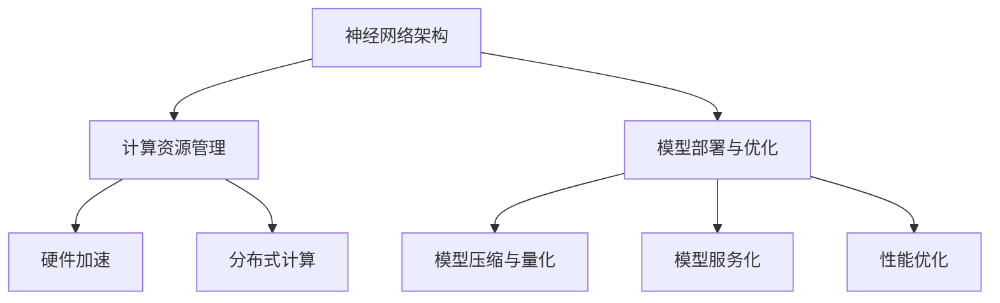

                 

### 《大模型时代的软件架构设计》

#### 关键词：
- 大模型
- 软件架构设计
- 人工智能
- 神经网络
- 分布式计算

#### 摘要：
本文旨在探讨大模型时代下的软件架构设计，分析大模型对软件开发带来的新挑战，并提出相应的解决方案。文章首先介绍了大模型的基本原理和架构设计，接着探讨了如何将大模型与现有软件架构融合，以及在大模型时代下新兴的架构模式。通过实际案例和最佳实践，本文为软件架构师提供了切实可行的指导和启示。

---

# 《大模型时代的软件架构设计》

## 引言与背景

### 1.1 大模型时代的崛起

大模型，即具有巨大参数规模和计算能力的模型，如深度学习模型、图神经网络等。它们通过模拟人脑神经元之间的连接，实现从大量数据中自动学习复杂的规律。大模型的发展源于计算能力的提升和数据量的爆发增长，尤其是在GPU、TPU等专用硬件的推动下，大模型的训练和推理速度得到了显著提升。

大模型在计算机视觉、自然语言处理、推荐系统等众多领域取得了突破性进展，推动了人工智能技术的快速发展。然而，大模型的引入也带来了软件架构设计的新挑战，包括：

- **计算资源需求**：大模型通常需要大量的计算资源，这对硬件和基础设施提出了更高的要求。
- **数据隐私与安全**：大模型在训练过程中会接触到大量的敏感数据，如何保证数据隐私和安全成为一个重要问题。
- **模型部署与优化**：如何将大模型高效地部署到实际应用中，以及如何进行模型优化，以提高性能和降低成本。

### 1.2 软件架构设计的新挑战

大模型的引入对软件架构设计带来了如下挑战：

- **可扩展性**：软件架构需要支持大规模数据的处理和高并发的访问，这要求系统具备良好的可扩展性。
- **弹性**：系统需要能够快速适应大模型引入的变化，包括算法、数据结构等。
- **容错性**：在大模型训练和推理过程中，系统需要具备一定的容错性，以保证服务的连续性和稳定性。

### 1.3 本书内容概述

本书将分为五个部分：

- **第一部分**：引言与背景，介绍大模型时代的崛起和软件架构设计的新挑战。
- **第二部分**：大模型原理与架构，讨论大模型的基础知识和架构设计。
- **第三部分**：大模型与软件架构的融合，探讨如何将大模型集成到现有软件架构中。
- **第四部分**：大模型时代下的新兴架构，介绍基于大模型的增强学习、联邦学习等新兴架构模式。
- **第五部分**：实践与探索，通过实际案例和最佳实践，为软件架构设计提供指导。

---

## 大模型原理与架构

### 2.1 大模型基础

#### 大模型的定义

大模型通常是指具有数百万、数十亿甚至数千亿个参数的深度学习模型。这些模型通过多层神经网络进行训练，能够在各种任务中表现出色。例如，Transformer模型在自然语言处理领域取得了显著的成果，其参数规模达到数亿甚至数十亿。

#### 大模型的主要类型

- **深度神经网络（DNN）**：DNN是大规模神经网络的一种，其结构由多个隐层组成，能够处理复杂的非线性关系。
- **卷积神经网络（CNN）**：CNN在计算机视觉领域表现出色，通过卷积层、池化层等结构提取图像特征。
- **递归神经网络（RNN）**：RNN适用于序列数据，如自然语言文本和语音信号，能够捕捉时间序列中的长期依赖关系。
- **图神经网络（GNN）**：GNN适用于图结构数据，如社交网络和知识图谱，能够通过节点和边的关系进行信息传递和整合。

#### 大模型的工作原理

大模型的工作原理基于多层神经网络的构建。每一层神经元都会接收前一层神经元的输出，并对其进行加权求和处理，最后通过激活函数得到输出。模型通过反向传播算法不断调整权重，以最小化预测误差。

#### 大模型的核心概念

- **神经网络架构**：包括输入层、隐藏层和输出层，不同层之间通过权重矩阵进行连接。
- **激活函数**：如ReLU、Sigmoid和Tanh，用于引入非线性特性，使模型能够学习复杂的映射关系。
- **损失函数**：如均方误差（MSE）和交叉熵（Cross Entropy），用于衡量预测值和真实值之间的差距，指导权重调整。
- **优化算法**：如随机梯度下降（SGD）、Adam等，用于调整权重，优化模型性能。

### 2.2 大模型架构设计

#### 神经网络架构

神经网络架构是构建大模型的基础，其设计原则包括：

- **层次结构**：根据任务需求设计合适的层次结构，如卷积神经网络、循环神经网络等。
- **层间连接**：通过全连接层、卷积层等连接不同层次的神经元，实现特征提取和融合。
- **参数共享**：通过参数共享减少模型参数数量，提高训练效率。

#### 计算机视觉架构

计算机视觉架构主要包括卷积神经网络（CNN）和生成对抗网络（GAN）等。CNN通过卷积层、池化层等结构提取图像特征，GAN通过生成器和判别器的对抗训练生成逼真的图像。

#### 自然语言处理架构

自然语言处理架构主要包括循环神经网络（RNN）、长短时记忆网络（LSTM）、门控循环单元（GRU）和Transformer等。这些模型通过序列编码和注意力机制捕捉语言中的长距离依赖关系。

#### 大模型计算资源管理

大模型计算资源管理的关键在于如何高效地利用计算资源，包括：

- **硬件加速**：利用GPU、TPU等硬件加速器进行模型训练和推理。
- **分布式计算**：通过分布式计算框架如TensorFlow、PyTorch等，实现大规模模型的训练和推理。
- **数据并行与模型并行**：数据并行通过将数据分成多个部分并行训练，模型并行通过将模型分成多个部分并行训练，以提高训练效率。

#### 大模型部署与优化

大模型部署与优化的关键在于如何高效地部署模型并提高其性能，包括：

- **模型压缩与量化**：通过模型压缩和量化技术减少模型参数和计算量，提高部署效率。
- **模型服务化**：通过模型服务化技术将模型部署到云端或边缘设备上，提供实时推理服务。
- **性能优化**：通过算法优化、代码优化等手段提高模型性能，降低部署成本。

### 2.3 大模型架构设计核心概念之间的关系架构

下面是使用Mermaid流程图表示大模型架构设计核心概念之间的关系：

### 2.4 大模型计算资源管理

#### 资源分配策略

资源分配策略主要涉及计算资源、存储资源和网络资源的合理分配。具体策略包括：

- **按需分配**：根据模型训练和推理的需求动态分配资源，提高资源利用率。
- **预留资源**：为关键任务预留一定量的资源，确保任务执行时资源充足。
- **负载均衡**：通过负载均衡技术将任务均匀地分配到各个节点上，避免资源过度集中。

#### 分布式计算架构

分布式计算架构主要包括数据并行和模型并行两种模式。数据并行通过将数据分成多个部分并行训练，模型并行通过将模型分成多个部分并行训练。

- **数据并行**：每个节点独立训练一部分数据，最终将各个节点的结果进行合并。
- **模型并行**：每个节点独立训练一部分模型，最终将各个节点的结果进行合并。

#### 分布式计算框架

常见的分布式计算框架包括：

- **TensorFlow**：提供丰富的分布式计算API，支持数据并行和模型并行。
- **PyTorch**：支持分布式训练，通过`torch.nn.parallel.DistributedDataParallel`接口实现。
- **MXNet**：提供分布式计算支持，通过`mxnet.gluon.nn.Distributed`模块实现。

#### 分布式计算流程

分布式计算流程主要包括以下几个步骤：

1. **初始化**：初始化分布式环境，设置节点角色和通信方式。
2. **数据划分**：将数据分成多个部分，每个节点负责一部分数据的训练。
3. **模型划分**：将模型分成多个部分，每个节点负责一部分模型的训练。
4. **训练**：在每个节点上独立训练模型，并通过通信机制同步梯度。
5. **合并结果**：将各个节点的结果进行合并，得到最终模型。

### 2.5 大模型部署与优化

#### 部署方案

大模型部署方案主要包括以下几种：

- **云计算部署**：利用云计算平台如阿里云、腾讯云等提供的大模型训练和部署服务。
- **边缘计算部署**：将大模型部署到边缘设备上，通过边缘计算提供实时推理服务。
- **混合部署**：结合云计算和边缘计算，实现大规模模型在云端训练和边缘设备上部署。

#### 模型压缩与量化

模型压缩与量化技术用于减少模型参数和计算量，提高部署效率。常见的模型压缩与量化技术包括：

- **剪枝**：通过剪枝技术去除模型中无关的神经元和连接，减少模型参数。
- **量化**：将模型参数从浮点数转换为整数，降低存储和计算需求。
- **知识蒸馏**：通过将大模型的知识传递给小模型，实现模型的压缩和优化。

#### 性能优化

性能优化主要包括算法优化和代码优化。算法优化包括：

- **并行计算**：利用分布式计算提高训练和推理速度。
- **优化算法**：选择合适的优化算法，如Adam、RMSprop等，提高训练效率。

代码优化包括：

- **向量化**：利用向量化操作替代循环操作，提高计算速度。
- **内存优化**：通过内存优化减少内存占用，提高模型部署效率。

### 2.6 大模型与软件架构的融合

#### 软件架构设计原则

软件架构设计原则主要包括：

- **灵活性**：软件架构需要具备良好的灵活性，以适应大模型引入的变化。
- **可扩展性**：软件架构需要支持大规模数据和并发访问，具备良好的可扩展性。
- **稳健性**：软件架构需要具备一定的容错性，保证在大模型训练和推理过程中的稳定性。
- **安全性**：软件架构需要确保数据隐私和安全，防范数据泄露和攻击。

#### 大模型集成与适配

大模型集成与适配主要包括：

- **API接口设计**：设计合适的大模型API接口，方便与其他系统进行集成。
- **数据预处理**：对输入数据进行预处理，确保符合大模型的要求。
- **服务化部署**：将大模型服务化部署，提供实时推理和预测服务。

#### 架构演进策略

架构演进策略主要包括：

- **持续集成与持续部署（CI/CD）**：通过CI/CD实现快速迭代和部署，提高开发效率。
- **模块化与组件化设计**：将大模型和其他模块进行分离，实现模块化和组件化设计，方便后续升级和扩展。

### 2.7 架构案例分析

#### 成功案例分享

- **案例1**：某知名互联网公司利用大模型实现图像识别系统，通过分布式计算和模型压缩技术，提高了模型部署效率。
- **案例2**：某金融公司利用大模型进行风险评估，通过数据并行和模型并行技术，提高了模型训练速度。

#### 失败案例分析

- **案例1**：某初创公司试图将大模型应用于实时推荐系统，但由于计算资源不足和架构设计不合理，导致系统性能不佳。
- **案例2**：某企业尝试使用大模型进行数据挖掘，但由于数据预处理不当和模型优化不足，导致模型效果不佳。

---

### 小结

本文介绍了大模型时代的崛起和软件架构设计的新挑战，分析了大模型原理与架构设计，探讨了如何将大模型与软件架构融合，以及大模型时代下的新兴架构模式。通过实际案例和最佳实践，本文为软件架构设计提供了有益的参考和指导。

在接下来的章节中，我们将进一步探讨大模型时代的软件架构设计原则、新兴架构模式，以及实践与探索等内容。

---

[作者：AI天才研究院/AI Genius Institute & 禅与计算机程序设计艺术 /Zen And The Art of Computer Programming]

