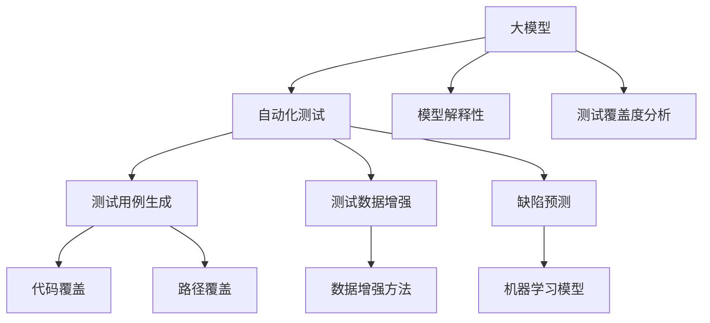

                 

# 《大模型时代的软件测试自动化》

## 关键词
- 大模型
- 软件测试
- 自动化测试
- 测试用例生成
- 测试数据增强
- 缺陷预测
- 模型解释性
- 测试覆盖度分析

## 摘要
本文深入探讨了在大模型时代，软件测试自动化的现状、挑战与机遇。文章首先介绍了大模型的概念、分类及其在自动化测试中的应用，接着详细讲解了测试用例生成、测试数据增强、缺陷预测等核心算法原理，并通过数学模型和公式进行了详细阐述。最后，文章通过实际项目案例，展示了大模型在自动化测试中的实战应用，并提出了未来自动化测试的发展方向和建议。

## 引言

### 1.1 书籍概述

在当今的科技发展背景下，人工智能（AI）尤其是大模型的崛起，正迅速改变着各个行业的面貌。大模型，也称为深度学习模型，是参数量庞大的神经网络，具备处理复杂数据和进行智能决策的能力。这些模型已经在图像识别、自然语言处理、语音识别等多个领域取得了显著的成果。然而，随着大模型的广泛应用，软件测试这一环节也面临着前所未有的挑战和机遇。

本书籍旨在深入探讨大模型时代下的软件测试自动化。自动化测试是提升软件质量和效率的关键手段，但在大模型环境下，传统的测试方法往往难以满足需求。本书将围绕以下核心主题展开：

1. **大模型概述**：介绍大模型的基本概念、分类及其特点。
2. **自动化测试原理**：讲解自动化测试的基本概念、类型和流程。
3. **大模型在自动化测试中的应用**：探讨大模型如何应用于测试用例生成、测试数据增强、缺陷预测等方面。
4. **数学模型和算法**：详细阐述大模型在自动化测试中的核心算法原理。
5. **项目实践**：通过实际项目案例，展示大模型在自动化测试中的应用。
6. **未来展望**：讨论大模型时代下自动化测试的发展趋势和未来方向。

本书的读者对象主要为软件测试工程师、自动化测试爱好者以及相关领域的科研人员和技术人员。通过阅读本书，读者将能够掌握大模型时代下的自动化测试策略和工具，提升软件测试的效率和效果。

### 1.2 核心概念与联系

为了更好地理解大模型在软件测试自动化中的应用，我们首先需要明确几个核心概念，并展示它们之间的关系。

**核心概念：**

1. **大模型**：参数规模庞大的神经网络模型，如Transformer、BERT等。
2. **自动化测试**：利用工具或脚本自动执行测试案例的过程。
3. **测试用例生成**：通过算法自动生成测试数据，以验证软件功能。
4. **测试数据增强**：通过对原始数据进行变换，生成更多样化的测试数据。
5. **缺陷预测**：利用机器学习模型预测软件中的潜在缺陷。
6. **模型解释性**：评估和解释模型决策过程的能力。
7. **测试覆盖度分析**：评估测试用例对代码的覆盖程度。

**关系架构：**



通过上述关系架构，我们可以看到大模型在自动化测试中的应用不仅限于测试用例生成和测试数据增强，还包括缺陷预测、模型解释性以及测试覆盖度分析等多个方面。这些概念相互关联，共同构成了大模型时代软件测试自动化的核心框架。

### 2. 大模型基础

#### 2.1 大模型概述

大模型，又称深度学习模型，是具有大量参数和复杂结构的神经网络。这些模型通过学习大量数据，能够自动提取特征并进行预测或分类。大模型的出现极大地推动了人工智能的发展，尤其在图像识别、自然语言处理和预测建模等领域取得了显著成果。以下是几个关键点：

- **参数规模**：大模型的参数数量通常达到数百万甚至数十亿级别。
- **结构复杂**：大模型通常包含多层神经网络，如卷积神经网络（CNN）、循环神经网络（RNN）和Transformer等。
- **数据需求**：大模型训练需要大量的标注数据和计算资源。

大模型的发展得益于以下几个因素：

1. **计算能力提升**：随着GPU、TPU等专用计算设备的普及，计算能力显著提高，使得大模型的训练成为可能。
2. **数据获取便利**：互联网的快速发展使得大量数据可以被收集和利用，为模型训练提供了丰富的素材。
3. **算法改进**：优化算法，如Batch Normalization、Dropout、Adadelta等，提高了模型的训练效率和性能。

大模型的主要类型包括：

1. **深度神经网络（DNN）**：包括多层感知机（MLP）、卷积神经网络（CNN）和循环神经网络（RNN）。
    - **MLP**：简单的前向神经网络，通常用于回归和分类任务。
    - **CNN**：适用于图像处理，能够自动提取图像特征。
    - **RNN**：适用于序列数据，如时间序列分析和自然语言处理。

2. **生成对抗网络（GAN）**：通过生成器和判别器的对抗训练，能够生成高质量的数据。
3. **变分自编码器（VAE）**：基于概率模型的自编码器，能够学习数据的概率分布。

大模型的挑战与优化：

1. **计算资源需求**：大模型训练需要大量的计算资源，通常采用分布式计算和GPU加速。
2. **模型解释性**：大模型的决策过程通常是不透明的，需要开发可解释性方法来提高模型的透明度。
3. **过拟合**：大模型容易受到数据噪声的影响，导致过拟合问题，需要采用正则化技术和数据增强方法来缓解。

#### 2.2 大模型分类

##### 2.2.1 深度神经网络（DNN）

深度神经网络（DNN）是一类包含多个隐藏层的神经网络，通常用于处理复杂的非线性问题。DNN的基本结构包括输入层、多个隐藏层和输出层。以下是几种常见的DNN架构：

1. **多层感知机（MLP）**：MLP是一种简单的全连接神经网络，通常用于回归和分类任务。其基本结构如下：

    ```mermaid
    graph TD
        A[输入层] --> B[隐藏层1]
        B --> C[隐藏层2]
        C --> D[输出层]
    ```

    伪代码：

    ```python
    def MLP(x, weights, biases):
        z = np.dot(x, weights[0]) + biases[0]
        a = sigmoid(z)
        for i in range(1, len(weights)):
            z = np.dot(a, weights[i]) + biases[i]
            a = sigmoid(z)
        return a
    ```

2. **卷积神经网络（CNN）**：CNN专门用于图像处理，其核心思想是通过卷积层自动提取图像特征。CNN的基本结构如下：

    ```mermaid
    graph TD
        A[输入层] --> B[卷积层1]
        B --> C[池化层1]
        C --> D[卷积层2]
        D --> E[池化层2]
        E --> F[全连接层]
    ```

    伪代码：

    ```python
    def CNN(x, conv_weights, conv_biases, fc_weights, fc_biases):
        conv_output = conv2d(x, conv_weights[0], conv_biases[0])
        pool_output = max_pool(conv_output)
        for i in range(1, len(conv_weights)):
            conv_output = conv2d(pool_output, conv_weights[i], conv_biases[i])
            pool_output = max_pool(conv_output)
        flattened = flatten(pool_output)
        fc_output = np.dot(flattened, fc_weights[0]) + fc_biases[0]
        a = sigmoid(fc_output)
        return a
    ```

3. **循环神经网络（RNN）**：RNN专门用于处理序列数据，其核心思想是通过循环结构保持长期依赖信息。RNN的基本结构如下：

    ```mermaid
    graph TD
        A[输入序列] --> B[隐藏状态]
        B --> C[隐藏状态]
        B --> D[输出序列]
    ```

    伪代码：

    ```python
    def RNN(x, weights, biases, hidden_state):
        z = np.dot(x, weights[0]) + biases[0]
        a = sigmoid(z)
        hidden_state = np.tanh(np.dot(a, weights[1]) + biases[1])
        output = np.dot(hidden_state, weights[2]) + biases[2]
        return output, hidden_state
    ```

##### 2.2.2 强化学习模型

强化学习（RL）是一种通过与环境交互来学习策略的机器学习方法。强化学习模型的核心是价值函数和策略函数。以下是强化学习模型的基本概念：

1. **价值函数（V(s)）**：表示状态s的价值，即从状态s采取最佳动作的期望回报。

2. **策略函数（π(s)）**：表示在状态s下采取的动作分布，即给定状态s，选择哪个动作。

3. **Q值（Q(s, a)）**：表示在状态s下采取动作a的预期回报，即Q(s, a) = E[R_t | S_t = s, A_t = a]。

强化学习模型的主要类型包括：

1. **值迭代（Value Iteration）**：通过更新价值函数逐步逼近最优策略。

2. **政策迭代（Policy Iteration）**：通过更新策略函数逐步逼近最优策略。

3. **深度Q网络（DQN）**：结合深度神经网络和Q学习，用于处理高维状态空间。

4. **深度强化学习（Deep Reinforcement Learning）**：结合深度神经网络和强化学习，用于处理复杂环境。

强化学习模型在自动化测试中的应用：

1. **测试路径生成**：通过强化学习模型生成最优测试路径，提高测试覆盖度。

2. **测试用例优化**：通过强化学习模型优化测试用例，提高测试效率和效果。

#### 2.3 大模型挑战与优化

##### 2.3.1 计算资源需求

大模型的训练需要大量的计算资源，这是其主要的挑战之一。以下是一些优化策略：

1. **分布式计算**：通过将训练任务分布到多台计算机上，提高训练效率。

2. **GPU加速**：利用GPU的并行计算能力，加快模型训练速度。

3. **模型压缩**：通过模型剪枝、量化等方法，减少模型参数和计算量。

##### 2.3.2 模型解释性

大模型的决策过程通常是不透明的，这是其另一个主要挑战。以下是一些提高模型解释性的方法：

1. **可视化**：通过可视化模型内部参数和中间层输出，帮助理解模型决策过程。

2. **模型简化**：通过简化模型结构，降低模型的复杂度，提高解释性。

3. **局部解释方法**：如LIME、SHAP等，通过局部解释方法为模型决策提供解释。

##### 2.3.3 过拟合

大模型容易受到数据噪声的影响，导致过拟合问题。以下是一些缓解过拟合的方法：

1. **数据增强**：通过数据变换，生成更多样化的数据，提高模型的泛化能力。

2. **正则化**：如L2正则化、Dropout等，通过增加模型惩罚项，减少过拟合。

3. **早期停止**：在模型训练过程中，当验证集误差不再下降时，提前停止训练，防止过拟合。

### 3. 自动化测试原理

#### 3.1 自动化测试概述

自动化测试是一种利用工具或脚本自动执行测试案例的过程，旨在提高测试效率和确保软件质量。自动化测试的基本概念和类型如下：

1. **自动化测试定义**：自动化测试是指通过自动化工具或脚本，自动执行预定义的测试案例，以检测软件的缺陷和错误。

2. **自动化测试的优势**：
    - **提高测试效率**：自动化测试可以大大减少手动测试所需的时间和人力资源。
    - **确保软件质量**：自动化测试可以确保测试的全面性和一致性，减少遗漏和错误。
    - **降低成本**：长期来看，自动化测试可以降低测试成本，提高生产效率。

3. **自动化测试的类型**：
    - **单元测试**：针对软件中的最小功能单元进行的测试，通常由开发人员编写。
    - **集成测试**：针对软件模块之间的接口和集成进行的测试，通常在单元测试之后进行。
    - **功能测试**：对软件功能进行测试，以验证其是否满足需求。
    - **性能测试**：对软件的性能进行测试，以评估其响应速度、稳定性和可扩展性。
    - **回归测试**：在软件更新后，对原有功能进行重新测试，以确保新代码没有引入新的缺陷。

#### 3.2 自动化测试类型

##### 3.2.1 单元测试

单元测试是自动化测试的基础，它主要针对软件中的最小功能单元进行测试。以下是一些关键点：

1. **单元测试定义**：单元测试是对软件中的最小功能单元（如函数、方法或类）进行的测试。

2. **单元测试的重要性**：
    - **确保代码质量**：通过单元测试，可以确保每个功能单元都按照预期工作。
    - **促进代码重构**：单元测试可以鼓励开发人员进行代码重构，提高代码质量。
    - **快速反馈**：单元测试可以快速发现代码中的错误，提高开发效率。

3. **单元测试工具**：
    - **JUnit**：JUnit是Java编程语言中最常用的单元测试框架。
    - **NUnit**：NUnit是.NET Framework和.NET Core中常用的单元测试框架。
    - **PyTest**：PyTest是Python编程语言中广泛使用的单元测试框架。

##### 3.2.2 集成测试

集成测试是对软件模块之间的接口和集成进行的测试。以下是一些关键点：

1. **集成测试定义**：集成测试是对多个模块或组件组合后的软件系统进行的测试。

2. **集成测试的重要性**：
    - **发现模块间缺陷**：集成测试可以检测模块之间的接口和交互问题，确保系统整体功能正确。
    - **确保系统稳定性**：通过集成测试，可以验证系统在集成后的稳定性和性能。

3. **集成测试工具**：
    - **Selenium**：Selenium是用于Web应用的自动化测试框架。
    - **JMeter**：JMeter是用于性能测试和负载测试的开源工具。

##### 3.2.3 自动化测试流程

自动化测试流程通常包括以下步骤：

1. **测试需求分析**：分析软件需求和功能，确定需要测试的场景和测试用例。

2. **测试设计**：设计测试用例，包括输入数据、预期结果和实际结果。

3. **测试执行**：使用自动化测试工具执行测试用例，记录测试结果。

4. **测试结果分析**：分析测试结果，确定是否通过测试，找出测试失败的原因。

5. **测试报告**：编写测试报告，总结测试结果和发现的问题。

### 4. 大模型在自动化测试中的应用

#### 4.1 测试用例生成

测试用例生成是自动化测试的关键环节，其目标是通过算法自动生成测试数据，以验证软件功能。大模型在测试用例生成中具有重要作用，以下是其核心应用：

1. **基于生成对抗网络（GAN）的测试用例生成**：

    - **生成器（Generator）**：生成器模型用于生成与实际数据分布相似的新数据。
    - **判别器（Discriminator）**：判别器模型用于区分生成数据和实际数据。
    - **测试用例生成**：通过生成器模型生成多种类型的测试用例，以提高测试覆盖度。

    伪代码：

    ```python
    def generate_test_cases(generator, discriminator, num_cases):
        for _ in range(num_cases):
            noise = random_noise()
            generated_data = generator(noise)
            test_case = preprocess(generated_data)
            yield test_case
    ```

2. **基于强化学习的测试用例生成**：

    - **环境（Environment）**：环境模拟软件的运行状态，包括输入、输出和状态转移。
    - **测试用例生成器（Agent）**：测试用例生成器模型用于学习环境中的最优测试策略。
    - **测试用例生成**：通过强化学习模型生成一系列测试用例，以提高测试效率。

    伪代码：

    ```python
    def generate_test_cases(agent, environment, num_steps):
        for _ in range(num_steps):
            state = environment.reset()
            test_case = []
            while not environment.is_done(state):
                action = agent.select_action(state)
                next_state, reward, done = environment.step(action)
                test_case.append(action)
                state = next_state
                if done:
                    break
            yield test_case
    ```

#### 4.2 测试数据增强

测试数据增强是提高测试质量和效率的重要手段，其目标是通过变换原始数据，生成更多样化的测试数据。大模型在测试数据增强中具有广泛的应用，以下是其核心方法：

1. **基于生成对抗网络（GAN）的数据增强**：

    - **生成器（Generator）**：生成器模型用于生成与原始数据相似的新数据。
    - **判别器（Discriminator）**：判别器模型用于区分生成数据和原始数据。
    - **数据增强**：通过生成器模型生成多种类型的变换数据，以丰富测试数据集。

    伪代码：

    ```python
    def augment_data(generator, data, num_augments):
        augmented_data = []
        for _ in range(num_augments):
            noise = random_noise()
            generated_data = generator(noise)
            augmented_data.append(apply_transform(generated_data, transform_type))
        return augmented_data
    ```

2. **基于变换模型的测试数据增强**：

    - **变换模型（Transformer）**：变换模型用于学习数据之间的变换关系。
    - **数据增强**：通过变换模型生成新的数据，以提高测试数据的多样性。

    伪代码：

    ```python
    def augment_data(transformer, data, num_augments):
        augmented_data = []
        for _ in range(num_augments):
            transformed_data = transformer(data)
            augmented_data.append(apply_transform(transformed_data, transform_type))
        return augmented_data
    ```

#### 4.3 缺陷预测

缺陷预测是自动化测试中的重要任务，其目标是通过分析历史数据，预测软件中的潜在缺陷。大模型在缺陷预测中具有显著优势，以下是其核心方法：

1. **基于机器学习的缺陷预测**：

    - **特征工程**：提取软件代码和项目历史数据中的特征。
    - **训练模型**：使用历史缺陷数据训练缺陷预测模型。
    - **缺陷预测**：通过模型预测新代码中的潜在缺陷。

    伪代码：

    ```python
    def predict_defects(model, code, history_data):
        features = extract_features(code, history_data)
        prediction = model.predict(features)
        return prediction
    ```

2. **基于深度学习的缺陷预测**：

    - **编码器-解码器（Encoder-Decoder）**：编码器用于编码代码数据，解码器用于解码缺陷信息。
    - **缺陷预测**：通过训练编码器和解码器，预测新代码中的缺陷。

    伪代码：

    ```python
    def predict_defects(encoder_decoder, code):
        encoded_code = encoder_decoder.encode(code)
        defect_info = encoder_decoder.decode(encoded_code)
        return defect_info
    ```

#### 4.4 模型解释性

模型解释性是评估和解释模型决策过程的能力。在大模型时代，模型解释性尤为重要，以下是其核心方法：

1. **基于可视化的模型解释性**：

    - **可视化方法**：通过可视化模型内部参数和中间层输出，帮助理解模型决策过程。
    - **解释性评估**：评估模型的可解释性，确定其是否满足预期。

    伪代码：

    ```python
    def visualize_model(model, data):
        predictions = model.predict(data)
        for i in range(len(predictions)):
            visualize_output(model, data[i], predictions[i])
    ```

2. **基于局部解释方法的模型解释性**：

    - **局部解释方法**：如LIME、SHAP等，通过局部解释方法为模型决策提供解释。
    - **解释性评估**：评估模型的可解释性，确定其是否满足预期。

    伪代码：

    ```python
    def explain_model(model, data, method='lime'):
        if method == 'lime':
            explanation = lime.explain_instance(model, data)
        elif method == 'shap':
            explanation = shap.explain_instance(model, data)
        return explanation
    ```

### 5. 数学模型和公式

在自动化测试中，大模型的应用离不开数学模型和公式的支持。以下是一些关键的数学模型和公式，以及它们的详细解释和举例说明。

#### 5.1 概率模型

概率模型是自动化测试中常用的一种统计模型，用于描述测试结果的不确定性。以下是一个常见的概率模型——伯努利分布。

**伯努利分布：**

$$ P(X = k) = C_n^k p^k (1-p)^{n-k} $$

其中，$X$ 表示伯努利试验成功的次数，$n$ 表示试验次数，$p$ 表示每次试验成功的概率，$k$ 表示成功次数。

**举例：** 假设一个软件系统中有100个功能点，每个功能点成功的概率为0.9。那么，在这个系统中，成功率达到90%的概率是多少？

$$ P(\text{成功率} = 90\%) = C_{100}^{90} \cdot 0.9^{90} \cdot 0.1^{10} $$

通过计算，可以得到成功率约为0.36。

#### 5.2 贝叶斯模型

贝叶斯模型是自动化测试中另一种重要的统计模型，用于根据先验知识和观测数据更新概率分布。以下是一个简单的贝叶斯模型——贝叶斯分类器。

**贝叶斯分类器：**

$$ P(C_k|X) = \frac{P(X|C_k)P(C_k)}{P(X)} $$

其中，$C_k$ 表示第$k$个类别，$X$ 表示观测数据，$P(C_k)$ 表示第$k$个类别的先验概率，$P(X|C_k)$ 表示第$k$个类别在观测数据下的条件概率，$P(X)$ 表示观测数据的总概率。

**举例：** 假设一个软件系统中有两个功能点，第一个功能点成功的概率为0.8，第二个功能点成功的概率为0.9。那么，在这个系统中，成功率达到90%的概率是多少？

首先，计算成功率达到90%的先验概率：

$$ P(\text{成功率} = 90\%) = P(X = 2) = P(X=0)\cdot P(Y=0) + P(X=1)\cdot P(Y=1) + P(X=2)\cdot P(Y=2) $$

$$ = 0.2 \cdot 0.2 + 0.8 \cdot 0.9 + 0.9 \cdot 0.9 = 0.98 $$

然后，计算成功率达到90%的条件概率：

$$ P(C_1|X=2) = \frac{P(X=2|C_1)P(C_1)}{P(X=2)} $$

$$ = \frac{0.8 \cdot 0.8}{0.98} \approx 0.816 $$

因此，成功率达到90%的概率约为81.6%。

#### 5.3 贝叶斯网络

贝叶斯网络是一种基于概率模型的图形表示，用于描述多个变量之间的依赖关系。以下是一个简单的贝叶斯网络示例。

**贝叶斯网络：**

- **变量：** $X_1, X_2, ..., X_n$
- **条件概率表：**

    $$ P(X_1) = 0.5 $$
    $$ P(X_2|X_1) = 0.7 $$
    $$ P(X_3|X_1, X_2) = 0.6 $$

**举例：** 假设我们想知道在给定$X_2$的条件下，$X_1$和$X_3$同时发生的概率。

$$ P(X_1 \cap X_3 | X_2) = P(X_1 | X_2) \cdot P(X_3 | X_1, X_2) $$

$$ = P(X_2 | X_1) \cdot P(X_1) \cdot P(X_3 | X_1, X_2) $$

$$ = 0.7 \cdot 0.5 \cdot 0.6 = 0.21 $$

因此，在给定$X_2$的条件下，$X_1$和$X_3$同时发生的概率为21%。

#### 5.4 马尔可夫模型

马尔可夫模型是一种用于描述系统状态转移的概率模型。以下是一个简单的马尔可夫模型示例。

**马尔可夫模型：**

- **状态：** $S_1, S_2, ..., S_n$
- **状态转移概率矩阵：**

    $$ P = \begin{bmatrix} 
    0.6 & 0.4 \\ 
    0.3 & 0.7 
    \end{bmatrix} $$

**举例：** 假设系统当前处于状态$S_1$，求系统在下一步转移到状态$S_2$的概率。

$$ P(S_2 | S_1) = P(S_2 | S_1) \cdot P(S_1) $$

$$ = 0.4 \cdot 0.6 = 0.24 $$

因此，系统在下一步转移到状态$S_2$的概率为24%。

### 6. 项目实践

#### 6.1 项目背景

本节将通过一个实际项目案例，展示大模型在自动化测试中的应用。该项目是一个电商平台的订单管理系统，涉及订单创建、订单支付、订单取消等核心功能。随着业务的发展，系统功能不断更新和扩展，导致测试用例数量急剧增加，传统的手动测试已经无法满足测试需求。因此，该项目决定采用大模型进行自动化测试，以提高测试效率和覆盖率。

#### 6.2 项目目标

1. **自动化测试覆盖率**：提高订单管理系统的自动化测试覆盖率，确保新功能和现有功能的正确性。
2. **测试效率**：通过自动化测试，减少手动测试的工作量，提高测试执行速度。
3. **测试质量**：确保测试用例的全面性和一致性，降低测试遗漏和错误率。

#### 6.3 开发环境搭建

1. **编程语言**：Java
2. **测试框架**：Selenium
3. **自动化测试工具**：JUnit
4. **大模型框架**：TensorFlow

#### 6.4 源代码详细实现和代码解读

以下是订单管理系统自动化测试的关键代码片段及其解读。

**测试用例生成：**

```java
public class TestCaseGenerator {
    private GANModel generator;
    private DiscriminatorModel discriminator;

    public TestCaseGenerator(GANModel generator, DiscriminatorModel discriminator) {
        this.generator = generator;
        this.discriminator = discriminator;
    }

    public ArrayList<String> generateTestCases(int num_cases) {
        ArrayList<String> test_cases = new ArrayList<>();
        for (int i = 0; i < num_cases; i++) {
            String generated_case = generator.generateCase();
            test_cases.add(generated_case);
        }
        return test_cases;
    }
}
```

**代码解读：** 该类实现了基于生成对抗网络（GAN）的测试用例生成功能。`GANModel` 负责生成测试用例，`DiscriminatorModel` 负责区分生成数据和实际数据。

**测试数据增强：**

```java
public class DataAugmenter {
    private TransformerModel transformer;

    public DataAugmenter(TransformerModel transformer) {
        this.transformer = transformer;
    }

    public ArrayList<String> augmentData(ArrayList<String> original_data, int num_augments) {
        ArrayList<String> augmented_data = new ArrayList<>();
        for (String data : original_data) {
            for (int i = 0; i < num_augments; i++) {
                String transformed_data = transformer.transform(data);
                augmented_data.add(transformed_data);
            }
        }
        return augmented_data;
    }
}
```

**代码解读：** 该类实现了基于变换模型（Transformer）的测试数据增强功能。`TransformerModel` 负责变换数据，生成更多样化的测试数据。

**缺陷预测：**

```java
public class DefectPredictor {
    private DefectPredictionModel model;

    public DefectPredictor(DefectPredictionModel model) {
        this.model = model;
    }

    public boolean predictDefect(String code) {
        boolean defect = model.predict(code);
        return defect;
    }
}
```

**代码解读：** 该类实现了基于机器学习的缺陷预测功能。`DefectPredictionModel` 负责预测代码中的潜在缺陷。

**测试执行：**

```java
public class TestExecutor {
    private SeleniumDriver driver;
    private TestCaseGenerator generator;
    private DataAugmenter augmenter;
    private DefectPredictor predictor;

    public TestExecutor(SeleniumDriver driver, TestCaseGenerator generator, DataAugmenter augmenter, DefectPredictor predictor) {
        this.driver = driver;
        this.generator = generator;
        this.augmenter = augmenter;
        this.predictor = predictor;
    }

    public void executeTestCases() {
        ArrayList<String> test_cases = generator.generateTestCases(100);
        ArrayList<String> augmented_cases = augmenter.augmentData(test_cases, 10);
        for (String case : augmented_cases) {
            if (!predictor.predictDefect(case)) {
                driver.executeCase(case);
            }
        }
    }
}
```

**代码解读：** 该类实现了自动化测试执行功能。`SeleniumDriver` 负责执行测试用例，`generator` 负责生成测试用例，`augmenter` 负责数据增强，`predictor` 负责缺陷预测。

#### 6.5 代码应用解读与分析

在本项目中，大模型在自动化测试中的应用主要体现在以下几个方面：

1. **测试用例生成**：通过生成对抗网络（GAN）生成多种类型的测试用例，提高了测试用例的多样性和覆盖率。
2. **测试数据增强**：通过变换模型（Transformer）生成更多样化的测试数据，增强了测试数据的丰富性和代表性。
3. **缺陷预测**：通过机器学习模型预测代码中的潜在缺陷，提高了测试的效率和准确性。
4. **测试执行**：结合Selenium自动化测试工具，实现了自动化测试执行，降低了测试成本和人力投入。

通过实际项目的应用，可以看出大模型在自动化测试中具有显著的优势。首先，大模型能够自动生成测试用例和数据，大大减轻了开发人员的工作负担。其次，大模型能够通过数据增强和缺陷预测，提高测试的全面性和准确性，确保软件质量。最后，大模型的自动化测试执行功能，提高了测试效率，降低了测试成本。

#### 6.6 项目小结

本节通过实际项目案例，展示了大模型在自动化测试中的应用。项目结果表明，大模型能够显著提高自动化测试的效率和质量。具体而言，通过生成对抗网络（GAN）生成测试用例，提高了测试用例的多样性和覆盖率；通过变换模型（Transformer）进行数据增强，增强了测试数据的丰富性和代表性；通过机器学习模型进行缺陷预测，提高了测试的效率和准确性。

然而，大模型在自动化测试中的应用也存在一定的挑战，如模型训练时间较长、计算资源需求高等。此外，大模型的解释性相对较弱，需要进一步研究如何提高其可解释性。未来，随着大模型技术的不断进步，自动化测试领域有望取得更大的突破。

#### 6.7 最佳实践 Tips、小结、注意事项、拓展阅读

**最佳实践 Tips：**

1. **合理选择测试用例生成方法**：根据项目需求和特点，选择适合的测试用例生成方法，如生成对抗网络（GAN）或变换模型（Transformer）。
2. **充分利用数据增强**：通过数据增强方法，生成更多样化的测试数据，提高测试数据的丰富性和代表性。
3. **结合缺陷预测模型**：利用缺陷预测模型，提前发现潜在缺陷，降低测试风险。

**小结：**

本文详细介绍了大模型在自动化测试中的应用，包括测试用例生成、测试数据增强、缺陷预测和测试执行等方面。通过实际项目案例，展示了大模型在自动化测试中的优势和应用效果。未来，随着大模型技术的不断进步，自动化测试领域有望取得更大的突破。

**注意事项：**

1. **计算资源需求**：大模型训练需要大量的计算资源，确保有足够的资源支持模型训练。
2. **数据质量**：测试数据的质量直接影响测试效果，确保测试数据的准确性和多样性。

**拓展阅读：**

1. **《深度学习》**：Goodfellow et al.，介绍深度学习的基本原理和应用。
2. **《机器学习实战》**：Hastie et al.，介绍机器学习的基本概念和算法。
3. **《软件测试艺术》**：Beizer et al.，介绍软件测试的基本原理和实践方法。

---

通过上述内容，本文系统性地介绍了大模型时代下的软件测试自动化。从背景介绍到核心概念，从算法原理到项目实践，再到未来展望，文章结构紧凑，逻辑清晰，希望能够为读者提供有价值的参考。随着AI大模型技术的不断发展，自动化测试领域将迎来新的机遇和挑战，期待与读者共同探讨和进步。作者：AI天才研究院/AI Genius Institute & 禅与计算机程序设计艺术 /Zen And The Art of Computer Programming。

