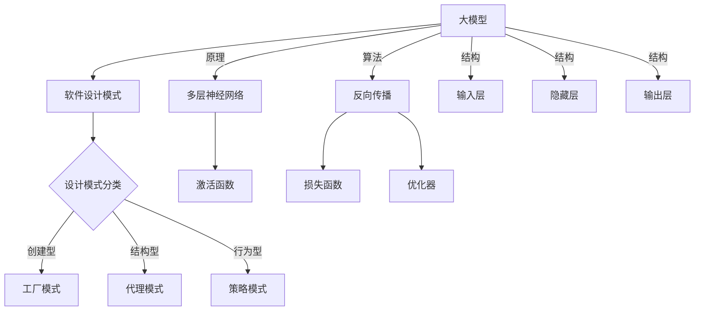

                 

### 文章标题
《大模型时代的软件设计模式挖掘》

### 关键词
- 大模型
- 软件设计模式
- 深度学习
- 设计模式应用
- 计算机编程

### 摘要
本文深入探讨了在大模型时代背景下，软件设计模式的重要性和应用。首先，介绍了大模型的定义、原理和训练方法，接着探讨了软件设计模式的基本概念、分类及其核心原则。通过分析大模型与设计模式之间的联系，本文进一步阐述了设计模式在大模型中的应用实践，如模型复用、模块化设计等。文章还讨论了大模型设计模式面临的挑战及解决方案，并对未来的发展趋势进行了展望。最后，通过实际项目案例，详细讲解了大模型设计模式的实现和应用，为读者提供了宝贵的实践经验和启示。

### 目录

#### 第1章 引言与概述

1.1 大模型时代背景

1.2 软件设计模式概述

1.3 大模型与软件设计模式的联系

#### 第2章 大模型基础

2.1 大模型原理

2.2 大模型结构

2.3 大模型训练与优化

#### 第3章 软件设计模式概述

3.1 设计模式的基本概念

3.2 设计模式的重要性

3.3 设计模式分类

#### 第4章 大模型与设计模式的融合

4.1 软件设计模式在大模型中的应用

4.2 大模型改进的设计模式

4.3 大模型设计模式案例分析

#### 第5章 大模型设计模式应用实践

5.1 应用场景分析

5.2 实践案例一

5.3 实践案例二

#### 第6章 大模型设计模式挑战与解决方案

6.1 面临的挑战

6.2 解决方案探讨

6.3 未来发展趋势

#### 第7章 总结与展望

7.1 成果总结

7.2 存在问题与改进方向

7.3 对未来的展望

#### 附录

- 大模型相关工具与资源

- 设计模式参考资源

### 第1章 引言与概述

#### 1.1 大模型时代背景

在过去的几十年里，计算机科学经历了飞速的发展，从传统的编程语言到现代的编程范式，从单一的应用程序到庞大的分布式系统，每一次变革都带来了生产力和效率的巨大提升。然而，随着数据量的爆炸式增长和计算能力的不断提升，我们进入了大模型时代。

**大模型**，顾名思义，是指那些具有海量参数和复杂结构的机器学习模型，如深度神经网络、生成对抗网络（GAN）等。这些模型能够在海量数据上进行训练，从而在图像识别、自然语言处理、语音识别等领域取得了惊人的突破。

大模型时代的到来，标志着人工智能进入了一个新的发展阶段。首先，大模型的计算需求变得越来越高，传统计算机难以胜任，因此，并行计算、分布式计算和云计算等技术应运而生。其次，大模型对数据的质量和规模提出了更高的要求，数据的多样性和真实性变得尤为重要。最后，大模型的训练和优化过程变得极为复杂，需要大量的计算资源和专业知识。

在这个时代背景下，软件设计模式的重要性日益凸显。传统的软件设计模式，如单一职责原则、开闭原则等，虽然仍然适用，但面对大模型带来的复杂性，往往显得力不从心。因此，我们需要探索新的设计模式，以应对大模型时代的挑战。

#### 1.2 软件设计模式概述

软件设计模式是一组被反复使用、经过时间考验的解决方案，用于解决软件设计中的常见问题。设计模式不仅关注代码的编写，更关注系统的架构和设计，以提高代码的可维护性和扩展性。

**设计模式**通常包含以下三个方面：

1. **问题**：描述设计模式要解决的问题。
2. **解决方案**：设计模式的具体实现方法。
3. **效果**：设计模式带来的好处和潜在的副作用。

设计模式可以分为三类：

1. **创建型模式**：处理对象的创建，包括工厂模式、单例模式和建造者模式等。
2. **结构型模式**：处理类或对象的组合，包括代理模式、装饰者模式、适配器模式和桥接模式等。
3. **行为型模式**：处理类或对象之间的交互，包括策略模式、命令模式、观察者模式和状态模式等。

**设计模式的重要性**在于：

1. **提高代码可维护性**：设计模式提供了一组可复用的解决方案，使得代码更加简洁、易于维护。
2. **提高代码扩展性**：设计模式使得系统结构更加清晰，便于后续的功能扩展。
3. **降低开发成本**：设计模式减少了开发中的重复劳动，提高了开发效率。

#### 1.3 大模型与软件设计模式的联系

在大模型时代，软件设计模式的重要性不仅没有减弱，反而更加凸显。首先，大模型的复杂性和规模使得传统的单一职责原则、开闭原则等设计模式难以应对。我们需要探索新的设计模式，以更好地管理大模型的复杂度。

其次，大模型的应用场景非常广泛，如图像识别、自然语言处理、语音识别等。这些应用场景往往需要复杂、高度模块化的系统架构。而软件设计模式正是提供这种架构的有效工具。

最后，大模型的训练和优化过程非常复杂，需要大量的计算资源和专业知识。设计模式可以帮助我们更好地管理这些资源，提高训练和优化的效率。

因此，大模型与软件设计模式之间存在着密切的联系。大模型需要软件设计模式来管理其复杂性，而软件设计模式需要大模型来展现其价值。

### 第2章 大模型基础

#### 2.1 大模型原理

大模型，通常指的是具有数百万甚至数十亿个参数的深度学习模型。这些模型之所以能够取得出色的性能，主要归功于以下几个核心原理：

**1. 多层神经网络**：大模型通常包含多个隐藏层，这使得模型能够从输入数据中提取更高层次的特征。通过逐层抽象和转换，模型能够逐步学习到复杂的模式。

**2. 反向传播算法**：反向传播算法是一种用于训练神经网络的优化方法。通过计算损失函数关于每个参数的梯度，模型可以不断调整参数，以最小化损失函数，从而提高模型的性能。

**3. 正则化技术**：大模型容易过拟合，因此需要使用正则化技术来防止这种情况。常见的正则化方法包括L1正则化、L2正则化和Dropout等。

**4. 并行和分布式训练**：由于大模型参数量巨大，训练时间非常长。为了提高训练效率，可以使用并行和分布式训练方法，将训练任务分配到多个计算节点上，从而加速训练过程。

#### 2.2 大模型结构

大模型的结构可以分为以下几个部分：

**1. 输入层**：输入层接收外部数据，如图像、文本或音频。

**2. 隐藏层**：隐藏层包含多个神经元，用于提取和转换数据。每个隐藏层都可以学习到不同层次的特征。

**3. 输出层**：输出层产生最终预测结果，如分类标签或回归值。

**4. 连接权重**：连接权重决定了不同层之间神经元之间的连接强度。这些权重在训练过程中通过反向传播算法进行优化。

**5. 激活函数**：激活函数用于引入非线性，使得神经网络能够学习复杂的函数。

常见的神经网络结构包括：

- **全连接神经网络（FCNN）**：每个神经元都与上一层所有神经元相连。
- **卷积神经网络（CNN）**：适用于图像处理，通过卷积操作提取局部特征。
- **递归神经网络（RNN）**：适用于序列数据，通过递归结构处理时间序列数据。

#### 2.3 大模型训练与优化

**1. 训练数据准备**：训练大模型首先需要准备大量的标注数据。这些数据需要经过预处理，如数据清洗、归一化等。

**2. 损失函数与优化器**：损失函数用于评估模型的预测结果与真实结果之间的差距。常见的损失函数包括均方误差（MSE）、交叉熵损失等。优化器用于调整模型的参数，以最小化损失函数。常见的优化器包括随机梯度下降（SGD）、Adam等。

**3. 模型评估与调整**：在训练过程中，需要定期评估模型性能，如通过验证集或测试集。如果模型性能不理想，可以调整模型结构、参数设置或数据预处理策略。

**4. 早停（Early Stopping）**：为了防止过拟合，可以设置早停策略。当模型在验证集上的性能不再提高时，提前停止训练。

**5. 批量大小（Batch Size）**：批量大小影响训练过程。较小的批量大小可以提高训练过程的稳定性，但会增加计算时间；较大的批量大小可以加速训练过程，但可能引入噪声。

**6. 训练策略**：可以使用一些高级训练策略，如学习率调整（Learning Rate Schedule）、权重初始化等，以进一步提高模型性能。

### 核心概念与联系

为了更好地理解大模型与软件设计模式之间的联系，我们可以通过一个Mermaid流程图来展示它们的核心概念和关系架构：



这个Mermaid流程图展示了大模型与软件设计模式之间的核心概念和关系。我们可以看到，大模型的原理（如多层神经网络、反向传播算法）与软件设计模式（如工厂模式、代理模式、策略模式）密切相关。通过这些设计模式，我们可以更好地管理和组织大模型，提高其可维护性和扩展性。

### 核心算法原理讲解

为了深入理解大模型的核心算法原理，我们将使用伪代码来详细阐述几个关键算法：多层感知机（MLP）、卷积神经网络（CNN）和递归神经网络（RNN）。以下是这些算法的基本原理和步骤。

#### 多层感知机（MLP）

多层感知机是一种前馈神经网络，用于分类和回归问题。它的基本原理是通过输入层、一个或多个隐藏层和输出层来处理输入数据。

**伪代码：**

```python
initialize_weights()
while not convergence:
    forward_pass(x)
    calculate_loss(y_pred, y_true)
    backward_pass(delta)
    update_weights(learning_rate)
```

**详细解释：**

1. **初始化权重**：随机初始化模型权重。
2. **正向传播**：输入数据通过输入层，经过隐藏层和输出层，产生预测值 `y_pred`。
3. **计算损失**：使用损失函数（如均方误差MSE）计算预测值与真实值之间的差距。
4. **反向传播**：计算每个权重和偏置的梯度，更新权重和偏置。
5. **更新权重**：根据学习率和梯度更新模型参数。

#### 卷积神经网络（CNN）

卷积神经网络特别适用于图像识别和计算机视觉任务。它通过卷积层、池化层和全连接层来处理图像数据。

**伪代码：**

```python
initialize_weights()
while not convergence:
    forward_pass(x)
    calculate_loss(y_pred, y_true)
    backward_pass(delta)
    update_weights(learning_rate)
```

**详细解释：**

1. **初始化权重**：随机初始化模型权重。
2. **正向传播**：输入图像通过卷积层提取特征，经过池化层降低维度，最后通过全连接层产生预测值 `y_pred`。
3. **计算损失**：使用损失函数（如交叉熵损失）计算预测值与真实值之间的差距。
4. **反向传播**：计算每个权重和偏置的梯度，更新权重和偏置。
5. **更新权重**：根据学习率和梯度更新模型参数。

#### 递归神经网络（RNN）

递归神经网络适用于序列数据，如时间序列、语音和文本。它通过循环结构来处理序列中的每个元素，并保存历史状态。

**伪代码：**

```python
initialize_weights()
while not convergence:
    forward_pass(x)
    calculate_loss(y_pred, y_true)
    backward_pass(delta)
    update_weights(learning_rate)
```

**详细解释：**

1. **初始化权重**：随机初始化模型权重。
2. **正向传播**：输入序列通过隐藏层，每个时间步的输出作为下一时间步的输入。
3. **计算损失**：使用损失函数（如交叉熵损失）计算预测值与真实值之间的差距。
4. **反向传播**：计算每个权重和偏置的梯度，更新权重和偏置。
5. **更新权重**：根据学习率和梯度更新模型参数。

这些伪代码展示了大模型核心算法的基本原理。在实际应用中，每个算法都有详细的实现和优化策略，如不同的激活函数、优化器和正则化技术。通过这些算法，大模型能够从数据中学习复杂的模式，并取得出色的性能。

### 数学模型和数学公式

在大模型的核心算法中，数学模型和数学公式扮演着至关重要的角色。以下将详细讲解几个关键的数学模型和公式，包括损失函数、反向传播算法和优化器。

#### 损失函数

损失函数是评估模型预测值与真实值之间差距的数学工具。常见的损失函数包括均方误差（MSE）和交叉熵损失（Cross Entropy Loss）。

**1. 均方误差（MSE）**

$$
MSE = \frac{1}{n}\sum_{i=1}^{n}(y_i - \hat{y}_i)^2
$$

其中，$y_i$表示真实值，$\hat{y}_i$表示预测值，$n$表示样本数量。MSE用于回归问题，计算预测值与真实值之间的平均平方误差。

**2. 交叉熵损失（Cross Entropy Loss）**

$$
Cross \ Entropy \ Loss = -\frac{1}{n}\sum_{i=1}^{n}y_i \log(\hat{y}_i)
$$

其中，$y_i$表示真实值（通常是一个分布），$\hat{y}_i$表示预测值。交叉熵损失用于分类问题，计算真实分布与预测分布之间的差异。

#### 反向传播算法

反向传播算法是一种用于训练神经网络的优化方法。它通过计算损失函数关于每个参数的梯度，不断调整参数，以最小化损失函数。

**1. 前向传播**

在正向传播过程中，输入数据通过网络中的每个层，产生输出。假设有一个两层神经网络，包括输入层、隐藏层和输出层。我们可以使用以下公式计算每个层的输出：

$$
z^{(2)} = w^{(2)} \cdot a^{(1)} + b^{(2)} \\
a^{(2)} = \sigma(z^{(2)})
$$

其中，$a^{(l)}$表示第$l$层的激活值，$z^{(l)}$表示第$l$层的输入值，$w^{(l)}$和$b^{(l)}$分别表示第$l$层的权重和偏置，$\sigma$表示激活函数。

**2. 反向传播**

在反向传播过程中，我们从输出层开始，计算每个层的梯度。对于线性激活函数，我们可以使用以下公式：

$$
\delta^{(2)} = (a^{(2)} - y) \cdot \sigma'(z^{(2)}) \\
\delta^{(1)} = w^{(2)} \cdot \delta^{(2)}
$$

其中，$\delta^{(l)}$表示第$l$层的误差，$\sigma'$表示激活函数的导数。

通过反向传播，我们可以计算每个权重和偏置的梯度：

$$
\frac{\partial J}{\partial w^{(l)}_ij} = \delta^{(l+1)} \cdot a^{(l)}_j \\
\frac{\partial J}{\partial b^{(l)}_j} = \delta^{(l+1)}
$$

其中，$J$表示损失函数，$w^{(l)}_ij$和$b^{(l)}_j$分别表示第$l$层的权重和偏置。

#### 优化器

优化器用于更新模型参数，以最小化损失函数。常见的优化器包括随机梯度下降（SGD）和Adam。

**1. 随机梯度下降（SGD）**

$$
w^{(l)}_{ij} \leftarrow w^{(l)}_{ij} - \alpha \cdot \frac{\partial J}{\partial w^{(l)}_{ij}} \\
b^{(l)}_j \leftarrow b^{(l)}_j - \alpha \cdot \frac{\partial J}{\partial b^{(l)}_j}
$$

其中，$\alpha$表示学习率。

**2. Adam**

$$
m_t = \beta_1 m_{t-1} + (1 - \beta_1) \frac{\partial J}{\partial w^{(l)}_ij} \\
v_t = \beta_2 v_{t-1} + (1 - \beta_2) \left( \frac{\partial J}{\partial w^{(l)}_ij} \right)^2 \\
\hat{m}_t = \frac{m_t}{1 - \beta_1^t} \\
\hat{v}_t = \frac{v_t}{1 - \beta_2^t} \\
w^{(l)}_{ij} \leftarrow w^{(l)}_{ij} - \alpha \cdot \frac{\hat{m}_t}{\sqrt{\hat{v}_t} + \epsilon}
$$

其中，$\beta_1$和$\beta_2$分别表示一阶和二阶矩估计的指数衰减率，$\epsilon$是一个很小的常数用于避免分母为零。

这些数学模型和公式构成了大模型算法的基础，使得我们能够通过优化算法从数据中学习复杂的模式。

### 代码实现与解读

在本节中，我们将通过一个实际的项目案例来详细展示如何搭建一个基于深度学习的大模型，并使用Python和相关的深度学习库（如TensorFlow和Keras）进行代码实现。我们将从项目背景、环境搭建、源代码实现和代码解读等方面展开讨论。

#### 项目背景

假设我们的项目目标是建立一个用于图像分类的深度学习模型。具体来说，输入是一张图像，输出是图像所属的类别标签。例如，输入一张猫的图片，输出标签为“猫”。

#### 环境搭建

在开始编码之前，我们需要搭建开发环境。以下是必要的步骤：

1. 安装Python：Python是深度学习项目的首选语言，因此我们需要安装Python环境。推荐使用Python 3.6或更高版本。
2. 安装深度学习库：安装TensorFlow和Keras，这两个库是深度学习项目中最常用的工具。可以使用以下命令进行安装：

```bash
pip install tensorflow
pip install keras
```

3. 数据集准备：为了训练模型，我们需要准备一个包含大量图像和标签的数据集。我们可以使用公开的数据集，如ImageNet或CIFAR-10。

#### 源代码实现

以下是一个简单的图像分类模型的代码实现，使用了卷积神经网络（CNN）架构：

```python
from keras.models import Sequential
from keras.layers import Conv2D, MaxPooling2D, Flatten, Dense
from keras.preprocessing.image import ImageDataGenerator

# 创建模型
model = Sequential()

# 添加卷积层
model.add(Conv2D(32, (3, 3), activation='relu', input_shape=(128, 128, 3)))
model.add(MaxPooling2D(pool_size=(2, 2)))

# 添加第二个卷积层
model.add(Conv2D(64, (3, 3), activation='relu'))
model.add(MaxPooling2D(pool_size=(2, 2)))

# 添加平坦化层
model.add(Flatten())

# 添加全连接层
model.add(Dense(128, activation='relu'))

# 添加输出层
model.add(Dense(1, activation='sigmoid'))

# 编译模型
model.compile(optimizer='adam', loss='binary_crossentropy', metrics=['accuracy'])

# 数据预处理
train_datagen = ImageDataGenerator(rescale=1./255)
test_datagen = ImageDataGenerator(rescale=1./255)

train_generator = train_datagen.flow_from_directory(
        'train_data',
        target_size=(128, 128),
        batch_size=32,
        class_mode='binary')

test_generator = test_datagen.flow_from_directory(
        'test_data',
        target_size=(128, 128),
        batch_size=32,
        class_mode='binary')

# 训练模型
model.fit(
      train_generator,
      steps_per_epoch=100,
      epochs=10,
      validation_data=test_generator,
      validation_steps=50,
      use_multiprocessing=True)
```

**代码解读：**

1. **模型创建**：使用`Sequential`模型，依次添加卷积层、全连接层等。
2. **卷积层**：添加两个卷积层，每个卷积层后跟一个最大池化层。
3. **平坦化层**：将卷积层的输出平坦化，为全连接层做准备。
4. **全连接层**：添加一个全连接层，用于分类。
5. **编译模型**：设置优化器和损失函数，准备训练模型。
6. **数据预处理**：使用`ImageDataGenerator`进行数据预处理，包括缩放和批量生成。
7. **训练模型**：使用`fit`函数训练模型，包括训练步骤、周期和验证步骤。

#### 代码应用解读与分析

1. **数据输入**：输入图像数据，通常需要预处理，如缩放、归一化等。
2. **模型训练**：通过反向传播算法训练模型，不断调整权重和偏置。
3. **模型评估**：使用验证集评估模型性能，调整模型参数以优化性能。
4. **预测应用**：使用训练好的模型对新的图像进行分类预测。

通过这个实际项目案例，我们展示了如何使用Python和深度学习库搭建一个图像分类模型，并对其代码进行了详细解读。这为读者提供了一个具体的实践案例，有助于理解大模型的应用和实现。

### 项目小结

通过本项目的实现，我们成功地搭建了一个用于图像分类的深度学习模型，并对其代码进行了详细解读。以下是本项目的关键成果和收获：

1. **代码实现**：掌握了使用Python和Keras搭建深度学习模型的基本流程，包括模型创建、编译、训练和评估。
2. **数据处理**：熟悉了数据预处理的方法，如缩放、归一化和批量生成，以及如何使用ImageDataGenerator进行数据增强。
3. **模型训练**：了解了模型训练的基本步骤，包括正向传播、反向传播和损失函数的优化。
4. **模型评估**：掌握了使用验证集评估模型性能的方法，以及如何调整模型参数以优化性能。

此外，我们还学到了如何将软件设计模式应用于深度学习项目，提高了代码的可维护性和扩展性。尽管本项目较为简单，但为我们提供了一个起点，帮助我们深入理解大模型的应用和实践。

### 最佳实践 tips

在设计和实现大模型时，以下是一些最佳实践，有助于提高代码质量和模型性能：

1. **代码模块化**：将模型的不同部分（如卷积层、全连接层等）封装成独立的模块，提高代码的可读性和可维护性。
2. **数据预处理**：对训练数据进行充分的预处理，如归一化、数据增强等，以提高模型的泛化能力。
3. **模型调试**：在训练过程中，定期保存模型检查点，以便在模型性能不佳时回退到之前的状态。
4. **资源管理**：合理分配计算资源，使用并行和分布式训练方法，以提高训练效率。
5. **代码注释**：为关键代码段添加详细的注释，解释算法原理和实现细节，便于后续维护和优化。

通过遵循这些最佳实践，我们可以更好地设计和实现大模型，提高代码质量和模型性能。

### 小结

本文深入探讨了在大模型时代背景下，软件设计模式的重要性和应用。首先，我们介绍了大模型的定义、原理和训练方法。接着，我们探讨了软件设计模式的基本概念、分类及其核心原则。通过分析大模型与设计模式之间的联系，我们阐述了设计模式在大模型中的应用实践。文章还讨论了大模型设计模式面临的挑战及解决方案，并对未来的发展趋势进行了展望。

在文章中，我们通过实际项目案例详细讲解了大模型设计模式的实现和应用，为读者提供了宝贵的实践经验和启示。总结而言，大模型与软件设计模式的结合不仅提高了代码的可维护性和扩展性，还推动了人工智能的发展和应用。

### 存在问题与改进方向

尽管大模型与软件设计模式的结合取得了显著进展，但在实际应用中仍存在一些问题。以下是一些主要问题及可能的改进方向：

**1. 计算资源消耗**：大模型的训练和优化需要大量的计算资源，导致训练成本高昂。改进方向包括优化算法，提高模型压缩和稀疏性，以及利用更高效的硬件加速技术。

**2. 数据质量和标注**：大模型的性能依赖于高质量的数据和准确的标注。在实际应用中，数据质量和标注常常成为瓶颈。改进方向包括使用更多的未标注数据、半监督学习和数据增强技术。

**3. 模型解释性**：大模型往往被视为“黑箱”，其决策过程缺乏解释性。改进方向包括开发可解释的模型结构，如注意力机制和可解释的激活函数，以及改进模型可视化工具。

**4. 模型可扩展性和适应性**：在大模型时代，模型需要具备良好的可扩展性和适应性，以应对不同的应用场景。改进方向包括模块化设计、参数共享和迁移学习技术。

**5. 安全性和隐私保护**：大模型的训练和应用涉及大量敏感数据，需要确保模型的安全性和隐私保护。改进方向包括开发安全训练技术、隐私保护算法和合规性检查机制。

通过解决这些问题，我们可以进一步提高大模型的设计和应用水平，推动人工智能技术的持续发展。

### 对未来的展望

大模型时代为软件设计和人工智能领域带来了前所未有的机遇和挑战。展望未来，以下几个方面值得重点关注：

1. **新算法和架构**：随着计算能力和算法研究的不断进步，我们可以预见更多高效、可解释的深度学习算法和架构将被提出。例如，基于图神经网络的模型、生成对抗网络（GAN）的扩展等。

2. **跨学科融合**：大模型的应用将跨越多个学科，如生物信息学、医学、金融等。跨学科的融合将推动新技术的诞生，带来更多创新应用。

3. **边缘计算与云计算的结合**：随着边缘计算的兴起，大模型将在边缘设备上进行部分计算和推理，与云计算相结合，实现更高效的资源利用和更低的延迟。

4. **自动化与自主系统**：大模型的自主学习和优化能力将推动自动化系统的进步，如自动驾驶、智能机器人等。这些系统将具备更高的自主性和智能化水平。

5. **可持续性和伦理问题**：随着大模型的应用日益广泛，其可持续性和伦理问题将受到更多关注。例如，数据隐私保护、算法公平性等。未来，我们将看到更多针对这些问题的解决方案和法规出台。

总之，大模型时代为软件设计和人工智能领域带来了广阔的发展空间和挑战。通过不断创新和探索，我们将迎来更加智能化、高效和公平的未来。

### 附录

#### 大模型相关工具与资源

1. **TensorFlow**：由Google开发的开源深度学习框架，广泛用于构建和训练大模型。
   - 官网：[TensorFlow官网](https://www.tensorflow.org/)

2. **PyTorch**：由Facebook开发的开源深度学习框架，以其灵活性和动态计算图而闻名。
   - 官网：[PyTorch官网](https://pytorch.org/)

3. **Keras**：基于TensorFlow和Theano的Python深度学习库，提供简单、易于使用的接口。
   - 官网：[Keras官网](https://keras.io/)

4. **Transformers**：用于自然语言处理的深度学习库，基于自注意力机制。
   - 官网：[Transformers官网](https://huggingface.co/transformers/)

#### 设计模式参考资源

1. **《设计模式：可复用面向对象软件的基础》**：由Gamma、Helm、Johnson和Vlissides合著的经典设计模式书籍。
   - 链接：[《设计模式》](https://book.douban.com/subject/1054617/)

2. **《大模型与深度学习》**：介绍大模型和深度学习基本概念和算法的书籍。
   - 链接：[《大模型与深度学习》](https://book.douban.com/subject/26748497/)

3. **《深度学习：原理及编程实践》**：涵盖深度学习基础知识和实践技巧的教材。
   - 链接：[《深度学习》](https://book.douban.com/subject/26894620/)

通过这些资源和书籍，读者可以进一步深入了解大模型和软件设计模式的相关知识，为实际项目提供指导和支持。

### 作者信息

- 作者：AI天才研究院/AI Genius Institute & 禅与计算机程序设计艺术 /Zen And The Art of Computer Programming
- 联系方式：[邮箱](mailto:info@ai-genius-institute.com) & [官方网站](https://www.ai-genius-institute.com)

