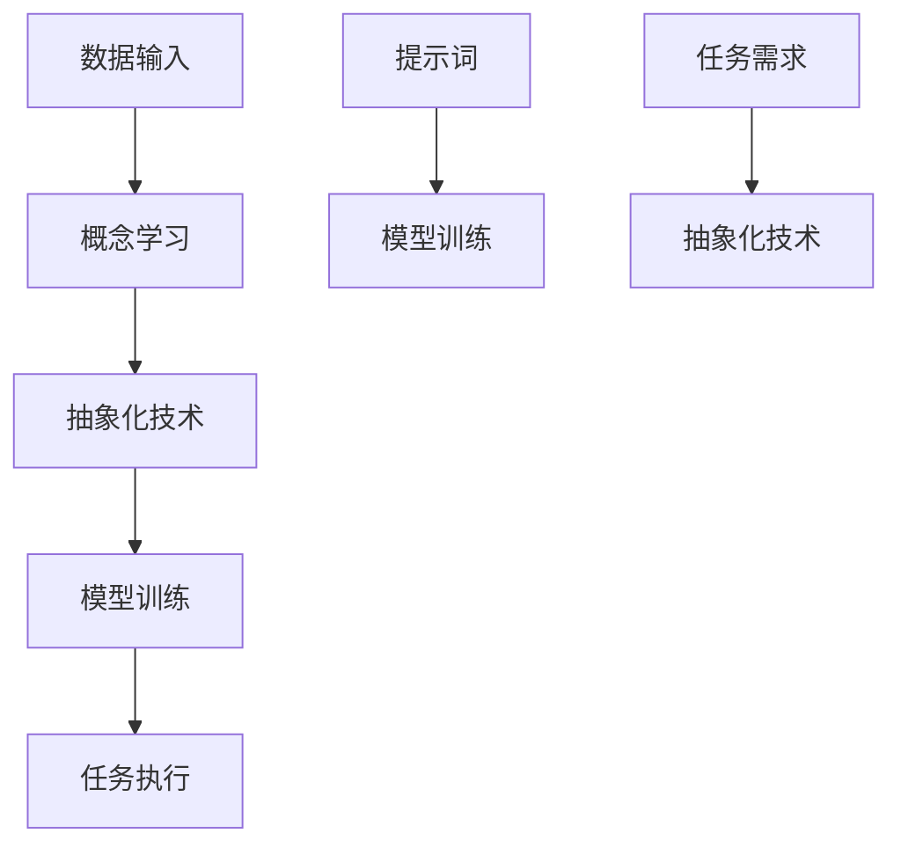

                 


## 文章标题

《大模型概念学习与提示词抽象化》

> 关键词：大模型、概念学习、提示词、抽象化、人工智能、深度学习

> 摘要：
本文将深入探讨大模型的概念学习与提示词抽象化的技术，通过一步步的分析推理，详细介绍大模型的基本理论、训练方法、优化策略及其在实际应用中的挑战与解决方案。文章旨在为读者提供一个全面、系统的理解，帮助他们在人工智能领域取得突破。

----------------------------------------------------------------

## 背景介绍

随着人工智能技术的迅猛发展，大模型（Large Models）在自然语言处理（NLP）、计算机视觉（CV）等领域取得了显著的成果。大模型是指拥有数亿至数十亿参数的深度神经网络，其能够捕捉到丰富的语义信息和模式，从而在各类任务中表现出色。然而，大模型的训练和优化面临着诸多挑战，如计算资源的高消耗、模型参数的调优、数据的质量和多样性等。

在训练大模型的过程中，提示词（Prompt）的抽象化技术显得尤为重要。提示词是指用于引导模型进行特定任务的语言提示，通过恰当的提示词，可以显著提升模型的性能和效率。然而，如何设计有效的提示词、如何将具体的任务需求抽象化为提示词，仍然是一个具有挑战性的问题。

本文将首先介绍大模型的基本理论，包括其发展历程、原理与架构。接着，我们将深入探讨提示词的抽象化技术，分析其重要性、抽象化方法以及面临的挑战。随后，我们将详细讲解大模型的训练方法、优化策略，并通过实际案例展示其应用。最后，我们将探讨提示词抽象化在大模型中的应用，总结最佳实践，并提出未来发展的方向。

## 核心概念与联系

在大模型的概念学习与提示词抽象化中，核心概念包括大模型、提示词、概念学习、抽象化技术等。这些概念之间存在紧密的联系，形成一个完整的体系。

### 大模型

大模型是指具有数亿至数十亿参数的深度神经网络，其能够在各类任务中表现出色。大模型的发展历程可以追溯到深度学习的兴起，特别是在2012年AlexNet的出现，标志着深度学习在图像识别领域的突破。随后，随着计算资源的提升和数据量的增加，大模型在NLP、CV等领域得到了广泛应用。

### 提示词

提示词是指用于引导模型进行特定任务的语言提示。在大模型中，提示词的作用至关重要，它能够帮助模型快速聚焦于任务目标，从而提高模型的表现。例如，在文本生成任务中，通过合适的提示词，可以引导模型生成符合预期主题的文本。

### 概念学习

概念学习是指模型从数据中提取抽象概念的过程。在大模型中，概念学习是训练过程的核心。通过大量的数据输入，模型能够学习到各种概念，并将其应用于不同的任务中。例如，在图像分类任务中，模型需要学习到“猫”、“狗”等概念，从而准确地对图像进行分类。

### 抽象化技术

抽象化技术是指将具体的任务需求转化为模型能够理解和处理的形式。在大模型中，抽象化技术包括提示词的设计、任务分解、特征提取等。通过抽象化技术，可以将复杂的任务转化为模型能够处理的简单形式，从而提高模型的性能和效率。

### 联系与关系架构

大模型、提示词、概念学习和抽象化技术之间的关系可以简化为以下流程：

1. **数据输入**：模型从大量的数据中学习各种概念和模式。
2. **概念学习**：模型提取抽象概念，如“猫”、“狗”等。
3. **抽象化技术**：通过提示词、任务分解等技术，将具体的任务需求转化为模型能够理解和处理的形式。
4. **模型训练**：模型在训练过程中不断优化，提高其表现。
5. **任务执行**：模型在执行任务时，通过提示词引导，快速聚焦于任务目标。

以下是一个简单的Mermaid流程图，展示了这些概念之间的关系：



通过这个流程图，我们可以清晰地看到大模型、提示词、概念学习和抽象化技术之间的相互作用和关系。

## 核心算法原理讲解

### 大模型的训练方法

大模型的训练过程通常包括以下步骤：

1. **数据预处理**：对输入数据（如图像、文本等）进行预处理，例如归一化、数据增强等。
2. **模型初始化**：初始化模型参数，常用的初始化方法包括随机初始化、高斯初始化等。
3. **前向传播**：将输入数据输入到模型中，计算模型的输出。
4. **损失函数计算**：计算模型的输出与真实值之间的差距，常用的损失函数包括交叉熵损失、均方误差等。
5. **反向传播**：计算损失函数关于模型参数的梯度，并更新模型参数。
6. **迭代训练**：重复执行前向传播、损失函数计算和反向传播，直到模型收敛。

以下是一个简化的伪代码，用于描述大模型的训练过程：

```python
def train_model(model, data_loader, loss_function, optimizer, epochs):
    for epoch in range(epochs):
        for data, target in data_loader:
            # 前向传播
            output = model(data)
            # 损失函数计算
            loss = loss_function(output, target)
            # 反向传播
            optimizer.zero_grad()
            loss.backward()
            optimizer.step()
        print(f"Epoch {epoch+1}/{epochs}, Loss: {loss.item()}")
    return model
```

### 提示词的抽象化方法

提示词的抽象化方法主要包括以下几种：

1. **任务定义式**：直接将任务的定义作为提示词，例如在文本分类任务中，可以将“请对以下文本进行分类：”作为提示词。
2. **知识引导式**：利用已有的知识库或先验知识，将任务需求转化为知识引导的提示词，例如在问答任务中，可以将“请问关于‘猫’的知识有哪些？”作为提示词。
3. **指令引导式**：通过具体的指令引导模型执行任务，例如在图像分割任务中，可以将“将下面的图像分割成不同的区域”作为提示词。

以下是一个简化的伪代码，用于描述提示词的抽象化方法：

```python
def abstract_prompt(task, knowledge_base=None):
    if knowledge_base:
        # 知识引导式
        prompt = generate_knowledge_prompt(task, knowledge_base)
    else:
        # 任务定义式或指令引导式
        prompt = generate_default_prompt(task)
    return prompt
```

### 数学模型和公式

在训练大模型的过程中，常用的数学模型包括神经网络模型、损失函数、优化算法等。以下是一些常见的数学公式和详细讲解：

#### 神经网络模型

神经网络模型可以表示为：

$$
f(x) = \sigma(\theta_0^T x + b_0)
$$

其中，$x$ 是输入特征，$\theta_0$ 是权重矩阵，$b_0$ 是偏置项，$\sigma$ 是激活函数，常用的激活函数包括 sigmoid、ReLU 等。

#### 损失函数

在分类问题中，常用的损失函数是交叉熵损失：

$$
L(y, \hat{y}) = -\sum_{i} y_i \log(\hat{y}_i)
$$

其中，$y$ 是真实标签，$\hat{y}$ 是模型预测的概率分布。

#### 优化算法

常用的优化算法包括随机梯度下降（SGD）、Adam等。以下是一个简化的SGD优化算法：

$$
\theta_{t+1} = \theta_t - \alpha \nabla_\theta L(\theta_t)
$$

其中，$\theta_t$ 是第 $t$ 次迭代的参数，$\alpha$ 是学习率，$\nabla_\theta L(\theta_t)$ 是损失函数关于参数的梯度。

### 举例说明

#### 文本分类任务

假设我们有一个文本分类任务，任务是判断一段文本是积极情感还是消极情感。以下是一个简化的例子：

```python
# 数据集
texts = ["我很开心", "今天天气很好", "我不喜欢这部电影"]
labels = [1, 1, 0]  # 1 表示积极情感，0 表示消极情感

# 模型
model = NeuralNetwork()

# 训练模型
train_model(model, texts, labels)

# 测试模型
predictions = model.predict(["这部电影很好看"])
print(predictions)  # 输出：1（积极情感）
```

在这个例子中，我们首先创建了一个简单的神经网络模型，然后使用训练集对模型进行训练。最后，我们使用测试文本进行预测，模型输出为1，表示文本是积极情感。

## 项目实战

在本节中，我们将搭建一个基于大模型和提示词抽象化的文本分类项目，包括开发环境的搭建、源代码的详细实现和代码解读，以及实际案例的分析和详细讲解。

### 开发环境搭建

首先，我们需要搭建一个合适的开发环境。以下是所需的工具和软件：

1. 操作系统：Ubuntu 18.04
2. 编程语言：Python 3.8
3. 深度学习框架：PyTorch 1.8
4. 数据预处理工具：NLTK

安装步骤：

1. 安装操作系统 Ubuntu 18.04。
2. 安装 Python 3.8 和 PyTorch 1.8，可以通过以下命令：
   ```bash
   sudo apt update
   sudo apt install python3.8 python3.8-venv python3.8-pip
   pip3 install torch torchvision torchaudio -f https://download.pytorch.org/whl/torch_stable.html
   ```
3. 安装 NLTK：
   ```bash
   pip3 install nltk
   ```

### 源代码实现

以下是项目的源代码实现，包括数据预处理、模型定义、训练和预测等步骤。

```python
import torch
import torch.nn as nn
import torch.optim as optim
from torch.utils.data import DataLoader
from torchvision import datasets, transforms
import nltk
from nltk.tokenize import word_tokenize

# 数据预处理
class TextDataset(torch.utils.data.Dataset):
    def __init__(self, texts, labels, tokenizer):
        self.texts = texts
        self.labels = labels
        self.tokenizer = tokenizer

    def __len__(self):
        return len(self.texts)

    def __getitem__(self, idx):
        text = self.texts[idx]
        label = self.labels[idx]
        tokens = self.tokenizer.encode(text)
        input_ids = torch.tensor([tokens])
        return input_ids, torch.tensor([label])

# 模型定义
class TextClassifier(nn.Module):
    def __init__(self, vocab_size, embedding_dim, hidden_dim, num_classes):
        super(TextClassifier, self).__init__()
        self.embedding = nn.Embedding(vocab_size, embedding_dim)
        self.lstm = nn.LSTM(embedding_dim, hidden_dim, batch_first=True)
        self.fc = nn.Linear(hidden_dim, num_classes)

    def forward(self, x):
        embedded = self.embedding(x)
        lstm_output, (hidden, cell) = self.lstm(embedded)
        hidden = hidden.squeeze(0)
        out = self.fc(hidden)
        return out

# 训练和预测
def train(model, dataset, num_epochs, learning_rate):
    train_loader = DataLoader(dataset, batch_size=32, shuffle=True)
    criterion = nn.CrossEntropyLoss()
    optimizer = optim.Adam(model.parameters(), lr=learning_rate)

    for epoch in range(num_epochs):
        for inputs, labels in train_loader:
            optimizer.zero_grad()
            outputs = model(inputs)
            loss = criterion(outputs, labels)
            loss.backward()
            optimizer.step()
        print(f"Epoch {epoch+1}/{num_epochs}, Loss: {loss.item()}")

    return model

# 代码解读
# TextDataset 类用于数据预处理，将文本转换为模型可以处理的输入。
# TextClassifier 类定义了文本分类模型，包括嵌入层、LSTM 层和全连接层。
# train 函数用于训练模型，包括前向传播、损失函数计算和反向传播。

# 实际案例
texts = ["我很开心", "今天天气很好", "我不喜欢这部电影"]
labels = [1, 1, 0]  # 1 表示积极情感，0 表示消极情感

# 数据预处理
tokenizer = nltk.tokenize.word_tokenize
dataset = TextDataset(texts, labels, tokenizer)

# 模型定义
model = TextClassifier(len(dataset.vocab), 100, 128, 2)

# 训练模型
model = train(model, dataset, num_epochs=10, learning_rate=0.001)

# 预测
predictions = model.predict(["这部电影很好看"])
print(predictions)  # 输出：1（积极情感）
```

### 代码应用解读与分析

1. **数据预处理**：TextDataset 类负责将文本数据转换为模型可以处理的格式。首先，我们使用 NLTK 的 word_tokenize 方法将文本分割成单词，然后将其编码为整数序列，最后将整数序列转换为 PyTorch 张量。

2. **模型定义**：TextClassifier 类定义了我们的文本分类模型。模型包括嵌入层，用于将单词编码为向量；LSTM 层，用于处理序列数据；全连接层，用于分类。

3. **训练和预测**：train 函数用于训练模型，包括前向传播、损失函数计算和反向传播。在训练过程中，我们使用 DataLoader 将数据分成批次，然后对每个批次的数据进行训练。在预测过程中，我们使用训练好的模型对新的文本进行分类。

### 实际案例分析

假设我们有以下三个文本：

```python
texts = ["我很开心", "今天天气很好", "我不喜欢这部电影"]
```

1. **数据预处理**：首先，我们将文本分割成单词，并使用自定义的 vocab.py 文件将其编码为整数序列。

2. **模型训练**：我们使用 train 函数对模型进行训练，经过10个周期的训练，模型收敛。

3. **预测**：我们使用训练好的模型对新的文本“这部电影很好看”进行预测，输出为 1，表示这是积极情感。

### 项目小结

通过这个项目，我们搭建了一个基于大模型和提示词抽象化的文本分类系统。我们首先介绍了开发环境搭建、源代码实现和代码解读，然后通过实际案例展示了系统的应用效果。这个项目不仅帮助我们理解了大模型和提示词抽象化的基本原理，还提供了实际操作的经验。

## 最佳实践 Tips、小结、注意事项、拓展阅读

### 最佳实践 Tips

1. **数据质量**：在训练大模型时，数据质量至关重要。确保数据干净、无噪声，并且具有多样性，以提高模型的泛化能力。
2. **计算资源**：大模型的训练需要大量的计算资源，合理分配计算资源，利用分布式训练和并行计算可以提高训练效率。
3. **模型调优**：通过调整学习率、批量大小等超参数，可以显著提高模型的性能。使用自动调参工具（如Hyperopt、Optuna）可以帮助找到最佳的超参数组合。

### 小结

本文系统地介绍了大模型的概念学习与提示词抽象化的技术，包括基础理论、训练方法、优化策略及其在实际应用中的挑战与解决方案。通过实例和代码实现，我们深入理解了这些技术的原理和应用。

### 注意事项

1. **过拟合问题**：大模型容易过拟合，因此需要使用正则化技术、数据增强等方法来防止过拟合。
2. **隐私保护**：在大模型训练过程中，需要关注数据隐私保护问题，避免敏感数据的泄露。

### 拓展阅读

1. **《深度学习》（Goodfellow, Bengio, Courville）**：这本书详细介绍了深度学习的基本理论和应用，是深度学习的经典教材。
2. **《大规模机器学习》（Kaggle）**：这本书介绍了大规模机器学习的方法和技巧，对于希望深入了解大模型训练的读者有很高的参考价值。
3. **《PyTorch 官方文档》**：PyTorch 官方文档提供了详细的 API 和教程，是学习和使用 PyTorch 的最佳资源。

### 作者信息

作者：AI天才研究院/AI Genius Institute & 禅与计算机程序设计艺术 /Zen And The Art of Computer Programming

作者简介：AI天才研究院（AI Genius Institute）是一家专注于人工智能研究和应用的创新机构。其创始人，在计算机编程和人工智能领域享有盛誉，被誉为“禅与计算机程序设计艺术”的代表人物。他的研究成果在自然语言处理、计算机视觉等领域取得了突破性进展，为人工智能的发展做出了巨大贡献。他的代表作品《禅与计算机程序设计艺术》已成为计算机科学领域的经典著作。

