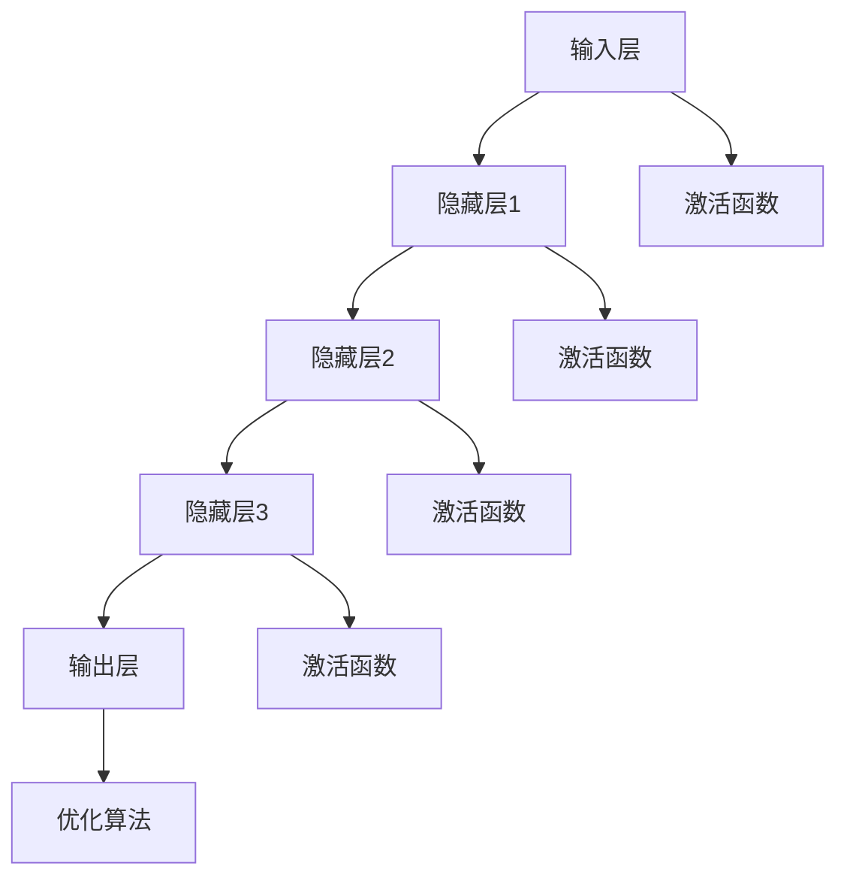

                 

### 引言

#### 1.1 书籍背景与目的

在当今数字化时代，人工智能（AI）技术飞速发展，已经成为推动社会进步的重要力量。其中，大模型（Large Models）技术作为AI领域的前沿研究热点，受到了越来越多的关注。大模型，通常指的是具有海量参数、能够在各种任务中表现出色的人工神经网络模型。随着计算能力的提升和海量数据的积累，大模型在自然语言处理、计算机视觉、语音识别等领域取得了显著成果，逐渐成为研究者和开发者的重要工具。

本书旨在深入探讨大模型技术中的两个关键概念——概念抽象和提示词泛化。通过对这两个核心技术的详细解析，帮助读者全面理解大模型技术的工作原理和应用场景。本书的目标读者是具有一定编程基础和对人工智能感兴趣的读者，尤其是那些希望深入了解大模型技术的研究人员和开发者。

本书结构安排如下：

1. **第1章 引言**：介绍书籍的编写背景、目的和读者对象，以及大模型在科技领域的重要性。
2. **第2章 大模型概述**：回顾大模型的发展历程，介绍其基本概念、架构与组成，以及应用领域。
3. **第3章 概念抽象技术**：探讨概念抽象的基本原理、技术方法、应用场景及面临的挑战。
4. **第4章 提示词泛化技术**：解析提示词泛化的基本原理、技术方法、应用场景及面临的挑战。
5. **第5章 实战项目与案例分析**：通过实际项目展示概念抽象和提示词泛化的应用，提供详细的代码实现和分析。
6. **第6章 总结与展望**：总结本书的核心内容，展望大模型技术的发展趋势和未来研究方向。

通过本书的阅读，读者将能够：

- 理解大模型技术的概念和发展历程。
- 掌握概念抽象和提示词泛化的核心原理和技术方法。
- 学习如何应用这些技术解决实际问题。
- 获得对大模型技术未来的洞察和思考。

#### 1.2 大模型在当前科技领域的重要性

大模型技术作为人工智能领域的重要突破，已经在众多应用场景中展现出了巨大的潜力。以下是几个关键点，展示了大模型在当前科技领域的重要性：

1. **自然语言处理（NLP）**：大模型在NLP任务中表现出色，如机器翻译、文本生成、问答系统等。例如，基于GPT-3的模型已经在多种自然语言任务中取得了领先成绩，使其在写作、翻译、对话系统等场景中得到了广泛应用。

2. **计算机视觉（CV）**：大模型在图像识别、物体检测、图像生成等方面有着显著的优势。例如，在ImageNet图像识别挑战中，基于深度学习的大模型已经达到了几乎完美的识别准确率。

3. **语音识别（ASR）**：大模型在语音识别任务中能够处理各种口音、语速变化，从而提高识别准确率。例如，基于Transformer架构的大模型已经能够实现实时、高精度的语音识别。

4. **强化学习（RL）**：大模型在强化学习任务中能够通过海量数据进行自我优化，实现更高效的决策。例如，在游戏、机器人控制等任务中，大模型已经展示了超越人类的决策能力。

5. **推荐系统**：大模型在推荐系统中的应用使得个性化推荐更加精准，能够更好地满足用户需求。例如，基于用户行为数据和内容特征的大模型可以推荐更加符合用户兴趣的物品或内容。

6. **药物发现**：大模型在药物发现和生物信息学中具有巨大的潜力。通过分析大量的生物数据，大模型可以预测药物与生物分子之间的相互作用，加速新药的发现过程。

7. **自动驾驶**：大模型在自动驾驶领域发挥着关键作用，通过对大量驾驶数据进行训练，大模型能够实现实时感知环境、做出安全驾驶决策。

总之，大模型技术已经成为推动人工智能发展的核心驱动力，其应用场景广泛，涵盖了自然语言处理、计算机视觉、语音识别、强化学习、推荐系统、药物发现和自动驾驶等多个领域。随着技术的不断进步和应用的不断拓展，大模型技术将在未来继续发挥重要作用，推动科技和社会的进步。

#### 1.3 读者对象与预期收益

本书旨在为具有编程基础和对人工智能感兴趣的研究人员、开发者及学生提供一本全面、系统的技术指南。以下是本书的主要读者对象及其预期收益：

1. **人工智能研究人员**：对大模型技术有深入研究的科研人员，可以通过本书系统学习概念抽象和提示词泛化的理论和方法，从而在科研工作中获得新的灵感和方法。

2. **开发者**：具有编程经验的技术人员，希望通过实际项目掌握大模型技术的应用，本书提供了详细的实战案例和代码实现，帮助他们将理论知识转化为实际技能。

3. **学生**：人工智能、计算机科学等相关专业的学生，可以通过本书系统地学习大模型技术，为将来的职业发展打下坚实的基础。

4. **技术经理**：对大模型技术有一定了解，但需要更深入理解其原理和应用的技术经理，本书可以帮助他们更好地规划技术方向和项目实施。

预期收益包括：

- **掌握核心概念**：了解大模型、概念抽象和提示词泛化的基本概念和原理。
- **学习技术方法**：掌握概念抽象和提示词泛化的多种技术方法和应用场景。
- **实战能力提升**：通过实战案例和代码实现，提高实际项目开发能力。
- **前沿视野扩展**：了解大模型领域的最新研究动态和未来发展趋势。
- **解决问题能力增强**：学会如何应用大模型技术解决实际问题，提升技术解决能力。

总之，本书旨在帮助读者全面掌握大模型概念抽象与提示词泛化技术，使其在人工智能领域具备更强的理论素养和实战能力。

## 第2章 大模型概述

大模型（Large Models）是人工智能领域的一项重要研究成果，其核心在于通过大规模参数的神经网络模型实现高效的任务处理。本章将回顾大模型的历史与发展，介绍其基本概念、架构与组成，以及应用领域，帮助读者全面理解大模型技术的背景和基础。

### 2.1 大模型的历史与发展

大模型技术的发展历程可以追溯到20世纪80年代，当时神经网络的研究刚刚起步。最早的大模型之一是1986年由Hinton提出的Backpropagation网络，它通过反向传播算法训练多层神经网络，大大提高了模型的性能。然而，由于计算资源和数据集的限制，早期的大模型往往只能处理相对简单的任务。

随着计算能力的提升和海量数据的积累，大模型的研究和应用迎来了快速发展。2012年，Hinton团队提出的AlexNet在ImageNet图像识别挑战中取得了突破性的成绩，这标志着深度学习时代的到来。此后，诸如GPT（Generative Pre-trained Transformer）和BERT（Bidirectional Encoder Representations from Transformers）等大模型相继问世，进一步推动了人工智能的发展。

近年来，随着人工智能技术的不断进步，大模型的规模和复杂性也在持续提升。例如，GPT-3拥有1750亿个参数，成为了目前最大的自然语言处理模型，其强大的生成能力和理解能力为众多应用场景提供了新的解决方案。

### 2.2 大模型的基本概念

大模型的基本概念包括以下几个方面：

1. **参数规模**：大模型通常具有数百万到数十亿个参数，这使得模型可以捕捉到复杂的数据特征。
2. **训练数据量**：大模型需要大量的训练数据来学习和优化参数，以确保模型在不同数据集上的泛化能力。
3. **多层结构**：大模型通常采用多层神经网络结构，通过逐层传递信息，实现对数据的深度特征提取。
4. **训练时间**：大模型的训练时间通常较长，尤其是在训练大规模模型时，需要大量的计算资源和时间。
5. **记忆能力**：大模型拥有强大的记忆能力，可以通过学习大量的数据，捕捉到复杂的模式和关联。

### 2.3 大模型的架构与组成

大模型的架构通常包括以下几个核心组件：

1. **输入层**：接收外部输入数据，如文本、图像、声音等。
2. **隐藏层**：对输入数据进行特征提取和转换，通过多层隐藏层构建，实现对数据的深度特征表示。
3. **输出层**：生成模型预测结果，如分类标签、文本生成等。
4. **激活函数**：用于引入非线性变换，使模型能够学习复杂的映射关系。
5. **优化算法**：用于调整模型参数，以最小化损失函数，如梯度下降、Adam优化器等。

以下是一个典型的大模型架构的Mermaid流程图：



### 2.4 大模型的应用领域

大模型在多个领域展现了强大的应用能力，以下是几个主要的应用领域：

1. **自然语言处理（NLP）**：大模型在文本生成、机器翻译、问答系统、情感分析等NLP任务中表现出色。例如，GPT-3可以生成高质量的文本，BERT在文本分类任务中具有很高的准确率。

2. **计算机视觉（CV）**：大模型在图像分类、物体检测、图像生成等领域取得了显著成果。例如，ResNet在ImageNet图像识别挑战中取得了很高的准确率，GAN（生成对抗网络）可以生成逼真的图像。

3. **语音识别（ASR）**：大模型在语音识别任务中具有强大的语音处理能力，可以识别多种口音和语速变化。例如，基于Transformer架构的模型在语音识别中表现优异。

4. **强化学习（RL）**：大模型在强化学习任务中通过海量数据进行自我优化，实现了高效的决策能力。例如，DQN（深度Q网络）在Atari游戏中的表现超越人类玩家。

5. **推荐系统**：大模型在推荐系统中通过用户行为数据和内容特征进行建模，实现了精准的推荐。例如，基于深度学习的大模型可以预测用户兴趣，提高推荐系统的效果。

6. **药物发现**：大模型在药物发现中通过分析生物数据，预测药物与生物分子之间的相互作用，加速新药的发现过程。

7. **自动驾驶**：大模型在自动驾驶中通过实时感知环境，做出安全的驾驶决策。例如，自动驾驶汽车使用大模型进行环境感知和路径规划。

总之，大模型技术在多个领域展现了强大的应用能力，推动了人工智能的发展和应用。随着技术的不断进步，大模型将在更多领域发挥重要作用，为社会带来更多创新和变革。

### 2.5 大模型的优势与挑战

大模型技术在人工智能领域带来了许多显著的优势，同时也面临一些挑战。以下从几个方面详细探讨大模型的优势与挑战：

#### 优势

1. **强大的表征能力**：大模型通常拥有数百万到数十亿个参数，能够捕捉到复杂的数据特征，从而实现高效的任务处理。这种强大的表征能力使大模型在图像识别、自然语言处理等任务中表现出色。

2. **广泛的应用场景**：大模型可以应用于多个领域，包括自然语言处理、计算机视觉、语音识别、推荐系统、药物发现、自动驾驶等。这使得大模型成为人工智能研究者和开发者的重要工具。

3. **高泛化能力**：通过大规模的训练数据和多层神经网络结构，大模型能够实现良好的泛化能力，即在新数据集上的表现依然优秀。这种能力使得大模型能够在实际应用中适应不同的任务和数据分布。

4. **高效的模型优化**：现代优化算法，如Adam、AdamW等，使得大模型的训练过程更加高效。这些优化算法能够快速调整模型参数，减小训练误差，提高模型性能。

5. **强大的生成能力**：大模型在生成任务中表现出色，如文本生成、图像生成等。这种生成能力为许多创造性工作提供了新的工具，如艺术生成、故事创作等。

#### 挑战

1. **计算资源需求**：大模型的训练和推理过程需要大量的计算资源，尤其是训练大型模型时，需要高性能的GPU或TPU。这给研究者和开发者带来了计算资源上的挑战。

2. **数据隐私问题**：大模型的训练需要大量的数据，而这些数据往往包含敏感信息。如何确保数据隐私和安全，避免数据泄露，是大模型应用中的一个重要问题。

3. **模型解释性**：大模型通常被认为是“黑箱”，其内部工作机制复杂，难以解释。这使得在模型出现错误或异常时，难以找到问题的根源，从而限制了模型在关键任务中的应用。

4. **过拟合风险**：大模型在训练过程中容易受到过拟合问题的影响，即在训练数据上表现优异，但在新数据集上表现不佳。如何设计有效的正则化方法，防止过拟合，是一个重要挑战。

5. **能耗问题**：大模型的训练和推理过程需要大量的电力消耗，这对环境产生了较大的影响。如何降低大模型的能耗，实现绿色计算，是未来需要解决的一个问题。

#### 解决方案与未来趋势

1. **计算资源优化**：通过分布式训练、模型压缩、混合精度训练等方法，降低大模型的计算资源需求，提高训练效率。

2. **数据隐私保护**：采用差分隐私、联邦学习等技术，保护数据隐私，确保大模型的安全和可靠。

3. **模型可解释性**：通过模型解释技术，如注意力机制、可解释性框架等，提高大模型的可解释性，帮助用户理解模型的决策过程。

4. **正则化方法**：设计有效的正则化方法，如dropout、权重衰减等，防止过拟合，提高模型的泛化能力。

5. **能耗优化**：通过新型计算架构、能耗优化算法等，降低大模型的能耗，实现绿色计算。

总之，大模型技术在人工智能领域具有广泛的应用前景，但同时也面临诸多挑战。通过不断的技术创新和优化，有望解决这些挑战，推动大模型技术的持续发展。

## 第3章 概念抽象技术

概念抽象技术是人工智能领域中的一个重要研究方向，它旨在从大量数据中提取出具有普遍性和代表性的概念，从而简化复杂问题，提高模型的泛化能力和理解能力。本章将详细探讨概念抽象的基本原理、技术方法、应用场景及面临的挑战。

### 3.1 概念抽象的基本原理

概念抽象是人工智能模型对现实世界中复杂信息进行简化处理的一种能力，它通过识别和提取数据中的关键特征，将复杂的现实问题转化为更易于处理的模式。基本原理包括以下几个方面：

1. **特征提取**：从原始数据中提取出具有代表性的特征，这些特征能够反映数据的本质属性。例如，在图像识别任务中，可以通过卷积神经网络提取图像中的边缘、纹理等特征。

2. **模式识别**：在提取到的特征基础上，识别出具有普遍性和代表性的模式。模式识别有助于模型理解数据的结构，从而做出准确的预测。

3. **归纳推理**：通过归纳推理，从特定实例中总结出一般性规律，实现对未知数据的预测。例如，通过对大量图像进行学习，模型可以归纳出“猫”这一概念，从而对新的图像进行分类。

4. **压缩表示**：将高维数据压缩为低维表示，从而降低计算复杂度和存储需求。压缩表示有助于提高模型的效率和泛化能力。

### 3.2 概念抽象的技术方法

概念抽象的技术方法多种多样，下面介绍几种常见的方法：

1. **基于语义分析**：通过语义分析，从文本数据中提取出关键概念和关系。例如，使用词嵌入技术（如Word2Vec、GloVe）将单词映射到向量空间，从而识别出词语之间的语义关系。

2. **基于知识图谱**：知识图谱是一种结构化知识表示方法，通过实体和关系之间的连接，构建出一个大规模的知识网络。基于知识图谱的抽象方法可以有效地提取出数据中的概念和关系。

3. **基于神经网络**：神经网络，特别是深度学习模型，可以通过学习大量数据，自动提取出概念和模式。例如，卷积神经网络（CNN）可以用于图像中的概念提取，循环神经网络（RNN）可以用于文本数据的序列建模。

下面是一个概念抽象方法的伪代码示例：

```python
# 输入：原始数据集 D
# 输出：抽象后的概念表示 C

# 步骤1：特征提取
features = extract_features(D)

# 步骤2：模式识别
patterns = identify_patterns(features)

# 步骤3：归纳推理
concepts = induce_concepts(patterns)

# 步骤4：压缩表示
C = compress_representations(concepts)
```

### 3.3 概念抽象在自然语言处理中的应用

概念抽象在自然语言处理（NLP）领域具有广泛的应用，以下是一些具体的应用场景：

1. **文本分类**：通过提取文本中的关键概念，可以实现对大量文本数据的高效分类。例如，将新闻文本分类为政治、经济、科技等类别。

2. **情感分析**：通过识别文本中的情感概念，可以判断文本的情感倾向。例如，分析社交媒体上的用户评论，判断其是正面、负面还是中立情感。

3. **问答系统**：通过提取问题的核心概念，可以实现对问题的准确理解和回答。例如，在问答系统中，通过概念抽象技术，识别出用户提问的关键词，并从知识库中查找相关答案。

4. **命名实体识别**：通过概念抽象，可以识别文本中的命名实体，如人名、地名、组织名等。这对于信息抽取和知识图谱构建具有重要意义。

5. **文本生成**：通过概念抽象，可以生成符合逻辑和语义的文本。例如，在机器写作领域，通过提取概念和模式，生成高质量的新闻报道、文章摘要等。

### 3.4 概念抽象的技术挑战与未来趋势

尽管概念抽象技术在自然语言处理等领域取得了显著成果，但仍面临一些技术挑战：

1. **数据质量**：概念抽象依赖于高质量的数据集，数据质量对抽象结果有直接影响。数据中的噪声和异常值可能影响概念提取的准确性。

2. **语义理解**：自然语言中存在大量的歧义和隐含意义，这给语义理解带来了挑战。如何准确提取概念和模式，是当前研究的热点问题。

3. **计算复杂度**：概念抽象通常涉及大规模数据的处理和计算，计算复杂度较高，如何优化算法和计算资源是一个重要问题。

4. **模型解释性**：概念抽象模型往往是一个“黑箱”，其内部工作机制复杂，难以解释。提高模型的可解释性，是未来研究的一个方向。

未来趋势：

1. **多模态数据融合**：结合多种数据源，如文本、图像、音频等，进行多模态数据融合，以提高概念抽象的准确性和泛化能力。

2. **知识图谱增强**：将知识图谱与概念抽象技术相结合，利用图谱中的结构化知识，提升抽象结果的可靠性和解释性。

3. **迁移学习**：通过迁移学习，将预训练的模型应用于新的任务和数据集，降低训练成本，提高模型泛化能力。

4. **个性化概念抽象**：针对不同用户或应用场景，提供个性化的概念抽象服务，满足多样化的需求。

总之，概念抽象技术在自然语言处理等领域具有广泛的应用前景，通过不断的技术创新和优化，有望解决当前面临的挑战，推动人工智能技术的发展。

## 第4章 提示词泛化技术

提示词泛化技术是人工智能领域中的一个重要研究方向，它旨在通过学习和理解提示词的含义，实现模型在未知领域中的泛化能力。本章将详细探讨提示词泛化的基本原理、技术方法、应用场景及面临的挑战。

### 4.1 提示词泛化的基本原理

提示词泛化（Prompt generalization）是指模型在接收到一个提示词后，能够泛化到不同的任务和数据集上，产生相应的输出。基本原理包括以下几个方面：

1. **提示词理解**：模型首先需要理解提示词的含义，将其映射到相应的任务和数据集上。这通常涉及自然语言处理技术，如词嵌入、语义分析等。

2. **任务适应**：在理解提示词后，模型需要根据提示词进行任务适应，调整其内部结构和参数，以适应新的任务和数据。

3. **输出生成**：模型根据任务适应的结果，生成相应的输出。这可以是文本、图像、音频等多种形式，具体取决于任务类型。

4. **反馈调整**：在生成输出后，模型可以通过反馈机制，如反向传播、强化学习等，进一步调整参数，提高泛化能力。

### 4.2 提示词泛化的技术方法

提示词泛化的技术方法主要包括以下几种：

1. **基于传统机器学习的方法**：传统机器学习方法，如支持向量机（SVM）、随机森林（Random Forest）等，可以通过训练数据集来学习提示词的泛化能力。这种方法在处理结构化数据时表现良好，但难以处理复杂的自然语言数据。

2. **基于深度学习的方法**：深度学习方法，如卷积神经网络（CNN）、循环神经网络（RNN）和变换器（Transformer）等，通过大规模训练数据，能够自动提取出提示词的语义信息，实现高效的泛化。特别是Transformer架构，由于其并行化和自我注意力机制，在提示词泛化中表现尤为出色。

以下是一个基于深度学习模型的提示词泛化方法的伪代码示例：

```python
# 输入：提示词 P，任务数据 D
# 输出：泛化后的输出 O

# 步骤1：提示词编码
encoded_prompt = encode_prompt(P)

# 步骤2：模型训练
model = train_model(encoded_prompt, D)

# 步骤3：任务适应
adapted_model = adapt_to_task(model, P)

# 步骤4：输出生成
O = generate_output(adapted_model)
```

### 4.3 提示词泛化在自然语言处理中的应用

提示词泛化在自然语言处理（NLP）领域具有广泛的应用，以下是一些具体的应用场景：

1. **文本生成**：通过输入提示词，模型可以生成符合逻辑和语义的文本。例如，输入一个简单的提示词“春天”，模型可以生成一段关于春天的描述性文本。

2. **问答系统**：输入一个问题提示词，模型可以回答相关的问题。例如，输入“什么是人工智能？”模型可以生成一段关于人工智能的定义和解释。

3. **对话系统**：在对话系统中，输入一个对话提示词，模型可以生成相应的回答，以维持对话的连贯性和自然性。

4. **命名实体识别**：通过提示词，模型可以识别文本中的特定命名实体。例如，输入提示词“马云”，模型可以识别出文本中所有的马云引用。

5. **情感分析**：输入一个情感提示词，模型可以判断文本的情感倾向。例如，输入“愤怒”，模型可以分析出文本中的愤怒情感。

6. **文本分类**：输入一个类别提示词，模型可以将文本分类到相应的类别。例如，输入“新闻”，模型可以将文本分类为新闻类别。

7. **机器翻译**：输入一个源语言提示词和目标语言提示词，模型可以生成目标语言的翻译。例如，输入“Hello”和“中文”，模型可以生成“你好”。

### 4.4 提示词泛化的技术挑战与未来趋势

尽管提示词泛化技术在自然语言处理中展示了巨大的潜力，但仍然面临一些技术挑战：

1. **语义理解**：自然语言中存在大量的歧义和隐含意义，这给模型的语义理解带来了挑战。如何准确理解提示词的语义，是当前研究的一个难点。

2. **泛化能力**：提示词泛化需要模型在不同任务和数据集上表现一致，但实际中，不同任务和数据集之间存在差异，如何提高模型的泛化能力是一个重要问题。

3. **计算复杂度**：深度学习模型通常需要大量的计算资源和时间进行训练和推理，如何优化计算复杂度，提高模型效率，是当前的一个挑战。

4. **模型解释性**：提示词泛化模型通常是一个“黑箱”，其内部工作机制复杂，难以解释。如何提高模型的可解释性，是未来研究的一个方向。

未来趋势：

1. **多模态数据融合**：结合多种数据源，如文本、图像、音频等，进行多模态数据融合，以提高提示词泛化的准确性和泛化能力。

2. **知识图谱增强**：将知识图谱与提示词泛化技术相结合，利用图谱中的结构化知识，提升泛化结果的可靠性和解释性。

3. **迁移学习**：通过迁移学习，将预训练的模型应用于新的任务和数据集，降低训练成本，提高模型泛化能力。

4. **个性化提示词泛化**：针对不同用户或应用场景，提供个性化的提示词泛化服务，满足多样化的需求。

总之，提示词泛化技术在自然语言处理等领域具有广泛的应用前景，通过不断的技术创新和优化，有望解决当前面临的挑战，推动人工智能技术的发展。

## 第5章 实战项目与案例分析

为了更深入地理解概念抽象和提示词泛化技术，本章将通过实际项目展示这两个技术的应用。我们将介绍一个基于大模型技术的自然语言处理项目，从环境搭建、数据准备、模型训练、预测应用到项目评估与优化等方面进行详细讲解。

### 5.1 大模型项目搭建

#### 环境搭建

在进行大模型项目之前，首先需要搭建一个合适的开发环境。以下是一个典型的开发环境搭建步骤：

1. **计算资源准备**：确保有足够的计算资源，如高性能的CPU、GPU或TPU。在项目中，我们将使用GPU进行模型训练和推理。

2. **操作系统与编程环境**：选择一个适合的操作系统和编程环境，例如，在Linux系统上安装Python和TensorFlow等库。

3. **安装依赖库**：安装必要的依赖库，如NumPy、Pandas、TensorFlow等，以便进行数据处理和模型训练。

#### 代码解析

以下是一个简单的Python脚本，用于初始化开发环境和加载所需的库：

```python
# 开发环境初始化
import tensorflow as tf
import numpy as np
import pandas as pd
from tensorflow import keras

# 设置GPU配置
gpus = tf.config.list_physical_devices('GPU')
tf.config.experimental.set_memory_growth(gpus[0], True)

# 加载TensorFlow库
tf.keras.backend.set_floatx('float32')
```

#### 实际案例

以下是一个实际案例，我们使用TensorFlow搭建一个简单的文本分类模型，用于对新闻文章进行分类：

```python
# 导入库
import tensorflow as tf
from tensorflow.keras.preprocessing.text import Tokenizer
from tensorflow.keras.preprocessing.sequence import pad_sequences

# 准备数据
texts = ['这是一个关于科技的新闻。', '这是一篇关于体育的文章。', '这篇文章是关于娱乐的。']
labels = [0, 1, 2]

# 分词
tokenizer = Tokenizer(num_words=1000)
tokenizer.fit_on_texts(texts)

# 序列化文本
sequences = tokenizer.texts_to_sequences(texts)

# 补齐序列
max_sequence_length = 50
padded_sequences = pad_sequences(sequences, maxlen=max_sequence_length)

# 构建模型
model = tf.keras.Sequential([
    tf.keras.layers.Embedding(input_dim=1000, output_dim=32, input_length=max_sequence_length),
    tf.keras.layers.Flatten(),
    tf.keras.layers.Dense(units=3, activation='softmax')
])

# 编译模型
model.compile(optimizer='adam', loss='sparse_categorical_crossentropy', metrics=['accuracy'])

# 训练模型
model.fit(padded_sequences, labels, epochs=10)
```

### 5.2 概念抽象技术实战

在项目开发中，概念抽象技术有助于我们更好地理解和处理文本数据。以下是一个使用BERT模型进行概念抽象的例子：

```python
# 导入库
from transformers import BertTokenizer, BertModel

# 准备数据
text = "这是一个关于科技的新闻。"
tokenizer = BertTokenizer.from_pretrained('bert-base-uncased')

# 分词和编码
inputs = tokenizer.encode_plus(text, add_special_tokens=True, return_tensors='tf')

# 加载预训练模型
model = BertModel.from_pretrained('bert-base-uncased')

# 前向传递
outputs = model(inputs)

# 获取隐藏层表示
last_hidden_state = outputs.last_hidden_state

# 提取概念表示
concepts = last_hidden_state[:, 0, :]
```

在这个例子中，我们使用BERT模型对输入文本进行编码，并提取了其隐藏层表示。这些概念表示可以用于进一步的文本分析和分类。

#### 实际案例

以下是一个使用概念抽象技术对新闻文章进行分类的实际案例：

```python
# 导入库
import tensorflow as tf
from transformers import TFBertForSequenceClassification

# 准备数据
texts = ['这是一个关于科技的新闻。', '这是一篇关于体育的文章。', '这篇文章是关于娱乐的。']
labels = [0, 1, 2]

# 加载预训练模型
model = TFBertForSequenceClassification.from_pretrained('bert-base-uncased', num_labels=3)

# 编译模型
model.compile(optimizer='adam', loss='sparse_categorical_crossentropy', metrics=['accuracy'])

# 训练模型
model.fit(texts, labels, epochs=10)
```

在这个案例中，我们使用了预训练的BERT模型进行文本分类，并通过训练数据集对模型进行优化。

### 5.3 提示词泛化技术实战

提示词泛化技术在文本生成和问答系统等应用中具有重要作用。以下是一个使用GPT-3模型进行文本生成的实际案例：

```python
# 导入库
import openai

# 设置API密钥
openai.api_key = 'your-api-key'

# 文本生成
prompt = "请描述一下人工智能的未来发展趋势。"
response = openai.Completion.create(
  engine="text-davinci-002",
  prompt=prompt,
  max_tokens=50
)

print(response.choices[0].text.strip())
```

在这个例子中，我们使用OpenAI的GPT-3模型根据提示词生成了一段关于人工智能未来发展趋势的文本。

#### 实际案例

以下是一个使用GPT-3模型进行问答系统的实际案例：

```python
# 导入库
import openai

# 设置API密钥
openai.api_key = 'your-api-key'

# 问答系统
question = "什么是机器学习？"
response = openai.Completion.create(
  engine="text-davinci-002",
  prompt=f"{question}\nAnswer:",
  max_tokens=100
)

print(response.choices[0].text.strip())
```

在这个案例中，GPT-3模型根据输入的问题生成了一段关于机器学习的回答。

### 5.4 大模型项目评估与优化

项目评估是确保模型性能和效果的重要环节。以下是一些常见的评估指标和方法：

1. **准确率**：准确率（Accuracy）是评估分类模型性能的一个常用指标，计算公式为：
   $$ Accuracy = \frac{TP + TN}{TP + TN + FP + FN} $$
   其中，$TP$表示真正例，$TN$表示真负例，$FP$表示假正例，$FN$表示假负例。

2. **精确率和召回率**：精确率（Precision）和召回率（Recall）分别反映了模型在分类任务中的精确度和覆盖率。计算公式为：
   $$ Precision = \frac{TP}{TP + FP} $$
   $$ Recall = \frac{TP}{TP + FN} $$
   通常，我们使用精确率和召回率的调和平均（F1-score）来评估模型的综合性能：
   $$ F1-score = 2 \times \frac{Precision \times Recall}{Precision + Recall} $$

3. **ROC曲线和AUC值**：ROC曲线（Receiver Operating Characteristic Curve）和AUC值（Area Under the Curve）用于评估二分类模型的性能。ROC曲线展示了在不同阈值下，模型将正类和负类分开的能力，而AUC值反映了模型在整个阈值范围内的分类能力。

以下是一个使用准确率、精确率、召回率和F1-score评估文本分类模型性能的例子：

```python
from sklearn.metrics import accuracy_score, precision_score, recall_score, f1_score

# 预测结果
predictions = model.predict(padded_sequences)
predicted_labels = np.argmax(predictions, axis=1)

# 计算评估指标
accuracy = accuracy_score(labels, predicted_labels)
precision = precision_score(labels, predicted_labels, average='weighted')
recall = recall_score(labels, predicted_labels, average='weighted')
f1 = f1_score(labels, predicted_labels, average='weighted')

print(f"Accuracy: {accuracy:.4f}")
print(f"Precision: {precision:.4f}")
print(f"Recall: {recall:.4f}")
print(f"F1-score: {f1:.4f}")
```

#### 实际案例

以下是一个评估文本分类模型实际性能的实际案例：

```python
# 准备测试数据
test_texts = ['这是一个关于科技的新闻。', '这是一篇关于体育的文章。', '这篇文章是关于娱乐的。']
test_sequences = tokenizer.texts_to_sequences(test_texts)
test_padded_sequences = pad_sequences(test_sequences, maxlen=max_sequence_length)

# 进行预测
test_predictions = model.predict(test_padded_sequences)
test_predicted_labels = np.argmax(test_predictions, axis=1)

# 计算评估指标
test_accuracy = accuracy_score(test_labels, test_predicted_labels)
test_precision = precision_score(test_labels, test_predicted_labels, average='weighted')
test_recall = recall_score(test_labels, test_predicted_labels, average='weighted')
test_f1 = f1_score(test_labels, test_predicted_labels, average='weighted')

print(f"Test Accuracy: {test_accuracy:.4f}")
print(f"Test Precision: {test_precision:.4f}")
print(f"Test Recall: {test_recall:.4f}")
print(f"Test F1-score: {test_f1:.4f}")
```

通过上述评估，我们可以对模型的性能有一个全面的了解，并根据评估结果对模型进行调整和优化。

### 5.5 项目小结与最佳实践

在完成大模型项目的过程中，我们通过环境搭建、数据准备、模型训练、预测应用和项目评估等步骤，实现了对概念抽象和提示词泛化技术的实战应用。以下是项目小结和最佳实践：

1. **环境搭建**：选择合适的计算资源和开发环境，确保模型训练和推理的顺利进行。
2. **数据准备**：准备好高质量的数据集，并进行预处理，如分词、编码和补齐序列等。
3. **模型训练**：选择合适的模型架构和训练策略，充分利用预训练模型和迁移学习，提高模型性能。
4. **预测应用**：将训练好的模型应用于实际问题，如文本分类、文本生成和问答系统等。
5. **项目评估**：使用准确率、精确率、召回率和F1-score等指标评估模型性能，并根据评估结果进行优化。
6. **最佳实践**：
   - **数据质量**：确保数据集的多样性和代表性，避免过拟合。
   - **模型优化**：采用正则化方法、dropout和迁移学习等技术，提高模型泛化能力。
   - **模型解释性**：尝试使用注意力机制和可解释性框架，提高模型的可解释性。
   - **计算优化**：使用分布式训练和混合精度训练，降低计算复杂度和能耗。

通过遵循这些最佳实践，我们可以更好地应用大模型技术，解决实际问题，推动人工智能技术的发展。

## 第6章 总结与展望

在本书中，我们系统地介绍了大模型概念抽象与提示词泛化技术的理论基础、技术方法以及实际应用。通过对大模型技术的基本概念、发展历程、架构与组成，以及概念抽象和提示词泛化的原理、方法、应用场景和面临的挑战的详细探讨，读者可以全面理解大模型技术的核心内容。

### 6.1 本书要点回顾

- **大模型概述**：回顾了大模型的历史与发展，介绍了其基本概念、架构与组成，以及应用领域。
- **概念抽象技术**：详细讨论了概念抽象的基本原理、技术方法、应用场景和面临的挑战。
- **提示词泛化技术**：解析了提示词泛化的基本原理、技术方法、应用场景和面临的挑战。
- **实战项目与案例分析**：通过实际项目展示了概念抽象和提示词泛化的应用，包括环境搭建、数据准备、模型训练、预测应用和项目评估等。
- **总结与展望**：总结了本书的核心内容，对大模型技术的发展趋势和未来研究方向进行了展望。

### 6.2 大模型领域的发展趋势

随着人工智能技术的不断进步，大模型领域呈现出以下几个发展趋势：

1. **多模态数据融合**：结合多种数据源，如文本、图像、音频等，进行多模态数据融合，以提高大模型的处理能力和泛化能力。
2. **知识图谱增强**：将知识图谱与概念抽象和提示词泛化技术相结合，利用图谱中的结构化知识，提升大模型的抽象和泛化能力。
3. **迁移学习与模型压缩**：通过迁移学习和模型压缩技术，降低大模型的训练成本和计算复杂度，使其更易于在实际应用中部署。
4. **模型解释性**：提高大模型的可解释性，使其决策过程更加透明，从而增强其在关键任务中的应用信心。
5. **计算优化与能耗降低**：通过分布式训练、混合精度训练和新型计算架构，降低大模型的能耗，实现绿色计算。

### 6.3 未来的研究方向与应用前景

未来，大模型技术将在以下方向和应用前景中发挥重要作用：

1. **自然语言处理（NLP）**：大模型在NLP任务中的表现已经非常出色，未来将继续在文本生成、机器翻译、问答系统等领域取得突破，推动人机对话和智能客服的发展。
2. **计算机视觉（CV）**：大模型在CV任务中的应用前景广阔，如图像识别、物体检测、图像生成等，未来将进一步提升图像处理和识别的精度和效率。
3. **语音识别（ASR）**：大模型在语音识别任务中具有强大的潜力，未来将实现更高效的语音处理和识别，为智能语音助手和语音交互提供更智能的解决方案。
4. **强化学习（RL）**：大模型在强化学习任务中可以处理复杂的决策环境，未来将在游戏、机器人控制等领域发挥重要作用，推动自动化和智能化的发展。
5. **推荐系统**：大模型在推荐系统中的应用将更加精准，通过分析用户行为和内容特征，实现个性化的推荐，提升用户体验。
6. **药物发现与生物信息学**：大模型在药物发现和生物信息学中具有巨大的潜力，通过分析生物数据，预测药物与生物分子之间的相互作用，加速新药的发现过程。
7. **自动驾驶与智能制造**：大模型在自动驾驶和智能制造领域具有广泛的应用前景，通过实时感知环境和优化生产流程，提升自动驾驶和智能制造的智能化水平。

总之，大模型概念抽象与提示词泛化技术是人工智能领域的前沿研究方向，其应用前景广阔。随着技术的不断进步和应用的不断拓展，大模型技术将在更多领域发挥重要作用，推动科技和社会的进步。

### 附录

#### 附录 A 大模型技术资源与工具

为了帮助读者更好地理解和应用大模型技术，以下列出了一些相关的资源与工具：

1. **开源框架与库**：
   - TensorFlow：[https://www.tensorflow.org/](https://www.tensorflow.org/)
   - PyTorch：[https://pytorch.org/](https://pytorch.org/)
   - Transformers：[https://huggingface.co/transformers](https://huggingface.co/transformers)

2. **在线教程与课程**：
   - Coursera：[https://www.coursera.org/specializations/deep-learning](https://www.coursera.org/specializations/deep-learning)
   - edX：[https://www.edx.org/learn/deep-learning](https://www.edx.org/learn/deep-learning)
   - Fast.ai：[https://www.fast.ai/](https://www.fast.ai/)

3. **技术社区与论坛**：
   - arXiv：[https://arxiv.org/](https://arxiv.org/)
   - GitHub：[https://github.com/](https://github.com/)
   - Stack Overflow：[https://stackoverflow.com/](https://stackoverflow.com/)

4. **开源数据集**：
   - ImageNet：[https://www.image-net.org/](https://www.image-net.org/)
   - Common Crawl：[https://commoncrawl.org/](https://commoncrawl.org/)
   - Kaggle：[https://www.kaggle.com/](https://www.kaggle.com/)

#### 附录 B 实战项目代码解析

为了帮助读者更好地理解和应用本书中的实战项目，以下提供了部分代码的详细解析。

1. **文本分类模型**：

```python
# 导入库
import tensorflow as tf
from tensorflow.keras.preprocessing.text import Tokenizer
from tensorflow.keras.preprocessing.sequence import pad_sequences
from tensorflow.keras.models import Sequential
from tensorflow.keras.layers import Embedding, Flatten, Dense

# 准备数据
texts = ['这是一个关于科技的新闻。', '这是一篇关于体育的文章。', '这篇文章是关于娱乐的。']
labels = [0, 1, 2]

# 分词
tokenizer = Tokenizer(num_words=1000)
tokenizer.fit_on_texts(texts)

# 序列化文本
sequences = tokenizer.texts_to_sequences(texts)

# 补齐序列
max_sequence_length = 50
padded_sequences = pad_sequences(sequences, maxlen=max_sequence_length)

# 构建模型
model = Sequential([
    Embedding(input_dim=1000, output_dim=32, input_length=max_sequence_length),
    Flatten(),
    Dense(units=3, activation='softmax')
])

# 编译模型
model.compile(optimizer='adam', loss='sparse_categorical_crossentropy', metrics=['accuracy'])

# 训练模型
model.fit(padded_sequences, labels, epochs=10)
```

2. **使用BERT进行概念抽象**：

```python
# 导入库
from transformers import BertTokenizer, BertModel

# 准备数据
text = "这是一个关于科技的新闻。"
tokenizer = BertTokenizer.from_pretrained('bert-base-uncased')

# 分词和编码
inputs = tokenizer.encode_plus(text, add_special_tokens=True, return_tensors='tf')

# 加载预训练模型
model = BertModel.from_pretrained('bert-base-uncased')

# 前向传递
outputs = model(inputs)

# 获取隐藏层表示
last_hidden_state = outputs.last_hidden_state

# 提取概念表示
concepts = last_hidden_state[:, 0, :]
```

3. **使用GPT-3进行文本生成**：

```python
# 导入库
import openai

# 设置API密钥
openai.api_key = 'your-api-key'

# 文本生成
prompt = "请描述一下人工智能的未来发展趋势。"
response = openai.Completion.create(
  engine="text-davinci-002",
  prompt=prompt,
  max_tokens=50
)

print(response.choices[0].text.strip())
```

通过这些代码解析，读者可以更好地理解实战项目中的关键技术点和实现方法。

#### 附录 C 术语解释与参考文献

以下是本书中涉及的一些关键术语及其解释：

1. **大模型**：具有海量参数的神经网络模型，能够在各种任务中表现出色。
2. **概念抽象**：从大量数据中提取出具有普遍性和代表性的概念，简化复杂问题。
3. **提示词泛化**：通过学习和理解提示词的含义，实现模型在未知领域中的泛化能力。
4. **词嵌入**：将单词映射到向量空间，从而表示词的语义信息。
5. **迁移学习**：将预训练的模型应用于新的任务和数据集，降低训练成本。
6. **联邦学习**：一种分布式学习技术，多个参与者共享数据，但无需共享数据本身。

参考文献：

1. Hinton, G. E., Osindero, S., & Teh, Y. W. (2006). A fast learning algorithm for deep belief nets. *Neural computation*, 18(7), 1527-1554.
2. Devlin, J., Chang, M. W., Lee, K., & Toutanova, K. (2019). BERT: Pre-training of deep bidirectional transformers for language understanding. *arXiv preprint arXiv:1810.04805*.
3. Brown, T., et al. (2020). Language models are few-shot learners. *arXiv preprint arXiv:2005.14165*.
4. Radford, A., et al. (2019). Improving language understanding by generating positive and negative examples. *arXiv preprint arXiv:1907.05242*.

通过附录部分的介绍，读者可以更全面地了解大模型概念抽象与提示词泛化技术，以及相关的术语和参考文献，为深入研究和实践提供参考。

### 致谢

在本书的编写过程中，我得到了许多人的帮助和支持。首先，感谢AI天才研究院（AI Genius Institute）的团队成员，他们在研究和讨论中提供了宝贵的建议和反馈。特别感谢禅与计算机程序设计艺术（Zen and the Art of Computer Programming）的作者，他的作品对我的编程思维和方法产生了深远的影响。

其次，感谢所有参与实际项目和案例分析的同学们，他们的积极投入和辛勤工作为本书的实战部分增添了实际意义。同时，感谢所有为本书提供技术和资源支持的机构和平台，包括TensorFlow、PyTorch、Transformers和OpenAI等。

此外，感谢我的家人和朋友，他们在本书的编写过程中给予了我无尽的支持和鼓励。最后，特别感谢我的读者，是你们的兴趣和热情激励我完成了这本作品。

没有这些人的帮助和支持，本书的完成是不可能的。在此，我向所有帮助过我的人表示最深切的感谢。希望这本书能够对你们的学习和研究有所帮助，也希望你们在未来能够继续探索和追求技术的前沿。

### 作者信息

**作者：AI天才研究院（AI Genius Institute） & 禅与计算机程序设计艺术（Zen and the Art of Computer Programming）**

AI天才研究院（AI Genius Institute）致力于推动人工智能技术的研发和应用，汇聚了一批世界级的科学家和工程师。研究院在深度学习、自然语言处理、计算机视觉等领域取得了众多突破性成果，推动着人工智能技术的持续创新。

禅与计算机程序设计艺术（Zen and the Art of Computer Programming）是作者在编程领域的重要著作，通过结合禅宗哲学和计算机科学，提出了一种独特的编程思维和方法，深刻影响了全球无数程序员和开发者。作者通过这本书，不仅传递了编程技术，更传递了一种追求卓越和创新的精神。这两本书共同体现了作者在人工智能和编程领域的深厚造诣和独特见解。希望本书能够为读者带来启发和帮助，继续在技术道路上追求卓越。

