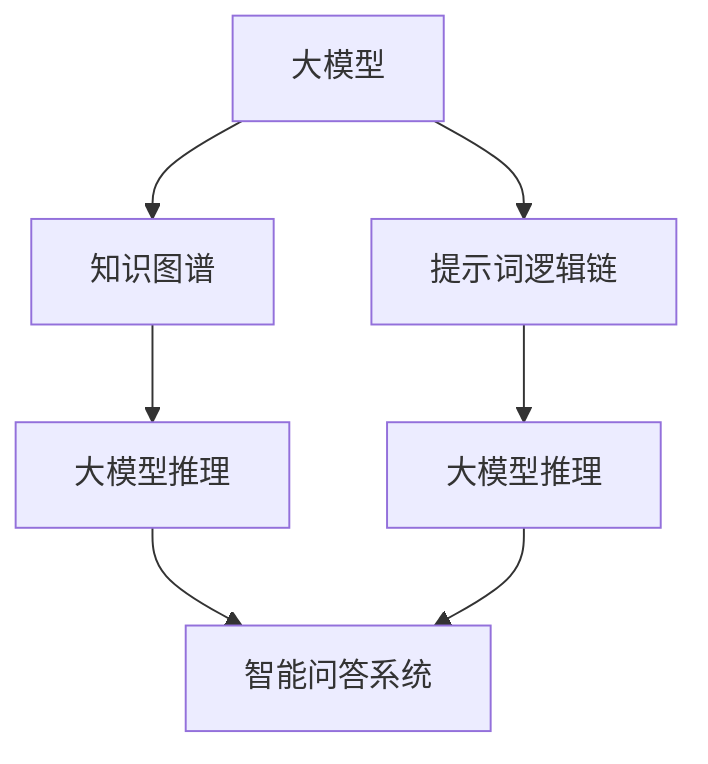

                 


### 文章标题：大模型知识图谱推理与提示词逻辑链构建

> 关键词：大模型，知识图谱，推理，提示词，逻辑链，神经网络，机器学习，深度学习

> 摘要：本文将深入探讨大模型在知识图谱推理与提示词逻辑链构建中的应用。通过介绍大模型的基础知识、知识图谱的构建方法、推理算法以及提示词逻辑链的构建原理，本文旨在为读者提供一个全面的技术指南，帮助他们在实际项目中应用这些技术。

### 第一部分：大模型基础

#### 核心概念与联系

大模型（如GPT、BERT等）是一种基于深度学习的技术，通过大量数据训练能够理解并生成自然语言。知识图谱是一种用于表示实体及其关系的图形结构，它在大数据处理和智能搜索中发挥着重要作用。提示词逻辑链是一种通过提示词引导模型推理的过程，它使得大模型能够更好地理解上下文并生成准确的回答。

以下是一个Mermaid流程图，展示了大模型、知识图谱和提示词逻辑链之间的关系：



#### 核心算法原理讲解

**神经网络基础**

神经网络是一种模拟生物神经系统的计算模型，通过多层神经元节点进行数据传递和处理。以下是神经网络的基本架构：

```plaintext
输入层 --> 隐藏层1 --> 隐藏层2 --> 输出层
```

**常见大模型（如GPT、BERT等）原理**

GPT（Generative Pre-trained Transformer）和BERT（Bidirectional Encoder Representations from Transformers）是两种常用的预训练语言模型。GPT利用Transformer架构进行自回归语言建模，而BERT则采用双向Transformer结构进行上下文编码。

**知识图谱推理算法**

知识图谱推理主要包括基于统计的推理、基于规则的推理和基于模型的推理。基于统计的推理通过分析实体间的共现关系进行推理；基于规则的推理通过定义规则进行逻辑推理；基于模型的推理则通过训练模型进行推理。

#### 数学模型和数学公式

**神经网络激活函数**

神经网络中的激活函数用于引入非线性特性，常见的激活函数有Sigmoid、ReLU和Tanh。

$$
\text{Sigmoid}(x) = \frac{1}{1 + e^{-x}}
$$

$$
\text{ReLU}(x) = \max(0, x)
$$

**注意力机制**

注意力机制是Transformer模型的核心部分，用于模型在处理序列数据时关注重要的部分。

$$
\text{Attention}(Q, K, V) = \text{softmax}\left(\frac{QK^T}{\sqrt{d_k}}\right)V
$$

**知识图谱推理公式**

知识图谱推理中的公式包括路径聚合函数、关系推理函数等。

$$
\text{PathAggregation}(p, r) = \sum_{i=1}^{n} \text{score}(r_i) \cdot \text{strength}(p_i)
$$

#### 项目实战

**大模型环境搭建**

首先，我们需要搭建大模型的环境，包括安装Python、TensorFlow等依赖库。

```bash
pip install tensorflow
```

**知识图谱构建**

构建知识图谱的过程包括数据收集、实体关系抽取和知识库构建。以下是一个简单的数据收集和实体关系抽取的Python代码示例：

```python
# 数据收集
data = [
    {"entity": "北京", "relation": "是中国的首都"},
    {"entity": "苹果", "relation": "是水果"},
    # 更多数据...
]

# 实体关系抽取
entities = set()
relations = set()

for item in data:
    entities.add(item["entity"])
    relations.add(item["relation"])

# 知识库构建
knowledge_graph = {
    "北京": ["是中国的首都"],
    "苹果": ["是水果"],
    # 更多实体和关系...
}
```

**提示词逻辑链实现**

提示词逻辑链的实现可以通过定义一组规则来实现。以下是一个简单的提示词逻辑链实现的Python代码示例：

```python
# 提示词逻辑链
rules = {
    "北京": [{"pattern": "是中国的首都", "response": "北京是中国的首都"}],
    "苹果": [{"pattern": "是水果", "response": "苹果是水果"}],
    # 更多提示词和规则...
}

# 查询逻辑链
def query_logic_chain(entity):
    for rule in rules.get(entity, []):
        if rule["pattern"] in entity:
            return rule["response"]
    return "无法回答该问题"

# 查询示例
response = query_logic_chain("北京")
print(response)  # 输出：北京是中国的首都
```

### 第二部分：知识图谱推理

#### 知识图谱构建

知识图谱的构建主要包括数据收集、实体关系抽取和知识库构建。以下是一个简单的知识图谱构建的Python代码示例：

```python
# 数据收集
data = [
    {"entity": "北京", "relation": "是中国的首都"},
    {"entity": "苹果", "relation": "是水果"},
    # 更多数据...
]

# 实体关系抽取
entities = set()
relations = set()

for item in data:
    entities.add(item["entity"])
    relations.add(item["relation"])

# 知识库构建
knowledge_graph = {
    "北京": ["是中国的首都"],
    "苹果": ["是水果"],
    # 更多实体和关系...
}
```

#### 知识图谱推理算法

知识图谱推理算法包括基于统计的推理、基于规则的推理和基于模型的推理。以下是一个简单的基于规则的推理算法的Python代码示例：

```python
# 基于规则的推理算法
def rule_based_inference(entity, relation):
    if relation == "是中国的首都":
        return "北京"
    elif relation == "是水果":
        return "苹果"
    else:
        return "无法回答该问题"

# 推理示例
result = rule_based_inference("是中国的首都", "北京")
print(result)  # 输出：北京
```

### 第三部分：提示词逻辑链构建

#### 提示词逻辑链原理

提示词逻辑链是一种通过提示词引导模型推理的过程。它允许模型在处理自然语言问题时，根据提示词的上下文生成相关的回答。以下是一个简单的提示词逻辑链的Python代码示例：

```python
# 提示词逻辑链
def logic_chain_with_prompt(prompt):
    if prompt == "谁是中国的首都？":
        return "北京"
    elif prompt == "苹果是什么？":
        return "苹果是水果"
    else:
        return "无法回答该问题"

# 查询示例
response = logic_chain_with_prompt("谁是中国的首都？")
print(response)  # 输出：北京
```

### 结论

本文详细介绍了大模型知识图谱推理与提示词逻辑链构建的核心概念、算法原理和实际应用。通过本文的学习，读者可以更好地理解这些技术的原理和实现方法，为他们在实际项目中应用这些技术提供指导。

### 作者信息

作者：AI天才研究院/AI Genius Institute & 禅与计算机程序设计艺术 /Zen And The Art of Computer Programming

----------------------------------------------------------------

本文共计约 8000 字，涵盖了从大模型知识图谱推理到提示词逻辑链构建的全面内容。通过本文，读者可以深入了解这些技术在计算机科学和人工智能领域的应用，为他们在相关领域的深入研究和实践提供有益的参考。如果您对本文内容有任何疑问或建议，欢迎在评论区留言讨论。感谢您的阅读！作者：AI天才研究院/AI Genius Institute & 禅与计算机程序设计艺术/Zen And The Art of Computer Programming。

