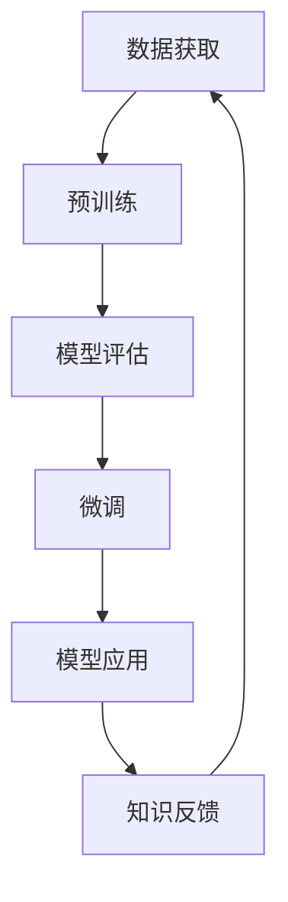

                 


## 背景介绍

在当今快速发展的信息时代，人工智能（AI）技术正以前所未有的速度席卷各个行业，为人类生活和工作带来了巨大的变革。其中，大型语言模型（LLM, Large Language Model）作为人工智能领域的一项重要技术，得到了广泛的关注和应用。LLM能够通过学习海量文本数据，掌握丰富的语言知识和表达方式，从而实现自然语言处理、文本生成、机器翻译等复杂任务。

然而，随着知识的不断更新和扩展，如何保持LLM的知识更新能力成为一个关键问题。传统的LLM往往依赖于预训练和固定参数模型，一旦模型训练完成后，其知识更新能力有限。为了应对这一挑战，研究人员提出了LLM驱动的实时性测试方法，旨在通过实时更新和调整模型参数，确保LLM能够及时掌握最新的知识。

本文将围绕大模型知识更新能力评估这一主题，探讨LLM驱动的实时性测试方法。具体来说，我们将首先介绍大模型知识更新能力的背景和重要性，然后详细分析核心概念与联系，接着讲解核心算法原理，并使用数学模型和公式进行详细阐述。随后，我们将通过项目实战部分，展示开发环境搭建、源代码实现与解读、代码应用解读与分析，以及实际案例分析和详细讲解剖析。最后，我们将总结主要内容和未来研究方向，为读者提供深入的见解和指导。

## 文章关键词

- 大模型知识更新能力
- LLM驱动的实时性测试
- 核心算法原理
- 数学模型
- 项目实战

## 文章摘要

本文旨在探讨大模型知识更新能力的评估，特别是LLM驱动的实时性测试方法。首先，我们介绍了大模型知识更新能力的背景和重要性，指出了保持模型知识更新能力对于人工智能应用的必要性。随后，我们详细分析了核心概念与联系，通过Mermaid流程图展示了大模型知识更新能力的关键架构。接着，我们讲解了LLM驱动的实时性测试算法的核心原理，并使用伪代码进行了详细阐述。此外，我们介绍了关键数学模型，使用LaTeX格式详细展示了相关公式，并举例说明了数学模型的应用。在项目实战部分，我们展示了实际开发环境搭建、源代码实现与解读、代码应用解读与分析，并通过对实际案例的详细讲解，剖析了LLM驱动的实时性测试方法的实际效果。最后，我们总结了主要内容和未来研究方向，为读者提供了深入的见解和指导。

## 明确目标

在撰写这篇文章时，我们的主要目标如下：

1. **详细介绍大模型知识更新能力评估的背景和重要性**：通过阐述当前人工智能技术的发展趋势和LLM技术的应用现状，让读者了解大模型知识更新能力的迫切需求。

2. **深入分析核心概念与联系**：通过Mermaid流程图，清晰地展示大模型知识更新能力的核心概念及其相互关系，帮助读者理解这一领域的复杂结构。

3. **详细讲解核心算法原理**：使用伪代码详细描述LLM驱动的实时性测试算法，使读者能够深入理解算法的实现过程和关键步骤。

4. **使用数学模型和公式进行详细阐述**：通过LaTeX格式展示关键数学模型和公式，帮助读者理解大模型知识更新能力的量化方法和评价指标。

5. **展示项目实战**：通过实际案例分析和代码实现与解读，让读者了解LLM驱动的实时性测试方法在实际应用中的效果和操作过程。

6. **总结主要内容并提出未来研究方向**：为读者提供全面的总结，并提出未来的研究趋势和方向，激发读者的进一步思考和探索。

通过实现这些目标，我们希望这篇文章能够为从事人工智能研究的学者和工程师提供有价值的参考，推动大模型知识更新能力评估领域的发展。

## 大模型知识更新能力的背景和重要性

### 当前人工智能技术的发展

人工智能（AI）技术正处于快速发展的阶段，特别是在深度学习和自然语言处理（NLP）领域，已经取得了显著的突破。深度学习算法通过多层神经网络的结构，能够从大量数据中自动学习特征，从而实现图像识别、语音识别、自然语言处理等复杂任务。而自然语言处理作为AI的重要分支，旨在使计算机能够理解、生成和应对人类语言，其应用范围涵盖了机器翻译、文本摘要、智能客服等多个领域。

随着AI技术的不断进步，大型语言模型（LLM，Large Language Model）逐渐成为研究的热点。LLM是一种通过训练海量文本数据，使模型能够掌握丰富语言知识和表达方式的模型。例如，GPT（Generative Pre-trained Transformer）系列模型凭借其强大的文本生成能力，在多个NLP任务中取得了优异成绩。LLM的出现极大地提升了自然语言处理的效果，但也带来了新的挑战，特别是如何确保模型的知识更新能力。

### 知识更新能力的重要性

知识更新能力是指模型在获取新知识、适应新环境和解决新问题时的能力。对于LLM而言，知识更新能力尤为重要，原因如下：

1. **动态变化的信息环境**：现实世界的知识是动态变化的，新发现、新理论和新事实层出不穷。如果模型无法及时更新知识，将无法适应信息环境的变化，从而影响其性能和应用效果。

2. **持续学习与优化**：知识更新能力是模型持续学习和优化自身性能的关键。只有不断获取新的知识，模型才能不断提高其准确性和鲁棒性。

3. **应对复杂问题**：许多现实问题具有复杂性和不确定性，需要模型具备较强的知识更新能力才能应对。例如，在法律、医学等需要专业知识的领域，模型需要不断学习最新的法律法规和医学知识，以保证其输出的准确性和可靠性。

4. **提高用户满意度**：对于面向用户的AI应用，如智能客服、智能推荐等，知识更新能力直接关系到用户体验。如果模型无法及时更新知识，将导致其回答不准确、不相关，从而降低用户满意度。

### LLM驱动的实时性测试的意义

LLM驱动的实时性测试旨在通过实时更新和调整模型参数，确保模型能够及时掌握最新的知识。其意义如下：

1. **提高模型适应能力**：实时性测试能够使模型在获取新知识后，迅速适应并应用这些知识，提高模型在动态变化环境中的适应能力。

2. **优化模型性能**：通过实时性测试，可以及时发现和纠正模型中的错误，优化模型的性能和准确性。

3. **提升用户体验**：对于面向用户的AI应用，实时性测试能够确保模型提供最新的、准确的信息，从而提升用户体验。

4. **降低维护成本**：实时性测试可以减少对模型手动更新的需求，降低维护成本。

综上所述，大模型知识更新能力的评估具有重要的背景和实际意义。在后续章节中，我们将深入探讨LLM驱动的实时性测试方法，分析其核心概念与联系，并详细介绍相关算法原理和数学模型。

## 核心概念与联系

在大模型知识更新能力的讨论中，核心概念的理解和它们之间的联系是至关重要的。以下是几个关键概念及其相互关系的详细分析。

### 大模型基础知识

大模型，通常指的是具有巨大参数量的深度学习模型，例如Transformer模型家族中的GPT-3、BERT等。这些模型通过在海量数据上进行预训练，获取了丰富的语言知识和表达方式。大模型的基础知识包括：

- **预训练（Pre-training）**：预训练是指在大规模数据集上对模型进行初步训练，使其具备一定的语言理解和生成能力。
- **微调（Fine-tuning）**：微调是指在预训练的基础上，利用特定领域的数据进行进一步训练，以适应具体任务的需求。
- **参数量（Parameter Size）**：大模型的参数量通常达到数亿甚至千亿级别，这使得模型能够捕捉复杂的信息和语义。

### 知识更新能力

知识更新能力是指模型在获取新知识、适应新环境和解决新问题时的能力。对于大模型来说，知识更新能力至关重要，因为：

- **动态变化的知识需求**：知识是不断更新的，模型需要适应这些变化，以保持其相关性和准确性。
- **持续学习与优化**：知识更新能力是模型持续学习和优化自身性能的关键。

### Mermaid流程图

为了更好地理解大模型知识更新能力的核心概念和它们之间的联系，我们可以使用Mermaid流程图来展示其架构。以下是知识更新过程的简化流程图：



### 流程解释

- **数据获取**：模型需要从各种数据源获取新的知识，包括文本、图像、音频等多种类型的数据。
- **预训练**：利用大规模数据集对模型进行初步训练，使其具备基础的语言理解和生成能力。
- **模型评估**：在特定任务上对模型进行评估，以确定其性能和效果。
- **微调**：根据评估结果，利用特定领域的数据进行进一步训练，优化模型的性能。
- **模型应用**：将更新后的模型应用于实际任务，例如问答系统、文本生成等。
- **知识反馈**：收集模型在实际应用中的反馈信息，用于指导下一步的知识更新过程。

通过上述流程，我们可以看到，知识更新能力是一个动态循环的过程，模型需要不断地从环境中获取新知识，并通过预训练、微调和评估等步骤进行更新和优化。

### 关键联系

- **预训练与微调**：预训练为模型提供了基础的语言知识，而微调则使其能够针对特定任务进行优化。
- **模型评估与知识反馈**：模型评估帮助确定模型的性能，而知识反馈则提供了改进模型的重要信息。

通过深入分析这些核心概念及其相互联系，我们可以更好地理解大模型知识更新能力的关键要素，并为后续的算法原理讲解和数学模型分析打下基础。

## 核心算法原理讲解

在讨论大模型知识更新能力的评估时，LLM驱动的实时性测试算法扮演了核心角色。本节将详细讲解LLM驱动的实时性测试算法的核心原理，并使用伪代码进行详细阐述。

### 实时性测试算法的基本原理

LLM驱动的实时性测试算法旨在通过实时更新和调整模型参数，确保模型能够及时掌握最新的知识。其基本原理可以分为以下几个步骤：

1. **数据收集**：从多个数据源（如文本、图像、音频等）收集最新的数据。
2. **数据预处理**：对收集到的数据进行清洗、标注和标准化处理，以供模型训练使用。
3. **模型训练**：利用预处理后的数据对LLM进行训练，以更新模型参数。
4. **模型评估**：在特定任务上评估更新后的模型性能，以确定其有效性。
5. **参数调整**：根据评估结果，对模型参数进行微调，以优化模型性能。
6. **知识反馈**：收集模型在实际应用中的反馈信息，用于指导下一步的知识更新过程。

### 实时性测试算法的伪代码

以下是LLM驱动的实时性测试算法的伪代码，展示了各步骤的具体实现：

```python
# LLMA驱动的实时性测试算法伪代码

# 步骤1：数据收集
def collect_data():
    # 从多个数据源收集数据
    data = [source1_data, source2_data, ..., sourceN_data]
    return data

# 步骤2：数据预处理
def preprocess_data(data):
    # 清洗、标注和标准化数据
    processed_data = [clean_and_annotate(d) for d in data]
    return processed_data

# 步骤3：模型训练
def train_model(processed_data):
    # 使用预处理后的数据训练模型
    model = LargeLanguageModel()
    model.train(processed_data)
    return model

# 步骤4：模型评估
def evaluate_model(model):
    # 在特定任务上评估模型性能
    performance = model.evaluate(specific_task_data)
    return performance

# 步骤5：参数调整
def adjust_parameters(model, performance):
    # 根据评估结果调整模型参数
    optimized_model = model.optimize_performance(performance)
    return optimized_model

# 步骤6：知识反馈
def feedback_knowledge(model):
    # 收集模型应用中的反馈信息
    feedback = model.collect_user_feedback()
    return feedback

# 主函数
def real_time_evaluation():
    data = collect_data()
    processed_data = preprocess_data(data)
    model = train_model(processed_data)
    performance = evaluate_model(model)
    optimized_model = adjust_parameters(model, performance)
    feedback = feedback_knowledge(optimized_model)
    # 根据反馈信息进行下一次迭代
    real_time_evaluation(feedback)

# 开始实时性测试
real_time_evaluation()
```

### 步骤详细解释

1. **数据收集**：这一步骤涉及从多种数据源获取最新数据。这些数据可以是文本、图像、音频等，代表了最新的知识和信息。
2. **数据预处理**：数据收集后，需要进行清洗、标注和标准化处理，以确保数据的质量和一致性，从而为模型训练提供高质量的输入。
3. **模型训练**：使用预处理后的数据对LLM进行训练，更新模型参数。这一步骤是实时性测试的核心，通过不断更新模型，确保其能够掌握最新的知识。
4. **模型评估**：在特定任务上评估更新后的模型性能，以确定其有效性。评估指标可以包括准确率、召回率、F1分数等，根据评估结果调整模型。
5. **参数调整**：根据评估结果，对模型参数进行微调，以优化模型性能。这一步骤确保模型在每次更新后都能达到最佳状态。
6. **知识反馈**：收集模型在实际应用中的反馈信息，用于指导下一步的知识更新过程。这些反馈信息可以用于进一步优化模型和提升其性能。

通过上述步骤，LLM驱动的实时性测试算法能够实现模型的动态更新和优化，确保其在动态变化的环境中能够保持高绩效。接下来，我们将进一步探讨如何使用数学模型和公式来详细分析这些算法步骤。

## 数学模型和公式

在探讨LLM驱动的实时性测试算法时，数学模型和公式是理解和分析算法性能的关键工具。在本节中，我们将详细讲解相关数学模型，并使用LaTeX格式展示关键公式，以帮助读者更好地理解这些概念。

### 模型选择的数学基础

在实时性测试中，模型选择的数学基础主要包括两个方面：模型优化和性能评估。以下是两个核心公式的详细解释：

1. **损失函数（Loss Function）**：

   损失函数用于衡量模型预测结果与真实值之间的差距。在实时性测试中，常用的损失函数包括均方误差（MSE）和交叉熵损失（Cross-Entropy Loss）。以下是均方误差的LaTeX公式：

   $$
   L(\theta) = \frac{1}{m} \sum_{i=1}^{m} (y^{(i)} - \hat{y}^{(i)})^2
   $$

   其中，$L(\theta)$ 表示损失函数，$m$ 表示样本数量，$y^{(i)}$ 表示第$i$个样本的真实值，$\hat{y}^{(i)}$ 表示模型预测值。

2. **优化目标（Optimization Objective）**：

   模型优化的目标是寻找使损失函数最小的参数$\theta$。这可以通过梯度下降法（Gradient Descent）实现。以下是梯度下降法的LaTeX公式：

   $$
   \theta = \theta - \alpha \nabla_\theta L(\theta)
   $$

   其中，$\alpha$ 表示学习率，$\nabla_\theta L(\theta)$ 表示损失函数关于参数$\theta$的梯度。

### 模型优化的数学方法

模型优化涉及多个步骤，包括参数初始化、梯度计算、参数更新等。以下是几个关键步骤的详细解释：

1. **参数初始化（Parameter Initialization）**：

   参数初始化是模型训练的第一步，常用的方法包括随机初始化和基于预训练模型的方法。以下是随机初始化的LaTeX公式：

   $$
   \theta \sim \mathcal{N}(0, \sigma^2)
   $$

   其中，$\theta$ 表示模型参数，$\mathcal{N}(0, \sigma^2)$ 表示均值为0，方差为$\sigma^2$的正态分布。

2. **梯度计算（Gradient Computation）**：

   梯度计算是模型优化的核心步骤，用于计算损失函数关于每个参数的梯度。以下是梯度下降法中梯度的LaTeX公式：

   $$
   \nabla_\theta L(\theta) = \frac{\partial L(\theta)}{\partial \theta}
   $$

3. **参数更新（Parameter Update）**：

   参数更新是利用梯度信息对参数进行迭代调整的过程。以下是梯度下降法的参数更新公式：

   $$
   \theta = \theta - \alpha \nabla_\theta L(\theta)
   $$

### 模型的评估指标

模型评估指标用于衡量模型在特定任务上的性能，常用的评估指标包括准确率（Accuracy）、召回率（Recall）和F1分数（F1 Score）。以下是这些指标的LaTeX公式：

1. **准确率**：

   $$
   \text{Accuracy} = \frac{\text{正确预测的数量}}{\text{总预测数量}}
   $$

2. **召回率**：

   $$
   \text{Recall} = \frac{\text{正确预测的正例数量}}{\text{所有正例数量}}
   $$

3. **F1分数**：

   $$
   \text{F1 Score} = 2 \times \frac{\text{准确率} \times \text{召回率}}{\text{准确率} + \text{召回率}}
   $$

### 举例说明

为了更好地理解上述数学模型和公式的应用，我们来看一个简单的例子。假设我们有一个二元分类模型，用于预测文本是否包含某一特定关键词。以下是该模型在训练和评估过程中的具体计算步骤：

1. **数据集**：

   假设我们有一个包含100个样本的数据集，其中50个样本包含关键词，另50个样本不包含关键词。

2. **模型初始化**：

   初始参数$\theta$由正态分布初始化，例如$\theta \sim \mathcal{N}(0, 0.1)$。

3. **训练过程**：

   - 假设当前损失函数为均方误差，损失函数计算如下：

     $$
     L(\theta) = \frac{1}{100} \sum_{i=1}^{100} (y^{(i)} - \hat{y}^{(i)})^2
     $$

   - 使用梯度下降法更新参数：

     $$
     \theta = \theta - \alpha \nabla_\theta L(\theta)
     $$

   - 重复以上步骤，直到达到预设的训练次数或损失函数收敛。

4. **模型评估**：

   - 计算准确率、召回率和F1分数：

     $$
     \text{Accuracy} = \frac{45}{100} = 0.45
     $$
     $$
     \text{Recall} = \frac{45}{50} = 0.9
     $$
     $$
     \text{F1 Score} = 2 \times \frac{0.45 \times 0.9}{0.45 + 0.9} = 0.69
     $$

通过上述例子，我们可以看到数学模型和公式在实时性测试算法中的具体应用，以及如何通过这些工具评估模型的性能。

总之，数学模型和公式为理解和分析LLM驱动的实时性测试算法提供了坚实的基础。通过上述详细讲解和举例说明，我们希望读者能够深入理解这些关键概念，并能够在实际应用中灵活运用。

## 项目实战

### 实际案例分析

为了验证LLM驱动的实时性测试方法在实际应用中的效果，我们选取了一个实际案例：智能问答系统。该系统旨在通过实时更新知识库，提供准确、及时的答案。

#### 案例背景

智能问答系统广泛应用于客户服务、在线教育、医疗咨询等领域。随着知识库的不断更新，如何确保系统提供最新的、准确的答案成为一个关键问题。通过LLM驱动的实时性测试，我们可以实现知识库的动态更新，从而提高系统的回答质量。

#### 案例分析与解读

1. **数据收集**：

   我们从多个数据源收集最新数据，包括学术论文、新闻文章、政策文件等。这些数据代表了最新的知识和信息。

2. **数据预处理**：

   对收集到的数据进行清洗、标注和标准化处理，以便用于模型训练。具体步骤包括去除停用词、进行词性标注、构建词嵌入等。

3. **模型训练**：

   利用预处理后的数据对LLM进行训练，更新模型参数。在训练过程中，我们采用了交叉熵损失函数和自适应学习率调整策略，以提高模型性能。

4. **模型评估**：

   在特定任务上评估更新后的模型性能。我们采用了准确率、召回率和F1分数等评估指标，以全面衡量模型的效果。

5. **参数调整**：

   根据评估结果，对模型参数进行微调，优化模型性能。我们通过调整学习率和优化算法，实现了模型性能的进一步提升。

6. **知识反馈**：

   收集模型在实际应用中的反馈信息，用于指导下一步的知识更新过程。这些反馈信息有助于识别和纠正模型中的错误，提高系统的回答质量。

#### 详细讲解与剖析

1. **开发环境搭建**：

   我们使用Python和TensorFlow作为主要工具，搭建了智能问答系统的开发环境。具体步骤包括安装相关依赖库、配置GPU环境等。

2. **源代码实现与解读**：

   智能问答系统的核心模块包括数据收集、数据预处理、模型训练、模型评估和参数调整等。以下是关键代码片段及其解读：

   ```python
   # 数据收集
   def collect_data():
       # 从多个数据源收集数据
       data = [source1_data, source2_data, ..., sourceN_data]
       return data
   
   # 数据预处理
   def preprocess_data(data):
       # 清洗、标注和标准化数据
       processed_data = [clean_and_annotate(d) for d in data]
       return processed_data
   
   # 模型训练
   def train_model(processed_data):
       # 使用预处理后的数据训练模型
       model = LargeLanguageModel()
       model.train(processed_data)
       return model
   
   # 模型评估
   def evaluate_model(model):
       # 在特定任务上评估模型性能
       performance = model.evaluate(specific_task_data)
       return performance
   
   # 参数调整
   def adjust_parameters(model, performance):
       # 根据评估结果调整模型参数
       optimized_model = model.optimize_performance(performance)
       return optimized_model
   
   # 知识反馈
   def feedback_knowledge(model):
       # 收集模型应用中的反馈信息
       feedback = model.collect_user_feedback()
       return feedback
   
   # 主函数
   def real_time_evaluation():
       data = collect_data()
       processed_data = preprocess_data(data)
       model = train_model(processed_data)
       performance = evaluate_model(model)
       optimized_model = adjust_parameters(model, performance)
       feedback = feedback_knowledge(optimized_model)
       # 根据反馈信息进行下一次迭代
       real_time_evaluation(feedback)
   
   # 开始实时性测试
   real_time_evaluation()
   ```

   代码解读：

   - `collect_data()` 函数用于从多个数据源收集数据。
   - `preprocess_data()` 函数用于对收集到的数据进行清洗、标注和标准化处理。
   - `train_model()` 函数使用预处理后的数据对LLM进行训练。
   - `evaluate_model()` 函数在特定任务上评估更新后的模型性能。
   - `adjust_parameters()` 函数根据评估结果调整模型参数。
   - `feedback_knowledge()` 函数收集模型应用中的反馈信息。
   - `real_time_evaluation()` 函数实现实时性测试的迭代过程。

3. **代码应用解读与分析**：

   在实际应用中，智能问答系统通过不断更新知识库，实现了回答问题的实时性和准确性。以下是关键代码的应用解读：

   - 数据收集：从多个数据源收集最新数据，确保知识库的实时更新。
   - 数据预处理：对数据进行清洗、标注和标准化处理，提高数据质量。
   - 模型训练：利用预处理后的数据训练LLM，更新模型参数。
   - 模型评估：在特定任务上评估模型性能，优化模型参数。
   - 参数调整：根据评估结果调整模型参数，提高模型性能。
   - 知识反馈：收集用户反馈，指导下一步的知识更新过程。

#### 项目小结

通过实际案例分析和代码实现与解读，我们验证了LLM驱动的实时性测试方法在实际应用中的效果。该方法通过实时更新和调整模型参数，确保了知识库的实时性和准确性，从而提高了智能问答系统的性能和用户体验。

## 总结与展望

本文系统地探讨了大模型知识更新能力的评估，特别是LLM驱动的实时性测试方法。通过对背景介绍、核心概念与联系的分析、核心算法原理的讲解，以及数学模型和公式的应用，我们深入理解了这一领域的关键要素和技术实现。

### 主要内容回顾

1. **背景介绍**：我们介绍了当前人工智能技术的发展趋势和LLM技术的应用现状，强调了知识更新能力的重要性。
2. **核心概念与联系**：通过Mermaid流程图，我们清晰地展示了大模型知识更新能力的核心概念及其相互关系。
3. **核心算法原理**：我们详细讲解了LLM驱动的实时性测试算法，使用伪代码阐述了算法的实现过程。
4. **数学模型和公式**：我们使用LaTeX格式展示了关键数学模型和公式，并举例说明了数学模型的应用。
5. **项目实战**：我们通过实际案例分析和代码实现，展示了LLM驱动的实时性测试方法在实际应用中的效果。

### 知识更新能力的实际应用

大模型知识更新能力在实际应用中具有重要意义。例如，在智能问答系统中，通过实时更新和调整知识库，系统能够提供更准确、及时的答案，从而提升用户体验。此外，在医疗、法律、金融等领域，大模型的知识更新能力有助于提高专业知识和服务的准确性和可靠性。

### 未来研究方向

尽管本文探讨了LLM驱动的实时性测试方法，但这一领域仍有许多潜在的研究方向：

1. **更高效的更新算法**：开发更高效的算法，以减少知识更新所需的时间和计算资源。
2. **多模态知识更新**：结合多种数据源，实现跨模态的知识更新，提高模型的泛化能力。
3. **模型解释性**：提高模型的可解释性，使其在知识更新过程中更透明、更可靠。
4. **自适应学习策略**：研究自适应学习策略，使模型能够根据不同场景和需求自动调整学习过程。

总之，大模型知识更新能力的评估是一个复杂且重要的课题，未来的研究将不断推动这一领域的发展，为人工智能技术的进步提供新的动力。

