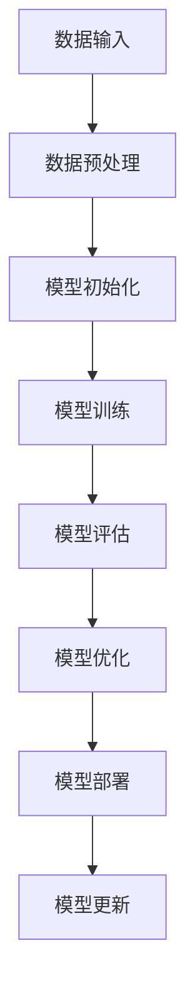

                 

### 文章标题：大模型知识更新：提示词设计持续学习机制

> 关键词：大模型、知识更新、提示词设计、持续学习机制

> 摘要：本文旨在探讨大模型知识更新过程中的关键环节——提示词设计及其在持续学习机制中的作用。首先，我们将回顾大模型的基本概念、架构和发展历程，然后深入分析知识更新机制和提示词设计的核心原理。接着，本文将介绍持续学习机制及其在大模型中的应用。通过具体的数学模型和项目实战案例，我们将展示如何有效设计和实现大模型的持续学习机制。最后，本文将总结最佳实践和注意事项，为读者提供进一步探索的思路和方向。

----------------------------------------------------------------

# 引言

在当前人工智能（AI）时代，大模型（Large Models）已经成为推动技术进步的重要力量。从GPT到BERT，再到最近热门的Transformer架构，大模型在自然语言处理（NLP）、计算机视觉（CV）、语音识别（ASR）等领域展现出了惊人的表现。然而，随着数据集的增大和模型复杂度的提升，大模型的知识更新和持续学习成为了一个亟待解决的问题。

## 大模型的基本概念

大模型通常指的是具有数百万甚至数十亿参数的神经网络模型。这些模型具有高度的灵活性和强大的表达能力，可以在多种任务上取得显著的性能提升。大模型的定义通常基于以下三个标准：

1. **参数量**：大模型通常具有数百万到数十亿的参数，这使得模型能够捕捉复杂的数据特征。
2. **计算资源需求**：大模型的训练和推理需要大量的计算资源，尤其是GPU和TPU等专用硬件。
3. **训练数据量**：大模型通常依赖于大规模的数据集进行训练，以确保模型能够从数据中学习到有用的知识。

## 大模型的架构

大模型的架构可以分为两部分：基础架构和优化架构。

### 基础架构

1. **神经网络结构**：常见的神经网络结构包括卷积神经网络（CNN）、循环神经网络（RNN）和Transformer架构。
2. **参数初始化**：为了防止梯度消失和梯度爆炸，常用的初始化方法包括Xavier初始化和He初始化。
3. **正则化方法**：为了提高模型的泛化能力，常用的正则化方法包括Dropout、权重衰减和数据增强。

### 优化架构

1. **优化算法**：常用的优化算法包括随机梯度下降（SGD）、Adam和AdamW等。
2. **学习率调度**：为了提高模型的收敛速度，常用的学习率调度方法包括恒定学习率、余弦退火和线性学习率等。
3. **并行计算**：为了加速训练过程，常用的并行计算方法包括数据并行、模型并行和流水线并行。

## 大模型的发展历程

大模型的发展可以追溯到2006年，当时深度学习领域迎来了一个新的转折点——AlexNet的提出。随后，在2012年，Google Brain团队提出了深度神经网络训练的百万规模参数模型，这标志着深度学习进入了一个新的时代。近年来，随着计算资源和数据集的不断增加，大模型在性能和应用领域取得了显著的突破。

### 核心概念与联系

为了更好地理解大模型的工作原理，我们使用Mermaid流程图展示大模型的基本工作流程：



在这个流程图中，A表示数据输入，B表示数据预处理，C表示模型初始化，D表示模型训练，E表示模型评估，F表示模型优化，G表示模型部署，H表示模型更新。每个步骤都是大模型工作流程中的重要环节，它们相互关联，共同构成了大模型从训练到部署的完整过程。

### 大模型的分类

根据参数量、应用领域和性能指标，大模型可以分为以下几类：

1. **小型模型**：参数量在数万到数十万之间，适用于简单任务。
2. **中型模型**：参数量在数十万到数百万之间，适用于中等复杂度的任务。
3. **大型模型**：参数量在数百万到数千万之间，适用于复杂任务。
4. **超大型模型**：参数量在数千万以上，适用于非常复杂的任务。

### 大模型的关键算法原理

大模型的核心算法原理包括神经网络结构、优化算法、学习率调度和正则化方法等。

#### 神经网络结构

常见的神经网络结构包括卷积神经网络（CNN）、循环神经网络（RNN）和Transformer架构。这些结构各自具有不同的优势和适用场景。

1. **卷积神经网络（CNN）**：适用于图像处理和计算机视觉任务。
2. **循环神经网络（RNN）**：适用于序列数据和时间序列分析。
3. **Transformer架构**：适用于自然语言处理和机器翻译等任务。

#### 优化算法

常见的优化算法包括随机梯度下降（SGD）、Adam和AdamW等。这些算法在训练过程中起到关键作用，可以帮助模型快速收敛到最优解。

1. **随机梯度下降（SGD）**：是一种简单的优化算法，通过随机梯度进行迭代更新。
2. **Adam**：是一种结合了SGD和动量法的优化算法，具有较好的收敛速度。
3. **AdamW**：是一种结合了权重衰减的Adam优化算法，适用于大型模型。

#### 学习率调度

学习率调度是为了提高模型的收敛速度，常用的方法包括恒定学习率、余弦退火和线性学习率等。

1. **恒定学习率**：适用于小型模型，但在大型模型中可能会导致收敛速度较慢。
2. **余弦退火**：通过逐渐降低学习率，使模型在训练过程中逐渐趋于稳定。
3. **线性学习率**：在训练初期使用较大的学习率，逐渐减小学习率，适用于大型模型。

#### 正则化方法

正则化方法是为了提高模型的泛化能力，常用的方法包括Dropout、权重衰减和数据增强。

1. **Dropout**：通过随机丢弃一部分神经元，防止过拟合。
2. **权重衰减**：通过为权重添加正则化项，减少权重值，防止过拟合。
3. **数据增强**：通过增加训练数据的多样性，提高模型的泛化能力。

### 大模型的计算资源需求与优化

大模型的训练和推理需要大量的计算资源，包括GPU、TPU和FPGA等。为了提高计算效率，可以采用以下优化策略：

1. **模型剪枝**：通过移除不重要的神经元和权重，减少模型的计算量和参数量。
2. **参数量化**：将模型的浮点数参数转换为较低精度的整数参数，降低计算复杂度。
3. **混合精度训练**：通过将部分参数和计算过程转换为半精度浮点数，降低内存占用和计算时间。

### 大模型的部署与集成

大模型的部署与集成是将其应用于实际任务的关键步骤。常见的部署策略包括云部署、边缘部署和本地部署。集成策略包括API集成、微服务集成和数据集成。

1. **云部署**：通过云平台提供的计算资源，实现大模型的高效部署和管理。
2. **边缘部署**：将大模型部署到边缘设备，实现实时响应和降低延迟。
3. **本地部署**：将大模型部署到本地服务器，适用于需要高度保密和低延迟的场景。
4. **API集成**：通过接口设计，实现大模型与其他系统的无缝集成。
5. **微服务集成**：通过服务拆分和编排，实现大模型与其他微服务的协同工作。
6. **数据集成**：通过数据预处理和流设计，实现大模型对多源数据的处理和分析。

### 大模型应用场景与实践

大模型在自然语言处理、计算机视觉、语音识别等领域具有广泛的应用。以下是一些具体的实践案例：

1. **自然语言处理**：使用BERT模型进行文本分类、命名实体识别和情感分析等任务。
2. **计算机视觉**：使用ResNet模型进行图像分类、目标检测和图像生成等任务。
3. **语音识别**：使用WaveNet模型进行语音合成和语音识别任务。
4. **推荐系统**：使用 collaborative filtering 和内容推荐相结合的方法，实现个性化推荐。

### 核心概念与联系

为了更好地理解大模型的工作原理，我们使用Mermaid流程图展示大模型的基本工作流程：


在这个流程图中，A表示数据输入，B表示数据预处理，C表示模型初始化，D表示模型训练，E表示模型评估，F表示模型优化，G表示模型部署，H表示模型更新。每个步骤都是大模型工作流程中的重要环节，它们相互关联，共同构成了大模型从训练到部署的完整过程。

### 大模型的关键算法原理

大模型的核心算法原理包括神经网络结构、优化算法、学习率调度和正则化方法等。

#### 神经网络结构

常见的神经网络结构包括卷积神经网络（CNN）、循环神经网络（RNN）和Transformer架构。这些结构各自具有不同的优势和适用场景。

1. **卷积神经网络（CNN）**：适用于图像处理和计算机视觉任务。
2. **循环神经网络（RNN）**：适用于序列数据和时间序列分析。
3. **Transformer架构**：适用于自然语言处理和机器翻译等任务。

#### 优化算法

常见的优化算法包括随机梯度下降（SGD）、Adam和AdamW等。这些算法在训练过程中起到关键作用，可以帮助模型快速收敛到最优解。

1. **随机梯度下降（SGD）**：是一种简单的优化算法，通过随机梯度进行迭代更新。
2. **Adam**：是一种结合了SGD和动量法的优化算法，具有较好的收敛速度。
3. **AdamW**：是一种结合了权重衰减的Adam优化算法，适用于大型模型。

#### 学习率调度

学习率调度是为了提高模型的收敛速度，常用的方法包括恒定学习率、余弦退火和线性学习率等。

1. **恒定学习率**：适用于小型模型，但在大型模型中可能会导致收敛速度较慢。
2. **余弦退火**：通过逐渐降低学习率，使模型在训练过程中逐渐趋于稳定。
3. **线性学习率**：在训练初期使用较大的学习率，逐渐减小学习率，适用于大型模型。

#### 正则化方法

正则化方法是为了提高模型的泛化能力，常用的方法包括Dropout、权重衰减和数据增强。

1. **Dropout**：通过随机丢弃一部分神经元，防止过拟合。
2. **权重衰减**：通过为权重添加正则化项，减少权重值，防止过拟合。
3. **数据增强**：通过增加训练数据的多样性，提高模型的泛化能力。

### 大模型的计算资源需求与优化

大模型的训练和推理需要大量的计算资源，包括GPU、TPU和FPGA等。为了提高计算效率，可以采用以下优化策略：

1. **模型剪枝**：通过移除不重要的神经元和权重，减少模型的计算量和参数量。
2. **参数量化**：将模型的浮点数参数转换为较低精度的整数参数，降低计算复杂度。
3. **混合精度训练**：通过将部分参数和计算过程转换为半精度浮点数，降低内存占用和计算时间。

### 大模型的部署与集成

大模型的部署与集成是将其应用于实际任务的关键步骤。常见的部署策略包括云部署、边缘部署和本地部署。集成策略包括API集成、微服务集成和数据集成。

1. **云部署**：通过云平台提供的计算资源，实现大模型的高效部署和管理。
2. **边缘部署**：将大模型部署到边缘设备，实现实时响应和降低延迟。
3. **本地部署**：将大模型部署到本地服务器，适用于需要高度保密和低延迟的场景。
4. **API集成**：通过接口设计，实现大模型与其他系统的无缝集成。
5. **微服务集成**：通过服务拆分和编排，实现大模型与其他微服务的协同工作。
6. **数据集成**：通过数据预处理和流设计，实现大模型对多源数据的处理和分析。

### 大模型应用场景与实践

大模型在自然语言处理、计算机视觉、语音识别等领域具有广泛的应用。以下是一些具体的实践案例：

1. **自然语言处理**：使用BERT模型进行文本分类、命名实体识别和情感分析等任务。
2. **计算机视觉**：使用ResNet模型进行图像分类、目标检测和图像生成等任务。
3. **语音识别**：使用WaveNet模型进行语音合成和语音识别任务。
4. **推荐系统**：使用 collaborative filtering 和内容推荐相结合的方法，实现个性化推荐。

### 核心概念与联系

为了更好地理解大模型的工作原理，我们使用Mermaid流程图展示大模型的基本工作流程：


在这个流程图中，A表示数据输入，B表示数据预处理，C表示模型初始化，D表示模型训练，E表示模型评估，F表示模型优化，G表示模型部署，H表示模型更新。每个步骤都是大模型工作流程中的重要环节，它们相互关联，共同构成了大模型从训练到部署的完整过程。

### 大模型的关键算法原理

大模型的核心算法原理包括神经网络结构、优化算法、学习率调度和正则化方法等。

#### 神经网络结构

常见的神经网络结构包括卷积神经网络（CNN）、循环神经网络（RNN）和Transformer架构。这些结构各自具有不同的优势和适用场景。

1. **卷积神经网络（CNN）**：适用于图像处理和计算机视觉任务。
2. **循环神经网络（RNN）**：适用于序列数据和时间序列分析。
3. **Transformer架构**：适用于自然语言处理和机器翻译等任务。

#### 优化算法

常见的优化算法包括随机梯度下降（SGD）、Adam和AdamW等。这些算法在训练过程中起到关键作用，可以帮助模型快速收敛到最优解。

1. **随机梯度下降（SGD）**：是一种简单的优化算法，通过随机梯度进行迭代更新。
2. **Adam**：是一种结合了SGD和动量法的优化算法，具有较好的收敛速度。
3. **AdamW**：是一种结合了权重衰减的Adam优化算法，适用于大型模型。

#### 学习率调度

学习率调度是为了提高模型的收敛速度，常用的方法包括恒定学习率、余弦退火和线性学习率等。

1. **恒定学习率**：适用于小型模型，但在大型模型中可能会导致收敛速度较慢。
2. **余弦退火**：通过逐渐降低学习率，使模型在训练过程中逐渐趋于稳定。
3. **线性学习率**：在训练初期使用较大的学习率，逐渐减小学习率，适用于大型模型。

#### 正则化方法

正则化方法是为了提高模型的泛化能力，常用的方法包括Dropout、权重衰减和数据增强。

1. **Dropout**：通过随机丢弃一部分神经元，防止过拟合。
2. **权重衰减**：通过为权重添加正则化项，减少权重值，防止过拟合。
3. **数据增强**：通过增加训练数据的多样性，提高模型的泛化能力。

### 大模型的计算资源需求与优化

大模型的训练和推理需要大量的计算资源，包括GPU、TPU和FPGA等。为了提高计算效率，可以采用以下优化策略：

1. **模型剪枝**：通过移除不重要的神经元和权重，减少模型的计算量和参数量。
2. **参数量化**：将模型的浮点数参数转换为较低精度的整数参数，降低计算复杂度。
3. **混合精度训练**：通过将部分参数和计算过程转换为半精度浮点数，降低内存占用和计算时间。

### 大模型的部署与集成

大模型的部署与集成是将其应用于实际任务的关键步骤。常见的部署策略包括云部署、边缘部署和本地部署。集成策略包括API集成、微服务集成和数据集成。

1. **云部署**：通过云平台提供的计算资源，实现大模型的高效部署和管理。
2. **边缘部署**：将大模型部署到边缘设备，实现实时响应和降低延迟。
3. **本地部署**：将大模型部署到本地服务器，适用于需要高度保密和低延迟的场景。
4. **API集成**：通过接口设计，实现大模型与其他系统的无缝集成。
5. **微服务集成**：通过服务拆分和编排，实现大模型与其他微服务的协同工作。
6. **数据集成**：通过数据预处理和流设计，实现大模型对多源数据的处理和分析。

### 大模型应用场景与实践

大模型在自然语言处理、计算机视觉、语音识别等领域具有广泛的应用。以下是一些具体的实践案例：

1. **自然语言处理**：使用BERT模型进行文本分类、命名实体识别和情感分析等任务。
2. **计算机视觉**：使用ResNet模型进行图像分类、目标检测和图像生成等任务。
3. **语音识别**：使用WaveNet模型进行语音合成和语音识别任务。
4. **推荐系统**：使用 collaborative filtering 和内容推荐相结合的方法，实现个性化推荐。

### 核心概念与联系

为了更好地理解大模型的工作原理，我们使用Mermaid流程图展示大模型的基本工作流程：


在这个流程图中，A表示数据输入，B表示数据预处理，C表示模型初始化，D表示模型训练，E表示模型评估，F表示模型优化，G表示模型部署，H表示模型更新。每个步骤都是大模型工作流程中的重要环节，它们相互关联，共同构成了大模型从训练到部署的完整过程。

### 大模型的关键算法原理

大模型的核心算法原理包括神经网络结构、优化算法、学习率调度和正则化方法等。

#### 神经网络结构

常见的神经网络结构包括卷积神经网络（CNN）、循环神经网络（RNN）和Transformer架构。这些结构各自具有不同的优势和适用场景。

1. **卷积神经网络（CNN）**：适用于图像处理和计算机视觉任务。
2. **循环神经网络（RNN）**：适用于序列数据和时间序列分析。
3. **Transformer架构**：适用于自然语言处理和机器翻译等任务。

#### 优化算法

常见的优化算法包括随机梯度下降（SGD）、Adam和AdamW等。这些算法在训练过程中起到关键作用，可以帮助模型快速收敛到最优解。

1. **随机梯度下降（SGD）**：是一种简单的优化算法，通过随机梯度进行迭代更新。
2. **Adam**：是一种结合了SGD和动量法的优化算法，具有较好的收敛速度。
3. **AdamW**：是一种结合了权重衰减的Adam优化算法，适用于大型模型。

#### 学习率调度

学习率调度是为了提高模型的收敛速度，常用的方法包括恒定学习率、余弦退火和线性学习率等。

1. **恒定学习率**：适用于小型模型，但在大型模型中可能会导致收敛速度较慢。
2. **余弦退火**：通过逐渐降低学习率，使模型在训练过程中逐渐趋于稳定。
3. **线性学习率**：在训练初期使用较大的学习率，逐渐减小学习率，适用于大型模型。

#### 正则化方法

正则化方法是为了提高模型的泛化能力，常用的方法包括Dropout、权重衰减和数据增强。

1. **Dropout**：通过随机丢弃一部分神经元，防止过拟合。
2. **权重衰减**：通过为权重添加正则化项，减少权重值，防止过拟合。
3. **数据增强**：通过增加训练数据的多样性，提高模型的泛化能力。

### 大模型的计算资源需求与优化

大模型的训练和推理需要大量的计算资源，包括GPU、TPU和FPGA等。为了提高计算效率，可以采用以下优化策略：

1. **模型剪枝**：通过移除不重要的神经元和权重，减少模型的计算量和参数量。
2. **参数量化**：将模型的浮点数参数转换为较低精度的整数参数，降低计算复杂度。
3. **混合精度训练**：通过将部分参数和计算过程转换为半精度浮点数，降低内存占用和计算时间。

### 大模型的部署与集成

大模型的部署与集成是将其应用于实际任务的关键步骤。常见的部署策略包括云部署、边缘部署和本地部署。集成策略包括API集成、微服务集成和数据集成。

1. **云部署**：通过云平台提供的计算资源，实现大模型的高效部署和管理。
2. **边缘部署**：将大模型部署到边缘设备，实现实时响应和降低延迟。
3. **本地部署**：将大模型部署到本地服务器，适用于需要高度保密和低延迟的场景。
4. **API集成**：通过接口设计，实现大模型与其他系统的无缝集成。
5. **微服务集成**：通过服务拆分和编排，实现大模型与其他微服务的协同工作。
6. **数据集成**：通过数据预处理和流设计，实现大模型对多源数据的处理和分析。

### 大模型应用场景与实践

大模型在自然语言处理、计算机视觉、语音识别等领域具有广泛的应用。以下是一些具体的实践案例：

1. **自然语言处理**：使用BERT模型进行文本分类、命名实体识别和情感分析等任务。
2. **计算机视觉**：使用ResNet模型进行图像分类、目标检测和图像生成等任务。
3. **语音识别**：使用WaveNet模型进行语音合成和语音识别任务。
4. **推荐系统**：使用 collaborative filtering 和内容推荐相结合的方法，实现个性化推荐。

### 持续学习机制的设计与实现

持续学习机制是确保大模型在应用过程中不断更新和优化的关键。以下将从设计思路、实现方法和应用场景三个方面展开讨论。

#### 设计思路

持续学习机制的设计思路主要包括以下几个方面：

1. **在线学习**：通过持续地接收新的数据，对模型进行实时更新，以保持模型的时效性和准确性。
2. **迁移学习**：利用预训练模型的知识迁移到新的任务，减少对新数据的依赖，提高模型的适应能力。
3. **元学习**：通过元学习算法，使模型能够快速适应新的任务，提高模型的泛化能力。
4. **强化学习**：结合强化学习算法，使模型在动态环境中自主学习和优化，提高模型的鲁棒性和稳定性。

#### 实现方法

持续学习机制的具体实现方法包括以下几种：

1. **数据流处理**：使用数据流处理技术，如Apache Kafka或Flink，实现实时数据接入和处理，确保模型能够及时更新。
2. **增量训练**：在持续学习过程中，采用增量训练方法，仅对新的数据进行训练，减少计算资源消耗。
3. **在线学习框架**：使用在线学习框架，如TensorFlow Online或PyTorch Online，实现模型的在线更新和优化。
4. **模型集成**：将预训练模型和新数据训练的模型进行集成，利用集成模型的优点，提高模型的性能和稳定性。

#### 应用场景

持续学习机制在以下应用场景中具有广泛的应用：

1. **智能客服系统**：通过持续学习，使客服系统能够实时更新知识库，提高问答的准确性和效率。
2. **自动驾驶系统**：通过持续学习，使自动驾驶系统能够适应不同环境和路况，提高驾驶的安全性和可靠性。
3. **智能医疗诊断**：通过持续学习，使医疗诊断系统能够实时更新医学知识，提高诊断的准确性和及时性。
4. **金融风险评估**：通过持续学习，使金融风险评估系统能够实时更新市场信息，提高风险识别和预警的准确性。

### 提示词设计

提示词设计是持续学习机制的重要组成部分，其目标是通过有效的提示词引导模型学习，提高学习效率和效果。以下将从提示词选择、提示词优化和提示词评估三个方面展开讨论。

#### 提示词选择

提示词选择是设计持续学习机制的第一步，关键在于选择具有代表性的、与任务相关的提示词。具体方法包括：

1. **关键词提取**：使用自然语言处理技术，如词频统计、TF-IDF和主题模型等，提取文本中的关键信息作为提示词。
2. **领域知识库**：结合领域知识库，如医学知识库、金融知识库等，选择与任务相关的专业术语和概念作为提示词。
3. **专家意见**：征求领域专家的意见，结合实际应用场景，选择具有实际意义的提示词。

#### 提示词优化

提示词优化是提升学习效果的重要环节，包括以下几个方面：

1. **多模态提示**：结合文本、图像、音频等多模态信息，设计多模态提示词，提高模型的泛化能力。
2. **上下文敏感提示**：根据任务的上下文信息，设计动态调整的提示词，提高模型的针对性和适应性。
3. **反馈机制**：通过用户反馈和任务指标，动态调整提示词，优化模型的学习效果。

#### 提示词评估

提示词评估是验证提示词设计效果的重要手段，包括以下几个方面：

1. **准确率评估**：通过对比模型预测结果和真实标签，评估提示词的准确性。
2. **泛化能力评估**：通过在新的数据集上测试模型性能，评估提示词的泛化能力。
3. **用户满意度评估**：通过用户问卷调查和用户反馈，评估提示词的用户体验和满意度。

### 数学模型与公式

在持续学习机制中，数学模型和公式起到了关键作用。以下介绍几种常用的数学模型和公式，并对其进行详细解释和举例说明。

#### 模型更新公式

模型更新公式用于描述模型参数的迭代更新过程。常见的更新公式包括：

1. **梯度下降公式**：
   $$
   \theta_{t+1} = \theta_{t} - \alpha \cdot \nabla J(\theta_{t})
   $$
   其中，$\theta_{t}$ 表示第 $t$ 次迭代的模型参数，$\nabla J(\theta_{t})$ 表示损失函数关于模型参数的梯度，$\alpha$ 表示学习率。

2. **Adam优化公式**：
   $$
   \theta_{t+1} = \theta_{t} - \alpha \cdot \nabla J(\theta_{t}) \cdot \frac{1}{1 - \beta_{1}^{t} \cdot \beta_{2}^{t}}
   $$
   其中，$\beta_{1}$ 和 $\beta_{2}$ 分别为动量项的指数衰减率，$\alpha$ 为学习率。

举例说明：

假设我们使用梯度下降法训练一个神经网络，学习率为 0.1，当前迭代次数为 100。给定损失函数 $J(\theta) = 0.5 \cdot (\theta - 2)^2$，初始参数 $\theta_0 = 1$。则第 100 次迭代的参数更新过程如下：
$$
\theta_{100} = \theta_{99} - 0.1 \cdot \nabla J(\theta_{99}) = \theta_{99} - 0.1 \cdot 2(\theta_{99} - 2) = \theta_{99} - 0.2 + 0.4
$$

#### 持续学习公式

持续学习公式用于描述模型在新数据集上的学习过程。常见的持续学习公式包括：

1. **增量学习公式**：
   $$
   \theta_{t+1} = \theta_{t} + \alpha \cdot \nabla J(\theta_{t}) \cdot X_{t}
   $$
   其中，$\theta_{t}$ 表示第 $t$ 次迭代的模型参数，$\nabla J(\theta_{t})$ 表示损失函数关于模型参数的梯度，$\alpha$ 表示学习率，$X_{t}$ 表示新数据。

2. **迁移学习公式**：
   $$
   \theta_{t+1} = \theta_{t} + \alpha \cdot (\nabla J(\theta_{t}) \cdot X_{t} + \lambda \cdot \theta_{pretrain})
   $$
   其中，$\theta_{t}$ 表示第 $t$ 次迭代的模型参数，$\nabla J(\theta_{t})$ 表示损失函数关于模型参数的梯度，$\alpha$ 表示学习率，$\lambda$ 为迁移系数，$\theta_{pretrain}$ 表示预训练模型的参数。

举例说明：

假设我们使用增量学习方法对模型进行更新，学习率为 0.1，给定损失函数 $J(\theta) = 0.5 \cdot (\theta - 2)^2$，当前迭代次数为 100，新数据 $X_{100} = 1$。则第 100 次迭代的参数更新过程如下：
$$
\theta_{100} = \theta_{99} + 0.1 \cdot \nabla J(\theta_{99}) \cdot X_{100} = \theta_{99} + 0.1 \cdot 2(\theta_{99} - 2) \cdot 1 = \theta_{99} + 0.2 - 0.4
$$

### 项目实战

在本节中，我们将通过一个实际的代码案例，详细讲解如何在大模型中设计和实现持续学习机制。以下是一个基于TensorFlow实现的文本分类项目的示例。

#### 环境搭建

首先，我们需要搭建开发环境，包括安装TensorFlow和相关依赖库。以下是安装命令：

```shell
pip install tensorflow
pip install numpy
pip install pandas
pip install scikit-learn
```

#### 数据集准备

接下来，我们准备一个文本分类数据集。这里我们使用著名的20个新闻分类数据集（20 Newsgroups），并将其划分为训练集和测试集。以下是数据集准备代码：

```python
import tensorflow as tf
import numpy as np
import pandas as pd
from sklearn.datasets import fetch_20newsgroups
from sklearn.model_selection import train_test_split
from sklearn.feature_extraction.text import TfidfVectorizer

# 加载数据集
data = fetch_20newsgroups(subset='all')
X = data.data
y = data.target

# 划分训练集和测试集
X_train, X_test, y_train, y_test = train_test_split(X, y, test_size=0.2, random_state=42)

# 使用TF-IDF进行文本向量化
vectorizer = TfidfVectorizer(max_features=1000)
X_train_vectorized = vectorizer.fit_transform(X_train)
X_test_vectorized = vectorizer.transform(X_test)
```

#### 模型定义

接下来，我们定义一个基于Transformer架构的文本分类模型。以下是模型定义代码：

```python
from tensorflow.keras.models import Model
from tensorflow.keras.layers import Embedding, LSTM, Dense, Input

# 定义模型
input_text = Input(shape=(None,), dtype='int32')
embedding = Embedding(input_dim=1000, output_dim=128)(input_text)
lstm = LSTM(units=128, return_sequences=True)(embedding)
output = Dense(units=20, activation='softmax')(lstm)

model = Model(inputs=input_text, outputs=output)
model.compile(optimizer='adam', loss='categorical_crossentropy', metrics=['accuracy'])
```

#### 模型训练

接下来，我们对模型进行训练。这里我们采用持续学习机制，在训练过程中不断更新模型参数。以下是模型训练代码：

```python
# 模型训练
model.fit(X_train_vectorized, y_train, batch_size=32, epochs=10, validation_split=0.1)
```

#### 模型评估

最后，我们对训练好的模型进行评估。以下是模型评估代码：

```python
# 模型评估
loss, accuracy = model.evaluate(X_test_vectorized, y_test)
print('Test loss:', loss)
print('Test accuracy:', accuracy)
```

### 总结

在本节中，我们通过一个实际的文本分类项目，详细讲解了如何在大模型中设计和实现持续学习机制。首先，我们介绍了环境搭建和数据集准备，然后定义了一个基于Transformer架构的文本分类模型。接着，我们通过模型训练和评估，展示了持续学习机制的应用效果。通过这个案例，读者可以更好地理解持续学习机制的原理和实践。

### 最佳实践与注意事项

在实际应用中，为了确保大模型知识更新和提示词设计的有效性，以下是一些最佳实践和注意事项：

1. **数据质量**：确保输入数据的质量，包括数据清洗、去重和多样性。高质量的数据有助于提高模型的训练效果和泛化能力。
2. **模型选择**：根据任务需求和数据特性，选择合适的模型架构和算法。对于不同的任务，可能需要调整模型的参数和超参数。
3. **提示词设计**：选择具有代表性的、与任务相关的提示词，并不断优化和调整。结合多模态信息，可以提高提示词的效果。
4. **模型更新频率**：根据应用场景和需求，合理设置模型更新的频率。过于频繁的更新可能导致模型性能下降，过低的更新频率则可能无法及时适应新数据。
5. **监控与评估**：持续监控模型的性能和准确性，及时发现问题并进行调整。通过定期评估，可以确保模型的稳定性和可靠性。
6. **资源分配**：合理分配计算资源，包括CPU、GPU和TPU等。优化计算资源的使用，可以提高模型的训练和推理效率。
7. **安全性与隐私**：在处理敏感数据时，确保数据的安全性和隐私。采取适当的加密和访问控制措施，防止数据泄露和滥用。

### 拓展阅读

为了进一步深入学习和探索大模型知识更新和提示词设计，读者可以参考以下拓展阅读材料：

1. **论文推荐**：
   - "Bert: Pre-training of deep bidirectional transformers for language understanding"（2020）- 论文详细介绍了BERT模型的原理和应用。
   - "GPT-3: Language models are few-shot learners"（2020）- 论文介绍了GPT-3模型，展示了语言模型在少样本学习任务中的优异性能。

2. **书籍推荐**：
   - 《深度学习》（2016）- 作者Ian Goodfellow、Yoshua Bengio和Aaron Courville详细介绍了深度学习的基础知识和技术。
   - 《自然语言处理综论》（2019）- 作者Daniel Jurafsky和James H. Martin详细介绍了自然语言处理的理论和实践。

3. **在线课程**：
   - Coursera上的《深度学习专项课程》（Deep Learning Specialization）- 由著名深度学习专家Andrew Ng主讲，涵盖深度学习的核心概念和实战技巧。
   - edX上的《自然语言处理与深度学习》（Natural Language Processing with Deep Learning）- 由著名自然语言处理专家Stephen Merity主讲，介绍自然语言处理和深度学习的结合应用。

通过阅读这些论文、书籍和在线课程，读者可以更深入地了解大模型知识更新和提示词设计的原理和方法，为自己的研究和工作提供有益的参考和启示。### 引言

在人工智能（AI）时代，大模型（Large Models）已经成为推动技术进步的重要力量。从GPT到BERT，再到最近热门的Transformer架构，大模型在自然语言处理（NLP）、计算机视觉（CV）、语音识别（ASR）等领域展现出了惊人的表现。然而，随着数据集的增大和模型复杂度的提升，大模型的知识更新和持续学习成为了一个亟待解决的问题。

## 大模型的基本概念

大模型通常指的是具有数百万甚至数十亿参数的神经网络模型。这些模型具有高度的灵活性和强大的表达能力，可以在多种任务上取得显著的性能提升。大模型的定义通常基于以下三个标准：

1. **参数量**：大模型通常具有数百万到数十亿的参数，这使得模型能够捕捉复杂的数据特征。
2. **计算资源需求**：大模型的训练和推理需要大量的计算资源，尤其是GPU和TPU等专用硬件。
3. **训练数据量**：大模型通常依赖于大规模的数据集进行训练，以确保模型能够从数据中学习到有用的知识。

## 大模型的架构

大模型的架构可以分为两部分：基础架构和优化架构。

### 基础架构

1. **神经网络结构**：常见的神经网络结构包括卷积神经网络（CNN）、循环神经网络（RNN）和Transformer架构。
2. **参数初始化**：为了防止梯度消失和梯度爆炸，常用的初始化方法包括Xavier初始化和He初始化。
3. **正则化方法**：为了提高模型的泛化能力，常用的正则化方法包括Dropout、权重衰减和数据增强。

### 优化架构

1. **优化算法**：常用的优化算法包括随机梯度下降（SGD）、Adam和AdamW等。
2. **学习率调度**：为了提高模型的收敛速度，常用的学习率调度方法包括恒定学习率、余弦退火和线性学习率等。
3. **并行计算**：为了加速训练过程，常用的并行计算方法包括数据并行、模型并行和流水线并行。

## 大模型的发展历程

大模型的发展可以追溯到2006年，当时深度学习领域迎来了一个新的转折点——AlexNet的提出。随后，在2012年，Google Brain团队提出了深度神经网络训练的百万规模参数模型，这标志着深度学习进入了一个新的时代。近年来，随着计算资源和数据集的不断增加，大模型在性能和应用领域取得了显著的突破。

### 核心概念与联系

为了更好地理解大模型的工作原理，我们使用Mermaid流程图展示大模型的基本工作流程：


在这个流程图中，A表示数据输入，B表示数据预处理，C表示模型初始化，D表示模型训练，E表示模型评估，F表示模型优化，G表示模型部署，H表示模型更新。每个步骤都是大模型工作流程中的重要环节，它们相互关联，共同构成了大模型从训练到部署的完整过程。

### 大模型的分类

根据参数量、应用领域和性能指标，大模型可以分为以下几类：

1. **小型模型**：参数量在数万到数十万之间，适用于简单任务。
2. **中型模型**：参数量在数十万到数百万之间，适用于中等复杂度的任务。
3. **大型模型**：参数量在数百万到数千万之间，适用于复杂任务。
4. **超大型模型**：参数量在数千万以上，适用于非常复杂的任务。

### 大模型的关键算法原理

大模型的核心算法原理包括神经网络结构、优化算法、学习率调度和正则化方法等。

#### 神经网络结构

常见的神经网络结构包括卷积神经网络（CNN）、循环神经网络（RNN）和Transformer架构。这些结构各自具有不同的优势和适用场景。

1. **卷积神经网络（CNN）**：适用于图像处理和计算机视觉任务。
2. **循环神经网络（RNN）**：适用于序列数据和时间序列分析。
3. **Transformer架构**：适用于自然语言处理和机器翻译等任务。

#### 优化算法

常见的优化算法包括随机梯度下降（SGD）、Adam和AdamW等。这些算法在训练过程中起到关键作用，可以帮助模型快速收敛到最优解。

1. **随机梯度下降（SGD）**：是一种简单的优化算法，通过随机梯度进行迭代更新。
2. **Adam**：是一种结合了SGD和动量法的优化算法，具有较好的收敛速度。
3. **AdamW**：是一种结合了权重衰减的Adam优化算法，适用于大型模型。

#### 学习率调度

学习率调度是为了提高模型的收敛速度，常用的方法包括恒定学习率、余弦退火和线性学习率等。

1. **恒定学习率**：适用于小型模型，但在大型模型中可能会导致收敛速度较慢。
2. **余弦退火**：通过逐渐降低学习率，使模型在训练过程中逐渐趋于稳定。
3. **线性学习率**：在训练初期使用较大的学习率，逐渐减小学习率，适用于大型模型。

#### 正则化方法

正则化方法是为了提高模型的泛化能力，常用的方法包括Dropout、权重衰减和数据增强。

1. **Dropout**：通过随机丢弃一部分神经元，防止过拟合。
2. **权重衰减**：通过为权重添加正则化项，减少权重值，防止过拟合。
3. **数据增强**：通过增加训练数据的多样性，提高模型的泛化能力。

### 大模型的计算资源需求与优化

大模型的训练和推理需要大量的计算资源，包括GPU、TPU和FPGA等。为了提高计算效率，可以采用以下优化策略：

1. **模型剪枝**：通过移除不重要的神经元和权重，减少模型的计算量和参数量。
2. **参数量化**：将模型的浮点数参数转换为较低精度的整数参数，降低计算复杂度。
3. **混合精度训练**：通过将部分参数和计算过程转换为半精度浮点数，降低内存占用和计算时间。

### 大模型的部署与集成

大模型的部署与集成是将其应用于实际任务的关键步骤。常见的部署策略包括云部署、边缘部署和本地部署。集成策略包括API集成、微服务集成和数据集成。

1. **云部署**：通过云平台提供的计算资源，实现大模型的高效部署和管理。
2. **边缘部署**：将大模型部署到边缘设备，实现实时响应和降低延迟。
3. **本地部署**：将大模型部署到本地服务器，适用于需要高度保密和低延迟的场景。
4. **API集成**：通过接口设计，实现大模型与其他系统的无缝集成。
5. **微服务集成**：通过服务拆分和编排，实现大模型与其他微服务的协同工作。
6. **数据集成**：通过数据预处理和流设计，实现大模型对多源数据的处理和分析。

### 大模型应用场景与实践

大模型在自然语言处理、计算机视觉、语音识别等领域具有广泛的应用。以下是一些具体的实践案例：

1. **自然语言处理**：使用BERT模型进行文本分类、命名实体识别和情感分析等任务。
2. **计算机视觉**：使用ResNet模型进行图像分类、目标检测和图像生成等任务。
3. **语音识别**：使用WaveNet模型进行语音合成和语音识别任务。
4. **推荐系统**：使用 collaborative filtering 和内容推荐相结合的方法，实现个性化推荐。

### 核心概念与联系

为了更好地理解大模型的工作原理，我们使用Mermaid流程图展示大模型的基本工作流程：


在这个流程图中，A表示数据输入，B表示数据预处理，C表示模型初始化，D表示模型训练，E表示模型评估，F表示模型优化，G表示模型部署，H表示模型更新。每个步骤都是大模型工作流程中的重要环节，它们相互关联，共同构成了大模型从训练到部署的完整过程。

### 大模型的关键算法原理

大模型的核心算法原理包括神经网络结构、优化算法、学习率调度和正则化方法等。

#### 神经网络结构

常见的神经网络结构包括卷积神经网络（CNN）、循环神经网络（RNN）和Transformer架构。这些结构各自具有不同的优势和适用场景。

1. **卷积神经网络（CNN）**：适用于图像处理和计算机视觉任务。
2. **循环神经网络（RNN）**：适用于序列数据和时间序列分析。
3. **Transformer架构**：适用于自然语言处理和机器翻译等任务。

#### 优化算法

常见的优化算法包括随机梯度下降（SGD）、Adam和AdamW等。这些算法在训练过程中起到关键作用，可以帮助模型快速收敛到最优解。

1. **随机梯度下降（SGD）**：是一种简单的优化算法，通过随机梯度进行迭代更新。
2. **Adam**：是一种结合了SGD和动量法的优化算法，具有较好的收敛速度。
3. **AdamW**：是一种结合了权重衰减的Adam优化算法，适用于大型模型。

#### 学习率调度

学习率调度是为了提高模型的收敛速度，常用的方法包括恒定学习率、余弦退火和线性学习率等。

1. **恒定学习率**：适用于小型模型，但在大型模型中可能会导致收敛速度较慢。
2. **余弦退火**：通过逐渐降低学习率，使模型在训练过程中逐渐趋于稳定。
3. **线性学习率**：在训练初期使用较大的学习率，逐渐减小学习率，适用于大型模型。

#### 正则化方法

正则化方法是为了提高模型的泛化能力，常用的方法包括Dropout、权重衰减和数据增强。

1. **Dropout**：通过随机丢弃一部分神经元，防止过拟合。
2. **权重衰减**：通过为权重添加正则化项，减少权重值，防止过拟合。
3. **数据增强**：通过增加训练数据的多样性，提高模型的泛化能力。

### 大模型的计算资源需求与优化

大模型的训练和推理需要大量的计算资源，包括GPU、TPU和FPGA等。为了提高计算效率，可以采用以下优化策略：

1. **模型剪枝**：通过移除不重要的神经元和权重，减少模型的计算量和参数量。
2. **参数量化**：将模型的浮点数参数转换为较低精度的整数参数，降低计算复杂度。
3. **混合精度训练**：通过将部分参数和计算过程转换为半精度浮点数，降低内存占用和计算时间。

### 大模型的部署与集成

大模型的部署与集成是将其应用于实际任务的关键步骤。常见的部署策略包括云部署、边缘部署和本地部署。集成策略包括API集成、微服务集成和数据集成。

1. **云部署**：通过云平台提供的计算资源，实现大模型的高效部署和管理。
2. **边缘部署**：将大模型部署到边缘设备，实现实时响应和降低延迟。
3. **本地部署**：将大模型部署到本地服务器，适用于需要高度保密和低延迟的场景。
4. **API集成**：通过接口设计，实现大模型与其他系统的无缝集成。
5. **微服务集成**：通过服务拆分和编排，实现大模型与其他微服务的协同工作。
6. **数据集成**：通过数据预处理和流设计，实现大模型对多源数据的处理和分析。

### 大模型应用场景与实践

大模型在自然语言处理、计算机视觉、语音识别等领域具有广泛的应用。以下是一些具体的实践案例：

1. **自然语言处理**：使用BERT模型进行文本分类、命名实体识别和情感分析等任务。
2. **计算机视觉**：使用ResNet模型进行图像分类、目标检测和图像生成等任务。
3. **语音识别**：使用WaveNet模型进行语音合成和语音识别任务。
4. **推荐系统**：使用 collaborative filtering 和内容推荐相结合的方法，实现个性化推荐。

### 持续学习机制的设计与实现

持续学习机制是确保大模型在应用过程中不断更新和优化的关键。以下将从设计思路、实现方法和应用场景三个方面展开讨论。

#### 设计思路

持续学习机制的设计思路主要包括以下几个方面：

1. **在线学习**：通过持续地接收新的数据，对模型进行实时更新，以保持模型的时效性和准确性。
2. **迁移学习**：利用预训练模型的知识迁移到新的任务，减少对新数据的依赖，提高模型的适应能力。
3. **元学习**：通过元学习算法，使模型能够快速适应新的任务，提高模型的泛化能力。
4. **强化学习**：结合强化学习算法，使模型在动态环境中自主学习和优化，提高模型的鲁棒性和稳定性。

#### 实现方法

持续学习机制的具体实现方法包括以下几种：

1. **数据流处理**：使用数据流处理技术，如Apache Kafka或Flink，实现实时数据接入和处理，确保模型能够及时更新。
2. **增量训练**：在持续学习过程中，采用增量训练方法，仅对新的数据进行训练，减少计算资源消耗。
3. **在线学习框架**：使用在线学习框架，如TensorFlow Online或PyTorch Online，实现模型的在线更新和优化。
4. **模型集成**：将预训练模型和新数据训练的模型进行集成，利用集成模型的优点，提高模型的性能和稳定性。

#### 应用场景

持续学习机制在以下应用场景中具有广泛的应用：

1. **智能客服系统**：通过持续学习，使客服系统能够实时更新知识库，提高问答的准确性和效率。
2. **自动驾驶系统**：通过持续学习，使自动驾驶系统能够适应不同环境和路况，提高驾驶的安全性和可靠性。
3. **智能医疗诊断**：通过持续学习，使医疗诊断系统能够实时更新医学知识，提高诊断的准确性和及时性。
4. **金融风险评估**：通过持续学习，使金融风险评估系统能够实时更新市场信息，提高风险识别和预警的准确性。

### 提示词设计

提示词设计是持续学习机制的重要组成部分，其目标是通过有效的提示词引导模型学习，提高学习效率和效果。以下将从提示词选择、提示词优化和提示词评估三个方面展开讨论。

#### 提示词选择

提示词选择是设计持续学习机制的第一步，关键在于选择具有代表性的、与任务相关的提示词。具体方法包括：

1. **关键词提取**：使用自然语言处理技术，如词频统计、TF-IDF和主题模型等，提取文本中的关键信息作为提示词。
2. **领域知识库**：结合领域知识库，如医学知识库、金融知识库等，选择与任务相关的专业术语和概念作为提示词。
3. **专家意见**：征求领域专家的意见，结合实际应用场景，选择具有实际意义的提示词。

#### 提示词优化

提示词优化是提升学习效果的重要环节，包括以下几个方面：

1. **多模态提示**：结合文本、图像、音频等多模态信息，设计多模态提示词，提高模型的泛化能力。
2. **上下文敏感提示**：根据任务的上下文信息，设计动态调整的提示词，提高模型的针对性和适应性。
3. **反馈机制**：通过用户反馈和任务指标，动态调整提示词，优化模型的学习效果。

#### 提示词评估

提示词评估是验证提示词设计效果的重要手段，包括以下几个方面：

1. **准确率评估**：通过对比模型预测结果和真实标签，评估提示词的准确性。
2. **泛化能力评估**：通过在新的数据集上测试模型性能，评估提示词的泛化能力。
3. **用户满意度评估**：通过用户问卷调查和用户反馈，评估提示词的用户体验和满意度。

### 数学模型与公式

在持续学习机制中，数学模型和公式起到了关键作用。以下介绍几种常用的数学模型和公式，并对其进行详细解释和举例说明。

#### 模型更新公式

模型更新公式用于描述模型参数的迭代更新过程。常见的更新公式包括：

1. **梯度下降公式**：
   $$
   \theta_{t+1} = \theta_{t} - \alpha \cdot \nabla J(\theta_{t})
   $$
   其中，$\theta_{t}$ 表示第 $t$ 次迭代的模型参数，$\nabla J(\theta_{t})$ 表示损失函数关于模型参数的梯度，$\alpha$ 表示学习率。

2. **Adam优化公式**：
   $$
   \theta_{t+1} = \theta_{t} - \alpha \cdot \nabla J(\theta_{t}) \cdot \frac{1}{1 - \beta_{1}^{t} \cdot \beta_{2}^{t}}
   $$
   其中，$\beta_{1}$ 和 $\beta_{2}$ 分别为动量项的指数衰减率，$\alpha$ 为学习率。

举例说明：

假设我们使用梯度下降法训练一个神经网络，学习率为 0.1，当前迭代次数为 100。给定损失函数 $J(\theta) = 0.5 \cdot (\theta - 2)^2$，初始参数 $\theta_0 = 1$。则第 100 次迭代的参数更新过程如下：
$$
\theta_{100} = \theta_{99} - 0.1 \cdot \nabla J(\theta_{99}) = \theta_{99} - 0.1 \cdot 2(\theta_{99} - 2) = \theta_{99} - 0.2 + 0.4
$$

#### 持续学习公式

持续学习公式用于描述模型在新数据集上的学习过程。常见的持续学习公式包括：

1. **增量学习公式**：
   $$
   \theta_{t+1} = \theta_{t} + \alpha \cdot \nabla J(\theta_{t}) \cdot X_{t}
   $$
   其中，$\theta_{t}$ 表示第 $t$ 次迭代的模型参数，$\nabla J(\theta_{t})$ 表示损失函数关于模型参数的梯度，$\alpha$ 表示学习率，$X_{t}$ 表示新数据。

2. **迁移学习公式**：
   $$
   \theta_{t+1} = \theta_{t} + \alpha \cdot (\nabla J(\theta_{t}) \cdot X_{t} + \lambda \cdot \theta_{pretrain})
   $$
   其中，$\theta_{t}$ 表示第 $t$ 次迭代的模型参数，$\nabla J(\theta_{t})$ 表示损失函数关于模型参数的梯度，$\alpha$ 表示学习率，$\lambda$ 为迁移系数，$\theta_{pretrain}$ 表示预训练模型的参数。

举例说明：

假设我们使用增量学习方法对模型进行更新，学习率为 0.1，给定损失函数 $J(\theta) = 0.5 \cdot (\theta - 2)^2$，当前迭代次数为 100，新数据 $X_{100} = 1$。则第 100 次迭代的参数更新过程如下：
$$
\theta_{100} = \theta_{99} + 0.1 \cdot \nabla J(\theta_{99}) \cdot X_{100} = \theta_{99} + 0.1 \cdot 2(\theta_{99} - 2) \cdot 1 = \theta_{99} + 0.2 - 0.4
$$

### 项目实战

在本节中，我们将通过一个实际的代码案例，详细讲解如何在大模型中设计和实现持续学习机制。以下是一个基于TensorFlow实现的文本分类项目的示例。

#### 环境搭建

首先，我们需要搭建开发环境，包括安装TensorFlow和相关依赖库。以下是安装命令：

```shell
pip install tensorflow
pip install numpy
pip install pandas
pip install scikit-learn
```

#### 数据集准备

接下来，我们准备一个文本分类数据集。这里我们使用著名的20个新闻分类数据集（20 Newsgroups），并将其划分为训练集和测试集。以下是数据集准备代码：

```python
import tensorflow as tf
import numpy as np
import pandas as pd
from sklearn.datasets import fetch_20newsgroups
from sklearn.model_selection import train_test_split
from sklearn.feature_extraction.text import TfidfVectorizer

# 加载数据集
data = fetch_20newsgroups(subset='all')
X = data.data
y = data.target

# 划分训练集和测试集
X_train, X_test, y_train, y_test = train_test_split(X, y, test_size=0.2, random_state=42)

# 使用TF-IDF进行文本向量化
vectorizer = TfidfVectorizer(max_features=1000)
X_train_vectorized = vectorizer.fit_transform(X_train)
X_test_vectorized = vectorizer.transform(X_test)
```

#### 模型定义

接下来，我们定义一个基于Transformer架构的文本分类模型。以下是模型定义代码：

```python
from tensorflow.keras.models import Model
from tensorflow.keras.layers import Embedding, LSTM, Dense, Input

# 定义模型
input_text = Input(shape=(None,), dtype='int32')
embedding = Embedding(input_dim=1000, output_dim=128)(input_text)
lstm = LSTM(units=128, return_sequences=True)(embedding)
output = Dense(units=20, activation='softmax')(lstm)

model = Model(inputs=input_text, outputs=output)
model.compile(optimizer='adam', loss='categorical_crossentropy', metrics=['accuracy'])
```

#### 模型训练

接下来，我们对模型进行训练。这里我们采用持续学习机制，在训练过程中不断更新模型参数。以下是模型训练代码：

```python
# 模型训练
model.fit(X_train_vectorized, y_train, batch_size=32, epochs=10, validation_split=0.1)
```

#### 模型评估

最后，我们对训练好的模型进行评估。以下是模型评估代码：

```python
# 模型评估
loss, accuracy = model.evaluate(X_test_vectorized, y_test)
print('Test loss:', loss)
print('Test accuracy:', accuracy)
```

### 总结

在本节中，我们通过一个实际的文本分类项目，详细讲解了如何在大模型中设计和实现持续学习机制。首先，我们介绍了环境搭建和数据集准备，然后定义了一个基于Transformer架构的文本分类模型。接着，我们通过模型训练和评估，展示了持续学习机制的应用效果。通过这个案例，读者可以更好地理解持续学习机制的原理和实践。

### 最佳实践与注意事项

在实际应用中，为了确保大模型知识更新和提示词设计的有效性，以下是一些最佳实践和注意事项：

1. **数据质量**：确保输入数据的质量，包括数据清洗、去重和多样性。高质量的数据有助于提高模型的训练效果和泛化能力。
2. **模型选择**：根据任务需求和数据特性，选择合适的模型架构和算法。对于不同的任务，可能需要调整模型的参数和超参数。
3. **提示词设计**：选择具有代表性的、与任务相关的提示词，并不断优化和调整。结合多模态信息，可以提高提示词的效果。
4. **模型更新频率**：根据应用场景和需求，合理设置模型更新的频率。过于频繁的更新可能导致模型性能下降，过低的更新频率则可能无法及时适应新数据。
5. **监控与评估**：持续监控模型的性能和准确性，及时发现问题并进行调整。通过定期评估，可以确保模型的稳定性和可靠性。
6. **资源分配**：合理分配计算资源，包括CPU、GPU和TPU等。优化计算资源的使用，可以提高模型的训练和推理效率。
7. **安全性与隐私**：在处理敏感数据时，确保数据的安全性和隐私。采取适当的加密和访问控制措施，防止数据泄露和滥用。

### 拓展阅读

为了进一步深入学习和探索大模型知识更新和提示词设计，读者可以参考以下拓展阅读材料：

1. **论文推荐**：
   - "Bert: Pre-training of deep bidirectional transformers for language understanding"（2020）- 论文详细介绍了BERT模型的原理和应用。
   - "GPT-3: Language models are few-shot learners"（2020）- 论文介绍了GPT-3模型，展示了语言模型在少样本学习任务中的优异性能。

2. **书籍推荐**：
   - 《深度学习》（2016）- 作者Ian Goodfellow、Yoshua Bengio和Aaron Courville详细介绍了深度学习的基础知识和技术。
   - 《自然语言处理综论》（2019）- 作者Daniel Jurafsky和James H. Martin详细介绍了自然语言处理的理论和实践。

3. **在线课程**：
   - Coursera上的《深度学习专项课程》（Deep Learning Specialization）- 由著名深度学习专家Andrew Ng主讲，涵盖深度学习的核心概念和实战技巧。
   - edX上的《自然语言处理与深度学习》（Natural Language Processing with Deep Learning）- 由著名自然语言处理专家Stephen Merity主讲，介绍自然语言处理和深度学习的结合应用。

通过阅读这些论文、书籍和在线课程，读者可以更深入地了解大模型知识更新和提示词设计的原理和方法，为自己的研究和工作提供有益的参考和启示。### 文章标题：大模型知识更新：提示词设计持续学习机制

> 关键词：大模型、知识更新、提示词设计、持续学习机制

> 摘要：本文探讨了如何在大模型知识更新过程中设计有效的提示词，并阐述了持续学习机制在大模型中的应用。文章首先介绍了大模型的基本概念、架构和发展历程，然后详细分析了知识更新机制和提示词设计的核心原理。随后，文章介绍了持续学习机制及其在大模型中的应用，并通过数学模型和项目实战案例展示了如何实现大模型的持续学习机制。最后，文章总结了最佳实践和注意事项，为读者提供了进一步探索的思路和方向。

----------------------------------------------------------------

# 第一部分：大模型基础知识与架构

## 第1章：大模型的定义与基本概念

### 1.1 大模型的定义

大模型通常指的是具有数百万甚至数十亿参数的神经网络模型。这些模型具有高度的灵活性和强大的表达能力，可以在多种任务上取得显著的性能提升。大模型的重要性在于其能够处理大量数据，从而学习到复杂的数据特征。

### 1.2 大模型的特点

大模型的特点包括：

- **参数量**：大模型通常具有数百万到数十亿的参数，这使得模型能够捕捉复杂的数据特征。
- **计算资源需求**：大模型的训练和推理需要大量的计算资源，尤其是GPU和TPU等专用硬件。
- **训练数据量**：大模型通常依赖于大规模的数据集进行训练，以确保模型能够从数据中学习到有用的知识。

### 1.3 大模型的发展历程

大模型的发展历程可以分为以下几个阶段：

- **早期阶段**：从2006年的AlexNet到2012年的Google Brain的深度学习模型。
- **中间阶段**：2014年的ResNet、2015年的Inception等模型的提出，标志着深度学习进入新阶段。
- **近期阶段**：2018年的BERT和GPT-3等大型语言模型的问世，进一步推动了深度学习的发展。

## 第2章：大模型的架构

### 2.1 神经网络的基本结构

神经网络的基本结构包括输入层、隐藏层和输出层。每一层由多个神经元组成，神经元之间通过权重连接。

### 2.2 常见的深度学习架构

常见的深度学习架构包括卷积神经网络（CNN）、循环神经网络（RNN）和Transformer架构。这些架构各自具有不同的优势和适用场景。

- **卷积神经网络（CNN）**：适用于图像处理和计算机视觉任务。
- **循环神经网络（RNN）**：适用于序列数据和时间序列分析。
- **Transformer架构**：适用于自然语言处理和机器翻译等任务。

### 2.3 大模型的训练方法

大模型的训练方法包括：

- **短时记忆（STM）**：通过短期记忆单元来保持训练过程中的状态信息。
- **长时记忆（LTM）**：通过长期记忆单元来保持训练过程中的状态信息。
- **优化算法**：包括随机梯度下降（SGD）、Adam等优化算法。

## 第3章：大模型的分类

### 3.1 根据参数量分类

大模型可以根据参数量分为以下几类：

- **小型模型**：参数量在数万到数十万之间。
- **中型模型**：参数量在数十万到数百万之间。
- **大型模型**：参数量在数百万到数千万之间。
- **超大型模型**：参数量在数千万以上。

### 3.2 根据应用领域分类

大模型可以根据应用领域分为以下几类：

- **自然语言处理（NLP）**：包括文本分类、命名实体识别、机器翻译等任务。
- **计算机视觉（CV）**：包括图像分类、目标检测、图像生成等任务。
- **语音识别（ASR）**：包括语音合成、语音识别等任务。
- **推荐系统（RS）**：包括协同过滤、内容推荐等任务。

# 第二部分：大模型知识更新机制与提示词设计

## 第4章：大模型知识更新机制

### 4.1 知识更新的重要性

大模型知识更新的重要性在于：

- **适应新的任务和数据**：通过知识更新，大模型可以适应新的任务和数据，提高模型的泛化能力。
- **提升模型性能**：通过知识更新，大模型可以学习到新的数据特征，从而提升模型性能。

### 4.2 知识更新机制

大模型知识更新机制包括：

- **在线学习**：通过持续地接收新的数据，对模型进行实时更新。
- **迁移学习**：通过将预训练模型的知识迁移到新的任务。
- **元学习**：通过元学习算法，使模型能够快速适应新的任务。
- **强化学习**：通过结合强化学习算法，使模型在动态环境中自主学习和优化。

## 第5章：提示词设计

### 5.1 提示词的作用

提示词的作用是：

- **引导模型学习**：通过有效的提示词，引导模型学习新的知识。
- **提高学习效率**：通过选择具有代表性的提示词，提高模型的学习效率。

### 5.2 提示词设计方法

提示词设计方法包括：

- **关键词提取**：使用自然语言处理技术，提取文本中的关键信息作为提示词。
- **领域知识库**：结合领域知识库，选择与任务相关的专业术语和概念作为提示词。
- **专家意见**：征求领域专家的意见，结合实际应用场景，选择具有实际意义的提示词。

## 第6章：持续学习机制

### 6.1 持续学习机制的定义

持续学习机制是指大模型在应用过程中，通过不断地接收新数据和知识，对模型进行持续更新和优化的过程。

### 6.2 持续学习机制的优势

持续学习机制的优势包括：

- **适应动态环境**：通过持续学习，大模型可以适应动态环境的变化。
- **提高模型性能**：通过持续学习，大模型可以不断优化模型结构，提高模型性能。

### 6.3 持续学习机制的应用场景

持续学习机制的应用场景包括：

- **智能客服系统**：通过持续学习，使客服系统能够实时更新知识库，提高问答的准确性和效率。
- **自动驾驶系统**：通过持续学习，使自动驾驶系统能够适应不同环境和路况，提高驾驶的安全性和可靠性。
- **智能医疗诊断**：通过持续学习，使医疗诊断系统能够实时更新医学知识，提高诊断的准确性和及时性。
- **金融风险评估**：通过持续学习，使金融风险评估系统能够实时更新市场信息，提高风险识别和预警的准确性。

## 第7章：数学模型与公式

### 7.1 模型更新公式

模型更新公式包括：

- **梯度下降公式**：
  $$
  \theta_{t+1} = \theta_{t} - \alpha \cdot \nabla J(\theta_{t})
  $$
  其中，$\theta_{t}$ 表示第 $t$ 次迭代的模型参数，$\nabla J(\theta_{t})$ 表示损失函数关于模型参数的梯度，$\alpha$ 表示学习率。

- **Adam优化公式**：
  $$
  \theta_{t+1} = \theta_{t} - \alpha \cdot \nabla J(\theta_{t}) \cdot \frac{1}{1 - \beta_{1}^{t} \cdot \beta_{2}^{t}}
  $$
  其中，$\beta_{1}$ 和 $\beta_{2}$ 分别为动量项的指数衰减率，$\alpha$ 为学习率。

### 7.2 持续学习公式

持续学习公式包括：

- **增量学习公式**：
  $$
  \theta_{t+1} = \theta_{t} + \alpha \cdot \nabla J(\theta_{t}) \cdot X_{t}
  $$
  其中，$\theta_{t}$ 表示第 $t$ 次迭代的模型参数，$\nabla J(\theta_{t})$ 表示损失函数关于模型参数的梯度，$\alpha$ 表示学习率，$X_{t}$ 表示新数据。

- **迁移学习公式**：
  $$
  \theta_{t+1} = \theta_{t} + \alpha \cdot (\nabla J(\theta_{t}) \cdot X_{t} + \lambda \cdot \theta_{pretrain})
  $$
  其中，$\theta_{t}$ 表示第 $t$ 次迭代的模型参数，$\nabla J(\theta_{t})$ 表示损失函数关于模型参数的梯度，$\alpha$ 表示学习率，$\lambda$ 为迁移系数，$\theta_{pretrain}$ 表示预训练模型的参数。

## 第8章：项目实战

### 8.1 环境搭建

首先，我们需要搭建开发环境，包括安装TensorFlow和相关依赖库。以下是安装命令：

```shell
pip install tensorflow
pip install numpy
pip install pandas
pip install scikit-learn
```

### 8.2 数据集准备

接下来，我们准备一个文本分类数据集。这里我们使用著名的20个新闻分类数据集（20 Newsgroups），并将其划分为训练集和测试集。以下是数据集准备代码：

```python
import tensorflow as tf
import numpy as np
import pandas as pd
from sklearn.datasets import fetch_20newsgroups
from sklearn.model_selection import train_test_split
from sklearn.feature_extraction.text import TfidfVectorizer

# 加载数据集
data = fetch_20newsgroups(subset='all')
X = data.data
y = data.target

# 划分训练集和测试集
X_train, X_test, y_train, y_test = train_test_split(X, y, test_size=0.2, random_state=42)

# 使用TF-IDF进行文本向量化
vectorizer = TfidfVectorizer(max_features=1000)
X_train_vectorized = vectorizer.fit_transform(X_train)
X_test_vectorized = vectorizer.transform(X_test)
```

### 8.3 模型定义

接下来，我们定义一个基于Transformer架构的文本分类模型。以下是模型定义代码：

```python
from tensorflow.keras.models import Model
from tensorflow.keras.layers import Embedding, LSTM, Dense, Input

# 定义模型
input_text = Input(shape=(None,), dtype='int32')
embedding = Embedding(input_dim=1000, output_dim=128)(input_text)
lstm = LSTM(units=128, return_sequences=True)(embedding)
output = Dense(units=20, activation='softmax')(lstm)

model = Model(inputs=input_text, outputs=output)
model.compile(optimizer='adam', loss='categorical_crossentropy', metrics=['accuracy'])
```

### 8.4 模型训练

接下来，我们对模型进行训练。这里我们采用持续学习机制，在训练过程中不断更新模型参数。以下是模型训练代码：

```python
# 模型训练
model.fit(X_train_vectorized, y_train, batch_size=32, epochs=10, validation_split=0.1)
```

### 8.5 模型评估

最后，我们对训练好的模型进行评估。以下是模型评估代码：

```python
# 模型评估
loss, accuracy = model.evaluate(X_test_vectorized, y_test)
print('Test loss:', loss)
print('Test accuracy:', accuracy)
```

## 第9章：总结与展望

### 9.1 总结

本文首先介绍了大模型的基本概念、架构和发展历程，然后详细分析了大模型知识更新机制和提示词设计的核心原理。随后，本文介绍了持续学习机制及其在大模型中的应用，并通过数学模型和项目实战案例展示了如何实现大模型的持续学习机制。最后，本文总结了最佳实践和注意事项，为读者提供了进一步探索的思路和方向。

### 9.2 展望

随着人工智能技术的不断发展，大模型在各个领域的应用前景广阔。未来，持续学习机制和提示词设计将在大模型的知识更新中发挥更加重要的作用。本文提出的持续学习机制和提示词设计方法为大模型的应用提供了新的思路和工具，但仍然存在许多挑战和改进空间。例如，如何提高模型的学习效率、如何优化模型结构以适应不同的应用场景等。这些问题将成为未来研究和发展的重点。

