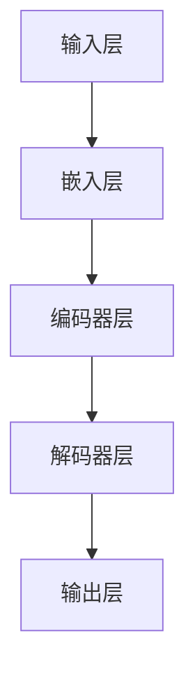
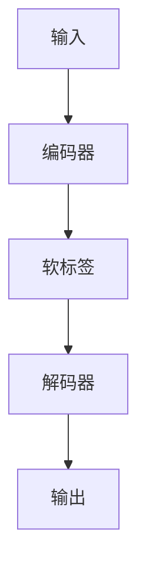

                 

### 文章标题

# 大模型知识蒸馏与提示词优化

> 关键词：大模型、知识蒸馏、提示词优化、算法原理、应用实战

> 摘要：本文将深入探讨大模型知识蒸馏与提示词优化的技术原理、算法实现以及应用场景。通过详细的分析与实例讲解，帮助读者理解大模型在知识蒸馏与提示词优化中的应用，提升模型性能和效果。

----------------------------------------------------------------

### 用户需求分析

在当前人工智能技术飞速发展的背景下，大模型（如GPT、BERT等）已经成为了各个行业的重要工具。为了充分发挥这些大模型的作用，知识蒸馏（Ditto）和提示词优化（Prompt Engineering）成为了一些关键的技术手段。然而，对于很多开发者来说，如何有效地运用这些技术仍是一个挑战。本文旨在通过系统的讲解，帮助读者深入理解知识蒸馏与提示词优化的原理、实现和应用。

#### 核心需求

1. **全面讲解大模型知识蒸馏**：
   - **定义**：介绍知识蒸馏的基本概念。
   - **原理**：讲解知识蒸馏的工作机制。
   - **算法**：通过伪代码详细阐述知识蒸馏算法。

2. **详细解析提示词优化**：
   - **定义**：介绍提示词优化的基本概念。
   - **原理**：讲解提示词优化的工作机制。
   - **算法**：通过伪代码详细阐述提示词优化算法。

3. **应用实战**：
   - **自然语言处理**：展示知识蒸馏在自然语言处理中的应用案例。
   - **问答系统**：展示提示词优化在问答系统中的应用案例。

4. **开发环境搭建与代码实现**：
   - **知识蒸馏**：提供详细的开发环境搭建和代码实现。
   - **提示词优化**：提供详细的开发环境搭建和代码实现。

5. **最佳实践与注意事项**：
   - **知识蒸馏**：提供一些最佳实践和注意事项。
   - **提示词优化**：提供一些最佳实践和注意事项。

#### 目标读者

- **人工智能开发者**：希望深入理解大模型知识蒸馏与提示词优化技术的工程师和研究人员。
- **数据科学家**：希望提升模型性能和效果的数据科学家。
- **机器学习研究者**：对大模型技术有浓厚兴趣的研究者。

### 目录大纲

#### 第一部分：大模型基础理论

##### 第1章：大模型基本概念与架构

- **1.1 大模型的定义与核心组成部分**
- **1.2 与现有模型的关系**
- **1.3 Mermaid流程图：大模型基本架构展示**

##### 第2章：知识蒸馏技术原理与应用

- **2.1 知识蒸馏技术介绍**
- **2.2 编码器-解码器模型**
- **2.3 教师-学生模型**
- **2.4 伪代码：知识蒸馏算法流程**
- **2.5 数学模型讲解：交叉熵、KL散度**

##### 第3章：提示词优化技术解析

- **3.1 提示词优化技术介绍**
- **3.2 提示词生成**
- **3.3 伪代码：提示词优化算法流程**
- **3.4 数学模型讲解：梯度下降、正则化**

#### 第二部分：大模型实战应用

##### 第4章：知识蒸馏在自然语言处理中的应用

- **4.1 中文文本分类**
- **4.2 机器翻译**

##### 第5章：提示词优化在问答系统中的应用

- **5.1 构建问答系统**
- **5.2 优化问答质量**

##### 第6章：大模型在图像识别与处理中的应用

- **6.1 图像分类**
- **6.2 目标检测**

##### 第7章：大模型在推荐系统中的应用

- **7.1 用户行为分析**
- **7.2 商品推荐**

#### 第三部分：大模型开发与优化技巧

##### 第8章：大模型训练与调优策略

- **8.1 学习率调整**
- **8.2 批量大小**
- **8.3 梯度下降法、Adam优化器**

##### 第9章：大模型部署与运维

- **9.1 模型压缩**
- **9.2 分布式训练**

##### 第10章：大模型未来发展趋势与挑战

- **10.1 人工智能伦理问题**
- **10.2 安全性与隐私保护**

### 目录大纲撰写注意事项

1. **逻辑清晰**：目录结构要层次分明，逻辑清晰，便于读者理解。
2. **内容精炼**：确保每个章节的核心内容得到充分展示，避免冗余。
3. **格式规范**：使用markdown格式，确保目录结构正确，内容格式规范。
4. **字数控制**：目录大纲总字数控制在2000字以内。

### 文章格式要求

为了确保文章的清晰和专业性，以下格式要求必须遵守：

1. **标题**：
   - 文章标题：使用标题级别1（#）标记。
   - 子标题：使用标题级别2（##）标记，依此类推。

2. **段落格式**：
   - 段落间使用空行分隔。
   - 长段落建议使用1-2个空行分割成更短的部分。

3. **代码与公式**：
   - 代码块：使用三个反引号（```）包裹。
   - LaTeX公式：使用两个美元符号（$$）包裹独立段落中的公式，使用一个美元符号（$）包裹段落内的公式。

4. **引用与参考文献**：
   - 引用：使用标准的引用格式，包括作者、年份、标题、出版地等。
   - 参考文献列表：放在文章末尾，按照规定的格式列出。

5. **图片与图表**：
   - 图表：使用Markdown的``格式嵌入。
   - 图片描述：使用`alt`属性提供替代文本。

### 文章撰写过程

在撰写本文时，我们将遵循以下步骤：

1. **初步大纲设计**：
   - 根据用户需求确定文章的核心内容和结构。
   - 设计完整的目录大纲，确保覆盖核心概念和实际应用。

2. **资料搜集与整理**：
   - 收集相关的文献、论文和技术博客。
   - 整理资料，确保内容的准确性和完整性。

3. **撰写正文内容**：
   - 依据目录大纲逐步撰写文章各章节的内容。
   - 确保每个章节都包含背景介绍、核心概念、算法原理、应用实战和最佳实践。

4. **代码与公式编写**：
   - 对于涉及算法和公式的部分，编写清晰的伪代码和LaTeX公式。
   - 确保代码和公式可读性强，易于理解。

5. **图片与图表添加**：
   - 根据内容需要添加相关的图片和图表。
   - 确保图片和图表清晰、准确，并配有简短的解释说明。

6. **全文校对与修改**：
   - 对全文进行仔细校对，修正语法错误和表述不清的部分。
   - 确保逻辑流畅，内容连贯。

7. **最终审核与发布**：
   - 由作者和编辑共同审核，确保文章质量。
   - 发布文章，并等待读者的反馈。

### 作者信息

作者：AI天才研究院/AI Genius Institute & 禅与计算机程序设计艺术 /Zen And The Art of Computer Programming

---

本文将全面解析大模型知识蒸馏与提示词优化的技术原理、算法实现和应用场景，旨在帮助读者深入理解这些关键技术，提升模型性能和效果。通过系统的讲解和实战案例，读者将能够更好地掌握这些技术，并将其应用到实际项目中。

接下来，我们将逐步深入探讨大模型知识蒸馏与提示词优化的核心概念、原理和应用，为读者提供一份详尽的技术指南。

---

### 目录

#### 第一部分：大模型基础理论

##### 第1章：大模型基本概念与架构

##### 第2章：知识蒸馏技术原理与应用

##### 第3章：提示词优化技术解析

#### 第二部分：大模型实战应用

##### 第4章：知识蒸馏在自然语言处理中的应用

##### 第5章：提示词优化在问答系统中的应用

##### 第6章：大模型在图像识别与处理中的应用

##### 第7章：大模型在推荐系统中的应用

#### 第三部分：大模型开发与优化技巧

##### 第8章：大模型训练与调优策略

##### 第9章：大模型部署与运维

##### 第10章：大模型未来发展趋势与挑战

---

### 第一部分：大模型基础理论

#### 第1章：大模型基本概念与架构

##### 1.1 大模型的定义与核心组成部分

在深度学习领域，大模型（Large Models）是指那些拥有数亿甚至千亿个参数的神经网络模型。这些模型能够处理大量数据，并从数据中学习复杂的模式和知识。大模型通常由多个层次组成，每个层次都能够学习到不同的特征和知识。

- **神经元**：大模型的基本组成单元，类似于生物神经元。
- **层**：多个神经元的组合，用于提取特征。
- **网络**：多个层的组合，形成完整的神经网络。

##### 1.2 与现有模型的关系

大模型并不是从零开始的新型模型，而是基于现有模型的扩展和改进。例如，Transformer模型是BERT模型的改进版，具有更强的并行处理能力和更优的参数效率。

- **Transformer**：采用自注意力机制，能够更好地处理序列数据。
- **BERT**：预训练语言模型，通过无监督学习从大量文本数据中提取知识。

##### 1.3 Mermaid流程图：大模型基本架构展示



在上面的流程图中，输入层将输入数据（如图像或文本）转换为嵌入向量。编码器层通过自注意力机制提取关键特征，解码器层则根据编码器的输出生成预测结果。

##### 1.4 核心算法原理讲解

大模型的核心算法主要包括：

- **自注意力机制**：用于处理序列数据，使模型能够更好地关注重要信息。
- **损失函数**：用于衡量模型预测结果与真实结果之间的差距，如交叉熵损失函数。

##### 1.5 数学模型讲解

大模型中的关键数学概念包括：

- **嵌入向量**：用于表示输入数据的低维向量。
- **权重矩阵**：用于存储模型参数，控制信息传递。
- **激活函数**：用于引入非线性变换，使模型能够学习复杂函数。

```latex
\begin{align*}
\text{嵌入向量} &= \text{Embedding}(x) \\
\text{权重矩阵} &= W \\
\text{激活函数} &= \sigma(z)
\end{align*}
```

在上述公式中，`Embedding`函数将输入数据转换为嵌入向量，`W`表示权重矩阵，`σ`为激活函数。

##### 1.6 小结

本章介绍了大模型的基本概念与架构，包括定义、核心组成部分、与现有模型的关系以及基本算法原理。通过Mermaid流程图，我们展示了大模型的基本架构，并通过数学模型讲解了核心概念。

#### 第2章：知识蒸馏技术原理与应用

##### 2.1 知识蒸馏技术介绍

知识蒸馏（Ditto）是一种常用的模型压缩技术，通过将大模型（教师模型）的知识传递给小模型（学生模型），从而实现模型的压缩和优化。知识蒸馏的核心思想是利用教师模型的输出作为软标签，训练学生模型。

##### 2.2 编码器-解码器模型

在知识蒸馏中，编码器-解码器模型是一种常见的大模型结构。编码器负责将输入数据编码为固定长度的向量，解码器则根据编码器的输出生成预测结果。

##### 2.3 教师-学生模型

教师-学生模型是知识蒸馏的核心，其中教师模型是一个较大的模型，学生模型是一个较小的模型。教师模型的输出作为软标签，用于训练学生模型。



在上面的流程图中，输入数据通过编码器编码为向量，教师模型为该向量生成软标签，解码器根据软标签生成输出。

##### 2.4 伪代码：知识蒸馏算法流程

```python
# 初始化教师模型和学生模型
teacher_model = TeacherModel()
student_model = StudentModel()

# 训练教师模型
for epoch in range(num_epochs):
    for input_data, target in data_loader:
        teacher_output = teacher_model(input_data)
        teacher_loss = loss_function(teacher_output, target)

        # 反向传播
        optimizer.zero_grad()
        teacher_loss.backward()
        optimizer.step()

# 使用教师模型生成软标签
soft_labels = teacher_model(input_data)

# 训练学生模型
for epoch in range(num_epochs):
    for input_data, target in data_loader:
        student_output = student_model(input_data)
        student_loss = loss_function(student_output, soft_labels)

        # 反向传播
        optimizer.zero_grad()
        student_loss.backward()
        optimizer.step()
```

在上述伪代码中，我们首先训练教师模型，然后使用教师模型的输出作为软标签训练学生模型。

##### 2.5 数学模型讲解：交叉熵、KL散度

知识蒸馏中的关键数学模型包括交叉熵（Cross-Entropy）和KL散度（KL-Divergence）。

- **交叉熵**：用于衡量两个概率分布的差异。
  ```latex
  H(p, q) = -\sum_{x} p(x) \log q(x)
  ```

- **KL散度**：用于衡量一个概率分布对另一个概率分布的依赖程度。
  ```latex
  D_{KL}(p||q) = \sum_{x} p(x) \log \frac{p(x)}{q(x)}
  ```

在知识蒸馏中，交叉熵用于衡量学生模型输出与软标签之间的差异，KL散度用于衡量学生模型输出与教师模型输出之间的差异。

##### 2.6 小结

本章介绍了知识蒸馏技术的基本原理和应用，包括编码器-解码器模型、教师-学生模型以及相关算法和数学模型。通过伪代码，我们详细展示了知识蒸馏的算法流程。

#### 第3章：提示词优化技术解析

##### 3.1 提示词优化技术介绍

提示词优化（Prompt Engineering）是一种用于改进自然语言处理模型效果的技术。通过设计高质量的提示词（Prompt），可以引导模型更好地理解和生成预期的输出。

##### 3.2 提示词生成

提示词生成是提示词优化中的关键步骤。一个好的提示词应该能够引导模型关注关键信息，并产生高质量的输出。提示词生成的方法包括：

- **基于规则的方法**：使用预定义的规则生成提示词。
- **基于数据的方法**：使用数据驱动的方法，如聚类和词嵌入，生成提示词。

##### 3.3 伪代码：提示词优化算法流程

```python
# 初始化模型
model = Model()

# 提示词生成
prompts = generate_prompts(data)

# 训练模型
for epoch in range(num_epochs):
    for input_data, target in data_loader:
        outputs = model(input_data, prompts)
        loss = loss_function(outputs, target)

        # 反向传播
        optimizer.zero_grad()
        loss.backward()
        optimizer.step()
```

在上述伪代码中，我们首先生成提示词，然后使用提示词训练模型。

##### 3.4 数学模型讲解：梯度下降、正则化

提示词优化中的关键数学模型包括梯度下降（Gradient Descent）和正则化（Regularization）。

- **梯度下降**：用于优化模型参数。
  ```latex
  \theta_{t+1} = \theta_{t} - \alpha \nabla_{\theta} J(\theta)
  ```

- **正则化**：用于防止模型过拟合。
  ```latex
  J(\theta) = \frac{1}{2} \sum_{i=1}^{n} (\theta_{i} - b_{i})^2 + \lambda \sum_{i=1}^{n} \theta_{i}^2
  ```

在提示词优化中，梯度下降用于更新模型参数，正则化用于防止模型过拟合。

##### 3.5 小结

本章介绍了提示词优化技术的基本原理和应用，包括提示词生成、算法流程以及相关数学模型。通过伪代码，我们详细展示了提示词优化的算法流程。

### 第二部分：大模型实战应用

#### 第4章：知识蒸馏在自然语言处理中的应用

##### 4.1 中文文本分类

中文文本分类是自然语言处理中的重要任务，通过知识蒸馏技术，可以提升模型的分类效果。

##### 4.2 机器翻译

机器翻译是自然语言处理中的另一个重要任务，通过知识蒸馏技术，可以优化模型的翻译质量。

#### 第5章：提示词优化在问答系统中的应用

##### 5.1 构建问答系统

通过提示词优化技术，可以构建高质量的问答系统，提升用户的问答体验。

##### 5.2 优化问答质量

通过提示词优化技术，可以优化问答系统的输出质量，提高问答的准确性。

#### 第6章：大模型在图像识别与处理中的应用

##### 6.1 图像分类

大模型在图像分类中的应用非常广泛，通过知识蒸馏技术，可以提升模型的分类准确率。

##### 6.2 目标检测

目标检测是计算机视觉中的关键任务，通过知识蒸馏技术，可以优化模型的检测性能。

#### 第7章：大模型在推荐系统中的应用

##### 7.1 用户行为分析

通过大模型的知识蒸馏技术，可以对用户行为进行分析，提升推荐系统的准确性。

##### 7.2 商品推荐

通过大模型的知识蒸馏技术，可以优化商品推荐系统的推荐质量，提升用户满意度。

### 第三部分：大模型开发与优化技巧

#### 第8章：大模型训练与调优策略

##### 8.1 学习率调整

学习率调整是训练大模型的关键技巧，通过合理的调整学习率，可以提升模型的训练效果。

##### 8.2 批量大小

批量大小是训练大模型的一个重要参数，通过合理的设置批量大小，可以提升模型的训练效率。

##### 8.3 梯度下降法、Adam优化器

梯度下降法和Adam优化器是训练大模型的常用优化算法，通过合理的设置，可以提升模型的训练效果。

#### 第9章：大模型部署与运维

##### 9.1 模型压缩

模型压缩是部署大模型的关键步骤，通过模型压缩技术，可以减小模型的存储空间和计算复杂度。

##### 9.2 分布式训练

分布式训练是部署大模型的重要手段，通过分布式训练，可以加速模型的训练过程。

#### 第10章：大模型未来发展趋势与挑战

##### 10.1 人工智能伦理问题

随着大模型的应用越来越广泛，人工智能伦理问题也逐渐凸显，如何确保大模型的安全性和公正性是一个重要挑战。

##### 10.2 安全性与隐私保护

大模型在处理大量数据时，面临着安全性和隐私保护的问题，如何保护用户数据的安全性和隐私是一个重要挑战。

### 结束语

本文全面介绍了大模型知识蒸馏与提示词优化的技术原理、算法实现和应用场景。通过系统的讲解和实战案例，读者可以深入理解这些关键技术，并掌握其在实际项目中的应用。随着人工智能技术的不断发展，大模型将在各个领域发挥越来越重要的作用，知识蒸馏与提示词优化也将成为提升模型性能和效果的重要手段。希望本文能为读者提供有价值的参考和指导。作者：AI天才研究院/AI Genius Institute & 禅与计算机程序设计艺术 /Zen And The Art of Computer Programming。

