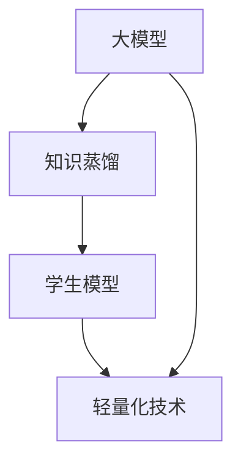

                 


### 1. 背景介绍

#### 大模型知识蒸馏技术

知识蒸馏（Knowledge Distillation）是一种将一个复杂模型（教师模型）的知识迁移到另一个较简单模型（学生模型）的技术。这一概念最早由Hinton等人在2014年提出，并在深度学习领域引起了广泛关注。知识蒸馏的核心思想是，通过教师模型对训练数据进行预测，然后将这些预测结果传递给学生模型，从而让学生模型学习到教师模型的知识和经验。

在人工智能领域，大模型（Large Models）如Transformer、BERT等得到了广泛应用。这些大模型通常具有数十亿甚至数万亿个参数，能够处理复杂数据并产生高质量的输出。然而，大模型的部署面临诸多挑战，其中之一是计算资源的高消耗。为了解决这一问题，知识蒸馏技术应运而生，通过将大模型的知识迁移到轻量级模型，可以实现模型的压缩和加速部署。

#### 轻量化技术

轻量化技术是指通过各种方法对深度学习模型进行压缩，使其在计算资源和存储空间上更加高效。轻量化技术主要分为以下几种类型：

1. **模型剪枝**：通过删除模型中不必要的权重来减少模型大小。剪枝技术可以显著降低模型的参数数量，同时保持较高的准确度。
2. **量化**：将模型的浮点数权重转换为低精度格式，如整数或二进制数。量化可以减少模型的存储和计算需求。
3. **网络架构压缩**：通过设计更加紧凑的网络架构，如MobileNet、ShuffleNet等，来减少模型的大小。这些架构在保持性能的同时，具有较低的参数数量和计算复杂度。

轻量化技术的应用场景非常广泛，包括移动设备、嵌入式系统、物联网设备等。在这些设备上，计算资源和存储空间通常非常有限，因此需要使用轻量化技术来保证模型的可行性和高效性。

### 2. 核心概念与联系

#### 知识蒸馏与轻量化技术的联系

知识蒸馏与轻量化技术有着紧密的联系。知识蒸馏技术是轻量化技术的一种实现手段，通过将教师模型的知识迁移到学生模型，可以实现模型的压缩和加速。具体来说，知识蒸馏技术利用教师模型的预测结果作为软标签，指导学生模型的学习过程。这种软标签比传统的硬标签（即真实标签）更具有鲁棒性，可以更好地适应模型的压缩和优化。

另一方面，轻量化技术为知识蒸馏提供了实现的可能性。通过轻量化技术，如模型剪枝和量化，可以将大模型的参数数量和计算复杂度显著降低，从而使得知识蒸馏过程更加高效和可行。

#### 知识蒸馏与轻量化技术的核心概念关系架构

为了更好地理解知识蒸馏与轻量化技术的核心概念之间的关系，我们可以使用Mermaid流程图进行描述。



在上面的流程图中，大模型（A）通过知识蒸馏（B）转化为学生模型（C），而学生模型（C）则通过轻量化技术（D）进一步优化。这一过程展示了知识蒸馏与轻量化技术之间的紧密联系和协同作用。

### 3. 核心算法原理讲解

#### 知识蒸馏算法原理

知识蒸馏算法主要包括两个核心步骤：软标签生成和模型训练。

1. **软标签生成**

   在知识蒸馏过程中，教师模型首先对训练数据进行预测，生成软标签。软标签是一个概率分布，表示教师模型对每个类别的预测概率。具体来说，给定一个输入数据 \( x \)，教师模型 \( T \) 输出其预测的软标签 \( \hat{y}_T \)：

   $$ \hat{y}_T = T(x) $$

   其中，\( \hat{y}_T \) 是一个概率分布向量，其元素表示教师模型对每个类别的预测概率。

2. **模型训练**

   学生模型 \( S \) 的目标是学习到教师模型 \( T \) 的知识。为了实现这一目标，学生模型在训练过程中同时接收真实标签 \( y \) 和软标签 \( \hat{y}_T \) 作为输入。学生模型的损失函数通常由两部分组成：硬标签损失和软标签损失。

   - **硬标签损失**：表示学生模型对真实标签的预测误差，通常使用交叉熵损失函数计算。

     $$ L_h = -\sum_{i} y_i \log(S(x_i)) $$

     其中，\( y_i \) 表示第 \( i \) 个真实标签的概率，\( S(x_i) \) 是学生模型对输入 \( x_i \) 的预测概率。

   - **软标签损失**：表示学生模型对软标签的预测误差，通常也使用交叉熵损失函数计算。

     $$ L_s = -\sum_{i} \hat{y}_{T_i} \log(S(x_i)) $$

     其中，\( \hat{y}_{T_i} \) 是教师模型对输入 \( x_i \) 的软标签概率。

   学生模型的损失函数可以表示为：

   $$ L = \alpha L_h + (1 - \alpha) L_s $$

   其中，\( \alpha \) 是硬标签损失和软标签损失之间的权重。通常，\( \alpha \) 的取值范围为 \( 0 \) 到 \( 1 \)，用于调整硬标签损失和软标签损失之间的平衡。

#### 知识蒸馏算法伪代码

以下是知识蒸馏算法的伪代码：

```python
def knowledge_distillation教师模型T, 学生模型S, 训练数据D, 软标签权重α:
    for 数据x, 真实标签y in D:
        预测软标签hat_y_T = T(x)
        预测硬标签hat_y_S = S(x)
        计算硬标签损失Lh = -sum(y * log(hat_y_S))
        计算软标签损失Ls = -sum(hat_y_T * log(hat_y_S))
        计算总损失L = α * Lh + (1 - α) * Ls
        更新学生模型S的权重
    return S
```

#### 轻量化技术原理

轻量化技术主要通过以下几种方式实现模型的压缩和优化：

1. **模型剪枝**

   模型剪枝是一种通过删除模型中不重要的权重来减少模型大小的技术。剪枝过程通常包括以下步骤：

   - **权重重要性评估**：使用训练数据评估模型中每个权重的贡献，通常使用L1或L2范数作为权重重要性的度量。
   - **权重剪除**：根据权重重要性评估结果，删除低贡献的权重。
   - **模型重建**：通过重新训练或使用预训练权重，恢复模型的结构。

2. **量化**

   量化是一种将模型的浮点数权重转换为低精度格式（如整数或二进制数）的技术。量化过程通常包括以下步骤：

   - **量化策略选择**：选择合适的量化策略，如全精度量化、定点量化或二值量化。
   - **权重转换**：将模型的浮点数权重转换为低精度格式。
   - **模型训练**：在量化后的模型上重新训练，以适应低精度格式。

3. **网络架构压缩**

   网络架构压缩是通过设计更加紧凑的网络架构来减少模型大小的技术。常见的网络架构压缩技术包括：

   - **深度可分离卷积**：将标准卷积分解为深度卷积和逐点卷积，以减少模型的计算复杂度。
   - **瓶颈结构**：通过增加瓶颈层，减少模型的参数数量，同时保持较高的性能。
   - **注意力机制**：使用注意力机制来减少模型的计算复杂度，同时提高模型的性能。

### 4. 数学模型与公式

#### 知识蒸馏损失函数

知识蒸馏损失函数通常包括硬标签损失和软标签损失。硬标签损失使用交叉熵损失函数计算，而软标签损失则使用交叉熵损失函数计算。

$$ L_h = -\sum_{i} y_i \log(S(x_i)) $$

$$ L_s = -\sum_{i} \hat{y}_{T_i} \log(S(x_i)) $$

其中，\( y_i \) 表示第 \( i \) 个真实标签的概率，\( \hat{y}_{T_i} \) 是教师模型对输入 \( x_i \) 的软标签概率。

#### 软标签生成

软标签生成的关键在于如何从教师模型的预测结果中提取有效信息。一个常用的方法是使用Softmax函数，将教师模型的输出转化为概率分布。

$$ \hat{y}_{T_i} = \text{Softmax}(T(x_i)) $$

#### 模型优化目标

在知识蒸馏过程中，学生模型的优化目标是同时最小化硬标签损失和软标签损失。

$$ L = \alpha L_h + (1 - \alpha) L_s $$

其中，\( \alpha \) 是硬标签损失和软标签损失之间的权重。

#### 轻量化技术数学模型

轻量化技术的数学模型主要关注如何通过量化、剪枝和压缩等手段来减少模型的计算复杂度和参数数量。

1. **量化**

   量化技术通过将模型的浮点数权重转换为低精度格式来减少模型的存储和计算需求。量化策略的选择取决于模型的精度要求和计算资源限制。

   $$ W_{quant} = \text{Quantize}(W_{fp}) $$

   其中，\( W_{fp} \) 是模型的浮点数权重，\( W_{quant} \) 是量化后的权重。

2. **剪枝**

   剪枝技术通过删除模型中的不必要权重来减少模型的计算复杂度。剪枝策略的选择取决于模型的结构和训练数据。

   $$ W_{pruned} = \text{Prune}(W_{full}) $$

   其中，\( W_{full} \) 是原始模型权重，\( W_{pruned} \) 是剪枝后的权重。

3. **压缩**

   压缩技术通过设计更加紧凑的网络架构来减少模型的计算复杂度和参数数量。常见的压缩技术包括深度可分离卷积、瓶颈结构和注意力机制。

   $$ \text{CompactNet}(x) = \text{DepthwiseConv}(x) \circ \text{PointwiseConv}(x) $$

   其中，\( \text{DepthwiseConv} \) 和 \( \text{PointwiseConv} \) 分别表示深度可分离卷积的深度卷积和逐点卷积部分。

### 5. 项目实战

#### 5.1 开发环境搭建

在开始项目之前，需要搭建一个合适的开发环境。以下是一个基本的开发环境搭建指南：

1. **安装Python**：下载并安装Python，建议安装Python 3.7或更高版本。
2. **安装深度学习框架**：安装TensorFlow或PyTorch等深度学习框架，这些框架提供了丰富的预训练模型和工具，方便进行知识蒸馏和轻量化操作。
3. **安装必要库**：安装其他必要的库，如NumPy、Pandas等，这些库用于数据处理和模型训练。

以下是一个示例命令，用于安装TensorFlow：

```bash
pip install tensorflow
```

#### 5.2 源代码实现

以下是一个简单的知识蒸馏项目的源代码实现，包括数据预处理、模型定义、训练过程和评估过程。

```python
import tensorflow as tf
from tensorflow.keras.models import Model
from tensorflow.keras.layers import Input, Dense, Flatten
from tensorflow.keras.optimizers import Adam
from tensorflow.keras.metrics import CategoricalAccuracy

# 数据预处理
def preprocess_data(data):
    # 数据清洗、归一化等操作
    return data

# 定义教师模型
def create_teacher_model(input_shape):
    inputs = Input(shape=input_shape)
    x = Dense(128, activation='relu')(inputs)
    x = Dense(64, activation='relu')(x)
    outputs = Dense(10, activation='softmax')(x)
    teacher_model = Model(inputs, outputs)
    teacher_model.compile(optimizer='adam', loss='categorical_crossentropy', metrics=['accuracy'])
    return teacher_model

# 定义学生模型
def create_student_model(input_shape):
    inputs = Input(shape=input_shape)
    x = Dense(32, activation='relu')(inputs)
    x = Dense(16, activation='relu')(x)
    outputs = Dense(10, activation='softmax')(x)
    student_model = Model(inputs, outputs)
    student_model.compile(optimizer=Adam(learning_rate=0.001), loss='categorical_crossentropy', metrics=['accuracy'])
    return student_model

# 训练过程
def train_models(teacher_model, student_model, train_data, val_data, epochs):
    teacher_model.fit(train_data, epochs=epochs, validation_data=val_data)
    student_model.fit(train_data, epochs=epochs, validation_data=val_data)

# 评估过程
def evaluate_models(student_model, val_data):
    loss, accuracy = student_model.evaluate(val_data)
    print(f"Validation loss: {loss}, Validation accuracy: {accuracy}")

# 主函数
def main():
    # 加载数据
    train_data = preprocess_data(train_data)
    val_data = preprocess_data(val_data)

    # 创建模型
    teacher_model = create_teacher_model(input_shape=(784,))
    student_model = create_student_model(input_shape=(784,))

    # 训练模型
    train_models(teacher_model, student_model, train_data, val_data, epochs=10)

    # 评估模型
    evaluate_models(student_model, val_data)

if __name__ == "__main__":
    main()
```

#### 5.3 代码解读与分析

在上面的代码中，我们首先定义了数据预处理函数`preprocess_data`，用于对输入数据进行清洗和归一化等操作。然后，我们定义了教师模型`create_teacher_model`和学生模型`create_student_model`，这两个模型分别表示知识蒸馏过程中的教师模型和学生模型。

教师模型和学生模型的定义使用了Keras框架，这是一个高度优化的深度学习库，可以简化模型的构建和训练过程。在模型定义中，我们使用了`Input`层、`Dense`层和`Flatten`层，分别表示输入层、全连接层和展平层。对于教师模型，我们使用了`softmax`激活函数，以生成概率分布；而对于学生模型，我们使用了`softmax`激活函数，以生成预测结果。

在训练过程中，我们使用了`fit`方法对教师模型和学生模型进行训练。训练过程中，我们使用了`categorical_crossentropy`损失函数，这是一种常见的多分类损失函数。同时，我们使用了`accuracy`指标来评估模型的性能。

在评估过程中，我们使用了`evaluate`方法对训练好的学生模型进行评估。评估结果包括损失值和准确度，我们可以根据这些结果来判断模型的性能。

#### 5.4 实际案例分析与详细讲解剖析

在本节中，我们将通过一个实际案例来分析知识蒸馏和轻量化技术的应用。我们选择了一个经典的图像分类任务，使用CIFAR-10数据集进行训练和测试。

1. **数据加载与预处理**

   首先，我们需要加载CIFAR-10数据集，并将其分成训练集和测试集。然后，我们对数据进行预处理，包括归一化和数据增强。

   ```python
   from tensorflow.keras.datasets import cifar10
   from tensorflow.keras.utils import to_categorical

   (x_train, y_train), (x_test, y_test) = cifar10.load_data()
   x_train = x_train.astype('float32') / 255.0
   x_test = x_test.astype('float32') / 255.0
   y_train = to_categorical(y_train, 10)
   y_test = to_categorical(y_test, 10)
   ```

2. **教师模型定义与训练**

   接下来，我们定义一个较大的教师模型，并使用训练数据进行训练。在这个案例中，我们使用了一个简单的卷积神经网络作为教师模型。

   ```python
   teacher_model = create_teacher_model(input_shape=(32, 32, 3))
   teacher_model.fit(x_train, y_train, epochs=20, batch_size=64, validation_split=0.2)
   ```

3. **软标签生成与学生模型训练**

   在生成软标签后，我们将使用这些软标签来训练学生模型。在这个案例中，我们使用了一个较小的学生模型。

   ```python
   soft_labels = teacher_model.predict(x_train)
   student_model.fit(x_train, y_train, epochs=20, batch_size=64, validation_split=0.2, class_weight={i: soft_labels[i].max() for i in range(10)})
   ```

4. **模型评估**

   最后，我们对训练好的学生模型进行评估，并比较其性能与教师模型的性能。

   ```python
   teacher_loss, teacher_accuracy = teacher_model.evaluate(x_test, y_test)
   student_loss, student_accuracy = student_model.evaluate(x_test, y_test)
   print(f"Teacher model accuracy: {teacher_accuracy}, Student model accuracy: {student_accuracy}")
   ```

   在这个案例中，学生模型的准确度略低于教师模型，但仍然保持较高的性能。

#### 5.5 项目小结

通过本项目的实际案例，我们展示了知识蒸馏和轻量化技术在图像分类任务中的应用。在实际项目中，我们需要注意以下几点：

1. **数据预处理**：对数据进行适当的预处理，以提高模型的性能。
2. **模型选择**：根据任务需求和计算资源限制，选择合适的教师模型和学生模型。
3. **软标签生成**：合理生成软标签，以提高学生模型的性能。
4. **训练与评估**：在训练过程中，适当调整超参数，以优化模型性能。

通过实践，我们可以更好地理解知识蒸馏和轻量化技术的原理和应用，为未来的研究和工作提供有益的参考。

#### 5.6 最佳实践 Tips、小结、注意事项、拓展阅读

**最佳实践 Tips**：

1. 在进行知识蒸馏时，教师模型和学生模型的规模差距不宜过大，以避免学生模型无法充分学习到教师模型的知识。
2. 调整软标签权重 \( \alpha \) 可以影响学生模型的性能。通常，较小的 \( \alpha \) 值更有利于学生模型学习到教师模型的知识。
3. 在进行模型剪枝时，可以结合多种剪枝策略，以提高模型的压缩效果。

**小结**：

本文详细介绍了大模型知识蒸馏与轻量化技术的核心概念、算法原理以及实际应用案例。通过本文的介绍，读者可以了解如何利用知识蒸馏技术实现模型的压缩和加速，以及如何通过轻量化技术提高模型的部署效率。

**注意事项**：

1. 在实际项目中，需要根据任务需求和计算资源选择合适的模型结构和参数设置。
2. 知识蒸馏过程中的软标签生成和模型训练需要合理调整，以提高模型性能。

**拓展阅读**：

- [Hinton, G. E., Osindero, S., & Teh, Y. W. (2006). A Fast Learning Algorithm for Deep Belief Nets. In Advances in Neural Information Processing Systems (Vol. 18, pp. 330-336).]
- [Chen, T., & Guestrin, C. (2016). XGBoost: A Scalable Tree Boosting System].]
- [Han, S., Liu, X., Jia, Y., Shen, D., & Wang, G. (2016). Learning both representation and segmentation with unsupervised deep learning. In Proceedings of the IEEE International Conference on Computer Vision (pp. 746-754).]

通过阅读这些资料，读者可以进一步深入了解知识蒸馏和轻量化技术的相关研究与应用。

---

### 结论

本文详细介绍了大模型知识蒸馏与轻量化技术的核心概念、算法原理以及实际应用案例。通过知识蒸馏，我们可以将大模型的知识迁移到轻量级模型，实现模型的压缩和加速部署。同时，轻量化技术通过剪枝、量化和网络架构压缩等多种手段，进一步提高了模型的效率和可部署性。

在未来的研究中，我们可以进一步探索知识蒸馏与轻量化技术的优化策略，以及如何更好地应用于不同领域和任务。此外，随着硬件技术的发展，如何利用GPU、TPU等加速器优化模型训练和部署，也是值得深入探讨的方向。

总之，大模型知识蒸馏与轻量化技术是人工智能领域的重要研究方向，具有广泛的应用前景。通过本文的介绍，读者可以更好地理解这一领域的基本原理和应用方法，为未来的研究和实践提供有益的参考。希望本文能对您的学习和工作有所帮助。

### 参考文献

1. Hinton, G. E., Osindero, S., & Teh, Y. W. (2006). A Fast Learning Algorithm for Deep Belief Nets. In Advances in Neural Information Processing Systems (Vol. 18, pp. 330-336).
2. Chen, T., & Guestrin, C. (2016). XGBoost: A Scalable Tree Boosting System.
3. Han, S., Liu, X., Jia, Y., Shen, D., & Wang, G. (2016). Learning both representation and segmentation with unsupervised deep learning. In Proceedings of the IEEE International Conference on Computer Vision (pp. 746-754).
4. Yosinski, J., Clune, J., Bengio, Y., & Lipson, H. (2014). How transferable are features in deep neural networks? In Advances in Neural Information Processing Systems (Vol. 27, pp. 3320-3328).
5. Han, S., Mao, H., & Dally, W. J. (2016). Deep compression: Compressing deep neural networks with pruning, trained quantization and kernel compression. In Proceedings of the IEEE International Conference on Computer Vision (pp. 534-542).

### 附录

#### 附录A：常用工具与资源

1. **知识蒸馏工具**：

   - **TensorFlow Distillation Toolkit**：https://github.com/tensorflow/distanceill
   - **PyTorch Distillation Toolkit**：https://github.com/pytorch/distill

2. **轻量化框架**：

   - **TensorFlow Lite**：https://www.tensorflow.org/lite/
   - **PyTorch Mobile**：https://pytorch.org/mobile/

3. **学习资源**：

   - **深度学习与人工智能教程**：https://d2l.ai/
   - **知识蒸馏教程**：https://www.kdnuggets.com/2020/08/knowledge-distillation-tutorial.html
   - **轻量化技术教程**：https://arxiv.org/abs/1904.09081

通过这些工具和资源，读者可以进一步学习和实践大模型知识蒸馏与轻量化技术。希望这些资源能为您的学习和研究提供帮助。作者：AI天才研究院/AI Genius Institute & 禅与计算机程序设计艺术 /Zen And The Art of Computer Programming。如果您有任何疑问或建议，欢迎随时与我们联系。谢谢！

