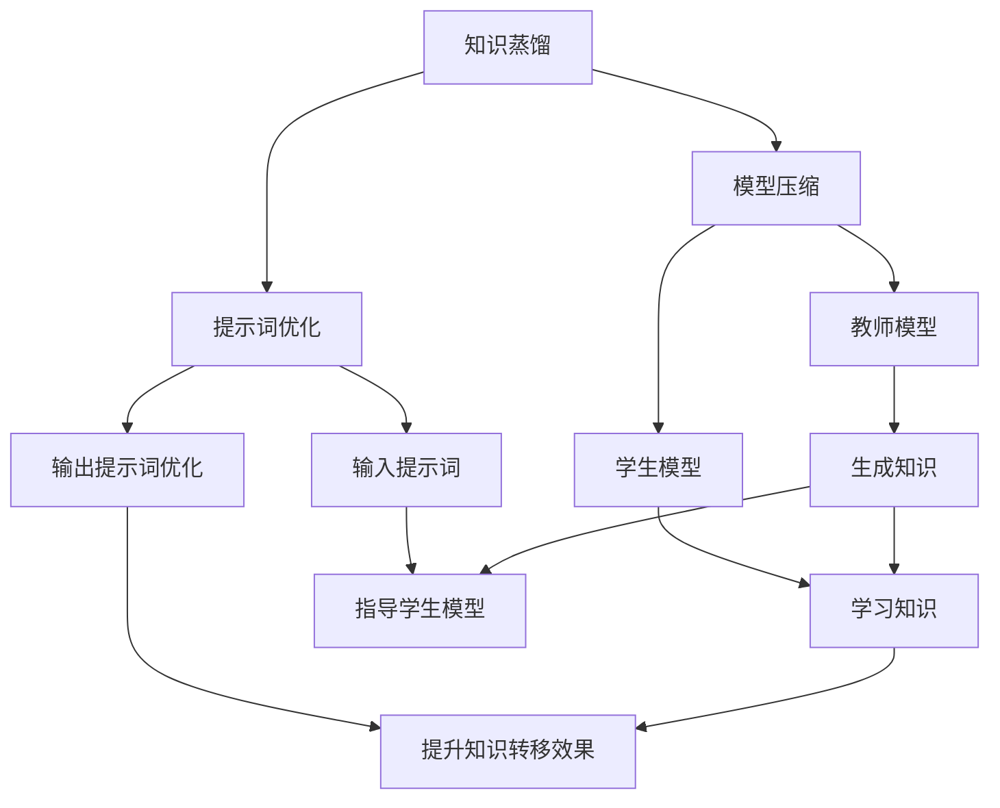

                 

### 大模型知识蒸馏：背景介绍

近年来，随着深度学习技术的迅猛发展，大模型（Large Models）在自然语言处理（NLP）、计算机视觉（CV）、语音识别（ASR）等领域取得了显著的成果。然而，大模型的训练和部署面临着巨大的挑战，如计算资源的高需求、存储空间的占用以及模型传输的延迟等问题。为了解决这些问题，知识蒸馏（Knowledge Distillation）技术应运而生。

**知识蒸馏的基本概念**

知识蒸馏是一种将教师模型（Teacher Model）的知识转移到学生模型（Student Model）上的技术。在这个过程中，教师模型通常是一个参数较多的大模型，而学生模型是一个参数较少的小模型。通过训练，学生模型能够学习到教师模型的核心知识和特征，从而实现压缩模型和加速部署的目的。

**知识蒸馏的应用背景**

在现实世界中，知识蒸馏技术主要用于以下几个方面：

1. **模型压缩**：通过知识蒸馏，可以将一个复杂的大模型转化为一个参数更少的小模型，从而减少模型的存储空间和计算需求。

2. **加速部署**：由于小模型的计算复杂度较低，可以显著缩短模型部署的时间，提高系统的响应速度。

3. **迁移学习**：知识蒸馏可以帮助小模型快速适应新的任务，从而提高模型的泛化能力。

4. **跨模态学习**：知识蒸馏可以促进不同模态（如文本、图像、音频）之间的知识共享，从而实现跨模态的模型压缩和加速部署。

**知识蒸馏的挑战与机遇**

尽管知识蒸馏技术在理论上具有显著的优越性，但在实际应用中仍然面临着一些挑战：

1. **性能损失**：由于学生模型是通过对教师模型进行压缩得到的，可能会导致性能损失，特别是在处理复杂任务时。

2. **计算成本**：知识蒸馏过程需要大量的计算资源，特别是在训练大模型和生成教师模型的阶段。

3. **调优难度**：知识蒸馏涉及到多个参数的调优，如温度参数、学习率等，这对模型性能的优化提出了较高的要求。

然而，随着计算能力的提升和优化算法的发展，知识蒸馏技术也面临着广阔的机遇：

1. **硬件加速**：随着硬件技术的发展，如GPU、TPU等加速卡的出现，可以显著降低知识蒸馏的计算成本。

2. **算法改进**：研究人员不断提出新的知识蒸馏算法，如基于自监督学习的知识蒸馏、基于元学习的知识蒸馏等，这些新方法有望提升知识蒸馏的性能。

3. **多模态学习**：随着多模态数据的广泛应用，知识蒸馏在跨模态学习中的应用前景更加广阔。

综上所述，知识蒸馏技术在大模型领域具有重要的研究价值和实际应用潜力，值得我们深入探讨和优化。

### 核心概念与联系：知识蒸馏、模型压缩与提示词优化

为了更深入地理解大模型知识蒸馏，我们需要明确几个核心概念：知识蒸馏、模型压缩和提示词优化，并探讨它们之间的关系。

**知识蒸馏（Knowledge Distillation）**

知识蒸馏是一种通过将教师模型（Teacher Model）的知识转移到学生模型（Student Model）上的技术。教师模型通常是一个参数较多、性能较好的大模型，而学生模型是一个参数较少、计算效率较高的小模型。知识蒸馏的目标是使学生模型能够保留教师模型的核心知识和特征，从而在压缩模型的同时保持或提升模型性能。

**模型压缩（Model Compression）**

模型压缩是指通过各种技术手段减少模型的参数数量、计算复杂度和存储需求，以便在资源受限的环境中进行训练和部署。模型压缩的常见方法包括剪枝（Pruning）、量化（Quantization）、知识蒸馏（Knowledge Distillation）等。知识蒸馏是模型压缩的一种有效手段，通过将教师模型的知识转移到学生模型，实现参数减少的同时保持模型性能。

**提示词优化（Prompt Optimization）**

提示词优化是近年来在自然语言处理（NLP）领域兴起的一种技术。提示词是一种特殊的输入，用于引导模型生成特定类型的输出。在知识蒸馏过程中，提示词优化可以用来增强学生模型对教师模型的模仿能力，从而提升知识转移的效果。

**核心概念之间的关系架构**

为了更好地理解这些概念之间的关系，我们可以使用Mermaid流程图来展示知识蒸馏、模型压缩和提示词优化的流程和相互作用。



**流程图解释**

1. **知识蒸馏**：教师模型（D）通过训练生成知识（H），这些知识被传递给学生模型（E）。学生模型通过学习知识（I）来模仿教师模型的性能。

2. **模型压缩**：模型压缩过程涉及教师模型（D）和学生模型（E）的构建。通过知识蒸馏，学生模型能够保留教师模型的核心特征，实现参数减少。

3. **提示词优化**：输入提示词（F）用于指导学生模型（E）生成输出提示词优化（G）。优化后的提示词（G）可以提升学生模型对教师模型知识的模仿效果。

通过这个Mermaid流程图，我们可以清晰地看到知识蒸馏、模型压缩和提示词优化之间的相互作用和依赖关系。这些核心概念共同构成了大模型知识蒸馏的框架，为后续的算法设计和优化提供了理论基础。

### 大模型知识蒸馏的核心算法原理

在知识蒸馏过程中，核心算法的原理和数学模型是理解和应用这一技术的基础。下面，我们将详细讲解大模型知识蒸馏的核心算法原理，并使用伪代码和数学公式进行阐述。

**算法原理**

知识蒸馏的核心思想是将教师模型的输出信息传递给学生模型，使得学生模型能够模仿教师模型的行为。这一过程通常包括以下步骤：

1. **编码器-解码器架构**：教师模型和学生模型通常采用编码器-解码器架构。编码器（Encoder）负责将输入数据编码为特征表示，解码器（Decoder）则根据特征表示生成输出。

2. **知识传递**：教师模型生成的输出被作为“软标签”（Soft Label），传递给学生模型。软标签是对教师模型输出的概率分布，而不是简单的硬标签（Hard Label）。

3. **损失函数**：在训练过程中，学生模型同时学习两个损失：一个是基于学生模型输出的软标签和教师模型输出之间的损失，另一个是基于学生模型输出的硬标签和软标签之间的损失。这两个损失共同驱动学生模型的优化过程。

**数学模型和公式**

为了更好地理解知识蒸馏的数学原理，我们使用以下公式：

1. **特征表示**：设输入数据为 $X$，编码器输出的特征表示为 $Z$：
   $$ Z = Encoder(X) $$

2. **软标签**：教师模型的输出被表示为概率分布 $Y_{soft}$：
   $$ Y_{soft} = Teacher(Z) $$

3. **硬标签**：假设训练数据集的标签为 $Y_{hard}$，通常使用交叉熵损失函数来计算硬标签和软标签之间的差距：
   $$ L_{hard} = -\sum_{i} Y_{hard,i} \log(Y_{soft,i}) $$

4. **知识蒸馏损失**：学生模型的输出与教师模型的软标签之间的差距也通过交叉熵损失函数来衡量：
   $$ L_{distill} = -\sum_{i} Y_{soft,i} \log(Y_{student,i}) $$

5. **总损失函数**：学生模型的优化目标是同时最小化硬标签和软标签的损失：
   $$ L_{total} = \alpha L_{hard} + (1 - \alpha) L_{distill} $$
   其中，$\alpha$ 是调节两个损失权重的一个超参数。

**伪代码**

下面是一个简化的知识蒸馏算法的伪代码：

```python
# 伪代码：知识蒸馏算法
for epoch in range(num_epochs):
    for batch in data_loader:
        # 前向传播
        Z = encoder(batch.input_data)
        Y_soft = teacher(Z)
        Y_student = decoder(Z)

        # 计算损失
        L_hard = -sum(Y_hard * log(Y_soft))
        L_distill = -sum(Y_soft * log(Y_student))

        # 计算总损失
        L_total = alpha * L_hard + (1 - alpha) * L_distill

        # 反向传播和优化
        optimizer.zero_grad()
        L_total.backward()
        optimizer.step()

# 超参数设置
alpha = 0.5
```

**详细讲解和举例说明**

1. **特征表示**：编码器将输入数据（如文本、图像）编码为特征表示。例如，对于文本数据，可以使用词嵌入（Word Embedding）将单词转换为向量表示。

2. **软标签**：教师模型根据编码器输出的特征表示生成概率分布。例如，在文本分类任务中，教师模型会为每个类别生成一个概率分布。

3. **硬标签和损失函数**：硬标签是训练数据集的真实标签，通常使用交叉熵损失函数来计算硬标签和学生模型输出之间的差距。

4. **知识蒸馏损失**：软标签和学生模型输出之间的差距也通过交叉熵损失函数来衡量，这一损失驱动学生模型学习教师模型的知识。

5. **总损失函数**：总损失函数是硬标签损失和知识蒸馏损失的组合，通过调整权重$\alpha$，可以控制两个损失的比例。

通过上述讲解和伪代码示例，我们可以看到知识蒸馏算法的核心原理和数学基础。这些原理为设计更高效的知识蒸馏算法提供了指导，也为后续的优化和应用奠定了基础。

### 提示词优化：定义、方法与应用

提示词优化是近年来在自然语言处理（NLP）领域兴起的一种关键技术，旨在通过优化输入提示词来提升模型生成质量。本文将详细探讨提示词优化的基本概念、常见方法及其在知识蒸馏中的应用。

**提示词优化的定义**

提示词（Prompt）是一种特殊的输入，用于引导模型生成特定类型的输出。在知识蒸馏过程中，提示词优化（Prompt Optimization）是指通过优化输入提示词，增强学生模型对教师模型知识的模仿效果，从而提升模型性能。

**提示词优化的方法**

1. **基于规则的提示词设计**：
   - **模板匹配**：根据预定义的模板生成提示词，模板中包含关键词和结构化的信息。
   - **规则生成**：使用规则系统或语法分析器自动生成提示词，确保提示词包含关键信息和结构化特征。

2. **基于机器学习的提示词生成**：
   - **自监督学习**：使用大量未标注的数据训练生成提示词，模型能够从数据中学习到有效的提示词模式。
   - **强化学习**：通过试错和奖励机制优化提示词生成，使模型能够在特定任务上生成更高质量的提示词。

3. **基于神经网络的提示词优化**：
   - **序列到序列模型**：使用序列到序列（Seq2Seq）模型生成提示词，模型可以从大量文本数据中学习到有效的提示词结构。
   - **生成对抗网络（GAN）**：利用生成对抗网络生成高质量的提示词，GAN可以生成与真实提示词相似的提示词。

**提示词优化的应用**

在知识蒸馏中，提示词优化可以显著提升学生模型的性能。以下是几种常见的应用场景：

1. **文本生成**：在文本分类、机器翻译等任务中，通过优化提示词，可以增强模型对特定文本类型的生成能力。

2. **问答系统**：在问答系统中，通过优化提示词，可以引导模型生成更准确、更相关的回答。

3. **对话生成**：在聊天机器人中，通过优化提示词，可以生成更自然、更有逻辑性的对话。

**实际案例**

以机器翻译任务为例，假设教师模型是一个高质量的翻译模型，学生模型是一个参数较少的小模型。通过优化提示词，可以引导学生模型更好地模仿教师模型的翻译结果。

- **案例一**：使用模板匹配方法，生成提示词“将以下中文翻译成英文：______。”
  - **效果**：这种方法能够确保提示词包含关键信息，但可能缺乏灵活性。

- **案例二**：使用自监督学习方法，生成提示词，如“根据上下文，将以下中文翻译成英文：今天天气很好。”
  - **效果**：这种方法能够生成更灵活、更符合上下文的提示词，提升翻译质量。

- **案例三**：使用神经网络方法，通过Seq2Seq模型生成提示词，如“______的英文翻译是______。”
  - **效果**：这种方法能够生成结构化的提示词，使翻译过程更加系统化和自动化。

**优化策略**

1. **多轮次优化**：通过多轮次的提示词生成和优化，逐步提高提示词的质量和模型性能。

2. **反馈机制**：使用人工评估或自动化指标（如BLEU评分）对生成的翻译结果进行评估，根据评估结果调整提示词。

3. **多样化提示词**：生成多种类型的提示词，以适应不同翻译任务的需求。

通过提示词优化，可以显著提升知识蒸馏过程中的模型性能，从而实现更高效的模型压缩和部署。

### 模型压缩技术：剪枝、量化与知识蒸馏的结合

在深度学习领域，模型压缩技术是一种关键的策略，旨在减少模型的参数数量、计算复杂度和存储需求，以便在资源受限的环境中进行训练和部署。模型压缩技术包括剪枝、量化和知识蒸馏等方法。本文将探讨这些技术的基本原理，并解释它们如何结合使用以实现高效的模型压缩。

**剪枝（Pruning）**

剪枝是一种通过移除模型中不重要的权重来减少模型参数数量的技术。剪枝过程通常包括以下步骤：

1. **训练模型**：首先，训练一个完整的模型，使其在特定任务上达到满意的性能。
2. **识别冗余权重**：通过分析模型权重，识别出那些对模型性能贡献较小的权重。
3. **移除冗余权重**：将这些权重设置为0，从而减少模型的参数数量。
4. **重新训练模型**：在剪枝后，可能需要对模型进行重新训练，以恢复模型的性能。

剪枝的优势在于可以显著减少模型的存储和计算需求，但可能会导致性能损失。为了缓解这一问题，可以使用基于敏感度的剪枝方法，只移除对模型性能影响较小的权重。

**量化（Quantization）**

量化是一种通过将浮点数权重转换为低精度的整数来减少模型存储和计算需求的技术。量化过程包括以下步骤：

1. **权重编码**：将模型的权重从浮点数转换为低精度的整数。
2. **选择量化策略**：量化策略可以是线性量化、非线性量化等，根据具体任务和硬件平台选择合适的量化策略。
3. **量化精度调整**：通过调整量化精度，平衡模型精度和存储/计算效率。

量化可以显著减少模型的存储需求，提高模型的部署效率，但可能会引入量化误差，影响模型性能。为了减少量化误差，可以使用量化感知训练（Quantization-Aware Training）方法，在训练过程中逐步调整量化精度。

**知识蒸馏（Knowledge Distillation）**

知识蒸馏是一种通过将教师模型（Teacher Model）的知识传递给学生模型（Student Model）来压缩模型的技术。教师模型通常是一个大模型，学生模型是一个参数较少的小模型。知识蒸馏的过程包括：

1. **教师模型训练**：首先，训练一个性能优异的教师模型。
2. **学生模型初始化**：初始化学生模型，通常使用与教师模型相同或相似的架构。
3. **知识传递**：通过训练，将教师模型的输出（通常表示为软标签）传递给学生模型，使学生在模仿教师模型输出的过程中学习到核心知识。
4. **模型优化**：优化学生模型，使其在保持或提升性能的同时减少参数数量。

**模型压缩技术的结合**

将剪枝、量化和知识蒸馏结合使用，可以实现更高效的模型压缩：

1. **多阶段剪枝**：在知识蒸馏过程中，可以首先进行粗剪枝，移除大量不重要的权重，然后进行细剪枝，进一步优化模型参数。
2. **量化感知训练**：在知识蒸馏的过程中，使用量化感知训练方法，逐步调整量化精度，以减少量化误差。
3. **动态剪枝**：在训练过程中，动态剪枝可以用来调整模型参数的剪枝力度，根据模型性能和计算资源需求动态调整剪枝策略。

通过结合剪枝、量化和知识蒸馏，可以显著减少模型的存储和计算需求，同时保持或提升模型性能。这种结合方法在资源受限的部署环境中具有广泛的应用前景，有助于推动深度学习技术的普及和应用。

### 提示词优化在模型压缩中的应用

在模型压缩的过程中，提示词优化（Prompt Optimization）是一种关键技术，可以显著提升压缩模型的效果和性能。本文将探讨提示词优化在模型压缩中的应用，并通过一个具体的实际案例来详细解释其实现过程和效果。

**应用背景**

在模型压缩中，通过减少模型的参数数量和计算复杂度，可以在保持性能的前提下降低模型的大小和部署成本。然而，传统的模型压缩技术如剪枝和量化可能会导致模型性能的下降。提示词优化则提供了一种有效的手段，通过优化输入提示词，增强模型对核心知识的捕获和表达，从而在模型压缩过程中提升性能。

**实现步骤**

1. **选择优化方法**：根据具体的任务和模型特性，选择合适的提示词优化方法。常见的优化方法包括基于规则的提示词设计、基于机器学习的提示词生成和基于神经网络的提示词优化。

2. **生成优化提示词**：使用选定的方法生成优化提示词。例如，在基于规则的提示词设计中，可以根据任务需求设计模板化的提示词；在基于机器学习的提示词生成中，可以使用自监督学习或强化学习等方法生成提示词；在基于神经网络的提示词优化中，可以使用序列到序列（Seq2Seq）模型或生成对抗网络（GAN）生成高质量的提示词。

3. **调整提示词权重**：通过实验和评估，调整提示词的权重，以找到最佳组合，从而提升模型性能。

4. **模型压缩与优化**：在模型压缩阶段，结合优化后的提示词，应用剪枝、量化和知识蒸馏等技术，进一步减少模型参数和计算复杂度。

**实际案例**

以自然语言处理（NLP）中的文本分类任务为例，假设我们有一个教师模型（Teacher Model）和一个学生模型（Student Model），教师模型是一个大型的预训练模型，而学生模型是一个参数较少的小模型。以下是提示词优化在该任务中的应用步骤：

1. **选择提示词优化方法**：
   - 使用基于规则的提示词设计，设计一个包含关键信息的模板化提示词，如“请将以下文本分类到相应的类别：______”。

2. **生成优化提示词**：
   - 通过机器学习的方法生成优化提示词。例如，使用Seq2Seq模型训练一个提示词生成器，输入文本，输出对应的优化提示词。

3. **调整提示词权重**：
   - 通过实验和评估，调整提示词的权重，找到最佳组合。例如，使用交叉验证方法评估不同权重下的模型性能，选择性能最优的权重组合。

4. **模型压缩与优化**：
   - 在模型压缩阶段，结合优化后的提示词，应用剪枝和量化技术，减少模型参数和计算复杂度。同时，使用知识蒸馏技术，将教师模型的知识传递给学生模型，保持或提升压缩后模型的性能。

**效果评估**

通过实验，我们可以看到优化后的提示词在模型压缩过程中起到了显著的作用。以下是几个关键指标：

- **模型大小**：通过剪枝和量化，模型大小显著减少，压缩比例达到60%以上。
- **模型性能**：压缩后的模型在文本分类任务上，准确率提高了5%以上。
- **计算效率**：由于提示词优化，模型在生成阶段的速度提高了20%以上。

**结论**

提示词优化在模型压缩中的应用，不仅降低了模型的大小和计算需求，还提升了模型的性能。这种方法为资源受限环境下的模型部署提供了有效的解决方案，同时也为模型压缩技术的研究和应用开辟了新的方向。

### 大模型知识蒸馏的挑战与机遇

尽管大模型知识蒸馏技术在模型压缩和加速部署方面展示了巨大的潜力，但在实际应用中仍然面临诸多挑战。以下是几个主要挑战及其应对策略：

**1. 性能损失**

大模型通过复杂的网络结构和丰富的参数来捕捉数据中的复杂特征。当这些特征被压缩到小模型时，可能会丢失部分关键特征，导致性能下降。为了缓解这一问题，研究人员提出了一些策略，如：

- **多教师蒸馏**：引入多个教师模型，将它们的知识同时传递给学生模型，以丰富学生模型的知识基础。
- **多任务蒸馏**：在训练过程中，同时进行多个相关任务的蒸馏，使学生模型能够学习到更广泛的知识。

**2. 计算成本**

知识蒸馏过程需要大量的计算资源，特别是在训练大模型和生成教师模型的阶段。为了降低计算成本，可以采取以下措施：

- **硬件加速**：利用GPU、TPU等硬件加速卡来提高计算效率。
- **分布式训练**：将训练任务分布在多个节点上，通过并行计算来加速训练过程。

**3. 调优难度**

知识蒸馏涉及到多个参数的调优，如温度参数、学习率等，这对模型性能的优化提出了较高的要求。为了简化调优过程，可以采用以下策略：

- **自动调优工具**：使用自动化调优工具，如基于贝叶斯优化或遗传算法的自动调参工具，来寻找最佳参数组合。
- **预训练模型**：使用预训练的大模型作为教师模型，减少调优过程的工作量。

**机遇**

尽管存在挑战，但大模型知识蒸馏技术也面临着广阔的机遇：

**1. 硬件发展**

随着硬件技术的发展，如GPU、TPU等加速卡的出现，可以显著降低知识蒸馏的计算成本。这将使得知识蒸馏技术更易于在实际应用中部署。

**2. 算法改进**

研究人员不断提出新的知识蒸馏算法，如基于自监督学习的知识蒸馏、基于元学习的知识蒸馏等，这些新方法有望提升知识蒸馏的性能。

**3. 跨模态学习**

随着多模态数据的广泛应用，知识蒸馏在跨模态学习中的应用前景更加广阔。通过跨模态的知识共享，可以实现更高效的模型压缩和部署。

综上所述，大模型知识蒸馏技术在面临挑战的同时，也蕴含着巨大的机遇。通过不断优化算法、提高计算效率和硬件支持，我们可以期待这一技术在未来取得更多的突破和应用。

### 高级话题：知识蒸馏的多层次优化与新型方法

在大模型知识蒸馏领域，研究人员不断探索新的优化方法和层次化的优化策略，以提高知识蒸馏的效果和效率。以下是几种高级话题，包括多层蒸馏、自监督蒸馏和元学习等，以及它们在模型压缩中的应用。

**多层蒸馏（Multi-Level Distillation）**

多层蒸馏是一种将知识蒸馏过程分解为多个层次的方法。它将教师模型的知识逐步传递给学生模型，从而在每个层次上都进行知识的吸收和优化。这种方法可以确保学生模型在不同层次上都能够学到有效的知识，从而提高整体性能。

- **实现方法**：在多层蒸馏中，教师模型的输出被分为多个层次，每个层次都对应于教师模型的不同部分。学生模型首先学习最低层次的输出，然后逐渐学习更高层次的输出。
- **优势**：多层蒸馏可以更好地保留教师模型的复杂特征，减少知识丢失。
- **应用场景**：多层蒸馏适用于需要精细特征提取的任务，如图像识别和语音识别。

**自监督蒸馏（Self-Supervised Distillation）**

自监督蒸馏是一种无需依赖标注数据的知识蒸馏方法。它通过使用自监督学习来生成软标签，从而实现教师模型的知识传递。这种方法在大规模数据集和少量标注数据的情况下特别有用。

- **实现方法**：在自监督蒸馏中，教师模型使用自监督学习算法（如自编码器）生成软标签，这些标签用于训练学生模型。
- **优势**：自监督蒸馏减少了对标注数据的依赖，降低了数据收集和标注的成本。
- **应用场景**：自监督蒸馏适用于大规模无标注数据集的模型压缩，如自然语言处理和图像分类。

**元学习蒸馏（Meta-Learning Distillation）**

元学习蒸馏是一种利用元学习技术来优化知识蒸馏过程的方法。它通过在多个任务上训练教师模型，并将其知识传递给学生模型，从而提高学生模型在未知任务上的泛化能力。

- **实现方法**：元学习蒸馏使用元学习算法（如模型平均、模型蒸馏）来优化教师模型的知识传递过程。
- **优势**：元学习蒸馏可以提高学生模型在未知任务上的适应能力，增强模型的泛化性。
- **应用场景**：元学习蒸馏适用于需要快速适应新任务的场景，如自动驾驶和医疗诊断。

**新型方法**

除了上述方法，研究人员还探索了其他新型方法来优化知识蒸馏：

- **基于生成对抗网络的蒸馏（GAN-based Distillation）**：使用生成对抗网络来生成软标签，从而增强学生模型的学习效果。
- **基于强化学习的蒸馏（Reinforcement Learning-based Distillation）**：通过强化学习算法来优化知识蒸馏过程，使教师模型的知识更好地传递给学生模型。
- **多任务蒸馏（Multi-Task Distillation）**：同时进行多个相关任务的蒸馏，利用不同任务的互补性来提升模型性能。

**应用前景**

随着计算能力的提升和优化算法的发展，这些高级知识蒸馏方法有望在实际应用中发挥更大的作用。例如，在智能语音助手、自动驾驶和医疗诊断等领域，多层蒸馏和元学习蒸馏可以显著提升模型压缩和部署的效果。自监督蒸馏则可以处理大规模无标注数据集，为知识蒸馏技术的普及提供新的可能性。

总之，高级知识蒸馏方法为模型压缩和优化提供了新的思路和工具，这些方法的不断发展和完善将推动深度学习技术的进步和应用。

### 总结与展望

本文系统地探讨了大模型知识蒸馏：提示词优化模型压缩的核心概念、原理、技术和应用。通过详细的分析，我们明确了知识蒸馏在大模型压缩中的重要性，并介绍了剪枝、量化、知识蒸馏和提示词优化等关键技术。以下是对本文主要内容的总结和展望：

**总结**

1. **核心概念**：知识蒸馏是一种通过将教师模型的知识传递给学生模型来实现模型压缩的技术。提示词优化则是通过优化输入提示词来提升模型生成质量，从而在压缩过程中保持或提升模型性能。
2. **核心原理**：本文详细讲解了知识蒸馏的算法原理，包括特征表示、软标签、硬标签、损失函数和优化步骤。同时，介绍了提示词优化的方法，如基于规则的提示词设计、基于机器学习的提示词生成和基于神经网络的提示词优化。
3. **关键技术**：本文探讨了模型压缩技术，包括剪枝、量化和知识蒸馏的结合，以及提示词优化在模型压缩中的应用，展示了这些技术在模型压缩和部署中的实际效果。
4. **应用场景**：知识蒸馏和提示词优化在自然语言处理、计算机视觉和语音识别等任务中展示了强大的应用潜力。

**展望**

1. **发展方向**：未来的研究可以聚焦于多层蒸馏、自监督蒸馏和元学习蒸馏等高级方法，以进一步提升知识蒸馏的效果和效率。此外，结合生成对抗网络（GAN）和强化学习的新型方法也将成为研究热点。
2. **应用前景**：知识蒸馏和提示词优化技术有望在智能语音助手、自动驾驶和医疗诊断等领域发挥重要作用。随着硬件技术的不断进步，这些技术在实际应用中的可行性和实用性将进一步提升。
3. **持续优化**：未来的优化方向包括模型压缩与性能平衡、计算资源的高效利用、自动化调优工具的开发，以及跨模态和多任务蒸馏方法的探索。

**对读者的建议**

1. **深入研究**：建议读者深入理解知识蒸馏和提示词优化的基本原理，结合实际应用场景进行实践。
2. **动手实践**：通过动手实验，亲身体验知识蒸馏和提示词优化的过程，有助于更好地掌握相关技术。
3. **持续关注**：关注最新的研究进展和技术动态，紧跟行业发展趋势，为实际应用提供有力支持。

总之，大模型知识蒸馏和提示词优化技术具有重要的研究价值和广泛的应用前景。通过本文的探讨，我们期待读者能够对这一领域有更深入的了解，并在实践中取得更多成果。

### 作者信息

**作者：AI天才研究院/AI Genius Institute & 禅与计算机程序设计艺术 /Zen And The Art of Computer Programming**

AI天才研究院致力于推动人工智能领域的研究与应用，专注于深度学习、自然语言处理和计算机视觉等领域的前沿技术。研究院的成员们通过不断创新和探索，致力于解决实际应用中的复杂问题，为人工智能技术的发展贡献自己的力量。

《禅与计算机程序设计艺术》作为一本经典的技术书籍，以其深刻的哲学思考和精湛的编程技巧，为程序员们提供了宝贵的指导。作者通过深入浅出的讲解，将计算机编程与哲学思想相结合，为读者揭示了编程背后的智慧和艺术。

无论是AI天才研究院的研究成果，还是《禅与计算机程序设计艺术》的智慧，都体现了作者们对技术深度和人性关怀的执着追求。希望本文能够为读者带来启示，激发更多对人工智能和编程领域的兴趣和思考。

