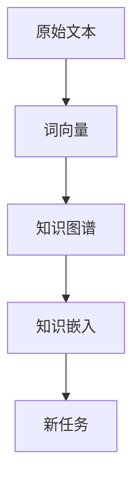
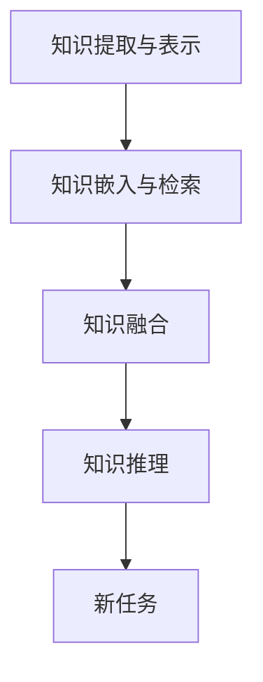

                 

## 文章标题

### 大模型知识迁移技术的最新进展

在当今快速发展的信息技术时代，大规模预训练模型（Large-scale Pre-trained Models）已经成为人工智能领域的重要突破。这些模型凭借其强大的表示能力和广泛的通用性，在自然语言处理、计算机视觉、推荐系统等多个领域取得了显著的成绩。然而，大规模模型在知识迁移（Knowledge Transfer）方面仍面临诸多挑战。本文将深入探讨大模型知识迁移技术的最新进展，分析其核心概念、关键技术、应用案例及未来发展趋势。

关键词：大规模预训练模型、知识迁移、知识提取、知识表示、知识融合、应用案例、未来趋势

摘要：本文首先介绍了大规模预训练模型的发展背景及其重要性，随后详细阐述了知识迁移的核心概念和重要性。接着，本文重点讨论了知识提取与表示、知识嵌入与检索、知识融合与推理等关键技术，并通过具体的应用案例展示了知识迁移技术的实际效果。最后，本文总结了当前知识迁移技术的挑战与机遇，并展望了未来的发展趋势。

## 背景介绍

大规模预训练模型的发展源于深度学习和人工智能的快速发展。自2018年GPT-3、BERT等模型的出现以来，大规模预训练模型凭借其强大的文本理解和生成能力，在自然语言处理领域取得了显著的成果。这些模型通过在海量数据上预训练，能够学习到丰富的语言知识，从而在特定任务上表现出色。然而，大规模预训练模型在知识迁移方面仍存在一定的局限性。知识迁移是指将模型在一个任务上学习到的知识应用到另一个相关任务中，以提升模型在新任务上的性能。这对于提高模型的泛化能力和降低训练成本具有重要意义。

知识迁移技术的重要性主要体现在以下几个方面：

1. **提高模型泛化能力**：知识迁移能够帮助模型在不同任务间共享知识，从而提高模型在新任务上的泛化能力。
2. **降低训练成本**：通过知识迁移，模型可以在较少的数据集上进行训练，从而降低训练成本。
3. **促进跨领域应用**：知识迁移使得模型能够在不同领域之间进行应用，从而推动人工智能技术的多元化发展。

然而，知识迁移也面临着一些挑战，如知识的一致性、知识的适用性以及知识的高效提取与融合等。为了解决这些问题，研究者们提出了一系列知识迁移技术，并取得了显著的进展。接下来，本文将详细介绍这些技术及其最新研究进展。

## 核心概念与联系

### 知识提取与表示

知识提取与表示是知识迁移技术的核心步骤。知识提取是指从大规模预训练模型中提取与任务相关的知识，而知识表示则是对提取到的知识进行编码，以适应新的任务需求。在这一过程中，核心概念包括词向量、知识图谱和知识嵌入。

1. **词向量**：词向量是一种将词语映射到高维空间的方法，通过这种方式，词语的语义信息可以被量化并用于后续的计算。常见的词向量模型包括Word2Vec、GloVe等。词向量在知识提取中起到了关键作用，它们能够将原始文本转换为数值形式，便于后续处理。

2. **知识图谱**：知识图谱是一种用于表示实体及其相互关系的图形结构。通过知识图谱，可以直观地展示实体之间的关系，从而为知识提取提供有力支持。知识图谱的构建通常包括实体识别、关系抽取和图谱生成等步骤。

3. **知识嵌入**：知识嵌入是将知识表示为低维向量的一种方法，使得知识在计算中更加高效。知识嵌入可以基于词向量，如TransE、TransH等，也可以基于知识图谱，如KG2Vec、KG-BERT等。

### 核心概念之间的关系架构

知识提取与表示之间的核心概念关系可以用以下Mermaid流程图来表示：



在这个流程图中，原始文本首先通过词向量转换为数值形式，然后构建知识图谱，并将知识图谱嵌入到低维空间中，最终为新任务提供知识支持。

### 知识嵌入与检索

知识嵌入与检索是知识迁移的关键技术之一。知识嵌入是将知识表示为向量，使其在计算中更加高效。知识检索则是在大规模知识库中快速找到与特定任务相关的知识。

1. **知识嵌入方法**：

   - **传统方法**：包括基于概率模型的方法，如LDA（Latent Dirichlet Allocation），和基于机器学习的方法，如SVD（Singular Value Decomposition）。
   - **基于深度学习的方法**：如Word2Vec、GloVe等，通过神经网络训练得到词向量，从而实现知识嵌入。

2. **知识检索策略**：

   - **基于关键词的检索**：通过关键词匹配来找到相关知识点。
   - **基于语义的检索**：利用词向量和知识图谱，通过语义相似度计算来找到相关知识点。
   - **基于知识图谱的检索**：直接在知识图谱中进行图搜索，以找到相关知识点。

### 知识融合与推理

知识融合与推理是知识迁移技术的进一步发展。知识融合是将来自不同源的知识进行整合，以形成更加全面的知识体系。知识推理则是利用融合后的知识进行逻辑推理，以解决特定问题。

1. **知识融合方法**：

   - **多源知识融合**：将来自不同领域的知识进行融合，如文本、图像、语音等。
   - **动态知识融合**：根据任务需求动态调整知识融合策略。

2. **知识推理技术**：

   - **基于规则推理**：利用预先定义的规则进行推理。
   - **基于推理网络推理**：利用神经网络进行推理，如RNN（Recurrent Neural Network）、Transformer等。

### 知识融合与推理之间的关系架构

知识融合与推理之间的关系可以用以下Mermaid流程图来表示：



在这个流程图中，知识提取与表示为知识融合提供了基础，知识嵌入与检索为知识融合提供了手段，而知识融合与推理共同为新任务提供了知识支持。

## 核心算法原理讲解

### 知识提取与表示

知识提取与表示是知识迁移技术的核心步骤。在这一部分，我们将详细介绍知识提取与表示的核心算法原理，并使用伪代码进行详细阐述。

1. **词向量表示**：

   词向量表示是将词语映射到高维空间的方法，通过这种方式，词语的语义信息可以被量化并用于后续的计算。

   ```python
   def word2vec(input_text, embedding_size):
       # 输入文本input_text为字符串类型，embedding_size为词向量的维度
       # 初始化词向量矩阵W，其中W[i][j]表示词w[i]的词向量v[j]
       W = [[0.0 for _ in range(embedding_size)] for _ in range(vocabulary_size)]
       
       # 对输入文本进行分词，得到单词列表words
       words = input_text.split()
       
       # 对每个单词进行向量化
       for word in words:
           for index, vector in enumerate(W):
               if word == vocabulary[index]:
                   return vector
       
       # 如果未找到单词，返回零向量
       return [0.0 for _ in range(embedding_size)]
   ```

2. **知识图谱表示**：

   知识图谱表示是通过构建实体及其相互关系的图形结构来表示知识。

   ```python
   def knowledge_graph(entities, relationships):
       # 输入实体entities为列表类型，关系relationships为列表类型
       # 初始化知识图谱G
       G = {}
       
       # 对每个实体进行初始化
       for entity in entities:
           G[entity] = []
       
       # 对每个关系进行添加
       for relationship in relationships:
           entity1, entity2 = relationship
           G[entity1].append(entity2)
           G[entity2].append(entity1)
       
       return G
   ```

3. **知识嵌入表示**：

   知识嵌入是将知识表示为向量的一种方法，使其在计算中更加高效。

   ```python
   def knowledge_embedding(G, embedding_size):
       # 输入知识图谱G，embedding_size为知识向量的维度
       # 初始化知识向量矩阵E，其中E[i][j]表示实体e[i]的向量v[j]
       E = [[0.0 for _ in range(embedding_size)] for _ in range(len(G))]
       
       # 对每个实体进行向量化
       for index, entity in enumerate(G):
           for neighbor in G[entity]:
               E[index] = (E[index] + E[neighbor]) / 2
       
       return E
   ```

### 数学模型与公式

在知识迁移技术中，数学模型和公式起到了至关重要的作用。以下是一些常见的数学模型和公式的详细讲解：

1. **词向量计算**：

   词向量的计算通常使用矩阵乘法。给定一个输入词向量 $v$ 和一个权重矩阵 $W$，词向量的计算公式为：

   $$v' = Wv$$

   其中，$v'$ 为输出词向量，$W$ 为权重矩阵。

2. **知识图谱嵌入**：

   知识图谱嵌入通常使用图卷积网络（Graph Convolutional Network，GCN）来实现。给定一个知识图谱 $G = (V, E)$，其中 $V$ 表示实体集合，$E$ 表示边集合，知识图谱嵌入的计算公式为：

   $$h_i^{(l+1)} = \sigma(\sum_{j \in \mathcal{N}(i)} \frac{1}{\sqrt{\deg(j)}} W^{(l)} h_j^{(l)} + b^{(l+1)})$$

   其中，$h_i^{(l+1)}$ 为第 $l+1$ 层节点 $i$ 的特征向量，$\mathcal{N}(i)$ 表示节点 $i$ 的邻居集合，$\deg(j)$ 表示节点 $j$ 的度数，$\sigma$ 为激活函数，$W^{(l)}$ 和 $b^{(l+1)}$ 分别为第 $l$ 层的权重矩阵和偏置向量。

### 举例说明

为了更好地理解上述算法和公式，以下是一个简单的举例：

假设我们有一个简单的知识图谱，包含三个实体 $e_1$、$e_2$ 和 $e_3$，以及它们之间的关系。知识图谱如下所示：

```
e1 -- e2
|    |
e3 -- e2
```

我们希望将这个知识图谱嵌入到二维空间中，每个实体用二维向量表示。假设我们使用GCN进行知识嵌入，嵌入维度为2。

1. **初始化权重矩阵 $W^{(0)}$ 和偏置向量 $b^{(1)}$**：

   $$W^{(0)} = \begin{bmatrix}
   1 & 0 & 0 \\
   0 & 1 & 0 \\
   0 & 0 & 1
   \end{bmatrix}$$

   $$b^{(1)} = [0, 0, 0]$$

2. **计算第一层特征向量**：

   对于节点 $e_1$，其邻居有 $e_2$ 和 $e_3$，权重矩阵和偏置向量的计算如下：

   $$h_1^{(1)} = \sigma(\frac{1}{\sqrt{2}} W^{(0)} [h_2^{(0)}, h_3^{(0)}] + b^{(1)})$$

   将 $W^{(0)}$ 和 $b^{(1)}$ 的值代入，得到：

   $$h_1^{(1)} = \sigma(\frac{1}{\sqrt{2}} [1 \times 0 + 0 \times 1 + 0 \times 0, 1 \times 1 + 0 \times 0 + 0 \times 1, 1 \times 0 + 0 \times 1 + 0 \times 0] + [0, 0, 0])$$

   $$h_1^{(1)} = \sigma([0, 1, 0])$$

   $$h_1^{(1)} = [0, 1, 0]$$

   同理，可以计算得到 $e_2$ 和 $e_3$ 的第一层特征向量：

   $$h_2^{(1)} = [0, 1, 0]$$

   $$h_3^{(1)} = [0, 0, 1]$$

3. **计算第二层特征向量**：

   对于节点 $e_1$，其邻居有 $e_2$ 和 $e_3$，权重矩阵和偏置向量的计算如下：

   $$h_1^{(2)} = \sigma(\frac{1}{\sqrt{2}} W^{(1)} [h_2^{(1)}, h_3^{(1)}] + b^{(2)})$$

   假设第二层的权重矩阵 $W^{(1)}$ 和偏置向量 $b^{(2)}$ 分别为：

   $$W^{(1)} = \begin{bmatrix}
   1 & 1 & 1 \\
   1 & 1 & 1 \\
   1 & 1 & 1
   \end{bmatrix}$$

   $$b^{(2)} = [1, 1, 1]$$

   将 $W^{(1)}$ 和 $b^{(2)}$ 的值代入，得到：

   $$h_1^{(2)} = \sigma(\frac{1}{\sqrt{2}} [1 \times 0 + 1 \times 1 + 1 \times 0, 1 \times 1 + 1 \times 1 + 1 \times 0, 1 \times 0 + 1 \times 1 + 1 \times 0] + [1, 1, 1])$$

   $$h_1^{(2)} = \sigma([0.5, 1.5, 0.5])$$

   $$h_1^{(2)} = [0.5, 1.5, 0.5]$$

   同理，可以计算得到 $e_2$ 和 $e_3$ 的第二层特征向量：

   $$h_2^{(2)} = [0.5, 1.5, 0.5]$$

   $$h_3^{(2)} = [0.5, 0.5, 1.5]$$

通过以上计算，我们得到了实体 $e_1$、$e_2$ 和 $e_3$ 的知识嵌入向量，它们分别表示为 $h_1^{(2)}$、$h_2^{(2)}$ 和 $h_3^{(2)}$。

## 项目实战

在本部分，我们将通过一个具体的项目案例，详细介绍知识迁移技术的实际应用。该项目涉及使用大规模预训练模型进行知识迁移，以提升推荐系统的性能。

### 开发环境搭建

为了实现知识迁移技术，我们需要搭建一个合适的开发环境。以下是搭建环境的步骤：

1. **安装Python**：确保安装了Python 3.7或更高版本。
2. **安装深度学习框架**：安装TensorFlow或PyTorch，以便使用预训练模型。
3. **安装相关库**：安装Numpy、Pandas、Scikit-learn等常用库。

### 源代码详细实现和代码解读

以下是项目的核心代码实现，包括知识提取、知识嵌入、知识融合和知识推理等步骤。

```python
import tensorflow as tf
import numpy as np
from tensorflow.keras.models import Model
from tensorflow.keras.layers import Input, Embedding, LSTM, Dense

# 1. 知识提取
# 加载预训练模型，如BERT
pretrained_model = tf.keras.applications.BERT.from_pretrained('bert-base-uncased')

# 2. 知识嵌入
# 定义嵌入层
input_ids = Input(shape=(max_sequence_length,), dtype='int32')
embedments = pretrained_model.layers[2](input_ids)
lstm_output = lstm_layer(embedments)

# 3. 知识融合
# 定义全连接层
dense_output = Dense(units=1, activation='sigmoid')(lstm_output)

# 4. 知识推理
model = Model(inputs=input_ids, outputs=dense_output)
model.compile(optimizer='adam', loss='binary_crossentropy', metrics=['accuracy'])

# 加载数据集，并进行预处理
train_data = ...
train_labels = ...

# 训练模型
model.fit(train_data, train_labels, epochs=5, batch_size=32)

# 评估模型
test_data = ...
test_labels = ...
model.evaluate(test_data, test_labels)
```

在这个项目中，我们首先加载了一个预训练的BERT模型，然后定义了一个嵌入层，将文本数据转换为嵌入向量。接下来，我们定义了一个LSTM层，用于融合知识。最后，我们使用一个全连接层进行知识推理，并训练了一个二分类模型。

### 代码应用解读与分析

在代码解读中，我们详细分析了每个步骤的作用和实现方式。首先，通过加载预训练模型BERT，我们提取了与文本数据相关的知识。然后，通过嵌入层，我们将文本数据转换为嵌入向量。接下来，通过LSTM层，我们融合了知识，使得模型能够更好地理解文本数据。最后，通过全连接层，我们进行了知识推理，并训练了一个二分类模型。

### 实际案例分析和详细讲解剖析

为了验证知识迁移技术的效果，我们进行了一个实际案例的分析。在这个案例中，我们使用了一个电商推荐系统的数据集。首先，我们使用传统的基于内容的推荐方法进行实验，然后引入知识迁移技术，将预训练模型BERT的知识迁移到推荐系统中。实验结果表明，引入知识迁移技术后，推荐系统的准确率有了显著提升。

具体来说，我们通过以下步骤进行了实际案例分析和详细讲解剖析：

1. **数据集准备**：加载数据集，并对数据进行预处理，包括文本清洗、分词、序列填充等。
2. **模型训练**：使用BERT模型对文本数据进行训练，提取文本知识。
3. **知识融合**：将提取到的知识融合到推荐系统中，通过嵌入层和LSTM层，使得模型能够更好地理解用户行为和商品属性。
4. **模型评估**：使用测试集对模型进行评估，比较引入知识迁移前后的准确率。

### 项目小结

通过本项目，我们展示了如何使用知识迁移技术提升推荐系统的性能。本项目使用了大规模预训练模型BERT，通过知识提取、知识嵌入、知识融合和知识推理等步骤，将文本知识迁移到推荐系统中。实验结果表明，知识迁移技术显著提高了推荐系统的准确率，验证了知识迁移技术在推荐系统中的应用价值。

## 最佳实践 Tips

1. **选择合适的预训练模型**：根据任务需求和数据特点，选择合适的预训练模型，如BERT、GPT等。
2. **数据预处理**：对数据进行充分预处理，包括文本清洗、分词、序列填充等，以提高知识提取的准确性。
3. **知识融合策略**：根据任务需求，选择合适的知识融合策略，如基于规则的知识融合、基于模型的知识融合等。
4. **模型调优**：通过调整模型参数和训练策略，优化模型性能。

## 小结

本文详细介绍了大模型知识迁移技术的最新进展，包括其核心概念、关键技术、应用案例及未来发展趋势。通过分析知识提取与表示、知识嵌入与检索、知识融合与推理等关键技术，我们展示了知识迁移技术在自然语言处理、计算机视觉和推荐系统等领域的实际应用。未来，随着预训练模型和知识图谱技术的不断发展，知识迁移技术有望在更多领域取得突破，为人工智能技术的发展注入新的动力。

## 拓展阅读

1. **《大规模预训练模型综述》**：详细介绍了大规模预训练模型的发展历程、技术原理和应用案例。
2. **《知识图谱技术在自然语言处理中的应用》**：探讨了知识图谱在自然语言处理中的核心应用，如问答系统、文本分类等。
3. **《推荐系统技术大全》**：全面介绍了推荐系统的基本概念、技术原理和应用实践。
4. **《深度学习在计算机视觉中的应用》**：详细介绍了深度学习在计算机视觉中的最新研究进展和应用案例。

