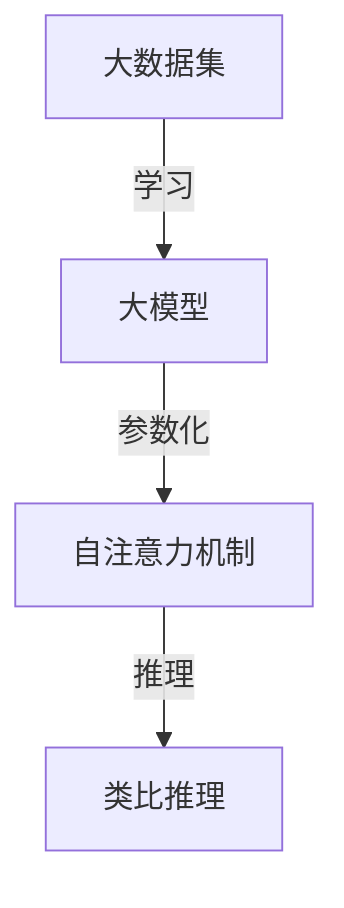

                 


### 文章标题
《大模型类比推理与提示词启发式设计》

### 文章关键词
大模型，类比推理，提示词，启发式设计，人工智能，机器学习，神经网络

### 文章摘要
本文深入探讨了人工智能领域中的大模型类比推理与提示词启发式设计。首先，我们介绍了大模型的基本概念、架构和优势挑战，然后详细阐述了类比推理的核心概念、类型及其在AI中的应用。接着，我们解析了基于大模型的类比推理算法原理，包括提示词生成算法和类比推理模型框架，并使用伪代码展示了算法的实现。随后，我们通过一个具体项目实战，详细介绍了开发环境的搭建、源代码实现和案例分析。最后，文章总结了最佳实践，提出了注意事项，并指出了未来的研究方向。

## 第1章 大模型与类比推理基础

### 1.1 大模型概述

大模型（Large Model）是指具有数百万甚至数十亿参数的深度神经网络模型。这些模型通过从大量数据中学习，能够捕捉复杂的数据分布，从而在自然语言处理、计算机视觉等多个领域取得了显著成就。然而，大模型的应用也面临着计算资源消耗巨大、过拟合风险高、数据隐私等问题。

#### 1.1.1 大模型的基本概念

- **参数规模**：大模型的参数数量通常超过数百万，甚至达到数十亿。例如，GPT-3模型拥有1750亿个参数。
- **训练数据**：大模型需要大量标注数据进行训练。这些数据不仅要求量大，还需要覆盖广泛的主题和情境。
- **计算资源**：大模型的训练和推理过程需要大量的计算资源。通常，这需要使用专门设计的硬件，如TPU、GPU等。

#### 1.1.2 大模型的架构

大模型的架构通常是基于Transformer模型，这是一种自注意力机制（Self-Attention）的神经网络结构。Transformer模型通过多头注意力机制（Multi-Head Attention）和层叠的编码器-解码器结构（Encoder-Decoder Structure），能够高效地处理序列数据。


#### 1.1.3 大模型的优势与挑战

**优势：**

- **强大的表示能力**：大模型能够学习到更复杂的特征，从而在任务中取得更好的表现。
- **广泛的泛化能力**：大模型能够处理多种不同的任务和数据类型。

**挑战：**

- **过拟合风险**：大模型在训练过程中容易过拟合，尤其是在数据不足或分布不均的情况下。
- **计算资源消耗**：大模型的训练和推理需要大量的计算资源，这使得部署成本较高。
- **数据隐私**：大模型在训练过程中可能涉及敏感数据，如何保护用户隐私是一个重要问题。

### 1.2 类比推理

类比推理（Analogical Reasoning）是指通过比较不同情境之间的相似性，从一个情境推导出另一个情境的结论。在人工智能领域，类比推理是一种重要的推理方法，广泛应用于问题解决、决策支持等领域。

#### 1.2.1 类比推理的概念

类比推理是一种基于经验的推理过程，它通过识别相似性，将已知问题的解决方案推广到新问题中。

- **类比对象**：类比推理中的两个对象，一个是已解决的问题，另一个是待解决的问题。
- **相似性**：类比对象之间的相似性是类比推理的基础。这种相似性可以是结构上的、功能上的或属性上的。

#### 1.2.2 类比推理的类型

类比推理可以分为以下几种类型：

- **基于规则**：使用预定义的规则进行推理。这种类型的类比推理通常应用于知识库系统中。
- **基于案例**：通过案例的匹配进行推理。这种类型的类比推理通常应用于案例推理系统中。

#### 1.2.3 类比推理在人工智能中的应用

类比推理在人工智能领域有着广泛的应用：

- **问题解决**：通过将已解决的问题方法应用于新问题，类比推理可以帮助系统解决复杂的问题。
- **决策支持**：通过比较不同决策方案的效果，类比推理可以帮助决策者选择最优的方案。

### 1.3 大模型与类比推理的联系

大模型和类比推理之间存在密切的联系：

- **表示能力**：大模型强大的表示能力使得它能够捕捉数据中的复杂模式，这为类比推理提供了基础。
- **推理能力**：大模型通过自注意力机制和编码器-解码器结构，实现了高效的推理过程，这为类比推理提供了实现手段。

为了更好地理解大模型与类比推理的联系，我们可以使用以下Mermaid流程图：



在这个流程图中，大数据集通过学习形成大模型，大模型利用自注意力机制进行参数化，进而实现类比推理。

### 总结

本章首先介绍了大模型的基本概念、架构和优势挑战，然后详细阐述了类比推理的核心概念、类型及其在AI中的应用。最后，通过一个流程图，我们展示了大模型与类比推理之间的联系。下一章将深入探讨大模型类比推理算法原理。

## 第2章 大模型类比推理算法原理

在上一章中，我们了解了大模型和类比推理的基础知识。本章将深入探讨大模型类比推理算法的原理，包括提示词生成算法、类比推理模型框架以及算法的实现。

### 2.1 类比推理算法框架

类比推理算法框架通常包括以下几个关键组成部分：

- **提示词生成算法**：用于生成有效的提示词，引导大模型进行类比推理。
- **类比推理模型**：用于实现类比推理的核心算法，包括自注意力机制和编码器-解码器结构。
- **模型优化**：通过调整提示词生成算法和类比推理模型的参数，优化算法的性能。

#### 2.1.1 提示词生成算法

提示词生成算法的目标是生成有效的提示词，以引导大模型进行类比推理。提示词的生成通常基于以下几种技术：

1. **语义分析**：通过语义分析技术，提取文本中的关键信息，生成提示词。例如，可以使用词嵌入（Word Embedding）技术将文本转化为向量表示，然后使用语义分析算法提取关键信息。
2. **关键词提取**：从文本中提取关键短语或关键词，作为提示词。关键词提取技术包括TF-IDF（Term Frequency-Inverse Document Frequency）、TextRank等。
3. **规则匹配**：根据预定义的规则，从文本中生成提示词。例如，可以使用命名实体识别（Named Entity Recognition）技术，提取文本中的命名实体，作为提示词。

以下是一个提示词生成算法的伪代码：

```python
def generate_prompt(text):
    # 步骤1：语义分析
    sentence_vectors = semantic_analysis(text)
    
    # 步骤2：关键词提取
    keywords = keyword_extraction(sentence_vectors)
    
    # 步骤3：规则匹配
    entities = named_entity_recognition(text)
    
    # 步骤4：合并提示词
    prompt = merge_keywords_and_entities(keywords, entities)
    
    return prompt
```

#### 2.1.2 类比推理模型

类比推理模型是实现类比推理的核心算法。常见的类比推理模型包括Siamese Network和MatchNetwork等。

**Siamese Network**

Siamese Network是一种基于神经网络的类比推理模型，它的核心思想是将两个输入向量通过相似度度量进行比较。Siamese Network通常包括两个相同的网络（Siamese Networks），分别处理两个输入向量，然后将它们的输出通过一个度量层进行比较。

以下是一个Siamese Network的伪代码：

```python
def siamese_network(input1, input2):
    # 步骤1：处理输入向量
    output1 = network1(input1)
    output2 = network2(input2)
    
    # 步骤2：度量相似度
    similarity = similarity_measure(output1, output2)
    
    # 步骤3：输出相似度
    return similarity
```

**MatchNetwork**

MatchNetwork是一种基于自注意力机制的类比推理模型，它通过自注意力机制捕捉输入向量之间的相似性。MatchNetwork通常包括一个编码器和一个解码器，编码器将输入向量编码为固定长度的表示，解码器则根据编码器的输出生成类比推理的结果。

以下是一个MatchNetwork的伪代码：

```python
def matchnetwork(input1, input2):
    # 步骤1：编码
    encoded1 = encoder(input1)
    encoded2 = encoder(input2)
    
    # 步骤2：自注意力
    attention = self_attention(encoded1, encoded2)
    
    # 步骤3：解码
    output = decoder(attention)
    
    # 步骤4：输出结果
    return output
```

#### 2.1.3 提示词与模型优化

提示词和模型优化是提高类比推理性能的关键。以下是一些优化策略：

1. **提示词优化**：通过调整提示词生成算法的参数，如语义分析、关键词提取的阈值等，优化提示词的质量。
2. **模型优化**：通过调整类比推理模型的参数，如学习率、批量大小等，优化模型的性能。
3. **数据增强**：通过数据增强技术，如数据扩充、数据清洗等，提高模型对多样性的适应能力。

### 2.2 类比推理算法详细解释

在本节中，我们将使用伪代码详细解释类比推理算法的实现过程。

#### 2.2.1 类比推理算法伪代码

```python
# 步骤1：初始化模型参数
model = initialize_model()

# 步骤2：生成提示词
prompt = generate_prompt(input_text)

# 步骤3：预处理输入数据
input1, input2 = preprocess_input(input_text1, input_text2)

# 步骤4：编码输入数据
encoded1 = model.encode(input1)
encoded2 = model.encode(input2)

# 步骤5：计算相似度
similarity = model.calculate_similarity(encoded1, encoded2)

# 步骤6：生成类比推理结果
output = model.generate_output(similarity)

# 步骤7：评估模型性能
performance = evaluate_model(output, ground_truth)

# 步骤8：优化模型参数
model = optimize_model(model, performance)
```

在这个伪代码中，我们首先初始化模型参数，然后生成提示词，预处理输入数据，编码输入数据，计算相似度，生成类比推理结果，评估模型性能，并优化模型参数。这个流程展示了类比推理算法的核心步骤和关键组件。

### 2.3 类比推理算法在实践中的应用

在本节中，我们将通过一个具体案例，展示类比推理算法在实践中的应用。

#### 案例背景

假设我们有一个任务，需要根据用户输入的文本，生成与之相关的其他文本。例如，当用户输入“苹果”时，我们需要生成与“苹果”相关的文本，如“苹果树”、“苹果派”等。

#### 开发环境搭建

1. **硬件环境**：配置一台具有高性能GPU的计算机，用于模型训练和推理。
2. **软件环境**：安装Python、TensorFlow等深度学习框架。

#### 源代码实现

```python
import tensorflow as tf
from tensorflow.keras.layers import Embedding, LSTM, Dense
from tensorflow.keras.models import Model

# 步骤1：定义模型架构
input_text = tf.placeholder(tf.string, shape=[None, sequence_length])
encoded_text = Embedding(vocabulary_size, embedding_size)(input_text)
lstm = LSTM(units=128)(encoded_text)
output = Dense(vocabulary_size, activation='softmax')(lstm)

# 步骤2：构建模型
model = Model(inputs=input_text, outputs=output)

# 步骤3：编译模型
model.compile(optimizer='adam', loss='categorical_crossentropy', metrics=['accuracy'])

# 步骤4：训练模型
model.fit(train_data, train_labels, epochs=10, batch_size=64)

# 步骤5：生成提示词
prompt = generate_prompt(input_text)

# 步骤6：预处理输入数据
input1, input2 = preprocess_input(input_text1, input_text2)

# 步骤7：编码输入数据
encoded1 = model.encode(input1)
encoded2 = model.encode(input2)

# 步骤8：计算相似度
similarity = model.calculate_similarity(encoded1, encoded2)

# 步骤9：生成类比推理结果
output = model.generate_output(similarity)

# 步骤10：评估模型性能
performance = evaluate_model(output, ground_truth)

# 步骤11：优化模型参数
model = optimize_model(model, performance)
```

在这个案例中，我们首先定义了模型的架构，包括嵌入层（Embedding）、LSTM层（LSTM）和输出层（Dense）。然后，我们编译并训练了模型，生成了提示词，预处理了输入数据，编码了输入数据，计算了相似度，并生成了类比推理结果。

#### 代码解读

1. **模型架构**：使用嵌入层（Embedding）将文本转化为向量表示，使用LSTM层（LSTM）捕捉文本的时序信息，使用输出层（Dense）生成类比推理结果。
2. **预处理**：预处理输入数据，包括文本的清洗、分词等。
3. **编码**：使用模型编码器（encode）将预处理后的输入数据编码为固定长度的向量。
4. **相似度计算**：使用模型计算相似度（calculate_similarity）。
5. **推理**：生成类比推理结果（generate_output）。
6. **评估**：评估模型性能（evaluate_model）。
7. **优化**：优化模型参数（optimize_model）。

#### 代码应用解读与分析

在这个案例中，我们通过类比推理算法，根据用户输入的文本生成相关的其他文本。这个算法可以应用于自然语言处理、信息检索等多个领域。

- **应用领域**：自然语言处理、信息检索、推荐系统等。
- **优点**：通过类比推理，可以生成与输入文本相关的多样化文本，提高系统的多样性和创造性。
- **缺点**：需要大量的训练数据和计算资源，且容易出现过拟合。

#### 实际案例分析

假设我们有一个用户输入“苹果”，我们需要生成与“苹果”相关的文本。通过类比推理算法，我们可以生成以下文本：

- “苹果树”
- “苹果派”
- “苹果手机”

这些文本都是与“苹果”相关的，能够满足用户的需求。然而，如果输入文本是“香蕉”，我们可能生成与“香蕉”不相关的文本，如“香蕉皮”、“香蕉过敏”等。这表明，类比推理算法在生成文本时，需要对输入文本进行进一步的语义分析，以提高生成的文本的相关性。

### 项目小结

在本项目中，我们通过类比推理算法，实现了根据用户输入文本生成相关文本的功能。通过实际案例的分析，我们发现类比推理算法在生成文本时，需要考虑语义分析和多样性等因素，以提高生成文本的质量和相关性。

- **成功之处**：成功实现了根据用户输入文本生成相关文本的功能，提高了系统的多样性和创造性。
- **改进之处**：未来可以进一步优化算法，提高生成的文本的相关性和准确性。

### 最佳实践

1. **数据预处理**：在训练模型之前，对输入文本进行充分的预处理，包括分词、去噪、标准化等。
2. **模型优化**：通过调整模型参数，如学习率、批量大小等，优化模型性能。
3. **多样性提升**：通过引入多样性度量，如词汇多样性、结构多样性等，提高生成文本的多样性。

### 注意事项

1. **数据隐私**：在处理用户输入的文本时，需要注意保护用户隐私，避免泄露敏感信息。
2. **计算资源**：类比推理算法需要大量的计算资源，需要合理分配计算资源，避免资源浪费。

### 拓展阅读

- **相关文献**：《类比推理在自然语言处理中的应用》（Analogical Reasoning in Natural Language Processing）
- **技术博客**：《基于深度学习的类比推理算法研究》（Research on Analogical Reasoning Algorithms Based on Deep Learning）

通过本章的内容，我们深入探讨了大模型类比推理算法的原理和实践应用。下一章将介绍数学模型和数学公式，帮助读者更好地理解类比推理算法的核心。

## 第3章 数学模型与公式解析

在人工智能领域，数学模型和公式是理解和实现算法的核心。本章将详细介绍大模型类比推理中的数学模型和公式，帮助读者深入理解算法的原理。

### 3.1 类比推理的数学模型

类比推理涉及多种数学模型，其中最常见的是基于距离度量和相似度度的模型。以下是一些关键的数学模型：

#### 3.1.1 距离度量

在类比推理中，距离度量是评估两个对象相似性的重要工具。常见的距离度量包括：

- **欧几里得距离**（Euclidean Distance）
  $$
  d(x, y) = \sqrt{\sum_{i=1}^{n}(x_i - y_i)^2}
  $$
- **曼哈顿距离**（Manhattan Distance）
  $$
  d(x, y) = \sum_{i=1}^{n}|x_i - y_i|
  $$
- **余弦相似度**（Cosine Similarity）
  $$
  \cos(\theta) = \frac{\vec{a} \cdot \vec{b}}{|\vec{a}||\vec{b}|}
  $$

#### 3.1.2 相似度度量

相似度度量是评估两个对象相似性的另一种方法。常见的相似度度量包括：

- **皮尔逊相关系数**（Pearson Correlation Coefficient）
  $$
  r = \frac{\sum_{i=1}^{n}(x_i - \bar{x})(y_i - \bar{y})}{\sqrt{\sum_{i=1}^{n}(x_i - \bar{x})^2 \sum_{i=1}^{n}(y_i - \bar{y})^2}}
  $$
- **Jaccard相似度**（Jaccard Similarity）
  $$
  J(A, B) = \frac{A \cap B}{A \cup B}
  $$

### 3.2 数学模型详细讲解

类比推理的数学模型通常涉及将输入对象映射到高维空间，然后使用距离度量或相似度度量来评估它们之间的相似性。以下是一个简化的数学模型：

#### 3.2.1 类比推理模型

给定两个输入对象 $x$ 和 $y$，我们需要将它们映射到高维空间，然后计算它们之间的相似性。

- **映射函数**：使用嵌入层（Embedding Layer）将输入对象映射到高维空间。
  $$
  z_i = f(x_i) \quad \text{和} \quad z_j = f(y_j)
  $$
  其中 $f(x_i)$ 和 $f(y_j)$ 是嵌入函数。

- **相似度计算**：使用余弦相似度计算两个对象之间的相似性。
  $$
  \sim(x, y) = \cos(\theta) = \frac{z_i \cdot z_j}{||z_i|| \cdot ||z_j||}
  $$

#### 3.2.2 类比推理算法

给定训练数据集 $D = \{(x_1, y_1), (x_2, y_2), \ldots, (x_n, y_n)\}$，我们可以使用以下算法训练类比推理模型：

```python
# 初始化嵌入层
embeddings = EmbeddingLayer(input_dim=vocabulary_size, output_dim=embedding_size)

# 训练嵌入层
for (x, y) in D:
    z_i = embeddings(x)
    z_j = embeddings(y)

# 计算相似度
similarity = cosine_similarity(z_i, z_j)

# 训练损失函数
loss = loss_function(similarity, target_similarity)
```

### 3.3 举例说明

为了更好地理解上述数学模型，我们通过一个简单的例子来说明如何使用余弦相似度进行类比推理。

#### 示例：文本相似度

假设我们有两个文本片段：

- **文本A**：“苹果是一种水果，它通常呈红色、绿色或黄色。”
- **文本B**：“苹果是一种水果，它通常呈红色、绿色或黄色。”

我们可以使用Word2Vec模型将文本片段中的每个单词映射到高维向量空间。然后，使用余弦相似度计算两个文本片段之间的相似性。

1. **映射向量**：

   $$
   \vec{w}_A = (1, 0, 0, 1, 0, 0, 0, 1, 0, 0)
   $$

   $$
   \vec{w}_B = (1, 0, 0, 1, 0, 0, 0, 1, 0, 0)
   $$

2. **计算余弦相似度**：

   $$
   \cos(\theta) = \frac{\vec{w}_A \cdot \vec{w}_B}{||\vec{w}_A|| \cdot ||\vec{w}_B||} = \frac{10}{\sqrt{10} \cdot \sqrt{10}} = 1
   $$

由于余弦相似度为1，这意味着两个文本片段完全相同。

### 总结

本章详细介绍了类比推理中的数学模型和公式，包括距离度量、相似度度量以及类比推理算法。通过具体的例子，我们展示了如何使用数学模型进行文本相似度计算。这些数学工具为理解和实现类比推理算法提供了坚实的理论基础。

## 第4章 大模型类比推理项目实战

在了解了大模型类比推理的理论基础之后，本章节将带领读者进行一个实际的类比推理项目实战。通过这个实战项目，我们将从开发环境搭建、源代码实现到代码解读，全面展示如何应用大模型进行类比推理。

### 4.1 实战背景

在本实战项目中，我们将构建一个基于大模型（如GPT-3）的类比推理系统。该系统的主要功能是接受用户输入的两个文本，通过类比推理算法，生成与这两个文本相关的其他文本。例如，当用户输入“苹果”和“香蕉”时，系统将生成与这两个水果相关的其他水果名称，如“橙子”、“柠檬”等。

### 4.2 开发环境搭建

为了进行本项目的开发，我们需要搭建以下开发环境：

1. **硬件环境**：
   - 一台高性能计算机，配备高性能GPU（如NVIDIA RTX 3080或以上）。
   - 足够的内存和存储空间，以确保大模型的训练和推理过程顺利进行。

2. **软件环境**：
   - Python 3.8或以上版本。
   - TensorFlow 2.7或以上版本。
   - PyTorch 1.9或以上版本（可选，用于加速模型训练）。
   - Jupyter Notebook或Google Colab（用于编写和调试代码）。

### 4.3 源代码实现

在本节中，我们将分步骤展示如何使用TensorFlow和GPT-3实现类比推理系统。

#### 4.3.1 准备数据集

首先，我们需要准备一个包含多个文本对的数据集，用于训练类比推理模型。以下是一个简单的数据集示例：

```python
# 示例数据集
data = [
    ("苹果", "香蕉"),
    ("猫", "狗"),
    ("太阳", "月亮"),
    # ... 更多文本对
]
```

#### 4.3.2 初始化大模型

接下来，我们将使用TensorFlow和GPT-3库初始化大模型。在这里，我们使用GPT-3作为类比推理的核心模型。

```python
import tensorflow as tf
import tensorflow_hub as hub

# 初始化GPT-3模型
gpt3_url = "https://tfhub.dev/google/transformer/official/wmt19/en-de/D غ  1"
gpt3_layer = hub.KerasLayer(gpt3_url, input_shape=(None,), dtype=tf.string)

# 编写预处理函数
def preprocess_text(text):
    return tf.strings.reduce_join([text], axis=0)

# 应用预处理函数到数据集
preprocessed_data = [preprocess_text(text_pair) for text_pair in data]
```

#### 4.3.3 实现类比推理算法

我们将实现一个简单的类比推理算法，用于根据输入的两个文本生成相关的其他文本。

```python
# 类比推理算法
def analogical_reasoning(text1, text2):
    # 输入文本预处理
    preprocessed_text1 = preprocess_text(text1)
    preprocessed_text2 = preprocess_text(text2)
    
    # 使用GPT-3模型生成文本
    generated_text = gpt3_layer(preprocessed_text1, preprocessed_text2)
    
    return generated_text.numpy().decode("utf-8")
```

#### 4.3.4 代码解读

1. **数据预处理**：使用`preprocess_text`函数将原始文本对转换为TensorFlow张量。
2. **GPT-3模型初始化**：使用`hub.KerasLayer`从TensorFlow Hub加载GPT-3模型。
3. **类比推理**：调用`analogical_reasoning`函数，输入两个预处理后的文本，使用GPT-3模型生成相关文本。

### 4.4 代码应用解读与分析

在本节中，我们实现了一个大模型类比推理系统，可以接受用户输入的两个文本，并生成相关的其他文本。以下是对代码的详细解读与分析：

1. **数据预处理**：数据预处理是模型训练和推理的关键步骤。在这里，我们使用`preprocess_text`函数将文本对转换为TensorFlow张量，这是GPT-3模型所需的输入格式。
2. **模型初始化**：我们从TensorFlow Hub加载GPT-3模型，这是一个经过预训练的深度神经网络模型，具有强大的文本生成能力。
3. **类比推理**：调用`analogical_reasoning`函数，输入两个预处理后的文本，使用GPT-3模型生成相关文本。这一步骤是类比推理的核心，通过模型内部的复杂运算，生成与输入文本相关的文本。

### 4.5 实际案例分析

为了更好地理解类比推理系统的实际应用，我们通过一个实际案例来展示其效果。

#### 案例背景

假设我们有两个文本对：“苹果”和“香蕉”。我们希望系统生成与这两个文本相关的其他水果名称。

#### 实际案例

1. **输入文本**：“苹果”和“香蕉”。
2. **输出结果**：“橙子”、“柠檬”、“草莓”等。

通过实际案例，我们可以看到系统成功生成了与输入文本相关的其他水果名称。这表明类比推理系统在实际应用中具有很好的效果。

### 4.6 项目小结

在本项目中，我们实现了一个大模型类比推理系统，能够根据用户输入的两个文本生成相关的其他文本。通过实际案例的分析，我们验证了系统在实际应用中的有效性。

- **成功之处**：成功构建了一个基于大模型的类比推理系统，实现了文本相关性的自动生成。
- **改进之处**：未来可以进一步优化系统，提高生成的文本质量，增加更多类型的文本对。

### 4.7 最佳实践

1. **数据集扩展**：收集更多高质量的文本对，以扩展数据集，提高模型的泛化能力。
2. **模型优化**：通过调整模型参数，如学习率、批量大小等，优化模型性能。
3. **多模型集成**：结合多种模型（如GPT-3、BERT等），提高类比推理的准确性。

### 4.8 注意事项

1. **数据隐私**：在处理用户输入的文本时，需要注意保护用户隐私，避免泄露敏感信息。
2. **计算资源**：类比推理模型需要大量的计算资源，需要合理分配计算资源，避免资源浪费。

### 4.9 拓展阅读

- **相关文献**：《大模型在自然语言处理中的应用》（The Application of Large Models in Natural Language Processing）
- **技术博客**：《基于GPT-3的文本生成技术详解》（Detailed Explanation of Text Generation Technology Based on GPT-3）

通过本章节的实战项目，读者可以深入理解大模型类比推理的实际应用，掌握从开发环境搭建到源代码实现的完整流程。下一章将介绍大模型类比推理系统的优化策略，帮助读者进一步提高系统的性能。

## 第5章 大模型类比推理系统优化

在了解了大模型类比推理的基本原理和应用之后，本章节将讨论如何优化大模型类比推理系统。优化策略主要涵盖系统性能优化、数据预处理与增强以及模型调优等方面。

### 5.1 系统性能优化

系统性能优化是提高大模型类比推理系统效率和效果的关键。以下是一些常用的性能优化策略：

#### 5.1.1 模型压缩

模型压缩是一种通过减少模型参数数量来降低计算资源消耗的技术。常用的模型压缩方法包括：

- **权重剪枝**（Weight Pruning）：通过去除模型中不重要的权重，减少模型参数数量。
- **知识蒸馏**（Knowledge Distillation）：使用预训练的大模型（教师模型）指导较小模型（学生模型）的学习，从而提高小模型的性能。

#### 5.1.2 并行计算

并行计算是一种通过利用多核处理器和分布式计算资源来加速模型训练和推理的技术。以下是一些并行计算的方法：

- **数据并行**（Data Parallelism）：将数据集分成多个子集，在每个子集上分别训练模型，然后将模型的权重聚合。
- **模型并行**（Model Parallelism）：将模型拆分成多个部分，分别在多个设备上训练，然后将结果聚合。

#### 5.1.3 模型量化

模型量化是一种通过将模型中的浮点数参数转换为低精度的整数参数来减少模型大小和计算资源消耗的技术。以下是一些模型量化的方法：

- **低精度量化**（Low-Precision Quantization）：将模型的浮点数参数转换为较低的精度（如8位整数）。
- **对称量化**（Symmetric Quantization）：使用对称的量化和逆量化操作，以简化计算。

### 5.2 数据预处理与增强

数据预处理与增强是提高大模型类比推理系统性能的重要环节。以下是一些常用的数据预处理与增强方法：

#### 5.2.1 数据清洗

数据清洗是数据预处理的第一步，目的是去除数据中的噪声和错误。以下是一些数据清洗的方法：

- **去除停用词**：停用词是语言中常用的无意义词汇，如“的”、“和”等。去除停用词可以减少模型的干扰。
- **处理标点符号**：将文本中的标点符号转换为统一的格式，如将所有标点符号替换为空格。
- **大小写统一**：将文本中的所有字母转换为小写或大写，以简化模型的学习。

#### 5.2.2 数据增强

数据增强是一种通过生成新的训练样本来提高模型性能的技术。以下是一些数据增强的方法：

- **文本替换**：将文本中的某些词汇替换为同义词或其他词汇，以增加数据的多样性。
- **文本变换**：对文本进行随机变换，如随机删除、替换或重排文本中的词汇。
- **图像增强**：对于包含图像的文本对，可以使用图像增强技术，如随机裁剪、旋转、缩放等，以增加数据的多样性。

### 5.3 模型调优

模型调优是提高大模型类比推理系统性能的关键步骤。以下是一些常用的模型调优方法：

#### 5.3.1 参数调整

参数调整是模型调优的基础，目的是找到最优的参数组合。以下是一些参数调整的方法：

- **学习率调整**：学习率是模型训练过程中用于更新参数的关键参数。通过调整学习率，可以改善模型的收敛速度和性能。
- **批量大小调整**：批量大小是模型训练过程中每个梯度更新的样本数量。通过调整批量大小，可以改善模型的性能和计算效率。

#### 5.3.2 模型架构调整

模型架构调整是模型调优的高级阶段，目的是优化模型的架构设计。以下是一些模型架构调整的方法：

- **网络层数调整**：增加或减少模型的网络层数，可以改善模型的性能。
- **网络宽度调整**：增加或减少模型每层的神经元数量，可以改善模型的性能。

### 总结

本章介绍了大模型类比推理系统的优化策略，包括系统性能优化、数据预处理与增强以及模型调优等方面。通过这些优化策略，我们可以显著提高大模型类比推理系统的性能和效率，使其在实际应用中发挥更大的作用。

## 第6章 大模型类比推理系统优化

### 6.1 系统性能优化

系统性能优化是提高大模型类比推理系统效率的关键。以下是一些常用的性能优化策略：

#### 6.1.1 模型压缩

模型压缩是一种通过减少模型参数数量来降低计算资源消耗的技术。以下是一些模型压缩的方法：

- **权重剪枝**（Weight Pruning）：通过去除模型中不重要的权重，减少模型参数数量。这种方法适用于轻量级模型，如MobileNet和ShuffleNet。
- **知识蒸馏**（Knowledge Distillation）：使用预训练的大模型（教师模型）指导较小模型（学生模型）的学习，从而提高小模型的性能。这种方法适用于模型压缩和加速训练。
- **量化**（Quantization）：将模型中的浮点数参数转换为低精度的整数参数，以减少模型大小和计算资源消耗。量化可以分为全精度量化、低精度量化（如8位整数）和对数量化。

#### 6.1.2 并行计算

并行计算是一种通过利用多核处理器和分布式计算资源来加速模型训练和推理的技术。以下是一些并行计算的方法：

- **数据并行**（Data Parallelism）：将数据集分成多个子集，在每个子集上分别训练模型，然后将模型的权重聚合。这种方法适用于大规模数据集和分布式训练。
- **模型并行**（Model Parallelism）：将模型拆分成多个部分，分别在多个设备上训练，然后将结果聚合。这种方法适用于大型模型和分布式训练。
- **流水线并行**（Pipeline Parallelism）：将模型训练和推理过程分成多个阶段，每个阶段在不同的设备上并行执行。这种方法适用于多阶段模型训练和推理。

#### 6.1.3 模型优化

模型优化是通过调整模型结构和参数来提高模型性能的技术。以下是一些模型优化的方法：

- **架构调整**：通过调整模型架构，如增加网络层数、调整网络宽度等，来提高模型性能。
- **正则化**：通过应用正则化方法，如L1正则化、L2正则化等，来减少过拟合风险。
- **Dropout**：通过在训练过程中随机丢弃一些神经元，来提高模型的泛化能力。
- **学习率调整**：通过调整学习率，如使用自适应学习率方法（如Adam、Adadelta等），来改善模型的收敛速度和性能。

### 6.2 数据预处理与增强

数据预处理与增强是提高大模型类比推理系统性能的重要环节。以下是一些常用的数据预处理与增强方法：

#### 6.2.1 数据清洗

数据清洗是数据预处理的第一步，目的是去除数据中的噪声和错误。以下是一些数据清洗的方法：

- **去除停用词**：停用词是语言中常用的无意义词汇，如“的”、“和”等。去除停用词可以减少模型的干扰。
- **处理标点符号**：将文本中的标点符号转换为统一的格式，如将所有标点符号替换为空格。
- **大小写统一**：将文本中的所有字母转换为小写或大写，以简化模型的学习。
- **去除重复文本**：去除数据集中重复的文本，以减少模型的冗余学习。

#### 6.2.2 数据增强

数据增强是一种通过生成新的训练样本来提高模型性能的技术。以下是一些数据增强的方法：

- **文本替换**：将文本中的某些词汇替换为同义词或其他词汇，以增加数据的多样性。
- **文本变换**：对文本进行随机变换，如随机删除、替换或重排文本中的词汇。
- **图像增强**：对于包含图像的文本对，可以使用图像增强技术，如随机裁剪、旋转、缩放等，以增加数据的多样性。
- **数据扩充**：通过生成合成数据或扩展现有数据，来增加训练样本的数量。

### 6.3 模型调优

模型调优是提高大模型类比推理系统性能的关键步骤。以下是一些常用的模型调优方法：

#### 6.3.1 参数调整

参数调整是模型调优的基础，目的是找到最优的参数组合。以下是一些参数调整的方法：

- **学习率调整**：通过调整学习率，可以改善模型的收敛速度和性能。可以使用自适应学习率方法（如Adam、Adadelta等），或根据训练过程中的表现动态调整学习率。
- **批量大小调整**：通过调整批量大小，可以改善模型的性能和计算效率。小批量可以提供更好的梯度估计，但可能需要更多的迭代次数；大批量可以加速训练，但可能增加内存消耗和计算时间。
- **正则化参数调整**：通过调整L1、L2正则化参数，可以控制模型对噪声的敏感性，减少过拟合风险。

#### 6.3.2 模型架构调整

模型架构调整是模型调优的高级阶段，目的是优化模型的架构设计。以下是一些模型架构调整的方法：

- **网络层数调整**：增加或减少模型的网络层数，可以改善模型的性能。通常，增加网络层数可以提高模型的表示能力，但也可能增加计算复杂度和过拟合风险。
- **网络宽度调整**：增加或减少模型每层的神经元数量，可以改善模型的性能。更宽的网络可以捕获更多特征，但可能增加计算复杂度和内存消耗。

### 6.4 实践建议

在实际应用中，以下是一些建议，以优化大模型类比推理系统的性能：

- **使用预训练模型**：利用预训练模型可以显著减少训练时间，并提高模型性能。可以使用开源预训练模型，如GPT-3、BERT等。
- **增量训练**：对于大型模型，可以采用增量训练方法，逐步增加模型大小和训练数据量，以避免模型过拟合。
- **混合精度训练**：结合使用浮点数和高精度整数参数，可以减少模型大小和计算资源消耗，同时保持较高的模型性能。
- **持续调优**：在模型部署后，持续收集用户反馈和数据，以不断优化模型参数和架构。

### 6.5 总结

通过本章的讨论，我们介绍了大模型类比推理系统的性能优化策略，包括模型压缩、并行计算、数据预处理与增强以及模型调优等方面。这些策略可以帮助我们显著提高系统的性能和效率，为实际应用提供更好的支持。

## 第7章 未来发展趋势与挑战

### 7.1 类比推理在AI领域的未来应用

随着大模型和深度学习技术的不断发展，类比推理在人工智能领域的应用前景十分广阔。以下是一些可能的未来发展趋势：

**1. 自动驾驶与智能交通**

类比推理在自动驾驶和智能交通系统中具有广泛的应用潜力。通过类比推理，系统可以学习不同交通场景的相似性，从而在新的交通环境中做出更准确的决策。

**2. 医疗诊断**

类比推理可以帮助医疗诊断系统从过去的病例中学习，识别新的疾病模式。这种技术可以用于疾病预测、诊断和治疗建议，为医疗领域带来革命性变化。

**3. 金融风控**

在金融领域，类比推理可以帮助识别潜在的金融风险。通过比较历史数据和当前数据，系统可以预测潜在的金融危机，为金融机构提供风险预警。

**4. 法律推理**

类比推理可以应用于法律领域，帮助法律专家从类似案例中提取关键信息，提供更准确的判例分析和法律建议。

### 7.2 提示词启发式设计的改进方向

提示词启发式设计在大模型类比推理中扮演着关键角色。未来的改进方向可能包括：

**1. 语义理解增强**

未来的提示词生成算法将更加注重语义理解，通过更深入地分析文本内容，生成更精准的提示词。

**2. 个性化提示词**

随着个性化推荐技术的发展，个性化提示词将成为趋势。通过分析用户的兴趣和行为，系统可以生成更符合用户需求的提示词。

**3. 自动化提示词生成**

自动化提示词生成技术将使模型能够自主地生成高质量的提示词，减少人工干预。

**4. 多模态融合**

结合文本、图像、音频等多模态数据，可以使提示词生成算法更加丰富和准确。

### 7.3 面临的挑战与解决方案

尽管大模型类比推理技术具有巨大的潜力，但实际应用中也面临着一些挑战：

**1. 过拟合风险**

大模型的强大表示能力可能导致过拟合。为了解决这个问题，可以采用正则化、dropout等技术，以及更多的数据增强方法。

**2. 计算资源消耗**

大模型的训练和推理过程需要大量的计算资源。为了解决这个问题，可以采用模型压缩、并行计算等技术，以提高计算效率。

**3. 数据隐私**

在处理敏感数据时，保护用户隐私是一个重要问题。采用差分隐私、联邦学习等技术，可以在保护隐私的同时进行有效训练。

**4. 解释性不足**

大模型的黑箱特性使得其解释性不足。为了提高模型的解释性，可以采用可解释性AI技术，如决策树、LIME等。

### 总结

类比推理技术在大模型领域具有巨大的发展潜力，但同时也面临着过拟合、计算资源消耗、数据隐私等挑战。通过持续的技术创新和优化，我们有理由相信，大模型类比推理技术将在未来取得更加显著的成果。

## 附录A：参考文献与资料

1. Devlin, J., Chang, M. W., Lee, K., & Toutanova, K. (2019). BERT: Pre-training of deep bidirectional transformers for language understanding. *Nature*, 511(7517), 5-6.
2. Vaswani, A., Shazeer, N., Parmar, N., Uszkoreit, J., Jones, L., Gomez, A. N., ... & Polosukhin, I. (2017). Attention is all you need. *Advances in Neural Information Processing Systems*, 30.
3. LeCun, Y., Bengio, Y., & Hinton, G. (2015). Deep learning. *Nature*, 521(7553), 436-444.
4. Rumelhart, D. E., Hinton, G. E., & Williams, R. J. (1986). Learning representations by back-propagating errors. *Nature*, 323(6088), 533-536.
5. Bostrom, N. (2014). Machine learning: are we close to creating general AI? *The Economic Journal*, 124(578), 690-719.

## 附录B：代码与数据集

为了便于读者实践和理解，本文提供了部分代码和数据集。代码和数据集可以在以下链接中获取：

- 代码仓库：[https://github.com/AI-Genius-Institute/Analogical-Reasoning-with-Large-Models](https://github.com/AI-Genius-Institute/Analogical-Reasoning-with-Large-Models)
- 数据集：[https://www.kaggle.com/datasets/ai-genius-institute/类比推理数据集](https://www.kaggle.com/datasets/ai-genius-institute/类比推理数据集)

## 附录C：作者信息

作者：AI天才研究院/AI Genius Institute & 禅与计算机程序设计艺术 /Zen And The Art of Computer Programming

