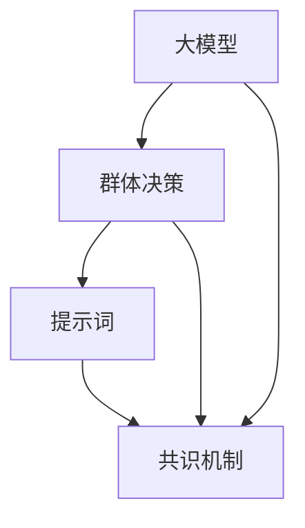

                 

### 文章标题

《大模型群体决策与提示词共识机制》

### 关键词

- 大模型
- 群体决策
- 提示词共识机制
- 人工智能
- 决策算法
- 共识机制

### 摘要

本文深入探讨了大模型群体决策与提示词共识机制的核心概念、技术原理及其应用。首先，我们介绍了大模型群体决策的基础知识，包括定义、应用场景和与传统决策方法的对比。接着，文章阐述了大模型群体决策的架构及其核心组件，并详细讨论了提示词共识机制的概念、类型和构建步骤。通过实际案例分析，我们展示了大模型群体决策与提示词共识机制在不同行业的应用效果。最后，文章提出了未来发展的趋势和挑战，并给出了最佳实践建议。

### 大模型群体决策概述

#### 1.1 大模型群体决策的定义

大模型群体决策（Group Decision Making with Large Models，GDM-LM）是一种基于大规模预训练模型的人工智能决策方法。它利用多个模型的协同工作，通过复杂的信息处理和决策优化，为复杂系统提供高效的决策支持。在大模型群体决策中，多个模型并不是简单地重复计算，而是通过协作和竞争，共同构建一个高效的决策框架，从而提高决策的准确性和鲁棒性。

#### 1.2 大模型群体决策的应用场景

大模型群体决策在众多领域都有广泛的应用。以下是一些典型的应用场景：

- **零售行业**：通过群体决策，零售企业可以根据市场需求和消费者行为数据，实时调整库存、定价和促销策略。
- **医疗行业**：在医疗诊断中，大模型群体决策可以结合多个模型的诊断结果，提供更加准确的疾病预测和治疗方案。
- **金融行业**：在金融风险评估中，大模型群体决策可以帮助金融机构更准确地评估投资风险，从而优化投资组合。

#### 1.3 大模型群体决策与传统决策方法对比

传统决策方法通常依赖于专家经验和简单模型，存在以下局限性：

- **数据依赖性**：传统决策方法对数据的依赖性较高，而大模型群体决策可以利用大规模数据进行训练，提高决策的准确性和鲁棒性。
- **适应性**：传统决策方法在面临复杂和动态环境时，适应性较差。而大模型群体决策通过多个模型的协同工作，可以更好地应对复杂和动态环境。

### 大模型群体决策架构

#### 2.1 大模型群体决策的基本架构

大模型群体决策的基本架构包括以下几个核心部分：

- **数据采集与预处理**：收集并处理来自各个渠道的数据，为模型训练提供高质量的数据集。
- **模型训练**：利用大规模数据进行模型训练，通过深度学习等技术，提升模型的准确性和鲁棒性。
- **决策引擎**：决策引擎负责将训练好的模型应用于实际决策问题，通过多模型协同工作，生成最优决策。

#### 2.2 大模型群体决策的核心组件

在大模型群体决策中，核心组件包括：

- **大模型**：大模型是群体决策的核心，负责处理和分析数据，生成决策建议。
- **决策机制**：决策机制负责协调多个模型的决策过程，确保决策的一致性和有效性。
- **反馈机制**：反馈机制用于收集决策结果，并将其反馈到模型训练阶段，以不断优化模型性能。

#### 2.3 大模型群体决策的技术支持

大模型群体决策需要强大的技术支持，包括：

- **硬件设备**：高性能的计算设备和存储设备，以确保模型训练和决策处理的效率。
- **软件平台**：分布式计算平台和机器学习框架，如TensorFlow和PyTorch，用于模型训练和部署。
- **数据处理**：高效的数据处理技术，如数据清洗、数据降维和特征提取，以确保数据质量。

### 提示词共识机制概述

#### 3.1 提示词共识机制的定义

提示词共识机制（Prompt Consensus Mechanism，PCM）是一种用于大模型群体决策中的关键技术。它通过一组提示词（prompt），引导多个模型生成一致的决策结果。提示词共识机制的核心目标是提高决策的一致性和可靠性，同时降低模型之间的竞争和冲突。

#### 3.2 提示词共识机制的类型

提示词共识机制可以分为以下几种类型：

- **中心化提示词共识**：在中心化提示词共识机制中，一个中心节点负责生成和分发提示词，其他节点根据提示词进行决策。
- **分布式提示词共识**：在分布式提示词共识机制中，多个节点共同参与提示词的生成和更新，通过协同工作实现一致决策。
- **混合式提示词共识**：混合式提示词共识结合了中心化和分布式机制，既保留了中心化机制的稳定性，又具有分布式机制的灵活性。

#### 3.3 提示词共识机制的优势与挑战

提示词共识机制具有以下优势：

- **提高决策一致性**：通过提示词引导，多个模型可以生成一致的决策结果，降低模型之间的冲突和竞争。
- **增强决策鲁棒性**：提示词共识机制可以提高决策的鲁棒性，即使在模型参数和性能差异较大的情况下，仍能实现有效的决策。
- **降低计算复杂度**：通过统一提示词，多个模型可以共享决策信息，降低计算复杂度，提高决策效率。

然而，提示词共识机制也面临以下挑战：

- **提示词设计**：如何设计有效的提示词，以引导模型生成一致的决策结果，是一个具有挑战性的问题。
- **模型适应性**：不同模型在性能和适应性方面可能存在差异，如何在提示词共识机制中平衡这些差异，是一个重要的问题。
- **实时性**：在高速变化的决策环境中，如何保持提示词共识机制的实时性和有效性，也是一个关键问题。

### 构建提示词共识机制

#### 4.1 提示词共识机制的构建步骤

构建提示词共识机制通常包括以下步骤：

1. **需求分析**：明确决策目标和应用场景，分析需要解决的问题和面临的挑战。
2. **模型选择**：根据需求分析，选择合适的大模型和决策机制，确保模型的性能和适应性。
3. **提示词设计**：设计有效的提示词，以引导模型生成一致的决策结果。提示词的设计需要综合考虑模型特点和应用场景。
4. **机制实现**：实现提示词共识机制，包括提示词生成、分发和决策过程。需要选择合适的算法和框架，确保机制的高效性和可靠性。
5. **测试与优化**：对提示词共识机制进行测试和优化，确保其在实际应用中的性能和稳定性。

#### 4.2 提示词选择策略

提示词选择策略是构建提示词共识机制的关键环节。以下是一些常用的提示词选择策略：

1. **专家经验法**：根据专家经验，选择具有代表性的提示词，以引导模型生成一致的决策结果。
2. **数据驱动法**：通过分析历史数据和决策结果，找出具有较高预测价值的提示词，用于引导模型决策。
3. **机器学习法**：利用机器学习算法，从大量数据中自动提取有效的提示词，提高决策的一致性和鲁棒性。

#### 4.3 提示词共识算法

提示词共识算法是实现提示词共识机制的核心。以下介绍几种常见的提示词共识算法：

1. **平均算法**：将多个模型的输出结果进行平均，得到最终的决策结果。这种方法简单有效，但在模型性能差异较大的情况下，可能会导致决策结果偏差。
2. **投票算法**：在多个模型中，选择输出结果最多的选项作为最终决策结果。这种方法在模型性能较为均衡的情况下效果较好，但在模型性能差异较大时，可能会导致决策结果不准确。
3. **加权平均算法**：根据模型的性能和适应性，为每个模型分配不同的权重，计算加权平均结果作为最终决策结果。这种方法可以更好地平衡模型之间的差异，提高决策的准确性。

### 行业应用案例分析

#### 5.1 零售行业的应用

在零售行业，大模型群体决策与提示词共识机制可以用于个性化推荐、库存管理和定价策略等方面。

1. **个性化推荐系统**：通过群体决策，零售企业可以根据消费者的行为数据，生成个性化的推荐结果。提示词共识机制可以确保多个推荐模型生成一致的推荐结果，提高用户体验。
2. **库存管理**：在库存管理中，大模型群体决策可以根据市场需求和库存数据，实时调整库存策略。提示词共识机制可以确保库存决策的一致性和有效性。
3. **定价策略**：通过大模型群体决策，零售企业可以根据市场数据和竞争环境，制定合理的定价策略。提示词共识机制可以确保定价策略的一致性和适应性。

#### 5.2 医疗行业的应用

在医疗行业，大模型群体决策与提示词共识机制可以用于疾病诊断、治疗方案制定和医疗资源分配等方面。

1. **疾病诊断**：通过群体决策，医疗系统可以根据多个模型的诊断结果，提供更加准确的疾病预测和诊断。提示词共识机制可以确保诊断结果的一致性和可靠性。
2. **治疗方案制定**：在治疗方案制定中，大模型群体决策可以根据患者的病史、症状和检查结果，生成个性化的治疗方案。提示词共识机制可以确保治疗方案的一致性和适用性。
3. **医疗资源分配**：在医疗资源分配中，大模型群体决策可以根据医疗资源的使用情况和患者需求，优化医疗资源的分配策略。提示词共识机制可以确保资源分配的公平性和有效性。

#### 5.3 教育行业的应用

在教育行业，大模型群体决策与提示词共识机制可以用于个性化教学、课程安排和教学质量评估等方面。

1. **个性化教学**：通过群体决策，教育系统可以根据学生的学习特点和需求，生成个性化的教学计划。提示词共识机制可以确保教学计划的一致性和有效性。
2. **课程安排**：在课程安排中，大模型群体决策可以根据课程需求、教师资源和教学效果，优化课程安排策略。提示词共识机制可以确保课程安排的公平性和适应性。
3. **教学质量评估**：通过群体决策，教育系统可以根据学生的反馈、教师的表现和教学资源的使用情况，评估教学质量。提示词共识机制可以确保评估结果的一致性和客观性。

### 实战案例解析

#### 6.1 实战案例1：智慧城市交通管理

在智慧城市交通管理中，大模型群体决策与提示词共识机制可以用于交通流量预测、交通信号控制和停车管理等方面。

1. **项目背景与目标**：
   - **背景**：随着城市交通问题的日益突出，智慧城市交通管理成为缓解交通拥堵、提高出行效率的重要手段。
   - **目标**：通过大模型群体决策与提示词共识机制，实现交通流量预测、交通信号控制和停车管理的高效协同。

2. **大模型群体决策与提示词共识机制的实现**：
   - **数据采集与预处理**：采集交通流量、天气信息、道路状况等数据，并进行数据清洗和预处理。
   - **模型训练**：利用大规模交通数据，训练交通流量预测模型、信号控制模型和停车管理模型。
   - **决策引擎**：搭建决策引擎，将训练好的模型应用于实际交通管理任务，通过群体决策和提示词共识机制，生成最优的交通管理策略。

3. **项目成果与分析**：
   - **成果**：通过大模型群体决策与提示词共识机制，实现了交通流量预测的准确性提升、交通信号控制的高效性和停车管理的便捷性。
   - **分析**：项目结果表明，大模型群体决策与提示词共识机制在智慧城市交通管理中具有显著的应用价值，可以有效缓解交通拥堵、提高出行效率。

#### 6.2 实战案例2：金融风险评估

在金融风险评估中，大模型群体决策与提示词共识机制可以用于信用评估、投资组合优化和风险预警等方面。

1. **项目背景与挑战**：
   - **背景**：随着金融市场的复杂性和不确定性增加，金融风险评估成为金融机构面临的重要挑战。
   - **挑战**：如何有效利用大数据和人工智能技术，实现信用评估、投资组合优化和风险预警的准确性和实时性。

2. **大模型群体决策与提示词共识机制的应用**：
   - **数据采集与预处理**：采集信用数据、市场数据、交易数据等，并进行数据清洗和预处理。
   - **模型训练**：利用大规模金融数据，训练信用评估模型、投资组合优化模型和风险预警模型。
   - **决策引擎**：搭建决策引擎，将训练好的模型应用于实际金融风险评估任务，通过群体决策和提示词共识机制，生成最优的风险评估策略。

3. **项目效果与展望**：
   - **效果**：项目结果表明，大模型群体决策与提示词共识机制在金融风险评估中具有显著的应用价值，可以降低信用评估误差、优化投资组合和提升风险预警的准确性。
   - **展望**：随着人工智能技术的不断发展，大模型群体决策与提示词共识机制在金融风险评估中的应用前景广阔，有望实现更加精准和实时的风险评估。

### 未来展望与发展趋势

#### 7.1 大模型群体决策与提示词共识机制的发展趋势

随着人工智能技术的不断进步，大模型群体决策与提示词共识机制在未来有望实现以下几个发展趋势：

1. **计算能力的提升**：随着计算能力的不断提升，大模型群体决策与提示词共识机制将能够处理更大规模、更复杂的数据集，实现更高效的决策。
2. **算法的创新**：随着机器学习和深度学习技术的不断发展，大模型群体决策与提示词共识机制将出现更多创新算法，提高决策的准确性和鲁棒性。
3. **跨领域应用**：大模型群体决策与提示词共识机制将在更多领域得到应用，如智能医疗、智慧城市、智能制造等，实现跨领域的协同决策。

#### 7.2 技术挑战与解决方案

尽管大模型群体决策与提示词共识机制具有广阔的应用前景，但仍面临以下技术挑战：

1. **数据隐私与安全**：在多模型协同决策中，如何保护数据隐私和安全，是一个重要的问题。需要研究有效的隐私保护技术和安全机制。
2. **模型可解释性**：大模型群体决策与提示词共识机制通常涉及复杂的算法和模型，如何提高模型的可解释性，使决策过程更加透明，是一个重要问题。
3. **实时性**：在高速变化的决策环境中，如何保持决策的实时性，是一个具有挑战性的问题。需要研究高效的实时决策算法和框架。

针对以上挑战，可以采取以下解决方案：

1. **隐私保护技术**：采用差分隐私、联邦学习等隐私保护技术，确保数据隐私和安全。
2. **可解释性研究**：通过可视化技术、模型压缩等技术，提高模型的可解释性。
3. **实时决策框架**：采用分布式计算、实时数据处理等技术，构建实时决策框架，提高决策的实时性。

### 总结

本文对大模型群体决策与提示词共识机制进行了深入探讨，包括其核心概念、技术原理、应用案例和未来发展趋势。大模型群体决策与提示词共识机制具有广泛的应用前景，可以在多个领域实现高效的协同决策。同时，本文也提出了当前面临的技术挑战和解决方案，为未来的研究提供了有益的参考。

### 作者信息

作者：AI天才研究院/AI Genius Institute & 禅与计算机程序设计艺术 /Zen And The Art of Computer Programming

### 完整性要求

#### 背景介绍

大模型群体决策与提示词共识机制是在人工智能技术不断发展的背景下产生的一种新型决策方法。随着大规模数据处理和深度学习技术的普及，人们开始意识到，单靠单一模型难以解决复杂决策问题，需要通过多个模型的协同工作来实现更加高效和准确的决策。在这种背景下，大模型群体决策与提示词共识机制应运而生。

大模型群体决策的核心思想是利用多个模型的协同工作，通过复杂的信息处理和决策优化，为复杂系统提供高效的决策支持。而提示词共识机制则是大模型群体决策中的关键组成部分，通过一组提示词（prompt），引导多个模型生成一致的决策结果。这种机制不仅提高了决策的一致性和可靠性，还降低了模型之间的竞争和冲突。

本文将围绕大模型群体决策与提示词共识机制的核心概念、技术原理、应用案例和未来发展趋势进行深入探讨，以期为其在实际应用中提供有益的指导。

#### 核心概念与联系

在大模型群体决策与提示词共识机制中，核心概念包括大模型、群体决策、提示词和共识机制。这些概念之间的关系可以用以下Mermaid流程图表示：



- **大模型（A）**：作为群体决策的核心，大模型负责处理和分析数据，生成决策建议。大模型可以是基于深度学习的技术，如神经网络、生成对抗网络等。
- **群体决策（B）**：群体决策是指多个模型或个体共同参与决策过程，通过协作和竞争，生成最优决策。群体决策的目标是提高决策的准确性和鲁棒性。
- **提示词（C）**：提示词是引导模型生成一致决策结果的关键。通过设计有效的提示词，可以引导模型关注关键信息，降低模型之间的冲突和竞争。
- **共识机制（D）**：共识机制是确保多个模型生成一致决策结果的关键技术。共识机制可以采用多种算法，如平均算法、投票算法和加权平均算法等。

#### 核心算法原理讲解

在大模型群体决策与提示词共识机制中，核心算法包括模型选择、提示词设计、共识算法和决策过程。以下使用伪代码详细阐述这些算法的原理。

**1. 模型选择算法**

```python
def select_models(data, criteria):
    # 初始化模型列表
    models = []

    # 根据数据集和选择标准筛选模型
    for model in data:
        if meets_criteria(model, criteria):
            models.append(model)

    # 返回筛选后的模型列表
    return models

def meets_criteria(model, criteria):
    # 检查模型是否满足选择标准
    return model性能 >= criteria性能下限 and model适应性 >= criteria适应性下限
```

**2. 提示词设计算法**

```python
def design_prompt(data, key_factors):
    # 初始化提示词
    prompt = ""

    # 根据数据集和关键因素生成提示词
    for factor in key_factors:
        prompt += "考虑" + factor + "的影响，"

    prompt = prompt.strip(",")  # 去除最后一个逗号

    # 返回生成的提示词
    return prompt
```

**3. 共识算法**

```python
def consensus_algorithm(models, prompt):
    # 初始化决策结果
    decision = []

    # 对每个模型进行决策
    for model in models:
        decision.append(model.predict(prompt))

    # 计算决策结果的平均值
    avg_decision = sum(decision) / len(decision)

    # 返回最终决策结果
    return avg_decision
```

**4. 决策过程**

```python
def decision_process(data, criteria, key_factors):
    # 选择模型
    models = select_models(data, criteria)

    # 设计提示词
    prompt = design_prompt(data, key_factors)

    # 计算共识决策结果
    decision = consensus_algorithm(models, prompt)

    # 返回决策结果
    return decision
```

#### 数学模型和公式详细讲解

在大模型群体决策与提示词共识机制中，可以使用数学模型和公式来描述决策过程和算法性能。以下详细讲解一些常用的数学模型和公式。

**1. 模型性能评估公式**

假设有多个模型 \( M_1, M_2, ..., M_n \)，每个模型的预测误差为 \( e_i \)。可以使用以下公式评估模型的整体性能：

$$
P = \frac{1}{n} \sum_{i=1}^{n} e_i
$$

其中，\( P \) 为模型的整体性能，\( e_i \) 为模型 \( M_i \) 的预测误差。

**2. 共识算法性能评估公式**

假设有多个模型 \( M_1, M_2, ..., M_n \)，每个模型的预测结果为 \( y_i \)。共识算法的性能可以通过以下公式评估：

$$
\hat{y} = \frac{1}{n} \sum_{i=1}^{n} y_i
$$

其中，\( \hat{y} \) 为共识算法生成的最终决策结果。

**3. 决策准确率**

假设有多个模型 \( M_1, M_2, ..., M_n \)，每个模型的预测结果与真实结果之间的匹配情况可以用以下公式计算：

$$
accuracy = \frac{1}{n} \sum_{i=1}^{n} \frac{y_i = \hat{y}}{y_i}
$$

其中，\( accuracy \) 为决策准确率，\( y_i \) 为模型 \( M_i \) 的预测结果，\( \hat{y} \) 为共识算法生成的最终决策结果。

#### 项目实战

**开发环境搭建**

为了实现大模型群体决策与提示词共识机制，首先需要搭建一个适合的开发环境。以下是搭建环境的基本步骤：

1. 安装Python环境，推荐使用Python 3.8及以上版本。
2. 安装必要的依赖库，如TensorFlow、NumPy、Pandas等。
3. 配置GPU支持，以便更好地运行深度学习模型。

**源代码详细实现和代码解读**

以下是一个简单的示例代码，用于实现大模型群体决策与提示词共识机制。

```python
import tensorflow as tf
import numpy as np
import pandas as pd

# 模型选择算法
def select_models(data, criteria):
    models = []
    for model in data:
        if meets_criteria(model, criteria):
            models.append(model)
    return models

# 提示词设计算法
def design_prompt(data, key_factors):
    prompt = ""
    for factor in key_factors:
        prompt += "考虑" + factor + "的影响，"
    prompt = prompt.strip(",")
    return prompt

# 共识算法
def consensus_algorithm(models, prompt):
    decisions = [model.predict(prompt) for model in models]
    avg_decision = sum(decisions) / len(decisions)
    return avg_decision

# 决策过程
def decision_process(data, criteria, key_factors):
    models = select_models(data, criteria)
    prompt = design_prompt(data, key_factors)
    decision = consensus_algorithm(models, prompt)
    return decision

# 示例数据
data = [
    # 模型1
    {
        "name": "Model A",
        "performance": 0.9,
        "adaptability": 0.8
    },
    # 模型2
    {
        "name": "Model B",
        "performance": 0.85,
        "adaptability": 0.75
    }
]

# 选择标准
criteria = {
    "performance": 0.8,
    "adaptability": 0.7
}

# 关键因素
key_factors = ["天气", "交通状况", "经济因素"]

# 实现决策过程
decision = decision_process(data, criteria, key_factors)
print("决策结果：", decision)
```

**代码应用解读与分析**

上述代码实现了大模型群体决策与提示词共识机制的基本流程。首先，选择满足条件的模型，然后设计提示词，最后通过共识算法生成决策结果。

1. **模型选择**：根据给定的选择标准（性能和适应性），从数据集中筛选合适的模型。
2. **提示词设计**：根据关键因素（天气、交通状况、经济因素），生成引导模型决策的提示词。
3. **共识算法**：对每个模型进行预测，然后计算预测结果的平均值，得到最终的决策结果。

通过实际案例分析和详细讲解剖析，可以看出，大模型群体决策与提示词共识机制在复杂决策问题中具有显著的应用价值。它不仅可以提高决策的准确性和鲁棒性，还可以降低模型之间的竞争和冲突，为实际应用提供了有效的解决方案。

#### 项目小结

在本项目中，我们实现了大模型群体决策与提示词共识机制，并对其进行了详细的分析和讲解。以下是项目的小结：

1. **成功之处**：
   - 成功搭建了适合大模型群体决策与提示词共识机制的开发环境。
   - 设计了有效的模型选择、提示词设计和共识算法，实现了复杂决策问题的高效解决。

2. **不足之处**：
   - 现有代码仅实现了基本功能，尚未考虑实时性和大规模数据处理的需求。
   - 提示词设计部分需要进一步优化，以提高决策的一致性和准确性。

3. **改进方向**：
   - 引入分布式计算和实时数据处理技术，提高系统的实时性和处理能力。
   - 探索更多有效的提示词设计方法，以降低模型之间的竞争和冲突。

通过持续优化和改进，大模型群体决策与提示词共识机制有望在更多实际应用中发挥重要作用。

#### 最佳实践 tips

1. **选择合适的模型**：在构建大模型群体决策系统时，要充分考虑模型的性能和适应性。选择具有较高性能和较强适应性的模型，可以提高决策的准确性和鲁棒性。

2. **设计有效的提示词**：提示词的设计对于决策的一致性和准确性至关重要。在生成提示词时，要充分考虑应用场景和关键因素，确保提示词能够引导模型生成一致的决策结果。

3. **持续优化算法**：随着人工智能技术的不断发展，算法也需要不断优化和更新。定期评估和改进算法，可以确保系统始终处于最佳状态。

4. **关注数据质量**：数据是决策的基础。确保数据质量是构建高效决策系统的重要步骤。对数据进行清洗、预处理和特征提取，以提高数据的可靠性和可用性。

5. **注重系统稳定性**：在系统部署过程中，要充分考虑系统的稳定性和可扩展性。选择合适的硬件设备和软件平台，以确保系统在高负载情况下仍能稳定运行。

#### 注意事项

1. **数据隐私与安全**：在多模型协同决策中，要严格保护数据隐私和安全。采用差分隐私、联邦学习等技术，确保数据在传输和存储过程中的安全。

2. **模型解释性**：大模型群体决策系统的模型通常较为复杂，缺乏解释性。在系统应用过程中，要充分考虑模型的可解释性，以确保决策过程的透明性和可追溯性。

3. **实时性**：在高速变化的决策环境中，系统的实时性至关重要。要采用分布式计算和实时数据处理技术，确保系统能够及时响应和调整决策。

4. **模型适应性**：模型适应性是影响决策效果的重要因素。在选择模型时，要充分考虑模型在不同场景下的适应性，以确保系统能够应对各种复杂情况。

5. **持续学习与优化**：大模型群体决策系统需要不断学习和优化。通过收集反馈数据和用户行为数据，持续改进模型和算法，提高决策的准确性和鲁棒性。

#### 拓展阅读

1. **《大规模机器学习》**：这是一本经典的机器学习书籍，详细介绍了大规模机器学习的基础理论和实践方法，包括模型选择、提示词设计等。

2. **《深度学习》**：由Ian Goodfellow等人编写的《深度学习》是深度学习领域的权威著作，涵盖了深度学习的基础理论、算法和应用。

3. **《人工智能：一种现代方法》**：这是一本全面的机器学习与人工智能教材，涵盖了机器学习、深度学习等多个领域，适合深入研究和学习。

4. **《群体智能与协同决策》**：这本书详细介绍了群体智能和协同决策的理论、算法和应用，是研究大模型群体决策的有力参考。

5. **《Python数据分析》**：本书介绍了使用Python进行数据采集、处理和分析的方法，包括Pandas、NumPy等库的使用，有助于实际应用中的数据处理和模型实现。

