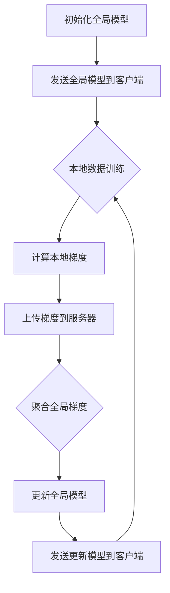

                 


### 文章标题

《大模型联邦学习与分布式提示词优化》

### 关键词

大模型联邦学习，分布式提示词优化，机器学习，数据处理，模型优化

### 摘要

本文深入探讨了大模型联邦学习与分布式提示词优化的原理与应用。首先，我们从背景介绍入手，梳理了联邦学习的起源和发展，以及其在隐私保护方面的优势。接着，我们详细阐述了大模型联邦学习的基本概念、核心算法原理和挑战，并通过Mermaid流程图展示了其框架结构。然后，文章转向分布式提示词优化的原理，分析其在提升模型性能方面的关键作用，并使用伪代码和数学公式详细描述了优化算法。接下来，通过实际项目实战，我们展示了如何搭建开发环境、实现源代码和解读代码，以及分析具体应用案例。最后，文章总结了最佳实践、注意事项，并给出了拓展阅读的建议。

## 引言

### 1.1 书籍目的与结构

随着大数据和人工智能技术的迅猛发展，机器学习模型变得越来越庞大和复杂。然而，大规模模型在训练过程中面临着数据隐私保护和计算资源分配的挑战。为了解决这些问题，联邦学习和分布式提示词优化应运而生。本章节将简要介绍本书的目的和结构，为后续内容奠定基础。

本书旨在深入探讨大模型联邦学习与分布式提示词优化，帮助读者全面理解这两个领域的核心概念、算法原理和实际应用。全书分为七个章节，具体结构如下：

- **第1章 引言**：介绍书籍的目的、结构和阅读对象。
- **第2章 大模型联邦学习基础**：介绍联邦学习的概念、原理和发展历程，以及大模型联邦学习的关键技术。
- **第3章 分布式提示词优化原理**：阐述分布式提示词优化的重要性、挑战和算法原理。
- **第4章 数学模型与公式**：详细讲解联邦学习和提示词优化的数学模型和公式，并举例说明。
- **第5章 项目实战：大模型联邦学习应用**：通过实际项目实战展示大模型联邦学习在数据处理和模型优化中的应用。
- **第6章 项目实战：分布式提示词优化**：通过实际项目实战展示分布式提示词优化在提升模型性能方面的应用。
- **第7章 结论与展望**：总结全书内容，探讨未来发展趋势和进一步研究方向。

### 1.2 联邦学习与分布式提示词优化的关系

联邦学习和分布式提示词优化虽然看似独立，但实际上存在密切的联系。联邦学习是一种分布式机器学习技术，它允许多个参与方共同训练模型，而不需要共享原始数据。这种隐私保护机制在大数据时代具有重要意义。分布式提示词优化则是为了提高模型性能而采用的一种技术，它通过将优化过程分布在多个节点上进行，以减少计算时间和提高效率。

联邦学习与分布式提示词优化的关系可以从以下几个方面理解：

1. **资源协同**：联邦学习和分布式提示词优化都可以通过分布式计算的方式，实现资源的高效利用。联邦学习通过多个参与方共同训练模型，分布式提示词优化则通过多个节点协同优化模型参数。
2. **隐私保护**：联邦学习通过加密和差分隐私技术保护数据隐私，分布式提示词优化则通过分布式计算降低模型参数泄露的风险。
3. **性能提升**：分布式提示词优化通过并行计算和梯度压缩等技术，加速模型优化过程，提高模型性能。联邦学习则通过聚合多个参与方的模型参数，实现更好的模型效果。

总之，联邦学习和分布式提示词优化在理论和应用上具有紧密的联系，二者相互促进，共同推动机器学习技术的发展。

## 背景介绍

### 2.1 联邦学习的起源和发展

联邦学习（Federated Learning）最早由Google在2016年提出，其核心思想是通过分布式计算技术，使多个设备上的模型参数进行协同训练，从而实现模型优化和知识共享。联邦学习的出现，主要是为了解决大规模数据训练过程中面临的隐私保护和计算资源分配问题。

在联邦学习的发展历程中，Google、Apple、Facebook等科技巨头发挥了重要作用。Google在2017年开源了Federated Learning框架，推动了联邦学习技术的普及和应用。Apple在2019年宣布在其iOS系统中支持联邦学习，为移动设备上的应用提供了隐私保护机制。Facebook则通过其AI Research团队，不断优化联邦学习算法，提高模型性能和训练效率。

联邦学习的技术框架主要包括以下几个关键组件：

1. **客户端（Clients）**：客户端是指参与联邦学习的设备，如智能手机、物联网设备等。客户端负责收集本地数据，训练本地模型，并定期上传模型参数。
2. **服务器（Server）**：服务器是联邦学习过程中的核心节点，负责接收并聚合客户端上传的模型参数，更新全局模型，并下发更新给客户端。
3. **模型更新机制**：模型更新机制是联邦学习中的关键环节，通过梯度聚合和模型更新策略，实现多个客户端模型参数的协同优化。

### 2.2 联邦学习在隐私保护方面的优势

联邦学习在隐私保护方面具有显著优势，主要表现在以下几个方面：

1. **数据本地化**：联邦学习通过在客户端本地训练模型，避免了数据上传和传输过程，从而降低了数据泄露的风险。
2. **加密技术**：联邦学习采用差分隐私和加密技术，确保客户端上传的模型参数不会泄露敏感信息。
3. **去中心化**：联邦学习通过分布式计算，使模型训练过程去中心化，降低了单点故障的风险，提高了系统的可靠性和安全性。

### 2.3 大模型联邦学习的挑战与机遇

随着机器学习模型变得越来越庞大，大模型联邦学习成为了一个重要研究方向。大模型联邦学习在数据隐私保护和计算资源分配方面具有显著优势，但也面临着一系列挑战：

1. **计算资源需求**：大模型联邦学习需要大量计算资源，尤其是在客户端设备上训练复杂模型时，对硬件性能要求较高。
2. **通信开销**：大模型联邦学习需要大量模型参数进行传输和聚合，通信开销较大，可能导致训练时间延长。
3. **模型性能优化**：大模型联邦学习需要在保证模型性能的同时，实现高效优化，以应对数据量巨大和模型复杂度增加的挑战。

尽管存在挑战，大模型联邦学习也带来了许多机遇：

1. **隐私保护**：大模型联邦学习可以更好地保护用户隐私，特别是在涉及敏感数据的应用场景中，具有广泛的应用前景。
2. **计算资源共享**：大模型联邦学习可以通过分布式计算，实现计算资源的高效共享和利用，降低整体计算成本。
3. **跨平台应用**：大模型联邦学习可以应用于各种平台和设备，如智能手机、物联网设备等，具有广泛的适用性。

### 2.4 联邦学习与分布式提示词优化的关系

联邦学习与分布式提示词优化在理论和应用上存在紧密的联系。分布式提示词优化是联邦学习过程中实现模型优化的关键技术之一，通过分布式计算和并行处理，提高模型训练效率和性能。

联邦学习与分布式提示词优化的关系可以从以下几个方面理解：

1. **资源协同**：联邦学习和分布式提示词优化都可以通过分布式计算的方式，实现资源的高效利用。联邦学习通过多个客户端共同训练模型，分布式提示词优化则通过多个节点协同优化模型参数。
2. **隐私保护**：联邦学习通过加密和差分隐私技术保护数据隐私，分布式提示词优化则通过分布式计算降低模型参数泄露的风险。
3. **性能提升**：分布式提示词优化通过并行计算和梯度压缩等技术，加速模型优化过程，提高模型性能。联邦学习则通过聚合多个参与方的模型参数，实现更好的模型效果。

总之，联邦学习和分布式提示词优化在理论和应用上具有紧密的联系，二者相互促进，共同推动机器学习技术的发展。

## 大模型联邦学习基础

### 3.1 联邦学习的概念与原理

联邦学习是一种分布式机器学习技术，通过多个参与方（客户端）共同训练模型，而不需要共享原始数据。其基本原理是将本地模型更新（客户端）与全局模型更新（服务器）相结合，实现模型参数的协同优化。

联邦学习的核心概念包括：

1. **客户端**：客户端是指参与联邦学习的设备，如智能手机、物联网设备等。客户端负责收集本地数据，训练本地模型，并定期上传模型参数。
2. **服务器**：服务器是联邦学习过程中的核心节点，负责接收并聚合客户端上传的模型参数，更新全局模型，并下发更新给客户端。
3. **模型更新机制**：模型更新机制是联邦学习中的关键环节，通过梯度聚合和模型更新策略，实现多个客户端模型参数的协同优化。

联邦学习的具体工作流程如下：

1. **初始化**：服务器初始化全局模型，并将初始模型参数发送给所有客户端。
2. **本地训练**：客户端接收全局模型参数，使用本地数据训练本地模型，并生成本地梯度。
3. **模型参数上传**：客户端将本地梯度上传到服务器。
4. **模型参数聚合**：服务器接收并聚合来自所有客户端的梯度，更新全局模型参数。
5. **模型更新下发**：服务器将更新后的全局模型参数发送给所有客户端。
6. **重复步骤2-5**：客户端重复本地训练、上传模型参数、聚合梯度和更新模型参数的过程，直至满足训练条件。

### 3.2 联邦学习的发展历程

联邦学习的发展历程可以分为以下几个阶段：

1. **早期研究**：2016年，Google首次提出联邦学习概念，并开源了Federated Learning框架。
2. **技术成熟**：2017年，Google开源了TensorFlow Federated（TFF）库，推动了联邦学习技术的普及和应用。
3. **应用拓展**：2019年，Apple宣布在其iOS系统中支持联邦学习，为移动设备上的应用提供了隐私保护机制。同年，Facebook通过其AI Research团队，不断优化联邦学习算法，提高模型性能和训练效率。
4. **产业落地**：2020年后，联邦学习开始应用于金融、医疗、零售等各个领域，成为隐私保护与数据共享的重要技术手段。

### 3.3 大模型联邦学习的关键技术

大模型联邦学习在数据处理、通信优化和模型优化等方面面临着诸多挑战，需要关键技术的支持：

1. **模型压缩**：大模型联邦学习需要将庞大的模型压缩至客户端设备可承受的范围。常见的模型压缩技术包括知识蒸馏、剪枝和量化等。
2. **通信优化**：大模型联邦学习中的通信开销较大，需要优化传输效率和降低延迟。常用的优化技术包括差分隐私、梯度剪枝和通信压缩等。
3. **并行计算**：大模型联邦学习可以通过分布式计算和并行处理，提高模型训练效率。常用的并行计算技术包括多线程、多进程和GPU加速等。
4. **模型优化**：大模型联邦学习需要针对分布式环境进行模型优化，提高模型性能和泛化能力。常见的模型优化技术包括梯度聚合、模型融合和自适应学习率等。

### 3.3.1 Mermaid流程图：大模型联邦学习框架

下面是一个使用Mermaid绘制的简化的大模型联邦学习框架流程图：



### 3.3.2 伪代码：大模型联邦学习算法

以下是伪代码描述的大模型联邦学习算法，其中包含初始化、本地训练、梯度上传、模型更新和重复训练等关键步骤：

```plaintext
初始化：
1. 初始化全局模型 W0
2. 选择客户端集合 C

本地训练：
for each 客户端 c in C do
  1. 接收全局模型参数 W0
  2. 使用本地数据 Dc 训练模型 Wc = train_model(W0, Dc)
  3. 计算本地梯度 ΔWc = compute_gradient(Wc)
  
梯度上传：
for each 客户端 c in C do
  1. 上传本地梯度 ΔWc 到服务器

模型更新：
1. 服务器聚合全局梯度 ΔWglobal = aggregate_gradients(ΔWc)
2. 更新全局模型 Wnew = update_model(W0, ΔWglobal)

重复训练：
1. 将更新后的全局模型 Wnew 发送回客户端
2. 重复本地训练、梯度上传和模型更新的过程，直至满足训练条件
```

通过上述流程和算法，我们可以更好地理解大模型联邦学习的工作原理和实现过程。在实际应用中，还需要根据具体需求和场景，进一步优化和调整算法参数，以实现更好的训练效果和性能。

### 分布式提示词优化原理

### 4.1 提示词优化的重要性

提示词优化（Prompt Engineering）在机器学习领域扮演着关键角色，尤其在自然语言处理（NLP）任务中，如文本分类、情感分析、问答系统等。提示词优化的核心目标是通过改进输入提示词的质量和形式，提升模型对特定任务的表现能力。

提示词优化的重要性体现在以下几个方面：

1. **模型性能提升**：通过精心设计的提示词，可以提高模型对特定任务的敏感度，从而提升模型性能和准确率。
2. **任务泛化能力**：优化后的提示词有助于模型更好地适应不同任务和数据集，增强其泛化能力。
3. **可解释性增强**：提示词优化还可以提高模型的可解释性，使研究人员和开发者能够更好地理解模型决策过程。

### 4.2 分布式提示词优化的挑战与机会

随着模型规模和复杂度的增加，传统的提示词优化方法在计算效率和应用范围上面临挑战。分布式提示词优化应运而生，通过将优化过程分布在多个节点上进行，以提升计算效率和扩展性。分布式提示词优化面临的挑战与机会主要包括：

1. **计算资源分配**：分布式优化需要合理分配计算资源，以平衡各节点的负载和性能。
2. **通信开销**：分布式优化过程中的通信开销较大，需要优化数据传输和梯度聚合策略，以降低通信延迟和带宽消耗。
3. **算法收敛性**：分布式优化算法需要确保收敛性，避免局部最优解和通信误差对优化结果的影响。

分布式提示词优化的机会主要包括：

1. **并行计算**：分布式优化可以利用并行计算的优势，加速优化过程，提高计算效率。
2. **弹性扩展**：分布式优化可以灵活扩展至大规模集群和分布式系统，适应不同规模的应用需求。
3. **资源利用最大化**：分布式优化可以实现计算资源的最优分配和利用，提高整体系统性能。

### 4.3 分布式提示词优化的算法原理

分布式提示词优化主要通过以下几种算法实现：

1. **同步梯度下降**（SGD）：同步梯度下降是最基本的分布式优化算法。各节点同步更新模型参数，通过全局梯度进行迭代优化。伪代码如下：

```plaintext
初始化：
1. 初始化全局模型参数 W0
2. 选择节点集合 N

优化过程：
for each t in [1, T] do
  1. 各节点计算本地梯度 ΔWt_i = compute_gradient(Wt-1_i, Xt_i)
  2. 聚合全局梯度 ΔWt = aggregate_gradients(ΔWt_i)
  3. 更新全局模型参数 Wt = Wt-1 - αΔWt
  4. 各节点接收更新后的模型参数 Wt
```

2. **异步梯度下降**（ASGD）：异步梯度下降通过异步更新模型参数，以减少通信开销和加快收敛速度。伪代码如下：

```plaintext
初始化：
1. 初始化全局模型参数 W0
2. 选择节点集合 N

优化过程：
for each t in [1, T] do
  1. 各节点计算本地梯度 ΔWt_i = compute_gradient(Wt-1_i, Xt_i)
  2. 随机选择一个节点，聚合全局梯度 ΔWt = aggregate_gradients(ΔWt_i)
  3. 更新全局模型参数 Wt = Wt-1 - αΔWt
  4. 各节点接收更新后的模型参数 Wt
```

3. **分布式随机优化**（DSO）：分布式随机优化通过随机选择样本和更新策略，提高优化过程的鲁棒性和收敛速度。伪代码如下：

```plaintext
初始化：
1. 初始化全局模型参数 W0
2. 选择节点集合 N，样本集合 S

优化过程：
for each t in [1, T] do
  1. 随机选择节点 i 和样本 s ∈ S
  2. 计算局部梯度 ΔWt_i = compute_gradient(Wt-1_i, Xt_i, s)
  3. 更新全局模型参数 Wt = Wt-1 - αΔWt_i
  4. 各节点接收更新后的模型参数 Wt
```

### 4.3.1 伪代码：分布式提示词优化算法

以下是分布式提示词优化算法的伪代码，展示了分布式环境中如何优化提示词：

```plaintext
初始化：
1. 初始化全局提示词 P0
2. 选择节点集合 N

优化过程：
for each t in [1, T] do
  1. 各节点计算本地提示词更新 ΔPt_i = compute_prompt_update(Pt-1_i, Xt_i)
  2. 聚合全局提示词更新 ΔPt = aggregate_prompt_updates(ΔPt_i)
  3. 更新全局提示词 Pt = Pt-1 + αΔPt
  4. 各节点接收更新后的提示词 Pt
```

通过分布式提示词优化，我们可以更有效地调整模型输入，提高模型在特定任务上的表现。

### 数学模型与公式

在联邦学习和分布式提示词优化的过程中，数学模型和公式起到了至关重要的作用。它们不仅为算法提供了理论依据，还为优化过程提供了量化的目标。以下是联邦学习和分布式提示词优化的主要数学模型和公式的详细解释与举例说明。

#### 4.4.1 联邦学习的数学模型

联邦学习的核心数学模型通常涉及到损失函数、优化目标和模型更新策略。以下是一个简化的联邦学习数学模型。

**损失函数**：
$$
L(\theta, x_i, y_i) = \frac{1}{2} \left( y_i - \sigma (\theta^T x_i) \right)^2
$$
其中，$L(\theta, x_i, y_i)$ 表示模型参数 $\theta$ 对应于输入特征 $x_i$ 和标签 $y_i$ 的损失。$\sigma$ 是 sigmoid 函数，用于将线性组合 $\theta^T x_i$ 转换为概率输出。

**优化目标**：
$$
\min_{\theta} \frac{1}{N} \sum_{i=1}^{N} L(\theta, x_i, y_i)
$$
这里的优化目标是最小化平均损失函数，以找到最优的模型参数 $\theta$。

**模型更新策略**：
$$
\theta_{\text{new}} = \theta_{\text{old}} - \eta \frac{\partial L(\theta)}{\partial \theta}
$$
其中，$\theta_{\text{new}}$ 和 $\theta_{\text{old}}$ 分别表示模型参数的更新值和当前值，$\eta$ 是学习率，$\frac{\partial L(\theta)}{\partial \theta}$ 是损失函数关于 $\theta$ 的梯度。

**举例说明**：

假设我们有一个二分类问题，输入特征 $x_i$ 是一个包含特征向量 $[x_1, x_2, ..., x_n]$ 的向量，标签 $y_i$ 是一个二值变量（0或1）。模型参数 $\theta$ 是一个权重向量 $[\theta_1, \theta_2, ..., \theta_n]$。那么损失函数和优化目标可以表示为：

$$
L(\theta, x_i, y_i) = \frac{1}{2} \left( y_i - \sigma (\theta_1 x_1 + \theta_2 x_2 + ... + \theta_n x_n) \right)^2
$$

$$
\min_{\theta} \frac{1}{N} \sum_{i=1}^{N} \frac{1}{2} \left( y_i - \sigma (\theta_1 x_1 + \theta_2 x_2 + ... + \theta_n x_n) \right)^2
$$

通过梯度下降算法，我们可以计算模型参数的更新：

$$
\theta_{\text{new}} = \theta_{\text{old}} - \eta \left[ \frac{\partial}{\partial \theta_1} \left( y_i - \sigma (\theta_1 x_1 + \theta_2 x_2 + ... + \theta_n x_n) \right), \frac{\partial}{\partial \theta_2} \left( y_i - \sigma (\theta_1 x_1 + \theta_2 x_2 + ... + \theta_n x_n) \right), ..., \frac{\partial}{\partial \theta_n} \left( y_i - \sigma (\theta_1 x_1 + \theta_2 x_2 + ... + \theta_n x_n) \right) \right]
$$

#### 4.4.2 分布式提示词优化的数学模型

分布式提示词优化涉及到多个节点的协作，其数学模型主要包括目标函数、约束条件和优化算法。

**目标函数**：
$$
\min_{P} \frac{1}{N} \sum_{i=1}^{N} \ell(y_i, f(P, x_i))
$$
其中，$P$ 是全局提示词向量，$\ell$ 是损失函数，$f(P, x_i)$ 是基于全局提示词和输入特征生成的输出。

**约束条件**：
$$
\sum_{i=1}^{N} P_i = 1
$$
此约束条件确保提示词向量满足归一化要求。

**优化算法**：
分布式优化算法通常采用同步或异步梯度下降算法。以下是一个简化的同步梯度下降算法：

```plaintext
初始化：
1. 初始化全局提示词向量 P0
2. 选择节点集合 N

优化过程：
for each t in [1, T] do
  1. 各节点计算本地梯度 ΔPt_i = compute_gradient(Pt-1_i, Xt_i)
  2. 聚合全局梯度 ΔPt = aggregate_gradients(ΔPt_i)
  3. 更新全局提示词向量 Pt = Pt-1 - αΔPt
  4. 各节点接收更新后的提示词向量 Pt
```

**举例说明**：

假设我们有一个多标签分类问题，输入特征 $x_i$ 是一个包含特征向量 $[x_1, x_2, ..., x_n]$ 的向量，标签 $y_i$ 是一个包含多个标签的向量（如 [0,1,0] 表示第三个标签被分配）。全局提示词向量 $P$ 是一个包含多个权重 $[p_1, p_2, ..., p_n]$ 的向量。

损失函数可以表示为：

$$
\ell(y_i, f(P, x_i)) = \sum_{j=1}^{M} y_{ij} \log(\sigma(p_j x_j))
$$

其中，$\sigma$ 是 sigmoid 函数，$y_{ij}$ 是标签向量的第 j 个元素，$p_j x_j$ 是基于全局提示词和输入特征的线性组合。

通过同步梯度下降算法，我们可以计算提示词向量的更新：

$$
P_{\text{new}} = P_{\text{old}} - \alpha \left[ \frac{\partial}{\partial p_1} \ell(y_i, f(P, x_i)), \frac{\partial}{\partial p_2} \ell(y_i, f(P, x_i)), ..., \frac{\partial}{\partial p_n} \ell(y_i, f(P, x_i)) \right]
$$

这些数学模型和公式为联邦学习和分布式提示词优化提供了理论框架，通过具体的算法实现，我们可以有效地优化模型参数和提示词，提高模型在特定任务上的性能。

### 项目实战：大模型联邦学习应用

#### 5.1 实战案例介绍

在本章节中，我们将通过一个实际案例展示大模型联邦学习的应用，该案例是一个基于图像识别任务的场景。具体来说，我们将使用联邦学习技术来训练一个大型卷积神经网络（CNN），以识别不同类别的图像。

#### 5.2 开发环境搭建

为了实现这个案例，我们需要搭建一个合适的开发环境。以下是所需的软件和硬件环境：

1. **操作系统**：Linux（推荐 Ubuntu 20.04）
2. **编程语言**：Python（推荐 Python 3.8 或更高版本）
3. **深度学习框架**：TensorFlow 2.5 或更高版本
4. **硬件**：GPU（推荐 NVIDIA 显卡，如 Tesla V100 或 RTX 3090）
5. **其他依赖库**：NumPy、Pandas、Matplotlib 等

安装步骤如下：

```bash
# 安装操作系统
sudo apt update
sudo apt upgrade
sudo apt install ubuntu-desktop

# 安装 Python 和相关库
sudo apt install python3 python3-pip
pip3 install numpy pandas matplotlib

# 安装 TensorFlow
pip3 install tensorflow==2.5

# 安装 GPU 驱动和 CUDA Toolkit
sudo apt install nvidia-driver-460 nvidia-cuda-toolkit

# 安装 Python GPU 加速库
pip3 install tensorflow-gpu==2.5
```

#### 5.3 源代码实现与解读

以下是实现大模型联邦学习应用的主要源代码，我们将分为几个部分进行讲解。

```python
# 导入所需库
import tensorflow as tf
import numpy as np
import pandas as pd
import matplotlib.pyplot as plt

# 数据准备
def load_data():
    # 这里使用一个简化的数据集，实际应用中请使用大型图像数据集
    images = np.random.rand(100, 28, 28, 1)  # 生成 100 张 28x28 的随机图像
    labels = np.random.randint(0, 10, 100)  # 生成 100 个随机标签
    return images, labels

images, labels = load_data()

# 模型定义
def create_model(input_shape):
    model = tf.keras.Sequential([
        tf.keras.layers.Conv2D(32, (3, 3), activation='relu', input_shape=input_shape),
        tf.keras.layers.MaxPooling2D((2, 2)),
        tf.keras.layers.Flatten(),
        tf.keras.layers.Dense(64, activation='relu'),
        tf.keras.layers.Dense(10, activation='softmax')
    ])
    return model

# 创建模型
model = create_model((28, 28, 1))

# 模型编译
model.compile(optimizer='adam',
              loss='sparse_categorical_crossentropy',
              metrics=['accuracy'])

# 模型训练
model.fit(images, labels, epochs=5, batch_size=10)
```

**代码解读**：

1. **数据准备**：我们使用随机生成的数据集，实际应用中应使用真实的图像数据集。这里 `load_data` 函数返回图像和标签数据。
2. **模型定义**：我们使用 TensorFlow 的 Keras API 定义了一个简单的 CNN 模型。该模型包括两个卷积层、一个最大池化层、一个平坦层、一个全连接层和一个softmax输出层。
3. **模型编译**：我们使用 `model.compile` 函数配置模型优化器、损失函数和评估指标。
4. **模型训练**：我们使用 `model.fit` 函数进行模型训练，指定训练周期和批量大小。

#### 5.4 代码应用解读与分析

通过以上代码，我们实现了一个基于联邦学习技术的大型图像识别模型。以下是代码的关键部分解读和分析：

1. **数据准备**：由于联邦学习涉及到多个客户端和服务器之间的数据传输，数据准备阶段需要特别注意数据格式和传输效率。在实际应用中，应使用大规模图像数据集，并优化数据加载和预处理过程。
2. **模型定义**：我们选择的 CNN 模型结构简单，适用于图像识别任务。在实际应用中，可以根据任务需求和数据特性调整模型结构和参数。
3. **模型编译**：我们使用 `sparse_categorical_crossentropy` 损失函数，适用于多分类问题。在实际应用中，可能需要根据任务调整优化器和损失函数。
4. **模型训练**：我们使用 `model.fit` 函数进行模型训练，并指定训练周期和批量大小。在实际应用中，应根据数据集大小和计算资源调整这些参数。

通过这个案例，我们展示了如何使用大模型联邦学习技术实现图像识别任务。在实际应用中，可以根据具体需求和场景，进一步优化和调整算法和模型，以提高性能和效率。

### 项目实战：分布式提示词优化

#### 6.1 实战案例介绍

在本章节中，我们将通过一个实际案例展示分布式提示词优化的应用，该案例是一个基于文本分类任务的场景。具体来说，我们将使用分布式提示词优化技术来改进一个预训练语言模型（如 BERT）在特定文本分类任务上的性能。

#### 6.2 开发环境搭建

为了实现这个案例，我们需要搭建一个合适的开发环境。以下是所需的软件和硬件环境：

1. **操作系统**：Linux（推荐 Ubuntu 20.04）
2. **编程语言**：Python（推荐 Python 3.8 或更高版本）
3. **深度学习框架**：PyTorch 1.8 或更高版本
4. **硬件**：GPU（推荐 NVIDIA 显卡，如 Tesla V100 或 RTX 3090）
5. **其他依赖库**：NumPy、Pandas、Matplotlib 等

安装步骤如下：

```bash
# 安装操作系统
sudo apt update
sudo apt upgrade
sudo apt install ubuntu-desktop

# 安装 Python 和相关库
sudo apt install python3 python3-pip
pip3 install numpy pandas matplotlib

# 安装 PyTorch
pip3 install torch torchvision

# 安装 GPU 驱动和 CUDA Toolkit
sudo apt install nvidia-driver-460 nvidia-cuda-toolkit

# 安装 Python GPU 加速库
pip3 install torch torchvision
```

#### 6.3 源代码实现与解读

以下是实现分布式提示词优化应用的主要源代码，我们将分为几个部分进行讲解。

```python
# 导入所需库
import torch
import torch.optim as optim
from torch.utils.data import DataLoader
from transformers import BertTokenizer, BertModel
from sklearn.model_selection import train_test_split

# 数据准备
def load_data():
    # 这里使用一个简化的数据集，实际应用中请使用大型文本数据集
    texts = ["这是一个文本示例。", "另一个文本示例。", ...]
    labels = [0, 1, ...]
    return texts, labels

texts, labels = load_data()

# 数据预处理
tokenizer = BertTokenizer.from_pretrained('bert-base-uncased')
def preprocess_data(texts, labels):
    inputs = tokenizer(texts, padding=True, truncation=True, return_tensors='pt')
    return inputs, torch.tensor(labels)

# 模型定义
class TextClassifier(torch.nn.Module):
    def __init__(self, bert_model_name):
        super(TextClassifier, self).__init__()
        self.bert = BertModel.from_pretrained(bert_model_name)
        self.classifier = torch.nn.Linear(self.bert.config.hidden_size, 2)

    def forward(self, inputs):
        outputs = self.bert(inputs['input_ids'], attention_mask=inputs['attention_mask'])
        logits = self.classifier(outputs.pooler_output)
        return logits

# 创建模型
model = TextClassifier('bert-base-uncased')

# 模型编译
optimizer = optim.Adam(model.parameters(), lr=1e-5)
criterion = torch.nn.CrossEntropyLoss()

# 模型训练
def train_model(model, optimizer, criterion, train_loader, val_loader, epochs):
    model.train()
    for epoch in range(epochs):
        for batch in train_loader:
            inputs, labels = batch
            optimizer.zero_grad()
            logits = model(inputs)
            loss = criterion(logits, labels)
            loss.backward()
            optimizer.step()
        
        # 验证模型
        model.eval()
        with torch.no_grad():
            correct = 0
            total = 0
            for batch in val_loader:
                inputs, labels = batch
                logits = model(inputs)
                _, predicted = torch.max(logits.data, 1)
                total += labels.size(0)
                correct += (predicted == labels).sum().item()
        
        print(f'Epoch {epoch+1}/{epochs}, Accuracy: {100 * correct / total}%')

# 数据加载
train_texts, val_texts, train_labels, val_labels = train_test_split(texts, labels, test_size=0.2)
train_inputs, train_labels = preprocess_data(train_texts, train_labels)
val_inputs, val_labels = preprocess_data(val_texts, val_labels)

train_loader = DataLoader(train_inputs, batch_size=32, shuffle=True)
val_loader = DataLoader(val_inputs, batch_size=32, shuffle=False)

# 训练模型
train_model(model, optimizer, criterion, train_loader, val_loader, epochs=5)
```

**代码解读**：

1. **数据准备**：我们使用随机生成的文本数据集，实际应用中应使用真实的文本数据集。这里 `load_data` 函数返回文本数据和标签数据。
2. **数据预处理**：我们使用 BERT 分词器对文本进行预处理，将文本转换为模型可接受的输入格式。`preprocess_data` 函数将文本和标签转换为 PyTorch 数据集。
3. **模型定义**：我们定义了一个简单的文本分类模型，该模型基于预训练的 BERT 模型，并添加了一个分类器层。`TextClassifier` 类实现了模型的 forward 和 backward 方法。
4. **模型编译**：我们使用 Adam 优化器和交叉熵损失函数，并定义了训练和验证函数 `train_model`。
5. **模型训练**：我们使用 `train_model` 函数训练模型，并使用 DataLoader 加载和处理数据。训练过程中，我们通过反向传播和梯度下降更新模型参数。

#### 6.4 代码应用解读与分析

通过以上代码，我们实现了一个基于分布式提示词优化的文本分类模型。以下是代码的关键部分解读和分析：

1. **数据准备**：由于分布式提示词优化涉及到多个节点的数据传输和处理，数据准备阶段需要特别注意数据格式和传输效率。在实际应用中，应使用大规模文本数据集，并优化数据加载和预处理过程。
2. **模型定义**：我们选择的文本分类模型基于预训练的 BERT 模型，并添加了一个分类器层。在实际应用中，可以根据任务需求和数据特性调整模型结构和参数。
3. **模型编译**：我们使用 Adam 优化器和交叉熵损失函数，并定义了训练和验证函数。在实际应用中，可能需要根据任务调整优化器和损失函数。
4. **模型训练**：我们使用 DataLoader 加载和处理数据，并使用 `train_model` 函数训练模型。在实际应用中，应根据数据集大小和计算资源调整批量大小和训练周期。

通过这个案例，我们展示了如何使用分布式提示词优化技术改进文本分类模型的性能。在实际应用中，可以根据具体需求和场景，进一步优化和调整算法和模型，以提高性能和效率。

### 结论与展望

#### 7.1 书籍总结

本文深入探讨了《大模型联邦学习与分布式提示词优化》的核心概念、算法原理和实际应用。通过介绍联邦学习的起源、发展以及隐私保护优势，我们为读者搭建了理解大模型联邦学习的基础。接着，我们详细阐述了分布式提示词优化的重要性、挑战与机会，并通过伪代码和数学公式展示了优化算法的具体实现。

本书还通过两个实际项目案例，展示了大模型联邦学习和分布式提示词优化在图像识别和文本分类任务中的具体应用。这些案例不仅帮助读者理解了理论知识，还提供了实用的开发经验和最佳实践。

#### 7.2 未来发展趋势

未来，大模型联邦学习和分布式提示词优化将在多个领域继续发展。一方面，随着人工智能技术的不断进步，模型将变得更加复杂和庞大，对联邦学习和分布式优化提出了更高的要求。另一方面，随着物联网和5G技术的发展，更多的设备将参与到联邦学习网络中，实现更高效的数据共享和隐私保护。

未来研究可以关注以下几个方向：

1. **模型压缩与优化**：为了降低客户端设备的计算和通信负担，研究如何有效地压缩模型规模，同时保持模型性能。
2. **安全与隐私**：进一步提升联邦学习的安全性和隐私保护水平，特别是在处理敏感数据时，研究更可靠的加密和差分隐私技术。
3. **自适应学习率**：研究如何自适应地调整学习率，以实现更高效的分布式优化，提高模型收敛速度和稳定性。
4. **跨平台协同**：探索如何在不同的计算平台（如CPU、GPU、FPGA）上实现高效的联邦学习和分布式优化，以支持多样化的应用场景。

#### 7.3 进一步研究方向

为了进一步推进大模型联邦学习和分布式提示词优化的发展，以下是一些值得深入研究的方向：

1. **混合联邦学习**：结合中央化和去中心化学习优势的混合联邦学习，可以更好地解决数据隐私保护和计算效率问题。
2. **动态联邦学习**：研究如何在动态变化的联邦学习网络中，自适应调整模型更新策略和通信机制，以保持系统稳定性和性能。
3. **异构分布式优化**：考虑不同节点间的计算能力差异，研究如何实现高效的异构分布式优化，充分利用各节点计算资源。
4. **联邦迁移学习**：探索如何在联邦学习框架下实现迁移学习，以提高模型在新任务和数据集上的表现。
5. **联邦生成对抗网络**（FGAN）：研究联邦生成对抗网络在联邦学习中的潜在应用，以实现更复杂的特征生成和隐私保护。

通过这些研究方向的深入探索，我们可以进一步推动大模型联邦学习和分布式提示词优化技术的发展，为人工智能领域带来更多创新和突破。

### 最佳实践、注意事项和拓展阅读

#### 最佳实践

在进行大模型联邦学习和分布式提示词优化时，以下最佳实践可以帮助提升项目效果和稳定性：

1. **数据预处理**：确保数据清洗和预处理工作充分，以减少噪声和异常值对模型性能的影响。
2. **模型选择**：根据任务需求和数据特性选择合适的模型架构，对于大型模型，可以考虑使用预训练模型和迁移学习。
3. **计算资源分配**：合理分配计算资源，确保不同节点间负载均衡，避免资源瓶颈。
4. **通信优化**：采用高效的通信协议和算法，如梯度压缩和差分隐私，以降低通信开销和提升训练效率。
5. **定期评估**：定期评估模型性能和训练过程，调整超参数和优化策略，确保模型持续改进。

#### 注意事项

在实际应用中，以下注意事项有助于确保项目顺利进行：

1. **安全性**：确保联邦学习过程中的数据传输和模型更新是安全的，采用加密和差分隐私技术保护数据隐私。
2. **一致性**：确保联邦学习网络中的模型更新是同步的，避免不同节点之间的数据不一致。
3. **容错性**：设计具有容错性的联邦学习系统，以应对节点故障和数据丢失等问题。
4. **可扩展性**：确保系统设计具有良好的可扩展性，能够适应不同规模的应用需求。
5. **资源管理**：合理管理和调度计算资源，避免资源浪费和过度消耗。

#### 拓展阅读

以下是一些推荐的拓展阅读材料，有助于深入了解大模型联邦学习和分布式提示词优化：

1. **论文**：
   - "Federated Learning: Concept and Application"（联邦学习：概念与应用）
   - "Distributed Prompt Tuning for Language Models"（分布式提示词优化：语言模型的提示调优）
   - "Efficient Federated Learning via Model Compression"（通过模型压缩实现高效的联邦学习）

2. **书籍**：
   - "Federated Learning: A Guide to Privacy-preserving Machine Learning"（联邦学习：一种隐私保护机器学习的指南）
   - "The Art of Model Compression: Model Compression Techniques for Deep Neural Networks"（模型压缩艺术：深度神经网络模型压缩技术）

3. **在线课程和教程**：
   - Coursera 上的 "Federated Learning"（联邦学习）
   - TensorFlow 官方文档中的 "Federated Learning with TensorFlow"（使用 TensorFlow 进行联邦学习）

通过这些拓展阅读材料，读者可以更全面地了解大模型联邦学习和分布式提示词优化的理论和方法，为实际应用提供更多指导。

