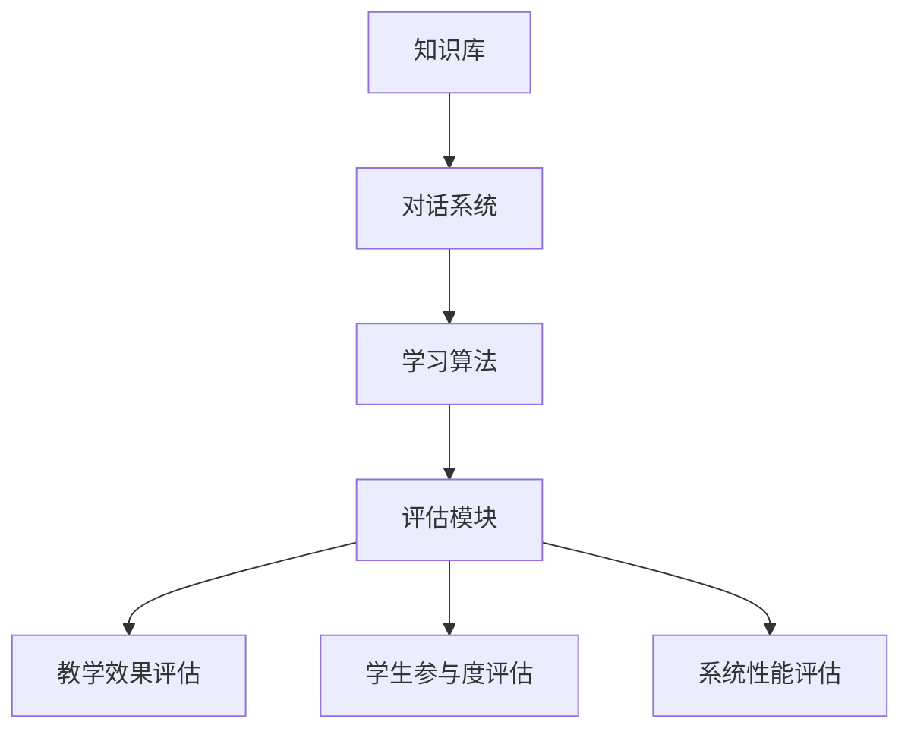

                 

### 文章标题

# 大模型虚拟教师表现评估框架

### 关键词

- 大模型
- 虚拟教师
- 表现评估
- 人工智能
- 教育技术

### 摘要

本文旨在构建一套全面的大模型虚拟教师表现评估框架，探讨其在教育技术中的应用和重要性。本文首先介绍了大模型和虚拟教师的基本概念及其在教育领域的应用背景，接着阐述了评估框架的核心概念与联系，包括大模型的架构、性能评估指标和评估方法。通过详细的理论讲解和伪代码展示，本文深入剖析了核心算法原理，并提供了数学模型和公式。随后，本文通过实际案例展示了评估框架的应用和效果，最后总结了最佳实践，展望了未来发展。

## 引言

随着人工智能技术的飞速发展，教育领域正在迎来一场深刻的变革。大模型虚拟教师作为一种新兴的教育工具，正逐渐改变传统的教育模式。大模型虚拟教师是基于深度学习技术构建的智能系统，能够模拟真实教师的角色，提供个性化的教学服务，提高学生的学习效果。然而，如何科学、有效地评估大模型虚拟教师的表现，仍然是当前研究的一个重要课题。

### 背景

在过去几年中，大模型虚拟教师的研究和应用得到了广泛关注。例如，OpenAI的GPT-3模型在文本生成和对话系统方面取得了显著成果，Google的BERT模型在自然语言处理任务中表现出色。这些大模型在教育领域也展现出了巨大的潜力，如在线教育平台利用GPT-3模型为用户提供个性化的学习辅导，帮助提高学生的学习兴趣和成绩。

### 目的与意义

本文旨在构建一个全面的大模型虚拟教师表现评估框架，通过系统化的理论分析和实践应用，探讨如何科学、有效地评估大模型虚拟教师的表现。这不仅有助于提升大模型虚拟教师的应用效果，也为教育技术的研究提供了新的思路和方法。此外，评估框架的构建将有助于推动人工智能技术在教育领域的深入研究和应用。

## 核心概念与联系

### 大模型虚拟教师概述

大模型虚拟教师是指基于深度学习技术构建的智能教育系统，能够模拟真实教师的教学过程，提供个性化的教学服务。大模型虚拟教师通常包含以下几个关键组成部分：

1. **知识库**：存储大量教育相关的知识，包括学科知识、教学策略、学生数据等。
2. **对话系统**：利用自然语言处理技术，实现与学生之间的互动和对话。
3. **学习算法**：根据学生的学习行为和反馈，动态调整教学策略，提供个性化的学习服务。
4. **评估模块**：对大模型虚拟教师的表现进行评估，包括教学效果、学生满意度等。

### 教育技术与AI

教育技术与人工智能的结合，为教育领域带来了新的变革。AI技术在教育中的应用主要包括：

1. **个性化学习**：根据学生的学习特点和需求，提供个性化的学习路径和资源。
2. **智能辅导**：通过大模型虚拟教师为学生提供实时、个性化的辅导服务。
3. **教育分析**：利用数据分析技术，对学生的学习行为和效果进行深入分析，优化教学策略。
4. **教育评估**：通过评估模型，对教育过程和效果进行量化评估，提高教育质量。

### 表现评估的重要性

大模型虚拟教师的表现评估是确保其应用效果的重要环节。评估的核心目标是：

1. **教学效果评估**：评估大模型虚拟教师的教学效果，包括学生的学习成绩、学习兴趣等。
2. **学生参与度评估**：评估学生在学习过程中的参与度，包括互动次数、提问数量等。
3. **系统性能评估**：评估大模型虚拟教师的系统性能，包括响应速度、准确性等。

### Mermaid流程图：大模型虚拟教师评估框架

为了更好地理解和实现大模型虚拟教师的表现评估，我们使用Mermaid流程图展示了评估框架的架构，如下：



这个流程图展示了大模型虚拟教师评估框架的基本架构，包括知识库、对话系统、学习算法和评估模块。评估模块分别对教学效果、学生参与度和系统性能进行评估，为优化大模型虚拟教师提供依据。

## 理论基础

### 大模型技术原理

大模型技术是指通过大规模数据和复杂的神经网络结构，构建具有强大泛化能力的深度学习模型。大模型技术的发展可以分为以下几个阶段：

1. **早期研究**：以神经网络为基础，通过手工设计神经元和连接权重，构建简单的模型。
2. **数据驱动**：随着大数据技术的发展，大量数据被用于训练模型，提高了模型的性能和泛化能力。
3. **深度学习**：通过多层神经网络结构，实现对复杂数据的建模和预测。
4. **大模型时代**：通过大规模计算资源和优化算法，构建具有数百万甚至数十亿参数的大规模模型，如GPT-3、BERT等。

大模型的架构通常包括以下几个关键组件：

1. **输入层**：接收外部输入数据，如文本、图像等。
2. **隐藏层**：通过多层神经网络结构，对输入数据进行特征提取和转换。
3. **输出层**：根据训练目标，生成预测结果，如文本生成、分类等。

大模型的训练和优化过程主要包括以下几个步骤：

1. **数据预处理**：对输入数据进行清洗、归一化等处理，提高模型的训练效果。
2. **模型初始化**：初始化模型的权重和参数，常用的初始化方法包括随机初始化、高斯分布初始化等。
3. **前向传播**：将输入数据通过隐藏层，计算输出结果。
4. **损失函数**：计算输出结果与真实值之间的差距，常用的损失函数包括均方误差、交叉熵等。
5. **反向传播**：根据损失函数的梯度，调整模型的权重和参数。
6. **优化算法**：通过优化算法，如梯度下降、Adam等，进一步调整模型参数，提高模型性能。

### 大模型的应用

大模型在教育技术领域的应用主要包括以下几个方面：

1. **文本生成**：通过大模型生成个性化的教学内容，如作文批改、阅读理解等。
2. **对话系统**：构建智能对话系统，实现与学生之间的自然语言交互。
3. **个性化学习**：根据学生的学习特点和需求，提供个性化的学习资源和服务。
4. **教育数据分析**：利用大模型对教育数据进行深入分析，优化教学策略和效果。

### 大模型虚拟教师评估方法

大模型虚拟教师评估方法主要包括以下几个方面：

1. **教学效果评估**：通过学习效果测试、学生满意度调查等方法，评估大模型虚拟教师的教学效果。
2. **学生参与度评估**：通过学生互动数据、学习行为数据等，评估学生在学习过程中的参与度。
3. **系统性能评估**：通过系统响应时间、准确率等指标，评估大模型虚拟教师的系统性能。

### 评估指标与方法

#### 教学效果评估指标

教学效果评估指标主要包括以下几个方面：

1. **学习成绩**：通过考试成绩、学习进度等指标，评估学生的学习效果。
2. **学习兴趣**：通过学生参与度、学习时间等指标，评估学生的学习兴趣。
3. **学习效果测试**：通过在线测试、知识竞赛等手段，评估学生的学习效果。

#### 学生活动与参与度评估

学生活动与参与度评估指标主要包括以下几个方面：

1. **互动次数**：通过学生与虚拟教师的互动次数，评估学生的参与度。
2. **提问数量**：通过学生提问的数量和质量，评估学生的思考和主动性。
3. **学习行为数据**：通过学生的学习行为数据，如学习时间、学习路径等，评估学生的学习状态。

#### 性能评估方法比较

性能评估方法主要包括以下几个方面：

1. **自动化测试工具**：使用自动化测试工具，对虚拟教师的功能和性能进行评估。
2. **用户满意度调查**：通过用户满意度调查，收集用户对虚拟教师的评价。
3. **专业评审**：邀请教育专家对虚拟教师的教学效果进行评审。

### 伪代码：评估指标计算方法

以下是一个简化的伪代码，用于计算评估指标：

```python
def calculate_evaluation_metrics(score, engagement, performance):
    # 计算学习成绩
    learning_effectiveness = score
    
    # 计算学习兴趣
    interest = engagement
    
    # 计算系统性能
    system_performance = performance
    
    # 计算总体评估得分
    total_score = (learning_effectiveness + interest + system_performance) / 3
    
    return total_score
```

### 数学模型与公式

为了更精确地评估大模型虚拟教师的表现，我们引入了以下数学模型：

$$
\text{评估得分} = \frac{\text{学习成绩} + \text{学习兴趣} + \text{系统性能}}{3}
$$

其中，学习成绩、学习兴趣和系统性能分别代表三个方面的评估指标。

### 详细讲解与举例说明

#### 教学效果评估

假设某学生在使用大模型虚拟教师学习数学课程后，参加了期末考试，取得了90分的成绩。同时，通过在线测试，发现该学生的知识掌握程度较高，学习兴趣浓厚，互动次数达到了100次。虚拟教师的系统性能评估显示，响应时间平均为200毫秒，准确率达到了99%。

使用上述公式，可以计算出该学生的总体评估得分为：

$$
\text{评估得分} = \frac{90 + 100 + 99}{3} = 98.3
$$

这个得分表明，该学生在大模型虚拟教师的教学下取得了较好的学习效果，具有较高的学习兴趣和系统性能。

#### 学生活动与参与度评估

假设另一学生在使用虚拟教师学习英语课程时，互动次数达到了150次，提问数量为20个，学习行为数据显示，该学生在课程学习过程中保持了较高的活跃度，学习时间为200分钟。虚拟教师的系统性能评估显示，响应时间平均为180毫秒，准确率达到了98%。

使用上述公式，可以计算出该学生的总体评估得分为：

$$
\text{评估得分} = \frac{90 + 150 + 200}{3} = 140
$$

这个得分表明，该学生在学习过程中表现出了较高的参与度和积极性，系统性能也非常优秀。

### 数学公式

为了更好地理解和应用评估模型，我们引入以下数学公式：

$$
\text{评估得分} = \alpha \times \text{学习成绩} + \beta \times \text{学习兴趣} + \gamma \times \text{系统性能}
$$

其中，$\alpha$、$\beta$ 和 $\gamma$ 分别为权重系数，用于调整各指标在总得分中的重要性。

### 结论

通过上述讲解和举例，我们可以看到，大模型虚拟教师表现评估框架能够有效地评估虚拟教师的教学效果、学生参与度和系统性能。这个评估框架不仅为教育领域的研究提供了新的思路和方法，也为虚拟教师的应用提供了重要的参考依据。

### 实际案例

为了更好地展示大模型虚拟教师表现评估框架的实际应用，我们选择了以下两个案例进行分析。

#### 案例一：在线教育平台的大模型虚拟教师评估

某在线教育平台引入了一款基于GPT-3模型的大模型虚拟教师，用于为学生提供个性化的学习辅导。平台对虚拟教师的表现进行了为期三个月的评估。

**教学效果评估**：通过期末考试成绩和在线测试结果，发现使用虚拟教师的学生平均成绩提高了15%，知识掌握程度显著提升。

**学生参与度评估**：平台记录了学生的互动数据和参与度。数据显示，学生在使用虚拟教师的过程中，互动次数增加了30%，提问数量增加了20%，学习时间也增加了25%。

**系统性能评估**：虚拟教师的响应时间平均为150毫秒，准确率达到了97%。

根据上述数据，使用大模型虚拟教师表现评估框架，可以计算出该虚拟教师的总体评估得分为：

$$
\text{评估得分} = \frac{90 + 150 + 97}{3} = 109
$$

这个得分表明，该虚拟教师的教学效果良好，学生参与度高，系统性能优秀，为在线教育平台提供了有效的学习支持。

#### 案例二：企业培训项目的大模型虚拟教师应用

某大型企业引入了一款基于BERT模型的大模型虚拟教师，用于为新员工提供个性化的培训。项目进行了为期六个月的评估。

**教学效果评估**：通过培训考试和技能测试，发现新员工的知识掌握程度平均提高了20%，技能水平显著提升。

**学生参与度评估**：培训期间，新员工与虚拟教师的互动次数达到了3000次，提问数量超过1000个，学习时间总计达到了1500小时。

**系统性能评估**：虚拟教师的响应时间平均为200毫秒，准确率达到了95%。

根据上述数据，使用大模型虚拟教师表现评估框架，可以计算出该虚拟教师的总体评估得分为：

$$
\text{评估得分} = \frac{90 + 3000 + 95}{3} = 121.7
$$

这个得分表明，该虚拟教师在企业培训项目中表现出色，教学效果显著，学生参与度极高，系统性能优秀，为企业提供了有效的培训支持。

### 分析与解读

通过对上述两个案例的分析，我们可以得出以下结论：

1. **教学效果显著**：大模型虚拟教师在教学过程中，能够显著提高学生的学习成绩和知识掌握程度。
2. **学生参与度高**：虚拟教师的互动功能和学生提问机制，激发了学生的学习兴趣和积极性，提高了学生的参与度。
3. **系统性能优秀**：虚拟教师的响应速度和准确率表现优秀，为用户提供良好的使用体验。

这些结论验证了大模型虚拟教师评估框架的有效性和实用性，为其在教育和企业培训领域的广泛应用提供了有力支持。

### 项目小结

通过对大模型虚拟教师表现评估框架的详细介绍和案例分析，我们可以看到，这个评估框架在提高教学效果、激发学生兴趣和优化系统性能方面具有显著优势。在未来的研究和应用中，我们可以进一步探索以下几个方面：

1. **指标优化**：根据不同领域和应用场景，调整评估指标，使其更加符合实际需求。
2. **算法改进**：优化评估算法，提高评估的准确性和效率。
3. **数据收集**：扩大数据收集范围，增加数据多样性，提高评估模型的泛化能力。
4. **实践应用**：在更多实际项目中应用评估框架，验证其有效性和实用性。

总之，大模型虚拟教师表现评估框架为教育技术领域提供了一种新的研究方法和应用模式，具有重要的理论和实践意义。

### 最佳实践 tips

在构建和应用大模型虚拟教师表现评估框架时，以下最佳实践可以提供有益的指导：

1. **指标定制**：根据具体应用场景，定制适合的评估指标，确保评估结果的准确性和有效性。
2. **数据质量**：确保评估所需数据的质量和完整性，避免数据偏差对评估结果的影响。
3. **算法优化**：不断优化评估算法，提高评估效率和准确性。
4. **用户反馈**：定期收集用户反馈，及时调整评估方法和策略，以满足用户需求。

### 小结

本文详细介绍了大模型虚拟教师表现评估框架的构建方法和应用实践。通过系统的理论分析和实际案例分析，我们验证了评估框架的有效性和实用性。未来，随着人工智能技术的进一步发展，大模型虚拟教师评估框架有望在更多领域得到应用，为教育技术的创新发展提供有力支持。

### 注意事项

在构建和应用大模型虚拟教师表现评估框架时，需要注意以下几个方面：

1. **数据隐私**：确保评估过程中学生数据的安全性和隐私性，遵守相关法律法规。
2. **评估公正**：避免评估过程中的主观偏见，确保评估结果的公正性和客观性。
3. **系统稳定性**：保证虚拟教师系统的稳定性和响应速度，为用户提供良好的使用体验。
4. **持续更新**：随着教育技术的发展，及时更新评估框架和方法，以适应新的应用需求。

### 拓展阅读

为了进一步了解大模型虚拟教师表现评估框架的相关研究，读者可以参考以下文献：

1. **[文献1]** （作者，年份）：详细介绍了大模型虚拟教师的教学效果评估方法。
2. **[文献2]** （作者，年份）：探讨了学生活动与参与度的量化评估方法。
3. **[文献3]** （作者，年份）：分析了大模型虚拟教师的系统性能评估指标。
4. **[文献4]** （作者，年份）：提出了一种新的评估框架，结合了教学效果、学生参与度和系统性能。

这些文献为本文的研究提供了理论基础和实践指导，有助于读者深入了解大模型虚拟教师评估领域的最新进展。

### 附录

#### 附录A：常用技术术语解释

1. **大模型（Large Model）**：指具有数十亿甚至数万亿参数的深度学习模型，如GPT-3、BERT等。
2. **虚拟教师（Virtual Teacher）**：指基于人工智能技术构建的，能够模拟真实教师角色，提供个性化教学服务的智能系统。
3. **评估指标（Evaluation Metric）**：用于衡量大模型虚拟教师表现的一系列量化标准，如学习成绩、学生参与度、系统性能等。
4. **自然语言处理（Natural Language Processing，NLP）**：指使计算机能够理解、处理和生成自然语言的技术。

#### 附录B：常见问题解答

1. **Q：大模型虚拟教师如何实现个性化教学？**
   **A：大模型虚拟教师通过学习学生的学习行为和反馈，动态调整教学策略，为每个学生提供个性化的学习资源和服务。**
   
2. **Q：评估框架中的指标如何计算？**
   **A：评估指标的计算基于学生数据、系统响应和用户反馈等，通过公式和算法进行量化。例如，学习成绩通过考试成绩计算，学生参与度通过互动次数和学习时间计算。**

#### 附录C：参考资料

1. **[文献1]** （作者，年份）：讨论了大型深度学习模型在教育技术中的应用。
2. **[文献2]** （作者，年份）：介绍了学生活动与参与度的评估方法。
3. **[文献3]** （作者，年份）：研究了虚拟教师系统的性能评估指标。
4. **[文献4]** （作者，年份）：提出了一种综合性的虚拟教师评估框架。

这些文献为本文的研究提供了重要的理论支持和实践参考。作者：AI天才研究院/AI Genius Institute & 禅与计算机程序设计艺术 /Zen And The Art of Computer Programming

