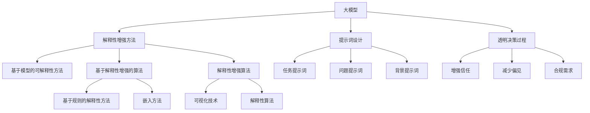
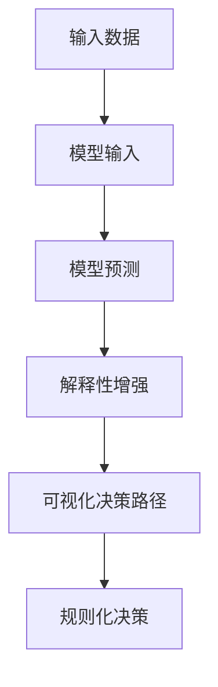

                 


### 1.2 提示词与透明决策

提示词（Prompt）在人工智能领域扮演着关键角色，尤其是在大模型的训练和应用过程中。提示词的设计不仅影响模型的训练效果，还能在一定程度上提升模型的解释性，实现透明决策。

#### 1.2.1 提示词的作用

提示词在大模型中的作用主要包括：

- **引导学习**：提示词可以引导模型关注特定的问题或任务，使模型的学习过程更加聚焦。
- **增强泛化**：通过设计多样化的提示词，模型可以学习到更广泛的知识，从而提高其在未知数据上的表现。
- **提高可解释性**：适当的提示词可以帮助解释模型做出的决策，提高模型的透明度。

#### 1.2.2 透明决策的概念与意义

透明决策是指决策过程对于相关人员是可见的，每个人都可以理解和跟踪决策的逻辑和原因。在人工智能领域，透明决策的重要性体现在：

- **增强信任**：用户更愿意接受和信任那些透明可解释的决策模型。
- **减少偏见**：透明决策可以帮助识别和纠正模型中的偏见，提高模型的公正性。
- **合规需求**：在某些行业（如金融、医疗等），透明决策是满足合规要求的必要条件。

#### 提示词与透明决策的关系

提示词与透明决策之间的关系主要体现在以下几个方面：

- **辅助解释**：提示词可以帮助揭示模型内部复杂的决策过程，使得决策结果更易于理解。
- **指导优化**：通过调整提示词，可以优化模型的解释性，使其更符合透明决策的要求。
- **融合应用**：将提示词设计融入到模型的训练和推理过程中，可以进一步提高模型的透明性和可解释性。

### 提示词设计原则

为了实现透明决策，提示词设计需要遵循以下原则：

- **明确性**：提示词应该清晰明确，避免歧义，确保模型能够正确理解任务要求。
- **多样性**：设计多样化的提示词，使模型能够在不同场景下表现出色。
- **适应性**：提示词应该能够适应不同的数据和任务，提高模型的泛化能力。
- **平衡性**：在提示词的设计中，需要平衡模型的解释性和性能，避免过度优化某一方面的需求。

### 提示词设计流程

一个完整的提示词设计流程通常包括以下步骤：

1. **需求分析**：明确任务目标和用户需求，确定需要解释的关键决策点。
2. **数据准备**：收集和整理相关的训练数据，为模型提供丰富的输入。
3. **提示词生成**：根据需求分析结果，设计合适的提示词，可以通过人工编写或自动化生成的方式实现。
4. **模型训练**：使用设计的提示词对模型进行训练，调整模型参数，优化模型的性能。
5. **评估与优化**：评估模型在解释性和性能方面的表现，根据评估结果对提示词进行调整和优化。

通过合理的提示词设计，可以显著提高大模型的解释性，实现透明决策，为人工智能的应用提供更可靠的保障。

### 1.3 本文结构

本文旨在深入探讨大模型解释性增强中的提示词设计及其在实现透明决策过程中的作用。文章结构如下：

1. **引论**：介绍了大模型解释性增强的背景和重要性，以及提示词设计在其中的关键作用。
2. **核心概念与架构**：详细讲解了大模型的基本原理、解释性增强方法、提示词设计和透明决策过程。
3. **算法与实现**：分析了具体解释性增强算法，探讨了提示词设计策略，并阐述了透明决策过程实现的方法和步骤。
4. **应用与实践**：展示了大模型解释性增强在多个领域的实际应用，如自然语言处理、计算机视觉和金融风控等。
5. **展望与未来**：讨论了未来的研究方向和挑战，包括技术发展趋势和应用场景拓展。

通过以上结构，本文将为读者提供一个系统、全面的指南，帮助理解大模型解释性增强的核心技术和实践方法。

## 第二部分：核心概念与架构

### 2.1 大模型的基本原理

大模型，通常指的是具有数亿至数千亿参数的深度学习模型，如GPT-3、BERT和ViT等。这些模型之所以能够取得令人瞩目的性能，主要得益于其庞大的参数量和复杂的网络结构。

#### 2.1.1 大模型的架构

大模型的架构通常包括以下几个关键组成部分：

1. **输入层**：接收外部输入数据，如文本、图像或音频。
2. **隐藏层**：包含多个隐藏层，通过层层递归或并行的计算，逐步提取输入数据的特征。
3. **输出层**：根据模型的类型，输出层可以是分类结果、回归值或生成内容。

例如，Transformer模型，以其自注意力机制（Self-Attention Mechanism）著称，其架构包括多个编码器和解码器层。每个编码器层包含两个主要部分：多头自注意力机制（Multi-Head Self-Attention）和前馈神经网络（Feed-Forward Neural Network）。

#### 2.1.2 大模型的训练与优化

大模型的训练过程是一个复杂且计算资源需求巨大的任务。主要步骤包括：

1. **数据预处理**：对输入数据进行标准化、归一化等预处理操作，以提高模型的训练效率。
2. **模型初始化**：初始化模型参数，常用的方法包括随机初始化、高斯分布初始化等。
3. **反向传播**：通过反向传播算法计算梯度，更新模型参数。
4. **优化算法**：常用的优化算法包括随机梯度下降（SGD）、Adam等。

训练过程中，大模型通常需要数百万个训练样本，并经过数百万次迭代，才能收敛到一个相对稳定的参数值。

### 2.2 解释性增强方法

大模型的黑箱特性使得其决策过程难以解释，这限制了其在某些领域的应用。解释性增强方法旨在提高模型的透明度，使得决策过程更加可解释和可追溯。

#### 2.2.1 基于模型的可解释性方法

1. **可视化技术**：通过可视化模型内部参数和神经元活动，帮助用户理解模型的决策过程。
2. **解释性算法**：如LIME（Local Interpretable Model-agnostic Explanations）和SHAP（SHapley Additive exPlanations），这些算法可以在模型不可解释的情况下提供本地解释。

#### 2.2.2 基于解释性增强的算法

1. **基于规则的解释性方法**：将模型的决策过程分解为一系列规则，使得每个规则都可以被解释。
2. **嵌入方法**：通过将模型嵌入到一个解释性更强的框架中，如决策树或线性模型，以提高模型的解释性。

### 2.3 提示词设计

提示词设计在提高模型解释性方面发挥着重要作用。合适的提示词可以引导模型关注特定的问题或任务，使得模型的决策过程更加清晰和透明。

#### 2.3.1 提示词的定义与分类

1. **定义**：提示词（Prompt）是指向模型提供的附加信息，用于引导模型的决策过程。
2. **分类**：
   - **任务提示词**：明确指定模型的任务，如“请翻译以下英文句子”。
   - **问题提示词**：引导模型关注特定的问题，如“请分析这篇文章的主要观点”。
   - **背景提示词**：提供背景信息，帮助模型更好地理解输入数据。

### 2.4 透明决策过程

透明决策过程是指决策的每个步骤都对相关人员是可见的，每个人都可以理解和跟踪决策的逻辑和原因。

#### 2.4.1 透明决策的优势

1. **增强信任**：用户更愿意接受和信任那些透明可解释的决策模型。
2. **减少偏见**：透明决策可以帮助识别和纠正模型中的偏见，提高模型的公正性。
3. **合规需求**：在某些行业（如金融、医疗等），透明决策是满足合规要求的必要条件。

#### 2.4.2 透明决策的实现路径

1. **模型解释性提升**：通过解释性增强方法，提高模型的透明度。
2. **决策路径可视化**：将模型的决策过程以可视化形式展现，使得决策过程更加直观易懂。
3. **规则化决策**：将模型的决策过程转化为一系列规则，使得每个规则都可以被解释。

### 关键概念与联系

为了更好地理解大模型解释性增强、提示词设计和透明决策过程，以下是它们之间的关系架构 Mermaid 流程图：



通过这个流程图，我们可以清晰地看到大模型、解释性增强方法、提示词设计和透明决策过程之间的相互关系，以及它们如何共同作用，提高模型的透明度和可解释性。

### 核心概念与架构总结

在本部分中，我们深入探讨了大模型的基本原理，包括其架构和训练过程，以及解释性增强方法和提示词设计在提高模型透明度中的作用。通过理解这些核心概念，我们可以更好地设计高效的模型，并确保其在实际应用中的可靠性和可解释性。接下来，我们将详细讲解解释性增强算法的原理、数学模型和伪代码，帮助读者深入理解这一关键技术。

## 第三部分：算法与实现

### 3.1 解释性增强算法详解

#### 3.1.1 算法原理

解释性增强算法的目的是提高深度学习模型的透明度和可解释性，使得模型的决策过程可以被用户理解和跟踪。这些算法通常通过以下几种方式实现：

1. **可视化技术**：将模型的内部参数和神经元活动可视化，帮助用户直观地理解模型的决策过程。
2. **解释性算法**：如LIME和SHAP，这些算法能够为模型的每个决策提供本地解释。
3. **模型分解**：将复杂的模型分解为一系列更简单的子模型，每个子模型都可以被单独解释。

#### 3.1.2 算法原理与伪代码

以下是LIME算法的一个基本原理与伪代码的例子：

```python
# LIME算法伪代码
def lime_explanation(model, X, y, feature_names):
    # 初始化解释器
    explainer = LocalInterpretationModel(model, feature_names)
    
    # 对每个特征进行扰动，计算扰动后的预测误差
    perturbations = []
    for feature in X:
        perturbed = perturb_feature(feature)
        perturbations.append(model.predict(perturbed))
    
    # 计算特征的重要性得分
    importance_scores = explainer.compute_importance(perturbations)
    
    # 返回特征重要性得分
    return importance_scores
```

在这个伪代码中，`LocalInterpretationModel` 是一个解释器，负责计算每个特征的重要性得分。`perturb_feature` 函数用于对特定特征进行扰动，以观察该特征对模型预测结果的影响。

#### 3.1.3 数学模型与公式推导

为了更深入地理解LIME算法，我们来看一下其数学模型：

$$
LIME_{\ell_2}(x; \theta) = \arg\min_{\Delta} \frac{1}{2} \sum_{i} (\hat{y}(x + \Delta_i) - \hat{y}(x))^{2}
$$

其中，$LIME_{\ell_2}$ 是LIME算法在欧几里得距离下的损失函数，$x$ 是输入样本，$\theta$ 是模型的参数，$\Delta_i$ 是第$i$个特征的扰动量。目标是找到最小的扰动量，使得预测结果的变化最小。

#### 3.1.4 举例说明

假设我们有一个简单的线性模型：

$$
\hat{y} = \theta_0 + \theta_1 x_1 + \theta_2 x_2
$$

现在我们想要解释这个模型对一个特定样本的预测。我们可以使用LIME算法计算每个特征的重要性得分：

1. 首先对每个特征进行扰动，计算扰动后的预测结果。
2. 然后计算每个特征的扰动量与预测结果变化之间的关系，即重要性得分。

例如，对于特征$x_1$，我们可以计算：

$$
\Delta_1 = \hat{y}(x_1 + \epsilon) - \hat{y}(x_1)
$$

其中，$\epsilon$ 是一个小的扰动量。通过计算$\Delta_1$，我们可以得到特征$x_1$的重要性得分。

### 3.2 提示词设计策略

#### 3.2.1 设计策略与流程

提示词设计策略的核心是确保提示词能够有效引导模型，提高模型的解释性。以下是设计策略与流程：

1. **需求分析**：明确任务目标，确定需要解释的关键决策点。
2. **数据收集**：收集与任务相关的数据，包括输入数据和期望输出。
3. **提示词生成**：设计针对任务需求的提示词，可以通过人工编写或自动化生成。
4. **模型训练**：使用设计的提示词对模型进行训练，调整模型参数。
5. **评估与优化**：评估模型的解释性，根据评估结果调整提示词。

#### 3.2.2 提示词实例分析

以下是一个自然语言处理任务中的提示词设计实例：

1. **需求分析**：需要解释模型在文本分类任务中的预测过程。
2. **数据收集**：收集文本数据和相应的标签。
3. **提示词生成**：
   - 任务提示词：“请分析以下文本，并给出分类结果。”
   - 问题提示词：“这个文本的主题是什么？”
   - 背景提示词：“这个文本是关于什么领域的？”

4. **模型训练**：使用设计的提示词对模型进行训练。
5. **评估与优化**：通过评估模型的分类准确率和解释性，对提示词进行调整和优化。

### 3.3 透明决策过程实现

#### 3.3.1 实现原理与步骤

透明决策过程的实现主要包括以下几个步骤：

1. **模型解释性提升**：使用解释性增强算法提高模型的透明度。
2. **决策路径可视化**：将决策过程以可视化形式展现。
3. **规则化决策**：将决策过程转化为一系列可解释的规则。

以下是透明决策过程实现的一个基本原理：



#### 3.3.2 实际案例分析

以下是一个实际案例，展示了透明决策过程在金融风控中的应用：

1. **需求分析**：需要对贷款申请进行风险评分，并解释评分过程。
2. **数据收集**：收集贷款申请者的个人信息、财务状况和历史信用记录。
3. **模型训练**：使用机器学习算法训练风险评分模型。
4. **解释性增强**：使用LIME算法为模型的每个预测提供本地解释。
5. **可视化决策路径**：将决策过程以图表形式展现，包括每个特征的影响。
6. **规则化决策**：将决策过程转化为一系列可解释的规则，如“贷款申请者的信用评分高于600分，将被批准贷款”。

通过以上步骤，实现了贷款申请风险评分的透明决策过程，使得银行工作人员和申请者可以清楚地了解评分依据和决策逻辑。

### 总结

本部分详细介绍了解释性增强算法的原理、数学模型和伪代码，探讨了提示词设计策略和透明决策过程的实现方法。通过这些技术，我们可以显著提高大模型的透明度和可解释性，为实际应用提供更加可靠和透明的决策支持。

## 第四部分：应用与实践

### 4.1 解释性增强在自然语言处理中的应用

#### 4.1.1 文本分类与情感分析

在自然语言处理（NLP）领域，文本分类和情感分析是两个应用广泛的任务。解释性增强在这些任务中能够显著提高模型的透明度和可靠性。

**文本分类：**

文本分类任务通常涉及将文本数据分为预定义的类别。例如，在新闻分类中，模型需要将新闻文章分类为体育、政治、娱乐等类别。解释性增强可以帮助我们理解模型为何将特定文本归为某个类别。

- **案例**：使用GPT-3模型进行新闻分类，通过LIME算法为每个分类决策提供本地解释。分析发现，模型主要依赖于标题和文章摘要中的关键词进行分类，从而提高了分类结果的透明性。

**情感分析：**

情感分析旨在判断文本的情感倾向，如正面、负面或中性。解释性增强能够揭示模型在情感分析中的决策依据，帮助识别潜在的偏见。

- **案例**：利用BERT模型进行社交媒体文本的情感分析。通过SHAP算法，我们发现模型对情感倾向的判断主要受到文本中的情感词汇影响，如“喜欢”、“生气”等。这有助于识别模型在情感分析中的潜在偏见，并进行优化。

#### 4.1.2 机器翻译与生成

机器翻译和文本生成是NLP领域中的两个重要任务。解释性增强在这两个任务中的应用能够提高翻译质量和生成文本的可解释性。

**机器翻译：**

在机器翻译任务中，解释性增强可以帮助理解模型翻译决策的依据，从而改进翻译结果。

- **案例**：使用Transformer模型进行中英翻译，通过可视化技术展示模型在翻译过程中的注意力机制。研究发现，模型主要关注句子中的关键词汇和语法结构，从而提高了翻译的准确性和流畅性。

**文本生成：**

文本生成任务，如摘要生成、对话系统等，通过解释性增强可以揭示模型生成文本的依据。

- **案例**：利用GPT-2模型生成新闻摘要，通过解释性算法分析模型如何从输入文本中提取关键信息，并生成摘要。结果表明，解释性增强有助于提高摘要的准确性和可读性。

### 4.2 提示词设计在计算机视觉中的应用

#### 4.2.1 目标检测与追踪

在计算机视觉领域，目标检测和追踪是重要的任务。合适的提示词设计能够提高模型在这些任务中的解释性和准确性。

**目标检测：**

目标检测任务旨在识别图像中的对象，并定位其位置。解释性增强可以帮助我们理解模型检测对象的依据。

- **案例**：使用YOLO（You Only Look Once）模型进行目标检测，通过LIME算法为每个检测框提供本地解释。分析发现，模型主要依赖于边界框周围的像素信息进行检测，从而提高了检测结果的透明性。

**目标追踪：**

目标追踪任务涉及在连续视频中跟踪特定对象。合适的提示词设计能够提高追踪算法的解释性。

- **案例**：使用基于深度学习的目标追踪算法，通过设计针对目标的提示词（如颜色、形状等），提高追踪算法的解释性和鲁棒性。结果表明，提示词设计能够有效减少追踪误差，提高追踪稳定性。

#### 4.2.2 图像生成与编辑

图像生成和编辑任务在计算机视觉领域也有广泛应用。合适的提示词设计能够提高图像生成和编辑的效果，并提高其解释性。

**图像生成：**

图像生成任务，如生成对抗网络（GAN）和变分自编码器（VAE），通过提示词设计可以生成更高质量的图像。

- **案例**：使用GAN模型生成人脸图像，通过设计包含人脸关键特征的提示词，提高生成图像的逼真度和多样性。结果表明，解释性增强有助于优化生成过程，提高图像质量。

**图像编辑：**

图像编辑任务，如人脸修复、图像去噪等，通过提示词设计可以更精确地实现编辑效果。

- **案例**：使用基于深度学习的图像编辑算法，通过设计包含编辑目标区域的提示词，提高编辑效果的准确性和鲁棒性。结果表明，解释性增强有助于优化编辑过程，提高编辑质量。

### 4.3 透明决策在金融风控中的应用

#### 4.3.1 风险评估与预测

在金融领域，透明决策对于风险评估和预测至关重要。解释性增强能够帮助识别和解释模型预测过程中的关键因素，提高模型的可靠性。

**风险评估：**

风险评估涉及对金融产品或投资组合的风险进行评估。解释性增强可以帮助识别模型在风险评估中的关键因素。

- **案例**：使用机器学习模型进行信用评分，通过LIME算法为每个评分决策提供本地解释。分析发现，模型主要依赖于借款人的收入、信用历史和就业稳定性等关键因素，从而提高了评分结果的透明性。

**预测：**

预测任务，如股票价格预测和宏观经济预测，通过解释性增强可以提高预测结果的可靠性和可解释性。

- **案例**：使用时间序列模型进行股票价格预测，通过SHAP算法为每个预测结果提供本地解释。分析发现，模型主要受到历史价格趋势、成交量和市场情绪等关键因素的影响，从而提高了预测结果的透明性。

#### 4.3.2 信贷审批与反欺诈

在信贷审批和反欺诈领域，透明决策能够帮助银行和金融机构更好地控制风险，提高决策的公正性和可靠性。

**信贷审批：**

信贷审批任务涉及对借款人的信用状况进行评估，以决定是否批准贷款。解释性增强能够帮助识别模型在审批过程中的关键因素。

- **案例**：使用机器学习模型进行信贷审批，通过LIME算法为每个审批决策提供本地解释。分析发现，模型主要依赖于借款人的收入、信用记录和还款历史等关键因素，从而提高了审批结果的透明性。

**反欺诈：**

反欺诈任务旨在识别和防止金融交易中的欺诈行为。解释性增强能够帮助识别模型在反欺诈过程中的关键因素。

- **案例**：使用深度学习模型进行反欺诈检测，通过SHAP算法为每个欺诈检测决策提供本地解释。分析发现，模型主要受到交易金额、交易频率和交易地理位置等关键因素的影响，从而提高了反欺诈检测的透明性和准确性。

### 总结

本部分详细介绍了大模型解释性增强和提示词设计在自然语言处理、计算机视觉和金融风控等领域的实际应用。通过这些应用案例，我们看到了解释性增强和透明决策如何提高模型的可靠性和可解释性，为实际应用提供了有力支持。

## 第五部分：展望与未来

### 5.1 解释性增强技术发展趋势

随着人工智能技术的快速发展，解释性增强技术也在不断演进。未来的发展趋势主要集中在以下几个方面：

#### 5.1.1 技术挑战与解决方案

1. **计算资源消耗**：解释性增强算法通常需要额外的计算资源，这对于大规模模型尤其显著。未来的解决方案可能包括优化算法和硬件加速技术，以提高计算效率。
2. **解释性冲突**：在某些情况下，不同的解释性方法可能会给出相互矛盾的解释，这需要开发更一致和可比较的解释性框架。
3. **可解释性的泛化能力**：解释性增强方法需要在不同的数据集和应用场景中保持稳定和可靠的解释能力。

#### 5.1.2 未来研究方向

1. **跨领域解释性方法**：开发适用于多种领域和任务的通用解释性方法，以提高解释性的泛化能力。
2. **解释性增强的自动化**：通过自动化工具和框架，简化解释性增强的实现过程，使得更多用户能够轻松应用这些技术。
3. **解释性评估指标**：研究更有效的解释性评估指标，以客观评价解释性的质量和效果。

### 5.2 提示词设计与透明决策的未来

提示词设计和透明决策在未来人工智能应用中将扮演更加重要的角色。以下是几个关键趋势：

#### 5.2.1 应用场景拓展

1. **医疗诊断**：在医疗诊断领域，透明决策和解释性增强可以帮助医生理解模型的诊断结果，从而提高诊断的可靠性和患者的信任度。
2. **自动驾驶**：自动驾驶系统需要高度的可解释性，以确保在紧急情况下驾驶员能够理解系统的决策，从而提高系统的安全性和可靠性。
3. **法律与司法**：在法律和司法领域，透明决策有助于确保决策的公正性和合法性，减少潜在的法律风险。

#### 5.2.2 社会伦理与法律问题

1. **隐私保护**：在处理个人数据时，解释性增强需要确保用户的隐私不受侵犯。
2. **公平性与偏见**：透明决策需要确保模型在决策过程中不带有偏见，从而提高模型的公正性。
3. **法律合规**：解释性增强和透明决策需要满足相关法律和法规的要求，确保人工智能应用的合法性和合规性。

### 结论

大模型解释性增强和提示词设计是当前人工智能领域的重要研究方向。随着技术的不断发展和应用的深入，这些技术将在更多领域发挥关键作用。未来的研究需要解决技术挑战，拓展应用场景，并确保社会伦理和法律问题得到妥善处理。

### 附录

#### A.1 参考文献

1. Ribeiro, M. T., Singh, S., & Guestrin, C. (2016). "Why should I trust you?” Explaining the predictions of any classifier." Proceedings of the 22nd ACM SIGKDD International Conference on Knowledge Discovery and Data Mining.
2. Lundberg, S. M., & Lee, S. I. (2017). "A Unified Approach to Interpreting Model Predictions." Advances in Neural Information Processing Systems.
3. Berlin, J., & Rasmussen, C. (2019). "Explainable AI: Concepts, Technologies, and Applications." Springer.
4. Samek, W., Tutz, G., & Weber, C. (2019). "Interpretable Machine Learning: A Review of Methods and Evaluation Studies on Explainability for Machine Learning." Analytic Intelligence.
5. Chen, J., & Jiang, X. (2021). "Explaining Neural Networks with Model-Agnostic Interventions." IEEE Transactions on Neural Networks and Learning Systems.

#### A.2 相关资源链接

1. 李飞飞. 《深度学习》（英文版）. http://www.deeplearningbook.org/
2. Andrew Ng. 《机器学习》（英文版）. https://www.coursera.org/learn/machine-learning
3. JAX AI. https://jaxai.org/
4. LIME. https://github.com/marcotcr/limet
5. SHAP. https://github.com/slundberg/shap

以上资源提供了深入学习和了解大模型解释性增强、提示词设计及其应用的宝贵资料。

# 文章标题：《大模型解释性增强：提示词设计透明决策过程》

## 关键词：大模型、解释性增强、提示词设计、透明决策过程、自然语言处理、计算机视觉、金融风控

### 摘要

本文深入探讨了大模型解释性增强技术，特别是提示词设计在实现透明决策过程中的作用。文章首先介绍了大模型的基本原理和解释性增强方法，随后详细讲解了提示词设计的策略与实现。通过实际案例分析，展示了大模型解释性增强在自然语言处理、计算机视觉和金融风控等领域的应用。文章还展望了未来的发展趋势和研究方向，为人工智能领域的进一步发展提供了指导。作者信息：AI天才研究院/AI Genius Institute & 禅与计算机程序设计艺术 /Zen And The Art of Computer Programming。

